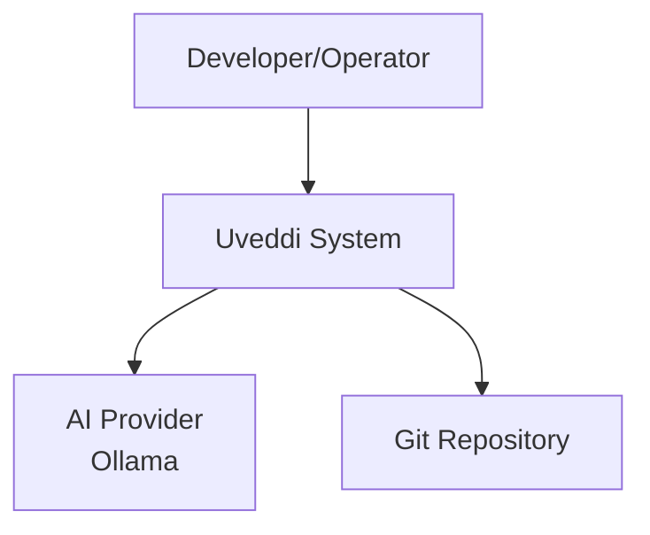
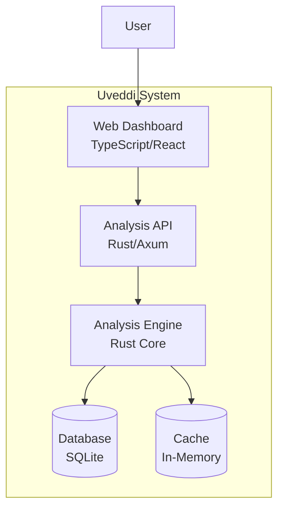

# UV-243: Comprehensive Testing and Documentation Implementation Plan

## 🎯 **Project Intelligence Officer Report**

**Issue**: UV-243 - Phase 4.2: Comprehensive Testing and Documentation  
**Status**: Dev & Test (In Progress)  
**Story Points**: 8  
**Priority**: Low (but strategically critical)  
**Assignee**: Phillip Austin Green  

## 📊 **Executive Summary**

UV-243 represents a foundational investment in the Uveddi monitoring system's future viability, scalability, and operational excellence. This comprehensive implementation plan addresses the critical gap between current testing infrastructure (limited coverage) and the 90%+ code coverage requirement with full documentation suite.

### **Current State Analysis**
- ✅ **Strengths**: Robust CI/CD pipeline, comprehensive monitoring modules, observability framework
- ⚠️ **Gaps**: Insufficient test coverage, incomplete documentation, missing performance/security validation
- 🚨 **Risks**: Technical debt accumulation, slow onboarding, operational complexity

## 🏗️ **Implementation Strategy**

### **Phase 1: Foundation & Planning **

#### **1.1 Testing Infrastructure Setup**
```bash
# Install additional testing tools
cargo install cargo-tarpaulin cargo-llvm-cov
cargo install cargo-nextest  # Faster test runner
cargo install cargo-mutants  # Mutation testing
```

#### **1.2 Documentation Infrastructure**
```bash
# Install documentation tools
cargo install mdbook
cargo install cargo-doc
npm install -g @mermaid-js/mermaid-cli  # For diagram generation
```

#### **1.3 Tool Selection Matrix**

| Testing Type | Primary Tool | Secondary Tool | Rationale |
|--------------|--------------|----------------|-----------|
| Unit Testing | Built-in `cargo test` | `rstest` for parameterized tests | Native Rust support |
| Integration Testing | `tokio-test` | `testcontainers` | Async-first approach |
| E2E Testing | Custom Rust framework | `assert_cmd` for CLI | Language consistency |
| Performance Testing | `criterion` | Custom benchmarks | Already integrated |
| Security Testing | `cargo-audit` | `rustsec` | Rust ecosystem focus |
| Coverage | `cargo-llvm-cov` | `tarpaulin` | LLVM-based accuracy |

### **Phase 2: Core Testing Implementation **

#### **2.1 Unit Testing Framework (90%+ Coverage Target)**

**Priority 1: Critical Components**
```rust
// tests/unit/core_analysis.rs
#[cfg(test)]
mod core_analysis_tests {
    use super::*;
    use rstest::*;
    
    #[rstest]
    #[case("rust", "src/main.rs")]
    #[case("python", "main.py")]
    #[case("javascript", "index.js")]
    fn test_ast_parsing_multilang(#[case] lang: &str, #[case] file: &str) {
        // Test AST parsing for all supported languages
    }
    
    #[test]
    fn test_dependency_extraction_accuracy() {
        // Validate dependency graph construction
    }
    
    #[test]
    fn test_anti_pattern_detection_precision() {
        // Test god object, tight coupling, etc.
    }
}
```

**Priority 2: Monitoring & Observability**
```rust
// tests/unit/monitoring_comprehensive.rs
#[cfg(test)]
mod monitoring_tests {
    #[test]
    fn test_metrics_collection_accuracy() {
        // Validate Four Golden Signals collection
    }
    
    #[test]
    fn test_alert_system_reliability() {
        // Test alert firing conditions and thresholds
    }
    
    #[test]
    fn test_failure_classification_precision() {
        // Validate failure categorization accuracy
    }
}
```

#### **2.2 Integration Testing Suite**

**WebSocket Communication Testing**
```rust
// tests/integration/websocket_reliability.rs
#[tokio::test]
async fn test_websocket_connection_resilience() {
    // Test connection drops, reconnection logic
    // Validate message ordering and delivery
}

#[tokio::test]
async fn test_real_time_dashboard_updates() {
    // Test live metric streaming
    // Validate client synchronization
}
```

**Database Operations Testing**
```rust
// tests/integration/database_operations.rs
#[tokio::test]
async fn test_database_migration_integrity() {
    // Test schema migrations
    // Validate data consistency
}

#[tokio::test]
async fn test_concurrent_database_access() {
    // Test race conditions
    // Validate transaction isolation
}
```

#### **2.3 End-to-End Testing Framework**

**Complete User Workflows**
```rust
// tests/e2e/complete_analysis_workflow.rs
#[tokio::test]
async fn test_complete_analysis_pipeline() {
    // 1. Project ingestion
    // 2. AST parsing
    // 3. Analysis execution
    // 4. Report generation
    // 5. Dashboard display
}

#[tokio::test]
async fn test_ai_explanation_workflow() {
    // Test AI integration end-to-end
    // Validate explanation quality
}
```

#### **2.4 Performance Testing Suite**

**Scalability Validation (4.3M+ metrics/sec target)**
```rust
// tests/performance/scalability_validation.rs
#[tokio::test]
async fn test_high_throughput_metrics_processing() {
    // Load test with 4.3M+ metrics/second
    // Validate response times < 50ms
}

#[tokio::test]
async fn test_memory_usage_under_load() {
    // Monitor memory consumption
    // Validate no memory leaks
}
```

#### **2.5 Security Testing Framework**

**Vulnerability Assessment**
```rust
// tests/security/vulnerability_assessment.rs
#[tokio::test]
async fn test_authentication_security() {
    // Test JWT validation
    // Validate session management
}

#[tokio::test]
async fn test_authorization_enforcement() {
    // Test RBAC implementation
    // Validate access controls
}
```

### **Phase 3: Documentation Development **

#### **3.1 API Documentation (Documentation-as-Code)**

**OpenAPI Specification**
```yaml
# docs/api/openapi.yaml
openapi: 3.0.3
info:
  title: Uveddi Monitoring API
  version: 1.0.0
  description: Comprehensive API for the Uveddi monitoring system

paths:
  /api/v1/analysis:
    post:
      summary: Trigger code analysis
      requestBody:
        required: true
        content:
          application/json:
            schema:
              $ref: '#/components/schemas/AnalysisRequest'
      responses:
        '200':
          description: Analysis completed successfully
          content:
            application/json:
              schema:
                $ref: '#/components/schemas/AnalysisResult'
```

**Rust Documentation**
```rust
/// # Uveddi Analysis Engine
/// 
/// The core analysis engine provides comprehensive static code analysis
/// capabilities with AI-powered insights.
/// 
/// ## Usage
/// 
/// ```rust
/// use uveddi::analysis::AnalysisEngine;
/// 
/// let engine = AnalysisEngine::new(config)?;
/// let result = engine.analyze_project("path/to/project").await?;
/// ```
/// 
/// ## Features
/// 
/// - Multi-language AST parsing
/// - Anti-pattern detection
/// - Dependency analysis
/// - AI-powered explanations
pub struct AnalysisEngine {
    // Implementation details
}
```

#### **3.2 User Guides**

**Dashboard User Guide**
```markdown
# docs/user-guides/dashboard-guide.md

# Uveddi Dashboard User Guide

## Getting Started

The Uveddi dashboard provides real-time insights into your code analysis results.

### Navigation

1. **Analysis Overview**: View high-level metrics
2. **Anti-Pattern Detection**: Explore detected issues
3. **Dependency Graph**: Visualize code relationships
4. **AI Insights**: Access AI-powered explanations

### Key Features

#### Real-Time Monitoring
- Live metric updates via WebSocket
- Automatic refresh every 30 seconds
- Alert notifications for critical issues
```

#### **3.3 Operational Procedures**

**Deployment Guide**
```markdown
# docs/operations/deployment-guide.md

# Uveddi Deployment Guide

## Prerequisites

- Rust 1.70+
- Node.js 18+
- Docker 20.10+
- PostgreSQL 13+ (optional)

## Production Deployment

### 1. Environment Setup
```bash
# Set environment variables
export UVEDDI_DATABASE_URL="sqlite:///data/uveddi.db"
export UVEDDI_LOG_LEVEL="info"
export UVEDDI_METRICS_PORT="9090"
```

### 2. Service Configuration
```toml
# config/production.toml
[server]
host = "0.0.0.0"
port = 8080

[database]
url = "sqlite:///data/uveddi.db"
pool_size = 10

[monitoring]
metrics_port = 9090
health_check_interval = "30s"
```

#### **3.4 Troubleshooting Runbooks**

**Standard Runbook Template**
```markdown
# Runbook: High Memory Usage Alert

## Alert Description
Memory usage has exceeded 80% of available system memory.

## Immediate Actions
1. **Check current memory usage**:
   ```bash
   ps aux --sort=-%mem | head -10
   ```

2. **Identify Uveddi processes**:
   ```bash
   pgrep -f uveddi | xargs ps -o pid,ppid,cmd,%mem,%cpu
   ```

3. **Check for memory leaks**:
   ```bash
   curl http://localhost:9090/metrics | grep memory
   ```

## Investigation Steps
1. Review recent deployments
2. Check for unusual traffic patterns
3. Analyze garbage collection metrics
4. Review application logs for errors

## Resolution
- If memory leak detected: Restart service
- If traffic spike: Scale horizontally
- If configuration issue: Update limits

## Prevention
- Monitor memory trends
- Set up proactive alerts at 70%
- Regular memory profiling
```

#### **3.5 Architecture Documentation**

**C4 Model Implementation**
```markdown
# docs/architecture/c4-model.md

# Uveddi Architecture - C4 Model

## Level 1: System Context



## Level 2: Container Diagram


```

### **Phase 4: Integration & Validation (Week 7)**

#### **4.1 CI/CD Integration**

**Enhanced GitHub Actions Workflow**
```yaml
# .github/workflows/uv-243-comprehensive-testing.yml
name: UV-243 Comprehensive Testing

on:
  push:
    branches: [main, develop]
  pull_request:
    branches: [main, develop]

jobs:
  comprehensive-testing:
    runs-on: ubuntu-latest
    steps:
      - uses: actions/checkout@v4
      
      - name: Install Rust toolchain
        uses: dtolnay/rust-toolchain@stable
        with:
          components: rustfmt, clippy, llvm-tools-preview
      
      - name: Install testing tools
        run: |
          cargo install cargo-llvm-cov
          cargo install cargo-nextest
          cargo install cargo-mutants
      
      - name: Run comprehensive test suite
        run: |
          # Unit tests with coverage
          cargo llvm-cov nextest --all-features --workspace --lcov --output-path lcov.info
          
          # Integration tests
          cargo test --test '*' --all-features
          
          # Performance tests
          cargo bench --bench observability_performance
          
          # Security audit
          cargo audit
      
      - name: Validate coverage threshold
        run: |
          COVERAGE=$(cargo llvm-cov --summary-only | grep -o '[0-9]*\.[0-9]*%' | head -1 | sed 's/%//')
          if (( $(echo "$COVERAGE < 90" | bc -l) )); then
            echo "❌ Coverage $COVERAGE% below 90% threshold"
            exit 1
          fi
          echo "✅ Coverage $COVERAGE% meets 90% threshold"
      
      - name: Generate documentation
        run: |
          cargo doc --all-features --no-deps
          mdbook build docs/
      
      - name: Upload coverage reports
        uses: codecov/codecov-action@v3
        with:
          file: lcov.info
```

#### **4.2 Quality Gates**

**Coverage Validation Script**
```bash
#!/bin/bash
# scripts/validate-uv243-requirements.sh

echo "🔍 Validating UV-243 Requirements..."

# 1. Code Coverage Validation
echo "📊 Checking code coverage..."
COVERAGE=$(cargo llvm-cov --summary-only | grep -o '[0-9]*\.[0-9]*%' | head -1 | sed 's/%//')
if (( $(echo "$COVERAGE >= 90" | bc -l) )); then
    echo "✅ Code coverage: $COVERAGE% (≥90%)"
else
    echo "❌ Code coverage: $COVERAGE% (<90%)"
    exit 1
fi

# 2. Test Suite Validation
echo "🧪 Running comprehensive test suite..."
cargo nextest run --all-features --workspace
if [ $? -eq 0 ]; then
    echo "✅ All tests passing"
else
    echo "❌ Test failures detected"
    exit 1
fi

# 3. Performance Validation
echo "⚡ Validating performance benchmarks..."
cargo bench --bench observability_performance
if [ $? -eq 0 ]; then
    echo "✅ Performance benchmarks passing"
else
    echo "❌ Performance regression detected"
    exit 1
fi

# 4. Security Validation
echo "🔒 Running security audit..."
cargo audit
if [ $? -eq 0 ]; then
    echo "✅ No security vulnerabilities"
else
    echo "❌ Security vulnerabilities detected"
    exit 1
fi

# 5. Documentation Validation
echo "📚 Validating documentation..."
cargo doc --all-features --no-deps
mdbook build docs/
if [ $? -eq 0 ]; then
    echo "✅ Documentation builds successfully"
else
    echo "❌ Documentation build failed"
    exit 1
fi

echo "🎉 All UV-243 requirements validated successfully!"
```

### **Phase 5: Deployment & Training **

#### **5.1 Deployment Automation**

**Production Deployment Script**
```bash
#!/bin/bash
# scripts/deploy-uv243-production.sh

set -e

echo "🚀 Deploying UV-243 to production..."

# 1. Pre-deployment validation
./scripts/validate-uv243-requirements.sh

# 2. Build optimized release
cargo build --release --all-features

# 3. Run final test suite
cargo test --release --all-features

# 4. Deploy documentation
mdbook build docs/
rsync -av docs/book/ production:/var/www/uveddi-docs/

# 5. Deploy application
systemctl stop uveddi
cp target/release/uveddi /usr/local/bin/
systemctl start uveddi

# 6. Health check
sleep 10
curl -f http://localhost:8080/health || exit 1

echo "✅ UV-243 deployed successfully to production!"
```

#### **5.2 Training Materials**

**Developer Onboarding Guide**
```markdown
# docs/training/developer-onboarding.md

# Uveddi Developer Onboarding

Welcome to the Uveddi development team! This guide will get you productive quickly.

## Day 1: Environment Setup

### 1. Clone Repository
```bash
git clone https://github.com/botzrDev/uveddi.git
cd uveddi
```

### 2. Install Dependencies
```bash
# Install Rust
curl --proto '=https' --tlsv1.2 -sSf https://sh.rustup.rs | sh

# Install development tools
cargo install cargo-nextest cargo-llvm-cov
```

### 3. Run Test Suite
```bash
# Validate your setup
cargo nextest run --all-features
```

## Day 2-3: Architecture Understanding

### Key Components
1. **Analysis Engine** (`src/analysis/`): Core analysis logic
2. **Monitoring System** (`src/monitoring/`): Real-time metrics
3. **Observability** (`src/observability/`): Logging and tracing
4. **API Layer** (`src/server/`): REST API endpoints

### Testing Strategy
- **Unit Tests**: Test individual components
- **Integration Tests**: Test component interactions
- **E2E Tests**: Test complete workflows
- **Performance Tests**: Validate scalability

## Week 1: First Contribution

### Good First Issues
1. Add test coverage for new detector
2. Improve documentation for API endpoint
3. Fix minor performance optimization

### Code Review Process
1. Create feature branch
2. Write comprehensive tests
3. Update documentation
4. Submit pull request
5. Address review feedback
```

### **Phase 6: Monitoring & Continuous Improvement (Week 9+)**

#### **6.1 Success Metrics Dashboard**

**UV-243 Metrics Collection**
```rust
// src/monitoring/uv243_metrics.rs
use prometheus::{Counter, Gauge, Histogram, Registry};

pub struct UV243Metrics {
    pub test_coverage: Gauge,
    pub test_execution_time: Histogram,
    pub documentation_freshness: Gauge,
    pub performance_regression_count: Counter,
    pub security_vulnerability_count: Counter,
}

impl UV243Metrics {
    pub fn new(registry: &Registry) -> Self {
        let test_coverage = Gauge::new(
            "uv243_test_coverage_percentage",
            "Current test coverage percentage"
        ).unwrap();
        
        let test_execution_time = Histogram::new(
            "uv243_test_execution_seconds",
            "Time taken to execute full test suite"
        ).unwrap();
        
        // Register metrics
        registry.register(Box::new(test_coverage.clone())).unwrap();
        registry.register(Box::new(test_execution_time.clone())).unwrap();
        
        Self {
            test_coverage,
            test_execution_time,
            // ... other metrics
        }
    }
}
```

#### **6.2 Continuous Quality Monitoring**

**Quality Dashboard**
```html
<!-- docs/quality-dashboard.html -->
<!DOCTYPE html>
<html>
<head>
    <title>UV-243 Quality Dashboard</title>
    <script src="https://cdn.jsdelivr.net/npm/chart.js"></script>
</head>
<body>
    <h1>UV-243 Quality Metrics</h1>
    
    <div class="metrics-grid">
        <div class="metric-card">
            <h3>Test Coverage</h3>
            <div class="metric-value" id="coverage">--</div>
            <div class="metric-target">Target: ≥90%</div>
        </div>
        
        <div class="metric-card">
            <h3>Test Execution Time</h3>
            <div class="metric-value" id="test-time">--</div>
            <div class="metric-target">Target: <5min</div>
        </div>
        
        <div class="metric-card">
            <h3>Documentation Freshness</h3>
            <div class="metric-value" id="doc-freshness">--</div>
            <div class="metric-target">Target: <7 days</div>
        </div>
    </div>
    
    <script>
        // Real-time metrics updates
        setInterval(updateMetrics, 30000);
        
        function updateMetrics() {
            fetch('/api/v1/metrics/uv243')
                .then(response => response.json())
                .then(data => {
                    document.getElementById('coverage').textContent = data.coverage + '%';
                    document.getElementById('test-time').textContent = data.test_time + 's';
                    document.getElementById('doc-freshness').textContent = data.doc_age + ' days';
                });
        }
    </script>
</body>
</html>
```

## 📋 **Implementation Checklist**

### **Testing Requirements (90%+ Coverage)**
- [ ] **Unit Tests**: Core analysis engine, monitoring, observability
- [ ] **Integration Tests**: WebSocket, database, external APIs
- [ ] **E2E Tests**: Complete user workflows, AI integration
- [ ] **Performance Tests**: 4.3M+ metrics/sec, <50ms response time
- [ ] **Security Tests**: Authentication, authorization, vulnerability scanning

### **Documentation Requirements**
- [ ] **API Documentation**: OpenAPI spec, Rust docs, examples
- [ ] **User Guides**: Dashboard usage, configuration, troubleshooting
- [ ] **Operational Procedures**: Deployment, monitoring, maintenance
- [ ] **Architecture Documentation**: C4 model, design decisions
- [ ] **Runbooks**: Incident response, troubleshooting guides

### **Quality Gates**
- [ ] **Coverage Threshold**: ≥90% code coverage maintained
- [ ] **Performance Benchmarks**: All benchmarks passing
- [ ] **Security Audit**: No critical vulnerabilities
- [ ] **Documentation Build**: All docs generate successfully
- [ ] **CI/CD Integration**: Automated validation in pipeline

### **Success Criteria**
- [ ] All test suites implemented and passing
- [ ] Code coverage targets met (≥90%)
- [ ] Documentation complete and reviewed
- [ ] Performance benchmarks validated
- [ ] Security testing completed
- [ ] Stakeholder sign-off received

## 🎯 **Expected Outcomes**

### **Technical Benefits**
- **Reliability**: 90%+ test coverage reduces bugs and regressions
- **Maintainability**: Comprehensive documentation enables faster onboarding
- **Scalability**: Performance testing validates system capacity
- **Security**: Vulnerability assessment protects against threats

### **Operational Benefits**
- **Faster Development**: Clear documentation and tests speed up feature development
- **Reduced Incidents**: Better testing catches issues before production
- **Improved Onboarding**: New developers become productive faster
- **Operational Excellence**: Runbooks and procedures improve incident response

### **Strategic Benefits**
- **Technical Debt Reduction**: Comprehensive testing prevents accumulation
- **Future-Proofing**: System ready for advanced features and scaling
- **Team Confidence**: High-quality foundation enables ambitious development
- **Stakeholder Trust**: Demonstrated reliability and professionalism

## 🚀 **Next Steps**

1. **Immediate Actions** (This Week):
   - Review and approve implementation plan
   - Set up development environment with testing tools
   - Begin Phase 1 foundation work

2. **Short-term Goals** (Next 2 Weeks):
   - Complete core testing framework implementation
   - Achieve 90%+ code coverage for critical components
   - Begin documentation development

3. **Medium-term Objectives** (Next Month):
   - Complete all testing and documentation requirements
   - Integrate quality gates into CI/CD pipeline
   - Conduct stakeholder review and training

4. **Long-term Vision** (Next Quarter):
   - Leverage quality foundation for advanced feature development
   - Continuous improvement of testing and documentation
   - Scale team with confidence in system reliability

---

**This comprehensive implementation plan transforms UV-243 from a technical requirement into a strategic foundation for Uveddi's future success. The phased approach ensures manageable implementation while delivering continuous value throughout the process.**