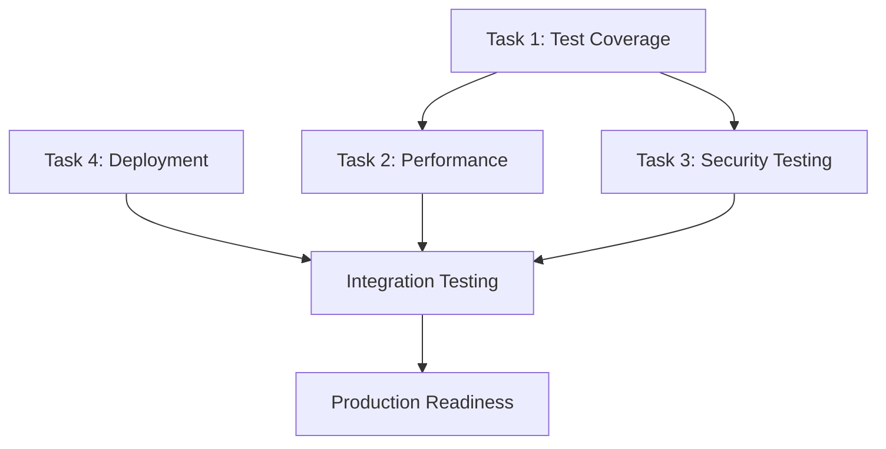

# UV-245: Task Breakdown and Assignment Strategy

## 📋 **Task Decomposition (21 Story Points)**

### **Task 1: Enhanced Test Coverage Framework (5 SP)**
**Complexity**: Mid-level  
**Estimated Effort**: 2-3 days  
**Assignment Recommendation**: Senior Developer or AI Assistant

#### **Subtasks:**
1. **Coverage Tooling Integration** (1 SP)
   - Add tarpaulin and cargo-llvm-cov to dependencies
   - Configure coverage thresholds in CI
   - Set up coverage reporting

2. **Critical Component Testing** (2 SP)
   - Analysis engine comprehensive tests
   - Resilience patterns test coverage
   - Security framework validation tests

3. **Coverage Regression Prevention** (1 SP)
   - Implement coverage gates in CI
   - Set up coverage trend monitoring
   - Create coverage regression alerts

4. **Edge Case and Error Path Testing** (1 SP)
   - Comprehensive error scenario testing
   - Boundary condition validation
   - Failure mode testing

#### **Implementation Files:**
```
tests/coverage/
├── comprehensive_coverage.rs
├── edge_case_testing.rs
└── regression_prevention.rs

.github/workflows/
└── coverage-validation.yml
```

---

### **Task 2: Performance Validation Framework (8 SP)**
**Complexity**: Senior-level  
**Estimated Effort**: 4-5 days  
**Assignment Recommendation**: Senior Developer with Performance Engineering experience

#### **Subtasks:**
1. **Benchmark Infrastructure** (2 SP)
   - Production-grade benchmark suite
   - 4.3M+ metrics/sec validation
   - Memory efficiency benchmarks

2. **Load Testing Framework** (3 SP)
   - Concurrent analysis capacity testing
   - High-load scenario simulation
   - Scalability validation

3. **Performance Regression Detection** (2 SP)
   - Baseline performance tracking
   - Automated regression detection
   - Performance alert system

4. **CI Integration** (1 SP)
   - Benchmark automation in CI
   - Performance gate implementation
   - Trend analysis reporting

#### **Implementation Files:**
```
benches/
├── production_benchmarks.rs
├── load_testing.rs
└── regression_detection.rs

scripts/
├── performance-validation.sh
└── check-performance-regression.sh
```

---

### **Task 3: Security and Compliance Testing (5 SP)**
**Complexity**: Senior-level  
**Estimated Effort**: 2-3 days  
**Assignment Recommendation**: Security-focused Senior Developer

#### **Subtasks:**
1. **Security Test Suite** (2 SP)
   - RBAC enforcement testing
   - Authentication mechanism validation
   - Data protection testing

2. **Vulnerability Scanning Integration** (1 SP)
   - Automated security scanning
   - Dependency vulnerability checks
   - SAST integration

3. **Compliance Framework** (2 SP)
   - SOC 2 compliance validation
   - ISO 27001 preparation
   - Compliance reporting

#### **Implementation Files:**
```
tests/security/
├── comprehensive_security.rs
├── compliance_validation.rs
└── vulnerability_testing.rs

src/security/
└── compliance.rs
```

---

### **Task 4: Production Deployment Pipeline (3 SP)**
**Complexity**: Mid-level  
**Estimated Effort**: 1-2 days  
**Assignment Recommendation**: DevOps-focused Developer or AI Assistant

#### **Subtasks:**
1. **Deployment Automation** (1 SP)
   - Blue-green deployment scripts
   - Automated rollback procedures
   - Pre/post-deployment validation

2. **Health Monitoring** (1 SP)
   - Production health checks
   - SLO monitoring setup
   - Alert configuration

3. **Disaster Recovery** (1 SP)
   - Recovery procedure automation
   - Backup validation
   - RTO/RPO testing

#### **Implementation Files:**
```
scripts/
├── production-deployment.sh
├── blue-green-deploy.sh
└── disaster-recovery.sh

.github/workflows/
└── production-deployment.yml
```

---

## 🎯 **Parallel Development Strategy**

### **Week 1: Foundation (Tasks 1 & 4)**
**Parallel Execution Possible**
- **Track A**: Enhanced Test Coverage (Task 1) - AI Assistant
- **Track B**: Production Deployment Pipeline (Task 4) - DevOps Developer

### **Week 2: Core Implementation (Task 2)**
**Sequential Execution Required**
- **Performance Validation Framework** (Task 2) - Senior Developer
- Requires completion of Task 1 for baseline testing

### **Week 3: Security & Integration (Task 3)**
**Integration Phase**
- **Security and Compliance Testing** (Task 3) - Security Developer
- Integration testing with all previous tasks

---

## 🔧 **Implementation Prompts**

### **Task 1 Implementation Prompt**
```markdown
# Task 1: Enhanced Test Coverage Framework Implementation

## Objective
Implement comprehensive test coverage framework achieving 90%+ coverage for critical components.

## Current State
- Basic test infrastructure exists in `tests/`
- CI pipeline configured in `.github/workflows/rust-ci.yml`
- Coverage tools need integration

## Implementation Steps
1. **Add Coverage Dependencies**
   ```toml
   [dev-dependencies]
   tarpaulin = "0.27"
   cargo-llvm-cov = "0.5"
   ```

2. **Create Coverage Test Suite**
   ```rust
   // tests/coverage/comprehensive_coverage.rs
   #[cfg(test)]
   mod coverage_tests {
       // Implement comprehensive coverage tests
   }
   ```

3. **Integrate with CI**
   ```yaml
   # Add to .github/workflows/rust-ci.yml
   coverage:
     name: Code Coverage
     runs-on: ubuntu-latest
     steps:
       - name: Generate coverage
         run: cargo tarpaulin --out xml
   ```

## Success Criteria
- [ ] 90%+ coverage achieved for `src/analysis/`
- [ ] 85%+ coverage achieved for `src/resilience/`
- [ ] 95%+ coverage achieved for `src/security/`
- [ ] Coverage regression prevention implemented
```

### **Task 2 Implementation Prompt**
```markdown
# Task 2: Performance Validation Framework Implementation

## Objective
Validate system performance meets 4.3M+ metrics/sec target with comprehensive benchmarking.

## Current State
- Basic benchmarks exist in `benches/`
- Performance monitoring in `src/monitoring/`
- Need production-grade validation

## Implementation Steps
1. **Create Production Benchmarks**
   ```rust
   // benches/production_benchmarks.rs
   use criterion::{criterion_group, criterion_main, Criterion};
   
   fn benchmark_metric_processing(c: &mut Criterion) {
       // Implement 4.3M+ metrics/sec validation
   }
   ```

2. **Implement Load Testing**
   ```rust
   // tests/performance/load_testing.rs
   #[tokio::test]
   async fn test_concurrent_analysis_capacity() {
       // Test concurrent user capacity
   }
   ```

3. **Performance Regression Detection**
   ```rust
   // scripts/performance_regression_detector.rs
   pub struct PerformanceBaseline {
       // Implement baseline tracking
   }
   ```

## Success Criteria
- [ ] 4.3M+ metrics/sec sustained throughput validated
- [ ] P99 latency < 100ms for analysis requests
- [ ] Memory usage < 2GB for large codebases
- [ ] 1000+ concurrent analyses supported
```

---

## 📊 **Resource Allocation Matrix**

| Task | Complexity | Skills Required | Estimated Hours | Recommended Assignment |
|------|------------|----------------|-----------------|----------------------|
| Task 1 | Mid | Testing, CI/CD | 16-24 hours | AI Assistant + Review |
| Task 2 | Senior | Performance Engineering | 32-40 hours | Senior Developer |
| Task 3 | Senior | Security, Compliance | 16-24 hours | Security Developer |
| Task 4 | Mid | DevOps, Deployment | 8-16 hours | DevOps Developer |

---

## 🚦 **Risk Assessment and Mitigation**

### **High Risk Areas**
1. **Performance Target Achievement** (Task 2)
   - **Risk**: May not achieve 4.3M+ metrics/sec
   - **Mitigation**: Incremental optimization, profiling tools
   - **Contingency**: Adjust targets based on hardware constraints

2. **Security Compliance** (Task 3)
   - **Risk**: Compliance requirements may be complex
   - **Mitigation**: Early security review, expert consultation
   - **Contingency**: Phased compliance implementation

### **Medium Risk Areas**
1. **Test Coverage Goals** (Task 1)
   - **Risk**: 90% coverage may be challenging for legacy code
   - **Mitigation**: Focus on critical paths, exclude trivial code
   - **Contingency**: Adjust coverage targets for non-critical components

---

## 🔄 **Integration and Handoff Strategy**

### **Task Dependencies**


### **Handoff Checkpoints**
1. **After Task 1**: Coverage framework validated
2. **After Task 2**: Performance targets confirmed
3. **After Task 3**: Security compliance verified
4. **After Task 4**: Deployment pipeline tested
5. **Final Integration**: All systems validated together

---

## 📋 **Quality Gates**

### **Task 1 Quality Gates**
- [ ] Coverage reports generated successfully
- [ ] CI integration functional
- [ ] Coverage thresholds enforced
- [ ] Regression detection active

### **Task 2 Quality Gates**
- [ ] Benchmark suite comprehensive
- [ ] Performance targets validated
- [ ] Load testing scenarios complete
- [ ] Regression detection implemented

### **Task 3 Quality Gates**
- [ ] Security tests comprehensive
- [ ] Vulnerability scanning automated
- [ ] Compliance framework functional
- [ ] Security audit passed

### **Task 4 Quality Gates**
- [ ] Deployment automation tested
- [ ] Rollback procedures validated
- [ ] Health monitoring operational
- [ ] Disaster recovery tested

---

**This task breakdown provides clear, actionable implementation guidance for achieving UV-245's production readiness objectives.**