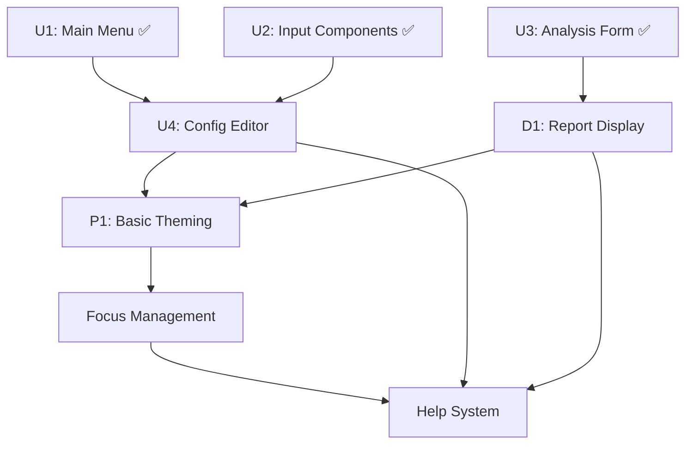

# 🎯 **UV-TUI-ENHANCEMENTS: TUI Integrations and Enhancements**

## 📋 **Issue Overview**
**Title**: TUI Integrations and Enhancements - Complete User Experience  
**Type**: Epic  
**Priority**: High  
**Sprint**: TUI Enhancement Sprint  
**Estimated Effort**: 20-30 hours total  

## 🎯 **Epic Description**
Enhance the Uveddi Terminal User Interface (TUI) with essential integrations and user experience improvements. This epic builds upon the completed foundation (U1 Main Menu, U2 Input Components, U3 Analysis Form) to create a fully functional, professional TUI that provides complete workflow coverage for code analysis.

## 📊 **Current State Assessment**

### ✅ **Completed Foundation**
- **U1 Main Menu Component**: ✅ Complete navigation system
- **U2 Basic Input Components**: ✅ Form input widgets  
- **U3 Analysis Form Layout**: ✅ Interactive analysis configuration
- **F1-F3 Foundation Tasks**: ✅ Dependencies, TEA structure, terminal init
- **E1 Basic Event Loop**: ✅ Event handling system

### 🚧 **Missing Components (This Epic)**
- **Config Editor**: Essential for TUI self-sufficiency
- **Report Display**: Complete the analysis workflow loop
- **Basic Theming**: Professional visual appeal
- **Focus Management**: Polished navigation experience
- **Help System**: User assistance and discoverability

## 🎯 **Epic Goals**

### **Primary Objectives**
1. **Complete Workflow Coverage**: Users can perform entire analysis workflow in TUI
2. **Professional User Experience**: Polished, themed interface with smooth navigation
3. **Self-Sufficient Operation**: No need to exit TUI for configuration or help
4. **Enhanced Usability**: Intuitive navigation with comprehensive user assistance

### **Success Metrics**
- [ ] Complete analysis workflow (configure → analyze → view results) works in TUI
- [ ] Professional visual appearance with consistent theming
- [ ] Smooth navigation between all components
- [ ] Comprehensive help system for user guidance
- [ ] Zero need to exit TUI for common operations

## 📋 **Sub-Tasks Breakdown**

### **🔧 Task 1: U4 - Config Editor Implementation**
**Priority**: High | **Effort**: 4-6 hours | **Complexity**: ⭐⭐⭐☆☆

**Description**: Implement comprehensive configuration management interface

**Requirements**:
- Interactive configuration editor with form-based interface
- Support for all configuration options (Ollama settings, detector thresholds, etc.)
- Real-time validation and error handling
- Save/load configuration files
- Environment variable integration

**Acceptance Criteria**:
- [ ] Configuration editor accessible from main menu
- [ ] All CLI configuration options available in TUI form
- [ ] Real-time validation with helpful error messages
- [ ] Save configuration to `uveddi.toml` file
- [ ] Load existing configuration on startup
- [ ] Support for environment variable overrides
- [ ] Keyboard navigation and shortcuts
- [ ] Integration with existing TEA architecture

**Implementation Notes**:
```rust
// src/tui/ui/config_editor.rs
pub struct ConfigEditor {
    pub config: AnalysisConfig,
    pub form_state: ConfigFormState,
    pub validation_errors: Vec<ValidationError>,
    pub current_section: ConfigSection,
}

pub enum ConfigSection {
    General,
    AI,
    Detectors,
    Output,
}
```

### **🎨 Task 2: P1 - Basic Theming System**
**Priority**: Medium | **Effort**: 3-4 hours | **Complexity**: ⭐⭐☆☆☆

**Description**: Implement professional theming system for visual enhancement

**Requirements**:
- Dark and light theme options
- Consistent color scheme across all components
- Theme persistence and user selection
- Accessibility considerations (contrast, colorblind-friendly)
- Professional branding integration

**Acceptance Criteria**:
- [ ] Dark and light theme implementations
- [ ] Theme selection in configuration editor
- [ ] Persistent theme settings
- [ ] Consistent styling across all TUI components
- [ ] High contrast ratios for accessibility
- [ ] Uveddi branding colors integrated
- [ ] Smooth theme switching without restart

**Implementation Notes**:
```rust
// src/tui/themes/mod.rs
pub struct Theme {
    pub name: String,
    pub primary: Color,
    pub secondary: Color,
    pub background: Color,
    pub text: Color,
    pub accent: Color,
    pub error: Color,
    pub success: Color,
    pub warning: Color,
}

pub enum ThemeType {
    Dark,
    Light,
    Custom(Theme),
}
```

### **📊 Task 3: D1 - Report Display Implementation**
**Priority**: High | **Effort**: 6-8 hours | **Complexity**: ⭐⭐⭐⭐☆

**Description**: Implement comprehensive report viewer for analysis results

**Requirements**:
- Display analysis reports in multiple formats (text, structured view)
- Navigate through issues by severity and type
- Detailed issue inspection with code context
- Export functionality for reports
- Integration with analysis form workflow

**Acceptance Criteria**:
- [ ] Report viewer accessible after analysis completion
- [ ] Multiple view modes (summary, detailed, by category)
- [ ] Issue navigation with keyboard shortcuts
- [ ] Code context display for issues
- [ ] Export reports to file (markdown, JSON, text)
- [ ] Search and filter functionality
- [ ] Integration with analysis form results
- [ ] Performance optimized for large reports

**Implementation Notes**:
```rust
// src/tui/ui/report_viewer.rs
pub struct ReportViewer {
    pub report: AnalysisReport,
    pub view_mode: ReportViewMode,
    pub selected_issue: Option<usize>,
    pub filter: ReportFilter,
    pub search_query: String,
}

pub enum ReportViewMode {
    Summary,
    IssueList,
    IssueDetail,
    Statistics,
}
```

### **🔧 Task 4: Focus Management System**
**Priority**: Medium | **Effort**: 2-3 hours | **Complexity**: ⭐⭐☆☆☆

**Description**: Implement polished focus management for smooth navigation

**Requirements**:
- Consistent focus indicators across all components
- Logical tab order and navigation flow
- Visual feedback for focused elements
- Keyboard shortcuts for quick navigation
- Focus memory for returning to previous states

**Acceptance Criteria**:
- [ ] Clear visual focus indicators on all interactive elements
- [ ] Logical tab order through all forms and menus
- [ ] Consistent keyboard shortcuts across components
- [ ] Focus memory when navigating between screens
- [ ] Visual feedback for focus state changes
- [ ] Accessibility compliance for screen readers
- [ ] Performance optimized focus updates

**Implementation Notes**:
```rust
// src/tui/focus.rs
pub struct FocusManager {
    pub focus_stack: Vec<FocusState>,
    pub current_focus: Option<ComponentId>,
    pub focus_history: VecDeque<FocusState>,
}

pub struct FocusState {
    pub component: ComponentId,
    pub element: Option<ElementId>,
    pub context: FocusContext,
}
```

### **❓ Task 5: Help System Implementation**
**Priority**: Medium | **Effort**: 3-4 hours | **Complexity**: ⭐⭐⭐☆☆

**Description**: Implement comprehensive help system for user assistance

**Requirements**:
- Context-sensitive help for all screens
- Keyboard shortcut reference
- User guide integration
- Search functionality for help topics
- Quick help tooltips and hints

**Acceptance Criteria**:
- [ ] Help accessible via F1 or ? key from any screen
- [ ] Context-sensitive help content for each component
- [ ] Comprehensive keyboard shortcut reference
- [ ] Search functionality for help topics
- [ ] Quick help tooltips for complex features
- [ ] User guide integration with examples
- [ ] Help content easily maintainable and updatable

**Implementation Notes**:
```rust
// src/tui/help.rs
pub struct HelpSystem {
    pub help_content: HashMap<ComponentId, HelpContent>,
    pub shortcuts: KeyboardShortcuts,
    pub search_index: HelpSearchIndex,
    pub current_context: Option<ComponentId>,
}

pub struct HelpContent {
    pub title: String,
    pub description: String,
    pub shortcuts: Vec<KeyBinding>,
    pub examples: Vec<HelpExample>,
}
```

## 🔗 **Task Dependencies**



## 🧪 **Testing Strategy**

### **Unit Testing Requirements**
```rust
// Each component must have comprehensive tests
#[cfg(test)]
mod tests {
    #[test]
    fn test_config_editor_validation() {
        // Test configuration validation logic
    }
    
    #[test]
    fn test_theme_switching() {
        // Test theme application and persistence
    }
    
    #[test]
    fn test_report_viewer_navigation() {
        // Test report navigation and filtering
    }
    
    #[test]
    fn test_focus_management() {
        // Test focus state transitions
    }
    
    #[test]
    fn test_help_system_search() {
        // Test help content search and retrieval
    }
}
```

### **Integration Testing**
- [ ] End-to-end workflow testing (config → analyze → view results)
- [ ] Theme consistency across all components
- [ ] Focus management across component transitions
- [ ] Help system accessibility from all contexts
- [ ] Performance testing with large reports

### **User Acceptance Testing**
- [ ] Complete workflow can be performed without exiting TUI
- [ ] Professional appearance and smooth navigation
- [ ] Intuitive user experience for new users
- [ ] Comprehensive help and guidance available
- [ ] Accessibility compliance verified

## 📊 **Performance Requirements**

### **Response Time Targets**
- [ ] Component switching: <100ms
- [ ] Theme switching: <200ms
- [ ] Report loading: <500ms for reports up to 1000 issues
- [ ] Help system search: <100ms
- [ ] Configuration validation: <50ms

### **Memory Usage**
- [ ] TUI memory footprint: <50MB
- [ ] Report viewer: Efficient handling of large reports (10k+ issues)
- [ ] Theme system: Minimal memory overhead
- [ ] Help system: Lazy loading of help content

## 🎯 **Implementation Guidelines**

### **Code Quality Standards**
- [ ] All code follows Rust best practices
- [ ] Comprehensive error handling with user-friendly messages
- [ ] No `unwrap()` calls - use proper error handling
- [ ] Consistent code style and documentation
- [ ] Performance optimized for responsive UI

### **User Experience Principles**
- [ ] Keyboard-first design with comprehensive shortcuts
- [ ] Consistent visual language across components
- [ ] Clear feedback for all user actions
- [ ] Graceful error handling with recovery options
- [ ] Accessibility considerations throughout

### **Integration Requirements**
- [ ] Seamless integration with existing TEA architecture
- [ ] Consistent with existing component patterns
- [ ] Proper state management and message passing
- [ ] Clean separation of concerns
- [ ] Maintainable and extensible design

## 🚀 **Delivery Timeline**

### **Phase 1: Core Functionality (Week 1)**
- **Days 1-2**: U4 Config Editor implementation
- **Days 3-4**: D1 Report Display implementation
- **Day 5**: Integration testing and bug fixes

### **Phase 2: Polish and Enhancement (Week 2)**
- **Days 1-2**: P1 Basic Theming implementation
- **Day 3**: Focus Management System
- **Day 4**: Help System implementation
- **Day 5**: Final integration, testing, and documentation

## 📋 **Definition of Done**

### **Technical Completion**
- [ ] All acceptance criteria met for each sub-task
- [ ] Comprehensive test coverage (>90%)
- [ ] Performance requirements met
- [ ] Code review completed and approved
- [ ] Documentation updated

### **User Experience Validation**
- [ ] End-to-end workflow testing completed
- [ ] User acceptance testing passed
- [ ] Accessibility compliance verified
- [ ] Professional appearance confirmed
- [ ] Help system comprehensive and useful

### **Integration Verification**
- [ ] Seamless integration with existing TUI components
- [ ] No regressions in existing functionality
- [ ] Consistent behavior across all platforms
- [ ] Memory and performance targets met
- [ ] Error handling robust and user-friendly

## 🔧 **Technical Architecture**

### **Component Structure**
```
src/tui/
├── ui/
│   ├── config_editor.rs     # U4: Configuration management
│   ├── report_viewer.rs     # D1: Report display
│   └── help_viewer.rs       # Help system
├── themes/
│   ├── mod.rs              # P1: Theme system
│   ├── dark.rs             # Dark theme
│   └── light.rs            # Light theme
├── focus.rs                # Focus management
└── help/
    ├── mod.rs              # Help system core
    ├── content.rs          # Help content
    └── search.rs           # Help search
```

### **State Management**
```rust
pub enum AppMessage {
    // Config Editor
    ConfigEditorOpen,
    ConfigValueChanged(String, String),
    ConfigSave,
    ConfigLoad,
    
    // Report Viewer
    ReportViewerOpen(AnalysisReport),
    ReportFilterChanged(ReportFilter),
    ReportIssueSelected(usize),
    ReportExport(ExportFormat),
    
    // Theme System
    ThemeChanged(ThemeType),
    ThemeToggle,
    
    // Focus Management
    FocusNext,
    FocusPrevious,
    FocusComponent(ComponentId),
    
    // Help System
    HelpOpen(Option<ComponentId>),
    HelpSearch(String),
    HelpClose,
}
```

## 🎯 **Success Criteria Summary**

This epic will be considered successful when:

1. **Complete Workflow**: Users can configure, analyze, and view results entirely within the TUI
2. **Professional Experience**: Polished, themed interface with smooth navigation
3. **User Self-Sufficiency**: Comprehensive help and configuration management
4. **Performance**: Responsive UI meeting all performance targets
5. **Quality**: High code quality with comprehensive testing

The result will be a professional, fully-functional TUI that provides an excellent user experience for Uveddi code analysis workflows.

---

**🎯 This epic transforms the Uveddi TUI from a functional prototype into a professional, production-ready interface that users will love to use.**