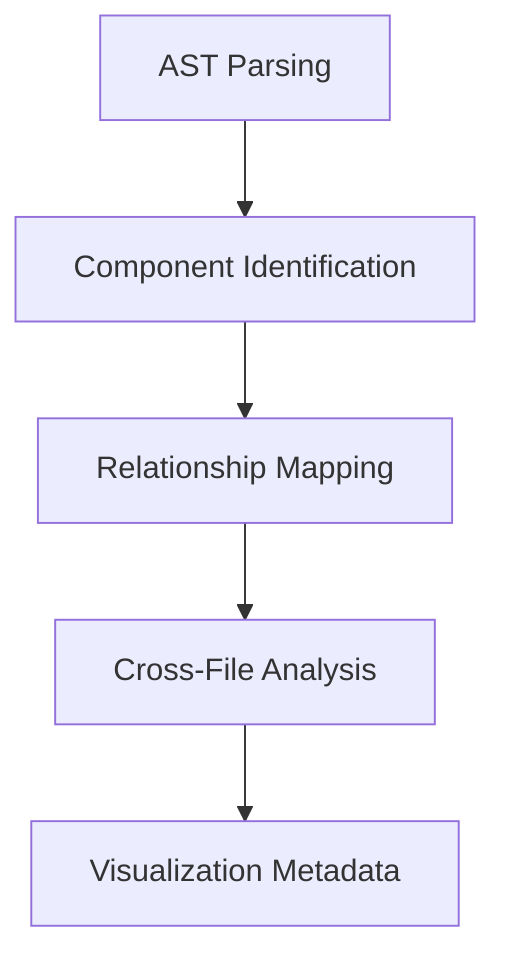
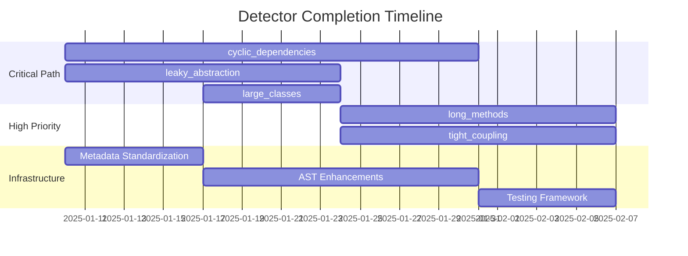

# Anti-Pattern Detector Implementation Plan (2025-01-07)

## 1. Detector Implementation Priorities

### Critical Path (Block visualization pipeline)
| Detector | Tasks | Estimated Effort |
|----------|-------|------------------|
| cyclic_dependencies | • Implement dependency graph analysis<br>• Add component relationship mapping<br>• Create visualization metadata generator | 3 sprints |
| leaky_abstraction | • Complete layer boundary validation<br>• Add architectural pattern detection<br>• Implement cross-file analysis | 2 sprints |
| large_classes | • Complete metrics collection (LCOM, CBO)<br>• Fix AST integration for JS/Python<br>• Add structural analysis | 1 sprint |

### High Priority
| Detector | Tasks | Estimated Effort |
|----------|-------|------------------|
| long_methods | • Create control flow analyzer<br>• Implement complexity metrics<br>• Add code segmentation | 2 sprints |
| tight_coupling | • Develop coupling coefficient algorithm<br>• Add dependency mapping<br>• Implement refactoring suggestions | 2 sprints |

### Medium Priority
| Detector | Tasks | Estimated Effort |
|----------|-------|------------------|
| magic_values | • Create constant detection<br>• Add configuration value tracking<br>• Implement enum conversion | 1 sprint |

## 2. Metadata Standardization

### Required Fields for Visualization
```rust
pub struct VisualizationMetadata {
    pub component_id: String,         // Unique component identifier
    pub component_type: String,       // Class, Function, Module, etc.
    pub coordinates: (u32, u32),      // Diagram positioning
    pub color_code: String,            // Severity-based coloring
    pub relationships: Vec<Relationship>, 
}

pub struct Relationship {
    pub target_id: String,
    pub rel_type: String,             // Dependency, Inheritance, Association
    pub strength: u8,                 // 1-100 coupling strength
}
```

### Implementation Tasks:
1. Add `VisualizationMetadata` struct to `src/models/mod.rs`
2. Modify all detectors to output standardized metadata
3. Create metadata aggregator service
4. Add severity normalization layer (0-100 scale)

## 3. AST Integration Enhancements

### Component Extraction Roadmap


### Key Tasks:
1. Implement cross-file AST analysis
2. Add parallel processing with Rayon
3. Create AST cache service
4. Develop relationship inference engine
5. Add architectural layer detection

## 4. Testing Strategy

### Test Coverage Targets
| Detector | Unit Tests | Integration Tests | Visualization Tests |
|----------|------------|-------------------|---------------------|
| All | 90%+ | 70%+ | 100% |

### Test Development Tasks:
1. Create visualization test harness
2. Generate anti-pattern corpus (200+ samples)
3. Implement snapshot testing for diagrams
4. Add performance benchmarks
5. Create fuzz testing module

## 5. Visualization Pipeline Preparation

### Required Workflow
```
Detectors → Metadata Aggregator → Diagram Generator → Rendering Service
```

### Implementation Tasks:
1. Build metadata aggregation service
2. Create Mermaid.js adapter
3. Develop PlantUML fallback module
4. Implement rendering service integration
5. Add interactive diagram capabilities

## Timeline & Resource Allocation



## Success Metrics
1. All detectors implemented by 2025-02-28
2. Visualization pipeline operational by 2025-03-07
3. 90% test coverage by 2025-03-14
