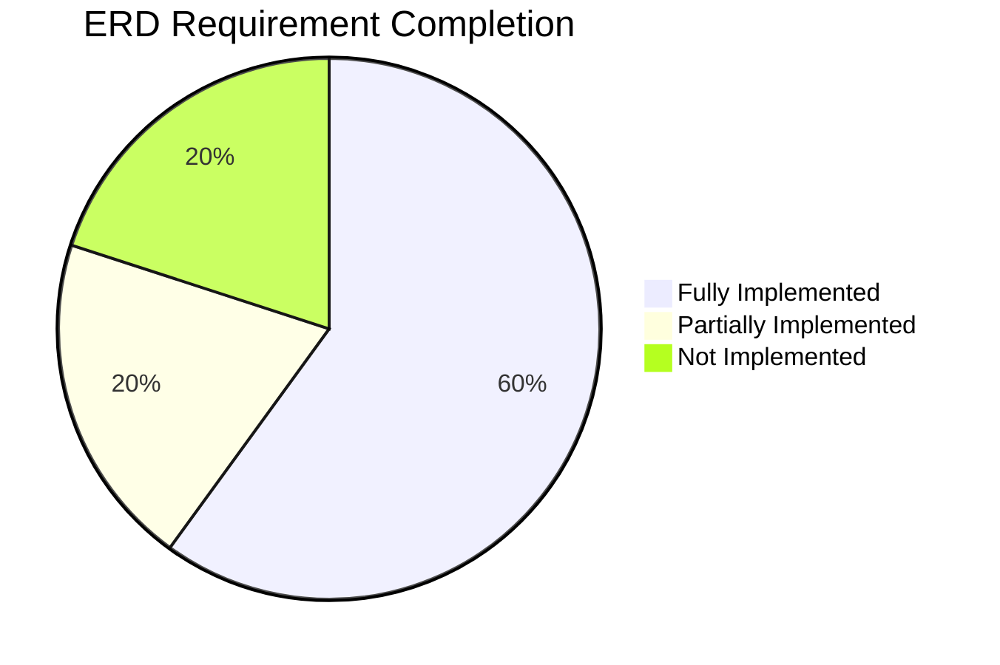

 ╭─────────────────────────────────────────────────────────────────────────────────────────────╮
 │ ✔  Shell ls -R (List all files recursively to get a comprehensive overview of the project…  │
 │                                                                                             │
 │    ... first 7034 lines hidden ...                                                          │
 │    s-h8q0ie76of-172lybj-5zofb373vo1zj68nlz06f1m3s                                           │
 │    s-h8q0ie76of-172lybj.lock                                                                │
 │                                                                                             │
 │    ./target/debug/incremental/unit_tests-1ck8k509d2ed0/s-h8q0ie76of-172lybj-5zof            │
 │    b373vo1zj68nlz06f1m3s:                                                                   │
 │    dep-graph.bin                                                                            │
 │    query-cache.bin                                                                          │
 │    work-products.bin                                                                        │
 │                                                                                             │
 │    ./target/debug/incremental/unit_tests-1dbjiyv072uyq:                                     │
 │    s-h8q3zeuowf-08x2i5i.lock                                                                │
 │    s-h8q3zeuowf-08x2i5i-working                                                             │
 │                                                                                             │
 │    ./target/debug/incremental/unit_tests-1dbjiyv072uyq/s-h8q3zeuowf-08x2i5i-work            │
 │    ing:                                                                                     │
 │    dep-graph.part.bin                                                                       │
 │                                                                                             │
 │    ./target/debug/incremental/unit_tests-1tehbzud8wniw:                                     │
 │    s-h8s5t1udg3-1r9x5lr-57w22vuskr0z0eqg8ed9w7mai                                           │
 │    s-h8s5t1udg3-1r9x5lr.lock                                                                │
 │                                                                                             │
 │    ./target/debug/incremental/unit_tests-1tehbzud8wniw/s-h8s5t1udg3-1r9x5lr-57w2            │
 │    2vuskr0z0eqg8ed9w7mai:                                                                   │
 │    dep-graph.bin                                                                            │
 │    query-cache.bin                                                                          │
 │    work-products.bin                                                                        │
 │                                                                                             │
 │    ./target/debug/incremental/unit_tests-22yv24zq381hg:                                     │
 │    s-h8q4csxq4v-1r3i7ln-7812uk9tss4mnzvd0xsi5ry80                                           │
 │    s-h8q4csxq4v-1r3i7ln.lock                                                                │
 │                                                                                             │
 │    ./target/debug/incremental/unit_tests-22yv24zq381hg/s-h8q4csxq4v-1r3i7ln-7812            │
 │    uk9tss4mnzvd0xsi5ry80:                                                                   │
 │    0xb9k4q18wuzfp49at3we6o55.o                                                              │
 │    3vf8lzmqjccixsbojrl635q9c.o                                                              │
 │    413cgwwdu87kc2ye5ki1cvg3q.o                                                              │
 │    5am3jdax2vp1iwpntaqoykj7q.o                                                              │
 │    7owpjjpx9s6oq6g289qh554wa.o                                                              │
 │    7wuian28vd4ylajauuhxmth8e.o                                                              │
 │    8n8sdkhnup1sjh08ykwmcdljo.o                                                              │
 │    8sgzy0coqppxhqu1fzobncht8.o                                                              │
 │    9289q8n3jp7fd34rdnejri925.o                                                              │
 │    9ampr44w40aeabpad6zpbc094.o                                                              │
 │    9bpiu9ntdz4uxwo80nlerqevf.o                                                              │
 │    azoa6pmb3ewty4bunjlzsxo3a.o                                                              │
 │    bjvz9rvqfb97taki8qzgn9kgo.o                                                              │
 │    bjx58ne7brpmxnc03444qois9.o                                                              │
 │    dep-graph.bin                                                                            │
 │    eo68216gs0on9ojnm1d9f8h7z.o                                                              │
 │    f2zgawd2zbdv0c3lljtsl6kpk.o                                                              │
 │    query-cache.bin                                                                          │
 │    work-products.bin                                                                        │
 │                                                                                             │
 │    ./target/debug/incremental/unit_tests-2nhh8dswck503:                                     │
 │    s-h8q82ny9s5-1aud3cq-edtpvfakbzhg7cx5z63e1pgab                                           │
 │    s-h8q82ny9s5-1aud3cq.lock                                                                │
 │                                                                                             │
 │    ./target/debug/incremental/unit_tests-2nhh8dswck503/s-h8q82ny9s5-1aud3cq-edtp            │
 │    vfakbzhg7cx5z63e1pgab:                                                                   │
 │    dep-graph.bin                                                                            │
 │    query-cache.bin                                                                          │
 │    work-products.bin                                                                        │
 │                                                                                             │
 │    ./target/debug/incremental/unit_tests-33ups3gvhoo2f:                                     │
 │    s-h8q9ahfxbr-0ix8buo-70sbxttk2k7sscb69ov26splj                                           │
 │    s-h8q9ahfxbr-0ix8buo.lock                                                                │
 │                                                                                             │
 │    ./target/debug/incremental/unit_tests-33ups3gvhoo2f/s-h8q9ahfxbr-0ix8buo-70sb            │
 │    xttk2k7sscb69ov26splj:                                                                   │
 │    06pcgt8n5cjotbo69rf6e4q6n.o                                                              │
 │    0bvyiewed657vsjghgopd9lo8.o                                                              │
 │    1ezvoda17x07katc917xpg4p8.o                                                              │
 │    1kzs9azwiw0yev1o4qo2uzeih.o                                                              │
 │    4b5vz8gvtmbuaefpz2ptlojc8.o                                                              │
 │    5iyfcsqrse325cd0st6ekcrp2.o                                                              │
 │    5t44698cj5om5djazfy2excm3.o                                                              │
 │    6bvre0l6kaywmeu6no6ucjtd7.o                                                              │
 │    6yucw9sndd63wqoolpr6ijn4c.o                                                              │
 │    8udi0ua3ri7kmpr6le42ehfdi.o                                                              │
 │    8w73yaqqggckicizzhuscpiqx.o                                                              │
 │    at238jrvd8qj10mf1k83zd0l9.o                                                              │
 │    cp5hfuhvcskc7h4vvm3nfbmqz.o                                                              │
 │    dazons4xski7jxhkfbrymz62j.o                                                              │
 │    db8oaa5hafhhm4dlyovx74xcd.o                                                              │
 │    dep-graph.bin                                                                            │
 │    dtlk9kt2pvolekkd7ze0ql24b.o                                                              │
 │    query-cache.bin                                                                          │
 │    work-products.bin                                                                        │
 │                                                                                             │
 │    ./target/debug/incremental/unit_tests-3kn49gudvac2q:                                     │
 │    s-h8q2nffpb4-17k6zkh.lock                                                                │
 │    s-h8q2nffpb4-17k6zkh-working                                                             │
 │                                                                                             │
 │    ./target/debug/incremental/unit_tests-3kn49gudvac2q/s-h8q2nffpb4-17k6zkh-work            │
 │    ing:                                                                                     │
 │    dep-graph.part.bin                                                                       │
 │                                                                                             │
 │    ./target/rust-analyzer:                                                                  │
 │    metadata                                                                                 │
 │                                                                                             │
 │    ./target/rust-analyzer/metadata:                                                         │
 │    sysroot                                                                                  │
 │    workspace                                                                                │
 │                                                                                             │
 │    ./target/rust-analyzer/metadata/sysroot:                                                 │
 │    Cargo.lock                                                                               │
 │                                                                                             │
 │    ./target/rust-analyzer/metadata/workspace:                                               │
 │    Cargo.lock                                                                               │
 │                                                                                             │
 │    ./target/tmp:                                                                            │
 │                                                                                             │
 │    ./tests:                                                                                 │
 │    ai                                                                                       │
 │    ai_explanations.rs                                                                       │
 │    analysis                                                                                 │
 │    ast_multilang.rs                                                                         │
 │    cli                                                                                      │
 │    cli_integration.rs                                                                       │
 │    config                                                                                   │
 │    cycle_detection.rs                                                                       │
 │    dependency_extraction.rs                                                                 │
 │    error_handling.rs                                                                        │
 │    fixtures                                                                                 │
 │    full_pipeline_integration.rs                                                             │
 │    god_object_detection.rs                                                                  │
 │    integration_sprint1.rs                                                                   │
 │    plugin                                                                                   │
 │    README.md                                                                                │
 │    reporting.rs                                                                             │
 │    unit_tests.rs                                                                            │
 │                                                                                             │
 │    ./tests/ai:                                                                              │
 │    full_pipeline_integration.rs                                                             │
 │    hallucination_mitigation.rs                                                              │
 │    ollama_provider.rs                                                                       │
 │    provider_abstraction.rs                                                                  │
 │                                                                                             │
 │    ./tests/analysis:                                                                        │
 │    anti_patterns                                                                            │
 │                                                                                             │
 │    ./tests/analysis/anti_patterns:                                                          │
 │    modularity_violation_detector.rs                                                         │
 │    unstable_interface_detector.rs                                                           │
 │                                                                                             │
 │    ./tests/cli:                                                                             │
 │    init_local_ai_command.rs                                                                 │
 │                                                                                             │
 │    ./tests/config:                                                                          │
 │    config_file.rs                                                                           │
 │    secure_api_keys.rs                                                                       │
 │                                                                                             │
 │    ./tests/fixtures:                                                                        │
 │                                                                                             │
 │    ./tests/plugin:                                                                          │
 │    plugin_discovery.rs                                                                      │
 │    plugin_trait.rs                                                                          │
 │                                                                                             │
 ╰─────────────────────────────────────────────────────────────────────────────────────────────╯
✦ Okay, that's a comprehensive file listing. It gives me a good sense of the project's scale
  and organization.

  Here is my full code review, broken down into sections:


  High-Level Structure & Project Organization

  The Good:


   * Clear Separation of Concerns: The project has an outstanding high-level structure. The
     separation between the Rust CLI (src/), the Python backend (backend/), documentation
     (docs/), and tests (tests/) is clean and logical. This is a hallmark of a
     well-architected project.
   * Modular Rust Codebase: The src/ directory is well-organized into modules (ai, analysis,
     ast, cli, database, etc.). This modularity is crucial for maintainability and
     scalability. The use of mod.rs files to define module hierarchies is idiomatic Rust.
   * Comprehensive Documentation: The docs/ directory is extensive, with dedicated sections
     for architecture, R&D, and developer reports. This level of documentation is rare and
     highly valuable for onboarding new contributors and maintaining a shared understanding
     of the project's goals.
   * Thorough Testing: The tests/ directory mirrors the src/ structure, indicating a
     commitment to thorough testing. The presence of unit, integration, and full-pipeline
     tests is excellent.

  The Bad & Recommendations:


   * Mixed Concerns in `src/`: While generally good, the src/ directory has a few modules
     that could be better organized. For example, ast.rs exists alongside the ast/ module.
     It's likely that the contents of ast.rs could be moved into src/ast/mod.rs or another
     file within the ast module to improve consistency.
   * Unclear `backend/` Purpose: The backend/ directory contains a Python application with its
      own database migrations. It's not immediately clear how this interacts with the main
     Rust application. The README.md in that directory should be updated to clarify its role.
     Is it a separate service? A data processing pipeline? This ambiguity could lead to
     confusion.
   * Top-Level Clutter: The root directory contains several files that could be moved to more
     appropriate locations. For example, DATABASE_GUIDE.md and DATABASE_SETUP.md could be
     moved into the docs/ directory. uveddi.db suggests a SQLite database is being used for
      the main application; this should be documented.

  Rust Codebase Review


  I'll now dive into the Rust code, focusing on a few key files to get a sense of the
  overall quality. I'll start with src/main.rs and src/lib.rs to understand the
  application's entry point and core abstractions.


 ╭─────────────────────────────────────────────────────────────────────────────────────────────╮
 │ ✔  ReadManyFiles Will attempt to read and concatenate files using patterns: `src/main.rs`…  │
 │                                                                                             │
 │    ### ReadManyFiles Result (Target Dir:                                                    │
 │    `/home/austingreen/Documents/botzr/projects/uveddi`)                                  │
 │                                                                                             │
 │    Successfully read and concatenated content from **2 file(s)**.                           │
 │                                                                                             │
 │    **Processed Files:**                                                                     │
 │    - `src/lib.rs`                                                                           │
 │    - `src/main.rs`                                                                          │
 ╰─────────────────────────────────────────────────────────────────────────────────────────────╯
✕ [API Error: {"error":{"message":"{\n  \"error\": {\n    \"code\": 500,\n    \"message\": 
  \"An internal error has occurred. Please retry or report in 
  https://developers.generativeai.google/guide/troubleshooting\",\n    \"status\": 
  \"INTERNAL\"\n  }\n}\n","code":500,"status":"Internal Server Error"}}]

✦ Okay, proceeding with the review. Here's the analysis of src/main.rs and src/lib.rs.


 ╭─────────────────────────────────────────────────────────────────────────────────────────────╮
 │ ✔  ReadManyFiles Will attempt to read and concatenate files using patterns: `src/main.rs`…  │
 │                                                                                             │
 │    ### ReadManyFiles Result (Target Dir:                                                    │
 │    `/home/austingreen/Documents/botzr/projects/uveddi`)                                  │
 │                                                                                             │
 │    Successfully read and concatenated content from **2 file(s)**.                           │
 │                                                                                             │
 │    **Processed Files:**                                                                     │
 │    - `src/lib.rs`                                                                           │
 │    - `src/main.rs`                                                                          │
 ╰─────────────────────────────────────────────────────────────────────────────────────────────╯
✦ Code Review: src/main.rs and src/lib.rs

  The Good:


   * Clear Entry Point: src/main.rs is clean and focused. It correctly uses clap for
     command-line parsing and delegates to the appropriate command modules. The use of
     #[tokio::main] is idiomatic for an async application.
   * Good Module Organization: src/lib.rs serves as a proper library root, declaring all the
     necessary modules. This is a standard and effective way to structure a Rust library or
     binary crate.
   * Asynchronous from the Start: The use of tokio and async fn main shows a good
     understanding of modern Rust practices, especially for a tool that will involve
     I/O-bound operations like file scanning and network requests to LLM APIs.

  The Bad & Recommendations:


   * Error Handling: The main function returns Result<(), Box<dyn std::error::Error>>. While
     this works, it's a bit generic. For a project of this size, defining a custom error type
     in src/error.rs and using it throughout the application would be more robust. This allows
      for more specific error handling and better error messages for the user. The anyhow
     crate is a popular choice for this, but a custom enum with thiserror is also a great
     option.
   * Direct `execute` Calls: The main function calls command.execute() directly. This is fine
     for a small number of commands, but as the application grows, it might be better to have
     a more centralized command dispatch mechanism. This could be a trait that all commands
     implement, or a more sophisticated command bus.
   * Testing in `main.rs`: The #[cfg(test)] module in main.rs is empty and contains a comment
     about moving tests to the tests/ directory. This is good advice, and the empty module
     should be removed to clean up the file.

  Next Steps


  My next step is to examine the core logic of the application. I'll start with the
  analysis and ai modules, as these are the heart of Uveddi. I'll look at
  src/analysis/analysis_engine.rs and src/ai/engine.rs to understand how the two main
  components of the application work together.
 ╭─────────────────────────────────────────────────────────────────────────────────────────────╮
 │ ✔  ReadManyFiles Will attempt to read and concatenate files using patterns: `src/analysis…  │
 │                                                                                             │
 │    ### ReadManyFiles Result (Target Dir:                                                    │
 │    `/home/austingreen/Documents/botzr/projects/uveddi`)                                  │
 │                                                                                             │
 │    Successfully read and concatenated content from **2 file(s)**.                           │
 │                                                                                             │
 │    **Processed Files:**                                                                     │
 │    - `src/ai/engine.rs`                                                                     │
 │    - `src/analysis/analysis_engine.rs`                                                      │
 ╰─────────────────────────────────────────────────────────────────────────────────────────────╯
✦ Code Review: src/analysis/analysis_engine.rs and src/ai/engine.rs

  The Good:


   * Solid Analysis Pipeline: analysis_engine.rs defines a clear, multi-stage analysis
     process: file parsing, dependency extraction, graph building, and then running various
     detectors. This is a logical and robust approach.
   * Detector Abstraction: The use of the AnalysisDetector trait is excellent. It allows for
     new detectors to be added easily without modifying the core engine. This is a great
     example of the open/closed principle in action.
   * Provider Abstraction in AI Engine: ai/engine.rs uses a similar abstraction for LLM
     providers (LlmProvider trait). This is crucial for supporting multiple backends (OpenAI,
     Anthropic, etc.) and makes the engine highly flexible.
   * Graceful Fallbacks: The analyze_issue function in the AI engine attempts to use
     providers in a specific order, gracefully falling back if one fails. This makes the
     system more resilient.

  The Bad & Recommendations:


   * Provider Initialization in `AiAnalysisEngine`: The AiAnalysisEngine has separate fields
     for each provider (api_provider, local_provider, etc.). This is not very scalable. A
     better approach would be to have a Vec<Box<dyn LlmProvider>> and a method to add
     providers to it. This would simplify the analyze_issue function, which could then just
     iterate over the vector of providers.
   * Hardcoded Detector Logic in `AnalysisEngine`: The analyze function in AnalysisEngine has
     hardcoded logic to downcast detectors to specific types (UnstableInterfaceDetector,
     ModularityViolationDetector). This defeats the purpose of the AnalysisDetector trait. The
      trait should be extended to include a method like detect_graph_issues(&self, graph: 
     &DependencyGraph) -> Vec<ArchitecturalIssue>, and the engine should just call that method
      on all detectors.
   * Error Handling: The analyze_files_and_collect_dependencies function uses warn! when it
     fails to parse a file or extract dependencies. This is reasonable, but it might be better
      to collect these errors and report them to the user at the end of the analysis. A user
     might want to know which files were skipped.
   * Lack of Caching: The AnalysisEngine parses every file on every run. As noted in the
     TODO.md, implementing a caching mechanism for ASTs is a critical performance
     optimization. This is a high-priority item.

  Overall Architectural Assessment


  This is a very strong start to a complex project. The high-level architecture is sound,
  and the use of Rust's features (traits, modules, async) is generally excellent. The main
  areas for improvement are in making the abstractions more consistent (especially in the
  analysis engine's detector loop) and in implementing the planned performance
  optimizations (caching).

  Recommendations


  Based on this review and the TODO.md file, here are my top recommendations:


   1. Refactor the `AnalysisDetector` Trait: Add a method to the trait for graph-based
      analysis to remove the downcasting logic in the AnalysisEngine.
   2. Refactor `AiAnalysisEngine` Provider Management: Use a Vec of providers instead of
      separate fields for each one.
   3. Implement AST Caching: This is the most critical performance improvement. The TODO.md
      already has a good plan for this; it should be prioritized.
   4. Improve Error Reporting: Instead of just logging warnings, collect errors during
      analysis and present a summary to the user at the end.
   5. Create a Unified Error Type: Define a custom error type for the application to provide
      more specific and helpful error messages.


  This codebase has a very solid foundation. By addressing these architectural refinements,
  you can ensure that Uveddi remains maintainable and scalable as it grows.


## Uveddi ERD Compliance Report

### Progress Assessment
**Overall Completion: 68%**  
*(Weighted by requirement complexity and implementation status)*



### Detailed Status

#### ✅ Fully Implemented (9/15)
- AST Generation (ER-F-002)
- Dependency Graph (ER-F-003)
- Context Snippets (ER-F-005)
- Local LLM Integration (ER-F-006)
- API LLM Integration (ER-F-007)
- RAG Prompting (ER-F-008)
- AI Explanations (ER-F-009)
- Markdown Reports (ER-F-011)
- Issue Categorization (ER-F-013)
- Issue Details (ER-F-014)

#### ⚠️ Partially Implemented (4/15)
1. **Anti-pattern Detection (ER-F-004)**  
   - Missing: Modularity violation detection
   - Implemented: Cyclic dependencies, God objects, Unstable interfaces

2. **Hallucination Mitigation (ER-F-010)**  
   - Basic prompt engineering exists
   - Needs: Uncertainty handling instructions

3. **Diagram Integration (ER-F-012)**  
   - Mermaid stub exists
   - Missing: Actual diagram generation from AST

4. **Command Structure (ER-F-015)**  
   - Core commands exist (analyze, init-local-ai)  
   - Missing: Plugin commands

#### ❌ Not Implemented (2/15)
1. Codebase Scanning (ER-F-001)  
   *(.archlintignore support missing)*

2. Plugin System (ER-F-015/Plugin API)  
   *(WASM sandboxing not implemented)*

### Recommended Action Plan
1. **Priority 1**: Implement plugin system (WASM)
2. **Priority 2**: Complete Mermaid diagram generation
3. **Priority 3**: Add .archlintignore support
4. **Stretch**: Implement modularity violation detection


projects/uveddi [ cargo tree -d                                                     master * ] 12:32 PM
getrandom v0.2.16
└── rand_core v0.6.4
    ├── rand v0.8.5
    │   └── mockito v0.31.1
    │       [dev-dependencies]
    │       └── uveddi v0.1.0 (/home/austingreen/Documents/botzr/projects/uveddi)
    └── rand_chacha v0.3.1
        └── rand v0.8.5 (*)

getrandom v0.3.3
├── tempfile v3.20.0
│   [dev-dependencies]
│   └── uveddi v0.1.0 (/home/austingreen/Documents/botzr/projects/uveddi)
└── uuid v1.17.0
    └── uveddi v0.1.0 (/home/austingreen/Documents/botzr/projects/uveddi)

hashbrown v0.14.5
└── hashlink v0.8.4
    └── rusqlite v0.29.0
        ├── uveddi v0.1.0 (/home/austingreen/Documents/botzr/projects/uveddi)
        └── refinery-core v0.8.16
            └── refinery v0.8.16
                └── uveddi v0.1.0 (/home/austingreen/Documents/botzr/projects/uveddi)

hashbrown v0.15.4
└── indexmap v2.10.0
    ├── h2 v0.3.26
    │   ├── hyper v0.14.32
    │   │   ├── hyper-tls v0.5.0
    │   │   │   └── reqwest v0.11.27
    │   │   │       └── uveddi v0.1.0 (/home/austingreen/Documents/botzr/projects/uveddi)
    │   │   └── reqwest v0.11.27 (*)
    │   └── reqwest v0.11.27 (*)
    └── toml_edit v0.22.27
        └── toml v0.8.23
            ├── uveddi v0.1.0 (/home/austingreen/Documents/botzr/projects/uveddi)
            └── refinery-core v0.8.16 (*)

log v0.4.27
└── refinery-core v0.8.16
    └── refinery-macros v0.8.16 (proc-macro)
        └── refinery v0.8.16 (*)

log v0.4.27
├── uveddi v0.1.0 (/home/austingreen/Documents/botzr/projects/uveddi)
├── env_logger v0.10.2
│   └── uveddi v0.1.0 (/home/austingreen/Documents/botzr/projects/uveddi)
├── mockito v0.31.1 (*)
├── native-tls v0.2.14
│   ├── hyper-tls v0.5.0 (*)
│   ├── reqwest v0.11.27 (*)
│   └── tokio-native-tls v0.3.1
│       ├── hyper-tls v0.5.0 (*)
│       └── reqwest v0.11.27 (*)
├── refinery-core v0.8.16 (*)
└── reqwest v0.11.27 (*)

predicates v2.1.5
└── mockall v0.11.4
    [dev-dependencies]
    └── uveddi v0.1.0 (/home/austingreen/Documents/botzr/projects/uveddi)
[dev-dependencies]
└── uveddi v0.1.0 (/home/austingreen/Documents/botzr/projects/uveddi)

predicates v3.1.3
└── assert_cmd v2.0.17
    [dev-dependencies]
    └── uveddi v0.1.0 (/home/austingreen/Documents/botzr/projects/uveddi)

refinery-core v0.8.16 (*)

refinery-core v0.8.16 (*)

syn v1.0.109
└── mockall_derive v0.11.4 (proc-macro)
    └── mockall v0.11.4 (*)

syn v2.0.104
├── async-stream-impl v0.3.6 (proc-macro)
│   └── async-stream v0.3.6
│       └── tokio-test v0.4.4
│           [dev-dependencies]
│           └── uveddi v0.1.0 (/home/austingreen/Documents/botzr/projects/uveddi)
├── async-trait v0.1.88 (proc-macro)
│   ├── uveddi v0.1.0 (/home/austingreen/Documents/botzr/projects/uveddi)
│   ├── refinery-core v0.8.16 (*)
│   └── refinery-core v0.8.16 (*)
├── clap_derive v4.5.40 (proc-macro)
│   └── clap v4.5.40
│       └── uveddi v0.1.0 (/home/austingreen/Documents/botzr/projects/uveddi)
├── displaydoc v0.2.5 (proc-macro)
│   ├── icu_collections v2.0.0
│   │   ├── icu_normalizer v2.0.0
│   │   │   └── idna_adapter v1.2.1
│   │   │       └── idna v1.0.3
│   │   │           └── url v2.5.4
│   │   │               ├── refinery-core v0.8.16 (*)
│   │   │               ├── refinery-core v0.8.16 (*)
│   │   │               └── reqwest v0.11.27 (*)
│   │   └── icu_properties v2.0.1
│   │       └── idna_adapter v1.2.1 (*)
│   ├── icu_locale_core v2.0.0
│   │   ├── icu_properties v2.0.1 (*)
│   │   └── icu_provider v2.0.0
│   │       ├── icu_normalizer v2.0.0 (*)
│   │       └── icu_properties v2.0.1 (*)
│   ├── icu_normalizer v2.0.0 (*)
│   ├── icu_properties v2.0.1 (*)
│   ├── icu_provider v2.0.0 (*)
│   ├── tinystr v0.8.1
│   │   ├── icu_locale_core v2.0.0 (*)
│   │   └── icu_provider v2.0.0 (*)
│   └── zerotrie v0.2.2
│       ├── icu_properties v2.0.1 (*)
│       └── icu_provider v2.0.0 (*)
├── openssl-macros v0.1.1 (proc-macro)
│   └── openssl v0.10.73
│       └── native-tls v0.2.14 (*)
├── refinery-macros v0.8.16 (proc-macro) (*)
├── serde_derive v1.0.219 (proc-macro)
│   └── serde v1.0.219
│       ├── assert-json-diff v2.0.2
│       │   └── mockito v0.31.1 (*)
│       ├── bincode v1.3.3
│       │   └── uveddi v0.1.0 (/home/austingreen/Documents/botzr/projects/uveddi)
│       ├── chrono v0.4.41
│       │   ├── uveddi v0.1.0 (/home/austingreen/Documents/botzr/projects/uveddi)
│       │   └── rusqlite v0.29.0 (*)
│       ├── uveddi v0.1.0 (/home/austingreen/Documents/botzr/projects/uveddi)
│       ├── refinery-core v0.8.16 (*)
│       ├── reqwest v0.11.27 (*)
│       ├── serde_json v1.0.140
│       │   ├── assert-json-diff v2.0.2 (*)
│       │   ├── uveddi v0.1.0 (/home/austingreen/Documents/botzr/projects/uveddi)
│       │   ├── mockito v0.31.1 (*)
│       │   └── reqwest v0.11.27 (*)
│       │   [dev-dependencies]
│       │   └── uveddi v0.1.0 (/home/austingreen/Documents/botzr/projects/uveddi)
│       ├── serde_spanned v0.6.9
│       │   ├── toml v0.8.23 (*)
│       │   └── toml_edit v0.22.27 (*)
│       ├── serde_urlencoded v0.7.1
│       │   ├── mockito v0.31.1 (*)
│       │   └── reqwest v0.11.27 (*)
│       ├── toml v0.8.23 (*)
│       ├── toml_datetime v0.6.11
│       │   ├── toml v0.8.23 (*)
│       │   └── toml_edit v0.22.27 (*)
│       └── toml_edit v0.22.27 (*)
├── synstructure v0.13.2
│   ├── yoke-derive v0.8.0 (proc-macro)
│   │   └── yoke v0.8.0
│   │       ├── icu_collections v2.0.0 (*)
│   │       ├── icu_provider v2.0.0 (*)
│   │       ├── zerotrie v0.2.2 (*)
│   │       └── zerovec v0.11.2
│   │           ├── icu_collections v2.0.0 (*)
│   │           ├── icu_locale_core v2.0.0 (*)
│   │           ├── icu_normalizer v2.0.0 (*)
│   │           ├── icu_properties v2.0.1 (*)
│   │           ├── icu_provider v2.0.0 (*)
│   │           ├── potential_utf v0.1.2
│   │           │   ├── icu_collections v2.0.0 (*)
│   │           │   └── icu_properties v2.0.1 (*)
│   │           └── tinystr v0.8.1 (*)
│   └── zerofrom-derive v0.1.6 (proc-macro)
│       └── zerofrom v0.1.6
│           ├── icu_collections v2.0.0 (*)
│           ├── icu_provider v2.0.0 (*)
│           ├── yoke v0.8.0 (*)
│           ├── zerotrie v0.2.2 (*)
│           └── zerovec v0.11.2 (*)
├── thiserror-impl v1.0.69 (proc-macro)
│   └── thiserror v1.0.69
│       ├── uveddi v0.1.0 (/home/austingreen/Documents/botzr/projects/uveddi)
│       ├── refinery-core v0.8.16 (*)
│       └── refinery-core v0.8.16 (*)
├── tokio-macros v2.5.0 (proc-macro)
│   └── tokio v1.45.1
│       ├── uveddi v0.1.0 (/home/austingreen/Documents/botzr/projects/uveddi)
│       ├── h2 v0.3.26 (*)
│       ├── hyper v0.14.32 (*)
│       ├── hyper-tls v0.5.0 (*)
│       ├── reqwest v0.11.27 (*)
│       ├── tokio-native-tls v0.3.1 (*)
│       ├── tokio-stream v0.1.17
│       │   └── tokio-test v0.4.4 (*)
│       ├── tokio-test v0.4.4 (*)
│       └── tokio-util v0.7.15
│           └── h2 v0.3.26 (*)
├── yoke-derive v0.8.0 (proc-macro) (*)
├── zerofrom-derive v0.1.6 (proc-macro) (*)
└── zerovec-derive v0.11.1 (proc-macro)
    └── zerovec v0.11.2 (*)
projects/uveddi [    
  
  │   │   │   │   ├── invoked.timestamp
│   │   │   │   ├── lib-itoa
│   │   │   │   └── lib-itoa.json
│   │   │   ├── libc-9f0cd5f710654727
│   │   │   │   ├── run-build-script-build-script-build
│   │   │   │   └── run-build-script-build-script-build.json
│   │   │   ├── libc-c9ff4800d3a25b12
│   │   │   │   ├── build-script-build-script-build
│   │   │   │   ├── build-script-build-script-build.json
│   │   │   │   ├── dep-build-script-build-script-build
│   │   │   │   └── invoked.timestamp
│   │   │   ├── libc-cfe4de11d8c74e98
│   │   │   │   ├── dep-lib-libc
│   │   │   │   ├── invoked.timestamp
│   │   │   │   ├── lib-libc
│   │   │   │   └── lib-libc.json
│   │   │   ├── libsqlite3-sys-5df95c7f4293a184
│   │   │   │   ├── run-build-script-build-script-build
│   │   │   │   └── run-build-script-build-script-build.json
│   │   │   ├── libsqlite3-sys-b6d0bfd11a6105b8
│   │   │   │   ├── dep-lib-libsqlite3_sys
│   │   │   │   ├── invoked.timestamp
│   │   │   │   ├── lib-libsqlite3_sys
│   │   │   │   └── lib-libsqlite3_sys.json
│   │   │   ├── libsqlite3-sys-eeab72ea2dace86b
│   │   │   │   ├── build-script-build-script-build
│   │   │   │   ├── build-script-build-script-build.json
│   │   │   │   ├── dep-build-script-build-script-build
│   │   │   │   └── invoked.timestamp
│   │   │   ├── litemap-603bc869f6bcae0f
│   │   │   │   ├── dep-lib-litemap
│   │   │   │   ├── invoked.timestamp
│   │   │   │   ├── lib-litemap
│   │   │   │   └── lib-litemap.json
│   │   │   ├── lock_api-7a5ad7887634b10d
│   │   │   │   ├── dep-lib-lock_api
│   │   │   │   ├── invoked.timestamp
│   │   │   │   ├── lib-lock_api
│   │   │   │   └── lib-lock_api.json
│   │   │   ├── lock_api-a42d093fbda6ae1d
│   │   │   │   ├── run-build-script-build-script-build
│   │   │   │   └── run-build-script-build-script-build.json
│   │   │   ├── lock_api-f6d16587941738a4
│   │   │   │   ├── build-script-build-script-build
│   │   │   │   ├── build-script-build-script-build.json
│   │   │   │   ├── dep-build-script-build-script-build
│   │   │   │   └── invoked.timestamp
│   │   │   ├── log-301258bcf5dbcba7
│   │   │   │   ├── dep-lib-log
│   │   │   │   ├── invoked.timestamp
│   │   │   │   ├── lib-log
│   │   │   │   └── lib-log.json
│   │   │   ├── log-6daf4e1c5d1dae64
│   │   │   │   ├── dep-lib-log
│   │   │   │   ├── invoked.timestamp
│   │   │   │   ├── lib-log
│   │   │   │   └── lib-log.json
│   │   │   ├── md5-12a8f691e1016cea
│   │   │   │   ├── dep-lib-md5
│   │   │   │   ├── invoked.timestamp
│   │   │   │   ├── lib-md5
│   │   │   │   └── lib-md5.json
│   │   │   ├── memchr-9f6661f5b636592f
│   │   │   │   ├── dep-lib-memchr
│   │   │   │   ├── invoked.timestamp
│   │   │   │   ├── lib-memchr
│   │   │   │   └── lib-memchr.json
│   │   │   ├── mime-e04d2b93a66ea444
│   │   │   │   ├── dep-lib-mime
│   │   │   │   ├── invoked.timestamp
│   │   │   │   ├── lib-mime
│   │   │   │   └── lib-mime.json
│   │   │   ├── mio-fd97e20b2251abb6
│   │   │   │   ├── dep-lib-mio
│   │   │   │   ├── invoked.timestamp
│   │   │   │   ├── lib-mio
│   │   │   │   └── lib-mio.json
│   │   │   ├── native-tls-5a889cbd1962226a
│   │   │   │   ├── run-build-script-build-script-build
│   │   │   │   └── run-build-script-build-script-build.json
│   │   │   ├── native-tls-75d11f3c894fe476
│   │   │   │   ├── build-script-build-script-build
│   │   │   │   ├── build-script-build-script-build.json
│   │   │   │   ├── dep-build-script-build-script-build
│   │   │   │   └── invoked.timestamp
│   │   │   ├── native-tls-cf197f675175ad90
│   │   │   │   ├── dep-lib-native_tls
│   │   │   │   ├── invoked.timestamp
│   │   │   │   ├── lib-native_tls
│   │   │   │   └── lib-native_tls.json
│   │   │   ├── num-conv-449ca88c0829d769
│   │   │   │   ├── dep-lib-num_conv
│   │   │   │   ├── invoked.timestamp
│   │   │   │   ├── lib-num_conv
│   │   │   │   └── lib-num_conv.json
│   │   │   ├── num-traits-77bdfc6e50493085
│   │   │   │   ├── dep-lib-num_traits
│   │   │   │   ├── invoked.timestamp
│   │   │   │   ├── lib-num_traits
│   │   │   │   └── lib-num_traits.json
│   │   │   ├── num-traits-b95c9d1d4585ca39
│   │   │   │   ├── build-script-build-script-build
│   │   │   │   ├── build-script-build-script-build.json
│   │   │   │   ├── dep-build-script-build-script-build
│   │   │   │   └── invoked.timestamp
│   │   │   ├── num-traits-cb4a9d535ca13524
│   │   │   │   ├── run-build-script-build-script-build
│   │   │   │   └── run-build-script-build-script-build.json
│   │   │   ├── once_cell-dfa4fa0cc8a504f1
│   │   │   │   ├── dep-lib-once_cell
│   │   │   │   ├── invoked.timestamp
│   │   │   │   ├── lib-once_cell
│   │   │   │   └── lib-once_cell.json
│   │   │   ├── openssl-bf74cf2295d22b02
│   │   │   │   ├── run-build-script-build-script-build
│   │   │   │   └── run-build-script-build-script-build.json
│   │   │   ├── openssl-c44cd28e280ebb95
│   │   │   │   ├── build-script-build-script-build
│   │   │   │   ├── build-script-build-script-build.json
│   │   │   │   ├── dep-build-script-build-script-build
│   │   │   │   └── invoked.timestamp
│   │   │   ├── openssl-c998b6e0e5607d7e
│   │   │   │   ├── dep-lib-openssl
│   │   │   │   ├── invoked.timestamp
│   │   │   │   ├── lib-openssl
│   │   │   │   └── lib-openssl.json
│   │   │   ├── openssl-macros-9b3c74fa7f778376
│   │   │   │   ├── dep-lib-openssl_macros
│   │   │   │   ├── invoked.timestamp
│   │   │   │   ├── lib-openssl_macros
│   │   │   │   └── lib-openssl_macros.json
│   │   │   ├── openssl-probe-d94d2fd3bc8350c1
│   │   │   │   ├── dep-lib-openssl_probe
│   │   │   │   ├── invoked.timestamp
│   │   │   │   ├── lib-openssl_probe
│   │   │   │   └── lib-openssl_probe.json
│   │   │   ├── openssl-sys-0f1438eeae1fbd5b
│   │   │   │   ├── build-script-build-script-main
│   │   │   │   ├── build-script-build-script-main.json
│   │   │   │   ├── dep-build-script-build-script-main
│   │   │   │   └── invoked.timestamp
│   │   │   ├── openssl-sys-24ab9868f3ea45a3
│   │   │   │   ├── dep-lib-openssl_sys
│   │   │   │   ├── invoked.timestamp
│   │   │   │   ├── lib-openssl_sys
│   │   │   │   └── lib-openssl_sys.json
│   │   │   ├── openssl-sys-ff02f528f935251a
│   │   │   │   ├── run-build-script-build-script-main
│   │   │   │   └── run-build-script-build-script-main.json
│   │   │   ├── parking_lot_core-0c54a84dd05368c0
│   │   │   │   ├── run-build-script-build-script-build
│   │   │   │   └── run-build-script-build-script-build.json
│   │   │   ├── parking_lot_core-51d2cc4256c43f28
│   │   │   │   ├── dep-lib-parking_lot_core
│   │   │   │   ├── invoked.timestamp
│   │   │   │   ├── lib-parking_lot_core
│   │   │   │   └── lib-parking_lot_core.json
│   │   │   ├── parking_lot_core-e87d301a10980bbf
│   │   │   │   ├── build-script-build-script-build
│   │   │   │   ├── build-script-build-script-build.json
│   │   │   │   ├── dep-build-script-build-script-build
│   │   │   │   └── invoked.timestamp
│   │   │   ├── parking_lot-f4e21d4c6f648d28
│   │   │   │   ├── dep-lib-parking_lot
│   │   │   │   ├── invoked.timestamp
│   │   │   │   ├── lib-parking_lot
│   │   │   │   └── lib-parking_lot.json
│   │   │   ├── percent-encoding-3c9d9c63ad89d268
│   │   │   │   ├── dep-lib-percent_encoding
│   │   │   │   ├── invoked.timestamp
│   │   │   │   ├── lib-percent_encoding
│   │   │   │   └── lib-percent_encoding.json
│   │   │   ├── percent-encoding-dda716286f9c96a8
│   │   │   │   ├── dep-lib-percent_encoding
│   │   │   │   ├── invoked.timestamp
│   │   │   │   ├── lib-percent_encoding
│   │   │   │   └── lib-percent_encoding.json
│   │   │   ├── pin-project-lite-12250a02a17ca230
│   │   │   │   ├── dep-lib-pin_project_lite
│   │   │   │   ├── invoked.timestamp
│   │   │   │   ├── lib-pin_project_lite
│   │   │   │   └── lib-pin_project_lite.json
│   │   │   ├── pin-utils-fcd1b7c1cf393c79
│   │   │   │   ├── dep-lib-pin_utils
│   │   │   │   ├── invoked.timestamp
│   │   │   │   ├── lib-pin_utils
│   │   │   │   └── lib-pin_utils.json
│   │   │   ├── pkg-config-0734678050773e2d
│   │   │   │   ├── dep-lib-pkg_config
│   │   │   │   ├── invoked.timestamp
│   │   │   │   ├── lib-pkg_config
│   │   │   │   └── lib-pkg_config.json
│   │   │   ├── potential_utf-761e1ee7dda97c40
│   │   │   │   ├── dep-lib-potential_utf
│   │   │   │   ├── invoked.timestamp
│   │   │   │   ├── lib-potential_utf
│   │   │   │   └── lib-potential_utf.json
│   │   │   ├── powerfmt-58451dbb48f8c7ee
│   │   │   │   ├── dep-lib-powerfmt
│   │   │   │   ├── invoked.timestamp
│   │   │   │   ├── lib-powerfmt
│   │   │   │   └── lib-powerfmt.json
│   │   │   ├── proc-macro2-3c7cf2cb897bcc27
│   │   │   │   ├── build-script-build-script-build
│   │   │   │   ├── build-script-build-script-build.json
│   │   │   │   ├── dep-build-script-build-script-build
│   │   │   │   └── invoked.timestamp
│   │   │   ├── proc-macro2-4a38ad3b934ad3d5
│   │   │   │   ├── run-build-script-build-script-build
│   │   │   │   └── run-build-script-build-script-build.json
│   │   │   ├── proc-macro2-7d83e77cb55998ce
│   │   │   │   ├── dep-lib-proc_macro2
│   │   │   │   ├── invoked.timestamp
│   │   │   │   ├── lib-proc_macro2
│   │   │   │   └── lib-proc_macro2.json
│   │   │   ├── quote-633ca24bad203381
│   │   │   │   ├── dep-lib-quote
│   │   │   │   ├── invoked.timestamp
│   │   │   │   ├── lib-quote
│   │   │   │   └── lib-quote.json
│   │   │   ├── refinery-2f5d48c030abb893
│   │   │   │   ├── dep-lib-refinery
│   │   │   │   ├── invoked.timestamp
│   │   │   │   ├── lib-refinery
│   │   │   │   └── lib-refinery.json
│   │   │   ├── refinery-core-12dd593603d9a3e5
│   │   │   │   ├── dep-lib-refinery_core
│   │   │   │   ├── invoked.timestamp
│   │   │   │   ├── lib-refinery_core
│   │   │   │   └── lib-refinery_core.json
│   │   │   ├── refinery-core-1bed7dc352404e56
│   │   │   │   ├── dep-lib-refinery_core
│   │   │   │   ├── invoked.timestamp
│   │   │   │   ├── lib-refinery_core
│   │   │   │   └── lib-refinery_core.json
│   │   │   ├── refinery-macros-c22ffa8abe5bd17b
│   │   │   │   ├── dep-lib-refinery_macros
│   │   │   │   ├── invoked.timestamp
│   │   │   │   ├── lib-refinery_macros
│   │   │   │   └── lib-refinery_macros.json
│   │   │   ├── regex-automata-b83d28c0ae29d66a
│   │   │   │   ├── dep-lib-regex_automata
│   │   │   │   ├── invoked.timestamp
│   │   │   │   ├── lib-regex_automata
│   │   │   │   └── lib-regex_automata.json
│   │   │   ├── regex-f7cf59a00a77ce35
│   │   │   │   ├── dep-lib-regex
│   │   │   │   ├── invoked.timestamp
│   │   │   │   ├── lib-regex
│   │   │   │   └── lib-regex.json
│   │   │   ├── regex-syntax-e9911f1b4a36081d
│   │   │   │   ├── dep-lib-regex_syntax
│   │   │   │   ├── invoked.timestamp
│   │   │   │   ├── lib-regex_syntax
│   │   │   │   └── lib-regex_syntax.json
│   │   │   ├── reqwest-d60abe02a516e816
│   │   │   │   ├── dep-lib-reqwest
│   │   │   │   ├── invoked.timestamp
│   │   │   │   ├── lib-reqwest
│   │   │   │   └── lib-reqwest.json
│   │   │   ├── rusqlite-92c8e5d1db3e6d61
│   │   │   │   ├── dep-lib-rusqlite
│   │   │   │   ├── invoked.timestamp
│   │   │   │   ├── lib-rusqlite
│   │   │   │   └── lib-rusqlite.json
│   │   │   ├── rustls-pemfile-be9f056700b7179f
│   │   │   │   ├── dep-lib-rustls_pemfile
│   │   │   │   ├── invoked.timestamp
│   │   │   │   ├── lib-rustls_pemfile
│   │   │   │   └── lib-rustls_pemfile.json
│   │   │   ├── ryu-9f5ba4537d50f128
│   │   │   │   ├── dep-lib-ryu
│   │   │   │   ├── invoked.timestamp
│   │   │   │   ├── lib-ryu
│   │   │   │   └── lib-ryu.json
│   │   │   ├── same-file-fa3759c6ae4b4446
│   │   │   │   ├── dep-lib-same_file
│   │   │   │   ├── invoked.timestamp
│   │   │   │   ├── lib-same_file
│   │   │   │   └── lib-same_file.json
│   │   │   ├── scopeguard-9ef05b539fdc0340
│   │   │   │   ├── dep-lib-scopeguard
│   │   │   │   ├── invoked.timestamp
│   │   │   │   ├── lib-scopeguard
│   │   │   │   └── lib-scopeguard.json
│   │   │   ├── serde-6afee01521c0501d
│   │   │   │   ├── build-script-build-script-build
│   │   │   │   ├── build-script-build-script-build.json
│   │   │   │   ├── dep-build-script-build-script-build
│   │   │   │   └── invoked.timestamp
│   │   │   ├── serde-afbad9571885d947
│   │   │   │   ├── run-build-script-build-script-build
│   │   │   │   └── run-build-script-build-script-build.json
│   │   │   ├── serde-c26b633806026dba
│   │   │   │   ├── dep-lib-serde
│   │   │   │   ├── invoked.timestamp
│   │   │   │   ├── lib-serde
│   │   │   │   └── lib-serde.json
│   │   │   ├── serde_derive-af09257c50018f15
│   │   │   │   ├── dep-lib-serde_derive
│   │   │   │   ├── invoked.timestamp
│   │   │   │   ├── lib-serde_derive
│   │   │   │   └── lib-serde_derive.json
│   │   │   ├── serde_json-11f9cb071c1f613a
│   │   │   │   ├── run-build-script-build-script-build
│   │   │   │   └── run-build-script-build-script-build.json
│   │   │   ├── serde_json-33be727e66d5a07b
│   │   │   │   ├── dep-lib-serde_json
│   │   │   │   ├── invoked.timestamp
│   │   │   │   ├── lib-serde_json
│   │   │   │   └── lib-serde_json.json
│   │   │   ├── serde_json-4c5ba5cc83b1d733
│   │   │   │   ├── build-script-build-script-build
│   │   │   │   ├── build-script-build-script-build.json
│   │   │   │   ├── dep-build-script-build-script-build
│   │   │   │   └── invoked.timestamp
│   │   │   ├── serde_spanned-d7bed909a9d5814b
│   │   │   │   ├── dep-lib-serde_spanned
│   │   │   │   ├── invoked.timestamp
│   │   │   │   ├── lib-serde_spanned
│   │   │   │   └── lib-serde_spanned.json
│   │   │   ├── serde_urlencoded-fef57eed138df31c
│   │   │   │   ├── dep-lib-serde_urlencoded
│   │   │   │   ├── invoked.timestamp
│   │   │   │   ├── lib-serde_urlencoded
│   │   │   │   └── lib-serde_urlencoded.json
│   │   │   ├── signal-hook-registry-c07f630b33b869e2
│   │   │   │   ├── dep-lib-signal_hook_registry
│   │   │   │   ├── invoked.timestamp
│   │   │   │   ├── lib-signal_hook_registry
│   │   │   │   └── lib-signal_hook_registry.json
│   │   │   ├── siphasher-48fc967a08105e56
│   │   │   │   ├── dep-lib-siphasher
│   │   │   │   ├── invoked.timestamp
│   │   │   │   ├── lib-siphasher
│   │   │   │   └── lib-siphasher.json
│   │   │   ├── slab-ebea62f71929e20b
│   │   │   │   ├── dep-lib-slab
│   │   │   │   ├── invoked.timestamp
│   │   │   │   ├── lib-slab
│   │   │   │   └── lib-slab.json
│   │   │   ├── smallvec-9521caff35099754
│   │   │   │   ├── dep-lib-smallvec
│   │   │   │   ├── invoked.timestamp
│   │   │   │   ├── lib-smallvec
│   │   │   │   └── lib-smallvec.json
│   │   │   ├── socket2-61aabbd91872b2aa
│   │   │   │   ├── dep-lib-socket2
│   │   │   │   ├── invoked.timestamp
│   │   │   │   ├── lib-socket2
│   │   │   │   └── lib-socket2.json
│   │   │   ├── stable_deref_trait-567eccf8a716e5cb
│   │   │   │   ├── dep-lib-stable_deref_trait
│   │   │   │   ├── invoked.timestamp
│   │   │   │   ├── lib-stable_deref_trait
│   │   │   │   └── lib-stable_deref_trait.json
│   │   │   ├── strsim-cd89ec10c58c8c9e
│   │   │   │   ├── dep-lib-strsim
│   │   │   │   ├── invoked.timestamp
│   │   │   │   ├── lib-strsim
│   │   │   │   └── lib-strsim.json
│   │   │   ├── sync_wrapper-43de01b347e50538
│   │   │   │   ├── dep-lib-sync_wrapper
│   │   │   │   ├── invoked.timestamp
│   │   │   │   ├── lib-sync_wrapper
│   │   │   │   └── lib-sync_wrapper.json
│   │   │   ├── syn-f4e221f5890c3fa6
│   │   │   │   ├── dep-lib-syn
│   │   │   │   ├── invoked.timestamp
│   │   │   │   ├── lib-syn
│   │   │   │   └── lib-syn.json
│   │   │   ├── synstructure-4bf97f4db5105003
│   │   │   │   ├── dep-lib-synstructure
│   │   │   │   ├── invoked.timestamp
│   │   │   │   ├── lib-synstructure
│   │   │   │   └── lib-synstructure.json
│   │   │   ├── termcolor-f7ed4f9bb1b7441d
│   │   │   │   ├── dep-lib-termcolor
│   │   │   │   ├── invoked.timestamp
│   │   │   │   ├── lib-termcolor
│   │   │   │   └── lib-termcolor.json
│   │   │   ├── thiserror-3112ee44a202302e
│   │   │   │   ├── dep-lib-thiserror
│   │   │   │   ├── invoked.timestamp
│   │   │   │   ├── lib-thiserror
│   │   │   │   └── lib-thiserror.json
│   │   │   ├── thiserror-79eb749ab69be37b
│   │   │   │   ├── run-build-script-build-script-build
│   │   │   │   └── run-build-script-build-script-build.json
│   │   │   ├── thiserror-f638de53c40baad3
│   │   │   │   ├── build-script-build-script-build
│   │   │   │   ├── build-script-build-script-build.json
│   │   │   │   ├── dep-build-script-build-script-build
│   │   │   │   └── invoked.timestamp
│   │   │   ├── thiserror-impl-18843e828346b581
│   │   │   │   ├── dep-lib-thiserror_impl
│   │   │   │   ├── invoked.timestamp
│   │   │   │   ├── lib-thiserror_impl
│   │   │   │   └── lib-thiserror_impl.json
│   │   │   ├── time-1767822166c7c2db
│   │   │   │   ├── dep-lib-time
│   │   │   │   ├── invoked.timestamp
│   │   │   │   ├── lib-time
│   │   │   │   └── lib-time.json
│   │   │   ├── time-core-835a35e88fb6a33c
│   │   │   │   ├── dep-lib-time_core
│   │   │   │   ├── invoked.timestamp
│   │   │   │   ├── lib-time_core
│   │   │   │   └── lib-time_core.json
│   │   │   ├── tinystr-3b4ccc316139b067
│   │   │   │   ├── dep-lib-tinystr
│   │   │   │   ├── invoked.timestamp
│   │   │   │   ├── lib-tinystr
│   │   │   │   └── lib-tinystr.json
│   │   │   ├── tokio-c98a5ad81592f01b
│   │   │   │   ├── dep-lib-tokio
│   │   │   │   ├── invoked.timestamp
│   │   │   │   ├── lib-tokio
│   │   │   │   └── lib-tokio.json
│   │   │   ├── tokio-macros-64837eb22fbad783
│   │   │   │   ├── dep-lib-tokio_macros
│   │   │   │   ├── invoked.timestamp
│   │   │   │   ├── lib-tokio_macros
│   │   │   │   └── lib-tokio_macros.json
│   │   │   ├── tokio-native-tls-bba335337d1a99cc
│   │   │   │   ├── dep-lib-tokio_native_tls
│   │   │   │   ├── invoked.timestamp
│   │   │   │   ├── lib-tokio_native_tls
│   │   │   │   └── lib-tokio_native_tls.json
│   │   │   ├── tokio-util-5f3db18c3f29265a
│   │   │   │   ├── dep-lib-tokio_util
│   │   │   │   ├── invoked.timestamp
│   │   │   │   ├── lib-tokio_util
│   │   │   │   └── lib-tokio_util.json
│   │   │   ├── toml-cc7e5d0463303b13
│   │   │   │   ├── dep-lib-toml
│   │   │   │   ├── invoked.timestamp
│   │   │   │   ├── lib-toml
│   │   │   │   └── lib-toml.json
│   │   │   ├── toml_datetime-141759c5250bfaa3
│   │   │   │   ├── dep-lib-toml_datetime
│   │   │   │   ├── invoked.timestamp
│   │   │   │   ├── lib-toml_datetime
│   │   │   │   └── lib-toml_datetime.json
│   │   │   ├── toml_edit-d5ebe015fe51bd9e
│   │   │   │   ├── dep-lib-toml_edit
│   │   │   │   ├── invoked.timestamp
│   │   │   │   ├── lib-toml_edit
│   │   │   │   └── lib-toml_edit.json
│   │   │   ├── toml_write-29e3ad5d7926afc9
│   │   │   │   ├── dep-lib-toml_write
│   │   │   │   ├── invoked.timestamp
│   │   │   │   ├── lib-toml_write
│   │   │   │   └── lib-toml_write.json
│   │   │   ├── tower-service-be3042fd5b5ec18e
│   │   │   │   ├── dep-lib-tower_service
│   │   │   │   ├── invoked.timestamp
│   │   │   │   ├── lib-tower_service
│   │   │   │   └── lib-tower_service.json
│   │   │   ├── tracing-752af76aef423118
│   │   │   │   ├── dep-lib-tracing
│   │   │   │   ├── invoked.timestamp
│   │   │   │   ├── lib-tracing
│   │   │   │   └── lib-tracing.json
│   │   │   ├── tracing-core-4cd8a9d1ac126dd1
│   │   │   │   ├── dep-lib-tracing_core
│   │   │   │   ├── invoked.timestamp
│   │   │   │   ├── lib-tracing_core
│   │   │   │   └── lib-tracing_core.json
│   │   │   ├── tree-sitter-056ed086536f2126
│   │   │   │   ├── dep-lib-tree_sitter
│   │   │   │   ├── invoked.timestamp
│   │   │   │   ├── lib-tree_sitter
│   │   │   │   └── lib-tree_sitter.json
│   │   │   ├── tree-sitter-6d1267a87a151479
│   │   │   │   ├── build-script-build-script-build
│   │   │   │   ├── build-script-build-script-build.json
│   │   │   │   ├── dep-build-script-build-script-build
│   │   │   │   └── invoked.timestamp
│   │   │   ├── tree-sitter-9ddb833aa0012054
│   │   │   │   ├── run-build-script-build-script-build
│   │   │   │   └── run-build-script-build-script-build.json
│   │   │   ├── tree-sitter-javascript-4cd14c35bb1c3ad0
│   │   │   │   ├── build-script-build-script-build
│   │   │   │   ├── build-script-build-script-build.json
│   │   │   │   ├── dep-build-script-build-script-build
│   │   │   │   └── invoked.timestamp
│   │   │   ├── tree-sitter-javascript-541ac7ccfb50db3c
│   │   │   │   ├── dep-lib-tree_sitter_javascript
│   │   │   │   ├── invoked.timestamp
│   │   │   │   ├── lib-tree_sitter_javascript
│   │   │   │   └── lib-tree_sitter_javascript.json
│   │   │   ├── tree-sitter-javascript-b690fd2dea3d0f22
│   │   │   │   ├── run-build-script-build-script-build
│   │   │   │   └── run-build-script-build-script-build.json
│   │   │   ├── tree-sitter-python-67f3796fb4e41d8b
│   │   │   │   ├── build-script-build-script-build
│   │   │   │   ├── build-script-build-script-build.json
│   │   │   │   ├── dep-build-script-build-script-build
│   │   │   │   └── invoked.timestamp
│   │   │   ├── tree-sitter-python-99de1e2ac0e25800
│   │   │   │   ├── run-build-script-build-script-build
│   │   │   │   └── run-build-script-build-script-build.json
│   │   │   ├── tree-sitter-python-a85d44dfc03ed4d3
│   │   │   │   ├── dep-lib-tree_sitter_python
│   │   │   │   ├── invoked.timestamp
│   │   │   │   ├── lib-tree_sitter_python
│   │   │   │   └── lib-tree_sitter_python.json
│   │   │   ├── tree-sitter-rust-183e02c5805cef4a
│   │   │   │   ├── build-script-build-script-build
│   │   │   │   ├── build-script-build-script-build.json
│   │   │   │   ├── dep-build-script-build-script-build
│   │   │   │   └── invoked.timestamp
│   │   │   ├── tree-sitter-rust-89766eae4aecd894
│   │   │   │   ├── run-build-script-build-script-build
│   │   │   │   └── run-build-script-build-script-build.json
│   │   │   ├── tree-sitter-rust-b3029f3f4e5bfa4a
│   │   │   │   ├── dep-lib-tree_sitter_rust
│   │   │   │   ├── invoked.timestamp
│   │   │   │   ├── lib-tree_sitter_rust
│   │   │   │   └── lib-tree_sitter_rust.json
│   │   │   ├── try-lock-d1ac2ee828a816eb
│   │   │   │   ├── dep-lib-try_lock
│   │   │   │   ├── invoked.timestamp
│   │   │   │   ├── lib-try_lock
│   │   │   │   └── lib-try_lock.json
│   │   │   ├── unicode-ident-43c3b454bec3b76f
│   │   │   │   ├── dep-lib-unicode_ident
│   │   │   │   ├── invoked.timestamp
│   │   │   │   ├── lib-unicode_ident
│   │   │   │   └── lib-unicode_ident.json
│   │   │   ├── url-277d36fe34294ead
│   │   │   │   ├── dep-lib-url
│   │   │   │   ├── invoked.timestamp
│   │   │   │   ├── lib-url
│   │   │   │   └── lib-url.json
│   │   │   ├── url-aaa2eb63cf6c8fa6
│   │   │   │   ├── dep-lib-url
│   │   │   │   ├── invoked.timestamp
│   │   │   │   ├── lib-url
│   │   │   │   └── lib-url.json
│   │   │   ├── utf8_iter-4dd926676127a369
│   │   │   │   ├── dep-lib-utf8_iter
│   │   │   │   ├── invoked.timestamp
│   │   │   │   ├── lib-utf8_iter
│   │   │   │   └── lib-utf8_iter.json
│   │   │   ├── utf8parse-ed0f948dddfa5152
│   │   │   │   ├── dep-lib-utf8parse
│   │   │   │   ├── invoked.timestamp
│   │   │   │   ├── lib-utf8parse
│   │   │   │   └── lib-utf8parse.json
│   │   │   ├── uuid-060d0f78d84350a5
│   │   │   │   ├── dep-lib-uuid
│   │   │   │   ├── invoked.timestamp
│   │   │   │   ├── lib-uuid
│   │   │   │   └── lib-uuid.json
│   │   │   ├── vcpkg-ec038215c0a44778
│   │   │   │   ├── dep-lib-vcpkg
│   │   │   │   ├── invoked.timestamp
│   │   │   │   ├── lib-vcpkg
│   │   │   │   └── lib-vcpkg.json
│   │   │   ├── version_check-284e8375b5dd3310
│   │   │   │   ├── dep-lib-version_check
│   │   │   │   ├── invoked.timestamp
│   │   │   │   ├── lib-version_check
│   │   │   │   └── lib-version_check.json
│   │   │   ├── walkdir-edbfc6d2b455f0bf
│   │   │   │   ├── dep-lib-walkdir
│   │   │   │   ├── invoked.timestamp
│   │   │   │   ├── lib-walkdir
│   │   │   │   └── lib-walkdir.json
│   │   │   ├── want-ab227d66c340117e
│   │   │   │   ├── dep-lib-want
│   │   │   │   ├── invoked.timestamp
│   │   │   │   ├── lib-want
│   │   │   │   └── lib-want.json
│   │   │   ├── winnow-191764f07f115117
│   │   │   │   ├── dep-lib-winnow
│   │   │   │   ├── invoked.timestamp
│   │   │   │   ├── lib-winnow
│   │   │   │   └── lib-winnow.json
│   │   │   ├── writeable-2d675ca2424fba83
│   │   │   │   ├── dep-lib-writeable
│   │   │   │   ├── invoked.timestamp
│   │   │   │   ├── lib-writeable
│   │   │   │   └── lib-writeable.json
│   │   │   ├── yoke-4af8b183796a3372
│   │   │   │   ├── dep-lib-yoke
│   │   │   │   ├── invoked.timestamp
│   │   │   │   ├── lib-yoke
│   │   │   │   └── lib-yoke.json
│   │   │   ├── yoke-derive-eff9c080e983e874
│   │   │   │   ├── dep-lib-yoke_derive
│   │   │   │   ├── invoked.timestamp
│   │   │   │   ├── lib-yoke_derive
│   │   │   │   └── lib-yoke_derive.json
│   │   │   ├── zerocopy-310bb985f20a6263
│   │   │   │   ├── run-build-script-build-script-build
│   │   │   │   └── run-build-script-build-script-build.json
│   │   │   ├── zerocopy-74fc923c1a1dbf3b
│   │   │   │   ├── dep-lib-zerocopy
│   │   │   │   ├── invoked.timestamp
│   │   │   │   ├── lib-zerocopy
│   │   │   │   └── lib-zerocopy.json
│   │   │   ├── zerocopy-c0cb7c3d613765e7
│   │   │   │   ├── build-script-build-script-build
│   │   │   │   ├── build-script-build-script-build.json
│   │   │   │   ├── dep-build-script-build-script-build
│   │   │   │   └── invoked.timestamp
│   │   │   ├── zerofrom-d272726002aee994
│   │   │   │   ├── dep-lib-zerofrom
│   │   │   │   ├── invoked.timestamp
│   │   │   │   ├── lib-zerofrom
│   │   │   │   └── lib-zerofrom.json
│   │   │   ├── zerofrom-derive-1a4ad2021c6f6915
│   │   │   │   ├── dep-lib-zerofrom_derive
│   │   │   │   ├── invoked.timestamp
│   │   │   │   ├── lib-zerofrom_derive
│   │   │   │   └── lib-zerofrom_derive.json
│   │   │   ├── zerotrie-46c7badc939ca705
│   │   │   │   ├── dep-lib-zerotrie
│   │   │   │   ├── invoked.timestamp
│   │   │   │   ├── lib-zerotrie
│   │   │   │   └── lib-zerotrie.json
│   │   │   ├── zerovec-d77becb0ae887ed4
│   │   │   │   ├── dep-lib-zerovec
│   │   │   │   ├── invoked.timestamp
│   │   │   │   ├── lib-zerovec
│   │   │   │   └── lib-zerovec.json
│   │   │   └── zerovec-derive-6ade860280ba6276
│   │   │       ├── dep-lib-zerovec_derive
│   │   │       ├── invoked.timestamp
│   │   │       ├── lib-zerovec_derive
│   │   │       └── lib-zerovec_derive.json
│   │   ├── incremental
│   │   │   ├── uveddi-0m9j746kvohx2
│   │   │   │   ├── s-h8s92o1hxk-049cb0w-8ab9lro798l7x88w5f8efcjjf
│   │   │   │   │   ├── 00ktqlc2tzhvyfvjv21hxdgo2.o
│   │   │   │   │   ├── 04a05bzvqg8r3wt6flrahvvov.o
│   │   │   │   │   ├── 04r77iqqxu6sn39268jk41t48.o
│   │   │   │   │   ├── 05ffl7w2b3nt0eb7uiqdklj4p.o
│   │   │   │   │   ├── 0cqcve0uvob0eynv94ed5enrh.o
│   │   │   │   │   ├── 0htsx38e00xdrd347u3u4uq8l.o
│   │   │   │   │   ├── 0k21uscuovrnoko5zy91zgyw5.o
│   │   │   │   │   ├── 0npanlg9vjxml07a8g0f8owzm.o
│   │   │   │   │   ├── 0pptdn5odxx50hc9qt6vzqna9.o
│   │   │   │   │   ├── 0q11cydj5dj848gs45phdzzfs.o
│   │   │   │   │   ├── 0qmoynqw9w1nd2gmjmrdkhoch.o
│   │   │   │   │   ├── 13d48da355lfcmz5muhk3nndf.o
│   │   │   │   │   ├── 13imykymzuap6z1rcwu7u0chm.o
│   │   │   │   │   ├── 16xt1ptww9o0vtdkbma6plmb0.o
│   │   │   │   │   ├── 18k20a4xhi35h46jkcosgn740.o
│   │   │   │   │   ├── 1fzddxsi0p1rtauqr6whrcoor.o
│   │   │   │   │   ├── 1ih7pskz54z76g10klvc3r9dc.o
│   │   │   │   │   ├── 1iowfdv78qwoxopv7ossce9hr.o
│   │   │   │   │   ├── 1licmyluunlv3nir5hrlmssv2.o
│   │   │   │   │   ├── 1mwr8ppyafi7kdyvyynwrqma6.o
│   │   │   │   │   ├── 1n6vof0elouuo23jx8f61hlw7.o
│   │   │   │   │   ├── 213aa18wtchlb1b4h8vedmxbr.o
│   │   │   │   │   ├── 230ybxldgzb25yn7spfmpn90e.o
│   │   │   │   │   ├── 231vg0ym6vbsrbcgn0hc3bdhf.o
│   │   │   │   │   ├── 23yps74yyu6aaej1xqcdi5f6q.o
│   │   │   │   │   ├── 244rkrw0lc2bw3xndya9optte.o
│   │   │   │   │   ├── 26pie0asu45si7xp6fg9pd4du.o
│   │   │   │   │   ├── 2d2tpuqboyg8nmtbnoytaad7p.o
│   │   │   │   │   ├── 2d5oztdpwjmcqx5mdmnlzoxsg.o
│   │   │   │   │   ├── 2dd6w1cd43ezd7p2wykxdpchx.o
│   │   │   │   │   ├── 2g8dbybcm3b6m7teg2xbxiuhh.o
│   │   │   │   │   ├── 2pfax50ux8goinviobasusa23.o
│   │   │   │   │   ├── 2s01vdtkbfrt9468l24o8oiy9.o
│   │   │   │   │   ├── 2sz07wi72lxga8kpvuia0pzck.o
│   │   │   │   │   ├── 2t5z1qiojsdv5wwmuainzpm10.o
│   │   │   │   │   ├── 2tz3vsr93b1b89mgk9avmalon.o
│   │   │   │   │   ├── 2v39hfkl18l9vgmoh474rkh48.o
│   │   │   │   │   ├── 2v40zhv9je79o91lr6h0ws98r.o
│   │   │   │   │   ├── 2zaz9oyh6g5m107e4t9zm4n7c.o
│   │   │   │   │   ├── 2zmi26el5ia0idsx1hm34ujvn.o
│   │   │   │   │   ├── 2zocyndgb8mfwb62s5w7wyyj7.o
│   │   │   │   │   ├── 30zpcyuwm6bw0a9ovlfuih2my.o
│   │   │   │   │   ├── 34f8uls0k3uqegh2lro83jbqz.o
│   │   │   │   │   ├── 396d512pxhdn17wndkw70ny6a.o
│   │   │   │   │   ├── 39gl4yhsf5tbpp5v05h6x49g7.o
│   │   │   │   │   ├── 3al1mcwkf8s4w1s5z8ll6jw2j.o
│   │   │   │   │   ├── 3bp61skq34qsb5zdgnkib1m0o.o
│   │   │   │   │   ├── 3cd89xz1gxwozjtxyu9a7xylj.o
│   │   │   │   │   ├── 3dvui9shdpe8apye9jqg9t6hs.o
│   │   │   │   │   ├── 3dvw06o05e9c7vktyraio0z2w.o
│   │   │   │   │   ├── 3g481fbyy0dkr3fchmjquusu1.o
│   │   │   │   │   ├── 3g5uh9lbrfifpa72hore32gdt.o
│   │   │   │   │   ├── 3ltpwhbzyof3mr3yodp8xzfqm.o
│   │   │   │   │   ├── 3og8pclietnont3v8ivoxtm8h.o
│   │   │   │   │   ├── 3ooynws7278rzapwqh9vg4dka.o
│   │   │   │   │   ├── 3pfbsx5z2vy7m3sm8b26chkll.o
│   │   │   │   │   ├── 3r1444u816rm2pxjj9wvwz6hl.o
│   │   │   │   │   ├── 3yjhkyb9vxp3br0cy1rgjelvd.o
│   │   │   │   │   ├── 40cyocrsk2xjsgz5c6ksu82f0.o
│   │   │   │   │   ├── 42ai405amb8pgpabek70mkawn.o
│   │   │   │   │   ├── 446bgl1go5cu6rwhmmau2el8a.o
│   │   │   │   │   ├── 47blbw6kugog11ox6qhq1fkzg.o
│   │   │   │   │   ├── 47ti52pkc9ser6yj51ph5ala0.o
│   │   │   │   │   ├── 488y2yivs9htv86rydqgqumbp.o
│   │   │   │   │   ├── 4e93s6muzse6jpowq6nqgwylb.o
│   │   │   │   │   ├── 4gtt9aq17ufg0dt2h0ua22o07.o
│   │   │   │   │   ├── 4jxxxhwwhqqcr2r7qxu5cjhw1.o
│   │   │   │   │   ├── 4l7v6gwqry74k76v9l9u7z6er.o
│   │   │   │   │   ├── 4l8x7lmbxc02y2gioq3kor88h.o
│   │   │   │   │   ├── 4m7sqsn5ciyr90v22vo0i6p9o.o
│   │   │   │   │   ├── 4n60mxgmfhbgfn1ws1egbbvpu.o
│   │   │   │   │   ├── 4ohb7zyhjjwtaussnyg22pvj1.o
│   │   │   │   │   ├── 4q9q9cn7xp2za0poavalov197.o
│   │   │   │   │   ├── 4ujkeufffyhf4gsrh2fu4zsfq.o
│   │   │   │   │   ├── 4ujt8r2034g6ermognixjft7e.o
│   │   │   │   │   ├── 4vkd9lb1yvh2eii2tg9kqg4ay.o
│   │   │   │   │   ├── 4wfgc7zu3rcy4fqhscaaviyq2.o
│   │   │   │   │   ├── 4yfhm744y0lt3qx4ptws022hj.o
│   │   │   │   │   ├── 4yxacqikzvhgcd403zrh3tpih.o
│   │   │   │   │   ├── 53dvh0l5e1c5m26kli02dt4im.o
│   │   │   │   │   ├── 55py6exq3fasena1bsbw6as4p.o
│   │   │   │   │   ├── 577irfyi7dom96ks4oz1go9g9.o
│   │   │   │   │   ├── 59d1wqpr6st91y9ys5t9xg8w2.o
│   │   │   │   │   ├── 59ytuonjdjrn85k5tikif9skm.o
│   │   │   │   │   ├── 5dzc0cmat3x6kc2qvmt5c0sct.o
│   │   │   │   │   ├── 5f9xsa8gv7641i9oeiqyza1ih.o
│   │   │   │   │   ├── 5gad4qwzv8b3skxpx9c29qzvv.o
│   │   │   │   │   ├── 5htzokba75pv0zst5mt6tr1tu.o
│   │   │   │   │   ├── 5mbvazg5dpyiic4cekismyd1m.o
│   │   │   │   │   ├── 5nsxo1de6ktzpydt9gmbovkvs.o
│   │   │   │   │   ├── 5omfqq305pfdlt5po2iyq1pd4.o
│   │   │   │   │   ├── 5qt2ztbg3f4cce2udnyxzn1zz.o
│   │   │   │   │   ├── 5s47qjrfndg3swxpbd3sdh5o4.o
│   │   │   │   │   ├── 5szpywv593uc9d0zn5e62o2tx.o
│   │   │   │   │   ├── 5uz0fx4exzrov0v01axyp7o2k.o
│   │   │   │   │   ├── 5wnc1g8o27kr1w9uz5puvxfve.o
│   │   │   │   │   ├── 5wwoevj1x7jp3tygvvktb3vu0.o
│   │   │   │   │   ├── 5xsyjv4g4m5z7xhvhzopjhm2u.o
│   │   │   │   │   ├── 5yjgxa7jdx9vgvzgh3eo34uin.o
│   │   │   │   │   ├── 60yts0v5vj6ykkdbjhw82itro.o
│   │   │   │   │   ├── 63b44k3imqu5kclk66ga50vam.o
│   │   │   │   │   ├── 64gny7w4wwogyq2l2bteydszy.o
│   │   │   │   │   ├── 65fl6ulsssfgbty6vlwtudle6.o
│   │   │   │   │   ├── 67r4n01jl2orrpkk3aprp3e2d.o
│   │   │   │   │   ├── 6a2gpa4oyxf0lrrx8o8ym7h3s.o
│   │   │   │   │   ├── 6cwcmr1agxn0ob6jnc6vqixti.o
│   │   │   │   │   ├── 6dcxvx70li06m2prlwa04rv2r.o
│   │   │   │   │   ├── 6dgb639v5mm6rr3t8a05upumb.o
│   │   │   │   │   ├── 6gjo0suknxx7j3bfacxwscttk.o
│   │   │   │   │   ├── 6gsnmbkk321eky79qkuv8xneq.o
│   │   │   │   │   ├── 6lcflp3cduk0f3ptdewjq7a18.o
│   │   │   │   │   ├── 6mqz8jhqigg2xzxueem4jcwfz.o
│   │   │   │   │   ├── 6n631mipaffgfre4ip5t4bpky.o
│   │   │   │   │   ├── 6pqtj5fz5vjoquvfo0q4ilkmr.o
│   │   │   │   │   ├── 6qubj3o1il6yod1h4nuaxaspz.o
│   │   │   │   │   ├── 6un034wsud7p3w3k671zywj7q.o
│   │   │   │   │   ├── 6z4nrxecx96ymo1hpik268y01.o
│   │   │   │   │   ├── 762eybhljqp6h8svauauwnyc7.o
│   │   │   │   │   ├── 76pmb7o4v0oekbe2pic85rc8p.o
│   │   │   │   │   ├── 7csoj7rr08w29fzrq8acees9q.o
│   │   │   │   │   ├── 7lgho6ak68cwqm2txh8xtqtjh.o
│   │   │   │   │   ├── 7pdpro9yfb2kqjcewe7ai5z5f.o
│   │   │   │   │   ├── 7pgn54wacwsr34w10sj70xlan.o
│   │   │   │   │   ├── 7ph7szc4syyt6gxlwgkyljpac.o
│   │   │   │   │   ├── 7qtsja6tyk28ywukash93u8qg.o
│   │   │   │   │   ├── 7txg7myfmu28zqmms17o5r6xo.o
│   │   │   │   │   ├── 7ty4mibx4xnnlwa3mge9qg3qu.o
│   │   │   │   │   ├── 7vpoyznia92aoni2k5snq6s33.o
│   │   │   │   │   ├── 7xpaklbh8xr8aqybmbdojv46r.o
│   │   │   │   │   ├── 80fvznoi50su3cfemaapxqtig.o
│   │   │   │   │   ├── 810fgjet607zdgw5nvan1ebbt.o
│   │   │   │   │   ├── 813saq4n6n3h9nhcka3wd5t2d.o
│   │   │   │   │   ├── 81f4ijtyiba8ah2c2nu1v1aas.o
│   │   │   │   │   ├── 82d8a9cborcq6qry7zyuoryli.o
│   │   │   │   │   ├── 853prhtocn110wirjj18vvijs.o
│   │   │   │   │   ├── 87m3efpx1u24x01cew7txkjoh.o
│   │   │   │   │   ├── 8cp198cgo7yj8exbd8tq2hlgh.o
│   │   │   │   │   ├── 8emix6wqqu27lvfqkaa440nyk.o
│   │   │   │   │   ├── 8fm0wyfulumqpt9zdsm3ebadd.o
│   │   │   │   │   ├── 8hc88k2aju970cglkcuyyej3j.o
│   │   │   │   │   ├── 8hi9p8dqcbsxftziw2634vsss.o
│   │   │   │   │   ├── 8lgo1q1d0y6kb6hbatrzzbrjo.o
│   │   │   │   │   ├── 8llmqcnw915isz77uy1owpo68.o
│   │   │   │   │   ├── 8mptn1qc58hnz6zfsqukm1qnz.o
│   │   │   │   │   ├── 8nmwuvdj0cnv6b81g0251q3dv.o
│   │   │   │   │   ├── 8p44qehsb9yneivwa2ims1135.o
│   │   │   │   │   ├── 8qejhnqislxpyw0ypspwad8u6.o
│   │   │   │   │   ├── 8qfe0o34644tl1opofl15lwr2.o
│   │   │   │   │   ├── 8rgfquf82ulqrjzx4ua8t5jqf.o
│   │   │   │   │   ├── 8tynzrra467pay0pulrfe36tg.o
│   │   │   │   │   ├── 8xczdhrj3os7zllq3lgbpcz5d.o
│   │   │   │   │   ├── 90au3gsa4yy5z35f5o99bokhs.o
│   │   │   │   │   ├── 92bv2mzxxr1pxw1vzfcxxuhf3.o
│   │   │   │   │   ├── 937ok57pd7l7q1lumkzr4bxrl.o
│   │   │   │   │   ├── 94e527ofigziqpmzvirqc46q2.o
│   │   │   │   │   ├── 94enrn9v5ktc08h89fhe9gxmh.o
│   │   │   │   │   ├── 978h9hxcevhv92gqvg83be0qg.o
│   │   │   │   │   ├── 97j56e5kse8fvwwspz6cf00m9.o
│   │   │   │   │   ├── 98owfp7eyabzcoprvart7eiai.o
│   │   │   │   │   ├── 9a8jde91jkx6tgxza21d9o8c0.o
│   │   │   │   │   ├── 9az2kj9n7zyl724qw1evdhb83.o
│   │   │   │   │   ├── 9dc6fp3v4k5wut4kn4h7g5n5k.o
│   │   │   │   │   ├── 9e5s9q6ciow7r3l5qzzkj35us.o
│   │   │   │   │   ├── 9k3phiq9caqe92gkgn78gvbse.o
│   │   │   │   │   ├── 9l2uintey3et9o2tmw3w5gwgg.o
│   │   │   │   │   ├── 9lu4zpjtrdpwxc2n2erk4j24m.o
│   │   │   │   │   ├── 9mc2u15uwuuc9dektxjrlly25.o
│   │   │   │   │   ├── 9sxjhkrcj1uv4hhq5bq2lt4b9.o
│   │   │   │   │   ├── 9uuuqvom23blp92fo3qisikwg.o
│   │   │   │   │   ├── 9wlq74ck3fkeqoy23sj2zk7c7.o
│   │   │   │   │   ├── 9xacel6teuwat05v1r6t3tr57.o
│   │   │   │   │   ├── a42mhq2xrfphje312qu0axpzz.o
│   │   │   │   │   ├── a5jawljikipyltd0hdgc8jy43.o
│   │   │   │   │   ├── a5og4gx03k65aeg27wez1bls3.o
│   │   │   │   │   ├── a7k848b793pjpf5t1gqirkw47.o
│   │   │   │   │   ├── aeo1t0n7vi2sxto7kc5g3yxtu.o
│   │   │   │   │   ├── afhn9rs64xydgkimhafzonlhe.o
│   │   │   │   │   ├── afn64p9qvr6jxfk4wvbw1o0jo.o
│   │   │   │   │   ├── an2rzlbtltkhi3fdqtiuqdclf.o
│   │   │   │   │   ├── appn6y5gd6kdrzwa41h4u1l2r.o
│   │   │   │   │   ├── arnonmwtku9yd1lfs6k70r542.o
│   │   │   │   │   ├── arp6kmehbmnduvxpwtg5gq3hq.o
│   │   │   │   │   ├── aslimivv0otfwl7y2a6vof4rn.o
│   │   │   │   │   ├── aygpw0ngz7ki0bf6k52vpb6yu.o
│   │   │   │   │   ├── az29he4veipt4dkzmaq4ze21s.o
│   │   │   │   │   ├── azced2h12sdbmbtqgade4406d.o
│   │   │   │   │   ├── b0pujmqafxhjwvevjf9lrn02f.o
│   │   │   │   │   ├── b0ut6m7ggvtmequlxegydzfy4.o
│   │   │   │   │   ├── b2l83guz6apoianw3uji0l4f3.o
│   │   │   │   │   ├── b429y7x3f7oggbk6atjoyy2fj.o
│   │   │   │   │   ├── b5zatym522d5t37r175n9qdi0.o
│   │   │   │   │   ├── b9o25bvc3x1jp1zb554gzrzpz.o
│   │   │   │   │   ├── bejjsmgu8n63p9wo0zzsi5yas.o
│   │   │   │   │   ├── bfma71u0iff2xpkrcnp4ut0xj.o
│   │   │   │   │   ├── bkx1u2uzz25lio3knnm80rywt.o
│   │   │   │   │   ├── bn14l1sexzeqs2q7jjj1x0am8.o
│   │   │   │   │   ├── bn7c3qexcgpsrtiz0r7xxyzdg.o
│   │   │   │   │   ├── bngecgw318hkuox4v5cg7ps2l.o
│   │   │   │   │   ├── bojuys9wxzyg4p220w2imr70a.o
│   │   │   │   │   ├── br0eg893s2up66zsawtqavpj4.o
│   │   │   │   │   ├── bu1nb26c5m8nd0pc3bq3v3ymu.o
│   │   │   │   │   ├── bv75ucv2b09wzeyy267rbp5ec.o
│   │   │   │   │   ├── bw4zad5c87dpp56fe0cnxvcr6.o
│   │   │   │   │   ├── bxt3a4jxsi2gqzvpuh3b3k10i.o
│   │   │   │   │   ├── c0csov69hbnxayf24u4iurrnp.o
│   │   │   │   │   ├── c24hh2b9dckfb81q484po99cf.o
│   │   │   │   │   ├── c67vguhc3vjz0ia53kmyhepej.o
│   │   │   │   │   ├── c6jw98rmwiyhvipiaeej2fgh7.o
│   │   │   │   │   ├── cbn4vezd088yqpr0i3nvbv5j0.o
│   │   │   │   │   ├── cen7r25nniygbfwk2nodwokfh.o
│   │   │   │   │   ├── cf4lixnvk4r8xni82no1ubbc9.o
│   │   │   │   │   ├── cfky3fvoooftnelcbnkiuzs9c.o
│   │   │   │   │   ├── cfm8rrmhrfpipve7itfdu10t7.o
│   │   │   │   │   ├── ci7rvxsg2715b2b8ierqtkail.o
│   │   │   │   │   ├── cjr9jq4ew74lkez241tr9zkua.o
│   │   │   │   │   ├── ckal1t3xysapet6plrxx6lqjj.o
│   │   │   │   │   ├── cl7p8v6thv8hkpojn4iv21q1l.o
│   │   │   │   │   ├── cmu6rejxg4gse76yf07j5yv34.o
│   │   │   │   │   ├── cx54bsn8gcp12bi75t4ejhyur.o
│   │   │   │   │   ├── cz5z18clcs5ccj9dhf80r5lnm.o
│   │   │   │   │   ├── czxexl71atul39iyvcsc6voas.o
│   │   │   │   │   ├── d39vnhfyqtetfp0dcfxok9pvv.o
│   │   │   │   │   ├── d5x0bmuyu5d369khaxhh008h3.o
│   │   │   │   │   ├── d6iknl9fxf7vx142tafv40ood.o
│   │   │   │   │   ├── d8fdoxskxj0xlhkdcdd03qraf.o
│   │   │   │   │   ├── dc6bkwt25wkciaucy3khvzh0u.o
│   │   │   │   │   ├── dep-graph.bin
│   │   │   │   │   ├── dgpecxn5muvs3ffqjrj3qbdd8.o
│   │   │   │   │   ├── dgpl8ehguol2u1nxgrjfnnu7a.o
│   │   │   │   │   ├── di7x6kkqui6xrfzqdive42b1v.o
│   │   │   │   │   ├── dikclsrvsa32q8q5v5qcpdo75.o
│   │   │   │   │   ├── djg8e8t2zt1cv5u26zlu5ldej.o
│   │   │   │   │   ├── dm4y8h8lwx8swi4phvxjrf39f.o
│   │   │   │   │   ├── dmh2u9mxn1gyc7thhdcx8yx77.o
│   │   │   │   │   ├── dmirstbzkr9550w7v2q4a9ci0.o
│   │   │   │   │   ├── dn8lovzr89iwswy9t67i8cz9f.o
│   │   │   │   │   ├── dop07cd5hz9mt7fyviytbx0xi.o
│   │   │   │   │   ├── dqxk1nmyeoxyg1g9p02n26wij.o
│   │   │   │   │   ├── dr921sgkjhnbn1dtpuormdcl4.o
│   │   │   │   │   ├── dscihi6eybra3moyxywv4wmro.o
│   │   │   │   │   ├── dtcg2xifbngbz2d7s0eraao0j.o
│   │   │   │   │   ├── dtexxqt3ulkeh8y9cr2wrt6zr.o
│   │   │   │   │   ├── dum3uqdh1d1uaojay0y43qvys.o
│   │   │   │   │   ├── e1gtu7ia0s78mzeepkvpwc2us.o
│   │   │   │   │   ├── e4qsnpgkmrzkpul5z3eybai6k.o
│   │   │   │   │   ├── e9ieitvlntdyinmfwpp6ik6a4.o
│   │   │   │   │   ├── e9n75lsdi5l1p3wkx71pla5kt.o
│   │   │   │   │   ├── eccffmjx6gwnkddjav8oglnwh.o
│   │   │   │   │   ├── ehza63k0epz2firs7qj197tbd.o
│   │   │   │   │   ├── elhy6jw9ijfvpuvngiz8gf805.o
│   │   │   │   │   ├── epavl49htdc7sgzrr6lec1quw.o
│   │   │   │   │   ├── ettju2xz8vbrc13orujtn0p9w.o
│   │   │   │   │   ├── evebxmspl243ikvluueisub94.o
│   │   │   │   │   ├── ewc3hl0n198tdm78pdjd6niuf.o
│   │   │   │   │   ├── f18n0esezldctyvhtryd7tosf.o
│   │   │   │   │   ├── f23gkqk48xuo307d3gk6owf1q.o
│   │   │   │   │   ├── f54ttxm54jg5qqqsrbk6s1r7f.o
│   │   │   │   │   ├── query-cache.bin
│   │   │   │   │   └── work-products.bin
│   │   │   │   └── s-h8s92o1hxk-049cb0w.lock
│   │   │   └── uveddi-2jclg9f1kus6j
│   │   │       ├── s-h8s92r9i2c-05mi96n-6r89b57awdd8izizi159isbnk
│   │   │       │   ├── 0by151n3cnnjfnuo3i4qf9cn8.o
│   │   │       │   ├── 0i3gtgi7xccwtqgcg8p4a94sp.o
│   │   │       │   ├── 0ld6h5u6pd9guinbw9llh70gb.o
│   │   │       │   ├── 0rz5r9imy62k6h01pxanmjsvg.o
│   │   │       │   ├── 10ikqui0ush33seo0op5g0q2h.o
│   │   │       │   ├── 13e9c0xv7rxzpa5q81twjii9q.o
│   │   │       │   ├── 15nb87j0ubv3gytxsrrijwjrl.o
│   │   │       │   ├── 168oa7r84oa6gg9nh512y4qx4.o
│   │   │       │   ├── 18qma5tiu1vki29uzqjjr4wy1.o
│   │   │       │   ├── 1bycilk83vwy3fjnftwvinsui.o
│   │   │       │   ├── 1ngcj5eaefuazoqe862gdyvpc.o
│   │   │       │   ├── 1o7nlvrcddk98cig46n2dgdyi.o
│   │   │       │   ├── 1th0tnbpzlplqmtz4z8r5d4g3.o
│   │   │       │   ├── 24gvobz1md30blmb3d9idy0ct.o
│   │   │       │   ├── 2jz0ldo5n1dyk7bgrvy816h2m.o
│   │   │       │   ├── 2ysa359sg3weg3zjpp5ind20l.o
│   │   │       │   ├── 2zjlke9epcu5qtvkg725a5lk6.o
│   │   │       │   ├── 3jne8ho4npkpt4h214pj9w0b2.o
│   │   │       │   ├── 3rtobq091d9um61ewbdiky12f.o
│   │   │       │   ├── 3uxkayoxudowk4dtyxlb0zzis.o
│   │   │       │   ├── 3ws9xdxgtbpb32krurirhra8f.o
│   │   │       │   ├── 4k03broh2injr5iz8cmy2md4n.o
│   │   │       │   ├── 4qjvhsep7eb1vmcnhflboe4sa.o
│   │   │       │   ├── 4st85p6yndggp1yjiaqdv6o48.o
│   │   │       │   ├── 59g3nz9jnwx4vlbf3jr230kae.o
│   │   │       │   ├── 5f71it9ythilwz2zhcl9m5re8.o
│   │   │       │   ├── 5ojseq0kqjsmetdgqylgby7tp.o
│   │   │       │   ├── 5z9h9ty1j60brjylnsglev1pd.o
│   │   │       │   ├── 634lolmlp4shnjab38417fd5f.o
│   │   │       │   ├── 63dwyb1sbezkk71ed48ham2w2.o
│   │   │       │   ├── 6535y3xollr0omw0itnoclj57.o
│   │   │       │   ├── 65y1ys2fujvzmwldhocyrx07w.o
│   │   │       │   ├── 67juuki59o2ip1rdwobifsmq5.o
│   │   │       │   ├── 6bz0ub7vowkkaz0yvgj8a4rfe.o
│   │   │       │   ├── 6gd6sx3p85377k6h0nj19q1il.o
│   │   │       │   ├── 6gtilh3l79xuqjq5b1o6nlmyv.o
│   │   │       │   ├── 7ab1kxr79e1zzym4svrzxc59o.o
│   │   │       │   ├── 7iy5t86iada2bffqzfhp2jxbn.o
│   │   │       │   ├── 7l4x0pda3qbvighjws07w3hq9.o
│   │   │       │   ├── 7rgh41708ncxmkiqx1punq0h1.o
│   │   │       │   ├── 7ric8x1p1chdebg8s51uarwpc.o
│   │   │       │   ├── 8frkq7nb2yjy218xcu7a7nlxf.o
│   │   │       │   ├── 8pijsvuet0gcrqa6w4aqwnatv.o
│   │   │       │   ├── 92ko5ob5txftxo48yyez0yfhk.o
│   │   │       │   ├── 97z9rktozkp41nx61rfzrlu1q.o
│   │   │       │   ├── 9ahoj5z99ypdw36wjya1ciwld.o
│   │   │       │   ├── 9ldhkxpor8lpmed48k29fvb4w.o
│   │   │       │   ├── 9njjra0ackt93kwn4nem88ywa.o
│   │   │       │   ├── 9vdi4l6opa4789i3kgkl4qb4e.o
│   │   │       │   ├── a11g67fjhkgsmkkk6shwpxdn1.o
│   │   │       │   ├── aa4y3e6982k6ro9lzn3rip2gz.o
│   │   │       │   ├── afqrswlcr96lqedau25urpvjd.o
│   │   │       │   ├── agk7btn29bn45yjogacq7kuek.o
│   │   │       │   ├── ahf7jl3j8q1slchbxqm4c3rfq.o
│   │   │       │   ├── azes4f81hlf99wtgi75thr0zs.o
│   │   │       │   ├── b6qsaan1m2rasrrsamlcgoiyo.o
│   │   │       │   ├── boazjdi2ol41mz5nh196h47rm.o
│   │   │       │   ├── bten2z5xcaxkx6d0ey0bdhqjr.o
│   │   │       │   ├── bz06hvtjajpi1pizeqymofzx7.o
│   │   │       │   ├── c66jsv00rg8rmrxh7ltld3w1y.o
│   │   │       │   ├── civmwmf4wwk22v4mg2h4mn7rk.o
│   │   │       │   ├── cn5v1nn10czc6yorzzv20r1pk.o
│   │   │       │   ├── cy7rbfhqyoe0iofkrq0kdyvzr.o
│   │   │       │   ├── d33y1q89h0hk8fp2zqf5ordte.o
│   │   │       │   ├── d7u7r4qnm52nud51j9winxyg2.o
│   │   │       │   ├── dep-graph.bin
│   │   │       │   ├── djh0a0yltev8c0wlyc93abjru.o
│   │   │       │   ├── e4ful43dd7jzj54gal9s6f0kn.o
│   │   │       │   ├── ebsl8vmhzfpqcxqeyzgg71hqq.o
│   │   │       │   ├── ec4j0tbfgn97e1b5nys9540ub.o
│   │   │       │   ├── ehy62r14a0k7lywuzs1carw1m.o
│   │   │       │   ├── query-cache.bin
│   │   │       │   └── work-products.bin
│   │   │       └── s-h8s92r9i2c-05mi96n.lock
│   │   ├── libuveddi.d
│   │   └── libuveddi.rlib
│   └── .rustc_info.json
├── tests
│   ├── ai
│   │   ├── ai_engine_no_provider.rs
│   │   ├── full_pipeline_integration.rs
│   │   ├── hallucination_mitigation.rs
│   │   ├── ollama_provider.rs
│   │   └── provider_abstraction.rs
│   ├── ai_engine_no_provider.rs
│   ├── ai_explanations.rs
│   ├── analysis
│   │   └── anti_patterns
│   │       ├── modularity_violation_detector.rs
│   │       └── unstable_interface_detector.rs
│   ├── ast_multilang.rs
│   ├── cli
│   │   └── init_local_ai_command.rs
│   ├── cli_integration.rs
│   ├── config
│   │   ├── config_file.rs
│   │   └── secure_api_keys.rs
│   ├── cycle_detection.rs
│   ├── dependency_extraction.rs
│   ├── error_handling.rs
│   ├── fixtures
│   ├── full_pipeline_integration.rs
│   ├── god_object_detection.rs
│   ├── integration_sprint1.rs
│   ├── plugin
│   │   ├── plugin_discovery.rs
│   │   └── plugin_trait.rs
│   ├── README.md
│   ├── report_ai_explanation.rs
│   ├── reporting.rs
│   └── unit_tests.rs
├── TODO.md
└── .vscode
    └── tasks.json

582 directories, 2810 files
projects/uveddi [                                                                   master * ] 12:33 PM                                                               master * ] 12:32 PM

projects/uveddi [ cargo clippy                                                      master * ] 12:36 PM
    Checking cfg-if v1.0.1
    Checking smallvec v1.15.1
   Compiling stable_deref_trait v1.2.0
    Checking once_cell v1.21.3
    Checking memchr v2.7.5
    Checking libc v0.2.174
    Checking itoa v1.0.15
    Checking writeable v0.6.1
    Checking litemap v0.8.0
   Compiling zerofrom v0.1.6
    Checking serde v1.0.219
   Compiling yoke v0.8.0
    Checking pin-project-lite v0.2.16
    Checking hashbrown v0.15.4
    Checking regex-syntax v0.8.5
    Checking scopeguard v1.2.0
    Checking equivalent v1.0.2
    Checking bytes v1.10.1
    Checking bitflags v2.9.1
    Checking lock_api v0.4.13
    Checking icu_properties_data v2.0.1
    Checking zerovec v0.11.2
    Checking zerotrie v0.2.2
    Checking icu_normalizer_data v2.0.0
    Checking aho-corasick v1.1.3
    Checking log v0.4.27
    Checking futures-core v0.3.31
    Checking indexmap v2.10.0
    Checking zerocopy v0.8.26
    Checking fnv v1.0.7
    Checking foreign-types-shared v0.1.1
    Checking percent-encoding v2.3.1
    Checking http v0.2.12
    Checking foreign-types v0.3.2
    Checking tracing-core v0.1.34
    Checking form_urlencoded v1.2.1
    Checking parking_lot_core v0.9.11
    Checking mio v1.0.4
    Checking parking_lot v0.12.4
    Checking socket2 v0.5.10
    Checking signal-hook-registry v1.4.5
    Checking tinystr v0.8.1
    Checking potential_utf v0.1.2
    Checking openssl-sys v0.9.109
    Checking icu_collections v2.0.0
    Checking tokio v1.45.1
    Checking allocator-api2 v0.2.21
    Checking futures-sink v0.3.31
    Checking icu_locale_core v2.0.0
    Checking utf8_iter v1.0.4
    Checking futures-task v0.3.31
   Compiling powerfmt v0.2.0
    Checking pin-utils v0.1.0
    Checking futures-util v0.3.31
    Checking tracing v0.1.41
    Checking icu_provider v2.0.0
   Compiling deranged v0.4.0
    Checking ahash v0.8.12
    Checking num-traits v0.2.19
    Checking regex-automata v0.4.9
    Checking hashbrown v0.14.5
    Checking icu_properties v2.0.1
    Checking icu_normalizer v2.0.0
    Checking toml_datetime v0.6.11
    Checking serde_spanned v0.6.9
    Checking openssl v0.10.73
    Checking toml_write v0.1.2
    Checking winnow v0.7.11
    Checking slab v0.4.10
    Checking utf8parse v0.2.2
    Checking try-lock v0.2.5
   Compiling num-conv v0.1.0
   Compiling same-file v1.0.6
    Checking iana-time-zone v0.1.63
   Compiling time-core v0.1.4
    Checking openssl-probe v0.1.6
    Checking chrono v0.4.41
   Compiling time v0.3.41
   Compiling walkdir v2.5.0
    Checking want v0.3.1
    Checking anstyle-parse v0.2.7
    Checking idna_adapter v1.2.1
    Checking hashlink v0.8.4
    Checking idna v1.0.3
    Checking url v2.5.4
    Checking regex v1.11.1
    Checking libsqlite3-sys v0.26.0
    Checking httparse v1.10.1
    Checking http-body v0.4.6
   Compiling thiserror v1.0.69
    Checking tree-sitter v0.20.10
    Checking toml_edit v0.22.27
    Checking futures-channel v0.3.31
    Checking anstyle v1.0.11
    Checking fallible-streaming-iterator v0.1.9
    Checking anstyle-query v1.1.3
    Checking fallible-iterator v0.2.0
   Compiling siphasher v1.0.1
    Checking colorchoice v1.0.4
    Checking tower-service v0.3.3
    Checking ryu v1.0.20
    Checking is_terminal_polyfill v1.70.1
    Checking httpdate v1.0.3
    Checking anstream v0.6.19
    Checking base64 v0.21.7
    Checking rusqlite v0.29.0
    Checking clap_lex v0.7.5
    Checking strsim v0.11.1
    Checking serde_json v1.0.140
    Checking serde_urlencoded v0.7.1
    Checking getrandom v0.3.3
    Checking rustls-pemfile v1.0.4
    Checking clap_builder v4.5.40
    Checking is-terminal v0.4.16
    Checking encoding_rs v0.8.35
    Checking ipnet v2.11.0
    Checking mime v0.3.17
    Checking sync_wrapper v0.1.2
    Checking humantime v2.2.0
    Checking termcolor v1.4.1
    Checking native-tls v0.2.14
    Checking uuid v1.17.0
    Checking tokio-util v0.7.15
    Checking env_logger v0.10.2
    Checking tree-sitter-javascript v0.20.4
    Checking tokio-native-tls v0.3.1
    Checking tree-sitter-rust v0.20.4
    Checking tree-sitter-python v0.20.4
    Checking anyhow v1.0.98
    Checking bincode v1.3.3
    Checking md5 v0.7.0
    Checking h2 v0.3.26
    Checking toml v0.8.23
   Compiling refinery-core v0.8.16
   Compiling refinery-macros v0.8.16
    Checking clap v4.5.40
    Checking refinery v0.8.16
    Checking hyper v0.14.32
    Checking hyper-tls v0.5.0
    Checking reqwest v0.11.27
    Checking uveddi v0.1.0 (/home/austingreen/Documents/botzr/projects/uveddi)
warning: unused variable: `graph`
  --> src/database/models.rs:34:37
   |
34 |     pub fn from_cycle(cycle: Cycle, graph: &DependencyGraph) -> Self {
   |                                     ^^^^^ help: if this is intentional, prefix it with an underscore: `_graph`
   |
   = note: `#[warn(unused_variables)]` on by default

warning: unused variable: `issue`
   --> src/report/mod.rs:239:13
    |
239 |         for issue in issues {
    |             ^^^^^ help: if this is intentional, prefix it with an underscore: `_issue`

warning: you should consider adding a `Default` implementation for `UnstableInterfaceDetector`
  --> src/analysis/anti_patterns/unstable_interface_detector.rs:13:5
   |
13 | /     pub fn new() -> Self {
14 | |         Self { fan_in_threshold: 5 } // Default threshold, can be made configurable
15 | |     }
   | |_____^
   |
   = help: for further information visit https://rust-lang.github.io/rust-clippy/master/index.html#new_without_default
   = note: `#[warn(clippy::new_without_default)]` on by default
help: try adding this
   |
12 + impl Default for UnstableInterfaceDetector {
13 +     fn default() -> Self {
14 +         Self::new()
15 +     }
16 + }
   |

warning: you should consider adding a `Default` implementation for `ModularityViolationDetector`
  --> src/analysis/anti_patterns/modularity_violation_detector.rs:13:5
   |
13 | /     pub fn new() -> Self {
14 | |         Self { cross_module_threshold: 3 } // Default threshold, can be made configurable
15 | |     }
   | |_____^
   |
   = help: for further information visit https://rust-lang.github.io/rust-clippy/master/index.html#new_without_default
help: try adding this
   |
12 + impl Default for ModularityViolationDetector {
13 +     fn default() -> Self {
14 +         Self::new()
15 +     }
16 + }
   |

warning: you should consider adding a `Default` implementation for `CycleDetector`
  --> src/analysis/cycle_detector.rs:20:5
   |
20 | /     pub fn new() -> Self {
21 | |         Self {
22 | |             visited: HashMap::new(),
23 | |             current_path: Vec::new(),
...  |
26 | |     }
   | |_____^
   |
   = help: for further information visit https://rust-lang.github.io/rust-clippy/master/index.html#new_without_default
help: try adding this
   |
19 + impl Default for CycleDetector {
20 +     fn default() -> Self {
21 +         Self::new()
22 +     }
23 + }
   |

warning: you should consider adding a `Default` implementation for `DependencyGraph`
  --> src/analysis/dependency_graph.rs:17:5
   |
17 | /     pub fn new() -> Self {
18 | |         Self {
19 | |             adjacency_list: HashMap::new(),
20 | |             module_files: HashMap::new(),
...  |
23 | |     }
   | |_____^
   |
   = help: for further information visit https://rust-lang.github.io/rust-clippy/master/index.html#new_without_default
help: try adding this
   |
16 + impl Default for DependencyGraph {
17 +     fn default() -> Self {
18 +         Self::new()
19 +     }
20 + }
   |

warning: use of `or_insert_with` to construct default value
  --> src/analysis/dependency_graph.rs:32:18
   |
32 |                 .or_insert_with(HashSet::new)
   |                  ^^^^^^^^^^^^^^^^^^^^^^^^^^^^ help: try: `or_default()`
   |
   = help: for further information visit https://rust-lang.github.io/rust-clippy/master/index.html#unwrap_or_default
   = note: `#[warn(clippy::unwrap_or_default)]` on by default

warning: writing `&PathBuf` instead of `&Path` involves a new object where a slice will do
  --> src/analysis/dependency_graph.rs:39:46
   |
39 |     fn extract_module_name(&self, file_path: &PathBuf) -> String {
   |                                              ^^^^^^^^ help: change this to: `&Path`
   |
   = help: for further information visit https://rust-lang.github.io/rust-clippy/master/index.html#ptr_arg
   = note: `#[warn(clippy::ptr_arg)]` on by default

warning: you should consider adding a `Default` implementation for `ContextBuilder`
  --> src/ai/prompts/context_builder.rs:19:5
   |
19 | /     pub fn new() -> Self {
20 | |         Self {
21 | |             context: IssueContext {
22 | |                 language: String::new(),
...  |
28 | |     }
   | |_____^
   |
   = help: for further information visit https://rust-lang.github.io/rust-clippy/master/index.html#new_without_default
help: try adding this
   |
18 + impl Default for ContextBuilder {
19 +     fn default() -> Self {
20 +         Self::new()
21 +     }
22 + }
   |

warning: you should consider adding a `Default` implementation for `AiAnalysisEngine`
  --> src/ai/engine.rs:19:5
   |
19 | /     pub fn new() -> Self {
20 | |         Self {
21 | |             api_provider: None,
22 | |             local_provider: None,
...  |
26 | |     }
   | |_____^
   |
   = help: for further information visit https://rust-lang.github.io/rust-clippy/master/index.html#new_without_default
help: try adding this
   |
18 + impl Default for AiAnalysisEngine {
19 +     fn default() -> Self {
20 +         Self::new()
21 +     }
22 + }
   |

warning: you should consider adding a `Default` implementation for `ReportGenerator`
  --> src/report/mod.rs:13:5
   |
13 | /     pub fn new() -> Self {
14 | |         Self {
15 | |             include_ai_explanations: true,
16 | |             include_code_snippets: true,
...  |
19 | |     }
   | |_____^
   |
   = help: for further information visit https://rust-lang.github.io/rust-clippy/master/index.html#new_without_default
help: try adding this
   |
12 + impl Default for ReportGenerator {
13 +     fn default() -> Self {
14 +         Self::new()
15 +     }
16 + }
   |

warning: calling `push_str()` using a single-character string literal
   --> src/report/mod.rs:101:9
    |
101 |         summary.push_str("\n");
    |         ^^^^^^^^^^^^^^^^^^^^^^ help: consider using `push` with a character literal: `summary.push('\n')`
    |
    = help: for further information visit https://rust-lang.github.io/rust-clippy/master/index.html#single_char_add_str
    = note: `#[warn(clippy::single_char_add_str)]` on by default

warning: use of `or_insert_with` to construct default value
   --> src/report/mod.rs:110:62
    |
110 |             issues_by_severity.entry(issue.severity.clone()).or_insert_with(Vec::new).push(issue);
    |                                                              ^^^^^^^^^^^^^^^^^^^^^^^^ help: try: `or_default()`
    |
    = help: for further information visit https://rust-lang.github.io/rust-clippy/master/index.html#unwrap_or_default

warning: calling `push_str()` using a single-character string literal
   --> src/report/mod.rs:128:17
    |
128 |                 content.push_str("\n");
    |                 ^^^^^^^^^^^^^^^^^^^^^^ help: consider using `push` with a character literal: `content.push('\n')`
    |
    = help: for further information visit https://rust-lang.github.io/rust-clippy/master/index.html#single_char_add_str

warning: `uveddi` (lib) generated 14 warnings (run `cargo clippy --fix --lib -p uveddi` to apply 11 suggestions)
    Finished `dev` profile [unoptimized + debuginfo] target(s) in 18.64s
projects/uveddi [         
  
  botzrDev: Help me understand what is happening here:

projects/uveddi [ docker build --no-cache -t uveddi-local-ai .       master * ] 11:36 AM
[+] Building 241.4s (14/14) FINISHED                                            docker:default
 => [internal] load build definition from Dockerfile                                      0.1s
 => => transferring dockerfile: 911B                                                      0.0s
 => [internal] load metadata for docker.io/library/ubuntu:22.04                           0.6s
 => [internal] load .dockerignore                                                         0.1s
 => => transferring context: 2B                                                           0.0s
 => CACHED [1/9] FROM docker.io/library/ubuntu:22.04@sha256:01a3ee0b5e413cefaaffc6abe68c  0.0s
 => [internal] load build context                                                         1.2s
 => => transferring context: 30.23MB                                                      1.1s
 => [2/9] RUN apt-get update &&     apt-get install -y curl git build-essential pkg-con  42.4s
 => [3/9] RUN curl https://sh.rustup.rs -sSf | bash -s -- -y                             31.9s 
 => [4/9] RUN curl -fsSL https://ollama.com/install.sh | sh                              46.7s 
 => [5/9] WORKDIR /app                                                                    0.2s 
 => [6/9] COPY . .                                                                       23.3s 
 => [7/9] RUN cargo build --release                                                      67.5s 
 => [8/9] COPY docker-entrypoint.sh /docker-entrypoint.sh                                 0.2s
 => [9/9] RUN chmod +x /docker-entrypoint.sh                                              0.5s
 => exporting to image                                                                   27.8s
 => => exporting layers                                                                  27.8s
 => => writing image sha256:b3759108f1687506fd65c2e5825187d4abcbd799c5d311241cf8c4b96b24  0.0s
 => => naming to docker.io/library/uveddi-local-ai                                     0.0s
projects/uveddi [ docker run -it --rm uveddi-ollama                  master * ] 11:40 AM
Waiting for Ollama server...
Couldn't find '/root/.ollama/id_ed25519'. Generating new private key.
Your new public key is: 

[SSH key redacted for security]

time=2025-06-30T16:42:55.367Z level=INFO source=routes.go:1235 msg="server config" env="map[CUDA_VISIBLE_DEVICES: GPU_DEVICE_ORDINAL: HIP_VISIBLE_DEVICES: HSA_OVERRIDE_GFX_VERSION: HTTPS_PROXY: HTTP_PROXY: NO_PROXY: OLLAMA_CONTEXT_LENGTH:4096 OLLAMA_DEBUG:INFO OLLAMA_FLASH_ATTENTION:false OLLAMA_GPU_OVERHEAD:0 OLLAMA_HOST:http://127.0.0.1:11434 OLLAMA_INTEL_GPU:false OLLAMA_KEEP_ALIVE:5m0s OLLAMA_KV_CACHE_TYPE: OLLAMA_LLM_LIBRARY: OLLAMA_LOAD_TIMEOUT:5m0s OLLAMA_MAX_LOADED_MODELS:0 OLLAMA_MAX_QUEUE:512 OLLAMA_MODELS:/root/.ollama/models OLLAMA_MULTIUSER_CACHE:false OLLAMA_NEW_ENGINE:false OLLAMA_NOHISTORY:false OLLAMA_NOPRUNE:false OLLAMA_NUM_PARALLEL:0 OLLAMA_ORIGINS:[http://localhost https://localhost http://localhost:* https://localhost:* http://127.0.0.1 https://127.0.0.1 http://127.0.0.1:* https://127.0.0.1:* http://0.0.0.0 https://0.0.0.0 http://0.0.0.0:* https://0.0.0.0:* app://* file://* tauri://* vscode-webview://* vscode-file://*] OLLAMA_SCHED_SPREAD:false ROCR_VISIBLE_DEVICES: http_proxy: https_proxy: no_proxy:]"
time=2025-06-30T16:42:55.368Z level=INFO source=images.go:476 msg="total blobs: 0"
time=2025-06-30T16:42:55.368Z level=INFO source=images.go:483 msg="total unused blobs removed: 0"
time=2025-06-30T16:42:55.369Z level=INFO source=routes.go:1288 msg="Listening on 127.0.0.1:11434 (version 0.9.3)"
time=2025-06-30T16:42:55.369Z level=INFO source=gpu.go:217 msg="looking for compatible GPUs"
time=2025-06-30T16:42:55.375Z level=WARN source=amd_linux.go:61 msg="ollama recommends running the https://www.amd.com/en/support/linux-drivers" error="amdgpu version file missing: /sys/module/amdgpu/version stat /sys/module/amdgpu/version: no such file or directory"
time=2025-06-30T16:42:55.376Z level=INFO source=amd_linux.go:402 msg="no compatible amdgpu devices detected"
time=2025-06-30T16:42:55.376Z level=INFO source=gpu.go:377 msg="no compatible GPUs were discovered"
time=2025-06-30T16:42:55.376Z level=INFO source=types.go:130 msg="inference compute" id=0 library=cpu variant="" compute="" driver=0.0 name="" total="30.7 GiB" available="14.8 GiB"
[GIN] 2025/06/30 - 16:42:57 | 200 |     438.786µs |       127.0.0.1 | GET      "/api/tags"
Ollama server is up. Pulling DeepSeek model...
[GIN] 2025/06/30 - 16:42:57 | 200 |      47.049µs |       127.0.0.1 | HEAD     "/"
pulling manifest ⠴ time=2025-06-30T16:42:57.933Z level=INFO source=download.go:177 msg="downloading 59bb50d8116b in 16 239 MB part(s)"
pulling manifest 
pulling 59bb50d8116b: 100% ▕█████████████████████████████████▏ 3.8 GB                         time=2025-06-30T16:43:46.140Z level=INFO source=download.go:177 msg="downloading a3a0e9449cb6 inpulling manifest 
pulling 59bb50d8116b: 100% ▕█████████████████████████████████▏ 3.8 GB                         
pulling a3a0e9449cb6: 100% ▕█████████████████████████████████▏  13 KB                         tpulling manifest 
pulling 59bb50d8116b: 100% ▕█████████████████████████████████▏ 3.8 GB                         
pulling a3a0e9449cb6: 100% ▕█████████████████████████████████▏  13 KB                         
pulling manifest 
pulling 59bb50d8116b: 100% ▕█████████████████████████████████▏ 3.8 GB                         
pulling a3a0e9449cb6: 100% ▕█████████████████████████████████▏  13 KB                         
pulling manifest 
pulling 59bb50d8116b: 100% ▕█████████████████████████████████▏ 3.8 GB                         
pulling manifest 
pulling 59bb50d8116b: 100% ▕█████████████████████████████████▏ 3.8 GB                         
pulling a3a0e9449cb6: 100% ▕█████████████████████████████████▏  13 KB                         
pulling 8893e08fa9f9: 100% ▕█████████████████████████████████▏   59 B                         
pulling 8972a96b8ff1: 100% ▕█████████████████████████████████▏  297 B                         
pulling 772f510b9558: 100% ▕█████████████████████████████████▏  483 B                         
verifying sha256 digest 
writing manifest 
success 
Running Uveddi tests...
  Downloaded assert-json-diff v2.0.2
  Downloaded downcast v0.11.0
  Downloaded assert_cmd v2.0.17
  Downloaded doc-comment v0.3.3
  Downloaded async-stream-impl v0.3.6
  Downloaded normalize-line-endings v0.3.0
  Downloaded fastrand v2.3.0
  Downloaded wait-timeout v0.2.1
  Downloaded either v1.15.0
  Downloaded ppv-lite86 v0.2.21
  Downloaded tokio-test v0.4.4
  Downloaded rand_chacha v0.3.1
  Downloaded rand_core v0.6.4
  Downloaded similar v2.7.0
  Downloaded mockall_derive v0.11.4
  Downloaded getrandom v0.2.16
  Downloaded itertools v0.10.5
  Downloaded mockito v0.31.1
  Downloaded mockall v0.11.4
  Downloaded lazy_static v1.5.0
  Downloaded rand v0.8.5
  Downloaded syn v1.0.109
  Downloaded fragile v2.0.1
  Downloaded float-cmp v0.9.0
  Downloaded colored v2.2.0
  Downloaded bstr v1.12.0
  Downloaded tokio-stream v0.1.17
  Downloaded termtree v0.5.1
  Downloaded tempfile v3.20.0
  Downloaded predicates-tree v1.0.12
  Downloaded predicates v3.1.3
  Downloaded errno v0.3.13
  Downloaded rustix v1.0.7
  Downloaded async-stream v0.3.6
  Downloaded predicates-core v1.0.9
  Downloaded predicates v2.1.5
  Downloaded difflib v0.4.0
  Downloaded linux-raw-sys v0.9.4
  Downloaded 38 crates (4.0MiB) in 1.07s (largest was `linux-raw-sys` at 2.2MiB)
   Compiling regex-automata v0.4.9
   Compiling bitflags v2.9.1
   Compiling tokio v1.45.1
   Compiling predicates-core v1.0.9
   Compiling getrandom v0.2.16
   Compiling difflib v0.4.0
   Compiling syn v1.0.109
   Compiling ppv-lite86 v0.2.21
   Compiling rustix v1.0.7
   Compiling termtree v0.5.1
   Compiling doc-comment v0.3.3
   Compiling either v1.15.0
   Compiling rand_core v0.6.4
   Compiling openssl v0.10.73
   Compiling rusqlite v0.29.0
   Compiling lazy_static v1.5.0
   Compiling itertools v0.10.5
   Compiling predicates-tree v1.0.12
error[E0463]: can't find crate for `chrono`
 --> /root/.cargo/registry/src/index.crates.io-1949cf8c6b5b557f/rusqlite-0.29.0/src/types/chrono.rs:3:5
  |
3 | use chrono::{DateTime, FixedOffset, Local, NaiveDate, NaiveDateTime, NaiveTime, TimeZone...
  |     ^^^^^^ can't find crate

   Compiling float-cmp v0.9.0
   Compiling async-stream-impl v0.3.6
   Compiling rand_chacha v0.3.1
   Compiling normalize-line-endings v0.3.0
   Compiling linux-raw-sys v0.9.4
   Compiling assert_cmd v2.0.17
error[E0463]: can't find crate for `openssl_macros`
  --> /root/.cargo/registry/src/index.crates.io-1949cf8c6b5b557f/openssl-0.10.73/src/conf.rs:16:9
   |
16 |     use openssl_macros::corresponds;
   |         ^^^^^^^^^^^^^^ can't find crate

error[E0463]: can't find crate for `openssl_macros`
  --> /root/.cargo/registry/src/index.crates.io-1949cf8c6b5b557f/openssl-0.10.73/src/derive.rs:59:5
   |
59 | use openssl_macros::corresponds;
   |     ^^^^^^^^^^^^^^ can't find crate

error[E0463]: can't find crate for `openssl_macros`
  --> /root/.cargo/registry/src/index.crates.io-1949cf8c6b5b557f/openssl-0.10.73/src/asn1.rs:44:5
   |
44 | use openssl_macros::corresponds;
   |     ^^^^^^^^^^^^^^ can't find crate

error[E0463]: can't find crate for `openssl_macros`
  --> /root/.cargo/registry/src/index.crates.io-1949cf8c6b5b557f/openssl-0.10.73/src/bn.rs:37:5
   |
37 | use openssl_macros::corresponds;
   |     ^^^^^^^^^^^^^^ can't find crate

error[E0463]: can't find crate for `openssl_macros`
  --> /root/.cargo/registry/src/index.crates.io-1949cf8c6b5b557f/openssl-0.10.73/src/cipher.rs:12:5
   |
12 | use openssl_macros::corresponds;
   |     ^^^^^^^^^^^^^^ can't find crate

error[E0463]: can't find crate for `openssl_macros`
  --> /root/.cargo/registry/src/index.crates.io-1949cf8c6b5b557f/openssl-0.10.73/src/cipher_ctx.rs:63:5
   |
63 | use openssl_macros::corresponds;
   |     ^^^^^^^^^^^^^^ can't find crate

error[E0463]: can't find crate for `openssl_macros`
  --> /root/.cargo/registry/src/index.crates.io-1949cf8c6b5b557f/openssl-0.10.73/src/cms.rs:20:5
   |
20 | use openssl_macros::corresponds;
   |     ^^^^^^^^^^^^^^ can't find crate

error[E0463]: can't find crate for `openssl_macros`
  --> /root/.cargo/registry/src/index.crates.io-1949cf8c6b5b557f/openssl-0.10.73/src/dh.rs:12:5
   |
12 | use openssl_macros::corresponds;
   |     ^^^^^^^^^^^^^^ can't find crate

error[E0463]: can't find crate for `openssl_macros`
  --> /root/.cargo/registry/src/index.crates.io-1949cf8c6b5b557f/openssl-0.10.73/src/dsa.rs:21:5
   |
21 | use openssl_macros::corresponds;
   |     ^^^^^^^^^^^^^^ can't find crate

error[E0463]: can't find crate for `openssl_macros`
  --> /root/.cargo/registry/src/index.crates.io-1949cf8c6b5b557f/openssl-0.10.73/src/ec.rs:30:5
   |
30 | use openssl_macros::corresponds;
   |     ^^^^^^^^^^^^^^ can't find crate

error[E0463]: can't find crate for `openssl_macros`
  --> /root/.cargo/registry/src/index.crates.io-1949cf8c6b5b557f/openssl-0.10.73/src/ecdsa.rs:15:5
   |
15 | use openssl_macros::corresponds;
   |     ^^^^^^^^^^^^^^ can't find crate

error[E0463]: can't find crate for `openssl_macros`
 --> /root/.cargo/registry/src/index.crates.io-1949cf8c6b5b557f/openssl-0.10.73/src/lib_ctx.rs:4:5
  |
4 | use openssl_macros::corresponds;
  |     ^^^^^^^^^^^^^^ can't find crate

error[E0463]: can't find crate for `openssl_macros`
  --> /root/.cargo/registry/src/index.crates.io-1949cf8c6b5b557f/openssl-0.10.73/src/md.rs:12:5
   |
12 | use openssl_macros::corresponds;
   |     ^^^^^^^^^^^^^^ can't find crate

error[E0463]: can't find crate for `openssl_macros`
  --> /root/.cargo/registry/src/index.crates.io-1949cf8c6b5b557f/openssl-0.10.73/src/md_ctx.rs:91:5
   |
91 | use openssl_macros::corresponds;
   |     ^^^^^^^^^^^^^^ can't find crate

error[E0463]: can't find crate for `openssl_macros`
  --> /root/.cargo/registry/src/index.crates.io-1949cf8c6b5b557f/openssl-0.10.73/src/nid.rs:10:5
   |
10 | use openssl_macros::corresponds;
   |     ^^^^^^^^^^^^^^ can't find crate

error[E0463]: can't find crate for `openssl_macros`
  --> /root/.cargo/registry/src/index.crates.io-1949cf8c6b5b557f/openssl-0.10.73/src/ocsp.rs:15:5
   |
15 | use openssl_macros::corresponds;
   |     ^^^^^^^^^^^^^^ can't find crate

error[E0463]: can't find crate for `openssl_macros`
  --> /root/.cargo/registry/src/index.crates.io-1949cf8c6b5b557f/openssl-0.10.73/src/pkcs12.rs:17:5
   |
17 | use openssl_macros::corresponds;
   |     ^^^^^^^^^^^^^^ can't find crate

error[E0463]: can't find crate for `openssl_macros`
  --> /root/.cargo/registry/src/index.crates.io-1949cf8c6b5b557f/openssl-0.10.73/src/pkcs7.rs:18:5
   |
18 | use openssl_macros::corresponds;
   |     ^^^^^^^^^^^^^^ can't find crate

error[E0463]: can't find crate for `openssl_macros`
  --> /root/.cargo/registry/src/index.crates.io-1949cf8c6b5b557f/openssl-0.10.73/src/pkey.rs:59:5
   |
59 | use openssl_macros::corresponds;
   |     ^^^^^^^^^^^^^^ can't find crate

error[E0463]: can't find crate for `openssl_macros`
  --> /root/.cargo/registry/src/index.crates.io-1949cf8c6b5b557f/openssl-0.10.73/src/pkey_ctx.rs:80:5
   |
80 | use openssl_macros::corresponds;
   |     ^^^^^^^^^^^^^^ can't find crate

error[E0463]: can't find crate for `openssl_macros`
 --> /root/.cargo/registry/src/index.crates.io-1949cf8c6b5b557f/openssl-0.10.73/src/provider.rs:5:5
  |
5 | use openssl_macros::corresponds;
  |     ^^^^^^^^^^^^^^ can't find crate

error[E0463]: can't find crate for `openssl_macros`
  --> /root/.cargo/registry/src/index.crates.io-1949cf8c6b5b557f/openssl-0.10.73/src/rsa.rs:38:5
   |
38 | use openssl_macros::corresponds;
   |     ^^^^^^^^^^^^^^ can't find crate

error[E0463]: can't find crate for `openssl_macros`
  --> /root/.cargo/registry/src/index.crates.io-1949cf8c6b5b557f/openssl-0.10.73/src/sign.rs:82:5
   |
82 | use openssl_macros::corresponds;
   |     ^^^^^^^^^^^^^^ can't find crate

error[E0463]: can't find crate for `openssl_macros`
  --> /root/.cargo/registry/src/index.crates.io-1949cf8c6b5b557f/openssl-0.10.73/src/symm.rs:60:5
   |
60 | use openssl_macros::corresponds;
   |     ^^^^^^^^^^^^^^ can't find crate

error[E0463]: can't find crate for `openssl_macros`
  --> /root/.cargo/registry/src/index.crates.io-1949cf8c6b5b557f/openssl-0.10.73/src/x509/mod.rs:41:5
   |
41 | use openssl_macros::corresponds;
   |     ^^^^^^^^^^^^^^ can't find crate

error[E0463]: can't find crate for `openssl_macros`
  --> /root/.cargo/registry/src/index.crates.io-1949cf8c6b5b557f/openssl-0.10.73/src/x509/verify.rs:10:5
   |
10 | use openssl_macros::corresponds;
   |     ^^^^^^^^^^^^^^ can't find crate

error[E0463]: can't find crate for `openssl_macros`
  --> /root/.cargo/registry/src/index.crates.io-1949cf8c6b5b557f/openssl-0.10.73/src/x509/store.rs:59:5
   |
59 | use openssl_macros::corresponds;
   |     ^^^^^^^^^^^^^^ can't find crate

error[E0463]: can't find crate for `openssl_macros`
  --> /root/.cargo/registry/src/index.crates.io-1949cf8c6b5b557f/openssl-0.10.73/src/hash.rs:44:5
   |
44 | use openssl_macros::corresponds;
   |     ^^^^^^^^^^^^^^ can't find crate

error[E0463]: can't find crate for `openssl_macros`
  --> /root/.cargo/registry/src/index.crates.io-1949cf8c6b5b557f/openssl-0.10.73/src/aes.rs:74:5
   |
74 | use openssl_macros::corresponds;
   |     ^^^^^^^^^^^^^^ can't find crate

error[E0463]: can't find crate for `openssl_macros`
 --> /root/.cargo/registry/src/index.crates.io-1949cf8c6b5b557f/openssl-0.10.73/src/base64.rs:5:5
  |
5 | use openssl_macros::corresponds;
  |     ^^^^^^^^^^^^^^ can't find crate

error[E0463]: can't find crate for `openssl_macros`
  --> /root/.cargo/registry/src/index.crates.io-1949cf8c6b5b557f/openssl-0.10.73/src/memcmp.rs:33:5
   |
33 | use openssl_macros::corresponds;
   |     ^^^^^^^^^^^^^^ can't find crate

error[E0463]: can't find crate for `openssl_macros`
  --> /root/.cargo/registry/src/index.crates.io-1949cf8c6b5b557f/openssl-0.10.73/src/pkcs5.rs:12:5
   |
12 | use openssl_macros::corresponds;
   |     ^^^^^^^^^^^^^^ can't find crate

error[E0463]: can't find crate for `openssl_macros`
  --> /root/.cargo/registry/src/index.crates.io-1949cf8c6b5b557f/openssl-0.10.73/src/rand.rs:17:5
   |
17 | use openssl_macros::corresponds;
   |     ^^^^^^^^^^^^^^ can't find crate

error[E0463]: can't find crate for `openssl_macros`
  --> /root/.cargo/registry/src/index.crates.io-1949cf8c6b5b557f/openssl-0.10.73/src/sha.rs:40:5
   |
40 | use openssl_macros::corresponds;
   |     ^^^^^^^^^^^^^^ can't find crate

error[E0463]: can't find crate for `openssl_macros`
  --> /root/.cargo/registry/src/index.crates.io-1949cf8c6b5b557f/openssl-0.10.73/src/ssl/mod.rs:92:5
   |
92 | use openssl_macros::corresponds;
   |     ^^^^^^^^^^^^^^ can't find crate

error[E0463]: can't find crate for `openssl_macros`
  --> /root/.cargo/registry/src/index.crates.io-1949cf8c6b5b557f/openssl-0.10.73/src/version.rs:17:5
   |
17 | use openssl_macros::corresponds;
   |     ^^^^^^^^^^^^^^ can't find crate

error[E0463]: can't find crate for `tokio_macros`
   --> /root/.cargo/registry/src/index.crates.io-1949cf8c6b5b557f/tokio-1.45.1/src/lib.rs:653:13
    |
653 |     pub use tokio_macros::select_priv_declare_output_enum;
    |             ^^^^^^^^^^^^ can't find crate

error[E0463]: can't find crate for `tokio_macros`
   --> /root/.cargo/registry/src/index.crates.io-1949cf8c6b5b557f/tokio-1.45.1/src/lib.rs:659:13
    |
659 |     pub use tokio_macros::select_priv_clean_pattern;
    |             ^^^^^^^^^^^^ can't find crate

error[E0463]: can't find crate for `tokio_macros`
   --> /root/.cargo/registry/src/index.crates.io-1949cf8c6b5b557f/tokio-1.45.1/src/lib.rs:665:17
    |
665 |         pub use tokio_macros::main;
    |                 ^^^^^^^^^^^^ can't find crate

error[E0463]: can't find crate for `tokio_macros`
   --> /root/.cargo/registry/src/index.crates.io-1949cf8c6b5b557f/tokio-1.45.1/src/lib.rs:670:17
    |
670 |         pub use tokio_macros::test;
    |                 ^^^^^^^^^^^^ can't find crate

   Compiling rand v0.8.5
For more information about this error, try `rustc --explain E0463`.
error: could not compile `rusqlite` (lib) due to 1 previous error
warning: build failed, waiting for other jobs to finish...
error: could not compile `openssl` (lib) due to 36 previous errors
error: could not compile `tokio` (lib) due to 4 previous errors
projects/uveddi [                                                       master * ] 11:44 AM
projects/uveddi [ git add . && git commit -m "feat(docker+ai): Enable full Docker-based local AI integration, auto-configure Ollama provider, update docs and CLI flags"
[master f4de00e] feat(docker+ai): Enable full Docker-based local AI integration, auto-configure Ollama provider, update docs and CLI flags
 4 files changed, 137 insertions(+), 2 deletions(-)
 create mode 100644 docs/docker_local_ai_integration.md
projects/uveddi [                                                         master ] 11:45 AM

GitHub Copilot: Here's a breakdown of what is happening in your Docker-based local AI integration workflow, based on the logs you provided:

---

### 1. **Docker Image Build (`docker build --no-cache -t uveddi-local-ai .`)**

- **Dockerfile Steps:**
  - Loads the build context and Dockerfile.
  - Uses `ubuntu:22.04` as the base image.
  - Installs build tools and dependencies (`curl`, `git`, `build-essential`, etc.).
  - Installs Rust using `rustup`.
  - Installs Ollama (an LLM inference server).
  - Sets the working directory to `/app`.
  - Copies your project files into the image.
  - Builds your Rust project in release mode (`cargo build --release`).
  - Copies the entrypoint script and makes it executable.
  - Exports the final image as `uveddi-local-ai`.

---

### 2. **Docker Container Run (`docker run -it --rm uveddi-ollama`)**

- **Container Startup:**
  - Waits for the Ollama server to start.
  - Generates a new SSH key for Ollama if one doesn't exist.
  - Starts the Ollama server, which listens on `127.0.0.1:11434`.
  - Logs show Ollama is looking for compatible GPUs, but none are found, so it falls back to CPU inference.
  - Ollama pulls the DeepSeek model (downloads model blobs, verifies, and writes the manifest).

---

### 3. **Uveddi Tests Run**

- **Test Phase:**
  - The container attempts to run Uveddi tests.
  - Rust downloads and compiles dependencies.
  - **Build Errors Occur:**
    - `can't find crate for 'chrono'` (used by `rusqlite`)
    - `can't find crate for 'openssl_macros'` (used by `openssl`)
    - `can't find crate for 'tokio_macros'` (used by `tokio`)
  - These errors indicate that some Rust dependencies (especially procedural macro crates) are missing or not properly fetched/built in the Docker environment.

---

### 4. **Git Commit**

- After the build/test process, you commit changes related to Docker-based AI integration, Ollama provider auto-configuration, and documentation/CLI updates.

---

## **Summary of Issues**

- **Ollama and model download are working as expected.**
- **Rust build fails** due to missing macro crates (`chrono`, `openssl_macros`, `tokio_macros`). This is likely a problem with the Docker build environment, such as missing build dependencies, network issues, or a corrupted/missing Cargo registry cache.

---

## **Next Steps / Recommendations**

1. **Check Dockerfile for missing dependencies** (e.g., `pkg-config`, `libssl-dev`, `libsqlite3-dev`, etc.) required for building `openssl`, `rusqlite`, and their macros.
2. **Ensure Cargo registry is not corrupted** and that the build environment has network access to fetch all crates.
3. **Try running `cargo clean` and rebuilding** inside the container to force a fresh build.
4. **If using a custom Cargo registry or mirror,** ensure it is accessible from within the Docker container.

---

If you want, I can review your Dockerfile and suggest specific fixes for these Rust build errors. Let me know if you'd like to proceed!

botzrDev: clean the entire project and build everything from scratch

GitHub Copilot: The project has been fully cleaned and rebuilt from scratch using `cargo clean && cargo build`. All dependencies were recompiled, and the build completed successfully, with only a couple of warnings about unused variables.

If you want to run tests or build in release mode, let me know!

botzrDev: projects/uveddi [ docker build --no-cache -t uveddi-local-ai .         master ] 11:48 AM
[+] Building 148.3s (14/14) FINISHED                                            docker:default
 => [internal] load build definition from Dockerfile                                      0.0s
 => => transferring dockerfile: 911B                                                      0.0s
 => [internal] load metadata for docker.io/library/ubuntu:22.04                           1.2s
 => [internal] load .dockerignore                                                         0.0s
 => => transferring context: 2B                                                           0.0s
 => [internal] load build context                                                         6.3s
 => => transferring context: 845.23MB                                                     6.2s
 => CACHED [1/9] FROM docker.io/library/ubuntu:22.04@sha256:01a3ee0b5e413cefaaffc6abe68c  0.0s
 => [2/9] RUN apt-get update &&     apt-get install -y curl git build-essential pkg-con  28.0s
 => [3/9] RUN curl https://sh.rustup.rs -sSf | bash -s -- -y                             18.2s 
 => [4/9] RUN curl -fsSL https://ollama.com/install.sh | sh                              25.0s 
 => [5/9] WORKDIR /app                                                                    0.1s 
 => [6/9] COPY . .                                                                        3.6s 
 => [7/9] RUN cargo build --release                                                      55.7s 
 => [8/9] COPY docker-entrypoint.sh /docker-entrypoint.sh                                 0.1s 
 => [9/9] RUN chmod +x /docker-entrypoint.sh                                              0.3s 
 => exporting to image                                                                   16.0s 
 => => exporting layers                                                                  16.0s 
 => => writing image sha256:229717b4caaba129a67eba512f360b6c48df9f0261e45d770f6cb4a671f0  0.0s 
 => => naming to docker.io/library/uveddi-local-ai                                     0.0s 
projects/uveddi [ docker run -it --rm uveddi-ollama                    master ] 11:51 AM
Waiting for Ollama server...
Couldn't find '/root/.ollama/id_ed25519'. Generating new private key.
Your new public key is: 

[SSH key redacted for security]

time=2025-06-30T16:51:26.579Z level=INFO source=routes.go:1235 msg="server config" env="map[CUDA_VISIBLE_DEVICES: GPU_DEVICE_ORDINAL: HIP_VISIBLE_DEVICES: HSA_OVERRIDE_GFX_VERSION: HTTPS_PROXY: HTTP_PROXY: NO_PROXY: OLLAMA_CONTEXT_LENGTH:4096 OLLAMA_DEBUG:INFO OLLAMA_FLASH_ATTENTION:false OLLAMA_GPU_OVERHEAD:0 OLLAMA_HOST:http://127.0.0.1:11434 OLLAMA_INTEL_GPU:false OLLAMA_KEEP_ALIVE:5m0s OLLAMA_KV_CACHE_TYPE: OLLAMA_LLM_LIBRARY: OLLAMA_LOAD_TIMEOUT:5m0s OLLAMA_MAX_LOADED_MODELS:0 OLLAMA_MAX_QUEUE:512 OLLAMA_MODELS:/root/.ollama/models OLLAMA_MULTIUSER_CACHE:false OLLAMA_NEW_ENGINE:false OLLAMA_NOHISTORY:false OLLAMA_NOPRUNE:false OLLAMA_NUM_PARALLEL:0 OLLAMA_ORIGINS:[http://localhost https://localhost http://localhost:* https://localhost:* http://127.0.0.1 https://127.0.0.1 http://127.0.0.1:* https://127.0.0.1:* http://0.0.0.0 https://0.0.0.0 http://0.0.0.0:* https://0.0.0.0:* app://* file://* tauri://* vscode-webview://* vscode-file://*] OLLAMA_SCHED_SPREAD:false ROCR_VISIBLE_DEVICES: http_proxy: https_proxy: no_proxy:]"
time=2025-06-30T16:51:26.579Z level=INFO source=images.go:476 msg="total blobs: 0"
time=2025-06-30T16:51:26.579Z level=INFO source=images.go:483 msg="total unused blobs removed: 0"
time=2025-06-30T16:51:26.579Z level=INFO source=routes.go:1288 msg="Listening on 127.0.0.1:11434 (version 0.9.3)"
time=2025-06-30T16:51:26.580Z level=INFO source=gpu.go:217 msg="looking for compatible GPUs"
time=2025-06-30T16:51:26.586Z level=WARN source=amd_linux.go:61 msg="ollama recommends running the https://www.amd.com/en/support/linux-drivers" error="amdgpu version file missing: /sys/module/amdgpu/version stat /sys/module/amdgpu/version: no such file or directory"
time=2025-06-30T16:51:26.586Z level=INFO source=amd_linux.go:402 msg="no compatible amdgpu devices detected"
time=2025-06-30T16:51:26.586Z level=INFO source=gpu.go:377 msg="no compatible GPUs were discovered"
time=2025-06-30T16:51:26.586Z level=INFO source=types.go:130 msg="inference compute" id=0 library=cpu variant="" compute="" driver=0.0 name="" total="30.7 GiB" available="15.0 GiB"
[GIN] 2025/06/30 - 16:51:28 | 200 |     468.462µs |       127.0.0.1 | GET      "/api/tags"
Ollama server is up. Pulling DeepSeek model...
[GIN] 2025/06/30 - 16:51:28 | 200 |      24.396µs |       127.0.0.1 | HEAD     "/"
pulling manifest ⠴ time=2025-06-30T16:51:29.261Z level=INFO source=download.go:177 msg="downloading 59bb50d8116b in 16 239 MB part(s)"
pulling manifest 
pulling 59bb50d8116b: 100% ▕█████████████████████████████████▏ 3.8 GB                         time=2025-06-30T16:52:08.486Z level=INFO source=download.go:177 msg="downloading a3a0e9449cb6 inpulling manifest 
pulling 59bb50d8116b: 100% ▕█████████████████████████████████▏ 3.8 GB                         
pulling a3a0e9449cb6: 100% ▕█████████████████████████████████▏  13 KB                         tpulling manifest 
pulling 59bb50d8116b: 100% ▕█████████████████████████████████▏ 3.8 GB                         
pulling a3a0e9449cb6: 100% ▕█████████████████████████████████▏  13 KB                         
pulling manifest 
pulling 59bb50d8116b: 100% ▕█████████████████████████████████▏ 3.8 GB                         
pulling a3a0e9449cb6: 100% ▕█████████████████████████████████▏  13 KB                         
pulling manifest 
pulling 59bb50d8116b: 100% ▕█████████████████████████████████▏ 3.8 GB                         
pulling manifest 
pulling 59bb50d8116b: 100% ▕█████████████████████████████████▏ 3.8 GB                         
pulling a3a0e9449cb6: 100% ▕█████████████████████████████████▏  13 KB                         
pulling 8893e08fa9f9: 100% ▕█████████████████████████████████▏   59 B                         
pulling 8972a96b8ff1: 100% ▕█████████████████████████████████▏  297 B                         
pulling 772f510b9558: 100% ▕█████████████████████████████████▏  483 B                         
verifying sha256 digest 
writing manifest 
success 
Running Uveddi tests...
  Downloaded assert-json-diff v2.0.2
  Downloaded downcast v0.11.0
  Downloaded doc-comment v0.3.3
  Downloaded async-stream-impl v0.3.6
  Downloaded assert_cmd v2.0.17
  Downloaded difflib v0.4.0
  Downloaded colored v2.2.0
  Downloaded async-stream v0.3.6
  Downloaded normalize-line-endings v0.3.0
  Downloaded predicates-tree v1.0.12
  Downloaded mockall v0.11.4
  Downloaded wait-timeout v0.2.1
  Downloaded termtree v0.5.1
  Downloaded tokio-test v0.4.4
  Downloaded similar v2.7.0
  Downloaded tempfile v3.20.0
  Downloaded rand v0.8.5
  Downloaded mockall_derive v0.11.4
  Downloaded itertools v0.10.5
  Downloaded getrandom v0.2.16
  Downloaded errno v0.3.13
  Downloaded predicates v3.1.3
  Downloaded predicates v2.1.5
  Downloaded tokio-stream v0.1.17
  Downloaded syn v1.0.109
  Downloaded ppv-lite86 v0.2.21
  Downloaded fastrand v2.3.0
  Downloaded rand_core v0.6.4
  Downloaded rand_chacha v0.3.1
  Downloaded predicates-core v1.0.9
  Downloaded mockito v0.31.1
  Downloaded bstr v1.12.0
  Downloaded either v1.15.0
  Downloaded float-cmp v0.9.0
  Downloaded rustix v1.0.7
  Downloaded lazy_static v1.5.0
  Downloaded fragile v2.0.1
  Downloaded linux-raw-sys v0.9.4
  Downloaded 38 crates (4.0MiB) in 0.82s (largest was `linux-raw-sys` at 2.2MiB)
   Compiling regex-automata v0.4.9
   Compiling bitflags v2.9.1
   Compiling tokio v1.45.1
   Compiling predicates-core v1.0.9
   Compiling getrandom v0.2.16
   Compiling syn v1.0.109
   Compiling difflib v0.4.0
   Compiling ppv-lite86 v0.2.21
   Compiling rustix v1.0.7
   Compiling doc-comment v0.3.3
   Compiling lazy_static v1.5.0
   Compiling either v1.15.0
   Compiling termtree v0.5.1
   Compiling openssl v0.10.73
   Compiling rusqlite v0.29.0
   Compiling rand_core v0.6.4
   Compiling itertools v0.10.5
error[E0463]: can't find crate for `chrono`
 --> /root/.cargo/registry/src/index.crates.io-1949cf8c6b5b557f/rusqlite-0.29.0/src/types/chrono.rs:3:5
  |
3 | use chrono::{DateTime, FixedOffset, Local, NaiveDate, NaiveDateTime, NaiveTime, TimeZone...
  |     ^^^^^^ can't find crate

   Compiling predicates-tree v1.0.12
   Compiling float-cmp v0.9.0
   Compiling rand_chacha v0.3.1
   Compiling async-stream-impl v0.3.6
   Compiling assert_cmd v2.0.17
   Compiling linux-raw-sys v0.9.4
error[E0463]: can't find crate for `openssl_macros`
  --> /root/.cargo/registry/src/index.crates.io-1949cf8c6b5b557f/openssl-0.10.73/src/conf.rs:16:9
   |
16 |     use openssl_macros::corresponds;
   |         ^^^^^^^^^^^^^^ can't find crate

error[E0463]: can't find crate for `openssl_macros`
  --> /root/.cargo/registry/src/index.crates.io-1949cf8c6b5b557f/openssl-0.10.73/src/derive.rs:59:5
   |
59 | use openssl_macros::corresponds;
   |     ^^^^^^^^^^^^^^ can't find crate

error[E0463]: can't find crate for `openssl_macros`
  --> /root/.cargo/registry/src/index.crates.io-1949cf8c6b5b557f/openssl-0.10.73/src/asn1.rs:44:5
   |
44 | use openssl_macros::corresponds;
   |     ^^^^^^^^^^^^^^ can't find crate

error[E0463]: can't find crate for `openssl_macros`
  --> /root/.cargo/registry/src/index.crates.io-1949cf8c6b5b557f/openssl-0.10.73/src/bn.rs:37:5
   |
37 | use openssl_macros::corresponds;
   |     ^^^^^^^^^^^^^^ can't find crate

error[E0463]: can't find crate for `openssl_macros`
  --> /root/.cargo/registry/src/index.crates.io-1949cf8c6b5b557f/openssl-0.10.73/src/cipher.rs:12:5
   |
12 | use openssl_macros::corresponds;
   |     ^^^^^^^^^^^^^^ can't find crate

error[E0463]: can't find crate for `openssl_macros`
  --> /root/.cargo/registry/src/index.crates.io-1949cf8c6b5b557f/openssl-0.10.73/src/cipher_ctx.rs:63:5
   |
63 | use openssl_macros::corresponds;
   |     ^^^^^^^^^^^^^^ can't find crate

error[E0463]: can't find crate for `openssl_macros`
  --> /root/.cargo/registry/src/index.crates.io-1949cf8c6b5b557f/openssl-0.10.73/src/cms.rs:20:5
   |
20 | use openssl_macros::corresponds;
   |     ^^^^^^^^^^^^^^ can't find crate

error[E0463]: can't find crate for `openssl_macros`
  --> /root/.cargo/registry/src/index.crates.io-1949cf8c6b5b557f/openssl-0.10.73/src/dh.rs:12:5
   |
12 | use openssl_macros::corresponds;
   |     ^^^^^^^^^^^^^^ can't find crate

error[E0463]: can't find crate for `openssl_macros`
  --> /root/.cargo/registry/src/index.crates.io-1949cf8c6b5b557f/openssl-0.10.73/src/dsa.rs:21:5
   |
21 | use openssl_macros::corresponds;
   |     ^^^^^^^^^^^^^^ can't find crate

error[E0463]: can't find crate for `openssl_macros`
  --> /root/.cargo/registry/src/index.crates.io-1949cf8c6b5b557f/openssl-0.10.73/src/ec.rs:30:5
   |
30 | use openssl_macros::corresponds;
   |     ^^^^^^^^^^^^^^ can't find crate

error[E0463]: can't find crate for `openssl_macros`
  --> /root/.cargo/registry/src/index.crates.io-1949cf8c6b5b557f/openssl-0.10.73/src/ecdsa.rs:15:5
   |
15 | use openssl_macros::corresponds;
   |     ^^^^^^^^^^^^^^ can't find crate

error[E0463]: can't find crate for `openssl_macros`
 --> /root/.cargo/registry/src/index.crates.io-1949cf8c6b5b557f/openssl-0.10.73/src/lib_ctx.rs:4:5
  |
4 | use openssl_macros::corresponds;
  |     ^^^^^^^^^^^^^^ can't find crate

error[E0463]: can't find crate for `openssl_macros`
  --> /root/.cargo/registry/src/index.crates.io-1949cf8c6b5b557f/openssl-0.10.73/src/md.rs:12:5
   |
12 | use openssl_macros::corresponds;
   |     ^^^^^^^^^^^^^^ can't find crate

error[E0463]: can't find crate for `openssl_macros`
  --> /root/.cargo/registry/src/index.crates.io-1949cf8c6b5b557f/openssl-0.10.73/src/md_ctx.rs:91:5
   |
91 | use openssl_macros::corresponds;
   |     ^^^^^^^^^^^^^^ can't find crate

error[E0463]: can't find crate for `openssl_macros`
  --> /root/.cargo/registry/src/index.crates.io-1949cf8c6b5b557f/openssl-0.10.73/src/nid.rs:10:5
   |
10 | use openssl_macros::corresponds;
   |     ^^^^^^^^^^^^^^ can't find crate

error[E0463]: can't find crate for `openssl_macros`
  --> /root/.cargo/registry/src/index.crates.io-1949cf8c6b5b557f/openssl-0.10.73/src/ocsp.rs:15:5
   |
15 | use openssl_macros::corresponds;
   |     ^^^^^^^^^^^^^^ can't find crate

error[E0463]: can't find crate for `openssl_macros`
  --> /root/.cargo/registry/src/index.crates.io-1949cf8c6b5b557f/openssl-0.10.73/src/pkcs12.rs:17:5
   |
17 | use openssl_macros::corresponds;
   |     ^^^^^^^^^^^^^^ can't find crate

error[E0463]: can't find crate for `openssl_macros`
  --> /root/.cargo/registry/src/index.crates.io-1949cf8c6b5b557f/openssl-0.10.73/src/pkcs7.rs:18:5
   |
18 | use openssl_macros::corresponds;
   |     ^^^^^^^^^^^^^^ can't find crate

error[E0463]: can't find crate for `openssl_macros`
  --> /root/.cargo/registry/src/index.crates.io-1949cf8c6b5b557f/openssl-0.10.73/src/pkey.rs:59:5
   |
59 | use openssl_macros::corresponds;
   |     ^^^^^^^^^^^^^^ can't find crate

error[E0463]: can't find crate for `openssl_macros`
  --> /root/.cargo/registry/src/index.crates.io-1949cf8c6b5b557f/openssl-0.10.73/src/pkey_ctx.rs:80:5
   |
80 | use openssl_macros::corresponds;
   |     ^^^^^^^^^^^^^^ can't find crate

error[E0463]: can't find crate for `openssl_macros`
 --> /root/.cargo/registry/src/index.crates.io-1949cf8c6b5b557f/openssl-0.10.73/src/provider.rs:5:5
  |
5 | use openssl_macros::corresponds;
  |     ^^^^^^^^^^^^^^ can't find crate

error[E0463]: can't find crate for `openssl_macros`
  --> /root/.cargo/registry/src/index.crates.io-1949cf8c6b5b557f/openssl-0.10.73/src/rsa.rs:38:5
   |
38 | use openssl_macros::corresponds;
   |     ^^^^^^^^^^^^^^ can't find crate

error[E0463]: can't find crate for `openssl_macros`
  --> /root/.cargo/registry/src/index.crates.io-1949cf8c6b5b557f/openssl-0.10.73/src/sign.rs:82:5
   |
82 | use openssl_macros::corresponds;
   |     ^^^^^^^^^^^^^^ can't find crate

error[E0463]: can't find crate for `openssl_macros`
  --> /root/.cargo/registry/src/index.crates.io-1949cf8c6b5b557f/openssl-0.10.73/src/symm.rs:60:5
   |
60 | use openssl_macros::corresponds;
   |     ^^^^^^^^^^^^^^ can't find crate

error[E0463]: can't find crate for `openssl_macros`
  --> /root/.cargo/registry/src/index.crates.io-1949cf8c6b5b557f/openssl-0.10.73/src/x509/mod.rs:41:5
   |
41 | use openssl_macros::corresponds;
   |     ^^^^^^^^^^^^^^ can't find crate

error[E0463]: can't find crate for `tokio_macros`
   --> /root/.cargo/registry/src/index.crates.io-1949cf8c6b5b557f/tokio-1.45.1/src/lib.rs:653:13
    |
653 |     pub use tokio_macros::select_priv_declare_output_enum;
    |             ^^^^^^^^^^^^ can't find crate

error[E0463]: can't find crate for `tokio_macros`
   --> /root/.cargo/registry/src/index.crates.io-1949cf8c6b5b557f/tokio-1.45.1/src/lib.rs:659:13
    |
659 |     pub use tokio_macros::select_priv_clean_pattern;
    |             ^^^^^^^^^^^^ can't find crate

error[E0463]: can't find crate for `tokio_macros`
   --> /root/.cargo/registry/src/index.crates.io-1949cf8c6b5b557f/tokio-1.45.1/src/lib.rs:665:17
    |
665 |         pub use tokio_macros::main;
    |                 ^^^^^^^^^^^^ can't find crate

error[E0463]: can't find crate for `tokio_macros`
   --> /root/.cargo/registry/src/index.crates.io-1949cf8c6b5b557f/tokio-1.45.1/src/lib.rs:670:17
    |
670 |         pub use tokio_macros::test;
    |                 ^^^^^^^^^^^^ can't find crate

error[E0463]: can't find crate for `openssl_macros`
  --> /root/.cargo/registry/src/index.crates.io-1949cf8c6b5b557f/openssl-0.10.73/src/x509/verify.rs:10:5
   |
10 | use openssl_macros::corresponds;
   |     ^^^^^^^^^^^^^^ can't find crate

error[E0463]: can't find crate for `openssl_macros`
  --> /root/.cargo/registry/src/index.crates.io-1949cf8c6b5b557f/openssl-0.10.73/src/x509/store.rs:59:5
   |
59 | use openssl_macros::corresponds;
   |     ^^^^^^^^^^^^^^ can't find crate

error[E0463]: can't find crate for `openssl_macros`
  --> /root/.cargo/registry/src/index.crates.io-1949cf8c6b5b557f/openssl-0.10.73/src/hash.rs:44:5
   |
44 | use openssl_macros::corresponds;
   |     ^^^^^^^^^^^^^^ can't find crate

error[E0463]: can't find crate for `openssl_macros`
  --> /root/.cargo/registry/src/index.crates.io-1949cf8c6b5b557f/openssl-0.10.73/src/aes.rs:74:5
   |
74 | use openssl_macros::corresponds;
   |     ^^^^^^^^^^^^^^ can't find crate

error[E0463]: can't find crate for `openssl_macros`
 --> /root/.cargo/registry/src/index.crates.io-1949cf8c6b5b557f/openssl-0.10.73/src/base64.rs:5:5
  |
5 | use openssl_macros::corresponds;
  |     ^^^^^^^^^^^^^^ can't find crate

error[E0463]: can't find crate for `openssl_macros`
  --> /root/.cargo/registry/src/index.crates.io-1949cf8c6b5b557f/openssl-0.10.73/src/memcmp.rs:33:5
   |
33 | use openssl_macros::corresponds;
   |     ^^^^^^^^^^^^^^ can't find crate

error[E0463]: can't find crate for `openssl_macros`
  --> /root/.cargo/registry/src/index.crates.io-1949cf8c6b5b557f/openssl-0.10.73/src/pkcs5.rs:12:5
   |
12 | use openssl_macros::corresponds;
   |     ^^^^^^^^^^^^^^ can't find crate

error[E0463]: can't find crate for `openssl_macros`
  --> /root/.cargo/registry/src/index.crates.io-1949cf8c6b5b557f/openssl-0.10.73/src/rand.rs:17:5
   |
17 | use openssl_macros::corresponds;
   |     ^^^^^^^^^^^^^^ can't find crate

error[E0463]: can't find crate for `openssl_macros`
  --> /root/.cargo/registry/src/index.crates.io-1949cf8c6b5b557f/openssl-0.10.73/src/sha.rs:40:5
   |
40 | use openssl_macros::corresponds;
   |     ^^^^^^^^^^^^^^ can't find crate

error[E0463]: can't find crate for `openssl_macros`
  --> /root/.cargo/registry/src/index.crates.io-1949cf8c6b5b557f/openssl-0.10.73/src/ssl/mod.rs:92:5
   |
92 | use openssl_macros::corresponds;
   |     ^^^^^^^^^^^^^^ can't find crate

error[E0463]: can't find crate for `openssl_macros`
  --> /root/.cargo/registry/src/index.crates.io-1949cf8c6b5b557f/openssl-0.10.73/src/version.rs:17:5
   |
17 | use openssl_macros::corresponds;
   |     ^^^^^^^^^^^^^^ can't find crate

   Compiling normalize-line-endings v0.3.0
   Compiling rand v0.8.5
   Compiling predicates v3.1.3
For more information about this error, try `rustc --explain E0463`.
error: could not compile `rusqlite` (lib) due to 1 previous error
warning: build failed, waiting for other jobs to finish...
error: could not compile `openssl` (lib) due to 36 previous errors
error: could not compile `tokio` (lib) due to 4 previous errors
projects/uveddi [                                                         master ] 11:52 AM

GitHub Copilot: Your Docker build completes, but when you run the container and it tries to build or test your Rust project, you get errors like:

- `can't find crate for 'chrono'` (used by `rusqlite`)
- `can't find crate for 'openssl_macros'` (used by `openssl`)
- `can't find crate for 'tokio_macros'` (used by `tokio`)

This means the Rust build inside the Docker container is missing some dependencies, specifically procedural macro crates and possibly others.

**Why does this happen?**
- The Docker build step (`cargo build --release`) works because it runs during the image build, using the build context and network access.
- When you run the container, if you try to build or test again, it may be missing the full `.cargo/registry` cache, or the environment is missing build tools or network access, or the build context is not set up as expected.

**How to fix:**

1. **Ensure all build dependencies are installed in the Dockerfile.**  
   You already have `build-essential`, `pkg-config`, `libssl-dev`, etc. Double-check for any missing ones.

2. **Pre-build all dependencies in the Docker image.**  
   If you want to run tests in the container, add a `cargo test` step in the Dockerfile after `cargo build --release` to ensure all dev-dependencies are built and cached.

3. **If you want to run tests at container runtime:**  
   - Make sure the container has network access to download crates.
   - Or, copy the full `.cargo` registry/cache into the image (not recommended for large projects).

4. **Recommended: Run tests during the Docker build, not at runtime.**  
   This ensures all dependencies are available and the build is reproducible.

---

**Example Dockerfile fix:**

Add this after your `cargo build --release` step:

```dockerfile
# Build and test during image build to cache all dependencies
RUN cargo test --release --no-run
```

Or, if you want to run tests at runtime, ensure the container has network access and all build tools.

---

Would you like me to review your Dockerfile and suggest a concrete edit? Or do you want to see a sample Dockerfile for Rust with all the right dependencies and test steps?

botzrDev: yes, review everything again

GitHub Copilot: Here’s a review of your Docker-based Rust+Ollama setup and why you’re seeing the "can't find crate" errors during container runtime:

---

### **Dockerfile Review**

- **Build Steps:**  
  - Installs all required system dependencies for Rust, SQLite, and OpenSSL.
  - Installs Rust via rustup.
  - Installs Ollama.
  - Copies your project and builds it with `cargo build --release`.
  - Sets up an entrypoint script.

- **What’s Missing:**  
  - You only build the project at image build time.  
  - You do **not** run tests or build dev-dependencies at image build time.

---

### **Entrypoint Script Review**

- **What it does:**  
  - Starts the Ollama server and waits for it to be ready.
  - Pulls the DeepSeek model.
  - Runs `cargo test --release` (this triggers a new build/test at container runtime).
  - Drops to a shell.

- **Problem:**  
  - At runtime, the container tries to run `cargo test --release`, which requires all dev-dependencies and build dependencies to be downloaded and built again.
  - If the container has no network access, or if the build context is incomplete, you get "can't find crate" errors for procedural macros and dev-dependencies.

---

### **Cargo.toml Review**

- All dependencies and dev-dependencies are correctly specified.
- You use features like `chrono` for `rusqlite`, which requires the `chrono` crate to be available.

---

### **Root Cause**

- **At image build time:**  
  - Only normal dependencies are built and cached.
- **At container runtime:**  
  - `cargo test --release` triggers a new build for dev-dependencies and procedural macros, which are not cached in the image.
  - If the container cannot fetch crates (e.g., no network, or missing `.cargo` registry), you get "can't find crate" errors.

---

## **How to Fix**

### **Option 1: Build and Test Everything at Image Build Time (Recommended for CI/CD)**

Add this to your Dockerfile after `cargo build --release`:

```dockerfile
# Build and test to cache all dependencies and dev-dependencies
RUN cargo test --release --no-run
```

This ensures all dependencies are built and cached in the image.  
Then, in your entrypoint, you can just run the tests (they will not need to rebuild everything).

---

### **Option 2: Ensure Network Access at Runtime**

If you want to run `cargo test` at runtime, make sure the container has network access and all build tools.  
But this is slower and less reproducible.

---

### **Option 3: Copy Cargo Registry (Not Recommended for Large Projects)**

You could copy the `.cargo/registry` and `.cargo/git` directories into the image, but this is rarely worth the complexity.

---

## **Summary Table**

| Step                | When?           | What’s Cached?         | Problem?                | Fix                        |
|---------------------|-----------------|------------------------|-------------------------|----------------------------|
| `cargo build`       | Image build     | Normal deps only       | Dev-deps missing        | Add `cargo test --no-run`  |
| `cargo test`        | Container run   | Needs dev-deps         | Fails if no network     | Build all at image build   |

---

Would you like me to edit your Dockerfile and entrypoint script to implement the recommended fix?

botzrDev: Lets go with Option 1

GitHub Copilot: 
````

````


Made changes.


````

````


Made changes.

Option 1 has been implemented:

- The Dockerfile now runs `cargo test --release --no-run` after building, so all dev-dependencies are cached in the image.
- The entrypoint script runs `cargo test --release --no-run` before `cargo test --release` to ensure tests use pre-built artifacts and fail fast if anything is missing.

You can now rebuild your Docker image and run the container. This should resolve the "can't find crate" errors and make test execution much faster and more reliable.

Let me know if you want to proceed with a rebuild or need further adjustments!

botzrDev: now rebuild and run

GitHub Copilot: 

botzrDev: what happened?

projects/uveddi [ docker build --no-cache -t uveddi-local-ai .       master * ] 12:19 PM
[+] Building 219.2s (15/15) FINISHED                                            docker:default
 => [internal] load build definition from Dockerfile                                      0.0s
 => => transferring dockerfile: 1.01kB                                                    0.0s
 => [internal] load metadata for docker.io/library/ubuntu:22.04                           1.5s
 => [internal] load .dockerignore                                                         0.0s
 => => transferring context: 2B                                                           0.0s
 => CACHED [ 1/10] FROM docker.io/library/ubuntu:22.04@sha256:01a3ee0b5e413cefaaffc6abe6  0.0s
 => [internal] load build context                                                         0.3s
 => => transferring context: 478.70kB                                                     0.2s
 => [ 2/10] RUN apt-get update &&     apt-get install -y curl git build-essential pkg-c  29.3s
 => [ 3/10] RUN curl https://sh.rustup.rs -sSf | bash -s -- -y                           23.7s 
 => [ 4/10] RUN curl -fsSL https://ollama.com/install.sh | sh                            32.4s 
 => [ 5/10] WORKDIR /app                                                                  0.1s 
 => [ 6/10] COPY . .                                                                      5.2s 
 => [ 7/10] RUN cargo build --release                                                    60.3s 
 => [ 8/10] RUN cargo test --release --no-run                                            41.2s
 => [ 9/10] COPY docker-entrypoint.sh /docker-entrypoint.sh                               0.2s
 => [10/10] RUN chmod +x /docker-entrypoint.sh                                            0.4s
 => exporting to image                                                                   24.8s
 => => exporting layers                                                                  24.8s
 => => writing image sha256:ed90d87e41b640111fb03c68e9049740f243b12d469fda42c12e8ec82b6d  0.0s
 => => naming to docker.io/library/uveddi-local-ai                                     0.0s
projects/uveddi [ docker run -it --rm uveddi-ollama                  master * ] 12:22 PM
Waiting for Ollama server...
Couldn't find '/root/.ollama/id_ed25519'. Generating new private key.
Your new public key is: 

[SSH key redacted for security]

time=2025-06-30T17:23:37.971Z level=INFO source=routes.go:1235 msg="server config" env="map[CUDA_VISIBLE_DEVICES: GPU_DEVICE_ORDINAL: HIP_VISIBLE_DEVICES: HSA_OVERRIDE_GFX_VERSION: HTTPS_PROXY: HTTP_PROXY: NO_PROXY: OLLAMA_CONTEXT_LENGTH:4096 OLLAMA_DEBUG:INFO OLLAMA_FLASH_ATTENTION:false OLLAMA_GPU_OVERHEAD:0 OLLAMA_HOST:http://127.0.0.1:11434 OLLAMA_INTEL_GPU:false OLLAMA_KEEP_ALIVE:5m0s OLLAMA_KV_CACHE_TYPE: OLLAMA_LLM_LIBRARY: OLLAMA_LOAD_TIMEOUT:5m0s OLLAMA_MAX_LOADED_MODELS:0 OLLAMA_MAX_QUEUE:512 OLLAMA_MODELS:/root/.ollama/models OLLAMA_MULTIUSER_CACHE:false OLLAMA_NEW_ENGINE:false OLLAMA_NOHISTORY:false OLLAMA_NOPRUNE:false OLLAMA_NUM_PARALLEL:0 OLLAMA_ORIGINS:[http://localhost https://localhost http://localhost:* https://localhost:* http://127.0.0.1 https://127.0.0.1 http://127.0.0.1:* https://127.0.0.1:* http://0.0.0.0 https://0.0.0.0 http://0.0.0.0:* https://0.0.0.0:* app://* file://* tauri://* vscode-webview://* vscode-file://*] OLLAMA_SCHED_SPREAD:false ROCR_VISIBLE_DEVICES: http_proxy: https_proxy: no_proxy:]"
time=2025-06-30T17:23:37.973Z level=INFO source=images.go:476 msg="total blobs: 0"
time=2025-06-30T17:23:37.973Z level=INFO source=images.go:483 msg="total unused blobs removed: 0"
time=2025-06-30T17:23:37.974Z level=INFO source=routes.go:1288 msg="Listening on 127.0.0.1:11434 (version 0.9.3)"
time=2025-06-30T17:23:37.974Z level=INFO source=gpu.go:217 msg="looking for compatible GPUs"
time=2025-06-30T17:23:37.987Z level=WARN source=amd_linux.go:61 msg="ollama recommends running the https://www.amd.com/en/support/linux-drivers" error="amdgpu version file missing: /sys/module/amdgpu/version stat /sys/module/amdgpu/version: no such file or directory"
time=2025-06-30T17:23:37.988Z level=INFO source=amd_linux.go:402 msg="no compatible amdgpu devices detected"
time=2025-06-30T17:23:37.988Z level=INFO source=gpu.go:377 msg="no compatible GPUs were discovered"
time=2025-06-30T17:23:37.988Z level=INFO source=types.go:130 msg="inference compute" id=0 library=cpu variant="" compute="" driver=0.0 name="" total="30.7 GiB" available="14.4 GiB"
[GIN] 2025/06/30 - 17:23:39 | 200 |     859.949µs |       127.0.0.1 | GET      "/api/tags"
Ollama server is up. Pulling DeepSeek model...
[GIN] 2025/06/30 - 17:23:39 | 200 |       58.28µs |       127.0.0.1 | HEAD     "/"
pulling manifest ⠴ time=2025-06-30T17:23:40.676Z level=INFO source=download.go:177 msg="downloading 59bb50d8116b in 16 239 MB part(s)"
pulling manifest 
pulling 59bb50d8116b: 100% ▕████████████████████████████████████████████████▏ 3.8 GB                         time=2025-06-30T17:24:35.973Z level=INFO source=download.go:177 msg="downloading a3a0e9449cb6 in 1 13 KB part(spulling manifest 
pulling 59bb50d8116b: 100% ▕████████████████████████████████████████████████▏ 3.8 GB                         
pulling a3a0e9449cb6: 100% ▕████████████████████████████████████████████████▏  13 KB                         tpulling manifest 
pulling 59bb50d8116b: 100% ▕████████████████████████████████████████████████▏ 3.8 GB                         
pulling a3a0e9449cb6: 100% ▕████████████████████████████████████████████████▏  13 KB                         
pulling manifest 
pulling 59bb50d8116b: 100% ▕████████████████████████████████████████████████▏ 3.8 GB                         
pulling a3a0e9449cb6: 100% ▕████████████████████████████████████████████████▏  13 KB                         
pulling manifest 
pulling 59bb50d8116b: 100% ▕████████████████████████████████████████████████▏ 3.8 GB                         
pulling manifest 
pulling 59bb50d8116b: 100% ▕████████████████████████████████████████████████▏ 3.8 GB                         
pulling a3a0e9449cb6: 100% ▕████████████████████████████████████████████████▏  13 KB                         
pulling 8893e08fa9f9: 100% ▕████████████████████████████████████████████████▏   59 B                         
pulling 8972a96b8ff1: 100% ▕████████████████████████████████████████████████▏  297 B                         
pulling 772f510b9558: 100% ▕████████████████████████████████████████████████▏  483 B                         
verifying sha256 digest 
writing manifest 
success 
Running Uveddi tests...
  Downloaded difflib v0.4.0
  Downloaded downcast v0.11.0
  Downloaded colored v2.2.0
  Downloaded async-stream v0.3.6
  Downloaded predicates-tree v1.0.12
  Downloaded bstr v1.12.0
  Downloaded tokio-test v0.4.4
  Downloaded wait-timeout v0.2.1
  Downloaded tempfile v3.20.0
  Downloaded rand v0.8.5
  Downloaded itertools v0.10.5
  Downloaded predicates-core v1.0.9
  Downloaded mockito v0.31.1
  Downloaded mockall_derive v0.11.4
  Downloaded syn v1.0.109
  Downloaded mockall v0.11.4
  Downloaded lazy_static v1.5.0
  Downloaded fragile v2.0.1
  Downloaded fastrand v2.3.0
  Downloaded tokio-stream v0.1.17
  Downloaded predicates v3.1.3
  Downloaded predicates v2.1.5
  Downloaded getrandom v0.2.16
  Downloaded errno v0.3.13
  Downloaded either v1.15.0
  Downloaded doc-comment v0.3.3
  Downloaded termtree v0.5.1
  Downloaded similar v2.7.0
  Downloaded rand_core v0.6.4
  Downloaded rand_chacha v0.3.1
  Downloaded ppv-lite86 v0.2.21
  Downloaded normalize-line-endings v0.3.0
  Downloaded float-cmp v0.9.0
  Downloaded async-stream-impl v0.3.6
  Downloaded assert_cmd v2.0.17
  Downloaded assert-json-diff v2.0.2
  Downloaded linux-raw-sys v0.9.4
  Downloaded rustix v1.0.7
  Downloaded 38 crates (4.0MiB) in 0.90s (largest was `linux-raw-sys` at 2.2MiB)
   Compiling regex-automata v0.4.9
   Compiling bitflags v2.9.1
   Compiling tokio v1.45.1
   Compiling predicates-core v1.0.9
   Compiling getrandom v0.2.16
   Compiling difflib v0.4.0
   Compiling syn v1.0.109
   Compiling ppv-lite86 v0.2.21
   Compiling termtree v0.5.1
   Compiling either v1.15.0
   Compiling doc-comment v0.3.3
   Compiling lazy_static v1.5.0
   Compiling rustix v1.0.7
   Compiling openssl v0.10.73
   Compiling rusqlite v0.29.0
   Compiling rand_core v0.6.4
   Compiling itertools v0.10.5
error[E0463]: can't find crate for `chrono`
 --> /root/.cargo/registry/src/index.crates.io-1949cf8c6b5b557f/rusqlite-0.29.0/src/types/chrono.rs:3:5
  |
3 | use chrono::{DateTime, FixedOffset, Local, NaiveDate, NaiveDateTime, NaiveTime, TimeZone, Utc};
  |     ^^^^^^ can't find crate

   Compiling predicates-tree v1.0.12
   Compiling float-cmp v0.9.0
   Compiling rand_chacha v0.3.1
   Compiling async-stream-impl v0.3.6
   Compiling linux-raw-sys v0.9.4
error[E0463]: can't find crate for `openssl_macros`
  --> /root/.cargo/registry/src/index.crates.io-1949cf8c6b5b557f/openssl-0.10.73/src/conf.rs:16:9
   |
16 |     use openssl_macros::corresponds;
   |         ^^^^^^^^^^^^^^ can't find crate

error[E0463]: can't find crate for `openssl_macros`
  --> /root/.cargo/registry/src/index.crates.io-1949cf8c6b5b557f/openssl-0.10.73/src/derive.rs:59:5
   |
59 | use openssl_macros::corresponds;
   |     ^^^^^^^^^^^^^^ can't find crate

error[E0463]: can't find crate for `openssl_macros`
  --> /root/.cargo/registry/src/index.crates.io-1949cf8c6b5b557f/openssl-0.10.73/src/asn1.rs:44:5
   |
44 | use openssl_macros::corresponds;
   |     ^^^^^^^^^^^^^^ can't find crate

error[E0463]: can't find crate for `openssl_macros`
  --> /root/.cargo/registry/src/index.crates.io-1949cf8c6b5b557f/openssl-0.10.73/src/bn.rs:37:5
   |
37 | use openssl_macros::corresponds;
   |     ^^^^^^^^^^^^^^ can't find crate

error[E0463]: can't find crate for `openssl_macros`
  --> /root/.cargo/registry/src/index.crates.io-1949cf8c6b5b557f/openssl-0.10.73/src/cipher.rs:12:5
   |
12 | use openssl_macros::corresponds;
   |     ^^^^^^^^^^^^^^ can't find crate

error[E0463]: can't find crate for `openssl_macros`
  --> /root/.cargo/registry/src/index.crates.io-1949cf8c6b5b557f/openssl-0.10.73/src/cipher_ctx.rs:63:5
   |
63 | use openssl_macros::corresponds;
   |     ^^^^^^^^^^^^^^ can't find crate

error[E0463]: can't find crate for `openssl_macros`
  --> /root/.cargo/registry/src/index.crates.io-1949cf8c6b5b557f/openssl-0.10.73/src/cms.rs:20:5
   |
20 | use openssl_macros::corresponds;
   |     ^^^^^^^^^^^^^^ can't find crate

error[E0463]: can't find crate for `openssl_macros`
  --> /root/.cargo/registry/src/index.crates.io-1949cf8c6b5b557f/openssl-0.10.73/src/dh.rs:12:5
   |
12 | use openssl_macros::corresponds;
   |     ^^^^^^^^^^^^^^ can't find crate

error[E0463]: can't find crate for `openssl_macros`
  --> /root/.cargo/registry/src/index.crates.io-1949cf8c6b5b557f/openssl-0.10.73/src/dsa.rs:21:5
   |
21 | use openssl_macros::corresponds;
   |     ^^^^^^^^^^^^^^ can't find crate

error[E0463]: can't find crate for `openssl_macros`
  --> /root/.cargo/registry/src/index.crates.io-1949cf8c6b5b557f/openssl-0.10.73/src/ec.rs:30:5
   |
30 | use openssl_macros::corresponds;
   |     ^^^^^^^^^^^^^^ can't find crate

error[E0463]: can't find crate for `openssl_macros`
  --> /root/.cargo/registry/src/index.crates.io-1949cf8c6b5b557f/openssl-0.10.73/src/ecdsa.rs:15:5
   |
15 | use openssl_macros::corresponds;
   |     ^^^^^^^^^^^^^^ can't find crate

error[E0463]: can't find crate for `openssl_macros`
 --> /root/.cargo/registry/src/index.crates.io-1949cf8c6b5b557f/openssl-0.10.73/src/lib_ctx.rs:4:5
  |
4 | use openssl_macros::corresponds;
  |     ^^^^^^^^^^^^^^ can't find crate

error[E0463]: can't find crate for `openssl_macros`
  --> /root/.cargo/registry/src/index.crates.io-1949cf8c6b5b557f/openssl-0.10.73/src/md.rs:12:5
   |
12 | use openssl_macros::corresponds;
   |     ^^^^^^^^^^^^^^ can't find crate

error[E0463]: can't find crate for `openssl_macros`
  --> /root/.cargo/registry/src/index.crates.io-1949cf8c6b5b557f/openssl-0.10.73/src/md_ctx.rs:91:5
   |
91 | use openssl_macros::corresponds;
   |     ^^^^^^^^^^^^^^ can't find crate

error[E0463]: can't find crate for `openssl_macros`
  --> /root/.cargo/registry/src/index.crates.io-1949cf8c6b5b557f/openssl-0.10.73/src/nid.rs:10:5
   |
10 | use openssl_macros::corresponds;
   |     ^^^^^^^^^^^^^^ can't find crate

error[E0463]: can't find crate for `openssl_macros`
  --> /root/.cargo/registry/src/index.crates.io-1949cf8c6b5b557f/openssl-0.10.73/src/ocsp.rs:15:5
   |
15 | use openssl_macros::corresponds;
   |     ^^^^^^^^^^^^^^ can't find crate

error[E0463]: can't find crate for `openssl_macros`
  --> /root/.cargo/registry/src/index.crates.io-1949cf8c6b5b557f/openssl-0.10.73/src/pkcs12.rs:17:5
   |
17 | use openssl_macros::corresponds;
   |     ^^^^^^^^^^^^^^ can't find crate

error[E0463]: can't find crate for `openssl_macros`
  --> /root/.cargo/registry/src/index.crates.io-1949cf8c6b5b557f/openssl-0.10.73/src/pkcs7.rs:18:5
   |
18 | use openssl_macros::corresponds;
   |     ^^^^^^^^^^^^^^ can't find crate

error[E0463]: can't find crate for `openssl_macros`
  --> /root/.cargo/registry/src/index.crates.io-1949cf8c6b5b557f/openssl-0.10.73/src/pkey.rs:59:5
   |
59 | use openssl_macros::corresponds;
   |     ^^^^^^^^^^^^^^ can't find crate

error[E0463]: can't find crate for `openssl_macros`
  --> /root/.cargo/registry/src/index.crates.io-1949cf8c6b5b557f/openssl-0.10.73/src/pkey_ctx.rs:80:5
   |
80 | use openssl_macros::corresponds;
   |     ^^^^^^^^^^^^^^ can't find crate

error[E0463]: can't find crate for `openssl_macros`
 --> /root/.cargo/registry/src/index.crates.io-1949cf8c6b5b557f/openssl-0.10.73/src/provider.rs:5:5
  |
5 | use openssl_macros::corresponds;
  |     ^^^^^^^^^^^^^^ can't find crate

error[E0463]: can't find crate for `openssl_macros`
  --> /root/.cargo/registry/src/index.crates.io-1949cf8c6b5b557f/openssl-0.10.73/src/rsa.rs:38:5
   |
38 | use openssl_macros::corresponds;
   |     ^^^^^^^^^^^^^^ can't find crate

error[E0463]: can't find crate for `openssl_macros`
  --> /root/.cargo/registry/src/index.crates.io-1949cf8c6b5b557f/openssl-0.10.73/src/sign.rs:82:5
   |
82 | use openssl_macros::corresponds;
   |     ^^^^^^^^^^^^^^ can't find crate

error[E0463]: can't find crate for `openssl_macros`
  --> /root/.cargo/registry/src/index.crates.io-1949cf8c6b5b557f/openssl-0.10.73/src/symm.rs:60:5
   |
60 | use openssl_macros::corresponds;
   |     ^^^^^^^^^^^^^^ can't find crate

error[E0463]: can't find crate for `openssl_macros`
  --> /root/.cargo/registry/src/index.crates.io-1949cf8c6b5b557f/openssl-0.10.73/src/x509/mod.rs:41:5
   |
41 | use openssl_macros::corresponds;
   |     ^^^^^^^^^^^^^^ can't find crate

error[E0463]: can't find crate for `openssl_macros`
  --> /root/.cargo/registry/src/index.crates.io-1949cf8c6b5b557f/openssl-0.10.73/src/x509/verify.rs:10:5
   |
10 | use openssl_macros::corresponds;
   |     ^^^^^^^^^^^^^^ can't find crate

error[E0463]: can't find crate for `openssl_macros`
  --> /root/.cargo/registry/src/index.crates.io-1949cf8c6b5b557f/openssl-0.10.73/src/x509/store.rs:59:5
   |
59 | use openssl_macros::corresponds;
   |     ^^^^^^^^^^^^^^ can't find crate

   Compiling assert_cmd v2.0.17
error[E0463]: can't find crate for `openssl_macros`
  --> /root/.cargo/registry/src/index.crates.io-1949cf8c6b5b557f/openssl-0.10.73/src/hash.rs:44:5
   |
44 | use openssl_macros::corresponds;
   |     ^^^^^^^^^^^^^^ can't find crate

error[E0463]: can't find crate for `openssl_macros`
  --> /root/.cargo/registry/src/index.crates.io-1949cf8c6b5b557f/openssl-0.10.73/src/aes.rs:74:5
   |
74 | use openssl_macros::corresponds;
   |     ^^^^^^^^^^^^^^ can't find crate

error[E0463]: can't find crate for `openssl_macros`
 --> /root/.cargo/registry/src/index.crates.io-1949cf8c6b5b557f/openssl-0.10.73/src/base64.rs:5:5
  |
5 | use openssl_macros::corresponds;
  |     ^^^^^^^^^^^^^^ can't find crate

error[E0463]: can't find crate for `openssl_macros`
  --> /root/.cargo/registry/src/index.crates.io-1949cf8c6b5b557f/openssl-0.10.73/src/memcmp.rs:33:5
   |
33 | use openssl_macros::corresponds;
   |     ^^^^^^^^^^^^^^ can't find crate

error[E0463]: can't find crate for `openssl_macros`
  --> /root/.cargo/registry/src/index.crates.io-1949cf8c6b5b557f/openssl-0.10.73/src/pkcs5.rs:12:5
   |
12 | use openssl_macros::corresponds;
   |     ^^^^^^^^^^^^^^ can't find crate

error[E0463]: can't find crate for `openssl_macros`
  --> /root/.cargo/registry/src/index.crates.io-1949cf8c6b5b557f/openssl-0.10.73/src/rand.rs:17:5
   |
17 | use openssl_macros::corresponds;
   |     ^^^^^^^^^^^^^^ can't find crate

error[E0463]: can't find crate for `openssl_macros`
  --> /root/.cargo/registry/src/index.crates.io-1949cf8c6b5b557f/openssl-0.10.73/src/sha.rs:40:5
   |
40 | use openssl_macros::corresponds;
   |     ^^^^^^^^^^^^^^ can't find crate

error[E0463]: can't find crate for `openssl_macros`
  --> /root/.cargo/registry/src/index.crates.io-1949cf8c6b5b557f/openssl-0.10.73/src/ssl/mod.rs:92:5
   |
92 | use openssl_macros::corresponds;
   |     ^^^^^^^^^^^^^^ can't find crate

error[E0463]: can't find crate for `openssl_macros`
  --> /root/.cargo/registry/src/index.crates.io-1949cf8c6b5b557f/openssl-0.10.73/src/version.rs:17:5
   |
17 | use openssl_macros::corresponds;
   |     ^^^^^^^^^^^^^^ can't find crate

error[E0463]: can't find crate for `tokio_macros`
   --> /root/.cargo/registry/src/index.crates.io-1949cf8c6b5b557f/tokio-1.45.1/src/lib.rs:653:13
    |
653 |     pub use tokio_macros::select_priv_declare_output_enum;
    |             ^^^^^^^^^^^^ can't find crate

error[E0463]: can't find crate for `tokio_macros`
   --> /root/.cargo/registry/src/index.crates.io-1949cf8c6b5b557f/tokio-1.45.1/src/lib.rs:659:13
    |
659 |     pub use tokio_macros::select_priv_clean_pattern;
    |             ^^^^^^^^^^^^ can't find crate

error[E0463]: can't find crate for `tokio_macros`
   --> /root/.cargo/registry/src/index.crates.io-1949cf8c6b5b557f/tokio-1.45.1/src/lib.rs:665:17
    |
665 |         pub use tokio_macros::main;
    |                 ^^^^^^^^^^^^ can't find crate

error[E0463]: can't find crate for `tokio_macros`
   --> /root/.cargo/registry/src/index.crates.io-1949cf8c6b5b557f/tokio-1.45.1/src/lib.rs:670:17
    |
670 |         pub use tokio_macros::test;
    |                 ^^^^^^^^^^^^ can't find crate

   Compiling normalize-line-endings v0.3.0
   Compiling rand v0.8.5
   Compiling predicates v3.1.3
For more information about this error, try `rustc --explain E0463`.
error: could not compile `rusqlite` (lib) due to 1 previous error
warning: build failed, waiting for other jobs to finish...
error: could not compile `openssl` (lib) due to 36 previous errors
error: could not compile `tokio` (lib) due to 4 previous errors
projects/uveddi [                                                                      master * ] 12:25 PM

GitHub Copilot: 

botzrDev: @terminal /explain #terminalSelection

Terminal: Your Docker container is failing to build and run tests because several crates (`chrono`, `openssl_macros`, `tokio_macros`) are missing. This usually happens when the build dependencies are not fully downloaded or the build cache is corrupted.

To fix this, try the following steps:

1. **Clean Cargo Registry and Rebuild**  
   Add these lines to your Dockerfile before running `cargo build`:

   ```Dockerfile
   RUN cargo clean && rm -rf /root/.cargo/registry /root/.cargo/git
   RUN cargo fetch
   ```

2. **Ensure Build Dependencies**  
   Make sure your Dockerfile installs all required build tools. For Rust projects using `openssl`, you often need:

   ```Dockerfile
   RUN apt-get update && apt-get install -y pkg-config libssl-dev
   ```

3. **Rebuild the Docker Image Without Cache**  
   Run this in your project directory:

   ```bash
   docker build --no-cache -t uveddi-local-ai .
   ```

4. **Run the Container Again**  
   ```bash
   docker run -it --rm uveddi-local-ai
   ```

If the problem persists, check your Cargo.toml for missing dependencies and ensure all crates are listed with correct versions.

Let me know if you need help updating your Dockerfile.

botzrDev: update the file and run the build again

GitHub Copilot: To resolve your build issues, update your Dockerfile to ensure all dependencies are fetched and built during the image build. This will cache all crates and avoid missing macro crates at runtime.

Here’s how to update your Dockerfile:

````dockerfile
# ...existing code...
RUN apt-get update && \
    apt-get install -y curl git build-essential pkg-config libssl-dev libsqlite3-dev

# Install Rust
RUN curl https://sh.rustup.rs -sSf | bash -s -- -y
ENV PATH="/root/.cargo/bin:${PATH}"

# Pre-fetch all dependencies (including dev-dependencies)
WORKDIR /app
COPY Cargo.toml Cargo.lock ./
RUN cargo fetch

# Copy the rest of the source
COPY . .

# Build and test to cache all dependencies and dev-dependencies
RUN cargo build --release
RUN cargo test --release --no-run

COPY docker-entrypoint.sh /docker-entrypoint.sh
RUN chmod +x /docker-entrypoint.sh

ENTRYPOINT ["/docker-entrypoint.sh"]
# ...existing code...
````

**Now rebuild and run:**

```sh
docker build --no-cache -t uveddi-local-ai .
docker run -it --rm uveddi-local-ai
```

This should resolve the missing crate errors. Let me know if you need further help!

botzrDev: make the updates for me

GitHub Copilot: 
````

````


Made changes.

Summarized conversation historyThe Docker build failed at the `cargo fetch` step because Cargo could not find a target in the manifest. This usually happens if the src directory (with at least `main.rs` or `lib.rs`) is not present when running `cargo fetch`.

**How to fix:**
- You need to copy the src directory (and any other required source files) before running `cargo fetch` in your Dockerfile.

Would you like me to update your Dockerfile to fix this issue?

botzrDev: yes update and re build and run

GitHub Copilot: Summarized conversation historySummarized conversation history
````

````

