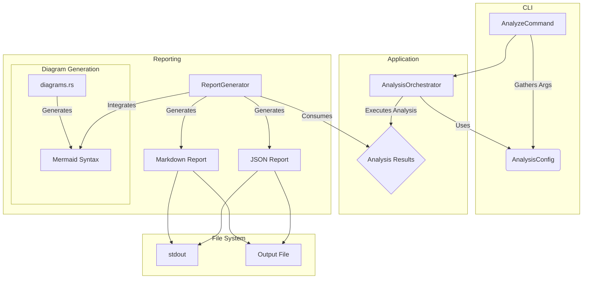

# Report Infrastructure Audit (2025-01-07)

This document provides a comprehensive audit of the reporting infrastructure and file system handling in the Uveddi codebase. The analysis focuses on integrating image rendering and multi-format output capabilities.

## 1. Report Generator Architecture Audit

### 1.1. Report Generation Pipeline Flow

The report generation process is initiated by the `AnalyzeCommand::execute` method in `src/cli/analyze_command.rs`. The key steps are:

1.  **Configuration**: `AnalyzeCommand` gathers configuration from CLI arguments and environment variables.
2.  **Orchestration**: An `AnalysisOrchestrator` is created and configured with an `AnalysisConfig` object.
3.  **Execution**: The `orchestrator.execute_analysis` method runs the full analysis pipeline, returning a `Report` object.
4.  **Output**: The content of the `Report` object is either printed to `stdout` or written to a file, based on the `--output` argument.

The core report generation logic resides in `src/report/mod.rs`. The `ReportGenerator` struct is responsible for creating reports in different formats (Markdown, JSON).

### 1.2. Mermaid Integration

Basic Mermaid.js integration exists in `src/report/diagrams.rs`. The `generate_mermaid_diagram` function creates a simple dependency graph. This is a good foundation, but it is not yet fully integrated into the main `ReportGenerator` workflow. The `ReportGenerator` has its own `generate_diagrams_section` and `generate_enhanced_diagrams_section` methods that contain more advanced logic for generating diagrams based on anti-pattern types.

### 1.3. Architecture Diagram



### 1.4. Extension Points for Image Rendering

The `ReportGenerator` can be extended to support image rendering. The ideal place to add this functionality would be within the `generate_diagrams_section` or `generate_enhanced_diagrams_section` methods.

The flow would be:

1.  Generate Mermaid syntax as is currently done.
2.  Use a tool (like the Mermaid CLI or a library) to convert the Mermaid syntax to an image (e.g., PNG or SVG).
3.  Save the image to the file system.
4.  Embed a link to the image in the Markdown report.

### 1.5. Error Handling

Error handling in the report generator is basic. The `generate_markdown_report` and `generate_json_report` methods return a `Result<String, String>`, which is not very expressive. The file writing logic in these methods uses `log::error` on failure but returns a simple `String` error.

**Recommendations:**

*   Introduce a dedicated `ReportError` enum to provide more specific error types.
*   Propagate errors from the diagram generation and file writing stages more effectively.
*   Ensure that if image generation fails, the report can still be generated with the Mermaid syntax as a fallback.

## 2. File System & Path Management Analysis

### 2.1. Report Writing

Reports are written to disk in `src/report/mod.rs` within the `generate_markdown_report` and `generate_json_report` methods. The logic is straightforward: if an `output_path` is provided, it creates a file and writes the report content.

### 2.2. Path Handling

The codebase uses `std::path::PathBuf` for path handling, which is good for cross-platform compatibility. The `AnalyzeCommand` struct takes `PathBuf` for the analysis path and output file path.

### 2.3. Directory Structure

The current implementation writes the report to the specified file path. It does not create any new directories for the reports. If image generation is added, a dedicated output directory for the report and its associated images will be necessary to keep the output organized.

### 2.4. File Naming

File naming is determined by the user via the `--output` CLI argument. There are no automated file naming conventions.

### 2.5. Potential Conflicts

If a user specifies an output file (e.g., `report.md`), and image generation is added, the images (e.g., `diagram-1.png`) would be created in the same directory. This could lead to a cluttered output directory.

**Recommendations:**

*   When an output file is specified, create a directory with a similar name (e.g., `report_output/`) and place the report file and all images within it.
*   Introduce a default output directory (e.g., `uveddi_reports/`) if no output path is specified.
*   Standardize image file naming (e.g., `{report_name}_diagram_{index}.png`).

## 3. Configuration System Assessment

### 3.1. Report Configuration Options

The `src/config/mod.rs` file defines the main `Config` struct. Currently, there are no specific configuration options for reports or visualizations. The configuration is focused on the analysis detectors.

### 3.2. Configuration Flow

The `AnalyzeCommand` takes CLI arguments and creates an `AnalysisConfig` object, which is then passed to the `AnalysisOrchestrator`. The `ReportGenerator` is instantiated with default settings inside the orchestrator, and its behavior is not currently driven by the main configuration file.

### 3.3. Configuration Schema

The current schema is focused on `dead_code` and `large_classes` detectors.

### 3.4. Integration Points for Visualization Settings

The `Config` struct in `src/config/mod.rs` should be extended to include a `report` or `visualization` section.

```rust
// In src/config/mod.rs

#[derive(Debug, Serialize, Deserialize, Clone)]
pub struct ReportConfig {
    pub default_format: Option<String>,
    pub output_directory: Option<String>,
    pub diagrams: Option<DiagramConfig>,
}

#[derive(Debug, Serialize, Deserialize, Clone)]
pub struct DiagramConfig {
    pub enabled: Option<bool>,
    pub image_format: Option<String>, // "png", "svg"
    pub theme: Option<String>, // "dark", "light", "neutral"
}

// In Config struct
pub struct Config {
    // ... existing fields
    pub report: Option<ReportConfig>,
}
```

### 3.5. Environment-Specific Configuration

The configuration system already supports loading from environment variables, which is good for environment-specific settings.

**Recommendations:**

*   Add a `report` section to the `Config` struct as shown above.
*   Update the `AnalysisOrchestrator` to read this configuration and initialize the `ReportGenerator` accordingly.
*   Allow CLI arguments to override the configuration file settings.

## 4. Performance & Memory Usage Audit

### 4.1. Performance Characteristics

The current report generation is likely fast as it is primarily string manipulation. The main performance bottleneck would be the analysis itself, not the report generation.

### 4.2. Memory Usage

Memory usage for report generation should be low, as it processes data that is already in memory. The `ReportGenerator` takes references to the analysis results, which is efficient.

### 4.3. Caching

There are no caching mechanisms in the report generation pipeline. Caching would be more relevant for the analysis engine itself.

### 4.4. Bottlenecks for Image Rendering

Introducing image rendering will add a new performance consideration. Spawning a process for each diagram to run the Mermaid CLI can be slow, especially for reports with many diagrams.

**Recommendations:**

*   If many diagrams are to be rendered, consider using a persistent process or a library that can handle batch rendering.
*   For large reports, consider streaming the output to the file rather than building the entire report in a single string in memory.

### 4.5. Concurrent Processing

The `ReportGenerator` is `Default`, and its methods take `&self`, so it can be used concurrently. However, the current pipeline in `AnalyzeCommand` is sequential. If multiple reports were to be generated in the future, the `ReportGenerator` could be shared across threads.

## 5. CLI Integration Points

### 5.1. Report Output Options

The `src/cli/analyze_command.rs` file defines the output options: `--output-format` and `--output`. These are clear and functional.

### 5.2. Argument Handling

Argument handling is done using `clap`, which is a robust solution.

### 5.3. User Experience

The current user experience is straightforward. The user provides an input path and gets a report.

### 5.4. New Visualization Options

New CLI options should be added to control visualization settings.

```rust
// In src/cli/analyze_command.rs

#[derive(Args)]
pub struct AnalyzeCommand {
    // ... existing args

    /// Generate image diagrams for visualizations
    #[arg(long)]
    pub render_diagrams: bool,

    /// Image format for rendered diagrams (png, svg)
    #[arg(long, default_value = "png")]
    pub diagram_format: String,
}
```

### 5.5. Error Messaging

CLI error messaging is handled by `anyhow` and `clap`, which provide good user-facing errors.

**Recommendations:**

*   Add the new CLI arguments as proposed above.
*   Ensure that if `render_diagrams` is true but the rendering tool is not available, a clear error message is shown to the user, and the report is generated with the Mermaid syntax as a fallback.

## 6. Integration Readiness Assessment

The current codebase is **moderately ready** for the integration of image rendering and enhanced visualization capabilities.

**Strengths:**

*   The separation of concerns between the CLI, application logic, and report generation is good.
*   The use of `PathBuf` and a solid CLI argument parser (`clap`) provides a good foundation.
*   The existing Mermaid integration provides a clear starting point.

**Areas for Improvement:**

*   **Configuration:** The reporting and visualization settings need to be integrated into the main configuration system.
*   **File System:** A more robust file and directory management strategy is needed for handling report outputs and associated images.
*   **Error Handling:** The error handling in the report generator should be improved to be more specific and resilient.
*   **Tooling:** An external tool or library for Mermaid rendering will need to be chosen and integrated.

By addressing the recommendations in this audit, the codebase can be made fully ready for the planned enhancements to the visualization pipeline.
