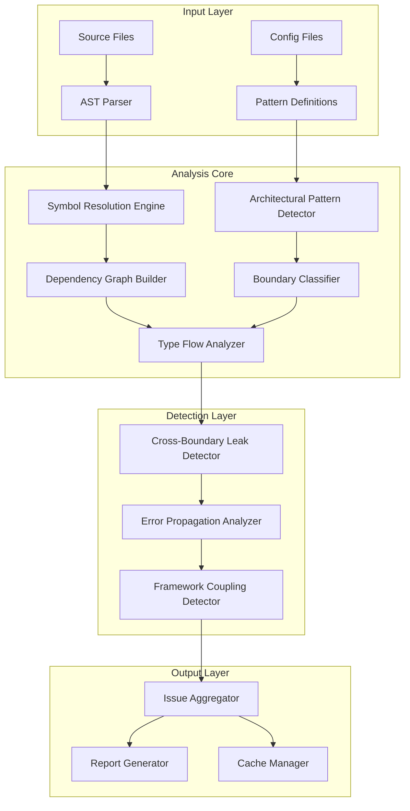
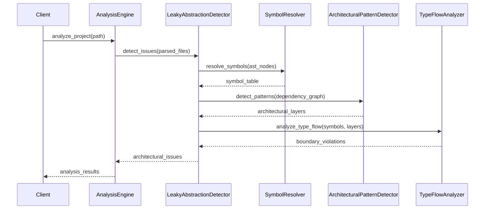
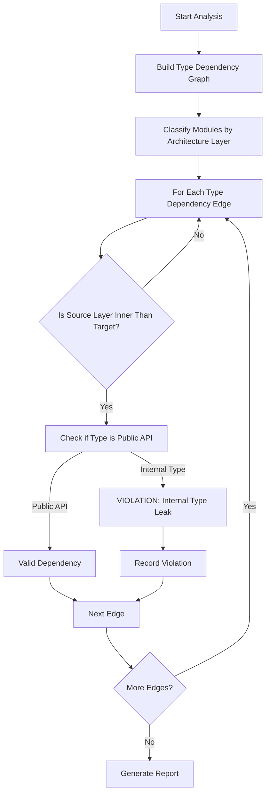
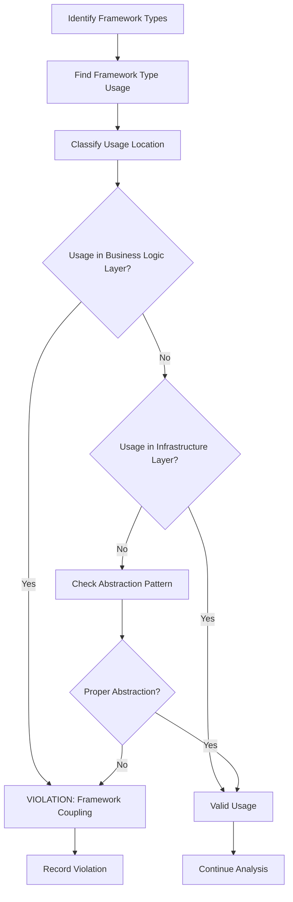
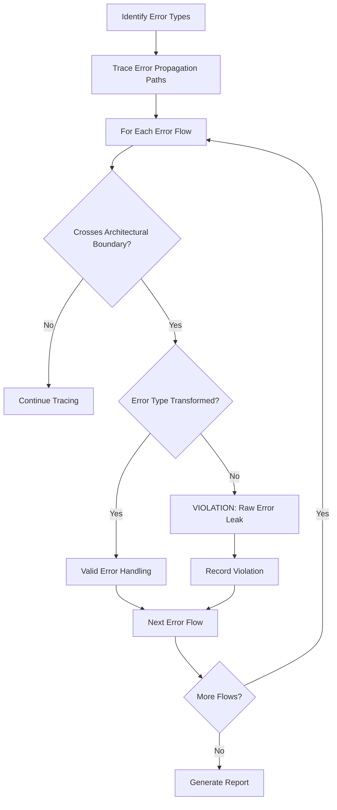
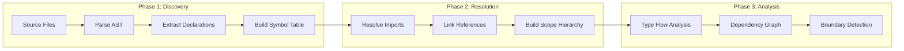
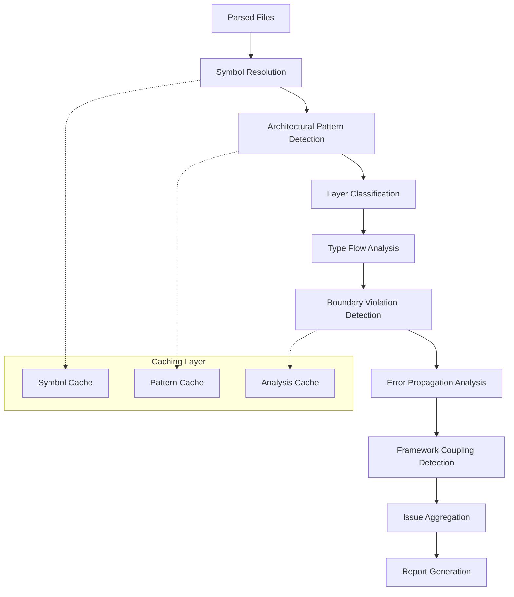

# Leaky Abstraction Detector: Design Specification

## Table of Contents

1. [Overview](#overview)
2. [Architecture Design](#architecture-design)
3. [Core Components](#core-components)
4. [Detection Algorithms](#detection-algorithms)
5. [Language-Specific Implementation](#language-specific-implementation)
6. [Data Flow Diagrams](#data-flow-diagrams)
7. [Implementation Phases](#implementation-phases)
8. [API Design](#api-design)
9. [Testing Strategy](#testing-strategy)
10. [Performance Considerations](#performance-considerations)

## Overview

### Problem Statement

Leaky abstractions occur when implementation details "leak through" intended abstraction boundaries, forcing consumers to understand and work around internal complexities. This detector identifies violations of architectural boundaries where:

- Internal types cross into public interfaces
- Lower-level implementation details are exposed to higher-level layers
- Framework-specific code pollutes business logic
- Error types propagate inappropriately across boundaries

### Design Goals

1. **Multi-Language Support**: Rust, Python, JavaScript/TypeScript
2. **Architectural Pattern Awareness**: Clean Architecture, Hexagonal, MVC, DDD
3. **Cross-File Analysis**: Symbol resolution across module boundaries
4. **Configurable Sensitivity**: Adjustable thresholds and pattern recognition
5. **Performance**: Incremental analysis with caching
6. **Extensibility**: Plugin architecture for new patterns

## Architecture Design

### High-Level Architecture



### Component Interaction Diagram



## Core Components

### 1. Symbol Resolution Engine

**Purpose**: Build a comprehensive symbol table with cross-file references

```rust
pub struct SymbolResolver {
    symbol_table: HashMap<SymbolId, Symbol>,
    scope_hierarchy: ScopeTree,
    import_graph: ImportGraph,
    language_handlers: HashMap<Language, Box<dyn LanguageHandler>>,
}

pub struct Symbol {
    pub id: SymbolId,
    pub name: String,
    pub kind: SymbolKind,
    pub visibility: Visibility,
    pub location: SourceLocation,
    pub type_info: Option<TypeInfo>,
    pub references: Vec<SymbolReference>,
}

pub enum SymbolKind {
    Function,
    Type(TypeKind),
    Variable,
    Module,
    Interface,
    Trait,
}

pub enum Visibility {
    Public,
    Private,
    Internal(String), // crate-internal, package-internal, etc.
    Protected,
}
```

### 2. Architectural Pattern Detector

**Purpose**: Identify architectural patterns and classify modules into layers

```rust
pub struct ArchitecturalPatternDetector {
    pattern_recognizers: Vec<Box<dyn PatternRecognizer>>,
    layer_classifiers: Vec<Box<dyn LayerClassifier>>,
}

pub trait PatternRecognizer {
    fn detect_pattern(&self, dependency_graph: &DependencyGraph) -> Option<ArchitecturalPattern>;
    fn confidence_score(&self) -> f64;
}

pub enum ArchitecturalPattern {
    CleanArchitecture {
        entities_layer: Vec<ModuleId>,
        use_cases_layer: Vec<ModuleId>,
        interface_adapters_layer: Vec<ModuleId>,
        frameworks_layer: Vec<ModuleId>,
    },
    Hexagonal {
        core_domain: Vec<ModuleId>,
        ports: Vec<ModuleId>,
        adapters: Vec<ModuleId>,
    },
    Layered {
        layers: Vec<ArchitecturalLayer>,
    },
    MVC {
        models: Vec<ModuleId>,
        views: Vec<ModuleId>,
        controllers: Vec<ModuleId>,
    },
}

pub struct ArchitecturalLayer {
    pub name: String,
    pub level: u32, // 0 = innermost/highest level
    pub modules: Vec<ModuleId>,
    pub allowed_dependencies: Vec<u32>, // which layer levels this can depend on
}
```

### 3. Type Flow Analyzer

**Purpose**: Track how types flow across module boundaries

```rust
pub struct TypeFlowAnalyzer {
    type_graph: TypeDependencyGraph,
    boundary_rules: BoundaryRules,
}

pub struct TypeDependencyGraph {
    nodes: HashMap<TypeId, TypeNode>,
    edges: Vec<TypeDependencyEdge>,
}

pub struct TypeNode {
    pub type_id: TypeId,
    pub name: String,
    pub defining_module: ModuleId,
    pub visibility: Visibility,
    pub architectural_layer: Option<LayerId>,
}

pub struct TypeDependencyEdge {
    pub from_type: TypeId,
    pub to_type: TypeId,
    pub dependency_kind: TypeDependencyKind,
    pub location: SourceLocation,
}

pub enum TypeDependencyKind {
    ParameterType,
    ReturnType,
    FieldType,
    Inheritance,
    Implementation,
    GenericConstraint,
}
```

### 4. Boundary Violation Detector

**Purpose**: Identify specific leaky abstraction patterns

```rust
pub struct BoundaryViolationDetector {
    violation_patterns: Vec<Box<dyn ViolationPattern>>,
}

pub trait ViolationPattern {
    fn detect(&self, context: &AnalysisContext) -> Vec<BoundaryViolation>;
    fn pattern_name(&self) -> &'static str;
    fn severity(&self) -> Severity;
}

pub struct BoundaryViolation {
    pub pattern_name: String,
    pub severity: Severity,
    pub location: SourceLocation,
    pub description: String,
    pub leaked_symbol: SymbolId,
    pub source_layer: LayerId,
    pub target_layer: LayerId,
    pub suggested_fix: Option<String>,
}
```

## Detection Algorithms

### 1. Cross-Layer Type Leak Detection



### 2. Framework Coupling Detection



### 3. Error Propagation Analysis



## Language-Specific Implementation

### Rust Implementation

```rust
pub struct RustLeakyAbstractionDetector {
    visibility_analyzer: RustVisibilityAnalyzer,
    trait_analyzer: RustTraitAnalyzer,
    error_analyzer: RustErrorAnalyzer,
}

impl RustLeakyAbstractionDetector {
    fn detect_visibility_violations(&self, context: &RustAnalysisContext) -> Vec<BoundaryViolation> {
        // Detect pub types used in pub(crate) interfaces
        // Detect internal types exposed through public APIs
        // Check for proper use of pub(in path) restrictions
    }
    
    fn detect_trait_object_leaks(&self, context: &RustAnalysisContext) -> Vec<BoundaryViolation> {
        // Detect when internal trait implementations leak through public interfaces
        // Check for proper abstraction of trait bounds
    }
    
    fn detect_error_type_leaks(&self, context: &RustAnalysisContext) -> Vec<BoundaryViolation> {
        // Detect when internal error types propagate through Result types
        // Check for proper error conversion at boundaries
    }
}
```

### Python Implementation

```rust
pub struct PythonLeakyAbstractionDetector {
    import_analyzer: PythonImportAnalyzer,
    duck_typing_analyzer: PythonDuckTypingAnalyzer,
    exception_analyzer: PythonExceptionAnalyzer,
}

impl PythonLeakyAbstractionDetector {
    fn detect_import_violations(&self, context: &PythonAnalysisContext) -> Vec<BoundaryViolation> {
        // Detect direct imports of internal modules
        // Check for violation of package boundaries
        // Analyze __all__ declarations for proper API exposure
    }
    
    fn detect_duck_typing_leaks(&self, context: &PythonAnalysisContext) -> Vec<BoundaryViolation> {
        // Detect when internal object structures leak through duck typing
        // Check for proper Protocol usage
    }
}
```

### JavaScript Implementation

```rust
pub struct JavaScriptLeakyAbstractionDetector {
    module_analyzer: JSModuleAnalyzer,
    framework_analyzer: JSFrameworkAnalyzer,
    async_analyzer: JSAsyncAnalyzer,
}

impl JavaScriptLeakyAbstractionDetector {
    fn detect_module_violations(&self, context: &JSAnalysisContext) -> Vec<BoundaryViolation> {
        // Detect improper export patterns
        // Check for global namespace pollution
        // Analyze ES6 vs CommonJS boundary issues
    }
    
    fn detect_framework_coupling(&self, context: &JSAnalysisContext) -> Vec<BoundaryViolation> {
        // Detect React/Vue components in business logic
        // Check for Express request/response objects in services
        // Analyze DOM manipulation in non-UI code
    }
}
```

## Data Flow Diagrams

### Symbol Resolution Flow



### Detection Pipeline



## Implementation Phases

### Phase 1: Foundation (Weeks 1-3)

**Goals**: Establish core infrastructure
- [ ] Symbol resolution engine
- [ ] Basic AST parsing integration
- [ ] Module boundary detection
- [ ] Simple dependency graph construction

**Deliverables**:
- Working symbol table for Rust
- Basic module visibility analysis
- Unit tests for core components

### Phase 2: Pattern Recognition (Weeks 4-6)

**Goals**: Implement architectural pattern detection
- [ ] Clean Architecture pattern recognizer
- [ ] Hexagonal Architecture pattern recognizer
- [ ] Layer classification algorithms
- [ ] Confidence scoring system

**Deliverables**:
- Architectural pattern detection for common patterns
- Layer classification with confidence scores
- Integration tests with real codebases

### Phase 3: Violation Detection (Weeks 7-9)

**Goals**: Core leaky abstraction detection
- [ ] Cross-layer type leak detection
- [ ] Error propagation analysis
- [ ] Framework coupling detection
- [ ] Violation severity classification

**Deliverables**:
- Working leak detection for Rust
- Comprehensive test suite
- Performance benchmarks

### Phase 4: Multi-Language Support (Weeks 10-12)

**Goals**: Extend to Python and JavaScript
- [ ] Python-specific detectors
- [ ] JavaScript-specific detectors
- [ ] Language-agnostic violation patterns
- [ ] Cross-language boundary analysis

**Deliverables**:
- Full multi-language support
- Language-specific test suites
- Documentation and examples

### Phase 5: Optimization & Polish (Weeks 13-14)

**Goals**: Performance and usability
- [ ] Incremental analysis
- [ ] Caching optimization
- [ ] Configuration system
- [ ] IDE integration preparation

**Deliverables**:
- Production-ready detector
- Performance optimization
- User documentation

## API Design

### Main Detector Interface

```rust
pub struct LeakyAbstractionDetector {
    symbol_resolver: SymbolResolver,
    pattern_detector: ArchitecturalPatternDetector,
    type_analyzer: TypeFlowAnalyzer,
    violation_detector: BoundaryViolationDetector,
    config: DetectorConfig,
}

impl AnalysisDetector for LeakyAbstractionDetector {
    fn get_detector_name(&self) -> &'static str {
        "LeakyAbstractionDetector"
    }
    
    fn get_anti_pattern_types(&self) -> Vec<AntiPatternType> {
        vec![
            AntiPatternType::new(
                1,
                "Cross-Layer Type Leak",
                "Internal types exposed through public interfaces",
                None,
                Some("Architectural"),
            ),
            AntiPatternType::new(
                2,
                "Framework Coupling",
                "Business logic coupled to framework-specific types",
                None,
                Some("Architectural"),
            ),
            AntiPatternType::new(
                3,
                "Error Propagation Leak",
                "Low-level errors propagating across architectural boundaries",
                None,
                Some("Error Handling"),
            ),
            AntiPatternType::new(
                4,
                "Implementation Detail Exposure",
                "Internal implementation details visible in public APIs",
                None,
                Some("Encapsulation"),
            ),
        ]
    }
    
    fn detect_issues(
        &self,
        parsed_file: &ParsedFile,
    ) -> Result<Vec<ArchitecturalIssue>, AnalysisError> {
        let mut issues = Vec::new();
        
        // Build symbol table for the file
        let symbols = self.symbol_resolver.resolve_file_symbols(parsed_file)?;
        
        // Detect architectural patterns
        let patterns = self.pattern_detector.detect_patterns(&symbols)?;
        
        // Analyze type flow
        let type_flows = self.type_analyzer.analyze_type_flow(&symbols, &patterns)?;
        
        // Detect violations
        let violations = self.violation_detector.detect_violations(&type_flows)?;
        
        // Convert to ArchitecturalIssue format
        for violation in violations {
            issues.push(self.convert_violation_to_issue(violation)?);
        }
        
        Ok(issues)
    }
}
```

### Configuration System

```rust
#[derive(Debug, Clone, Serialize, Deserialize)]
pub struct DetectorConfig {
    pub enabled_patterns: Vec<String>,
    pub severity_thresholds: SeverityThresholds,
    pub architectural_style: Option<ArchitecturalStyle>,
    pub custom_layer_mappings: HashMap<String, LayerType>,
    pub framework_detection: FrameworkDetectionConfig,
    pub error_propagation_rules: ErrorPropagationRules,
}

#[derive(Debug, Clone, Serialize, Deserialize)]
pub struct SeverityThresholds {
    pub cross_layer_leak: Severity,
    pub framework_coupling: Severity,
    pub error_propagation: Severity,
    pub implementation_exposure: Severity,
}

#[derive(Debug, Clone, Serialize, Deserialize)]
pub enum ArchitecturalStyle {
    CleanArchitecture,
    HexagonalArchitecture,
    LayeredArchitecture { layer_count: u32 },
    MVC,
    Custom { layer_definitions: Vec<LayerDefinition> },
}
```

## Testing Strategy

### Unit Tests

```rust
#[cfg(test)]
mod tests {
    use super::*;
    
    #[test]
    fn test_rust_visibility_leak_detection() {
        let code = r#"
            mod internal {
                pub struct InternalType {
                    pub field: i32,
                }
            }
            
            pub fn public_api() -> internal::InternalType {
                internal::InternalType { field: 42 }
            }
        "#;
        
        let detector = LeakyAbstractionDetector::new();
        let issues = detector.analyze_code(code, Language::Rust).unwrap();
        
        assert_eq!(issues.len(), 1);
        assert_eq!(issues[0].pattern_name, "Cross-Layer Type Leak");
    }
    
    #[test]
    fn test_framework_coupling_detection() {
        let code = r#"
            use axum::extract::Request;
            
            pub struct UserService;
            
            impl UserService {
                pub fn create_user(&self, req: Request) -> Result<User, Error> {
                    // Business logic should not depend on web framework types
                    todo!()
                }
            }
        "#;
        
        let detector = LeakyAbstractionDetector::new();
        let issues = detector.analyze_code(code, Language::Rust).unwrap();
        
        assert_eq!(issues.len(), 1);
        assert_eq!(issues[0].pattern_name, "Framework Coupling");
    }
}
```

### Integration Tests

```rust
#[cfg(test)]
mod integration_tests {
    use super::*;
    use tempfile::tempdir;
    
    #[test]
    fn test_clean_architecture_detection() {
        let project_dir = setup_clean_architecture_project();
        let detector = LeakyAbstractionDetector::new();
        let results = detector.analyze_project(&project_dir).unwrap();
        
        // Should detect Clean Architecture pattern
        assert!(results.detected_patterns.contains(&ArchitecturalPattern::CleanArchitecture { .. }));
        
        // Should have no violations in well-structured project
        assert_eq!(results.violations.len(), 0);
    }
    
    #[test]
    fn test_cross_language_boundary_analysis() {
        let project_dir = setup_polyglot_project();
        let detector = LeakyAbstractionDetector::new();
        let results = detector.analyze_project(&project_dir).unwrap();
        
        // Should detect violations across language boundaries
        assert!(results.violations.iter().any(|v| v.pattern_name == "Cross-Language Type Leak"));
    }
}
```

## Performance Considerations

### Caching Strategy

```rust
pub struct AnalysisCache {
    symbol_cache: LruCache<FileHash, SymbolTable>,
    pattern_cache: LruCache<ProjectHash, Vec<ArchitecturalPattern>>,
    violation_cache: LruCache<AnalysisHash, Vec<BoundaryViolation>>,
}

impl AnalysisCache {
    pub fn get_or_compute_symbols<F>(&mut self, file_hash: FileHash, compute: F) -> SymbolTable
    where
        F: FnOnce() -> SymbolTable,
    {
        self.symbol_cache.get(&file_hash).cloned().unwrap_or_else(|| {
            let symbols = compute();
            self.symbol_cache.put(file_hash, symbols.clone());
            symbols
        })
    }
}
```

### Incremental Analysis

```rust
pub struct IncrementalAnalyzer {
    previous_state: Option<AnalysisState>,
    change_detector: FileChangeDetector,
}

impl IncrementalAnalyzer {
    pub fn analyze_changes(&mut self, project_path: &Path) -> Result<AnalysisResults, AnalysisError> {
        let changes = self.change_detector.detect_changes(project_path)?;
        
        if changes.is_empty() {
            return Ok(self.previous_state.as_ref().unwrap().results.clone());
        }
        
        // Only re-analyze affected files and their dependents
        let affected_files = self.compute_affected_files(&changes)?;
        let partial_results = self.analyze_files(&affected_files)?;
        
        // Merge with cached results
        let merged_results = self.merge_results(partial_results)?;
        
        Ok(merged_results)
    }
}
```

### Memory Optimization

```rust
pub struct MemoryOptimizedDetector {
    streaming_parser: StreamingAstParser,
    bounded_symbol_table: BoundedSymbolTable,
    lazy_type_resolver: LazyTypeResolver,
}

impl MemoryOptimizedDetector {
    pub fn analyze_large_project(&self, project_path: &Path) -> Result<AnalysisResults, AnalysisError> {
        // Process files in batches to control memory usage
        let file_batches = self.create_file_batches(project_path)?;
        
        let mut aggregated_results = AnalysisResults::new();
        
        for batch in file_batches {
            let batch_results = self.analyze_batch(batch)?;
            aggregated_results.merge(batch_results);
            
            // Clear intermediate data to free memory
            self.clear_batch_cache();
        }
        
        Ok(aggregated_results)
    }
}
```

---

This design specification provides a comprehensive blueprint for implementing the Leaky Abstraction Detector. The modular architecture allows for incremental development while maintaining extensibility for future enhancements.