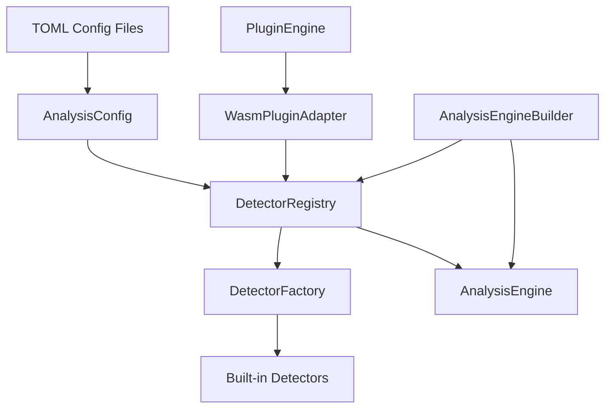

# UV-156: Dependency Injection Architecture

## Overview

This document describes the comprehensive dependency injection architecture implemented in UV-156, which transformed the Uveddi AnalysisEngine from a rigid, hardcoded system into a flexible, modular, and extensible platform.

## Table of Contents

1. [Problem Statement](#problem-statement)
2. [Architecture Overview](#architecture-overview)
3. [Implementation Phases](#implementation-phases)
4. [Core Components](#core-components)
5. [Usage Patterns](#usage-patterns)
6. [Migration Guide](#migration-guide)
7. [Best Practices](#best-practices)
8. [Future Considerations](#future-considerations)

## Problem Statement

### Before: Tightly Coupled Design

```rust
// OLD - Hardcoded detectors in constructor
impl AnalysisEngine {
    pub fn new() -> Result<Self> {
        Ok(Self {
            // ... other fields
            detectors: vec![
                Box::new(GodObjectDetector::new(5, 8)), // Hardcoded
                Box::new(CodeDuplicationDetector::new()), // Hardcoded
                Box::new(DeadCodeDetector::with_default_config()), // Hardcoded
                Box::new(LargeClassDetector::with_default_config()), // Hardcoded
                Box::new(TightCouplingDetector::default()), // Hardcoded
            ],
            // ... other fields
        })
    }
}
```

### Issues with Old Design

1. **Poor Testability**: Cannot inject mock detectors for testing
2. **Limited Extensibility**: Adding detectors requires modifying engine code
3. **Tight Coupling**: Engine hardcoded to specific detector implementations
4. **Configuration Inflexibility**: No external configuration support
5. **Plugin Integration Issues**: WASM plugins couldn't be dynamically added

## Architecture Overview

The new architecture implements the **Dependency Injection** pattern with supporting infrastructure:



### Key Architectural Principles

1. **Inversion of Control**: Dependencies are injected rather than created internally
2. **Single Responsibility**: Each component has a focused, well-defined role
3. **Open/Closed Principle**: Open for extension, closed for modification
4. **Composition over Inheritance**: Flexible composition of detector sets
5. **Configuration-Driven**: External configuration controls behavior

## Implementation Phases

### Phase 1: Core Dependency Injection (8 hours)

**Objective**: Implement basic dependency injection for detectors

**Components Built**:
- `AnalysisEngineBuilder` - Builder pattern for engine configuration
- `DetectorFactory` - Factory for creating detector instances
- `AnalysisEngine::with_detectors()` - Dependency injection constructor
- Backward compatibility maintenance

**Files Created/Modified**:
- `src/analysis/engine_builder.rs` (NEW)
- `src/analysis/detector_factory.rs` (NEW)
- `src/analysis/engine.rs` (MODIFIED)
- `src/analysis/mod.rs` (MODIFIED)

### Phase 2: Registry & Configuration (6 hours)

**Objective**: Add centralized detector management and external configuration

**Components Built**:
- `DetectorRegistry` - Centralized detector management
- `AnalysisConfig` - TOML configuration support
- Configuration file examples
- Builder integration with configuration

**Files Created/Modified**:
- `src/analysis/detector_registry.rs` (NEW)
- `src/analysis/config.rs` (NEW)
- `examples/analysis_config.toml` (NEW)
- `src/analysis/engine_builder.rs` (MODIFIED)

### Phase 3: Plugin Integration (4 hours)

**Objective**: Integrate WASM plugins as first-class detectors

**Components Built**:
- `WasmPluginDetectorAdapter` - Bridge between plugins and detectors
- `WasmPluginAdapterFactory` - Factory for plugin adapters
- Engine plugin management methods
- Registry plugin support

**Files Created/Modified**:
- `src/analysis/plugin_adapter.rs` (NEW)
- `src/analysis/engine.rs` (MODIFIED)
- `src/analysis/detector_registry.rs` (MODIFIED)

## Core Components

### 1. AnalysisEngineBuilder

**Purpose**: Fluent interface for configuring AnalysisEngine instances

**Key Methods**:
- `add_detector()` - Add custom detectors
- `enable_plugins()` - Enable WASM plugin support
- `with_cache_path()` - Set custom cache location
- `with_memory_cache()` - Use in-memory cache (testing)
- `from_config()` - Load configuration programmatically
- `from_config_file()` - Load configuration from TOML file
- `build()` - Create configured AnalysisEngine

### 2. DetectorFactory

**Purpose**: Centralized creation of detector instances

**Key Methods**:
- `create_default_detectors()` - Create standard detector set
- `create_detector()` - Create specific detector by name
- `create_detectors_from_config()` - Create from configuration map

### 3. DetectorRegistry

**Purpose**: Centralized management of detector instances

**Key Methods**:
- `register()` - Register detector with name
- `load_defaults()` - Load standard detector set
- `load_from_config()` - Load from configuration
- `load_plugin_detectors()` - Load WASM plugin detectors
- `get_all_detectors()` - Retrieve all registered detectors

### 4. AnalysisConfig

**Purpose**: External configuration support via TOML files

**Key Methods**:
- `from_file()` - Load configuration from TOML file
- `save_to_file()` - Save configuration to TOML file
- `create_engine()` - Create engine from configuration
- `validate()` - Validate configuration

### 5. WasmPluginDetectorAdapter

**Purpose**: Bridge between async WASM plugins and sync AnalysisDetector trait

**Key Features**:
- Thread-safe implementation (`Send + Sync`)
- Async-to-sync bridge using runtime
- Automatic anti-pattern type conversion
- Graceful error handling

## Usage Patterns

### Basic Usage (Backward Compatible)

```rust
// Still works exactly as before
let engine = AnalysisEngine::new()?;
```

### Custom Detector Set

```rust
let detectors = vec![
    Box::new(GodObjectDetector::new(10, 15)), // Custom thresholds
    Box::new(CustomDetector::new()),
];
let engine = AnalysisEngine::with_detectors(detectors, None, false)?;
```

### Builder Pattern

```rust
let engine = AnalysisEngineBuilder::new()
    .add_detector(Box::new(GodObjectDetector::new(10, 15)))
    .add_detector(Box::new(CustomDetector::new()))
    .enable_plugins()
    .with_memory_cache()
    .build().await?;
```

### Configuration-Driven

```rust
// From TOML file
let config = AnalysisConfig::from_file(Path::new("analysis.toml"))?;
let engine = config.create_engine().await?;

// Programmatic configuration
let mut config = AnalysisConfig::default();
config.add_detector("god_object".to_string(), 
    DetectorConfig::new().with_param("threshold_methods", 10));
let engine = config.create_engine().await?;
```

### Plugin Integration

```rust
// Automatic plugin loading
let engine = AnalysisEngineBuilder::new()
    .enable_plugins()
    .build().await?; // Plugins loaded automatically

// Manual plugin management
let mut engine = AnalysisEngine::new_with_plugins().await?;
let plugin_count = engine.add_plugin_detectors().await?;
engine.remove_plugin_detectors();
let reloaded_count = engine.reload_plugin_detectors().await?;
```

### Registry-Based Management

```rust
let mut registry = DetectorRegistry::new();
registry.load_defaults();
registry.load_from_config(&detector_configs)?;
registry.load_plugin_detectors(plugin_engine).await?;

let all_detectors = registry.get_all_detectors();
let engine = AnalysisEngine::with_detectors(all_detectors, None, false)?;
```

## Migration Guide

### For Existing Code

**No changes required!** All existing code continues to work:

```rust
// This still works exactly as before
let engine = AnalysisEngine::new()?;
let (issues, graph) = engine.analyze(Path::new("src/")).await?;
```

### For New Development

Use the new patterns for better flexibility:

```rust
// Instead of hardcoded engine creation
let engine = AnalysisEngine::new()?;

// Use builder for flexibility
let engine = AnalysisEngineBuilder::new()
    .from_config_file(Path::new("config.toml"))?
    .build().await?;
```

### For Testing

Take advantage of dependency injection:

```rust
// Old: Hard to test with specific detectors
let engine = AnalysisEngine::new()?;

// New: Easy to inject mocks
let mock_detectors = vec![Box::new(MockDetector::new())];
let engine = AnalysisEngine::with_detectors(mock_detectors, None, false)?;
```

## Best Practices

### 1. Use Builder Pattern for Complex Configuration

```rust
// Good
let engine = AnalysisEngineBuilder::new()
    .from_config_file(Path::new("config.toml"))?
    .with_memory_cache() // Override config setting
    .build().await?;

// Avoid: Manual detector management unless necessary
let detectors = vec![/* manual detector creation */];
```

### 2. Prefer Configuration Files for Production

```rust
// Good: External configuration
let config = AnalysisConfig::from_file(Path::new("production.toml"))?;
let engine = config.create_engine().await?;

// Avoid: Hardcoded production settings
let engine = AnalysisEngineBuilder::new()
    .add_detector(Box::new(GodObjectDetector::new(5, 8)))
    // ... many hardcoded settings
    .build().await?;
```

### 3. Use Registry for Complex Detector Management

```rust
// Good: When managing many detectors
let mut registry = DetectorRegistry::new();
registry.load_defaults();
registry.load_from_config(&custom_configs)?;
registry.load_plugin_detectors(plugin_engine).await?;

// Avoid: Manual detector list management
let mut detectors = Vec::new();
detectors.extend(default_detectors);
detectors.extend(custom_detectors);
// ... complex manual management
```

### 4. Handle Plugin Failures Gracefully

```rust
// Good: Graceful fallback
match engine.add_plugin_detectors().await {
    Ok(count) => log::info!("Loaded {} plugin detectors", count),
    Err(e) => {
        log::warn!("Plugin loading failed: {}", e);
        // Continue with built-in detectors
    }
}

// Avoid: Failing completely on plugin errors
engine.add_plugin_detectors().await?; // Could fail entire operation
```

## Future Considerations

### Planned Enhancements

1. **Dynamic Detector Reloading**: Hot-swap detectors during runtime
2. **Detector Versioning**: Support for multiple detector versions
3. **Advanced Configuration**: Conditional detector loading based on file types
4. **Performance Optimization**: Lazy loading and detector pooling
5. **Metrics Integration**: Detector-specific performance metrics

### Extension Points

1. **Custom Detector Factories**: Domain-specific detector creation
2. **Configuration Providers**: Database, remote, or encrypted configuration
3. **Plugin Ecosystems**: Curated plugin repositories and management
4. **Advanced Registries**: Hierarchical or distributed detector registries

### Backward Compatibility Promise

The dependency injection architecture maintains **strict backward compatibility**. All existing APIs continue to work unchanged, ensuring smooth adoption without breaking existing code.

## Related Documentation

- [Plugin Development Guide](./plugin_development_guide.md)
- [Configuration Reference](../02-user-guide/configuration-options.md)
- [Testing Strategy](../10-reference/testing_strategy.md)
- [Architecture Overview](../04-architecture/ARCHITECTURE.md)

---

**Implementation Date**: 2025-01-12  
**Issue**: UV-156  
**Phase**: Completed (All 3 phases)  
**Status**: Production Ready