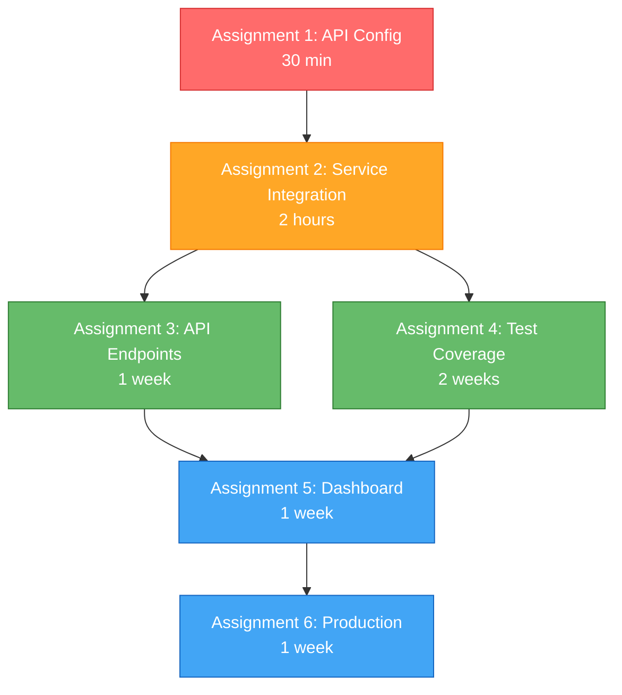

# Uveddi Production Readiness - Developer Assignments

This directory contains individual developer assignments designed to get Uveddi production-ready. Each assignment is prioritized and can be worked on independently by different developers.

## Assignment Overview

| Assignment | Priority | Time Estimate | Status | Dependencies |
|------------|----------|---------------|--------|--------------|
| [01 - API Configuration Fix](./ASSIGNMENT-01-API-CONFIG-FIX.md) | **CRITICAL** | 30 minutes | Not Started | None |
| [02 - Service Integration](./ASSIGNMENT-02-SERVICE-INTEGRATION.md) | HIGH | 2 hours | Not Started | Assignment 1 |
| [03 - API Endpoints](./ASSIGNMENT-03-API-ENDPOINTS.md) | HIGH | 1 week | Not Started | Assignments 1-2 |
| [04 - Test Coverage](./ASSIGNMENT-04-TEST-COVERAGE.md) | HIGH | 2 weeks | Not Started | Assignments 1-3 |
| [05 - Dashboard Stabilization](./ASSIGNMENT-05-DASHBOARD-STABILIZATION.md) | MEDIUM | 1 week | Not Started | Assignments 1-4 |
| [06 - Production Setup](./ASSIGNMENT-06-PRODUCTION-SETUP.md) | MEDIUM | 1 week | Not Started | Assignments 1-5 |

## Quick Start Instructions

### For Team Lead / Project Manager:
1. Start with **Assignment 1** - it's critical and blocks everything else
2. **Assignment 2** should be started immediately after Assignment 1 is complete
3. Assignments 3-6 can potentially be worked on in parallel by different developers once the first two are done

### For Individual Developers:
1. **Read the full assignment document** before starting
2. Check the **Prerequisites** section to ensure dependencies are met
3. Follow the **Acceptance Criteria** to know when you're done
4. Update the assignment status as you progress

## Assignment Details

### 🚨 Assignment 1: API Configuration Fix (CRITICAL)
**Problem:** Frontend hardcoded to wrong port, API completely unreachable  
**Fix:** Change one line of code + create environment config  
**Impact:** Unblocks all other work  
**Owner:** [Assign to available developer immediately]

### 🔧 Assignment 2: Service Integration Verification  
**Problem:** Three services may not communicate properly  
**Fix:** Verify end-to-end integration, fix broken endpoints  
**Impact:** Ensures basic functionality works  
**Owner:** [Assign after Assignment 1]

### 🚀 Assignment 3: Core API Endpoints Implementation
**Problem:** Many documented API endpoints return 404  
**Fix:** Implement missing endpoints with proper error handling  
**Impact:** Makes frontend fully functional  
**Owner:** [Backend-focused developer]

### 🧪 Assignment 4: Test Coverage for Core Functionality
**Problem:** Only ~40% test coverage, high risk for production  
**Fix:** Add comprehensive unit and integration tests  
**Impact:** Reduces production bug risk significantly  
**Owner:** [Developer comfortable with testing frameworks]

### 🖥️ Assignment 5: Web Dashboard Stabilization
**Problem:** Dashboard reported as "non-functional"  
**Fix:** Fix UI bugs, error handling, and user experience  
**Impact:** Provides reliable user interface  
**Owner:** [Frontend-focused developer]

### 🏭 Assignment 6: Production Environment Setup
**Problem:** Production deployment process unvalidated  
**Fix:** Configure Kubernetes, monitoring, SSL, backups  
**Impact:** Enables actual production deployment  
**Owner:** [DevOps/Infrastructure-focused developer]

## Assignment Status Tracking

To update assignment status, edit the individual assignment files and change the **Status** field in the header:

- `Not Started` - Assignment not yet begun
- `In Progress` - Currently being worked on  
- `Blocked` - Cannot proceed due to dependency or issue
- `Under Review` - Complete but awaiting review
- `Complete` - Finished and verified

## Critical Path Analysis

## Resource Allocation Recommendations

**For a team of 3 developers:**
- **Developer 1:** Assignment 1 → Assignment 2 → Assignment 3 (Backend focus)
- **Developer 2:** Assignment 4 (Testing focus, can start after Assignment 2)  
- **Developer 3:** Assignment 5 → Assignment 6 (Frontend/DevOps focus, can start after Assignment 3)

**For a single developer:**
Follow the assignments in numerical order, as each builds on the previous ones.

## Success Metrics

The project will be production-ready when:
- [ ] All services start and communicate properly (Assignments 1-2)
- [ ] All documented API functionality works (Assignment 3)
- [ ] Test coverage is 70%+ overall, 80%+ for core components (Assignment 4)  
- [ ] Dashboard works reliably with real data (Assignment 5)
- [ ] Production environment is deployed with monitoring (Assignment 6)

## Getting Help

If you encounter issues with any assignment:
1. Check the **Risk Assessment** and **Technical Considerations** sections
2. Look for similar issues in the existing codebase
3. Document any blockers and escalate to team lead
4. Consider if the scope needs to be adjusted based on findings

---
**Created:** 2025-09-08  
**Last Updated:** 2025-09-08