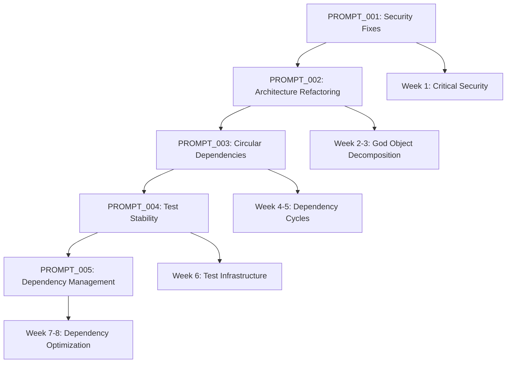

# GPT Dev Prompt MASTER: Uveddi Critical Issues Resolution Coordination

## 🎯 MASTER COORDINATION PROMPT - Implementation Management

### **Overview**: Systematic Resolution of Critical Uveddi Issues
**Reference Documents**: All action plan documents in root directory  
**Total Implementation Time**: 8 weeks  
**Critical Path**: Security → Architecture → Dependencies → Tests → Optimization

---

## **IMPLEMENTATION ROADMAP**

### **📋 PROMPT EXECUTION ORDER**



### **🚨 CRITICAL DEPENDENCIES**
- **PROMPT_002** requires **PROMPT_001** completion (security first)
- **PROMPT_003** requires **PROMPT_002** completion (architecture enables clean dependencies)
- **PROMPT_004** requires **PROMPT_003** completion (stable code before test fixes)
- **PROMPT_005** can run parallel with **PROMPT_004** (independent improvements)

---

## **WEEK-BY-WEEK EXECUTION PLAN**

### **Week 1: Security Crisis Resolution** 
🔴 **CRITICAL - PRODUCTION BLOCKER**
```bash
# Execute: PROMPT_001_SECURITY_FIXES.md
- RSA timing attack mitigation (RUSTSEC-2023-0071)
- JWT security hardening 
- Dependency security updates
- Secret management implementation

# Success Criteria:
- cargo audit shows 0 vulnerabilities
- JWT timing attacks eliminated
- Secrets externalized and encrypted
- Security test suite passing
```

### **Weeks 2-3: Architecture Decomposition**
🟠 **HIGH PRIORITY - TECHNICAL DEBT**
```bash
# Execute: PROMPT_002_ARCHITECTURE_REFACTORING.md
- AnalysisEngine God Object decomposition (2,419 → <500 lines)
- Service extraction (Analysis, Dependency, Performance)
- Orchestrator pattern implementation
- Backward compatibility maintenance

# Success Criteria:
- Largest file <500 lines
- >90% test coverage per service
- No performance regression
- All existing APIs work unchanged
```

### **Weeks 4-5: Circular Dependency Resolution**
🟠 **HIGH PRIORITY - COMPILATION BLOCKER**
```bash
# Execute: PROMPT_003_CIRCULAR_DEPENDENCIES.md  
- Resolve 2,045 circular dependencies → <50
- Interface segregation implementation
- Event-driven architecture adoption
- Dependency inversion pattern

# Success Criteria:
- <50 total circular dependencies (97.5% reduction)
- Clean compilation with no circular errors
- Event system functional
- All components properly decoupled
```

### **Week 6: Test Infrastructure Stabilization**
🟡 **MEDIUM PRIORITY - DEVELOPMENT BLOCKER**
```bash
# Execute: PROMPT_004_TEST_STABILITY.md
- AI feature gate fixes
- Test infrastructure completion
- CI/CD pipeline stabilization
- Mock service implementation

# Success Criteria:
- 100% test compilation success
- Stable CI/CD pipeline
- AI features work in all configurations
- >90% test coverage maintained
```

### **Weeks 7-8: Dependency Optimization**
🟢 **MEDIUM PRIORITY - MAINTENANCE IMPROVEMENT**
```bash
# Execute: PROMPT_005_DEPENDENCY_MANAGEMENT.md
- Security vulnerability resolution
- Dependency consolidation (184 → <120)
- Build performance optimization
- Framework standardization

# Success Criteria:
- Zero security vulnerabilities
- <120 total dependencies
- >20% build time improvement
- Unified framework usage
```

---

## **DAILY COORDINATION CHECKLIST**

### **Before Starting Each Prompt**:
- [ ] **Prerequisites verified** - Previous prompts completed successfully
- [ ] **Branch created** - `feature/UV-{issue-number}-{description}`
- [ ] **Backup created** - Current working state saved
- [ ] **Reference documents reviewed** - Action plans and diagnostic report
- [ ] **Success criteria understood** - Clear acceptance criteria defined

### **During Implementation**:
- [ ] **Progress tracked** - Daily commits with proper Jira references
- [ ] **Tests maintained** - All tests passing at each checkpoint
- [ ] **Documentation updated** - Changes documented as implemented
- [ ] **Performance monitored** - No significant regressions introduced
- [ ] **Security validated** - Security implications considered

### **After Each Prompt Completion**:
- [ ] **Acceptance criteria met** - All requirements verified
- [ ] **Integration testing passed** - Full system still functional
- [ ] **Performance benchmarks run** - No regressions introduced
- [ ] **Security audit passed** - Security posture maintained/improved
- [ ] **Documentation complete** - Changes properly documented
- [ ] **PR created and reviewed** - Code review process followed
- [ ] **Jira issues updated** - Progress tracked and communicated

---

## **RISK MITIGATION STRATEGIES**

### **High-Risk Areas**:

#### **1. Security Implementation (PROMPT_001)**
**Risk**: Production security vulnerabilities  
**Mitigation**: 
- Test security fixes in isolated environment first
- Gradual rollout with monitoring
- Immediate rollback plan prepared
- Security expert review if available

#### **2. Architecture Refactoring (PROMPT_002)**  
**Risk**: Breaking existing functionality  
**Mitigation**:
- Maintain backward compatibility throughout
- Comprehensive integration testing
- Feature flags for gradual migration
- Parallel implementation before replacement

#### **3. Circular Dependencies (PROMPT_003)**
**Risk**: Compilation failures blocking development  
**Mitigation**:
- Resolve in small, testable increments
- Maintain working compilation state
- Interface-first approach
- Rollback plan for each change

#### **4. Test Infrastructure (PROMPT_004)**
**Risk**: Broken CI/CD blocking deployment  
**Mitigation**:
- Test changes in CI/CD staging environment
- Feature flag AI-dependent tests
- Maintain test environment isolation
- Backup CI/CD configuration

#### **5. Dependency Management (PROMPT_005)**
**Risk**: New security vulnerabilities or functionality loss  
**Mitigation**:
- Security audit after each dependency change  
- Comprehensive regression testing
- Gradual dependency updates
- Dependency lock file management

---

## **MONITORING AND VALIDATION**

### **Continuous Health Checks**:
```bash
#!/bin/bash
# scripts/health_check.sh - Run after each prompt

echo "🏥 Running Uveddi health check..."

# Security check
echo "Security: $(cargo audit 2>&1 | grep -c 'Vulnerabilities found: 0' || echo 'FAIL')"

# Compilation check  
echo "Compilation: $(cargo build --all-features && echo 'PASS' || echo 'FAIL')"

# Test check
echo "Tests: $(cargo test --all-features >/dev/null 2>&1 && echo 'PASS' || echo 'FAIL')"

# Performance check (if benchmarks exist)
echo "Performance: $(cargo bench --bench health_benchmarks >/dev/null 2>&1 && echo 'PASS' || echo 'SKIP')"

# Dependency check
echo "Dependencies: $(cargo tree --duplicates | wc -l) conflicts"

# Code quality metrics
echo "Largest file: $(find src -name '*.rs' -exec wc -l {} + | sort -n | tail -1)"

echo "✅ Health check completed"
```

### **Success Metrics Dashboard**:
```
Uveddi Health Score Progress:

Week 0 (Baseline):     72/100
Week 1 (Security):     78/100 (+6)  
Week 3 (Architecture): 85/100 (+7)
Week 5 (Dependencies): 91/100 (+6)
Week 6 (Tests):        94/100 (+3)
Week 8 (Final):        97/100 (+3)

Target: >95/100 (Production Ready)
```

---

## **COORDINATION COMMANDS**

### **Start New Prompt**:
```bash
#!/bin/bash
# scripts/start_prompt.sh <prompt_number>

PROMPT_NUM=$1
echo "🚀 Starting PROMPT_00${PROMPT_NUM}..."

# Create feature branch
git checkout -b "feature/UV-10${PROMPT_NUM}-$(date +%Y%m%d)"

# Run pre-implementation health check
./scripts/health_check.sh > "health_before_prompt_${PROMPT_NUM}.txt"

# Copy prompt to working directory
cp "dev_prompts/PROMPT_00${PROMPT_NUM}_*.md" "CURRENT_PROMPT.md"

echo "✅ Ready to implement PROMPT_00${PROMPT_NUM}"
echo "📖 Review CURRENT_PROMPT.md for detailed instructions"
```

### **Complete Prompt**:
```bash
#!/bin/bash
# scripts/complete_prompt.sh <prompt_number>

PROMPT_NUM=$1
echo "🏁 Completing PROMPT_00${PROMPT_NUM}..."

# Run post-implementation health check
./scripts/health_check.sh > "health_after_prompt_${PROMPT_NUM}.txt"

# Compare before/after
echo "Health improvement:"
diff "health_before_prompt_${PROMPT_NUM}.txt" "health_after_prompt_${PROMPT_NUM}.txt"

# Create PR
gh pr create --title "UV-10${PROMPT_NUM}: $(grep -m1 'Issue:' CURRENT_PROMPT.md | cut -d' ' -f3-)" \
             --body-file CURRENT_PROMPT.md

echo "✅ PROMPT_00${PROMPT_NUM} completed and PR created"
```

---

## **COMMUNICATION UPDATES**

### **Weekly Status Template**:
```markdown
## Uveddi Critical Issues Resolution - Week {X} Status

### ✅ Completed This Week:
- [List completed tasks]
- [Reference Jira issues]
- [Note any blockers resolved]

### 🔄 In Progress:  
- [Current focus areas]
- [Expected completion dates]

### ⚠️ Risks/Blockers:
- [Any issues encountered]
- [Mitigation strategies]

### 📊 Health Metrics:
- Security vulnerabilities: X → Y
- Circular dependencies: X → Y  
- Test pass rate: X% → Y%
- Build time: Xs → Ys

### 🎯 Next Week Focus:
- [Next prompt to execute]
- [Key milestones]
```

---

## **EMERGENCY PROCEDURES**

### **Complete Rollback**:
```bash
# Emergency rollback to known good state
git stash --include-untracked
git checkout main
git pull origin main
cargo build --release  # Verify working
cargo test --all-features  # Verify tests
```

### **Partial Rollback**:
```bash  
# Rollback specific changes
git checkout HEAD~1 -- src/problematic/file.rs
cargo build --all-features  # Test
```

### **Production Hotfix**:
```bash
# Critical security fix deployment
git checkout -b hotfix/security-$(date +%Y%m%d)
# Apply minimal fix
# Test thoroughly  
# Deploy immediately
```

---

## **SUCCESS CELEBRATION CHECKPOINTS** 🎉

- **Week 1 Complete**: Security vulnerabilities eliminated! ✅
- **Week 3 Complete**: God Object defeated! Architecture clean! ✅  
- **Week 5 Complete**: Circular dependencies resolved! ✅
- **Week 6 Complete**: Tests stable and comprehensive! ✅
- **Week 8 Complete**: Dependency management optimized! ✅

**Final Success**: Uveddi transformed from 72/100 to 97/100 health score - production ready! 🚀

---

**Use this master prompt to coordinate the systematic execution of all 5 detailed implementation prompts. Each prompt contains comprehensive technical details, implementation steps, acceptance criteria, and rollback procedures.**
