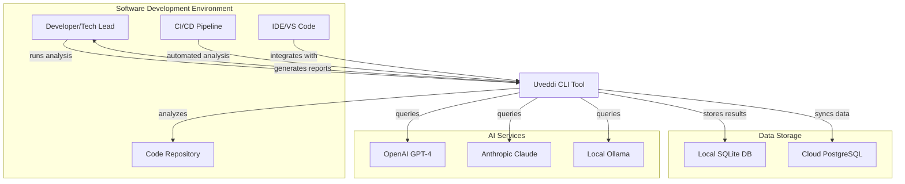
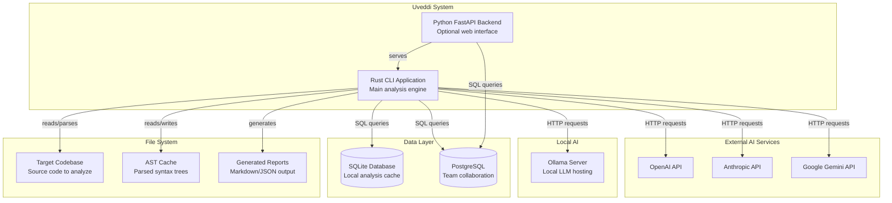
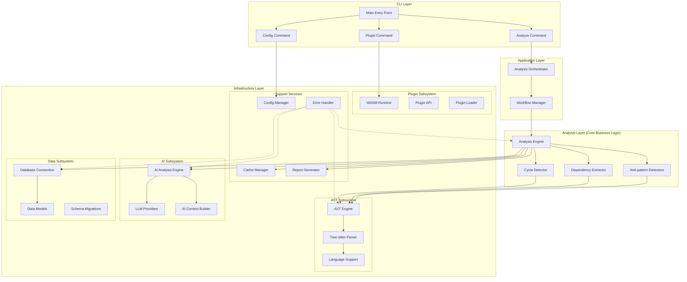
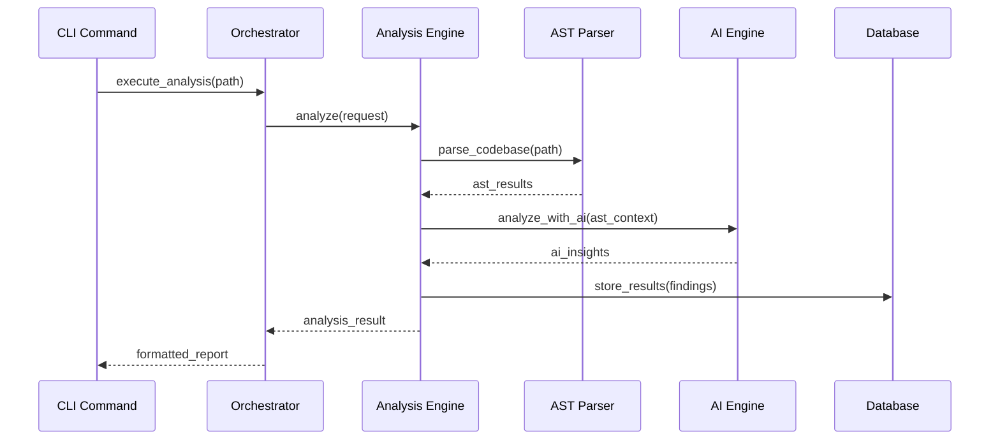
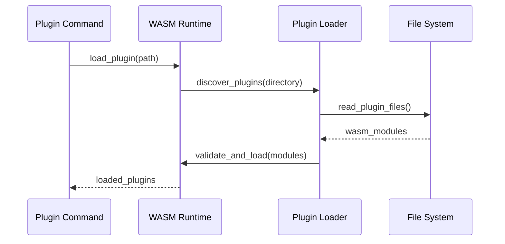

# Uveddi C4 Architecture Model

## C4 Model Overview

The C4 model provides a hierarchical view of Uveddi's architecture through four levels:
1. **Context** - How Uveddi fits into the overall environment
2. **Container** - High-level technology choices and communication
3. **Component** - Internal structure of the Rust CLI application
4. **Code** - Implementation details (classes, functions)

## Level 1: System Context Diagram



**Key Relationships:**
- **Developers** use Uveddi to analyze codebases and receive architectural insights
- **CI/CD Pipelines** integrate Uveddi for automated architecture validation
- **AI Services** provide code analysis capabilities (hybrid local/cloud approach)
- **Databases** store analysis results and metadata for tracking over time

## Level 2: Container Diagram



**Technology Choices:**
- **Rust CLI**: High-performance analysis with excellent error handling
- **Python Backend**: Optional web interface for team collaboration  
- **SQLite**: Fast local caching and development
- **PostgreSQL**: Production-grade team data storage
- **Tree-sitter**: Multi-language AST parsing
- **WASM**: Secure plugin sandboxing

## Level 3: Component Diagram - Rust CLI Application



**Component Responsibilities:**

### CLI Layer Components
- **Main Entry Point**: Command parsing and delegation
- **Commands**: Individual command implementations (analyze, config, plugin)

### Application Layer Components  
- **Analysis Orchestrator**: Coordinates high-level analysis workflows
- **Workflow Manager**: Manages multi-step analysis processes

### Analysis Layer Components
- **Analysis Engine**: Core business logic coordinator
- **Anti-pattern Detectors**: Specialized detectors for architectural smells
- **Dependency Extractor**: Extracts and analyzes code dependencies
- **Cycle Detector**: Identifies circular dependencies

### Infrastructure Components
- **AST Engine**: Manages syntax tree parsing and analysis
- **AI Engine**: Coordinates AI-powered analysis
- **Database Components**: Handle data persistence and querying
- **Plugin System**: Manages WASM-based plugin execution
- **Support Services**: Cross-cutting concerns (caching, config, reporting)

## Level 4: Code Diagram - Key Interfaces

```mermaid
classDiagram
    class AnalysisEngine {
        +analyze(request: AnalysisRequest) Result~AnalysisResult~
        +get_detectors() Vec~Box~dyn AnalysisDetector~~
    }
    
    class AnalysisDetector {
        <<interface>>
        +detect(ast: &AstNode) Result~Vec~Finding~~
        +name() &str
        +description() &str
    }
    
    class LlmProvider {
        <<interface>>
        +analyze_code(context: &AiContext) Result~AiResponse~
        +get_provider_name() &str
        +is_available() bool
    }
    
    class AstParser {
        <<interface>>
        +parse_file(path: &Path) Result~AstNode~
        +supported_languages() Vec~Language~
    }
    
    class AnalysisRepository {
        <<interface>>
        +store_result(result: &AnalysisResult) Result~()~
        +get_results(query: &Query) Result~Vec~AnalysisResult~~
    }
    
    class UveddiError {
        <<enumeration>>
        Analysis(String)
        AstParsing(String)
        AiApi{provider: String, message: String}
        Database(rusqlite::Error)
        Configuration(String)
        Plugin(String)
    }
    
    AnalysisEngine --> AnalysisDetector : uses
    AnalysisEngine --> LlmProvider : uses
    AnalysisEngine --> AstParser : uses
    AnalysisEngine --> AnalysisRepository : uses
    AnalysisEngine --> UveddiError : returns
    
    AnalysisDetector --> UveddiError : returns
    LlmProvider --> UveddiError : returns
    AstParser --> UveddiError : returns
    AnalysisRepository --> UveddiError : returns
```

## Data Flow Patterns

### Analysis Request Flow


### Plugin Loading Flow


## Architectural Decision Records

### ADR-001: Layered Architecture Choice
**Decision**: Implement a strict layered architecture with dependency inversion
**Rationale**: Provides clear separation of concerns and testability
**Consequences**: More initial complexity but better long-term maintainability

### ADR-002: Unified Error Handling
**Decision**: Use a single `UveddiError` enum for all error types
**Rationale**: Simplifies error propagation and handling across layers
**Consequences**: Requires careful error categorization but improves consistency

### ADR-003: WASM Plugin System
**Decision**: Use WebAssembly for plugin sandboxing
**Rationale**: Provides security isolation while maintaining performance
**Consequences**: Additional complexity but enables safe extensibility

### ADR-004: Hybrid AI Architecture
**Decision**: Support both local and cloud AI providers
**Rationale**: Balances privacy concerns with analysis quality
**Consequences**: More complex provider management but flexible deployment

---

This C4 model provides a comprehensive view of Uveddi's architecture, from high-level system context down to implementation details. Use these diagrams to communicate architectural decisions and guide development work.
