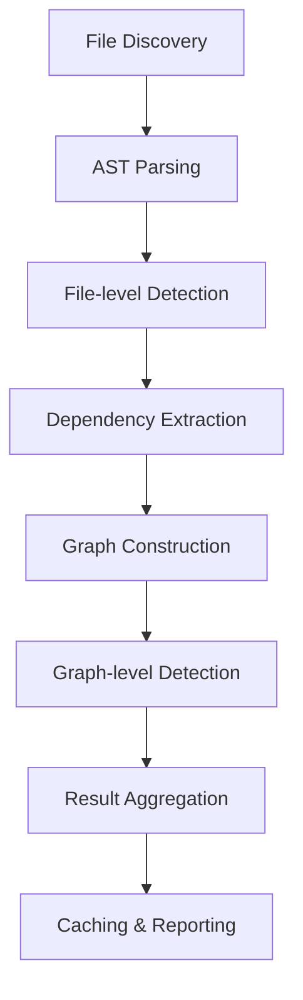

# Uveddi Analysis Engine - Deep Dive

## 🔍 **Overview**

The Uveddi Analysis Engine is the core component responsible for detecting architectural anti-patterns and code quality issues across multiple programming languages. This document provides a comprehensive technical overview of its architecture, components, and capabilities.

## 🏗️ **Architecture Overview**

The analysis engine follows a sophisticated **trait-based, pluggable architecture** that enables extensible detection of architectural anti-patterns:

```
┌─────────────────────────────────────────────────────────────┐
│                    AnalysisEngine                           │
│  ┌─────────────────┐ ┌─────────────────┐ ┌─────────────────┐│
│  │   AstParser     │ │ DependencyGraph │ │ ResultCache     ││
│  └─────────────────┘ └─────────────────┘ └─────────────────┘│
└─────────────────────────────────────────────────────────────┘
                              │
                              ▼
┌─────────────────────────────────────────────────────────────┐
│                 AnalysisDetector Trait                     │
│  ┌─────────────────┐ ┌─────────────────┐ ┌─────────────────┐│
│  │ GodObjectDetector│ │  CycleDetector  │ │ MagicValues...  ││
│  └─────────────────┘ └─────────────────┘ └─────────────────┘│
└─────────────────────────────────────────────────────────────┘
```

## 🎯 **Core Components**

### 1. **AnalysisEngine** (The Orchestrator)

**Location**: `src/analysis/engine.rs`

**Purpose**: Main entry point that coordinates all analysis phases

**Key Features**:
- Multi-detector support with pluggable architecture
- Async file processing for performance
- Intelligent caching (SQLite-based)
- Error recovery (continues even if individual files fail)
- Dependency graph construction

**Key Methods**:
```rust
impl AnalysisEngine {
    pub fn new() -> Result<Self, UveddiError>
    pub async fn analyze(&mut self, path: &Path) -> Result<(Vec<ArchitecturalIssue>, LocalDependencyGraph), UveddiError>
    pub fn get_anti_pattern_types(&self) -> Vec<AntiPatternType>
    pub fn get_files_analyzed(&self) -> i32
}
```

### 2. **AnalysisDetector Trait** (The Interface)

**Location**: `src/analysis/mod.rs`

The core trait that all detectors must implement:

```rust
pub trait AnalysisDetector {
    fn detect_issues(&self, file: &ParsedFile) -> Result<Vec<ArchitecturalIssue>, AnalysisError>;
    fn detect_graph_issues(&self, graph: &LocalDependencyGraph, run_id: i64) -> Vec<ArchitecturalIssue>;
    fn get_anti_pattern_types(&self) -> Vec<AntiPatternType>;
    fn get_detector_name(&self) -> &'static str;
}
```

**Design Principles**:
- **Performance**: Detectors should be efficient as they run on every file
- **Language Support**: Use `ParsedFile.language` to provide language-specific logic
- **Error Handling**: Return `AnalysisError` for serious issues, empty Vec for no findings
- **Caching**: Leverage the AST cache for expensive parsing operations

### 3. **Detection Types**

#### **File-level Analysis**
- Operates on individual `ParsedFile` instances
- Uses AST parsing for deep structural understanding
- Language-specific pattern matching

#### **Graph-level Analysis**
- Analyzes the entire dependency graph
- Detects architectural patterns across modules
- Identifies system-wide issues like cycles

## 🔍 **Detection Categories**

### **Universal Anti-patterns** (Multi-language)

**Location**: `src/analysis/detectors/anti_patterns/`

- **God Object**: Classes/structs with too many responsibilities
- **Cyclic Dependencies**: Circular dependencies between modules
- **Magic Values**: Hardcoded constants without explanation
- **Global State**: Excessive use of global variables
- **Tight Coupling**: High interdependence between components
- **Resource Leaks**: Improper resource management
- **Silent Failures**: Errors that fail without notification
- **Code Duplication**: Repeated code patterns
- **Leaky Abstraction**: Implementation details exposed through interfaces

### **Language-Specific Detectors**

#### **Rust** (`src/analysis/detectors/anti_patterns/rust/`)
- **Clone Abuse**: Excessive use of `.clone()`
- **Unwrap Abuse**: Overuse of `.unwrap()` without error handling
- **Lifetime Complexity**: Overly complex lifetime annotations
- **Memory Management**: Improper memory handling patterns

#### **Python** (`src/analysis/detectors/anti_patterns/python/`)
- **Data Structure Misuse**: Inefficient data structure usage
- **Exception Handling**: Poor exception handling patterns
- **OOP Issues**: Object-oriented programming violations
- **Performance Issues**: Performance anti-patterns

#### **JavaScript** (`src/analysis/detectors/anti_patterns/javascript/`)
- **Async Anti-patterns**: Improper async/await usage
- **Scope Issues**: Variable scoping problems
- **Type Coercion**: Problematic type conversion patterns
- **DOM Issues**: DOM manipulation anti-patterns
- **Module Dependency**: Module loading issues

#### **Java** (`src/analysis/detectors/anti_patterns/java/`)
- **Concurrency Issues**: Thread safety problems
- **OOP Issues**: Object-oriented violations
- **Resource Management**: Resource handling problems
- **Type System**: Type system misuse

## 🚀 **Analysis Pipeline**



### **Step-by-Step Process**:

1. **File Discovery**: `AsyncWalker` finds source files recursively
2. **AST Parsing**: `AstParser` creates syntax trees using Tree-sitter
3. **File-level Detection**: Each registered detector analyzes individual files
4. **Dependency Extraction**: `DependencyExtractor` builds import/use relationships
5. **Graph Construction**: `LocalDependencyGraph` models architectural dependencies
6. **Graph-level Detection**: Detectors analyze the entire dependency structure
7. **Result Aggregation**: All issues are collected and categorized
8. **Caching**: Results cached for performance on subsequent runs

### **Caching Strategy**

The engine implements intelligent caching to improve performance:

```rust
#[derive(serde::Serialize, serde::Deserialize, Debug)]
struct CachedAnalysisResult {
    issues: Vec<ArchitecturalIssue>,
    dependencies: Vec<Dependency>,
}
```

- **Cache Key**: File path and modification time
- **Cache Storage**: SQLite database (`uveddi_cache.db`)
- **Cache Hit**: Reuses previous analysis results
- **Cache Miss**: Performs fresh analysis and stores results

## 🎯 **God Object Detector - Deep Dive**

**Location**: `src/analysis/detectors/anti_patterns/god_object.rs`

The God Object detector demonstrates the system's sophisticated capabilities:

### **Multi-language Support**

#### **Rust Analysis**:
- Correlates `struct` definitions with `impl` blocks
- Uses separate queries for structure and implementation
- Handles Rust's unique ownership model

```rust
const RUST_STRUCT_QUERY: &str = r#"
(struct_item
  name: (type_identifier) @name
  body: (field_declaration_list) @body
)
"#;

const RUST_IMPL_QUERY: &str = r#"
(impl_item
  type: (type_identifier) @name
  body: (declaration_list) @body
)
"#;
```

#### **Python/JavaScript Analysis**:
- Analyzes class definitions directly
- Single-pass analysis for simpler object models

```rust
const PYTHON_CLASS_QUERY: &str = r#"
(class_definition
  name: (identifier) @name
  body: (block) @body
)
"#;
```

### **Intelligent Scoring**

The detector uses a sophisticated scoring algorithm:

```rust
fn score_severity(&self, method_count: usize, field_count: usize) -> Option<String> {
    let method_excess = method_count.saturating_sub(self.method_threshold);
    let field_excess = field_count.saturating_sub(self.field_threshold);
    
    // Only consider it an issue if at least one threshold is exceeded
    if method_excess == 0 && field_excess == 0 {
        return None;
    }

    let total_excess = method_excess + field_excess;
    let severity = match total_excess {
        0..=4 => "Medium",
        5..=10 => "High", 
        _ => "Critical",
    };
    Some(severity.to_string())
}
```

**Default Thresholds**:
- Methods: > 5
- Fields: > 8

### **Rich Context Extraction**

Each detected issue includes:
- Precise line numbers (start and end)
- Complete code snippet of the problematic class/struct
- Detailed description with metrics
- Severity classification

## 🔧 **Dependency Analysis**

**Location**: `src/analysis/detectors/dependency.rs`

### **DependencyExtractor**

Extracts import/use relationships using AST parsing:

```rust
pub struct DependencyExtractor {
    parser: AstParser,
}

impl DependencyExtractor {
    pub fn extract_from_file(&self, file_path: &Path) -> Result<Vec<Dependency>, ExtractionError>
    pub fn extract_from_ast(&self, parsed_file: &ParsedFile) -> Result<Vec<Dependency>, ExtractionError>
    pub fn extract_from_files_parallel(&mut self, file_paths: &[&Path]) -> Vec<Result<Vec<Dependency>, ExtractionError>>
}
```

### **Language-Specific Queries**

- **Rust**: `use` statements and `mod` declarations
- **Python**: `import` and `from ... import` statements
- **JavaScript**: `import` and `require()` statements

### **Dependency Graph Construction**

**Location**: `src/analysis/graph/dependency.rs`

```rust
pub struct LocalDependencyGraph {
    graph: DiGraph<ComponentNode, DependencyEdge>,
    node_map: HashMap<ComponentNode, NodeIndex>,
}

pub enum ComponentNode {
    Module { path: String },
    Class { name: String, file_path: String },
    Function { name: String, file_path: String },
}

pub enum LocalDependencyType {
    Call,           // Direct function/method call
    Import,         // Import/use statement
    Inheritance,    // Class inheritance
    Implementation, // Interface implementation
}
```

## 🔄 **Cycle Detection**

**Location**: `src/analysis/detectors/cycle.rs`

Uses Tarjan's algorithm for efficient cycle detection:

```rust
pub struct CycleDetector;

impl CycleDetector {
    pub fn detect_cycles(&self, graph: &LocalDependencyGraph, analysis_run_id: i64) -> Vec<ArchitecturalIssue> {
        let petgraph = graph.get_petgraph();
        let sccs = tarjan_scc(&petgraph);  // Strongly Connected Components
        
        // Any SCC with more than one node represents a cycle
        for scc in sccs {
            if scc.len() > 1 {
                // Create architectural issue for the cycle
            }
        }
    }
}
```

**Features**:
- Efficient O(V + E) complexity using Tarjan's algorithm
- Detects all cycles in the dependency graph
- Provides detailed cycle information in issues

## 🎨 **Analysis Results**

### **ArchitecturalIssue Structure**

```rust
pub struct ArchitecturalIssue {
    pub issue_id: Option<i64>,
    pub analysis_run_id: i64,
    pub anti_pattern_type_id: i64,
    pub file_path: String,
    pub start_line: Option<i32>,
    pub end_line: Option<i32>, 
    pub severity: String,        // Critical/High/Medium/Low
    pub description: String,     // Human-readable explanation
    pub code_snippet: Option<String>, // Relevant code context
    pub ai_explanation: Option<String>, // AI-generated insights
}
```

### **Anti-Pattern Types**

```rust
pub struct AntiPatternType {
    pub anti_pattern_type_id: Option<i64>,
    pub name: String,
    pub description: String,
    pub category: String,  // e.g., "Abstraction-Based", "Structural"
}
```

## 🚀 **Performance Optimizations**

### **Async Processing**
- Non-blocking file analysis using `tokio`
- Concurrent processing of multiple files
- Stream-based file discovery with `AsyncWalker`

### **Parallel Extraction**
- Rayon-based parallel dependency extraction
- CPU-bound tasks distributed across cores
- Efficient memory usage

### **Smart Caching**
- SQLite-based result caching
- File modification time tracking
- Incremental analysis support

### **Lazy Loading**
- AST trees only parsed when needed
- Memory-efficient processing of large codebases
- Streaming file processing

## 🛡️ **Error Handling**

### **Graceful Degradation**
- Analysis continues even if individual detectors fail
- Partial results returned when possible
- Non-critical errors logged as warnings

### **Error Types**
```rust
pub enum AnalysisError {
    AntiPatternDetection(String),
    QueryError(String),
    AstError(AstError),
    // ... other error types
}
```

### **Recovery Strategies**
- Skip problematic files and continue analysis
- Fallback to simpler detection methods when possible
- Detailed error logging for debugging

## 🔌 **Extensibility**

### **Adding New Detectors**

1. **Implement the AnalysisDetector trait**:
```rust
pub struct MyCustomDetector;

impl AnalysisDetector for MyCustomDetector {
    fn get_detector_name(&self) -> &'static str {
        "MyCustomDetector"
    }
    
    fn get_anti_pattern_types(&self) -> Vec<AntiPatternType> {
        vec![/* your anti-pattern types */]
    }
    
    fn detect_issues(&self, parsed_file: &ParsedFile) -> Result<Vec<ArchitecturalIssue>, AnalysisError> {
        // Your detection logic here
    }
}
```

2. **Register with the engine**:
```rust
let mut engine = AnalysisEngine::new()?;
engine.add_detector(Box::new(MyCustomDetector::new()));
```

### **Language Support**

Adding support for new languages:

1. **Add language to SourceLanguage enum**
2. **Create Tree-sitter queries for the language**
3. **Implement language-specific detection logic**
4. **Add dependency extraction patterns**

### **Custom Queries**

Tree-sitter queries enable precise pattern matching:

```rust
const CUSTOM_PATTERN_QUERY: &str = r#"
(function_definition
  name: (identifier) @name
  parameters: (parameters) @params
  body: (block) @body
)
"#;
```

## 🌟 **What Makes This Special**

1. **Architectural Focus**: Goes beyond syntax to analyze design patterns
2. **Multi-language Intelligence**: Understands language-specific idioms
3. **Graph-based Analysis**: Considers system-wide relationships
4. **AI Integration**: Enhances detection with intelligent explanations
5. **Alpha Development**: Robust architecture with error handling and performance optimization in progress
6. **Extensible Design**: Easy to add new detectors and languages
7. **Performance Optimized**: Async, parallel, and cached processing

## 📊 **Usage Examples**

### **Basic Analysis**
```rust
use uveddi::analysis::AnalysisEngine;
use std::path::Path;

#[tokio::main]
async fn main() -> Result<(), Box<dyn std::error::Error>> {
    let mut engine = AnalysisEngine::new()?;
    let (issues, graph) = engine.analyze(Path::new("src/")).await?;
    
    println!("Found {} issues", issues.len());
    for issue in issues {
        println!("  {}: {} ({})", issue.severity, issue.description, issue.file_path);
    }
    
    Ok(())
}
```

### **Custom Detector Registration**
```rust
let mut engine = AnalysisEngine::new()?;

// Add custom detectors
engine.add_detector(Box::new(GodObjectDetector::new(10, 15))); // Custom thresholds
engine.add_detector(Box::new(MyCustomDetector::new()));

let (issues, graph) = engine.analyze(Path::new("src/")).await?;
```

## 🔮 **Future Enhancements**

### **Planned Features**
- Machine learning-based pattern detection
- Custom rule definition language
- Real-time analysis integration
- IDE plugin support
- Advanced visualization tools

### **Extensibility Roadmap**
- Plugin marketplace
- Community detector contributions
- Language pack system
- Custom metric definitions

---

## 📚 **Related Documentation**

- [Architecture Overview](./ARCHITECTURE.md)
- [Plugin Development Guide](../plugins/DEVELOPER_GUIDE.md)
- [Testing Strategy](../tests/README.md)
- [AI Integration Guide](./AI_INTEGRATION.md)

---

*This document provides a comprehensive technical overview of the Uveddi Analysis Engine. For implementation details, refer to the source code in `src/analysis/`.*