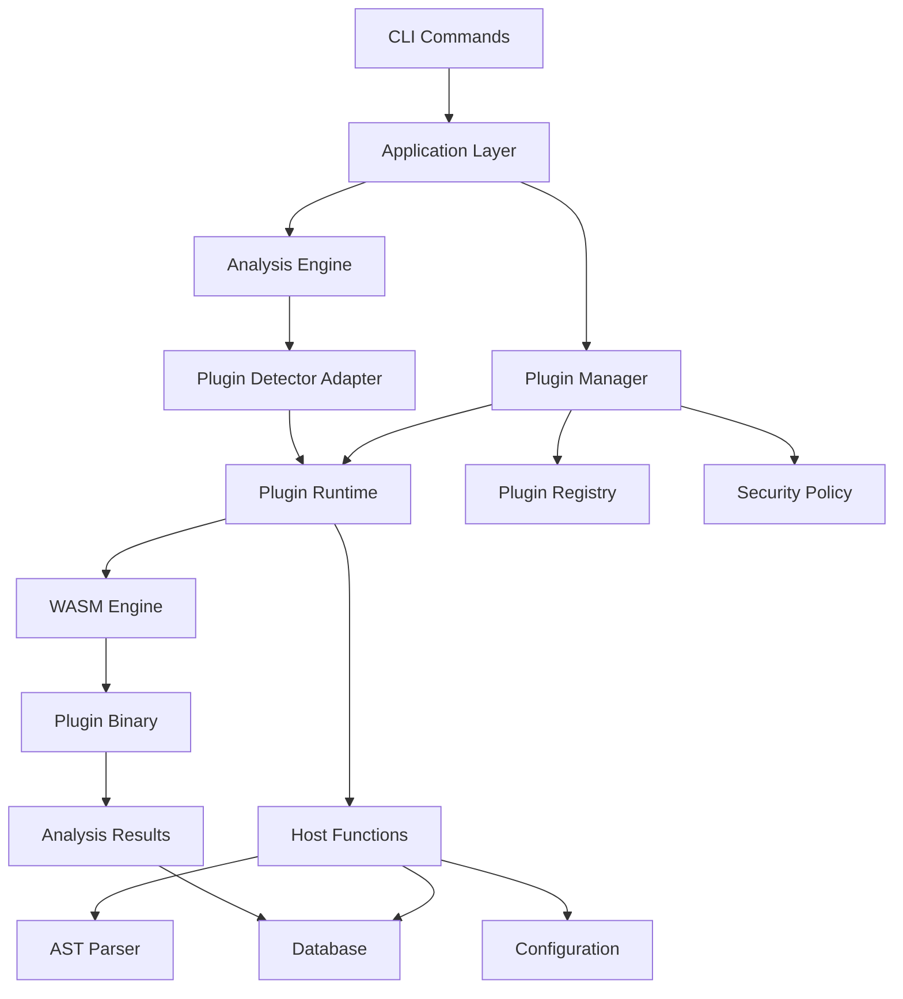

# WASM Plugin System Architecture

## Overview

Uveddi features a **production-ready WebAssembly (WASM) plugin system** that enables secure, performant extensibility through WebAssembly plugins. The system provides complete integration with Uveddi's core analysis pipeline, allowing plugins to function as first-class analysis detectors alongside built-in functionality.

## Architecture Diagram



## Core Components

### 1. CLI Integration Layer (`src/cli/plugin_command.rs`)

**Purpose**: Provides complete command-line interface for plugin lifecycle management.

**Commands Available**:
```bash
uveddi plugin install <plugin.wasm>    # Install a plugin from binary
uveddi plugin list                     # List all installed plugins  
uveddi plugin info <plugin-id>         # Get detailed plugin information
uveddi plugin remove <plugin-id>       # Remove an installed plugin
uveddi plugin test <plugin-id>         # Test plugin functionality
uveddi plugin update <plugin-id>       # Update plugin to newer version
```

**Key Features**:
- Automatic plugin discovery and validation
- Manifest file parsing and validation
- Plugin installation with security checks
- Status monitoring and error reporting

### 2. Application Layer Integration (`src/application/`)

#### Plugin Manager (`plugin_manager.rs`)

**Purpose**: High-level plugin orchestration and integration with Uveddi's core systems.

**Key Responsibilities**:
- Plugin lifecycle management (install/uninstall/enable/disable)
- Integration with database and analysis engine
- Plugin status tracking and monitoring
- Resource limit enforcement
- Configuration management

**Configuration Options**:
```rust
pub struct PluginManagerConfig {
    pub plugins_directory: PathBuf,           // Plugin storage location
    pub default_security_policy: SecurityPolicy, // Default security settings
    pub max_plugins: usize,                   // Maximum plugins allowed
    pub enable_hot_reload: bool,              // Development mode hot reload
    pub execution_timeout_seconds: u64,       // Plugin execution limits
}
```

#### Startup Integration (`startup.rs`)

**Purpose**: Application initialization with plugin system integration.

**Features**:
- Automatic plugin discovery on startup
- Plugin auto-loading from configured directory
- Integration with database and analysis engine initialization
- Development and production mode configurations
- Graceful error handling and recovery

### 3. Host Functions Layer (`src/plugins/host_functions.rs`)

**Purpose**: Provides plugins access to Uveddi's core services and functionality.

**Available Host Functions**:

| Function | Purpose | Permissions Required |
|----------|---------|---------------------|
| `parse_ast(code, language)` | Parse code into AST using tree-sitter | `ConfigRead` |
| `get_analysis_context(file_path)` | Get file analysis context and metadata | `ConfigRead` |
| `store_plugin_results(results, run_id)` | Store analysis results in database | `TempFileCreate` |
| `get_project_config(key)` | Retrieve configuration values | `ConfigRead` |
| `set_project_config(key, value)` | Set configuration values | `ConfigRead` |
| `log_message(level, message)` | Plugin logging and debugging | `Logging` |
| `get_analysis_run(run_id)` | Retrieve analysis run information | `ConfigRead` |
| `execute_tree_sitter_query(file, query)` | Execute tree-sitter queries on AST | `ConfigRead` |

**Security Model**:
- Capability-based security with granular permissions
- Context isolation per plugin
- Resource usage monitoring
- Secure serialization of data exchange

### 4. Runtime Integration Layer (`src/plugins/runtime.rs`)

**Purpose**: WASM runtime management with security, monitoring, and resource control.

**Key Features**:

#### Runtime Configuration
```rust
pub struct GlobalRuntimeConfig {
    pub max_concurrent_plugins: usize,    // Concurrent execution limit
    pub default_fuel_limit: u64,          // Computation limits
    pub default_memory_limit: usize,      // Memory limits
    pub enable_debugging: bool,           // Debug support
    pub enable_profiling: bool,           // Performance profiling
}
```

#### Security & Resource Management
- **Fuel Limits**: Prevent infinite loops and excessive computation
- **Memory Limits**: Configurable memory usage restrictions
- **Execution Timeouts**: Time-based execution limits
- **Capability Isolation**: Sandboxed execution environment
- **Resource Monitoring**: Real-time resource usage tracking

#### Runtime Statistics
```rust
pub struct PluginRuntimeStats {
    pub total_executions: u64,
    pub total_execution_time_ms: u64,
    pub average_execution_time_ms: f64,
    pub fuel_consumed: u64,
    pub memory_peak_bytes: usize,
    pub host_calls_made: u32,
    pub errors_count: u32,
}
```

### 5. Analysis Integration Layer (`src/analysis/plugin_detector_adapter.rs`)

**Purpose**: Seamless integration of WASM plugins with Uveddi's analysis pipeline.

**Key Features**:
- **Detector Adapter**: Wraps plugins as `AnalysisDetector` implementations
- **Result Conversion**: Converts plugin results to `ArchitecturalIssue` format
- **Error Handling**: Comprehensive error recovery and retry logic
- **Performance Monitoring**: Tracks plugin performance within analysis pipeline

**Execution Flow**:
1. Analysis engine calls plugin via adapter
2. Adapter serializes file data for plugin
3. Plugin executes analysis in WASM runtime
4. Results deserialized and converted to Uveddi format
5. Results integrated with standard analysis workflow

### 6. Security Layer (`src/plugins/security.rs`)

**Purpose**: Comprehensive security model for plugin execution.

**Security Features**:

#### Capability-Based Permissions
```rust
pub enum Permission {
    FileRead(PathBuf),        // File system read access
    FileWrite(PathBuf),       // File system write access
    NetworkConnect(String),   // Network access
    EnvRead(String),         // Environment variable access
    Logging,                 // Logging permissions
    ConfigRead,              // Configuration access
    TempFileCreate,          // Temporary file creation
}
```

#### Security Policies
```rust
pub struct SecurityPolicy {
    pub resource_limits: ResourceLimits,
    pub permissions: HashSet<Permission>,
    pub trusted_publishers: HashSet<String>,
    pub require_code_signing: bool,
    pub require_static_analysis: bool,
    pub max_binary_size: u64,
}
```

## Plugin Development Workflow

### 1. Plugin Template Structure

```
plugin-template/
├── Cargo.toml          # Rust project configuration
├── Makefile           # Build automation
├── README.md          # Plugin documentation
├── build.rs           # Custom build scripts
├── plugin.toml        # Plugin manifest
└── src/
    └── lib.rs         # Plugin implementation
```

### 2. Plugin Manifest (`plugin.toml`)

```toml
[plugin]
name = "my-analyzer"
version = "1.0.0"
description = "Custom analysis plugin"
author = "Plugin Developer"
license = "MIT"

[capabilities]
permissions = ["ConfigRead", "TempFileCreate", "Logging"]
max_memory_mb = 32
max_execution_seconds = 30

[dependencies]
min_uveddi_version = "1.0.0"
requires_tree_sitter = true
supported_languages = ["rust", "python"]
```

### 3. Development Process

1. **Generate Plugin Scaffold**:
   ```bash
   scripts/generate-plugin.py my-analyzer
   ```

2. **Implement Plugin Logic**:
   ```rust
   use uveddi_plugin_interface::*;
   
   #[export_name = "analyze_file"]
   pub fn analyze_file(file_data: &[u8]) -> Vec<u8> {
       // Plugin implementation
   }
   ```

3. **Build Plugin**:
   ```bash
   cd plugins/my-analyzer
   make build
   ```

4. **Test Plugin**:
   ```bash
   make test
   uveddi plugin test my-analyzer
   ```

5. **Install Plugin**:
   ```bash
   uveddi plugin install my-analyzer.wasm
   ```

## Integration with Analysis Pipeline

### Plugin as Analysis Detector

Plugins integrate seamlessly with Uveddi's analysis engine through the `PluginDetectorAdapter`:

```rust
impl AnalysisDetector for PluginDetectorAdapter {
    fn name(&self) -> &str { &self.plugin_name }
    
    fn anti_pattern_types(&self) -> Vec<AntiPatternType> {
        self.supported_anti_patterns.clone()
    }
    
    async fn analyze_file(&self, file: &ParsedFile) -> Result<Vec<ArchitecturalIssue>, AnalysisError> {
        // Execute plugin and convert results
    }
}
```

### Data Flow

1. **Analysis Request** → Analysis Engine
2. **File Processing** → Plugin Detector Adapter
3. **Data Serialization** → Plugin Runtime
4. **WASM Execution** → Plugin Binary
5. **Result Processing** → Analysis Engine
6. **Report Generation** → Standard Uveddi Reports

## Performance Considerations

### Optimization Features

1. **Resource Limits**: Configurable CPU and memory limits
2. **Fuel System**: Prevents runaway computations
3. **Caching**: Plugin results can be cached for repeated analysis
4. **Parallel Execution**: Multiple plugins can run concurrently
5. **Lazy Loading**: Plugins loaded on-demand

### Performance Monitoring

```rust
// Runtime statistics tracking
pub struct RuntimeStats {
    pub total_registered_plugins: usize,
    pub total_executions: u64,
    pub average_execution_time_ms: f64,
    pub total_fuel_consumed: u64,
    pub total_memory_used_bytes: usize,
    pub error_rate: f64,
}
```

## Configuration Options

### Feature Flags

- **`wasm-plugins`**: Enable complete WASM plugin system
- **`dev-minimal`**: Lightweight builds without plugin system
- **`production`**: Full plugin system with all features

### Runtime Profiles

#### Development Profile
```rust
GlobalRuntimeConfig {
    max_concurrent_plugins: 5,
    default_fuel_limit: 500_000,
    default_memory_limit: 32 * 1024 * 1024, // 32MB
    enable_debugging: true,
    enable_profiling: true,
}
```

#### Production Profile
```rust
GlobalRuntimeConfig {
    max_concurrent_plugins: 20,
    default_fuel_limit: 2_000_000,
    default_memory_limit: 128 * 1024 * 1024, // 128MB
    enable_debugging: false,
    enable_profiling: true,
}
```

## Error Handling and Recovery

### Error Categories

1. **Installation Errors**: Invalid plugin format, missing dependencies
2. **Runtime Errors**: Execution failures, resource exhaustion
3. **Permission Errors**: Security policy violations
4. **Integration Errors**: Analysis pipeline integration failures

### Recovery Mechanisms

- **Automatic Retry**: Configurable retry logic with exponential backoff
- **Graceful Degradation**: Continue analysis without failed plugins
- **Error Isolation**: Plugin failures don't affect other plugins
- **Comprehensive Logging**: Detailed error reporting and diagnostics

## Security Architecture

### Threat Model

1. **Malicious Plugins**: Prevent unauthorized system access
2. **Resource Exhaustion**: Prevent denial-of-service attacks
3. **Data Exfiltration**: Restrict plugin access to sensitive data
4. **Code Injection**: Validate plugin binaries and manifests

### Mitigation Strategies

1. **WASM Sandboxing**: Isolated execution environment
2. **Capability-Based Security**: Explicit permission grants
3. **Resource Limits**: CPU, memory, and time restrictions
4. **Static Analysis**: Plugin binary validation
5. **Code Signing**: Optional trusted publisher verification

## Production Deployment

### Deployment Checklist

- [ ] Enable `wasm-plugins` feature flag
- [ ] Configure plugin directory and permissions
- [ ] Set appropriate resource limits
- [ ] Enable production runtime profile
- [ ] Configure security policies
- [ ] Test plugin loading and execution
- [ ] Monitor plugin performance and resources

### Monitoring and Observability

- Plugin execution metrics
- Resource usage monitoring
- Error rate tracking
- Performance profiling
- Security event logging

## Future Enhancements

### Planned Features

1. **Hot Reload**: Runtime plugin updates without restart
2. **Plugin Dependencies**: Inter-plugin communication
3. **Distributed Plugins**: Remote plugin execution
4. **Plugin Marketplace**: Community plugin distribution
5. **Advanced Security**: Enhanced permission model

### Extension Points

1. **Custom Host Functions**: Additional API endpoints
2. **Language Support**: Extended language parsers
3. **Protocol Extensions**: Custom data exchange formats
4. **Integration APIs**: Third-party tool integration

## Conclusion

Uveddi's WASM Plugin System provides a comprehensive, secure, and performant extensibility framework. The system is production-ready with complete CLI integration, host function APIs, runtime management, and seamless analysis pipeline integration. The architecture prioritizes security, performance, and developer experience while maintaining compatibility with Uveddi's existing functionality.