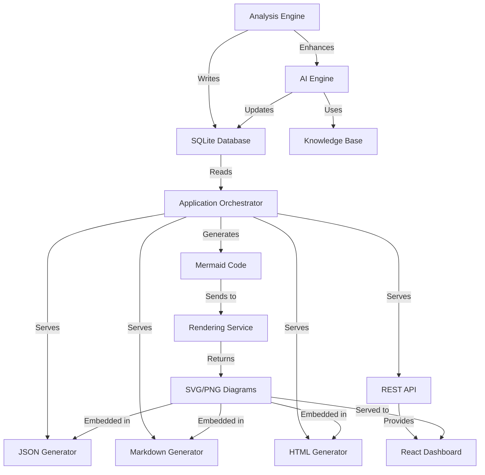
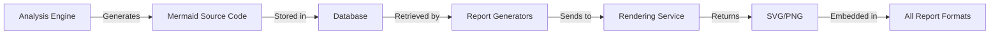

# Report Generation Architecture

## Overview

This document provides a comprehensive guide to Uveddi's report generation system, covering the unified data flow from analysis to multiple output formats including JSON, Markdown, HTML, and the interactive React dashboard. All report formats pull from the same unified data sources to ensure consistency across the entire system.

## Table of Contents

- [Architecture Principles](#architecture-principles)
- [Unified Data Sources](#unified-data-sources)
- [Data Flow Architecture](#data-flow-architecture)
- [Report Generation Components](#report-generation-components)
- [Mermaid Diagram Integration](#mermaid-diagram-integration)
- [Interactive React Dashboard](#interactive-react-dashboard)
- [API Layer](#api-layer)
- [Caching and Performance](#caching-and-performance)
- [Implementation Details](#implementation-details)

## Architecture Principles

### Unified Data Source Philosophy

Uveddi's report generation follows a **single source of truth** principle:

1. **Centralized Analysis**: All analysis results flow through a single application orchestrator
2. **Shared Database**: All report formats read from the same SQLite database schema
3. **Consistent AI Enhancement**: Single AI engine enhances all data uniformly
4. **Common Data Structures**: Shared Rust types ensure type safety across all formats

### Layered Architecture

```
┌─────────────────────────────────────────────────────────────┐
│                    Presentation Layer                       │
│  ┌─────────────┐ ┌─────────────┐ ┌─────────────────────────┐ │
│  │    JSON     │ │  Markdown   │ │    React Dashboard      │ │
│  │   Reports   │ │   Reports   │ │   (Interactive UI)     │ │
│  └─────────────┘ └─────────────┘ └─────────────────────────┘ │
└─────────────────────────────────────────────────────────────┘
┌─────────────────────────────────────────────────────────────┐
│                      API Layer                             │
│  ┌─────────────────┐ ┌─────────────────────────────────────┐ │
│  │  REST API       │ │     Rendering Service             │ │
│  │ (Reports)       │ │   (Mermaid Diagrams)             │ │
│  └─────────────────┘ └─────────────────────────────────────┘ │
└─────────────────────────────────────────────────────────────┘
┌─────────────────────────────────────────────────────────────┐
│                  Application Layer                         │
│  ┌─────────────────────────────────────────────────────────┐ │
│  │         Application Orchestrator                       │ │
│  │        (src/application/mod.rs:376-448)               │ │
│  └─────────────────────────────────────────────────────────┘ │
└─────────────────────────────────────────────────────────────┘
┌─────────────────────────────────────────────────────────────┐
│                   Analysis Layer                           │
│  ┌─────────────┐ ┌─────────────┐ ┌─────────────────────────┐ │
│  │   Analysis  │ │ AI Engine   │ │   Knowledge Base       │ │
│  │   Engine    │ │ (Ollama)    │ │   (Patterns)          │ │
│  └─────────────┘ └─────────────┘ └─────────────────────────┘ │
└─────────────────────────────────────────────────────────────┘
┌─────────────────────────────────────────────────────────────┐
│                Infrastructure Layer                        │
│  ┌─────────────┐ ┌─────────────┐ ┌─────────────────────────┐ │
│  │   SQLite    │ │    AST      │ │       Plugins          │ │
│  │  Database   │ │ Parsing     │ │    (WebAssembly)       │ │
│  └─────────────┘ └─────────────┘ └─────────────────────────┘ │
└─────────────────────────────────────────────────────────────┘
```

## Unified Data Sources

### Primary Data Sources

All report formats pull from these unified sources:

1. **SQLite Database** (`src/database/models.rs`)
   - `AnalysisRun` - Analysis metadata and configuration
   - `ArchitecturalIssue` - Detected issues and findings
   - `AntiPatternType` - Issue categorization and severity

2. **AI Enhancement Layer** (`src/ai/engine.rs`)
   - Local AI through Ollama integration
   - Knowledge-based insights when AI unavailable
   - Unified enhancement process for all issues

3. **Knowledge Base** (`src/ai/knowledge/`)
   - Internal architectural patterns
   - Best practice recommendations
   - Context-aware insights

### Data Consistency Mechanisms

```rust
// Application Orchestrator ensures all formats use same data
impl ApplicationOrchestrator {
    pub async fn execute_analysis(&mut self, config: AnalysisConfig) -> Result<AnalysisReport, UveddiError> {
        // Single data retrieval for all formats
        let issues = self.database.get_architectural_issues(&analysis_run.run_id)?;
        let anti_pattern_types = self.database.get_all_anti_pattern_types()?;
        
        // Unified AI enhancement
        for issue in &mut issues {
            self.ai_engine.analyze_issue_with_knowledge(issue, &knowledge_context).await?;
        }
        
        // Same data structure used by all report generators
        Ok(AnalysisReport { issues, anti_pattern_types, ... })
    }
}
```

## Data Flow Architecture

### Complete Data Flow Diagram



### Step-by-Step Data Flow

1. **Analysis Phase**
   ```
   Code Analysis → AST Parsing → Issue Detection → Database Storage
   ```

2. **Enhancement Phase**
   ```
   Database Issues → AI Analysis → Knowledge Context → Enhanced Issues → Database Update
   ```

3. **Report Generation Phase**
   ```
   Database Query → Application Orchestrator → Report Generators → Output Formats
   ```

4. **Interactive Dashboard Phase**
   ```
   API Request → Application Orchestrator → JSON Serialization → React Components
   ```

## Report Generation Components

### Core Components

#### 1. Application Orchestrator (`src/application/mod.rs`)

**Purpose**: Central coordination point for all report generation

**Key Responsibilities**:
- Unified data retrieval from database
- AI enhancement coordination
- Data structure preparation for all formats

**Critical Code Section**:
```rust
// Lines 376-448: Core data preparation used by all formats
pub async fn execute_analysis(&mut self, config: AnalysisConfig) -> Result<AnalysisReport, UveddiError> {
    let analysis_run = self.create_analysis_run(&config)?;
    let issues = self.database.get_architectural_issues(&analysis_run.run_id)?;
    let anti_pattern_types = self.database.get_all_anti_pattern_types()?;
    
    // This same data feeds ALL report formats
    Ok(AnalysisReport { analysis_run, issues, anti_pattern_types })
}
```

#### 2. Report Generators

**JSON Generator** (`src/report/mod.rs`)
- Direct serialization of unified data structures
- Schema version management
- Minimal processing overhead

**Markdown Generator** (`src/report/markdown_generator.rs`)
- Template-based generation using Tera
- Enhanced formatting with diagrams
- AI insights integration

**HTML Generator** (`src/report/modern_generator.rs`)
- Rich interactive reports
- Embedded visualizations
- CSS styling and theming

#### 3. Data Models (`src/database/models.rs`)

**Core Data Structures**:
```rust
pub struct AnalysisRun {
    pub run_id: Option<i64>,
    pub project_id: String,
    pub status: String,
    pub total_files_analyzed: Option<i32>,
    pub total_issues_found: Option<i32>,
}

pub struct ArchitecturalIssue {
    pub issue_id: Option<i64>,
    pub anti_pattern_type_id: i64,
    pub file_path: String,
    pub line_number: Option<i32>,
    pub message: String,
    pub description: String,
    pub ai_explanation: Option<String>, // Enhanced by unified AI engine
}
```

## Mermaid Diagram Integration

### Architecture Overview



### Rendering Service (`rendering-service/src/server.js`)

**Purpose**: Dedicated Mermaid.js diagram rendering with high performance

**Key Features**:
- **Playwright-based rendering** for consistent output
- **Content-addressable caching** for performance
- **Multiple format support** (SVG, PNG)
- **Quality-aware configuration** for different complexity levels

**API Endpoints**:
- `POST /render` - Single diagram rendering
- `POST /render/batch` - Multiple diagram rendering
- `GET /health` - Service health and cache statistics

**Example Request**:
```javascript
const result = await fetch('/render', {
  method: 'POST',
  headers: { 'Content-Type': 'application/json' },
  body: JSON.stringify({
    mermaid_code: "graph TD\n    A[Start] --> B[Process]",
    format: 'svg',
    width: 1200,
    height: 800
  })
});
```

### Diagram Generation Process

1. **Source Generation**: Analysis engine creates Mermaid source code
2. **Database Storage**: Mermaid code stored with same pattern as other data
3. **Retrieval**: All report formats access same Mermaid source
4. **Rendering**: Dedicated service converts to visual format
5. **Caching**: Content-addressable cache prevents duplicate rendering

### Caching Strategy (`rendering-service/src/cache.js`)

**Content-Addressable Caching**:
```javascript
// Generate cache key from content, not request parameters
const cacheKey = cache.generateCacheKey(mermaidCode, format, width, height);

// Same content = same cache key = same output
if (cachedResult = await cache.get(cacheKey)) {
    return cachedResult; // Instant return for repeated diagrams
}
```

## Interactive React Dashboard

### Architecture Overview

The React dashboard at `/frontend/src/pages/DashboardPage.tsx` provides an interactive interface using the same unified data sources.

### Data Fetching Pattern

#### 1. React Query Integration (`frontend/src/hooks/useReport.ts`)

```typescript
export function useReport(id: string): UseQueryResult<InteractiveReport, Error> {
  return useQuery({
    queryKey: ['report', id],
    queryFn: () => apiService.getReport(id), // Same API as other consumers
    staleTime: 5 * 60 * 1000,
    gcTime: 10 * 60 * 1000,
    retry: 2,
  });
}
```

#### 2. API Service Layer (`frontend/src/services/api.ts`)

```typescript
class ApiService {
  async getReport(id: string): Promise<InteractiveReport> {
    const response = await this.fetchWithErrorHandling<ApiResponse<InteractiveReport>>(
      `${this.baseUrl}/reports/${id}` // REST endpoint serving unified data
    );
    return response.data;
  }
}
```

#### 3. Unified Data Structure (`frontend/src/types/api.ts`)

```typescript
export interface InteractiveReport {
  schemaVersion: string;
  project: ProjectMetadata;
  summary: AnalysisSummary;        // Same as other formats
  findings: Finding[];             // Same architectural issues
  dependencyGraph: DependencyGraph;// Same dependency data  
  diagrams: DiagramDefinition[];   // Same Mermaid diagrams
  aiInsights?: AiInsights;         // Same AI explanations
  metadata: ReportMetadata;
}
```

### Component Architecture

**Dashboard Page Structure**:
```typescript
function DashboardPage() {
  // Uses same unified data fetching
  const { data: report, isLoading, error } = useReport(reportId);
  
  return (
    <Box>
      {/* Summary Cards - from same AnalysisSummary */}
      <SummaryCard value={report.summary.coverage} />
      <SummaryCard value={report.summary.issuesTotal} />
      
      {/* Issues Breakdown - from same Finding[] */}
      <IssuesByCategory data={report.summary.issuesByCategory} />
      <IssuesBySeverity data={report.summary.issuesBySeverity} />
    </Box>
  );
}
```

## API Layer

### REST API Design

The API layer serves the same unified data to all consumers:

**Base Endpoints**:
- `GET /api/v1/reports/{id}` - Complete report data
- `GET /api/v1/reports/demo` - Demo report with sample data
- `GET /api/v1/reports/{id}/graphs/dependency` - Dependency graph data

**Response Format**:
```json
{
  "data": {
    "schemaVersion": "1.0.0",
    "project": { /* ProjectMetadata */ },
    "summary": { /* AnalysisSummary */ },
    "findings": [ /* Finding[] */ ],
    "diagrams": [ /* DiagramDefinition[] */ ],
    "aiInsights": { /* AiInsights */ }
  },
  "timestamp": "2025-01-17T10:30:00Z",
  "schemaVersion": "1.0.0"
}
```

### Data Serialization

**Rust to JSON Mapping**:
```rust
// Same Rust structures serialize to JSON for API
#[derive(Serialize, Deserialize)]
pub struct AnalysisReport {
    pub analysis_run: AnalysisRun,
    pub issues: Vec<ArchitecturalIssue>,
    pub anti_pattern_types: HashMap<i64, AntiPatternType>,
    pub diagrams: Vec<DiagramDefinition>,
}

// Automatic serialization ensures consistency
let json_response = serde_json::to_string(&report)?;
```

## Caching and Performance

### Multi-Layer Caching Strategy

#### 1. Database Query Caching
- Analysis results cached in SQLite
- Incremental updates for changed files only
- Query optimization for large codebases

#### 2. Diagram Rendering Cache (`rendering-service/src/cache.js`)
```javascript
class AdvancedCache {
  generateCacheKey(mermaidCode, format, width, height) {
    // Content-addressable: same content = same key
    return crypto.createHash('sha256')
      .update(`${mermaidCode}:${format}:${width}:${height}`)
      .digest('hex');
  }
  
  async get(key) {
    // Check memory cache first, then disk cache
    return this.memoryCache.get(key) || this.diskCache.get(key);
  }
}
```

#### 3. API Response Caching
- HTTP cache headers for static content
- ETag support for conditional requests
- CDN-friendly cache policies

### Performance Optimizations

**Memory Management**:
- Arena allocation for large AST structures
- Streaming processing for large files
- Background cache warming

**Parallel Processing**:
- Multi-threaded analysis engine
- Concurrent diagram rendering
- Async I/O throughout the pipeline

## Implementation Details

### Key File Locations

**Core System**:
- `src/application/mod.rs` - Application orchestrator (lines 376-448)
- `src/database/models.rs` - Shared data structures
- `src/ai/engine.rs` - AI enhancement (line 231 for issue enhancement)

**Report Generators**:
- `src/report/mod.rs` - JSON and core report generation
- `src/report/markdown_generator.rs` - Markdown reports with diagrams
- `src/report/modern_generator.rs` - HTML reports

**Rendering Service**:
- `rendering-service/src/server.js` - Mermaid rendering API
- `rendering-service/src/renderer.js` - Core rendering logic
- `rendering-service/src/cache.js` - Performance caching

**React Dashboard**:
- `frontend/src/pages/DashboardPage.tsx` - Main dashboard component
- `frontend/src/hooks/useReport.ts` - Data fetching hooks
- `frontend/src/services/api.ts` - API service layer
- `frontend/src/types/api.ts` - TypeScript type definitions

### Configuration Management

**Feature Flags** (`CLAUDE.md`):
```toml
[features]
default = ["tree-sitter", "security", "memory-optimization"]
alpha = ["tui", "tree-sitter", "local-ai", "security", "memory-optimization"]
ai = ["ollama-integration"]
local-ai = ["ai", "knowledge-base"]
```

**AI Configuration**:
```bash
# Environment variables for AI integration
export OLLAMA_API_URL="http://localhost:11434"
export OLLAMA_MODEL="deepseek-coder:6.7b"
```

### Error Handling and Fallbacks

**AI Fallback Strategy** (`src/ai/engine.rs:153-156`):
```rust
fn generate_fallback_insights(&self, issues: &[ArchitecturalIssue]) -> Vec<AiInsight> {
    warn!("Falling back to knowledge-based insights due to AI parsing failure");
    self.generate_knowledge_based_insights(issues)
}
```

**Graceful Degradation**:
- AI unavailable → Knowledge-based insights
- Rendering service down → Text-based diagrams
- Database connection issues → Cache fallback

## Testing and Validation

### Comprehensive Testing Strategy

**Unit Tests**:
- Individual component testing
- Data structure validation
- AI enhancement testing

**Integration Tests**:
- End-to-end report generation
- API endpoint validation
- Cross-format consistency checks

**Performance Tests**:
- Large codebase analysis
- Concurrent request handling
- Cache performance validation

### Quality Assurance

**Data Consistency Checks**:
```rust
#[test]
fn test_report_format_consistency() {
    let report_data = generate_test_analysis();
    
    let json_output = JsonGenerator::generate(&report_data);
    let markdown_output = MarkdownGenerator::generate(&report_data);
    let api_output = serialize_for_api(&report_data);
    
    // Verify all formats contain same core data
    assert_eq!(json_output.issues.len(), markdown_output.issues_count);
    assert_eq!(json_output.issues.len(), api_output.findings.len());
}
```

## Future Enhancements

### Planned Improvements

1. **GraphQL API** - More efficient data fetching for React dashboard
2. **Real-time Updates** - WebSocket integration for live analysis
3. **Plugin System** - Custom report format extensions
4. **Advanced Caching** - Redis integration for distributed caching

### Extensibility Points

**Custom Report Formats**:
```rust
pub trait ReportGenerator {
    fn generate(&self, data: &AnalysisReport) -> Result<String, ReportError>;
    fn supports_format(&self) -> ReportFormat;
}

// Implement for new formats while using same unified data
impl ReportGenerator for CustomGenerator {
    fn generate(&self, data: &AnalysisReport) -> Result<String, ReportError> {
        // Access same unified data as all other generators
        let issues = &data.issues;
        let ai_insights = &data.ai_insights;
        // Custom formatting logic here
    }
}
```

## Conclusion

Uveddi's report generation architecture successfully implements a unified data source strategy that ensures consistency across all output formats. The system's layered architecture, centralized orchestration, and comprehensive caching provide both reliability and performance at scale.

**Key Success Factors**:
1. **Single Source of Truth** - All formats pull from the same database and AI enhancement
2. **Modular Design** - Clear separation between data processing and presentation
3. **Performance Optimization** - Multi-layer caching and async processing
4. **Type Safety** - Shared Rust data structures prevent inconsistencies
5. **Extensibility** - Well-defined interfaces for adding new formats

This architecture ensures that whether users consume JSON exports, read markdown reports, view HTML dashboards, or interact with the React interface, they receive consistent, accurate, and up-to-date analysis results from Uveddi's unified analysis engine.