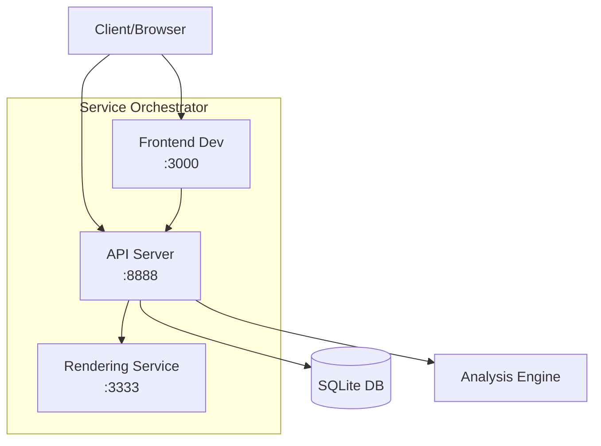

# Service Orchestration Guide

## Overview

Uveddi's service orchestration system manages multiple integrated services that work together to provide comprehensive code analysis capabilities. The system automatically handles service lifecycle, health monitoring, and graceful shutdown.

## Architecture



## Services Overview

### 1. API Server (Port 8888)

The main REST API server that:
- Handles analysis requests
- Serves the web dashboard
- Manages database operations
- Coordinates with other services
- Provides WebSocket connections for real-time updates

### 2. Rendering Service (Port 3333)

Playwright-based service for:
- Generating Mermaid diagrams
- Creating visual dependency graphs
- Exporting charts as images
- Processing complex visualizations

### 3. Frontend Development Server (Port 3000)

React development server (development mode only):
- Hot module replacement
- Live code reloading
- Development tools integration
- Proxy to API server

## Starting Services

### Basic Startup

```bash
# Start with default configuration
uveddi serve

# Services will be available at:
# - Dashboard: http://localhost:8080
# - API: http://localhost:8080/api/v1
# - Rendering: http://localhost:3333
```

### Custom Configuration

```bash
# Specify custom ports
uveddi serve \
  --port 8888 \
  --rendering-port 3333 \
  --database-path ./analysis.db

# Development mode with all services
uveddi serve \
  --port 8888 \
  --rendering-port 3333 \
  --frontend-port 3000 \
  --development
```

### Service Configuration File

```toml
[service_orchestration]
# Health check configuration
health_check_interval = 5        # seconds
health_check_timeout = 30        # seconds
readiness_timeout = 60           # seconds
shutdown_grace_period = 10       # seconds

# Retry configuration
max_retry_attempts = 5
retry_backoff_base = 2           # exponential backoff
retry_max_delay = 30              # seconds

# Service dependencies
[service_orchestration.dependencies]
api = []
rendering = []
frontend = ["api"]

# Service-specific settings
[service_orchestration.api]
enabled = true
port = 8888
bind_address = "127.0.0.1"
max_connections = 100
request_timeout = 30

[service_orchestration.rendering]
enabled = true
port = 3333
bind_address = "127.0.0.1"
browser_timeout = 30000          # milliseconds
max_concurrent_renders = 5

[service_orchestration.frontend]
enabled = false                  # Only in development
port = 3000
proxy_target = "http://localhost:8888"
```

## Service Lifecycle

### Startup Sequence

1. **Initialization Phase**
   ```
   Service Orchestrator starts
   ├── Validate configuration
   ├── Check port availability
   └── Initialize database connection
   ```

2. **Service Launch**
   ```
   Launch services in parallel
   ├── Start API Server
   │   ├── Initialize routes
   │   ├── Setup WebSocket handlers
   │   └── Send readiness signal
   ├── Start Rendering Service
   │   ├── Launch Playwright browser
   │   ├── Initialize render queue
   │   └── Send readiness signal
   └── Start Frontend (if development)
       ├── Build React app
       ├── Setup proxy
       └── Send readiness signal
   ```

3. **Health Monitoring**
   ```
   Continuous health checks
   ├── Every 5 seconds
   ├── Exponential backoff on failure
   └── Automatic restart if needed
   ```

### Readiness Detection

Services use different readiness strategies:

```rust
// API Server readiness
- HTTP endpoint responds with 200 OK
- Database connection established
- All routes registered

// Rendering Service readiness
- Playwright browser launched
- Test render successful
- Health endpoint responding

// Frontend readiness
- Webpack compilation complete
- Development server accepting connections
- Proxy to API working
```

### Graceful Shutdown

```bash
# Shutdown sequence on SIGTERM/SIGINT
1. Stop accepting new requests
2. Wait for ongoing requests (10s grace period)
3. Close database connections
4. Terminate child processes
5. Clean up temporary files
```

## Health Monitoring

### Health Check Endpoints

```bash
# Check overall system health
curl http://localhost:8888/health

# Response
{
  "status": "healthy",
  "services": {
    "api": "healthy",
    "rendering": "healthy",
    "database": "healthy"
  },
  "uptime": 3600,
  "version": "0.9.0"
}

# Check rendering service
curl http://localhost:3333/health

# Response
{
  "status": "healthy",
  "browser": "ready",
  "queue_size": 0,
  "renders_completed": 42
}
```

### Monitoring Patterns

#### Exponential Backoff

```python
# Retry logic with exponential backoff
retry_delay = base_delay
for attempt in range(max_attempts):
    if health_check():
        return SUCCESS
    sleep(retry_delay)
    retry_delay = min(retry_delay * 2, max_delay)
```

#### Circuit Breaker

```toml
[monitoring.circuit_breaker]
failure_threshold = 5      # failures before opening
success_threshold = 2      # successes to close
timeout = 60              # seconds in open state
half_open_requests = 3    # requests in half-open state
```

## Service Communication

### Internal Communication

Services communicate through:

1. **REST API**
   ```javascript
   // Frontend to API
   fetch('http://localhost:8888/api/v1/analysis', {
     method: 'POST',
     body: JSON.stringify(data)
   })
   ```

2. **WebSocket**
   ```javascript
   // Real-time updates
   const ws = new WebSocket('ws://localhost:8888/ws');
   ws.on('message', (data) => {
     console.log('Analysis update:', data);
   });
   ```

3. **Direct HTTP**
   ```rust
   // API to Rendering Service
   let diagram = reqwest::Client::new()
     .post("http://localhost:3333/render")
     .json(&mermaid_spec)
     .send()
     .await?;
   ```

### Message Queue Pattern

```rust
// Async job processing
pub struct JobQueue {
    sender: mpsc::Sender<Job>,
    receiver: mpsc::Receiver<Job>,
}

// Submit rendering job
queue.submit(RenderJob {
    id: uuid::Uuid::new_v4(),
    diagram: mermaid_spec,
    format: "svg",
    callback_url: "http://localhost:8888/callback",
});
```

## Error Handling

### Service Failure Recovery

```yaml
# Automatic recovery strategies
rendering_service_down:
  detection: health_check_failure
  action: restart_service
  max_retries: 3
  fallback: disable_rendering_features

api_server_down:
  detection: port_not_responding
  action: kill_and_restart
  max_retries: 5
  fallback: emergency_shutdown

database_locked:
  detection: sqlite_busy_timeout
  action: retry_with_backoff
  max_retries: 10
  fallback: read_only_mode
```

### Error Propagation

```rust
// Graceful error handling
match rendering_service.render(&diagram).await {
    Ok(svg) => Ok(svg),
    Err(RenderError::ServiceDown) => {
        warn!("Rendering service unavailable, using fallback");
        Ok(generate_text_diagram(&diagram))
    },
    Err(e) => {
        error!("Rendering failed: {}", e);
        Err(e.into())
    }
}
```

## Performance Optimization

### Resource Management

```toml
[performance]
# Connection pooling
max_connections = 100
connection_timeout = 5
idle_timeout = 300

# Request handling
max_request_size = 10485760  # 10MB
request_timeout = 30
body_limit = 52428800        # 50MB

# Caching
cache_size = 1073741824      # 1GB
cache_ttl = 3600            # 1 hour
```

### Load Balancing

```nginx
# Nginx configuration for load balancing
upstream uveddi_api {
    least_conn;
    server 127.0.0.1:8888 weight=3;
    server 127.0.0.1:8889 weight=1;
    keepalive 32;
}
```

### Performance Monitoring

```bash
# Monitor service metrics
uveddi serve --metrics-port 9090

# Prometheus metrics available at:
http://localhost:9090/metrics

# Key metrics:
- uveddi_requests_total
- uveddi_request_duration_seconds
- uveddi_active_connections
- uveddi_render_queue_size
- uveddi_memory_usage_bytes
```

## Deployment Patterns

### Docker Compose

```yaml
version: '3.8'
services:
  api:
    image: uveddi:latest
    ports:
      - "8888:8888"
    volumes:
      - ./data:/data
    environment:
      - RUST_LOG=info
    healthcheck:
      test: ["CMD", "curl", "-f", "http://localhost:8888/health"]
      interval: 30s
      timeout: 10s
      retries: 3

  rendering:
    image: uveddi-rendering:latest
    ports:
      - "3333:3333"
    environment:
      - PLAYWRIGHT_BROWSERS_PATH=/browsers
    healthcheck:
      test: ["CMD", "curl", "-f", "http://localhost:3333/health"]
```

### Kubernetes

```yaml
apiVersion: apps/v1
kind: Deployment
metadata:
  name: uveddi
spec:
  replicas: 3
  selector:
    matchLabels:
      app: uveddi
  template:
    spec:
      containers:
      - name: api
        image: uveddi:latest
        ports:
        - containerPort: 8888
        livenessProbe:
          httpGet:
            path: /health
            port: 8888
        readinessProbe:
          httpGet:
            path: /ready
            port: 8888
```

### SystemD Service

```ini
[Unit]
Description=Uveddi Analysis Services
After=network.target

[Service]
Type=simple
User=uveddi
WorkingDirectory=/opt/uveddi
ExecStart=/usr/local/bin/uveddi serve --port 8888
Restart=always
RestartSec=10

[Install]
WantedBy=multi-user.target
```

## Troubleshooting

### Common Issues

#### Port Already in Use

```bash
# Check what's using the port
lsof -i :8888
netstat -tulpn | grep 8888

# Kill the process
kill -9 <PID>

# Or use different ports
uveddi serve --port 9000 --rendering-port 4000
```

#### Rendering Service Won't Start

```bash
# Install Playwright dependencies
npx playwright install
npx playwright install-deps

# Check browser installation
npx playwright install chromium

# Test rendering service directly
curl -X POST http://localhost:3333/render \
  -H "Content-Type: application/json" \
  -d '{"diagram": "graph TD; A-->B;"}'
```

#### Database Locked

```bash
# Check for locked database
fuser uveddi.db

# Remove lock file if stale
rm uveddi.db-journal
rm uveddi.db-wal

# Use different database
uveddi serve --database-path ./new.db
```

#### Service Communication Failures

```bash
# Check network connectivity
ping localhost
telnet localhost 8888

# Check firewall rules
sudo iptables -L
sudo ufw status

# Enable debug logging
RUST_LOG=debug uveddi serve
```

### Debug Mode

```bash
# Enable comprehensive debugging
RUST_LOG=uveddi=debug,tower_http=debug uveddi serve \
  --port 8888 \
  --rendering-port 3333 \
  2>&1 | tee uveddi.log

# Analyze logs
grep ERROR uveddi.log
grep "health check" uveddi.log
```

## Best Practices

### Production Deployment

1. **Use Process Managers**
   - SystemD, Supervisor, or PM2
   - Automatic restart on failure
   - Log rotation

2. **Resource Limits**
   ```bash
   # Set memory limits
   ulimit -m 4194304  # 4GB
   
   # Set file descriptor limits
   ulimit -n 65536
   ```

3. **Monitoring**
   - Prometheus + Grafana
   - Application Performance Monitoring (APM)
   - Log aggregation (ELK stack)

4. **Security**
   - Run as non-root user
   - Use TLS for external access
   - Implement rate limiting
   - Regular security updates

### High Availability

```yaml
# HAProxy configuration
global
    maxconn 4096

defaults
    mode http
    timeout connect 5000ms
    timeout client 50000ms
    timeout server 50000ms

frontend uveddi_frontend
    bind *:80
    default_backend uveddi_backend

backend uveddi_backend
    balance roundrobin
    server api1 127.0.0.1:8888 check
    server api2 127.0.0.1:8889 check
    server api3 127.0.0.1:8890 check
```

## See Also

- [Web Dashboard Guide](web-dashboard.md)
- [API Reference](../08-api/rest-api-reference.md)
- [Configuration Options](configuration-options.md)
- [Deployment Guide](../10-operations/deployment-guide.md)