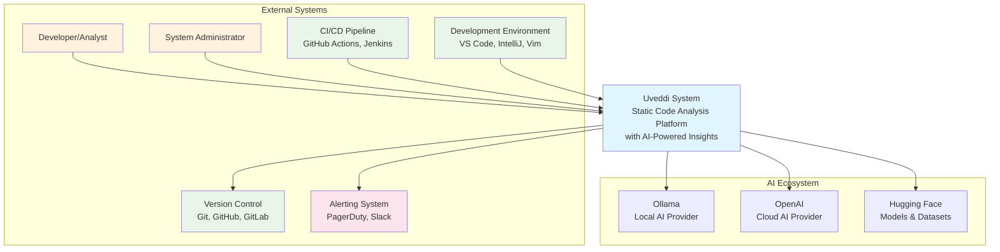
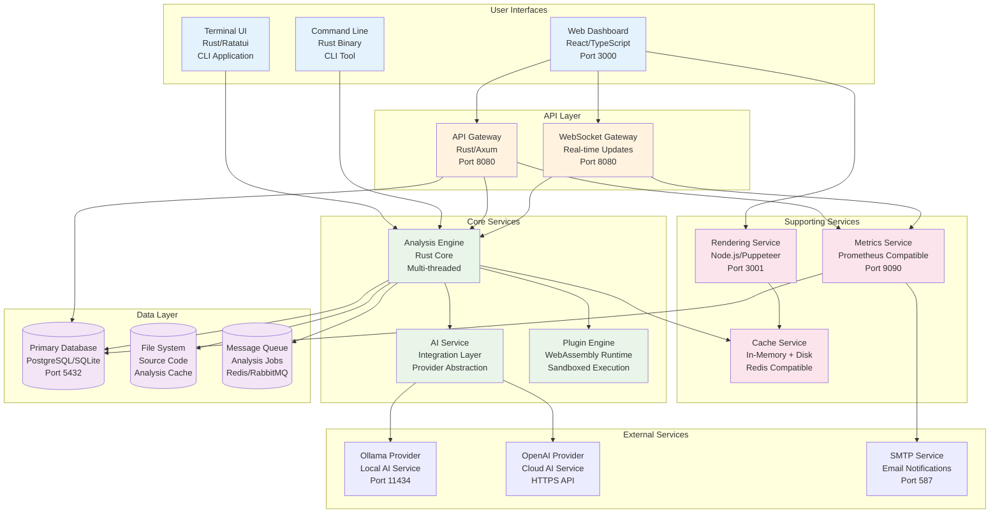
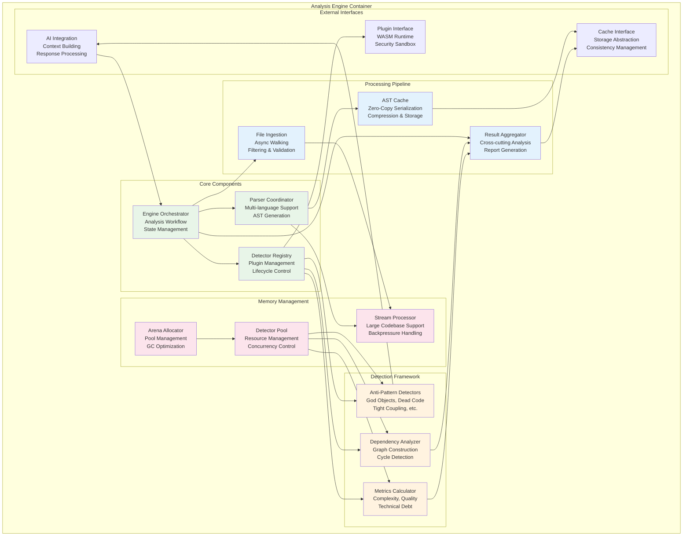
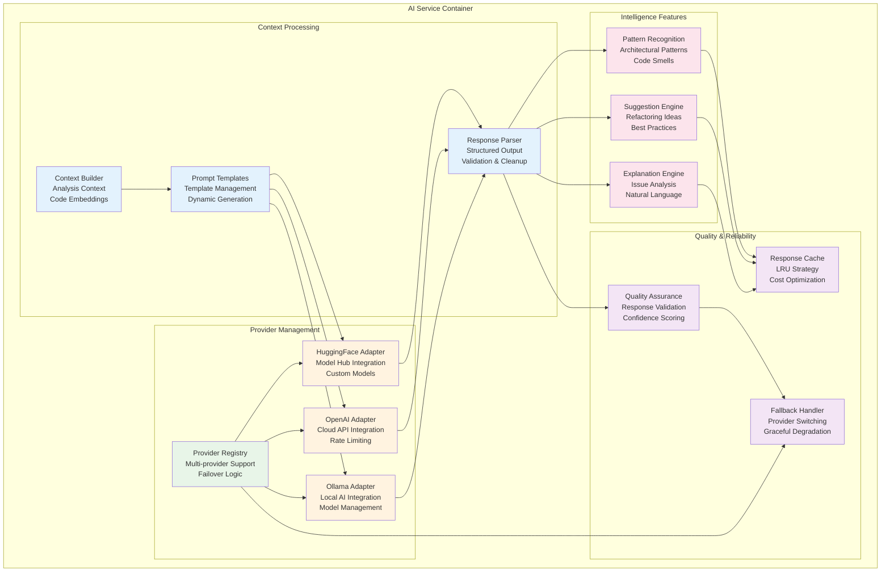
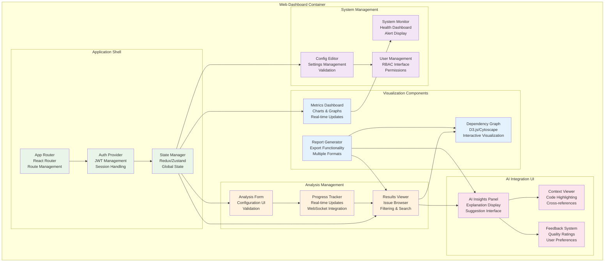
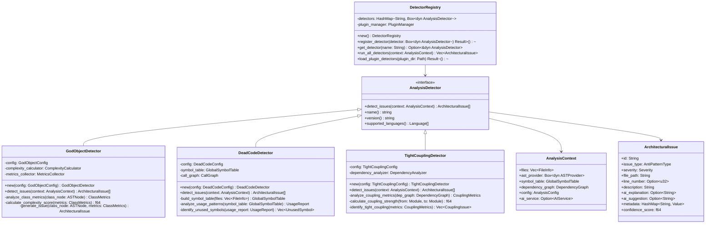
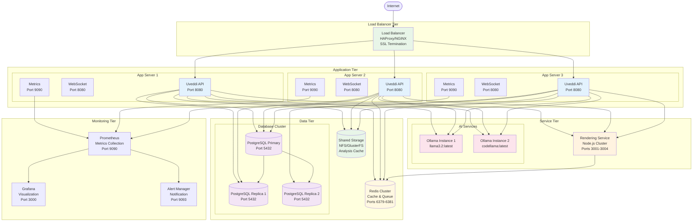

# Uveddi Architecture - C4 Model

## Table of Contents

1. [Introduction](#introduction)
2. [Level 1: System Context](#level-1-system-context)
3. [Level 2: Container Diagram](#level-2-container-diagram)
4. [Level 3: Component Diagrams](#level-3-component-diagrams)
5. [Level 4: Code Diagrams](#level-4-code-diagrams)
6. [Deployment Diagrams](#deployment-diagrams)
7. [Architecture Decision Records](#architecture-decision-records)

## Introduction

This document describes the Uveddi system architecture using the C4 model (Context, Containers, Components, and Code). The C4 model provides a hierarchical way to visualize software architecture at different levels of abstraction.

### Key Architectural Principles

- **Microservices Architecture**: Loosely coupled, independently deployable services
- **Event-Driven Design**: Asynchronous communication between components
- **Domain-Driven Design**: Clear separation of business domains
- **CQRS Pattern**: Separation of read and write operations
- **Hexagonal Architecture**: Clean separation of business logic from external concerns

## Level 1: System Context

The system context diagram shows how Uveddi fits into the broader ecosystem.



### System Context Relationships

| Actor/System | Relationship | Description |
|--------------|-------------|-------------|
| **Developer/Analyst** | Uses | Runs code analysis, views reports, configures settings |
| **System Administrator** | Manages | Deploys, monitors, maintains the Uveddi system |
| **CI/CD Pipeline** | Integrates | Automated code quality checks in build pipelines |
| **Version Control** | Reads from | Accesses source code repositories for analysis |
| **Development Environment** | Integrates | IDE plugins provide real-time analysis feedback |
| **Alerting System** | Sends to | Notifications for critical issues and system alerts |
| **AI Providers** | Consumes | AI-powered explanations and refactoring suggestions |

## Level 2: Container Diagram

The container diagram shows the high-level technology choices and how responsibilities are distributed.



### Container Responsibilities

#### User Interfaces
- **Web Dashboard**: Modern React-based SPA for analysis management and visualization
- **Terminal UI**: Interactive terminal interface using Ratatui for local usage
- **Command Line**: Traditional CLI for scripting and automation

#### API Layer
- **API Gateway**: RESTful API server handling HTTP requests and authentication
- **WebSocket Gateway**: Real-time bidirectional communication for live updates

#### Core Services
- **Analysis Engine**: Multi-threaded Rust engine for code analysis and orchestration
- **AI Service**: Abstraction layer for multiple AI providers with fallback strategies
- **Plugin Engine**: WebAssembly-based plugin system for extensibility

#### Supporting Services
- **Rendering Service**: Node.js service for generating diagrams and visual reports
- **Cache Service**: High-performance caching for ASTs, analysis results, and artifacts
- **Metrics Service**: Prometheus-compatible metrics collection and alerting

#### Data Layer
- **Primary Database**: Persistent storage for analysis results, configuration, and metadata
- **File System**: Source code storage and analysis cache management
- **Message Queue**: Asynchronous job processing and task distribution

## Level 3: Component Diagrams

### Analysis Engine Components



### AI Service Components



### Web Dashboard Components



## Level 4: Code Diagrams

### Anti-Pattern Detector Code Structure



### AI Service Integration Code Structure

```mermaid
classDiagram
    class AIProvider {
        <<interface>>
        +generate_explanation(context: AIContext) Result~String~
        +generate_suggestion(issue: ArchitecturalIssue) Result~String~
        +health_check() Result~HealthStatus~
        +get_provider_info() ProviderInfo
    }
    
    class OllamaProvider {
        -client: OllamaClient
        -model: String
        -config: OllamaConfig
        +new(config: OllamaConfig) Result~OllamaProvider~
        +generate_explanation(context: AIContext) Result~String~
        +generate_suggestion(issue: ArchitecturalIssue) Result~String~
        -build_prompt(template: PromptTemplate, context: AIContext) String
        -parse_response(response: String) Result~AIResponse~
    }
    
    class OpenAIProvider {
        -client: OpenAIClient
        -api_key: String
        -model: String
        -config: OpenAIConfig
        +new(config: OpenAIConfig) Result~OpenAIProvider~
        +generate_explanation(context: AIContext) Result~String~
        +generate_suggestion(issue: ArchitecturalIssue) Result~String~
        -handle_rate_limiting(error: OpenAIError) Result~()~
    }
    
    class AIService {
        -providers: Vec~Box~dyn AIProvider~~
        -fallback_strategy: FallbackStrategy
        -response_cache: ResponseCache
        -context_builder: ContextBuilder
        +new(config: AIServiceConfig) AIService
        +explain_issue(issue: ArchitecturalIssue) Result~String~
        +suggest_refactoring(issue: ArchitecturalIssue) Result~String~
        +recognize_patterns(code: String) Result~Vec~Pattern~~
        -try_providers(request: AIRequest) Result~AIResponse~
        -cache_response(request: AIRequest, response: AIResponse)
    }
    
    class ContextBuilder {
        -project_metadata: ProjectMetadata
        -coding_standards: CodingStandards
        +build_context(issue: ArchitecturalIssue, code: String) AIContext
        -extract_surrounding_code(file: String, line: u32) String
        -build_dependency_context(issue: ArchitecturalIssue) DependencyContext
        -generate_context_summary(context: AIContext) String
    }
    
    class PromptTemplate {
        -template: String
        -variables: HashMap~String, String~
        +load(template_name: String) Result~PromptTemplate~
        +render(context: AIContext) String
        -substitute_variables(template: String, context: AIContext) String
        -validate_template(template: String) Result~()~
    }
    
    class ResponseCache {
        -cache: LruCache~String, AIResponse~
        -ttl: Duration
        +new(capacity: usize, ttl: Duration) ResponseCache
        +get(key: String) Option~AIResponse~
        +insert(key: String, response: AIResponse)
        +invalidate(pattern: String)
        -generate_cache_key(request: AIRequest) String
    }
    
    class FallbackStrategy {
        +handle_provider_failure(error: AIError, providers: Vec~Box~dyn AIProvider~~) Option~Box~dyn AIProvider~~
        +should_retry(error: AIError) bool
        +get_retry_delay(attempt: u32) Duration
        +use_cached_response(request: AIRequest, cache: ResponseCache) Option~AIResponse~
    }
    
    AIProvider <|-- OllamaProvider
    AIProvider <|-- OpenAIProvider
    AIService --> AIProvider
    AIService --> ContextBuilder
    AIService --> ResponseCache
    AIService --> FallbackStrategy
    ContextBuilder --> PromptTemplate
```



## Deployment Diagrams

### Production Deployment Architecture



### Container Orchestration (Kubernetes)

```mermaid
graph TB
    subgraph "Kubernetes Cluster"
        subgraph "Ingress"
            Ingress[NGINX Ingress<br/>SSL/TLS Termination<br/>Load Balancing]
        end
        
        subgraph "Application Namespace"
            subgraph "Uveddi API Deployment"
                APIPod1[Uveddi API Pod 1<br/>CPU: 2 cores<br/>Memory: 4Gi]
                APIPod2[Uveddi API Pod 2<br/>CPU: 2 cores<br/>Memory: 4Gi]
                APIPod3[Uveddi API Pod 3<br/>CPU: 2 cores<br/>Memory: 4Gi]
            end
            
            APIService[Uveddi API Service<br/>ClusterIP<br/>Port 8080]
            
            subgraph "Rendering Deployment"
                RenderPod1[Rendering Pod 1<br/>CPU: 1 core<br/>Memory: 2Gi]
                RenderPod2[Rendering Pod 2<br/>CPU: 1 core<br/>Memory: 2Gi]
            end
            
            RenderService[Rendering Service<br/>ClusterIP<br/>Port 3001]
        end
        
        subgraph "AI Namespace"
            subgraph "Ollama Deployment"
                OllamaPod1[Ollama Pod 1<br/>GPU: 1x NVIDIA T4<br/>Memory: 8Gi]
                OllamaPod2[Ollama Pod 2<br/>GPU: 1x NVIDIA T4<br/>Memory: 8Gi]
            end
            
            OllamaService[Ollama Service<br/>ClusterIP<br/>Port 11434]
        end
        
        subgraph "Data Namespace"
            subgraph "PostgreSQL StatefulSet"
                PostgresPod[PostgreSQL Pod<br/>CPU: 4 cores<br/>Memory: 8Gi<br/>Storage: 500Gi]
            end
            
            PostgresService[PostgreSQL Service<br/>ClusterIP<br/>Port 5432]
            
            subgraph "Redis Deployment"
                RedisPod[Redis Pod<br/>CPU: 2 cores<br/>Memory: 4Gi<br/>Storage: 100Gi]
            end
            
            RedisService[Redis Service<br/>ClusterIP<br/>Port 6379]
        end
        
        subgraph "Monitoring Namespace"
            PrometheusPod[Prometheus Pod<br/>CPU: 2 cores<br/>Memory: 8Gi<br/>Storage: 200Gi]
            GrafanaPod[Grafana Pod<br/>CPU: 1 core<br/>Memory: 2Gi]
            
            PrometheusService[Prometheus Service<br/>ClusterIP<br/>Port 9090]
            GrafanaService[Grafana Service<br/>ClusterIP<br/>Port 3000]
        end
        
        subgraph "Storage"
            PVC1[PVC: postgres-data<br/>ReadWriteOnce<br/>500Gi]
            PVC2[PVC: redis-data<br/>ReadWriteOnce<br/>100Gi]
            PVC3[PVC: prometheus-data<br/>ReadWriteOnce<br/>200Gi]
            PVC4[PVC: uveddi-cache<br/>ReadWriteMany<br/>1Ti]
        end
    end
    
    %% External Traffic
    Internet([Internet]) --> Ingress
    
    %% Ingress Routing
    Ingress --> APIService
    Ingress --> RenderService
    Ingress --> GrafanaService
    
    %% Service to Pod Connections
    APIService --> APIPod1
    APIService --> APIPod2
    APIService --> APIPod3
    
    RenderService --> RenderPod1
    RenderService --> RenderPod2
    
    OllamaService --> OllamaPod1
    OllamaService --> OllamaPod2
    
    %% Cross-Service Communications
    APIPod1 --> OllamaService
    APIPod2 --> OllamaService
    APIPod3 --> OllamaService
    
    APIPod1 --> PostgresService
    APIPod2 --> PostgresService
    APIPod3 --> PostgresService
    
    APIPod1 --> RedisService
    APIPod2 --> RedisService
    APIPod3 --> RedisService
    
    RenderPod1 --> RedisService
    RenderPod2 --> RedisService
    
    %% Storage Connections
    PostgresPod --> PVC1
    RedisPod --> PVC2
    PrometheusPod --> PVC3
    APIPod1 --> PVC4
    APIPod2 --> PVC4
    APIPod3 --> PVC4
    
    %% Monitoring Connections
    PrometheusPod --> APIService
    PrometheusPod --> RenderService
    PrometheusPod --> PostgresService
    PrometheusPod --> RedisService
    
    style Ingress fill:#e8f5e8
    style APIPod1 fill:#e3f2fd
    style APIPod2 fill:#e3f2fd
    style APIPod3 fill:#e3f2fd
    style RenderPod1 fill:#fff3e0
    style RenderPod2 fill:#fff3e0
    style OllamaPod1 fill:#fce4ec
    style OllamaPod2 fill:#fce4ec
    style PostgresPod fill:#f3e5f5
    style RedisPod fill:#fff8e1
    style PrometheusPod fill:#e8f5e8
    style GrafanaPod fill:#e8f5e8
```

## Architecture Decision Records

### ADR-001: Multi-Language AST Parsing with Tree-sitter

**Status**: Accepted

**Context**: Need to parse multiple programming languages (Rust, Python, JavaScript, TypeScript) with consistent AST representation.

**Decision**: Use Tree-sitter for parsing with language-specific grammars.

**Consequences**:
- ✅ Consistent parsing across languages
- ✅ High performance and accuracy
- ✅ Active community and grammar support
- ❌ Additional dependency complexity
- ❌ Grammar updates required for language changes

### ADR-002: WebAssembly Plugin System

**Status**: Accepted

**Context**: Need extensible architecture for custom detectors while maintaining security.

**Decision**: Implement WebAssembly-based plugin system with sandboxing.

**Consequences**:
- ✅ Language-agnostic plugin development
- ✅ Strong security isolation
- ✅ Near-native performance
- ❌ Additional runtime complexity
- ❌ Limited system API access

### ADR-003: AI Provider Abstraction

**Status**: Accepted

**Context**: Support multiple AI providers (local and cloud) with fallback strategies.

**Decision**: Create abstraction layer with pluggable providers and intelligent fallback.

**Consequences**:
- ✅ Provider independence
- ✅ Graceful degradation
- ✅ Cost optimization options
- ❌ Additional abstraction complexity
- ❌ Provider-specific feature limitations

### ADR-004: Event-Driven Analysis Pipeline

**Status**: Accepted

**Context**: Handle large codebases efficiently with progress tracking and cancellation.

**Decision**: Implement event-driven pipeline with async processing and backpressure.

**Consequences**:
- ✅ Scalable processing
- ✅ Real-time progress updates
- ✅ Resource efficiency
- ❌ Increased complexity
- ❌ Debugging challenges

### ADR-005: Microservices Architecture

**Status**: Accepted

**Context**: Enable independent scaling and technology choices for different concerns.

**Decision**: Separate core analysis, rendering, and AI services with clear interfaces.

**Consequences**:
- ✅ Independent deployment and scaling
- ✅ Technology diversity
- ✅ Fault isolation
- ❌ Network latency
- ❌ Distributed system complexity

## Conclusion

The Uveddi architecture follows modern software design principles with clear separation of concerns, scalability considerations, and maintainability focus. The C4 model provides a hierarchical view that helps both technical and non-technical stakeholders understand the system structure and relationships.

Key architectural strengths:
- **Modularity**: Clear component boundaries with well-defined interfaces
- **Scalability**: Horizontal and vertical scaling support
- **Extensibility**: Plugin system for custom functionality
- **Resilience**: Fallback strategies and graceful degradation
- **Observability**: Comprehensive monitoring and logging

This architecture supports Uveddi's mission to provide intelligent, scalable code analysis with AI-powered insights while maintaining performance, security, and operational excellence.