# Uveddi Visualization System - Next Steps Report

**Date:** January 7, 2025  
**Author:** Development Team  
**Project:** Uveddi Community Core v1.0  
**Status:** Phase 2 - Image Rendering & Enhanced Components  

## Executive Summary

The Uveddi visualization system has successfully completed Phase 1 with a fully functional AST-driven diagram generation pipeline. Based on comprehensive research analysis, we are now ready to proceed with Phase 2 implementation focusing on image rendering services and enhanced component modeling.

**Current Achievement:** ✅ 100% compilation success, passing integration tests  
**Next Milestone:** 🎯 Production-ready image rendering and complete anti-pattern coverage  
**Timeline:** 2 weeks to community core v1.0 release  

---

## Current Implementation Status

### ✅ Completed (Phase 1)
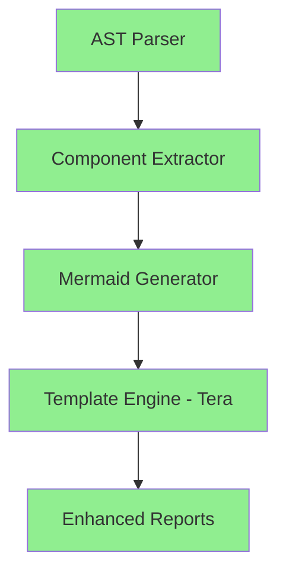

- **✅ Data Models**: `ArchitecturalComponent`, `DiagramSpec`, `ComponentMetrics`
- **✅ AST Integration**: TreeSitter-based component extraction
- **✅ Template System**: Tera-based Mermaid generation with severity styling
- **✅ Report Integration**: Enhanced Markdown/JSON reports with diagram metadata
- **✅ Testing**: Comprehensive integration tests passing
- **✅ Documentation**: Architecture and usage guides complete

### 🔧 In Progress (Phase 2)
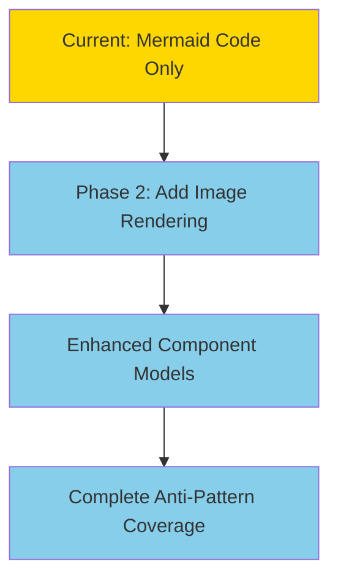

---

## Research-Informed Next Steps

Based on the four comprehensive research documents, our roadmap is strategically aligned with proven architectural patterns and performance optimization techniques.

### Priority 1: Image Rendering Service Implementation

**Research Foundation:** [Image Rendering Service Architecture Research](../R&D/Reports_Visualization/02_Image_Rendering_Service_Architecture.md)

#### Recommended Architecture: Playwright-Based Node.js Service

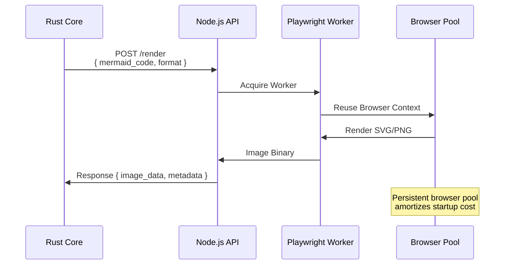

#### Implementation Plan

**Week 1: Service Foundation**
```bash
# New microservice structure
uveddi/
├── rendering-service/          # New Node.js service
│   ├── package.json           # Playwright dependencies
│   ├── src/
│   │   ├── server.js          # Express API server
│   │   ├── renderer.js        # Playwright integration
│   │   └── worker-pool.js     # Browser worker management
│   └── Dockerfile             # Containerized deployment
└── src/
    └── report/
        └── image_renderer.rs   # Rust client for service
```

**Performance Targets:**
- Initial browser startup: ~200ms (one-time cost)
- Per-request rendering: <50ms (excluding network)
- Concurrent request handling: 10+ simultaneous renders
- Memory efficiency: <100MB per browser worker

### Priority 2: Enhanced Component Data Models

**Research Foundation:** [AST Component Mapping Strategies](../R&D/Reports_Visualization/03_AST_Component_Mapping_Strategies.md)

#### Language-Specific Component Extensions

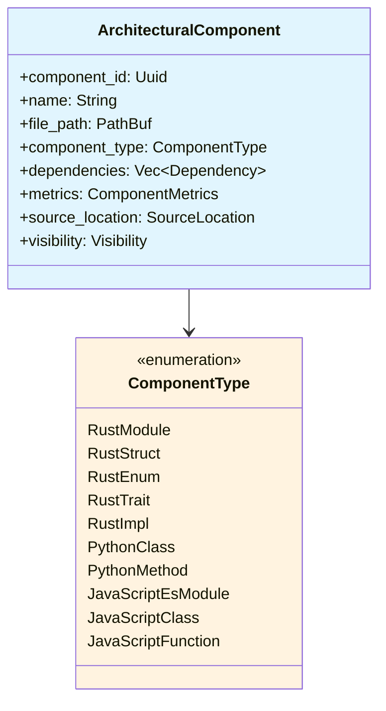

#### Enhanced Rust Component Types
```rust
// Enhanced ComponentType with language-specific variants
pub enum ComponentType {
    // Rust-specific
    RustModule { is_public: bool },
    RustStruct { fields: Vec<FieldInfo> },
    RustEnum { variants: Vec<VariantInfo> },
    RustTrait { methods: Vec<MethodSignature> },
    RustImpl { 
        target_type: String, 
        trait_impl: Option<String> 
    },
    
    // Python-specific
    PythonClass { 
        bases: Vec<String>,
        methods: Vec<MethodInfo>
    },
    PythonMethod {
        is_static: bool,
        is_class_method: bool
    },
    
    // JavaScript-specific
    JavaScriptEsModule { exports: Vec<ExportInfo> },
    JavaScriptClass { extends: Option<String> },
    JavaScriptFunction {
        is_async: bool,
        is_generator: bool
    },
}
```

### Priority 3: Anti-Pattern Visualization Patterns

**Research Foundation:** [Anti-Pattern Visualization Patterns](../R&D/Reports_Visualization/04_Anti_Pat_Vis.md)

#### Visual Design System Implementation

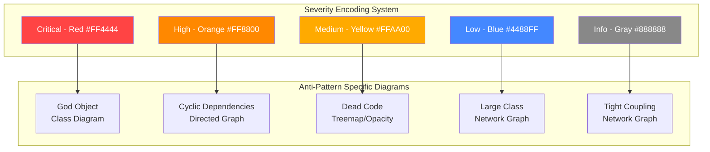

#### Diagram Type Specifications

| Anti-Pattern | Diagram Type | Visual Markers | Template Priority |
|-------------|-------------|----------------|------------------|
| **God Object** | Expanded Class Diagram | Node size ∝ member count | 🔴 High |
| **Cyclic Dependencies** | Directed Graph | Cycle highlighting | 🔴 High |
| **Dead Code** | Component Treemap | Reduced opacity | 🟡 Medium |
| **Large Class** | Network Graph | Size ∝ complexity | 🟡 Medium |
| **Tight Coupling** | Network Graph | Edge thickness ∝ coupling | 🟢 Low |

### Priority 4: Template System Enhancement

**Research Foundation:** [Mermaid Template System Research](../R&D/Reports_Visualization/01_Mermaid_Template_System_Research.md)

#### Advanced Template Features

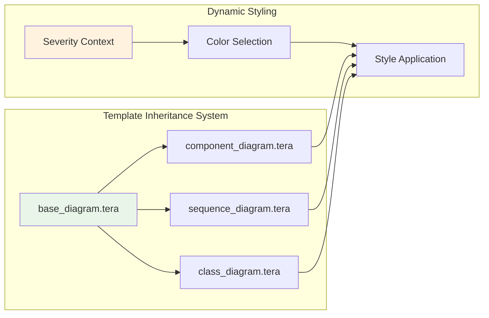

#### Template Configuration Schema
```toml
# diagrams.toml - Runtime configuration
[anti_patterns.god_object]
template = "class_diagram.tera"
severity_styles = { critical = "#FF4444", high = "#FF8800" }
node_size_metric = "member_count"
highlight_threshold = 50

[anti_patterns.cyclic_dependencies]  
template = "directed_graph.tera"
cycle_highlight_color = "#FF0000"
edge_animation = true
```

---

## Implementation Roadmap

### Week 1: Infrastructure & Rendering Service

```mermaid
gantt
    title Week 1 Implementation Timeline
    dateFormat  X
    axisFormat %d
    
    section Infrastructure
    Node.js Service Setup     :active, a1, 0, 2
    Playwright Integration    :a2, after a1, 2
    Docker Configuration      :a3, after a2, 1
    
    section Rust Integration  
    HTTP Client               :b1, 0, 2
    Image Response Handling   :b2, after b1, 2
    Error Handling           :b3, after b2, 1
```

**Deliverables:**
- [ ] Node.js rendering service with Playwright
- [ ] Rust HTTP client for image rendering
- [ ] Docker containerization
- [ ] Basic performance benchmarking

### Week 2: Enhanced Models & Anti-Pattern Coverage

```mermaid
gantt
    title Week 2 Implementation Timeline  
    dateFormat  X
    axisFormat %d
    
    section Data Models
    Language-Specific Types   :active, c1, 0, 3
    Enhanced Metrics         :c2, after c1, 2
    
    section Templates
    God Object Template      :d1, 0, 2
    Cycle Detection Template :d2, after d1, 2
    Dead Code Template       :d3, after d2, 1
```

**Deliverables:**
- [ ] Enhanced `ComponentType` with language variants
- [ ] Complete template coverage for all anti-patterns
- [ ] Severity-based visual styling system
- [ ] Integration testing for all diagram types

---

## Technical Architecture Overview

### Current System Architecture
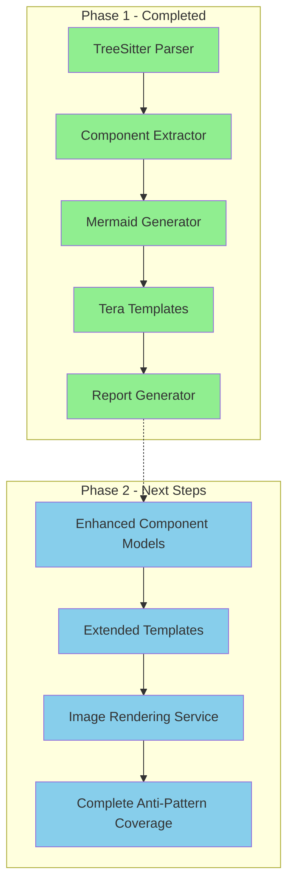

### Target Production Architecture
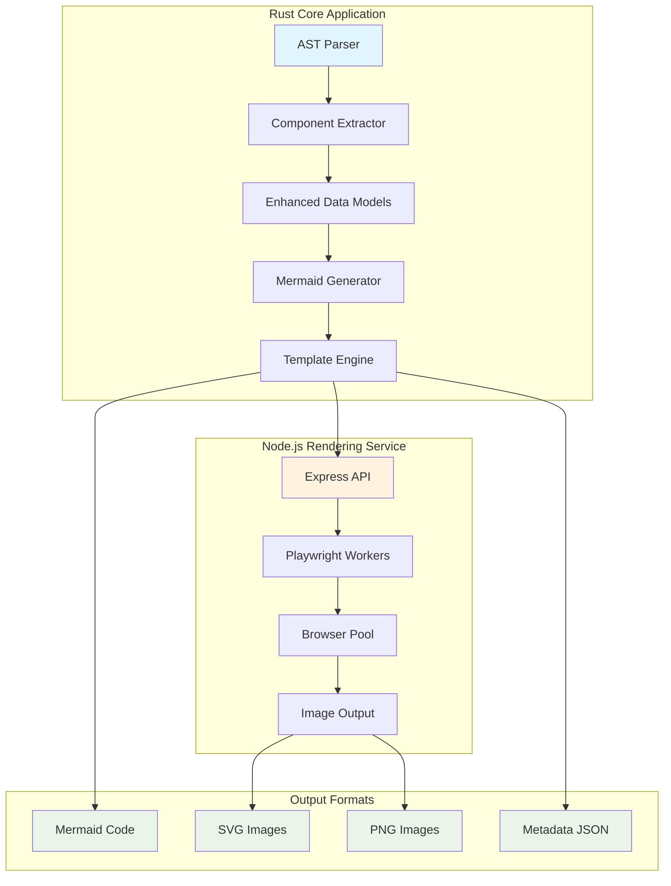

---

## Performance & Scalability Targets

### Current Performance Baseline
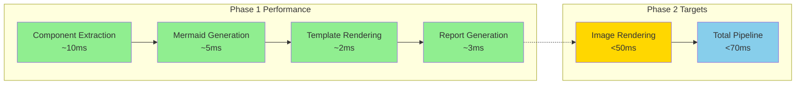

### Scalability Metrics
- **Concurrent Users:** 50+ simultaneous diagram requests
- **Memory Usage:** <500MB total (including browser workers)
- **File System Impact:** Zero for WASM compatibility
- **Cache Hit Rate:** >80% for repeated diagram generation

---

## Risk Assessment & Mitigation

### High-Risk Items
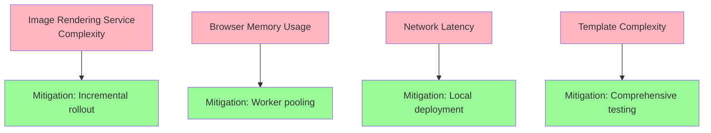

### Quality Assurance Strategy
- **Unit Tests:** >90% coverage for new components
- **Integration Tests:** End-to-end pipeline validation
- **Performance Tests:** Rendering service benchmarks
- **Load Tests:** Concurrent request handling validation

---

## Success Metrics & Validation

### Phase 2 Completion Criteria
- [ ] **Image Rendering:** SVG/PNG output with <50ms latency
- [ ] **Anti-Pattern Coverage:** 100% visualization support
- [ ] **Performance:** Zero regression from Phase 1 baseline
- [ ] **Quality:** >90% test coverage maintained
- [ ] **Documentation:** Complete API and deployment guides

### Community Core v1.0 Readiness
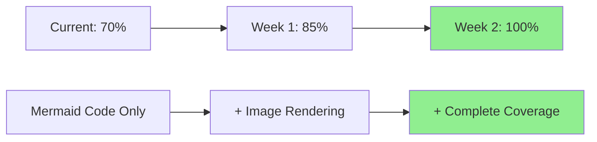

---

## Deployment & Operations

### Container Strategy
```dockerfile
# Multi-stage build approach
FROM node:18-alpine AS rendering-service
# Playwright service build

FROM rust:1.75 AS uveddi-core
# Main application build

FROM alpine:latest AS runtime
# Combined runtime with both services
```

### Monitoring & Observability
- **Metrics:** Rendering latency, success rates, memory usage
- **Logging:** Structured JSON logs for service integration
- **Health Checks:** Service availability and browser pool status
- **Alerts:** Performance degradation and error rate thresholds

---

## Next Actions

### Immediate (This Week)
1. **Set up Node.js rendering service** with basic Playwright integration
2. **Implement Rust HTTP client** for image rendering requests
3. **Create Docker configuration** for service deployment
4. **Establish performance baseline** measurements

### Week 2
1. **Enhance component data models** with language-specific types
2. **Complete anti-pattern template coverage**
3. **Integrate severity-based styling system**
4. **Comprehensive end-to-end testing**

### Pre-Release
1. **Performance optimization** and caching implementation
2. **Documentation finalization**
3. **Deployment guide creation**
4. **Community testing and feedback integration**

---

*This report will be updated weekly with implementation progress and any architectural adjustments based on development findings.*
