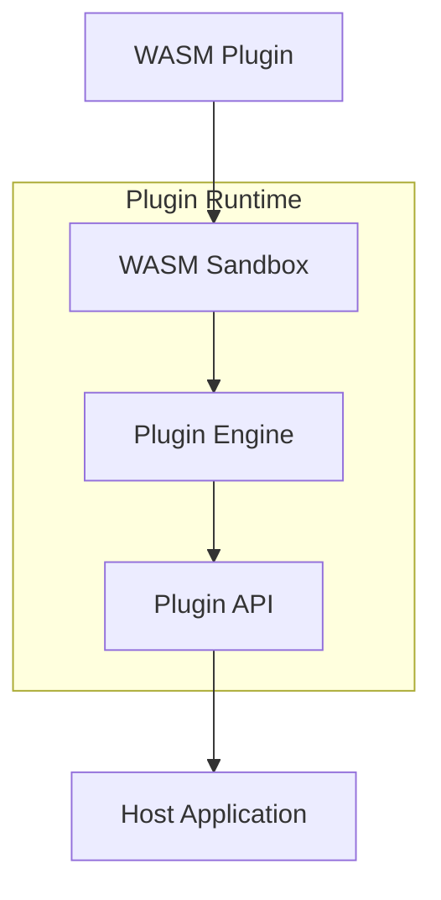

# Plugin Development Guide

## Overview

Uveddi's plugin system allows developers to extend the analysis capabilities using WebAssembly (WASM) modules. Plugins run in a sandboxed environment with controlled access to the host system, ensuring security and stability.

## Architecture



## Getting Started

### Prerequisites

- Rust 1.70+ (for Rust plugins)
- `wasm-pack` for building WASM modules
- `wasmtime` runtime (included with Uveddi)

### Installation

```bash
# Install wasm-pack
curl https://rustwasm.github.io/wasm-pack/installer/init.sh -sSf | sh

# Install cargo-generate for templates
cargo install cargo-generate

# Generate plugin from template
cargo generate --git https://github.com/uveddi/plugin-template
```

## Plugin Structure

### Basic Plugin Layout

```
my-plugin/
├── Cargo.toml
├── src/
│   ├── lib.rs
│   └── detector.rs
├── manifest.toml
├── tests/
│   └── integration.rs
└── README.md
```

### Manifest File

```toml
# manifest.toml
[plugin]
id = "custom-security-detector"
name = "Custom Security Detector"
version = "1.0.0"
author = "Your Name"
description = "Detects custom security patterns"
license = "MIT"

[capabilities]
languages = ["rust", "python", "javascript"]
detector_types = ["security", "performance", "quality"]
api_version = "1.0"

[requirements]
min_uveddi_version = "0.9.0"
max_uveddi_version = "1.0.0"

[permissions]
read_files = true
write_files = false
network_access = false
system_info = true

[resources]
max_memory_mb = 100
max_cpu_percent = 50
timeout_seconds = 30
```

## Writing Your First Plugin

### 1. Basic Detector Plugin

```rust
// src/lib.rs
use uveddi_plugin_api::*;
use wasm_bindgen::prelude::*;

#[wasm_bindgen]
pub struct CustomDetector {
    config: DetectorConfig,
}

#[wasm_bindgen]
impl CustomDetector {
    #[wasm_bindgen(constructor)]
    pub fn new() -> Self {
        Self {
            config: DetectorConfig::default(),
        }
    }

    pub fn analyze(&self, code: &str, language: &str) -> AnalysisResult {
        let mut issues = Vec::new();
        
        // Your detection logic here
        if code.contains("TODO") {
            issues.push(Issue {
                id: "TODO-001".to_string(),
                severity: Severity::Low,
                message: "TODO comment found".to_string(),
                line: self.find_line_number(code, "TODO"),
                column: 0,
                file: String::new(),
                category: "maintenance".to_string(),
                suggestion: Some("Complete the TODO item".to_string()),
            });
        }
        
        AnalysisResult {
            issues,
            metrics: self.calculate_metrics(code),
        }
    }
    
    fn find_line_number(&self, code: &str, pattern: &str) -> usize {
        code.lines()
            .position(|line| line.contains(pattern))
            .map(|pos| pos + 1)
            .unwrap_or(0)
    }
    
    fn calculate_metrics(&self, code: &str) -> Metrics {
        Metrics {
            lines_of_code: code.lines().count(),
            complexity: 0, // Calculate cyclomatic complexity
            maintainability_index: 100.0,
        }
    }
}

// Export plugin metadata
#[wasm_bindgen]
pub fn plugin_info() -> String {
    serde_json::json!({
        "id": "custom-detector",
        "version": "1.0.0",
        "api_version": "1.0"
    }).to_string()
}
```

### 2. Advanced Pattern Detector

```rust
use regex::Regex;
use serde::{Deserialize, Serialize};

#[derive(Serialize, Deserialize)]
pub struct PatternRule {
    id: String,
    pattern: String,
    message: String,
    severity: String,
    fix: Option<String>,
}

#[wasm_bindgen]
pub struct PatternDetector {
    rules: Vec<PatternRule>,
}

#[wasm_bindgen]
impl PatternDetector {
    pub fn load_rules(&mut self, rules_json: &str) -> Result<(), JsValue> {
        self.rules = serde_json::from_str(rules_json)
            .map_err(|e| JsValue::from_str(&e.to_string()))?;
        Ok(())
    }
    
    pub fn detect_patterns(&self, code: &str) -> Vec<JsValue> {
        let mut matches = Vec::new();
        
        for rule in &self.rules {
            if let Ok(regex) = Regex::new(&rule.pattern) {
                for mat in regex.find_iter(code) {
                    let issue = serde_json::json!({
                        "rule_id": rule.id,
                        "message": rule.message,
                        "severity": rule.severity,
                        "location": {
                            "start": mat.start(),
                            "end": mat.end(),
                        },
                        "fix": rule.fix,
                    });
                    matches.push(JsValue::from_str(&issue.to_string()));
                }
            }
        }
        
        matches
    }
}
```

### 3. AST-Based Analysis Plugin

```rust
use tree_sitter::{Parser, Query, QueryCursor};

#[wasm_bindgen]
pub struct AstAnalyzer {
    parser: Parser,
    language: tree_sitter::Language,
}

#[wasm_bindgen]
impl AstAnalyzer {
    pub fn analyze_ast(&mut self, code: &str) -> Result<String, JsValue> {
        let tree = self.parser.parse(code, None)
            .ok_or_else(|| JsValue::from_str("Failed to parse code"))?;
        
        let root_node = tree.root_node();
        let mut results = Vec::new();
        
        // Example: Find all function definitions
        let query = Query::new(
            self.language,
            "(function_definition name: (identifier) @func_name)"
        ).map_err(|e| JsValue::from_str(&e.to_string()))?;
        
        let mut cursor = QueryCursor::new();
        let matches = cursor.matches(&query, root_node, code.as_bytes());
        
        for match_ in matches {
            for capture in match_.captures {
                let node = capture.node;
                let func_name = &code[node.byte_range()];
                
                results.push(serde_json::json!({
                    "type": "function",
                    "name": func_name,
                    "line": node.start_position().row + 1,
                    "complexity": self.calculate_complexity(node, code),
                }));
            }
        }
        
        Ok(serde_json::to_string(&results)
            .map_err(|e| JsValue::from_str(&e.to_string()))?)
    }
    
    fn calculate_complexity(&self, node: tree_sitter::Node, code: &str) -> usize {
        // Calculate cyclomatic complexity
        let mut complexity = 1;
        let mut cursor = node.walk();
        
        loop {
            let node = cursor.node();
            match node.kind() {
                "if_statement" | "while_statement" | 
                "for_statement" | "match_expression" => complexity += 1,
                _ => {}
            }
            
            if !cursor.goto_first_child() {
                while !cursor.goto_next_sibling() {
                    if !cursor.goto_parent() {
                        return complexity;
                    }
                }
            }
        }
    }
}
```

## Plugin API Reference

### Core Types

```rust
// Issue severity levels
pub enum Severity {
    Critical,
    High,
    Medium,
    Low,
    Info,
}

// Analysis issue
pub struct Issue {
    pub id: String,
    pub severity: Severity,
    pub message: String,
    pub file: String,
    pub line: usize,
    pub column: usize,
    pub category: String,
    pub suggestion: Option<String>,
    pub metadata: HashMap<String, String>,
}

// Analysis metrics
pub struct Metrics {
    pub lines_of_code: usize,
    pub complexity: usize,
    pub maintainability_index: f64,
    pub custom_metrics: HashMap<String, f64>,
}

// Analysis result
pub struct AnalysisResult {
    pub issues: Vec<Issue>,
    pub metrics: Metrics,
    pub dependencies: Vec<String>,
}
```

### Plugin Lifecycle Hooks

```rust
#[wasm_bindgen]
impl Plugin {
    // Called when plugin is loaded
    pub fn initialize(&mut self, config: &str) -> Result<(), JsValue> {
        // Parse configuration
        // Initialize resources
        Ok(())
    }
    
    // Called before analysis starts
    pub fn pre_analysis(&mut self, context: &str) -> Result<(), JsValue> {
        // Prepare for analysis
        // Load rules, patterns, etc.
        Ok(())
    }
    
    // Main analysis function
    pub fn analyze(&self, input: &str) -> Result<String, JsValue> {
        // Perform analysis
        // Return results as JSON
        Ok(results.to_string())
    }
    
    // Called after analysis completes
    pub fn post_analysis(&mut self) -> Result<(), JsValue> {
        // Cleanup resources
        // Generate reports
        Ok(())
    }
    
    // Called when plugin is unloaded
    pub fn cleanup(&mut self) -> Result<(), JsValue> {
        // Final cleanup
        Ok(())
    }
}
```

### Host Functions

Plugins can call these host-provided functions:

```rust
// File system access
#[wasm_bindgen]
extern "C" {
    pub fn read_file(path: &str) -> String;
    pub fn file_exists(path: &str) -> bool;
    pub fn list_files(pattern: &str) -> Vec<String>;
}

// Logging
#[wasm_bindgen]
extern "C" {
    pub fn log_debug(message: &str);
    pub fn log_info(message: &str);
    pub fn log_warn(message: &str);
    pub fn log_error(message: &str);
}

// Analysis utilities
#[wasm_bindgen]
extern "C" {
    pub fn parse_ast(code: &str, language: &str) -> String;
    pub fn get_file_metadata(path: &str) -> String;
    pub fn calculate_hash(content: &str) -> String;
}

// Configuration
#[wasm_bindgen]
extern "C" {
    pub fn get_config(key: &str) -> Option<String>;
    pub fn set_config(key: &str, value: &str);
}
```

## Building and Packaging

### Build Configuration

```toml
# Cargo.toml
[package]
name = "my-uveddi-plugin"
version = "1.0.0"
edition = "2021"

[lib]
crate-type = ["cdylib"]

[dependencies]
wasm-bindgen = "0.2"
serde = { version = "1.0", features = ["derive"] }
serde_json = "1.0"
uveddi-plugin-api = "0.9"

[profile.release]
opt-level = "z"     # Optimize for size
lto = true
codegen-units = 1
```

### Build Process

```bash
# Build the plugin
wasm-pack build --target web --out-dir pkg

# Optimize the WASM file
wasm-opt -Oz pkg/my_plugin_bg.wasm -o pkg/my_plugin_opt.wasm

# Package for distribution
zip -r my-plugin.zip pkg/ manifest.toml README.md
```

## Testing Plugins

### Unit Tests

```rust
#[cfg(test)]
mod tests {
    use super::*;
    
    #[test]
    fn test_pattern_detection() {
        let detector = CustomDetector::new();
        let code = "// TODO: Fix this later";
        let result = detector.analyze(code, "rust");
        
        assert_eq!(result.issues.len(), 1);
        assert_eq!(result.issues[0].id, "TODO-001");
    }
    
    #[test]
    fn test_metrics_calculation() {
        let detector = CustomDetector::new();
        let code = "fn main() {\n    println!(\"Hello\");\n}";
        let result = detector.analyze(code, "rust");
        
        assert_eq!(result.metrics.lines_of_code, 3);
    }
}
```

### Integration Tests

```rust
// tests/integration.rs
use uveddi_plugin_test_harness::*;

#[test]
fn test_plugin_with_real_code() {
    let harness = TestHarness::new();
    harness.load_plugin("./pkg/my_plugin.wasm");
    
    let test_file = harness.load_test_file("samples/test.rs");
    let result = harness.run_analysis(test_file);
    
    assert!(result.is_ok());
    assert!(result.issues.len() > 0);
}
```

### Testing with Uveddi CLI

```bash
# Install plugin locally
uveddi plugin install ./pkg/my_plugin.wasm

# Test on sample code
uveddi plugin run my-plugin ./test_data --verbose

# Verify results
uveddi plugin test my-plugin --test-suite ./tests
```

## Plugin Distribution

### Publishing to Registry

```bash
# Login to plugin registry
uveddi plugin login

# Publish plugin
uveddi plugin publish ./my-plugin.zip

# Plugin will be available at:
# https://plugins.uveddi.io/my-plugin
```

### Manual Installation

```bash
# Install from local file
uveddi plugin install ./my-plugin.wasm

# Install from URL
uveddi plugin install https://example.com/my-plugin.wasm

# Install from registry
uveddi plugin install registry:my-plugin@1.0.0
```

## Advanced Topics

### Memory Management

```rust
// Efficient memory usage in plugins
use wasm_bindgen::memory;

#[wasm_bindgen]
pub struct LargeDataProcessor {
    buffer: Vec<u8>,
}

#[wasm_bindgen]
impl LargeDataProcessor {
    pub fn process_chunk(&mut self, chunk: &[u8]) {
        // Process data in chunks to avoid memory limits
        self.buffer.extend_from_slice(chunk);
        
        if self.buffer.len() > 1024 * 1024 { // 1MB threshold
            self.flush_buffer();
        }
    }
    
    fn flush_buffer(&mut self) {
        // Process and clear buffer
        self.buffer.clear();
        self.buffer.shrink_to_fit();
    }
}
```

### Performance Optimization

```rust
// Caching for better performance
use std::collections::HashMap;

#[wasm_bindgen]
pub struct CachedAnalyzer {
    cache: HashMap<String, AnalysisResult>,
}

#[wasm_bindgen]
impl CachedAnalyzer {
    pub fn analyze_with_cache(&mut self, code: &str) -> String {
        let hash = self.calculate_hash(code);
        
        if let Some(cached) = self.cache.get(&hash) {
            return serde_json::to_string(cached).unwrap();
        }
        
        let result = self.perform_analysis(code);
        self.cache.insert(hash, result.clone());
        
        serde_json::to_string(&result).unwrap()
    }
}
```

### Inter-Plugin Communication

```rust
// Communicate with other plugins
#[wasm_bindgen]
extern "C" {
    pub fn call_plugin(plugin_id: &str, method: &str, args: &str) -> String;
    pub fn subscribe_event(event: &str, callback: &js_sys::Function);
    pub fn emit_event(event: &str, data: &str);
}

#[wasm_bindgen]
impl Plugin {
    pub fn collaborate(&self) {
        // Call another plugin
        let result = call_plugin(
            "security-scanner",
            "scan",
            r#"{"path": "./src"}"#
        );
        
        // Process results from other plugin
        self.process_external_results(&result);
    }
}
```

## Debugging Plugins

### Debug Logging

```rust
// Enable debug logging
#[wasm_bindgen]
impl Plugin {
    pub fn debug_analyze(&self, code: &str) {
        log_debug(&format!("Starting analysis of {} bytes", code.len()));
        
        let start = js_sys::Date::now();
        let result = self.analyze(code, "rust");
        let duration = js_sys::Date::now() - start;
        
        log_info(&format!("Analysis completed in {}ms", duration));
        log_debug(&format!("Found {} issues", result.issues.len()));
    }
}
```

### Remote Debugging

```bash
# Enable plugin debugging
UVEDDI_PLUGIN_DEBUG=true uveddi analyze ./src

# Connect debugger
chrome://inspect/#devices
# Connect to WASM debugging session
```

## Security Considerations

### Sandboxing

Plugins run in a secure sandbox with:
- Limited memory allocation
- No direct file system access
- Controlled network access
- CPU time limits
- Resource quotas

### Permission Model

```toml
# manifest.toml - Request specific permissions
[permissions]
read_files = ["*.rs", "*.toml"]  # Pattern-based file access
write_files = false               # No write access
network_access = ["localhost"]    # Limited network access
system_info = ["os", "arch"]      # Limited system info
```

### Security Best Practices

1. **Input Validation**: Always validate input from host
2. **Resource Limits**: Respect memory and CPU limits
3. **Error Handling**: Handle errors gracefully
4. **No Sensitive Data**: Don't store sensitive information
5. **Regular Updates**: Keep dependencies updated

## Examples

### Complete Example: Code Smell Detector

See [examples/code-smell-detector](https://github.com/uveddi/plugin-examples/tree/main/code-smell-detector)

### Complete Example: Custom Linter

See [examples/custom-linter](https://github.com/uveddi/plugin-examples/tree/main/custom-linter)

### Complete Example: Metrics Calculator

See [examples/metrics-calculator](https://github.com/uveddi/plugin-examples/tree/main/metrics-calculator)

## Troubleshooting

### Common Issues

#### Plugin Won't Load
```bash
# Check plugin compatibility
uveddi plugin info ./my-plugin.wasm

# Verify manifest
uveddi plugin validate ./manifest.toml
```

#### Memory Errors
```rust
// Avoid large allocations
// Instead of:
let large_vec = vec![0u8; 100_000_000];

// Use:
let mut chunks = Vec::new();
for i in 0..100 {
    chunks.push(vec![0u8; 1_000_000]);
}
```

#### Performance Issues
```bash
# Profile plugin performance
uveddi plugin profile my-plugin ./test_data

# Optimize WASM size
wasm-opt -O3 plugin.wasm -o plugin_opt.wasm
```

## Resources

- [Plugin API Documentation](../08-api/plugin-api-reference.md)
- [Example Plugins](https://github.com/uveddi/plugin-examples)
- [Plugin Registry](https://plugins.uveddi.io)
- [WebAssembly MDN Docs](https://developer.mozilla.org/en-US/docs/WebAssembly)
- [wasm-bindgen Book](https://rustwasm.github.io/wasm-bindgen/)