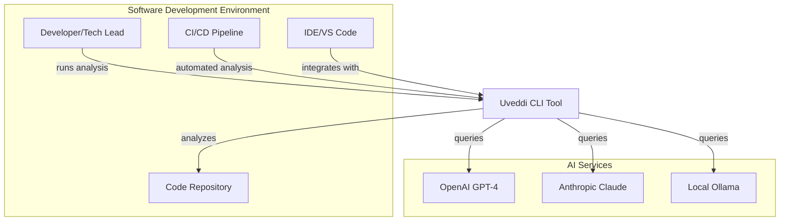
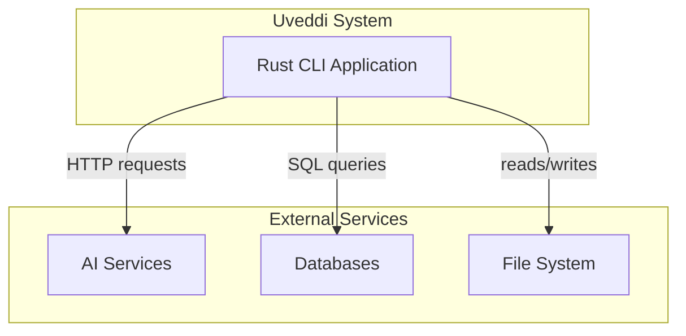
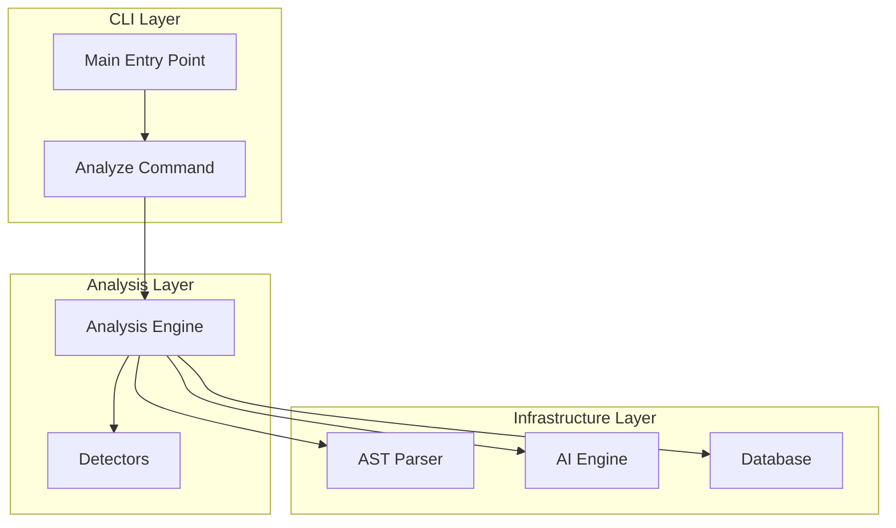
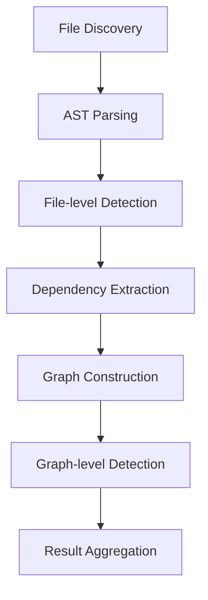

# Uveddi Architecture Documentation

## Overview

Uveddi follows a layered architecture focused on local analysis and community-driven development. This document provides a comprehensive view of the architecture from high-level concepts to implementation details.

## Table of Contents
1. [Architectural Principles](#architectural-principles)
2. [Layer Architecture](#layer-architecture)
3. [C4 Model Views](#c4-model-views)
4. [Analysis Engine Deep Dive](#analysis-engine-deep-dive)
5. [Error Handling](#error-handling)
6. [Performance Considerations](#performance-considerations)
7. [Development Guidelines](#development-guidelines)

## Architectural Principles

1. **Privacy First**: All analysis happens locally - no data leaves the user's machine
2. **Separation of Concerns**: Each module has a single, well-defined responsibility
3. **Community Extensibility**: Core functionality can be extended through open source contributions
4. **Simplicity**: Minimal dependencies and straightforward architecture
5. **Local AI Integration**: Seamless integration with Ollama for private AI analysis

## Layer Architecture

```
┌─────────────────────────────────────────────────────────────┐
│                        CLI Layer                            │
│                  (User Interface)                          │
└─────────────────────────────────────────────────────────────┘
                             │
┌─────────────────────────────────────────────────────────────┐
│                   Application Layer                         │
│              (Command Orchestration)                       │
└─────────────────────────────────────────────────────────────┘
                             │
┌─────────────────────────────────────────────────────────────┐
│                     Analysis Layer                          │
│           (Core Business Logic & Engines)                  │
└─────────────────────────────────────────────────────────────┘
                             │
┌─────────────────────────────────────────────────────────────┐
│                   Infrastructure Layer                      │
│          (AST, AI, Database, Plugin System)                │
└─────────────────────────────────────────────────────────────┘
                             │
┌─────────────────────────────────────────────────────────────┐
│                     Platform Layer                          │
│              (OS, File System, Network)                    │
└─────────────────────────────────────────────────────────────┘
```

### Layer Definitions

#### 1. CLI Layer (`src/cli/`)
- **Responsibility**: User interface and command parsing
- **Key Constraints**:
  - Must NOT directly access infrastructure layers
  - Should delegate all business logic to Application Layer

#### 2. Application Layer
- **Responsibility**: Command orchestration and workflow management
- **Key Functions**:
  - Coordinate analysis workflows
  - Manage configuration loading
  - Handle error reporting

#### 3. Analysis Layer
- **Responsibility**: Core business logic and analysis engines
- **Key Modules**:
  - `engine.rs` - Main analysis orchestration
  - Anti-pattern detectors
  - Dependency analysis

#### 4. Infrastructure Layer
- **Subsystems**:
  - AST parsing
  - AI integration
  - Database management
  - Plugin system

#### 5. Platform Layer
- **Responsibility**: Operating system and external system interfaces

## C4 Model Views

### System Context Diagram



### Container Diagram



### Component Diagram



## Analysis Engine Deep Dive

### Core Components

#### AnalysisEngine (Orchestrator)
- Location: `src/analysis/engine.rs`
- Key Methods:
  ```rust
  pub async fn analyze(&mut self, path: &Path) -> Result<(Vec<ArchitecturalIssue>, LocalDependencyGraph), UveddiError>
  ```

#### AnalysisDetector Trait
```rust
pub trait AnalysisDetector {
    fn detect_issues(&self, file: &ParsedFile) -> Result<Vec<ArchitecturalIssue>, AnalysisError>;
    fn get_detector_name(&self) -> &'static str;
}
```

### Detection Categories

#### Universal Anti-patterns
- God Objects
- Cyclic Dependencies  
- Magic Values
- Tight Coupling

#### Language-Specific Detectors
- Rust: Clone Abuse, Unwrap Abuse
- Python: Exception Handling, OOP Issues
- JavaScript: Async Anti-patterns, Scope Issues

### Analysis Pipeline



## Error Handling

### Unified Error Type
```rust
pub enum UveddiError {
    Analysis(String),
    AstParsing(String),
    AiApi { provider: String, message: String },
    Database(#[from] rusqlite::Error),
}
```

### Error Flow Principles
- Errors originate in Infrastructure Layer
- Each layer adds context
- CLI Layer formats errors for user consumption

## Performance Considerations

### Optimizations
- Async processing with Tokio
- Parallel extraction with Rayon
- SQLite-based caching
- Lazy loading of AST trees

## Development Guidelines

### Adding New Features
1. Identify the appropriate layer
2. Define interfaces before implementation  
3. Add error handling through `UveddiError`
4. Write tests at the appropriate layer

### Code Review Checklist
- [ ] Respects layer boundaries
- [ ] Dependencies flow correctly
- [ ] Follows error handling pattern
- [ ] Interfaces are minimal and well-defined
