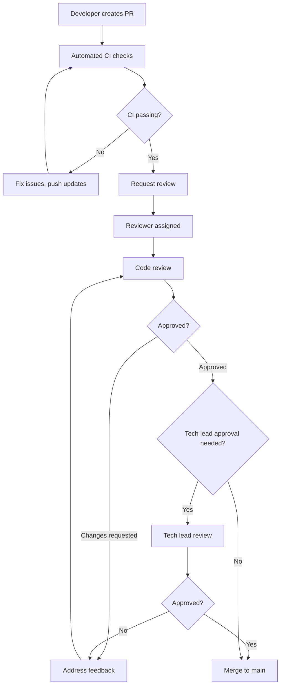

# Uveddi Team Collaboration Guide

## Overview

This guide establishes standards and practices for effective collaboration on the Uveddi project. It covers code review processes, communication protocols, and team workflows designed to maintain high code quality while enabling rapid development.

## Team Structure and Roles

### Core Roles

**Tech Lead / Architect**
- Final authority on architectural decisions
- Code review approval for significant changes
- Sprint planning and technical roadmap
- Conflict resolution for technical disagreements

**Senior Developers**
- Feature design and implementation
- Code review responsibilities
- Mentoring junior developers
- Architecture compliance validation

**Developers**
- Feature implementation
- Unit test development
- Documentation updates
- Bug fixes and maintenance

**DevOps Engineer**
- CI/CD pipeline maintenance
- Infrastructure management
- Security compliance
- Performance monitoring

### Responsibilities Matrix

| Role | Code Review | Architecture | Deployment | Mentoring |
|------|-------------|--------------|------------|-----------|
| Tech Lead | Required for major changes | Owner | Approval | Yes |
| Senior Dev | Required | Contributor | Review | Yes |
| Developer | Peer review | Follower | None | Receive |
| DevOps | Infrastructure only | Consultant | Owner | Domain-specific |

## Communication Protocols

### Primary Channels

**Slack/Discord Channels**:
- `#uveddi-general`: General discussion and announcements
- `#uveddi-dev`: Development discussions and questions
- `#uveddi-alerts`: CI/CD notifications and alerts
- `#uveddi-architecture`: Architecture decisions and reviews
- `#uveddi-random`: Informal team chat

**GitHub Discussions**:
- Feature proposals and RFC discussions
- Architecture Decision Records (ADRs)
- Long-form technical discussions

**Email**:
- Official announcements
- External stakeholder communication
- Security-related communications

### Communication Standards

**Response Time Expectations**:
- Urgent issues (production down): 30 minutes
- Code review requests: 24 hours
- General questions: 48 hours
- Feature discussions: 1 week

**Meeting Cadence**:
- Daily standups: 15 minutes (async via Slack acceptable)
- Sprint planning: 2 hours every 2 weeks
- Architecture reviews: 1 hour weekly
- Retrospectives: 1 hour every 2 weeks

## Code Review Process

### Review Requirements

**All Pull Requests Must Have**:
- [ ] Descriptive title following conventional commits
- [ ] Detailed description explaining the change
- [ ] Link to related issue or RFC
- [ ] All CI checks passing
- [ ] At least one approving review

**Review Assignment**:
- **Small changes** (<50 lines): Any team member
- **Medium changes** (50-200 lines): Senior developer or above
- **Large changes** (>200 lines): Tech lead review required
- **Architecture changes**: Tech lead + one senior developer

### Review Checklist

#### Functionality Review
- [ ] Code solves the stated problem
- [ ] Edge cases are handled appropriately
- [ ] Error handling is comprehensive
- [ ] Performance implications considered

#### Code Quality Review
- [ ] Follows Rust idioms and best practices
- [ ] Proper error handling with `Result<T, E>`
- [ ] Appropriate use of `Option<T>` vs panicking
- [ ] Memory safety and ownership patterns

#### Architecture Review
- [ ] Respects layer boundaries (see `ARCHITECTURE.md`)
- [ ] Follows established patterns
- [ ] Doesn't introduce circular dependencies
- [ ] Plugin API compatibility maintained

#### Testing Review
- [ ] Adequate test coverage for new code
- [ ] Tests are meaningful and not just for coverage
- [ ] Integration tests for complex features
- [ ] Performance tests for critical paths

#### Documentation Review
- [ ] Public APIs have doc comments
- [ ] Complex logic is explained
- [ ] README updated if needed
- [ ] Architecture docs updated for significant changes

### Review Process Flow



### Review Guidelines

**For Reviewers**:
- Be constructive and specific in feedback
- Explain the "why" behind suggestions
- Distinguish between "must fix" and "nice to have"
- Approve when code is "good enough" not "perfect"
- Focus on correctness, maintainability, and architecture

**For Authors**:
- Respond to all review comments
- Ask for clarification if feedback is unclear
- Push back respectfully if you disagree
- Keep PRs focused and reasonably sized
- Update tests and documentation with code changes

## Branching Strategy

### Branch Types

**Main Branches**:
- `main`: Production-ready code, always deployable
- `develop`: Integration branch for features

**Supporting Branches**:
- `feature/*`: New features and enhancements
- `bugfix/*`: Bug fixes for develop branch
- `hotfix/*`: Critical fixes for production
- `release/*`: Release preparation

### Branch Naming Conventions

```bash
# Features
feature/add-rust-analyzer-support
feature/improve-god-object-detection

# Bug fixes
bugfix/fix-ast-cache-corruption
bugfix/resolve-memory-leak

# Hotfixes
hotfix/security-vulnerability-fix
hotfix/critical-performance-issue

# Releases
release/v0.2.0
release/v0.1.1
```

### Workflow

```bash
# Start new feature
git checkout develop
git pull origin develop
git checkout -b feature/your-feature-name

# Work on feature
git add .
git commit -m "feat: implement new feature"
git push origin feature/your-feature-name

# Create PR to develop
# After review and approval, merge via GitHub

# Release process
git checkout develop
git checkout -b release/v0.2.0
# Final testing and bug fixes
# Create PR to main
# After approval, merge and tag
```

## Issue Management

### Issue Types

**Bug Reports**:
```markdown
**Bug Description**: Clear description of the issue
**Steps to Reproduce**: Numbered steps
**Expected Behavior**: What should happen
**Actual Behavior**: What actually happens
**Environment**: OS, Rust version, etc.
**Additional Context**: Logs, screenshots, etc.
```

**Feature Requests**:
```markdown
**Feature Description**: What you want to achieve
**Use Case**: Why this feature is needed
**Proposed Solution**: How you think it should work
**Alternatives Considered**: Other approaches
**Additional Context**: Related issues, references
```

**Architecture Proposals**:
```markdown
**Problem Statement**: What architectural issue needs solving
**Proposed Solution**: Detailed technical approach
**Trade-offs**: Pros and cons of the approach
**Implementation Plan**: High-level steps
**Breaking Changes**: Impact on existing code
```

### Issue Labels

**Type Labels**:
- `bug`: Something isn't working
- `enhancement`: New feature or request
- `documentation`: Improvements or additions to docs
- `performance`: Performance-related issues
- `security`: Security-related issues

**Priority Labels**:
- `priority/critical`: Must be fixed immediately
- `priority/high`: Should be fixed in current sprint
- `priority/medium`: Should be fixed in next sprint
- `priority/low`: Nice to have

**Component Labels**:
- `component/analysis`: Analysis engine
- `component/ai`: AI integration
- `component/cli`: Command-line interface
- `component/plugin`: Plugin system
- `component/database`: Database layer

**Status Labels**:
- `status/needs-triage`: Needs initial review
- `status/blocked`: Waiting on external dependency
- `status/in-progress`: Currently being worked on
- `status/needs-review`: Ready for review

## Sprint Planning and Management

### Sprint Structure

**Sprint Duration**: 2 weeks

**Sprint Events**:
- **Sprint Planning** (Monday, Week 1): 2 hours
- **Daily Standups**: 15 minutes (async acceptable)
- **Mid-sprint Check-in** (Wednesday, Week 2): 30 minutes
- **Sprint Review** (Friday, Week 2): 1 hour
- **Sprint Retrospective** (Friday, Week 2): 1 hour

### Story Estimation

**Story Points Scale** (Fibonacci):
- **1 point**: Simple bug fix, documentation update
- **2 points**: Small feature, minor refactoring
- **3 points**: Medium feature, moderate complexity
- **5 points**: Large feature, significant complexity
- **8 points**: Major feature, high complexity
- **13 points**: Epic-level work, needs breakdown

**Estimation Guidelines**:
- Consider implementation complexity
- Include testing and documentation time
- Account for code review iterations
- Factor in integration complexity

### Definition of Done

**For User Stories**:
- [ ] Code implemented and reviewed
- [ ] Unit tests written and passing
- [ ] Integration tests updated if needed
- [ ] Documentation updated
- [ ] CI/CD pipeline passing
- [ ] Performance impact assessed
- [ ] Security implications reviewed

**For Bugs**:
- [ ] Root cause identified and fixed
- [ ] Regression test added
- [ ] Fix verified in staging environment
- [ ] Documentation updated if needed

**For Documentation**:
- [ ] Content accurate and up-to-date
- [ ] Follows documentation standards
- [ ] Reviewed by subject matter expert
- [ ] Links and references verified

## Conflict Resolution

### Technical Disagreements

**Process**:
1. **Discussion**: Open discussion in appropriate channel
2. **Documentation**: Document different approaches and trade-offs
3. **Prototype**: Create small prototypes if needed
4. **Decision**: Tech lead makes final decision
5. **Record**: Document decision and rationale

**Escalation Path**:
1. Team discussion
2. Tech lead decision
3. Architecture review board (if established)
4. Project stakeholders

### Code Review Conflicts

**Common Scenarios**:
- Disagreement on implementation approach
- Style vs. substance debates
- Performance vs. readability trade-offs

**Resolution**:
- Focus on project goals and standards
- Refer to established guidelines
- Seek third-party opinion if needed
- Tech lead has final authority

## Knowledge Sharing

### Documentation Standards

**Code Documentation**:
- All public APIs must have doc comments
- Complex algorithms need explanation
- Architecture decisions documented in ADRs

**Team Knowledge Base**:
- Maintain up-to-date README files
- Document common debugging procedures
- Share useful development tips and tricks

### Learning and Development

**Knowledge Sharing Sessions**:
- Weekly tech talks (30 minutes)
- Architecture deep dives
- Tool and technique sharing
- External conference summaries

**Mentoring Program**:
- Pair programming sessions
- Code review as learning opportunity
- Junior developer shadowing
- Cross-team knowledge exchange

## Quality Assurance

### Code Quality Metrics

**Automated Metrics**:
- Test coverage: Target 25%+, minimum 15%
- Clippy warnings: Zero tolerance
- Security vulnerabilities: Zero tolerance
- Performance regressions: Monitored and reviewed

**Manual Review Focus**:
- Architecture compliance
- Code readability and maintainability
- Error handling completeness
- Documentation quality

### Continuous Improvement

**Retrospective Actions**:
- Identify process improvements
- Update team guidelines
- Adjust tooling and automation
- Address team concerns

**Metrics Review**:
- Monthly review of key metrics
- Quarterly process assessment
- Annual team satisfaction survey
- Continuous feedback collection

## Security and Compliance

### Security Practices

**Code Security**:
- Regular dependency audits
- Secure coding practices
- Input validation and sanitization
- Proper error handling

**Access Control**:
- Principle of least privilege
- Regular access reviews
- Secure credential management
- Multi-factor authentication

### Compliance Requirements

**Data Protection**:
- No sensitive data in logs
- Secure handling of API keys
- Privacy-by-design principles
- Regular security assessments

**Audit Trail**:
- All changes tracked in Git
- Code review records maintained
- Deployment logs preserved
- Security incident documentation

---

*This collaboration guide is a living document. Please suggest improvements and updates as the team evolves.*