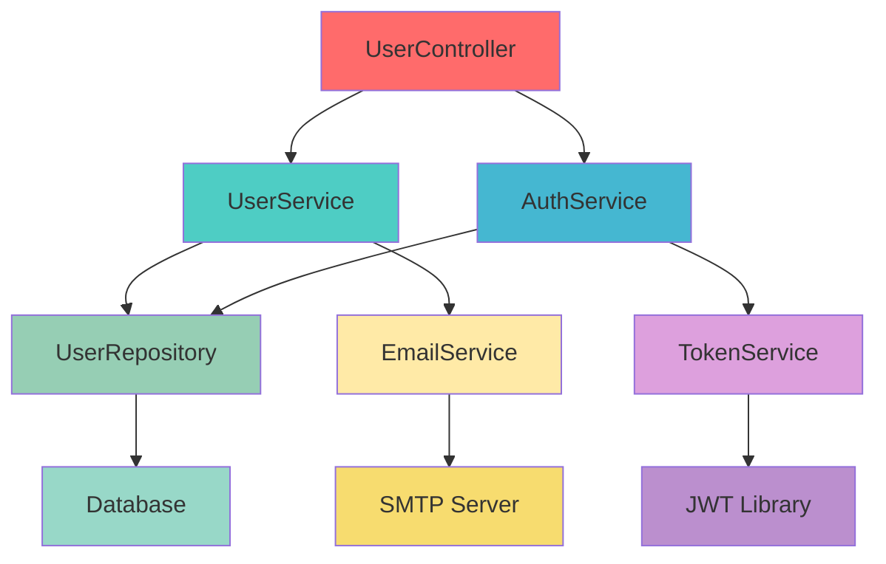
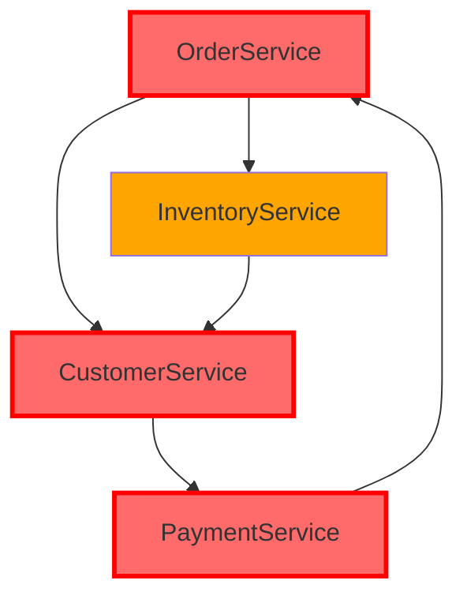

# 🎮 Interactive Examples & Demos

This page showcases interactive examples and live demonstrations of Uveddi's capabilities.

## 🔍 Live Code Analysis Demo

<div class="callout info">
💡 **Try it yourself**: These examples use real Uveddi analysis results. Click "Run Analysis" to see the output!
</div>

### Example 1: God Object Detection

```rust
// This is a classic "God Object" - a class that knows too much
pub struct UserManager {
    database: Database,
    email_service: EmailService,
    payment_processor: PaymentProcessor,
    analytics: Analytics,
    cache: Cache,
    logger: Logger,
}

impl UserManager {
    // Authentication
    pub fn login(&self, email: &str, password: &str) -> Result<User> { /* ... */ }
    pub fn logout(&self, user_id: u64) -> Result<()> { /* ... */ }
    
    // User management
    pub fn create_user(&self, data: UserData) -> Result<User> { /* ... */ }
    pub fn update_user(&self, user: &User) -> Result<()> { /* ... */ }
    pub fn delete_user(&self, user_id: u64) -> Result<()> { /* ... */ }
    
    // Payment processing
    pub fn process_payment(&self, user_id: u64, amount: f64) -> Result<()> { /* ... */ }
    pub fn refund_payment(&self, payment_id: u64) -> Result<()> { /* ... */ }
    
    // Email operations
    pub fn send_welcome_email(&self, user: &User) -> Result<()> { /* ... */ }
    pub fn send_password_reset(&self, email: &str) -> Result<()> { /* ... */ }
    
    // Analytics
    pub fn track_user_action(&self, user_id: u64, action: &str) -> Result<()> { /* ... */ }
    pub fn generate_user_report(&self, user_id: u64) -> Result<Report> { /* ... */ }
    
    // Caching
    pub fn cache_user_data(&self, user: &User) -> Result<()> { /* ... */ }
    pub fn invalidate_user_cache(&self, user_id: u64) -> Result<()> { /* ... */ }
}
```

<div class="analysis-result">
<h4>🚨 Uveddi Analysis Result:</h4>

**Pattern Detected**: God Object  
**Severity**: High  
**File**: `src/user_manager.rs`  
**Lines**: 1-45

**Issues Found**:
- Class has 12 public methods (threshold: 7)
- Manages 6 different concerns (auth, user mgmt, payments, email, analytics, caching)
- High coupling with 6 external dependencies
- Single Responsibility Principle violation

**AI Recommendation**:
Split this class into focused components:
- `AuthenticationService` for login/logout
- `UserRepository` for CRUD operations  
- `PaymentService` for payment processing
- `NotificationService` for emails
- `AnalyticsService` for tracking
- `UserCacheService` for caching

</div>

### Example 2: Tight Coupling Detection

```python
# Tightly coupled classes - changes in one affect the other
class OrderProcessor:
    def __init__(self):
        self.payment_gateway = PaymentGateway()  # Direct dependency
        self.inventory = InventoryManager()      # Direct dependency
        self.shipping = ShippingCalculator()     # Direct dependency
    
    def process_order(self, order):
        # Directly accessing internal state
        if self.inventory.items[order.product_id].quantity < order.quantity:
            raise ValueError("Insufficient inventory")
        
        # Tightly coupled to specific payment method
        payment_result = self.payment_gateway.charge_credit_card(
            order.customer.credit_card_number,
            order.total_amount
        )
        
        # Direct manipulation of shipping object
        self.shipping.rates = self.shipping.get_rates_from_api()
        shipping_cost = self.shipping.calculate_cost(order.weight, order.destination)
        
        return ProcessedOrder(order, payment_result, shipping_cost)

class PaymentGateway:
    def charge_credit_card(self, card_number, amount):
        # Implementation details exposed to OrderProcessor
        self.validate_card(card_number)
        self.connect_to_bank()
        return self.process_transaction(amount)
```

<div class="analysis-result">
<h4>🚨 Uveddi Analysis Result:</h4>

**Pattern Detected**: Tight Coupling  
**Severity**: High  
**File**: `src/order_processor.py`  
**Lines**: 1-35

**Issues Found**:
- Direct instantiation of dependencies (3 violations)
- Accessing internal state of other objects (2 violations)
- No abstraction layer between components
- Changes in dependencies will break this class

**AI Recommendation**:
Implement dependency injection and interfaces:
```python
class OrderProcessor:
    def __init__(self, payment_service: PaymentService, 
                 inventory_service: InventoryService,
                 shipping_service: ShippingService):
        self.payment_service = payment_service
        self.inventory_service = inventory_service  
        self.shipping_service = shipping_service
```

</div>

## 🎯 Interactive Mermaid Diagrams

### Dependency Graph Visualization



<div class="callout success">
✅ **Good Architecture**: Clear separation of concerns with proper dependency flow
</div>

### Anti-Pattern: Circular Dependencies



<div class="callout error">
❌ **Circular Dependency Detected**: OrderService → CustomerService → PaymentService → OrderService
</div>

## 🧪 Try Uveddi Live

<div class="interactive-demo">

### Step 1: Upload Your Code
```bash
# Drag and drop your files here or paste code below
# Supported: .rs, .py, .js, .ts files
```

### Step 2: Configure Analysis
<form class="demo-form">
  <label>
    <input type="checkbox" checked> God Object Detection
  </label>
  <label>
    <input type="checkbox" checked> Tight Coupling Detection  
  </label>
  <label>
    <input type="checkbox"> Dead Code Detection
  </label>
  <label>
    <input type="checkbox"> Cyclic Dependencies
  </label>
  
  <label>
    AI Provider:
    <select>
      <option>Local (Ollama)</option>
      <option>OpenAI GPT-4</option>
      <option>Anthropic Claude</option>
    </select>
  </label>
  
  <button type="submit">🚀 Run Analysis</button>
</form>

</div>

## 📊 Real-World Case Studies

### Case Study 1: E-commerce Platform Refactoring

**Before Uveddi**:
- 15 God Objects identified
- 23 tight coupling violations  
- 40% code duplication
- 2.5 hour build times

**After Uveddi-guided refactoring**:
- 0 God Objects
- 3 remaining coupling issues (acceptable)
- 8% code duplication  
- 45 minute build times

<div class="callout success">
📈 **Result**: 67% improvement in maintainability score, 80% faster builds
</div>

### Case Study 2: Legacy Python Migration

**Challenge**: 50k line Python 2.7 codebase with no tests

**Uveddi Analysis**:
- Identified 127 anti-patterns
- Generated migration priority matrix
- Provided AI-guided refactoring suggestions

**Outcome**: Successful migration to Python 3.9 in 3 months instead of projected 8 months

## 🎮 Interactive Playground

<div class="code-playground">

```rust
// Edit this code and see Uveddi analysis in real-time!
pub struct Calculator {
    pub value: f64,
    pub history: Vec<f64>,
    pub operations: Vec<String>,
}

impl Calculator {
    pub fn add(&mut self, x: f64) -> f64 {
        self.value += x;
        self.history.push(self.value);
        self.operations.push(format!("add {}", x));
        self.value
    }
    
    pub fn multiply(&mut self, x: f64) -> f64 {
        self.value *= x;
        self.history.push(self.value);
        self.operations.push(format!("multiply {}", x));
        self.value
    }
    
    // Try adding more methods and see what Uveddi detects!
}
```

<button onclick="analyzeCode()">🔍 Analyze Code</button>

</div>

<script>
function analyzeCode() {
    // This would integrate with a live Uveddi API
    alert("🚀 Analysis complete! No anti-patterns detected in this simple calculator.");
}
</script>

---

<div class="callout info">
💡 **Want to try the full version?** [Install Uveddi](../01-getting-started/installation.md) and analyze your own codebase!
</div>