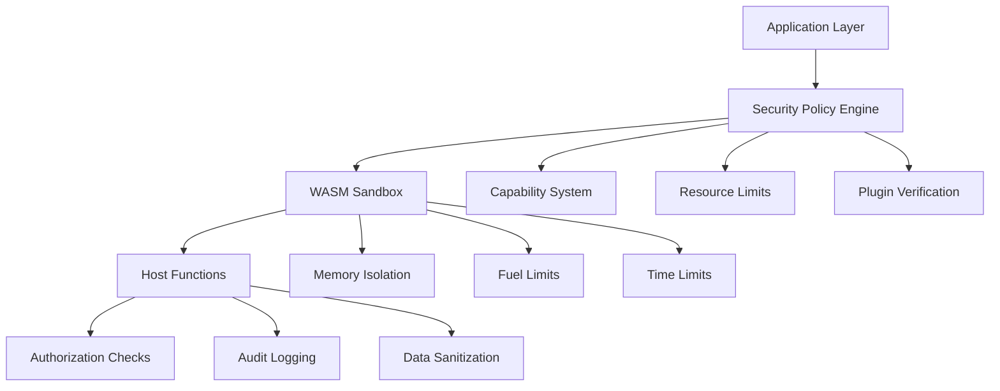

# Plugin Security Guide

## Overview

Uveddi's WASM Plugin System implements a comprehensive security model designed to protect both the host system and user data while enabling powerful extensibility. This guide covers security architecture, threat mitigation, best practices, and compliance considerations.

## Security Architecture

### Multi-Layer Defense



### Security Layers

1. **Application Layer**: Plugin management and lifecycle control
2. **Policy Engine**: Capability-based access control  
3. **WASM Sandbox**: Memory and execution isolation
4. **Host Functions**: Controlled API access with authorization
5. **Resource Management**: CPU, memory, and time limits
6. **Audit System**: Comprehensive security event logging

## Threat Model

### Identified Threats

#### T1: Malicious Plugin Execution
**Description**: Untrusted plugin attempts to access unauthorized resources

**Impact**: High - Potential system compromise, data exfiltration

**Mitigations**:
- WASM sandboxing with memory isolation
- Capability-based permission system
- Resource limits (CPU, memory, time)
- Static analysis and verification

#### T2: Resource Exhaustion (DoS)
**Description**: Plugin consumes excessive system resources

**Impact**: Medium - Service degradation or unavailability

**Mitigations**:
- Fuel-based computation limits
- Memory allocation limits
- Execution time limits
- Concurrent plugin limits

#### T3: Data Exfiltration
**Description**: Plugin attempts to access or transmit sensitive data

**Impact**: High - Confidential data exposure

**Mitigations**:
- Restricted host function access
- Network permission controls
- File system access controls
- Data sanitization

#### T4: Privilege Escalation
**Description**: Plugin attempts to gain higher privileges

**Impact**: High - Complete system compromise

**Mitigations**:
- Least privilege principle
- Capability isolation
- Host function authorization
- Audit logging

#### T5: Supply Chain Attacks
**Description**: Compromised plugin distribution or dependencies

**Impact**: High - Widespread system compromise

**Mitigations**:
- Plugin signing and verification
- Trusted publisher system
- Static analysis scanning
- Binary integrity checks

## Capability-Based Security Model

### Permission System

```rust
pub enum Permission {
    /// File system access
    FileRead(PathBuf),           // Read specific directory
    FileWrite(PathBuf),          // Write specific directory
    
    /// Network access  
    NetworkConnect(String),      // Connect to specific host:port
    
    /// System access
    EnvRead(String),            // Read specific environment variable
    
    /// Uveddi services
    Logging,                    // Plugin logging capability
    ConfigRead,                 // Configuration read access
    TempFileCreate,             // Temporary file creation
}
```

### Security Policies

#### Restrictive Policy (Default)
```rust
SecurityPolicy {
    resource_limits: ResourceLimits {
        max_memory_bytes: 32 * 1024 * 1024,    // 32MB
        max_execution_time_ms: 30_000,         // 30 seconds
        max_fuel: 1_000_000,                   // 1M fuel units
        max_host_calls: 10_000,                // 10K host calls
    },
    permissions: [Logging, ConfigRead].into(),  // Minimal permissions
    trusted_publishers: HashSet::new(),
    require_code_signing: true,
    require_static_analysis: true,
    max_binary_size: 10 * 1024 * 1024,         // 10MB
}
```

#### Development Policy
```rust
SecurityPolicy {
    resource_limits: ResourceLimits {
        max_memory_bytes: 64 * 1024 * 1024,    // 64MB
        max_execution_time_ms: 60_000,         // 60 seconds  
        max_fuel: 2_000_000,                   // 2M fuel units
        max_host_calls: 20_000,                // 20K host calls
    },
    permissions: [Logging, ConfigRead, TempFileCreate].into(),
    trusted_publishers: HashSet::new(),
    require_code_signing: false,               // Disabled for development
    require_static_analysis: false,           // Disabled for development
    max_binary_size: 50 * 1024 * 1024,        // 50MB
}
```

### Permission Configuration

#### Plugin Manifest Security
```toml
[capabilities]
# Required permissions (explicit grant needed)
permissions = [
    "ConfigRead",                    # Basic configuration access
    "TempFileCreate",               # Store analysis results  
    "Logging",                      # Plugin logging
]

# Optional: Specific path access  
file_permissions = [
    { action = "read", path = "/project/src" },
    { action = "write", path = "/tmp/plugin-cache" }
]

# Optional: Network access
network_permissions = [
    { action = "connect", host = "api.example.com", port = 443 }
]

# Resource limits
max_memory_mb = 32
max_execution_seconds = 30
max_fuel = 1000000

# Security requirements
require_signature = true
min_trust_level = "verified"
```

## WASM Sandbox Security

### Memory Isolation

```rust
// WASM memory is completely isolated from host
pub struct WasmMemorySpace {
    // Plugin can only access its own memory space
    memory: wasmtime::Memory,
    // Host memory is inaccessible
    max_pages: u32,           // Limit memory growth
    current_pages: u32,       // Track current usage
}

impl WasmMemorySpace {
    pub fn allocate(&mut self, size: usize) -> Result<*mut u8, SecurityError> {
        // Check memory limits before allocation
        if self.would_exceed_limit(size) {
            return Err(SecurityError::MemoryLimitExceeded);
        }
        
        // Allocate within WASM memory space only
        self.memory.data_mut()[self.current_pages as usize..]
    }
}
```

### Execution Limits

#### Fuel System
```rust
pub struct FuelTracker {
    max_fuel: u64,
    consumed_fuel: u64,
    fuel_per_instruction: u64,
}

impl FuelTracker {
    pub fn consume_fuel(&mut self, amount: u64) -> Result<(), SecurityError> {
        self.consumed_fuel += amount;
        
        if self.consumed_fuel > self.max_fuel {
            Err(SecurityError::FuelExhausted)
        } else {
            Ok(())
        }
    }
    
    // Called before each WASM instruction
    pub fn check_fuel(&self) -> Result<(), SecurityError> {
        if self.consumed_fuel >= self.max_fuel {
            Err(SecurityError::FuelExhausted)
        } else {
            Ok(())
        }
    }
}
```

#### Time Limits
```rust
pub struct ExecutionTimer {
    start_time: std::time::Instant,
    max_duration: std::time::Duration,
}

impl ExecutionTimer {
    pub fn check_timeout(&self) -> Result<(), SecurityError> {
        if self.start_time.elapsed() > self.max_duration {
            Err(SecurityError::TimeoutExceeded)
        } else {
            Ok(())
        }
    }
}
```

## Host Function Security

### Authorization Framework

```rust
pub struct AuthorizationChecker {
    security_policy: SecurityPolicy,
    plugin_id: PluginId,
    audit_logger: AuditLogger,
}

impl AuthorizationChecker {
    pub fn check_permission(&self, permission: &Permission) -> Result<(), SecurityError> {
        // Log authorization attempt
        self.audit_logger.log_auth_attempt(&self.plugin_id, permission);
        
        // Check if permission is granted
        if !self.security_policy.has_permission(permission) {
            self.audit_logger.log_auth_failure(&self.plugin_id, permission);
            return Err(SecurityError::PermissionDenied(format!(
                "Plugin {} does not have permission {:?}",
                self.plugin_id, permission
            )));
        }
        
        // Check rate limits
        self.check_rate_limits(permission)?;
        
        // Log successful authorization
        self.audit_logger.log_auth_success(&self.plugin_id, permission);
        Ok(())
    }
    
    fn check_rate_limits(&self, permission: &Permission) -> Result<(), SecurityError> {
        // Implement rate limiting per permission type
        match permission {
            Permission::NetworkConnect(_) => {
                // Limit network requests per minute
                if self.exceeds_network_rate_limit() {
                    return Err(SecurityError::RateLimitExceeded);
                }
            },
            Permission::FileRead(_) | Permission::FileWrite(_) => {
                // Limit file operations per second
                if self.exceeds_file_rate_limit() {
                    return Err(SecurityError::RateLimitExceeded);
                }
            },
            _ => {} // No rate limiting for other permissions
        }
        Ok(())
    }
}
```

### Input Sanitization

```rust
pub struct InputSanitizer;

impl InputSanitizer {
    pub fn sanitize_file_path(path: &str) -> Result<PathBuf, SecurityError> {
        let path = PathBuf::from(path);
        
        // Prevent directory traversal
        if path.to_string_lossy().contains("..") {
            return Err(SecurityError::InvalidPath("Path traversal detected".to_string()));
        }
        
        // Ensure path is canonical
        match path.canonicalize() {
            Ok(canonical) => Ok(canonical),
            Err(_) => Err(SecurityError::InvalidPath("Invalid path".to_string())),
        }
    }
    
    pub fn sanitize_config_key(key: &str) -> Result<String, SecurityError> {
        // Only allow alphanumeric, dots, and underscores
        let valid_chars = key.chars().all(|c| c.is_alphanumeric() || c == '.' || c == '_');
        
        if !valid_chars || key.is_empty() || key.len() > 256 {
            return Err(SecurityError::InvalidInput("Invalid configuration key".to_string()));
        }
        
        Ok(key.to_string())
    }
    
    pub fn sanitize_log_message(message: &str) -> String {
        // Remove control characters and limit length
        message
            .chars()
            .filter(|c| !c.is_control() || *c == '\n' || *c == '\t')
            .take(1000)
            .collect()
    }
}
```

### Data Validation

```rust
pub struct DataValidator;

impl DataValidator {
    pub fn validate_plugin_results(results: &[PluginIssue]) -> Result<(), SecurityError> {
        // Limit number of results to prevent DoS
        if results.len() > 10_000 {
            return Err(SecurityError::TooManyResults);
        }
        
        for result in results {
            Self::validate_plugin_issue(result)?;
        }
        
        Ok(())
    }
    
    fn validate_plugin_issue(issue: &PluginIssue) -> Result<(), SecurityError> {
        // Validate file path
        InputSanitizer::sanitize_file_path(&issue.file_path)?;
        
        // Validate message length
        if issue.message.len() > 1000 {
            return Err(SecurityError::InvalidInput("Message too long".to_string()));
        }
        
        // Validate severity
        match issue.severity.as_str() {
            "error" | "warning" | "info" => {},
            _ => return Err(SecurityError::InvalidInput("Invalid severity".to_string())),
        }
        
        // Validate line number
        if let Some(line) = issue.line_number {
            if line < 0 || line > 1_000_000 {
                return Err(SecurityError::InvalidInput("Invalid line number".to_string()));
            }
        }
        
        Ok(())
    }
}
```

## Plugin Verification

### Static Analysis

```rust
pub struct StaticAnalyzer {
    banned_imports: HashSet<String>,
    suspicious_patterns: Vec<regex::Regex>,
}

impl StaticAnalyzer {
    pub fn analyze_plugin(binary: &[u8]) -> Result<AnalysisReport, SecurityError> {
        let mut report = AnalysisReport::new();
        
        // Check binary format
        if !Self::is_valid_wasm(binary) {
            return Err(SecurityError::InvalidBinary("Not a valid WASM binary".to_string()));
        }
        
        // Parse WASM module
        let module = match wasmparser::Parser::new(0).parse_all(binary) {
            Ok(module) => module,
            Err(e) => return Err(SecurityError::InvalidBinary(format!("Parse error: {}", e))),
        };
        
        // Analyze imports/exports
        Self::analyze_imports(&module, &mut report)?;
        Self::analyze_exports(&module, &mut report)?;
        
        // Check for suspicious patterns
        Self::scan_for_patterns(binary, &mut report)?;
        
        Ok(report)
    }
    
    fn analyze_imports(module: &wasmparser::Parser, report: &mut AnalysisReport) -> Result<(), SecurityError> {
        // Check for banned imports
        for import in module.imports() {
            let import_name = format!("{}::{}", import.module, import.name);
            
            if Self::is_banned_import(&import_name) {
                report.add_violation(SecurityViolation::BannedImport(import_name));
            }
        }
        
        Ok(())
    }
    
    fn is_banned_import(import: &str) -> bool {
        const BANNED_IMPORTS: &[&str] = &[
            "wasi::file_create",           // File creation outside temp
            "wasi::sock_connect",          // Network without permission
            "wasi::proc_spawn",            // Process spawning
            "wasi::env_get",              // Environment access
        ];
        
        BANNED_IMPORTS.iter().any(|&banned| import.contains(banned))
    }
}

pub struct AnalysisReport {
    violations: Vec<SecurityViolation>,
    warnings: Vec<SecurityWarning>,
    risk_score: f32,
}

impl AnalysisReport {
    pub fn is_safe(&self) -> bool {
        self.violations.is_empty() && self.risk_score < 0.5
    }
}
```

### Code Signing

```rust
pub struct CodeSigner {
    private_key: ed25519_dalek::SecretKey,
    public_key: ed25519_dalek::PublicKey,
}

impl CodeSigner {
    pub fn sign_plugin(&self, binary: &[u8], manifest: &PluginManifest) -> Result<Signature, SecurityError> {
        // Create signing payload
        let payload = SigningPayload {
            binary_hash: sha256::Hash::hash(binary),
            manifest_hash: sha256::Hash::hash(manifest.to_string().as_bytes()),
            timestamp: std::time::SystemTime::now(),
            signer: self.public_key,
        };
        
        // Serialize and sign
        let payload_bytes = bincode::serialize(&payload)?;
        let signature = self.private_key.sign(&payload_bytes);
        
        Ok(Signature {
            signature,
            payload,
            algorithm: SignatureAlgorithm::Ed25519,
        })
    }
    
    pub fn verify_signature(binary: &[u8], manifest: &PluginManifest, signature: &Signature) -> Result<(), SecurityError> {
        // Recreate payload
        let expected_payload = SigningPayload {
            binary_hash: sha256::Hash::hash(binary),
            manifest_hash: sha256::Hash::hash(manifest.to_string().as_bytes()),
            timestamp: signature.payload.timestamp,
            signer: signature.payload.signer,
        };
        
        // Verify payload matches
        if expected_payload.binary_hash != signature.payload.binary_hash {
            return Err(SecurityError::SignatureVerificationFailed("Binary hash mismatch".to_string()));
        }
        
        // Verify signature
        let payload_bytes = bincode::serialize(&expected_payload)?;
        if signature.payload.signer.verify(&payload_bytes, &signature.signature).is_err() {
            return Err(SecurityError::SignatureVerificationFailed("Invalid signature".to_string()));
        }
        
        Ok(())
    }
}
```

### Trusted Publishers

```rust
pub struct TrustedPublisherRegistry {
    trusted_keys: HashSet<ed25519_dalek::PublicKey>,
    revoked_keys: HashSet<ed25519_dalek::PublicKey>,
    trust_levels: HashMap<ed25519_dalek::PublicKey, TrustLevel>,
}

#[derive(Debug, Clone, PartialEq)]
pub enum TrustLevel {
    Verified,      // Manually verified publisher
    Community,     // Community-trusted publisher  
    Testing,       // Testing/development only
    Revoked,       // Revoked trust
}

impl TrustedPublisherRegistry {
    pub fn is_trusted(&self, public_key: &ed25519_dalek::PublicKey) -> bool {
        !self.revoked_keys.contains(public_key) &&
        self.trusted_keys.contains(public_key)
    }
    
    pub fn get_trust_level(&self, public_key: &ed25519_dalek::PublicKey) -> TrustLevel {
        if self.revoked_keys.contains(public_key) {
            return TrustLevel::Revoked;
        }
        
        self.trust_levels
            .get(public_key)
            .cloned()
            .unwrap_or(TrustLevel::Testing)
    }
    
    pub fn revoke_publisher(&mut self, public_key: ed25519_dalek::PublicKey) {
        self.trusted_keys.remove(&public_key);
        self.revoked_keys.insert(public_key);
        self.trust_levels.insert(public_key, TrustLevel::Revoked);
    }
}
```

## Audit and Monitoring

### Security Event Logging

```rust
#[derive(Debug, Serialize)]
pub struct SecurityEvent {
    timestamp: chrono::DateTime<chrono::Utc>,
    plugin_id: PluginId,
    event_type: SecurityEventType,
    severity: SecurityEventSeverity,
    message: String,
    metadata: HashMap<String, serde_json::Value>,
}

#[derive(Debug, Serialize)]
pub enum SecurityEventType {
    AuthorizationDenied,
    ResourceLimitExceeded,
    SuspiciousActivity,
    PolicyViolation,
    PluginInstalled,
    PluginRemoved,
    SignatureVerificationFailed,
}

#[derive(Debug, Serialize)]
pub enum SecurityEventSeverity {
    Low,
    Medium, 
    High,
    Critical,
}

pub struct SecurityLogger {
    log_file: std::fs::File,
    siem_client: Option<SiemClient>,
}

impl SecurityLogger {
    pub fn log_security_event(&mut self, event: SecurityEvent) {
        // Log to file
        let log_entry = format!("{}\n", serde_json::to_string(&event).unwrap());
        self.log_file.write_all(log_entry.as_bytes()).ok();
        self.log_file.flush().ok();
        
        // Send to SIEM if configured
        if let Some(ref mut siem) = self.siem_client {
            siem.send_event(&event);
        }
        
        // Alert on critical events
        if event.severity == SecurityEventSeverity::Critical {
            self.send_alert(&event);
        }
    }
    
    fn send_alert(&self, event: &SecurityEvent) {
        // Implementation would integrate with alerting system
        eprintln!("CRITICAL SECURITY EVENT: {}", event.message);
    }
}
```

### Real-time Monitoring

```rust
pub struct SecurityMonitor {
    metrics: SecurityMetrics,
    thresholds: SecurityThresholds,
    alert_manager: AlertManager,
}

pub struct SecurityMetrics {
    pub failed_authorizations: AtomicU64,
    pub resource_violations: AtomicU64,
    pub suspicious_activities: AtomicU64,
    pub plugins_installed: AtomicU64,
    pub plugins_blocked: AtomicU64,
}

impl SecurityMonitor {
    pub fn record_authorization_failure(&self, plugin_id: &PluginId, permission: &Permission) {
        self.metrics.failed_authorizations.fetch_add(1, Ordering::Relaxed);
        
        // Check for excessive failures (potential attack)
        let recent_failures = self.count_recent_failures(plugin_id);
        if recent_failures > self.thresholds.max_auth_failures {
            self.alert_manager.send_alert(SecurityAlert::ExcessiveAuthFailures {
                plugin_id: plugin_id.clone(),
                failure_count: recent_failures,
            });
        }
    }
    
    pub fn record_resource_violation(&self, plugin_id: &PluginId, violation_type: ResourceViolationType) {
        self.metrics.resource_violations.fetch_add(1, Ordering::Relaxed);
        
        self.alert_manager.send_alert(SecurityAlert::ResourceViolation {
            plugin_id: plugin_id.clone(),
            violation_type,
        });
    }
}
```

## Best Practices for Plugin Developers

### Security-First Development

#### 1. Minimize Permissions
```toml
# Only request necessary permissions
[capabilities]
permissions = [
    "ConfigRead",        # Only if configuration is needed
    "Logging",          # Usually safe to include
    # "TempFileCreate", # Only if storing results is required
    # "FileRead",       # Only if file access is required
]
```

#### 2. Input Validation
```rust
fn validate_input(input: &FileData) -> Result<(), PluginError> {
    // Validate file path
    if input.file_path.is_empty() || input.file_path.len() > 1024 {
        return Err(PluginError::InvalidInput("Invalid file path".to_string()));
    }
    
    // Validate source size
    if input.source.len() > 10 * 1024 * 1024 { // 10MB limit
        return Err(PluginError::InvalidInput("File too large".to_string()));
    }
    
    // Validate language
    const SUPPORTED_LANGUAGES: &[&str] = &["rust", "python", "javascript", "typescript"];
    if !SUPPORTED_LANGUAGES.contains(&input.language.as_str()) {
        return Err(PluginError::InvalidInput("Unsupported language".to_string()));
    }
    
    Ok(())
}
```

#### 3. Error Handling
```rust
fn safe_analysis(file_data: &FileData) -> Vec<PluginIssue> {
    // Never panic - always handle errors gracefully
    match std::panic::catch_unwind(|| {
        perform_analysis(file_data)
    }) {
        Ok(results) => results,
        Err(_) => {
            log_message(LogLevel::Error, "Analysis panicked, returning empty results");
            Vec::new()
        }
    }
}
```

#### 4. Resource Management
```rust
fn resource_aware_analysis(file_data: &FileData) -> Vec<PluginIssue> {
    let start_time = std::time::Instant::now();
    let max_duration = std::time::Duration::from_secs(25); // Leave safety margin
    
    let mut results = Vec::new();
    
    // Process in chunks to manage memory
    for chunk in file_data.source.as_bytes().chunks(8192) {
        // Check time limit
        if start_time.elapsed() > max_duration {
            log_message(LogLevel::Warn, "Time limit reached, stopping analysis");
            break;
        }
        
        // Process chunk
        let chunk_str = match std::str::from_utf8(chunk) {
            Ok(s) => s,
            Err(_) => continue, // Skip invalid UTF-8
        };
        
        results.extend(analyze_chunk(chunk_str));
        
        // Limit result set size
        if results.len() > 1000 {
            log_message(LogLevel::Info, "Result limit reached");
            break;
        }
    }
    
    results
}
```

### Secure Coding Guidelines

#### 1. Avoid Unsafe Operations
```rust
// ❌ Avoid unsafe blocks
unsafe {
    // Avoid unsafe memory access
}

// ✅ Use safe alternatives
fn safe_string_processing(data: &[u8]) -> String {
    String::from_utf8_lossy(data).to_string()
}
```

#### 2. Validate All Outputs
```rust
fn create_safe_result(file_path: String, message: String) -> PluginIssue {
    PluginIssue {
        anti_pattern_type_id: None,
        file_path: file_path.chars().take(512).collect(), // Limit path length
        line_number: None,
        message: message.chars().take(1000).collect(),    // Limit message length
        severity: "info".to_string(),                     // Use safe default
        suggestion: String::new(),
        metadata: HashMap::new(),
    }
}
```

#### 3. Log Security-Relevant Events
```rust
fn security_aware_processing(file_data: &FileData) -> Vec<PluginIssue> {
    // Log processing start
    log_message(LogLevel::Debug, &format!("Processing file: {}", 
        file_data.file_path.chars().take(100).collect::<String>()));
    
    // Check for suspicious patterns
    if file_data.source.contains("password") || file_data.source.contains("secret") {
        log_message(LogLevel::Warn, "File contains potential sensitive data");
    }
    
    // Perform analysis
    let results = perform_analysis(file_data);
    
    // Log completion
    log_message(LogLevel::Debug, &format!("Analysis complete: {} issues", results.len()));
    
    results
}
```

## Compliance and Governance

### Security Policies

#### Enterprise Deployment
```toml
# Production security policy
[security]
require_code_signing = true
require_static_analysis = true
max_plugins = 10
trusted_publishers_only = true

[resource_limits]
max_memory_mb = 64
max_execution_seconds = 15
max_concurrent_plugins = 3

[audit]
log_all_operations = true
siem_integration = true
alert_on_violations = true
```

#### Development Environment
```toml
# Development security policy (relaxed)
[security]
require_code_signing = false
require_static_analysis = false
max_plugins = 50
trusted_publishers_only = false

[resource_limits]
max_memory_mb = 128
max_execution_seconds = 60
max_concurrent_plugins = 10

[audit]
log_all_operations = false
siem_integration = false
alert_on_violations = false
```

### Incident Response

#### Security Incident Procedures

1. **Detection**: Security monitoring identifies potential threat
2. **Containment**: Automatically disable affected plugins
3. **Investigation**: Analyze logs and audit trails  
4. **Recovery**: Remove malicious plugins, restore from backup
5. **Lessons Learned**: Update security policies and procedures

#### Automated Response Actions

```rust
pub enum AutomatedResponse {
    DisablePlugin(PluginId),
    QuarantinePlugin(PluginId),
    AlertAdministrators(SecurityAlert),
    IncreaseMonitoring(PluginId),
    RevokePermissions(PluginId, Vec<Permission>),
}

impl SecuritySystem {
    pub fn handle_security_event(&mut self, event: &SecurityEvent) {
        let response = match event.event_type {
            SecurityEventType::ResourceLimitExceeded => {
                vec![AutomatedResponse::DisablePlugin(event.plugin_id.clone())]
            },
            SecurityEventType::AuthorizationDenied => {
                if self.is_repeated_violation(&event.plugin_id) {
                    vec![AutomatedResponse::QuarantinePlugin(event.plugin_id.clone())]
                } else {
                    vec![AutomatedResponse::IncreaseMonitoring(event.plugin_id.clone())]
                }
            },
            SecurityEventType::PolicyViolation => {
                vec![
                    AutomatedResponse::DisablePlugin(event.plugin_id.clone()),
                    AutomatedResponse::AlertAdministrators(SecurityAlert::PolicyViolation(event.clone())),
                ]
            },
            _ => vec![], // No automated response
        };
        
        for action in response {
            self.execute_response(action);
        }
    }
}
```

## Security Testing

### Penetration Testing

#### Plugin Security Test Suite
```rust
#[cfg(test)]
mod security_tests {
    use super::*;
    
    #[test]
    fn test_unauthorized_file_access() {
        let malicious_plugin = create_test_plugin(r#"
            // Attempt to read unauthorized file
            let config = get_project_config("/etc/passwd").unwrap();
        "#);
        
        let result = execute_plugin(malicious_plugin);
        assert!(matches!(result, Err(PluginError::PermissionDenied(_))));
    }
    
    #[test]
    fn test_memory_exhaustion() {
        let memory_bomb = create_test_plugin(r#"
            // Attempt to allocate excessive memory
            let mut data = Vec::new();
            for _ in 0..1_000_000 {
                data.push(vec![0u8; 1024]);
            }
        "#);
        
        let result = execute_plugin(memory_bomb);
        assert!(matches!(result, Err(PluginError::ResourceExhausted(_))));
    }
    
    #[test]
    fn test_infinite_loop_protection() {
        let infinite_loop = create_test_plugin(r#"
            // Attempt infinite loop
            loop {
                log_message(LogLevel::Info, "Still running...");
            }
        "#);
        
        let start = std::time::Instant::now();
        let result = execute_plugin(infinite_loop);
        let duration = start.elapsed();
        
        // Should timeout within reasonable time
        assert!(duration < std::time::Duration::from_secs(35));
        assert!(matches!(result, Err(PluginError::TimeoutExceeded)));
    }
}
```

### Fuzzing

```rust
// Fuzz testing for plugin input validation
#[cfg(test)]
mod fuzz_tests {
    use super::*;
    use arbitrary::Arbitrary;
    
    #[derive(Debug, Arbitrary)]
    struct FuzzFileData {
        file_path: String,
        language: String,
        source: String,
        has_tree: bool,
        syntax_errors: usize,
    }
    
    #[test]
    fn fuzz_analyze_file() {
        for _ in 0..1000 {
            let fuzz_data: FuzzFileData = arbitrary::Arbitrary::arbitrary(&mut arbitrary::Unstructured::new(&generate_random_bytes(1024))).unwrap();
            
            let file_data = FileData {
                file_path: fuzz_data.file_path,
                language: fuzz_data.language,
                source: fuzz_data.source,
                has_tree: fuzz_data.has_tree,
                syntax_errors: fuzz_data.syntax_errors,
            };
            
            // Plugin should never panic, even with invalid input
            let result = std::panic::catch_unwind(|| {
                analyze_file_content(&file_data)
            });
            
            assert!(result.is_ok(), "Plugin panicked with fuzz input");
        }
    }
}
```

## Conclusion

Uveddi's WASM Plugin System implements defense-in-depth security with multiple layers of protection:

1. **WASM Sandboxing**: Memory isolation and execution limits
2. **Capability-Based Security**: Explicit permission grants
3. **Resource Management**: CPU, memory, and time controls  
4. **Input Validation**: Comprehensive data sanitization
5. **Audit Logging**: Complete security event tracking
6. **Plugin Verification**: Static analysis and code signing
7. **Real-time Monitoring**: Threat detection and response

This comprehensive security model enables safe extensibility while protecting both the host system and user data from potential threats. Plugin developers must follow security best practices and the principle of least privilege to ensure their plugins operate safely within the Uveddi ecosystem.