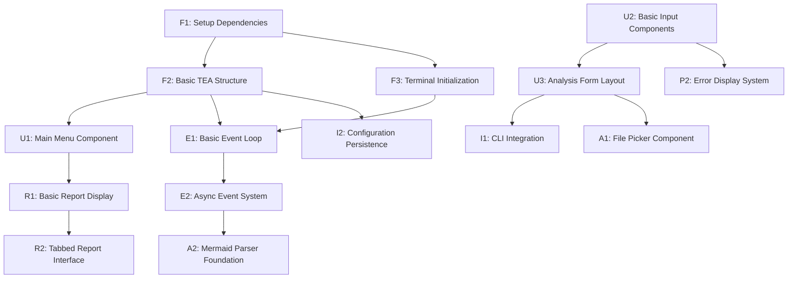

# TUI Implementation Task Assignments

This directory contains detailed task assignments for implementing the Uveddi Terminal User Interface (TUI). Each task is designed to be completed by junior developers with clear deliverables and verification criteria.

## 📋 Task Overview

### Foundation Tasks (Phase 1)
- **[F1: Setup Dependencies](F1-Setup-Dependencies.md)** ⭐⭐☆☆☆
- **[F2: Basic TEA Structure](F2-Basic-TEA-Structure.md)** ⭐⭐⭐☆☆
- **[F3: Terminal Initialization](F3-Terminal-Initialization.md)** ⭐⭐☆☆☆

### Core UI Tasks (Phase 2)
- **[U1: Main Menu Component](U1-Main-Menu-Component.md)** ⭐⭐⭐☆☆
- **[U2: Basic Input Components](U2-Basic-Input-Components.md)** ⭐⭐⭐☆☆
- **[U3: Analysis Form Layout](U3-Analysis-Form-Layout.md)** ⭐⭐⭐⭐☆

### Event Handling Tasks (Phase 3)
- **[E1: Basic Event Loop](E1-Basic-Event-Loop.md)** ⭐⭐⭐☆☆
- **E2: Async Event System** ⭐⭐⭐⭐☆ (Advanced)

### Report Viewer Tasks (Phase 4)
- **R1: Basic Report Display** ⭐⭐⭐☆☆
- **R2: Tabbed Report Interface** ⭐⭐⭐⭐☆

### Integration Tasks (Phase 5)
- **I1: CLI Integration** ⭐⭐⭐☆☆
- **I2: Configuration Persistence** ⭐⭐⭐☆☆

### Polish Tasks (Phase 6)
- **P1: Basic Theming** ⭐⭐☆☆☆
- **P2: Error Display System** ⭐⭐⭐☆☆

### Advanced Features (Phase 7)
- **A1: File Picker Component** ⭐⭐⭐⭐☆
- **A2: Mermaid Parser Foundation** ⭐⭐⭐⭐⭐ (Expert Only)

## 🎯 Assignment Strategy

### For New Junior Developers
**Start with these tasks to build familiarity:**
1. F1: Setup Dependencies
2. F3: Terminal Initialization
3. P1: Basic Theming
4. U1: Main Menu Component

### For Intermediate Junior Developers
**Take on more complex tasks:**
1. F2: Basic TEA Structure
2. U2: Basic Input Components
3. E1: Basic Event Loop
4. R1: Basic Report Display

### For Advanced Junior Developers
**Handle the most complex features:**
1. U3: Analysis Form Layout
2. E2: Async Event System
3. R2: Tabbed Report Interface
4. A1: File Picker Component

### Expert-Level Tasks
**Only assign to experienced developers:**
- A2: Mermaid Parser Foundation (requires parser/compiler background)

## 📝 Task Dependencies

## ✅ Verification Standards

Each task includes:
- **Clear acceptance criteria** with checkboxes
- **Code quality requirements** (tests, documentation, linting)
- **Manual testing procedures** for functionality verification
- **Integration points** with other components
- **Common issues** and troubleshooting guides

## 🔄 Code Review Process

### Before Assignment
- [ ] Task description is clear and specific
- [ ] Acceptance criteria are measurable
- [ ] Code templates/examples are provided
- [ ] Dependencies are documented
- [ ] Time estimate is realistic for skill level

### During Development
- [ ] Code compiles without errors
- [ ] All acceptance criteria are met
- [ ] Code follows Rust best practices
- [ ] Documentation is complete
- [ ] No unwrap() calls (use proper error handling)

### Code Review Checklist
- [ ] Function signatures match specifications
- [ ] Error handling is comprehensive
- [ ] Code is properly tested
- [ ] Performance considerations addressed
- [ ] Integration points work correctly

## 🎨 Design Principles

### User Experience
- **Keyboard-first design** with comprehensive shortcuts
- **Intuitive navigation** with clear visual feedback
- **Helpful error messages** with actionable suggestions
- **Consistent styling** across all components

### Technical Excellence
- **The Elm Architecture** for predictable state management
- **Async-first design** for responsive interactions
- **Component reusability** for maintainable code
- **Comprehensive testing** for reliability

### Performance
- **60fps target** for smooth interactions
- **Minimal screen redraws** for efficiency
- **Non-blocking operations** for responsiveness
- **Memory efficiency** for large codebases

## 📚 Resources

### Essential Documentation
- [ratatui Book](https://ratatui.rs/) - Comprehensive TUI development guide
- [crossterm Docs](https://docs.rs/crossterm/) - Terminal manipulation
- [tokio Guide](https://tokio.rs/tokio/tutorial) - Async programming patterns

### Reference Applications
- [ratatui Examples](https://github.com/ratatui-org/ratatui/tree/main/examples)
- [gitui](https://github.com/extrawurst/gitui) - Professional Git TUI
- [bottom](https://github.com/ClementTsang/bottom) - System monitoring TUI

### Architecture Patterns
- [The Elm Architecture](https://guide.elm-lang.org/architecture/) - TEA pattern guide
- [ratatui async template](https://github.com/ratatui-org/templates) - Async TUI template

## 🏆 Success Metrics

### Completion Criteria
- [ ] All tasks completed with passing tests
- [ ] End-to-end workflow functions correctly
- [ ] Performance targets met (60fps, responsive UI)
- [ ] User experience is intuitive and polished

### Quality Standards
- [ ] Zero compilation warnings or errors
- [ ] Comprehensive test coverage
- [ ] Complete documentation
- [ ] Consistent code style throughout

This structured approach ensures that junior developers can contribute effectively while maintaining high code quality and achieving the vision of an "amazingly awesome" TUI for Uveddi.