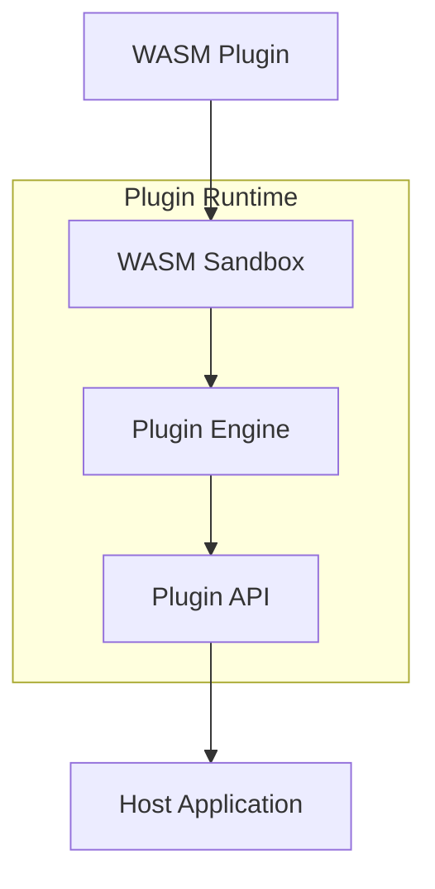

# Plugin Development Guide

This comprehensive guide covers developing WebAssembly plugins for Uveddi's analysis engine. Plugins enable custom analysis detectors that integrate seamlessly with Uveddi's analysis pipeline while running in a secure sandboxed environment.

## Table of Contents

1. [Getting Started](#getting-started)
2. [Plugin Architecture](#plugin-architecture)
3. [Development Setup](#development-setup)
4. [Writing Your First Plugin](#writing-your-first-plugin)
5. [Advanced Plugin Development](#advanced-plugin-development)
6. [Security and Permissions](#security-and-permissions)
7. [Performance Optimization](#performance-optimization)
8. [Testing Plugins](#testing-plugins)
9. [Building and Packaging](#building-and-packaging)
10. [Distribution](#distribution)
11. [Best Practices](#best-practices)
12. [Troubleshooting](#troubleshooting)

## Getting Started

### Prerequisites

- **Rust** (1.70+) - Install from [rustup.rs](https://rustup.rs/)
- **wasm-pack** - Install with:
  ```bash
  curl https://rustwasm.github.io/wasm-pack/installer/init.sh -sSf | sh
  ```
- **Optional**: `wasm-opt` for optimization:
  ```bash
  # macOS
  brew install binaryen
  
  # Ubuntu/Debian
  sudo apt-get install binaryen
  ```

### Quick Start

#### 1. Generate Plugin Template

```bash
# Generate a new plugin from template
scripts/generate-plugin.py my-analyzer

# This creates:
plugins/my-analyzer/
├── Cargo.toml          # Rust project configuration
├── Makefile           # Build automation
├── README.md          # Plugin documentation
├── build.rs           # Custom build scripts
├── plugin.toml        # Plugin manifest
└── src/
    └── lib.rs         # Plugin implementation
```

#### 2. Plugin Manifest Configuration

```toml
# plugin.toml
[plugin]
name = "my-analyzer"
version = "1.0.0"
description = "Custom analysis plugin for detecting TODO comments"
author = "Your Name <your.email@example.com>"
license = "MIT"
homepage = "https://github.com/yourname/my-analyzer"
repository = "https://github.com/yourname/my-analyzer"

[capabilities]
# Security permissions required by the plugin
permissions = ["ConfigRead", "Logging"]

# Resource limits
max_memory_mb = 32
max_execution_seconds = 30
fuel_limit = 2000000

# Performance settings
enable_caching = true
cache_ttl_seconds = 3600

[dependencies]
# Minimum Uveddi version required
min_uveddi_version = "0.9.0"

# Required host functions
requires_tree_sitter = false
requires_database_access = false
requires_network_access = false

# Supported file types and languages
supported_languages = ["rust", "python", "javascript", "typescript"]
supported_extensions = [".rs", ".py", ".js", ".ts", ".jsx", ".tsx"]

[detection]
# Types of issues this plugin can detect
anti_pattern_types = ["CODE_SMELL", "MAINTAINABILITY"]
issue_categories = ["TODO_COMMENTS", "CODE_QUALITY"]
severity_levels = ["INFO", "WARNING", "ERROR"]

[integration]
# Integration settings
run_in_parallel = true
depends_on_plugins = []
conflicts_with_plugins = []
priority = 100  # Higher numbers run first
```

## Plugin Architecture

### Core Components



### Plugin Types

1. **Detector Plugins**: Custom code analysis and pattern detection
2. **Rule Engine Plugins**: Organization-specific rules and policies
3. **AI-Powered Plugins**: Intelligent code review and quality analysis
4. **Metrics Plugins**: Advanced code metrics and visualization
5. **Knowledge Plugins**: Domain-specific knowledge and anti-patterns

## Development Setup

### Project Structure

```
my-plugin/
├── Cargo.toml          # Rust project configuration
├── src/
│   ├── lib.rs         # Main plugin implementation
│   └── detector.rs    # Detection logic
├── plugin.toml        # Plugin manifest
├── tests/
│   └── integration.rs # Integration tests
├── examples/          # Usage examples
├── README.md          # Documentation
└── Makefile          # Build scripts
```

### Basic Plugin Implementation

```rust
// src/lib.rs
use serde::{Deserialize, Serialize};

#[derive(Deserialize)]
pub struct PluginFileInput {
    pub file_path: String,
    pub content: String,
    pub language: String,
}

#[derive(Serialize)]
pub struct PluginIssue {
    pub issue_type: String,
    pub severity: String,
    pub message: String,
    pub file_path: String,
    pub line_number: Option<u32>,
    pub column: Option<u32>,
    pub suggestion: Option<String>,
}

#[derive(Serialize)]
pub struct PluginAnalysisResult {
    pub plugin_name: String,
    pub issues: Vec<PluginIssue>,
    pub metadata: std::collections::HashMap<String, String>,
}

#[export_name = "analyze_file"]
pub fn analyze_file(file_data: &[u8]) -> Vec<u8> {
    // Deserialize input
    let input: PluginFileInput = match serde_json::from_slice(file_data) {
        Ok(input) => input,
        Err(e) => {
            let error_result = PluginAnalysisResult {
                plugin_name: "my-analyzer".to_string(),
                issues: vec![],
                metadata: [("error".to_string(), e.to_string())].into(),
            };
            return serde_json::to_vec(&error_result).unwrap_or_default();
        }
    };

    // Perform analysis
    let mut issues = Vec::new();
    
    // Example: Check for TODO comments
    for (line_num, line) in input.content.lines().enumerate() {
        if line.to_lowercase().contains("todo") {
            issues.push(PluginIssue {
                issue_type: "TODO_COMMENT".to_string(),
                severity: "INFO".to_string(),
                message: "TODO comment found".to_string(),
                file_path: input.file_path.clone(),
                line_number: Some(line_num as u32 + 1),
                column: Some(line.find("TODO").unwrap_or(0) as u32),
                suggestion: Some("Consider creating a proper issue for this TODO".to_string()),
            });
        }
    }

    let result = PluginAnalysisResult {
        plugin_name: "my-analyzer".to_string(),
        issues,
        metadata: [("analyzed_lines".to_string(), input.content.lines().count().to_string())].into(),
    };

    serde_json::to_vec(&result).unwrap_or_default()
}

#[export_name = "get_plugin_info"]
pub fn get_plugin_info() -> Vec<u8> {
    let info = serde_json::json!({
        "name": "my-analyzer",
        "version": "1.0.0",
        "description": "Example plugin for demonstration",
        "supported_languages": ["rust", "python", "javascript", "typescript"],
        "capabilities": ["static_analysis"]
    });
    
    serde_json::to_vec(&info).unwrap_or_default()
}
```

## Advanced Plugin Development

### Using Host Functions

Plugins can access Uveddi's core services through host functions:

```rust
// Host function bindings
extern "C" {
    fn host_parse_ast(code_ptr: *const u8, code_len: usize, lang_ptr: *const u8, lang_len: usize) -> u64;
    fn host_log_message(level: u32, msg_ptr: *const u8, msg_len: usize);
    fn host_get_config(key_ptr: *const u8, key_len: usize) -> u64;
}

// Wrapper functions for easier use
pub fn parse_ast(code: &str, language: &str) -> Option<String> {
    unsafe {
        let handle = host_parse_ast(
            code.as_ptr(), code.len(),
            language.as_ptr(), language.len()
        );
        // Handle result extraction (simplified)
        if handle != 0 {
            Some("parsed_ast_data".to_string())
        } else {
            None
        }
    }
}

pub fn log_info(message: &str) {
    unsafe {
        host_log_message(1, message.as_ptr(), message.len());
    }
}

pub fn get_config_value(key: &str) -> Option<String> {
    unsafe {
        let handle = host_get_config(key.as_ptr(), key.len());
        if handle != 0 {
            Some("config_value".to_string())
        } else {
            None
        }
    }
}
```

### Tree-Sitter Integration

For advanced AST analysis, plugins can use tree-sitter through host functions:

```rust
pub fn analyze_with_tree_sitter(content: &str, language: &str) -> Vec<PluginIssue> {
    let mut issues = Vec::new();
    
    // Parse AST using host function
    if let Some(ast_json) = parse_ast(content, language) {
        // Query for specific patterns
        let query = match language {
            "rust" => "(function_item name: (identifier) @func-name)",
            "python" => "(function_definition name: (identifier) @func-name)",
            "javascript" | "typescript" => "(function_declaration name: (identifier) @func-name)",
            _ => return issues,
        };
        
        // Execute tree-sitter query through host function
        if let Some(matches) = execute_query(&ast_json, query) {
            // Process query results
            for match_data in matches {
                if is_problematic_function(&match_data) {
                    issues.push(PluginIssue {
                        issue_type: "COMPLEX_FUNCTION".to_string(),
                        severity: "WARNING".to_string(),
                        message: "Function complexity is too high".to_string(),
                        file_path: "current_file".to_string(),
                        line_number: match_data.line,
                        column: match_data.column,
                        suggestion: Some("Consider breaking this function into smaller parts".to_string()),
                    });
                }
            }
        }
    }
    
    issues
}
```

### Plugin Configuration

```rust
use serde::{Deserialize, Serialize};

#[derive(Deserialize, Serialize)]
struct PluginConfig {
    threshold: f64,
    ignore_patterns: Vec<String>,
    max_issues_per_file: usize,
    enable_suggestions: bool,
}

impl Default for PluginConfig {
    fn default() -> Self {
        Self {
            threshold: 0.8,
            ignore_patterns: vec!["test".to_string(), "vendor".to_string()],
            max_issues_per_file: 50,
            enable_suggestions: true,
        }
    }
}

pub fn load_config() -> PluginConfig {
    // Try to load from host configuration
    if let Some(config_json) = get_config_value("my_analyzer.config") {
        serde_json::from_str(&config_json).unwrap_or_default()
    } else {
        PluginConfig::default()
    }
}
```

## Security and Permissions

### Capability-Based Security Model

Uveddi uses a capability-based security model where plugins must explicitly declare required permissions:

```rust
pub enum Permission {
    // File system access
    FileRead(PathBuf),          // Read specific files or directories
    FileWrite(PathBuf),         // Write to specific files or directories
    TempFileCreate,             // Create temporary files in sandboxed directory
    
    // Network access  
    NetworkConnect(String),     // Connect to specific URLs or domains
    NetworkListen(u16),         // Listen on specific ports (rarely granted)
    
    // Configuration access
    ConfigRead,                 // Read project configuration
    ConfigWrite,                // Modify project configuration
    
    // System interaction
    EnvRead(String),           // Read specific environment variables
    ProcessSpawn(String),       // Execute specific external commands
    
    // Uveddi services
    Logging,                   // Write to log output
    DatabaseRead,              // Read from analysis database
    DatabaseWrite,             // Write to analysis database
    
    // Advanced features
    PluginCommunication,       // Communicate with other plugins
    HostFunctionCall(String),  // Call additional host functions
}
```

### Security Best Practices

1. **Minimal Permissions**: Request only the minimum permissions required for functionality
2. **Input Validation**: Validate all inputs thoroughly before processing
3. **Output Sanitization**: Sanitize all outputs to prevent injection attacks
4. **Error Handling**: Implement comprehensive error handling without leaking sensitive information
5. **Resource Management**: Implement efficient resource usage and cleanup
6. **Secure Dependencies**: Use only necessary dependencies and keep them updated
7. **Testing**: Include security-focused testing in your test suite

### Input Validation Example

```rust
const MAX_FILE_SIZE: usize = 10 * 1024 * 1024; // 10MB
const MAX_CONTENT_LENGTH: usize = 1024 * 1024; // 1MB
const ALLOWED_LANGUAGES: &[&str] = &["rust", "python", "javascript", "typescript"];

pub fn validate_input(input: &PluginFileInput) -> Result<(), String> {
    // Check file path
    if input.file_path.is_empty() || input.file_path.len() > 1000 {
        return Err("Invalid file path".to_string());
    }
    
    // Prevent path traversal
    if input.file_path.contains("..") || input.file_path.contains("//") {
        return Err("Path traversal detected".to_string());
    }
    
    // Check content size
    if input.content.len() > MAX_CONTENT_LENGTH {
        return Err("Content too large".to_string());
    }
    
    // Validate language
    if !ALLOWED_LANGUAGES.contains(&input.language.as_str()) {
        return Err(format!("Unsupported language: {}", input.language));
    }
    
    // Check for null bytes
    if input.content.contains('\0') || input.file_path.contains('\0') {
        return Err("Null bytes not allowed".to_string());
    }
    
    Ok(())
}
```

## Performance Optimization

### Memory Management

```rust
// Efficient memory usage patterns
use std::collections::HashMap;

pub struct EfficientAnalyzer {
    issue_cache: HashMap<String, Vec<PluginIssue>>,
    pattern_cache: Vec<regex::Regex>,
}

impl EfficientAnalyzer {
    pub fn new() -> Self {
        Self {
            issue_cache: HashMap::with_capacity(100),
            pattern_cache: Vec::with_capacity(10),
        }
    }
    
    pub fn analyze_efficiently(&mut self, input: &PluginFileInput) -> Vec<PluginIssue> {
        // Check cache first
        if let Some(cached) = self.issue_cache.get(&input.file_path) {
            return cached.clone();
        }
        
        let mut issues = Vec::with_capacity(20); // Pre-allocate
        
        // Process in chunks to manage memory
        let chunk_size = 1000;
        for chunk in input.content.lines().collect::<Vec<_>>().chunks(chunk_size) {
            for (local_line_num, line) in chunk.iter().enumerate() {
                // Process line efficiently
                if let Some(issue) = self.check_line_fast(line, local_line_num) {
                    issues.push(issue);
                }
            }
        }
        
        // Cache results
        self.issue_cache.insert(input.file_path.clone(), issues.clone());
        issues
    }
}
```

### Performance Requirements

- **Initialization**: < 1000ms
- **Analysis**: < 100ms per file
- **Memory Usage**: < 100MB per plugin
- **Integration Impact**: < 10% overhead on core system

## Testing Plugins

### Unit Testing

```rust
#[cfg(test)]
mod tests {
    use super::*;
    
    #[test]
    fn test_analyze_file_with_todos() {
        let input = PluginFileInput {
            file_path: "test.rs".to_string(),
            content: "// TODO: Fix this\nfn main() {}".to_string(),
            language: "rust".to_string(),
        };
        
        let input_bytes = serde_json::to_vec(&input).unwrap();
        let result_bytes = analyze_file(&input_bytes);
        
        let result: PluginAnalysisResult = serde_json::from_slice(&result_bytes).unwrap();
        
        assert_eq!(result.plugin_name, "my-analyzer");
        assert_eq!(result.issues.len(), 1);
        assert_eq!(result.issues[0].issue_type, "TODO_COMMENT");
        assert_eq!(result.issues[0].line_number, Some(1));
    }
    
    #[test]
    fn test_plugin_info() {
        let info_bytes = get_plugin_info();
        let info: serde_json::Value = serde_json::from_slice(&info_bytes).unwrap();
        
        assert_eq!(info["name"], "my-analyzer");
        assert_eq!(info["version"], "1.0.0");
        assert!(info["supported_languages"].as_array().unwrap().contains(&"rust".into()));
    }
    
    #[test]
    fn test_config_loading() {
        let config = PluginConfig::default();
        assert_eq!(config.threshold, 0.8);
        assert!(config.enable_suggestions);
    }
}
```

### Integration Testing

```bash
#!/bin/bash
# test-plugin.sh

set -e

echo "Building plugin..."
cargo build --release --target wasm32-wasi

echo "Installing plugin..."
uveddi plugin install target/wasm32-wasi/release/my_analyzer.wasm

echo "Testing plugin functionality..."
uveddi plugin test my-analyzer --test-file test-data/sample.rs --verbose

echo "Running analysis with plugin..."
uveddi analyze test-data/ --plugins my-analyzer --output-format json --output test-results.json

echo "Verifying results..."
if jq -e '.issues[] | select(.detector == "my-analyzer")' test-results.json > /dev/null; then
    echo "✅ Plugin integration successful"
else
    echo "❌ Plugin integration failed"
    exit 1
fi
```

## Building and Packaging

### Build Configuration

```toml
# Cargo.toml
[package]
name = "my-uveddi-plugin"
version = "1.0.0"
edition = "2021"

[lib]
crate-type = ["cdylib"]

[dependencies]
wasm-bindgen = "0.2"
serde = { version = "1.0", features = ["derive"] }
serde_json = "1.0"
uveddi-plugin-api = "0.9"

[profile.release]
opt-level = "z"     # Optimize for size
lto = true
codegen-units = 1
```

### Build Process

```bash
# Build the plugin
wasm-pack build --target web --out-dir pkg

# Optimize the WASM file
wasm-opt -Oz pkg/my_plugin_bg.wasm -o pkg/my_plugin_opt.wasm

# Package for distribution
zip -r my-plugin.zip pkg/ plugin.toml README.md
```

### Makefile

```makefile
.PHONY: build test install clean release

# Development build
build:
	cargo build --target wasm32-wasi

# Optimized production build
release:
	cargo build --release --target wasm32-wasi
	wasm-strip target/wasm32-wasi/release/$(PLUGIN_NAME).wasm
	wasm-opt -Os target/wasm32-wasi/release/$(PLUGIN_NAME).wasm -o target/wasm32-wasi/release/$(PLUGIN_NAME).optimized.wasm

# Run tests
test:
	cargo test
	./test-plugin.sh

# Install plugin locally
install: release
	uveddi plugin install target/wasm32-wasi/release/$(PLUGIN_NAME).optimized.wasm

# Clean build artifacts
clean:
	cargo clean
	rm -f test-results.json

PLUGIN_NAME := my_analyzer
VERSION := $(shell grep '^version' Cargo.toml | sed 's/version = "\(.*\)"/\1/')
```

## Distribution

### Publishing to Registry

```bash
# Login to plugin registry
uveddi plugin login

# Publish plugin
uveddi plugin publish ./my-plugin.zip

# Plugin will be available at:
# https://plugins.uveddi.io/my-plugin
```

### Manual Installation

```bash
# Install from local file
uveddi plugin install ./my-plugin.wasm

# Install from URL
uveddi plugin install https://example.com/my-plugin.wasm

# Install from registry
uveddi plugin install registry:my-plugin@1.0.0
```

## Best Practices

### Code Quality
- ✅ Use proper error handling with Result types
- ✅ Implement comprehensive input validation
- ✅ Add detailed logging and diagnostics
- ✅ Write extensive unit and integration tests
- ✅ Follow Rust idioms and conventions

### Security
- ✅ Validate all inputs thoroughly
- ✅ Sanitize all outputs
- ✅ Use minimal required permissions
- ✅ Implement resource limits
- ✅ Avoid unsafe operations when possible

### Performance
- ✅ Pre-allocate collections when size is known
- ✅ Use efficient data structures
- ✅ Implement caching for repeated operations
- ✅ Process data in batches for large files
- ✅ Monitor memory usage and optimize

### Integration
- ✅ Follow Uveddi's plugin interface exactly
- ✅ Use consistent error reporting patterns
- ✅ Provide meaningful metadata
- ✅ Implement proper plugin information
- ✅ Test with real-world codebases

### Maintenance
- ✅ Keep dependencies up to date
- ✅ Version your plugin releases
- ✅ Maintain comprehensive documentation
- ✅ Provide migration guides for updates
- ✅ Monitor plugin performance in production

## Troubleshooting

### Common Issues

| Issue | Cause | Solution |
|-------|-------|----------|
| Plugin fails to load | Invalid WASM binary | Check build target is `wasm32-wasi` |
| `analyze_file` not found | Missing export name | Add `#[export_name = "analyze_file"]` |
| Deserialization errors | Mismatched data structures | Ensure input/output structures match Uveddi's expectations |
| Memory allocation failures | Too much memory usage | Implement efficient memory management |
| Host function errors | Incorrect function signatures | Check host function bindings match Uveddi's API |
| Permission denied | Insufficient plugin permissions | Update plugin manifest with required permissions |

### Debug Logging

```rust
// Enable debug logging
#[wasm_bindgen]
impl Plugin {
    pub fn debug_analyze(&self, code: &str) {
        log_debug(&format!("Starting analysis of {} bytes", code.len()));
        
        let start = js_sys::Date::now();
        let result = self.analyze(code, "rust");
        let duration = js_sys::Date::now() - start;
        
        log_info(&format!("Analysis completed in {}ms", duration));
        log_debug(&format!("Found {} issues", result.issues.len()));
    }
}
```

### Performance Issues

```bash
# Profile plugin performance
uveddi plugin profile my-plugin ./test_data

# Optimize WASM size
wasm-opt -O3 plugin.wasm -o plugin_opt.wasm

# Monitor memory usage
uveddi plugin monitor --duration 60s
```

## Resources

- [Plugin API Reference](api-reference.md)
- [Plugin Examples](examples.md)
- [Plugin Registry](https://plugins.uveddi.io)
- [WebAssembly MDN Docs](https://developer.mozilla.org/en-US/docs/WebAssembly)
- [wasm-bindgen Book](https://rustwasm.github.io/wasm-bindgen/)
- [Tree-sitter Documentation](https://tree-sitter.github.io/tree-sitter/)

## Support

### Getting Help
- GitHub Issues: [github.com/botzrDev/uveddi/issues](https://github.com/botzrDev/uveddi/issues)
- Discord Community: [discord.gg/uveddi](https://discord.gg/uveddi)
- Documentation: [docs.uveddi.io](https://docs.uveddi.io)

### Contributing
- Submit plugins to the community registry
- Help improve plugin documentation
- Contribute to plugin development tools
- Share examples and tutorials

This guide provides a comprehensive foundation for developing high-quality WASM plugins for Uveddi's analysis engine.