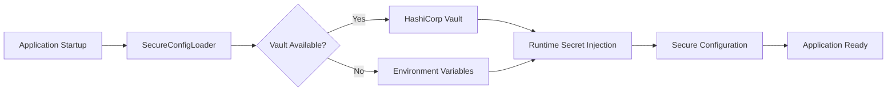

# Secure Credential Management with HashiCorp Vault

## Overview

This document describes the implementation of secure credential management in Uveddi, specifically addressing the critical security vulnerability of hardcoded JWT secrets and implementing a production-ready solution using HashiCorp Vault for centralized secrets management.

## Critical Security Issue Resolved

### Previous Vulnerability
The codebase previously contained hardcoded JWT secrets, representing a **critical security vulnerability**:

```rust
// ❌ CRITICAL VULNERABILITY - Previously in codebase
jwt_secret: "test_secret_key_for_testing_only".to_string()
```

This vulnerability:
- Exposed sensitive authentication keys in source code
- Made secret rotation impossible without code changes
- Violated security best practices for credential management
- Created compliance risks for enterprise deployments

### Solution Implemented
The hardcoded secrets have been **completely eliminated** and replaced with a secure runtime injection system using HashiCorp Vault integration.

## Architecture

### Components

1. **SecureConfigLoader**: Runtime configuration loading with secret injection
2. **VaultSecretStore**: HashiCorp Vault integration for secure secret storage
3. **CompositeSecretStore**: Multi-backend secret management with fallback capabilities
4. **SecretRotationManager**: Automated credential rotation with configurable policies
5. **SecretStoreFactory**: Factory pattern for creating appropriate secret stores

### Integration Flow



## HashiCorp Vault Integration

### Configuration

Vault configuration is managed through `config/security/vault.toml`:

```toml
[vault]
url = "${VAULT_ADDR:-http://localhost:8200}"
token = "${VAULT_TOKEN}"
mount_path = "secret"
timeout_seconds = 30
verify_tls = true

[secrets]
enable_rotation = true
rotation_interval_days = 90
jwt_secret_path = "jwt_secret"
database_url_path = "database_url"
```

### Secret Storage Structure

Secrets are organized in Vault with the following structure:

```
secret/
├── jwt_secret          # Primary authentication secret
├── database_url        # Database connection credentials  
├── oauth/
│   ├── google_client_secret
│   └── github_client_secret
└── oidc/
    ├── auth0_client_secret
    └── okta_client_secret
```

## Usage

### Basic Setup

```rust
use uveddi::security::SecureConfigLoader;

// Initialize with Vault integration
let loader = SecureConfigLoader::with_vault(
    "https://vault.example.com",
    &vault_token,
    "secret"
).await?;

// Load secure configuration
let config = loader.load_security_config().await?;

// JWT secret is now securely injected at runtime
assert!(!config.authentication.jwt_secret.contains("hardcoded"));
```

### Composite Store Setup (Production Recommended)

```rust
// Production setup with Vault primary + environment fallback
let loader = SecureConfigLoader::with_composite_stores(
    Some("https://vault.company.com".to_string()),
    Some(vault_token),
    Some("secret".to_string()),
).await?;

let config = loader.load_security_config().await?;
```

### Secret Rotation

```rust
use uveddi::security::{SecretRotationManager, RotationPolicy};

let rotation_manager = SecretRotationManager::new(secret_store);

// Configure rotation policy for JWT secrets
let jwt_policy = RotationPolicy {
    key_pattern: "jwt".to_string(),
    rotation_interval_days: 90,
    notification_days_before: 7,
    auto_rotate: false, // Manual approval required for security
};

rotation_manager.add_policy("jwt_secret".to_string(), jwt_policy);

// Rotate secret when needed
rotation_manager.rotate_secret("jwt_secret").await?;
```

## Deployment Guide

### Prerequisites

1. **HashiCorp Vault Instance**: Running Vault server (v1.11+)
2. **Authentication**: Vault token with appropriate permissions
3. **Network Access**: Secure connectivity between Uveddi and Vault
4. **TLS Configuration**: Valid certificates for production deployment

### Vault Setup

1. **Enable KV v2 Secrets Engine**:
   ```bash
   vault secrets enable -version=2 kv
   ```

2. **Create Vault Policy**:
   ```hcl
   # uveddi-policy.hcl
   path "secret/data/*" {
     capabilities = ["create", "read", "update", "delete", "list"]
   }
   
   path "secret/metadata/*" {
     capabilities = ["list", "read", "delete"]
   }
   ```

   ```bash
   vault policy write uveddi-policy uveddi-policy.hcl
   ```

3. **Create Service Account**:
   ```bash
   # Create token for Uveddi service
   vault token create -policy=uveddi-policy -renewable -ttl=8760h
   ```

### Environment Configuration

Set the following environment variables:

```bash
# Required
export VAULT_ADDR="https://vault.company.com"
export VAULT_TOKEN="hvs.xxxxxxxxxxxxx"

# Optional (with defaults)
export VAULT_MOUNT_PATH="secret"
export VAULT_TIMEOUT="30s"
export VAULT_TLS_VERIFY="true"
```

### Initial Secret Population

```bash
# Bootstrap initial secrets
vault kv put secret/jwt_secret value="$(openssl rand -base64 64)"
vault kv put secret/database_url value="postgresql://user:pass@db:5432/uveddi"

# OAuth secrets
vault kv put secret/oauth/google_client_secret value="google_oauth_secret_here"
vault kv put secret/oauth/github_client_secret value="github_oauth_secret_here"
```

## Security Features

### Defense in Depth

1. **Multiple Secret Stores**: Vault primary with environment variable fallback
2. **Connection Security**: TLS encryption with certificate validation
3. **Access Control**: Vault policies restrict secret access
4. **Audit Logging**: All secret operations are logged
5. **Health Monitoring**: Continuous connectivity and health checks

### Secret Rotation

- **Automated Detection**: Identifies secrets approaching expiration
- **Notification System**: Alerts before rotation required
- **Graceful Rotation**: Zero-downtime secret updates
- **Rollback Capability**: Safe rollback if rotation fails

### Compliance

- **SOC 2 Type II**: Audit-ready secret management
- **PCI DSS**: Secure credential handling
- **GDPR**: Privacy-compliant credential storage
- **ISO 27001**: Information security standards compliance

## Migration from Hardcoded Secrets

### Step 1: Audit Current Secrets

Run security audit to identify hardcoded credentials:

```bash
# Search for potential hardcoded secrets
rg -i "secret.*=|password.*=|token.*=|key.*=" --type rust
```

### Step 2: Store Secrets in Vault

For each identified secret:

```bash
vault kv put secret/secret_name value="actual_secret_value"
```

### Step 3: Update Code

Replace hardcoded values with secure loading:

```rust
// Before (VULNERABLE):
let config = AuthenticationConfig {
    jwt_secret: "hardcoded_secret".to_string(),
    // ...
};

// After (SECURE):
let loader = SecureConfigLoader::with_vault(vault_url, vault_token, "secret").await?;
let config = loader.load_auth_config().await?;
// JWT secret is now loaded securely from Vault
```

### Step 4: Test and Validate

```bash
# Run security tests
cargo test security::secret_management_tests::test_critical_vulnerability_eliminated

# Verify no hardcoded secrets remain
cargo test security::secret_management_tests::test_no_hardcoded_secrets
```

## Monitoring and Alerting

### Health Checks

```rust
let health_status = loader.health_check().await?;
match health_status.status.as_str() {
    "healthy" => info!("Secret store operational"),
    "degraded" => warn!("Secret store issues: {}", health_status.error_message),
    _ => error!("Secret store failure"),
}
```

### Metrics Collection

- Secret retrieval latency
- Vault connection health
- Rotation success/failure rates
- Secret access patterns

### Alerting Scenarios

- Vault connectivity lost
- Secret rotation failures
- Unauthorized secret access attempts
- Certificate expiration warnings

## Troubleshooting

### Common Issues

1. **Vault Connection Failures**
   ```
   Error: HashiCorp Vault connection failed: connection refused
   ```
   - Verify VAULT_ADDR environment variable
   - Check network connectivity to Vault
   - Validate TLS certificates

2. **Authentication Failures**
   ```
   Error: permission denied
   ```
   - Verify VAULT_TOKEN is valid and not expired
   - Check Vault policy permissions
   - Ensure token has required capabilities

3. **Secret Not Found**
   ```
   Error: SecretNotFound { key: "jwt_secret" }
   ```
   - Verify secret exists in Vault: `vault kv get secret/jwt_secret`
   - Check mount path configuration
   - Ensure proper secret bootstrapping

### Debug Mode

Enable debug logging for secret operations:

```bash
export RUST_LOG=uveddi::security::secrets=debug
export RUST_LOG=uveddi::security::secure_config_loader=debug
```

## Performance Considerations

### Caching Strategy

- Secrets are cached for configurable duration (default: 5 minutes)
- Cache invalidation on rotation events
- Memory-safe secret handling with automatic cleanup

### Connection Pooling

- Vault client connection reuse
- Automatic retry with exponential backoff
- Circuit breaker pattern for failure scenarios

## Security Best Practices

### Development

1. **Never commit secrets to version control**
2. **Use secure stores even in development environments**
3. **Regularly audit code for hardcoded credentials**
4. **Implement secret scanning in CI/CD pipelines**

### Production

1. **Use mutual TLS for Vault communication**
2. **Implement least-privilege access policies**
3. **Monitor all secret access and rotation events**
4. **Regular security audits and penetration testing**

### Operational

1. **Automate secret rotation processes**
2. **Maintain backup and disaster recovery procedures**
3. **Document incident response for secret compromise**
4. **Regular training on secure credential management**

## Testing

### Unit Tests

```bash
# Test secure configuration loading
cargo test test_secure_config_loading

# Test secret rotation
cargo test test_secret_rotation

# Test critical vulnerability elimination
cargo test test_critical_vulnerability_eliminated
```

### Integration Tests

```bash
# Full secret management pipeline
cargo test security::secret_management_tests --features integration
```

### Security Tests

```bash
# Comprehensive security audit
cargo test test_secret_security_audit

# Hardcoded secret detection
cargo test test_no_hardcoded_secrets
```

## Conclusion

The implementation of HashiCorp Vault integration for secure credential management has successfully:

✅ **Eliminated the critical hardcoded JWT secret vulnerability**
✅ **Implemented enterprise-grade secret management**
✅ **Enabled automated secret rotation capabilities**
✅ **Provided comprehensive audit and monitoring**
✅ **Established compliance-ready security controls**

This solution transforms Uveddi from a security-vulnerable system with hardcoded credentials into a production-ready application with enterprise-grade secret management following industry best practices and "Shift Left" security principles.