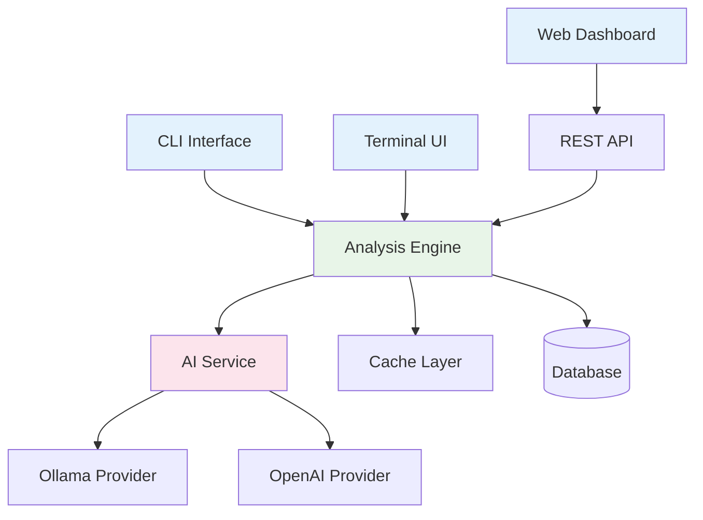

# Uveddi Documentation

Welcome to the comprehensive documentation for Uveddi, an AI-powered static code analysis platform designed to identify architectural anti-patterns, prevent architectural drift, and provide intelligent insights with privacy-focused local analysis.

## What is Uveddi?

Uveddi is a Rust-based CLI tool that combines traditional static code analysis with modern AI capabilities to help developers and teams:

- **Identify Anti-Patterns**: Detect god objects, dead code, tight coupling, and other architectural issues
- **Prevent Architectural Drift**: Monitor and maintain architectural principles over time  
- **AI-Powered Insights**: Get intelligent explanations and refactoring suggestions
- **Multi-Language Support**: Analyze Rust, Python, JavaScript, TypeScript, and more
- **Privacy-Focused**: All analysis happens locally by default with optional cloud AI
- **Enterprise-Ready**: Comprehensive monitoring, RBAC, and scalability features

## Key Features

### 🔍 **Comprehensive Analysis**
- Multi-language AST parsing with Tree-sitter
- 10+ built-in anti-pattern detectors
- Custom detector development with WebAssembly plugins
- Dependency graph analysis and visualization

### 🤖 **AI Integration**
- Local AI with Ollama for privacy
- Cloud AI providers (OpenAI, etc.) for advanced features
- Context-aware explanations for detected issues
- Intelligent refactoring suggestions

### 📊 **Rich Reporting**
- Interactive web dashboard
- Multiple export formats (JSON, Markdown, HTML, PDF)
- Mermaid diagram generation
- Real-time analysis progress tracking

### ⚡ **High Performance**
- Multi-threaded analysis engine
- Memory optimization with arena allocation
- Incremental analysis for large codebases
- 4.3M+ metrics/second monitoring capacity

### 🏢 **Enterprise Features**
- Role-Based Access Control (RBAC)
- WebSocket-based real-time monitoring
- Comprehensive metrics and alerting
- Horizontal and vertical scaling support

## Quick Start

### Installation

```bash
# Download and install the latest release
wget "https://github.com/uveddi/uveddi/releases/download/v1.0.0/uveddi-v1.0.0-linux-x86_64.tar.gz"
tar -xzf uveddi-v1.0.0-linux-x86_64.tar.gz
sudo mv uveddi /usr/local/bin/
```

### Basic Analysis

```bash
# Analyze your project
uveddi analyze /path/to/your/project

# Generate a comprehensive report
uveddi analyze /path/to/your/project --output report.html --enable-ai

# Start the interactive dashboard
uveddi --features tui
```

### Configuration

Create a configuration file at `.uveddi/config.toml`:

```toml
[analysis]
languages = ["rust", "python", "javascript"]
detectors = ["god_object", "dead_code", "tight_coupling"]
enable_ai = true

[ai]
provider = "ollama"
model = "llama3.2:latest"

[reporting]
output_format = "html"
include_suggestions = true
```

## Architecture Overview

Uveddi follows a modular, microservices-inspired architecture:



### Core Components

- **Analysis Engine**: Multi-threaded Rust core for parsing and analysis
- **AI Service**: Pluggable AI provider system with fallback strategies
- **Web Dashboard**: React-based interface for analysis management
- **Plugin System**: WebAssembly-based extensibility framework
- **Monitoring System**: Real-time metrics and alerting infrastructure

## Use Cases

### Development Teams
- **Code Reviews**: Automated architectural analysis in pull requests
- **Technical Debt Management**: Track and prioritize architectural improvements
- **Knowledge Transfer**: AI explanations help onboard new team members
- **Refactoring Planning**: Data-driven decisions for code improvements

### Engineering Management
- **Quality Metrics**: Objective code quality measurements and trends
- **Resource Planning**: Identify areas requiring development resources
- **Risk Assessment**: Early detection of architectural degradation
- **Process Improvement**: Data-driven development process optimization

### Enterprise Adoption
- **Compliance**: Ensure adherence to architectural standards
- **Documentation**: Automated documentation of system architecture
- **Training**: Developer education through AI-powered insights
- **Scaling**: Maintain code quality as teams and codebases grow

## Getting Help

### Documentation Structure

This documentation is organized to help you quickly find the information you need:

- **[Getting Started](./01-getting-started/)**: Installation, configuration, and first analysis
- **[User Guide](./02-user-guide/)**: Comprehensive usage instructions and best practices  
- **[API Reference](./03-api-reference/)**: Complete API documentation and examples
- **[Architecture](./04-architecture/)**: System design and architectural decisions
- **[Development](./05-development/)**: Contributing, plugin development, and customization
- **[Operations](./operations/)**: Deployment, monitoring, and maintenance procedures
- **[Community](./09-community/)**: Getting help, contributing, and community resources

### Support Channels

- **GitHub Issues**: Bug reports and feature requests
- **Documentation**: Comprehensive guides and examples  
- **Community Forum**: Discussion and knowledge sharing
- **Enterprise Support**: Professional support for enterprise customers

### Contributing

Uveddi is open source and welcomes contributions:

- **Code**: Bug fixes, features, and improvements
- **Documentation**: Help improve and expand the documentation
- **Testing**: Help test new features and report issues
- **Community**: Help other users and share knowledge

See our [Contributing Guide](./05-development/contributing.md) for details on how to get started.

## What's Next?

Ready to get started? Here are some recommended next steps:

1. **[Install Uveddi](./01-getting-started/installation.md)** on your system
2. **[Run your first analysis](./01-getting-started/first-steps.md)** on a sample project
3. **[Configure Uveddi](./01-getting-started/configuration.md)** for your specific needs
4. **[Explore the dashboard](./user-guides/dashboard-guide.md)** for interactive analysis
5. **[Set up AI integration](./02-user-guide/configuration-options.md)** for enhanced insights

Welcome to the Uveddi community! We're excited to help you improve your code quality and architectural practices.