# Uveddi Architectural Analysis Report

_Generated on 2025-07-30 15:38:18_

## Executive Summary

This report analyzes the codebase at `Unknown` and identified **224 architectural issues** across **19 files**.

- **High Severity**: 0 issues
- **Medium Severity**: 0 issues
- **Low Severity**: 0 issues

The analysis took 0.00 seconds to complete.

## Issues by Severity


## Detailed Analysis

### Unknown (ID: 2)

No description available

#### Issue #1: Potentially dead code: function 'after_this_request' is not used in this file (confidence: 90.0%)

- **File**: `test_repos/flask/src/flask/ctx.py`
- **Severity**: High
- **Location**: Lines 117-117

**Code Snippet**:

```
after_this_request
```


#### Issue #2: Potentially dead code: function 'copy_current_request_context' is not used in this file (confidence: 90.0%)

- **File**: `test_repos/flask/src/flask/ctx.py`
- **Severity**: High
- **Location**: Lines 155-155

**Code Snippet**:

```
copy_current_request_context
```


#### Issue #3: Potentially dead code: function 'wrapper' is not used in this file (confidence: 90.0%)

- **File**: `test_repos/flask/src/flask/ctx.py`
- **Severity**: High
- **Location**: Lines 189-189

**Code Snippet**:

```
wrapper
```


#### Issue #4: Potentially dead code: function 'has_request_context' is not used in this file (confidence: 90.0%)

- **File**: `test_repos/flask/src/flask/ctx.py`
- **Severity**: High
- **Location**: Lines 196-196

**Code Snippet**:

```
has_request_context
```


#### Issue #5: Potentially dead code: function 'has_app_context' is not used in this file (confidence: 90.0%)

- **File**: `test_repos/flask/src/flask/ctx.py`
- **Severity**: High
- **Location**: Lines 228-228

**Code Snippet**:

```
has_app_context
```


#### Issue #6: Potentially dead code: class '_AppCtxGlobals' is not used in this file (confidence: 70.0%)

- **File**: `test_repos/flask/src/flask/ctx.py`
- **Severity**: Medium
- **Location**: Lines 29-29

**Code Snippet**:

```
_AppCtxGlobals
```


#### Issue #7: Potentially dead code: class 'AppContext' is not used in this file (confidence: 90.0%)

- **File**: `test_repos/flask/src/flask/ctx.py`
- **Severity**: High
- **Location**: Lines 238-238

**Code Snippet**:

```
AppContext
```


#### Issue #8: Potentially dead code: class 'RequestContext' is not used in this file (confidence: 90.0%)

- **File**: `test_repos/flask/src/flask/ctx.py`
- **Severity**: High
- **Location**: Lines 287-287

**Code Snippet**:

```
RequestContext
```


#### Issue #9: Potentially dead code: function 'permanent' is not used in this file (confidence: 90.0%)

- **File**: `test_repos/flask/src/flask/sessions.py`
- **Severity**: High
- **Location**: Lines 28-28

**Code Snippet**:

```
permanent
```


#### Issue #10: Potentially dead code: function 'permanent' is not used in this file (confidence: 90.0%)

- **File**: `test_repos/flask/src/flask/sessions.py`
- **Severity**: High
- **Location**: Lines 33-33

**Code Snippet**:

```
permanent
```


#### Issue #11: Potentially dead code: function 'on_update' is not used in this file (confidence: 90.0%)

- **File**: `test_repos/flask/src/flask/sessions.py`
- **Severity**: High
- **Location**: Lines 78-78

**Code Snippet**:

```
on_update
```


#### Issue #12: Potentially dead code: function '_fail' is not used in this file (confidence: 70.0%)

- **File**: `test_repos/flask/src/flask/sessions.py`
- **Severity**: Medium
- **Location**: Lines 103-103

**Code Snippet**:

```
_fail
```


#### Issue #13: Potentially dead code: function 'make_null_session' is not used in this file (confidence: 90.0%)

- **File**: `test_repos/flask/src/flask/sessions.py`
- **Severity**: High
- **Location**: Lines 164-164

**Code Snippet**:

```
make_null_session
```


#### Issue #14: Potentially dead code: function 'is_null_session' is not used in this file (confidence: 90.0%)

- **File**: `test_repos/flask/src/flask/sessions.py`
- **Severity**: High
- **Location**: Lines 176-176

**Code Snippet**:

```
is_null_session
```


#### Issue #15: Potentially dead code: function 'open_session' is not used in this file (confidence: 90.0%)

- **File**: `test_repos/flask/src/flask/sessions.py`
- **Severity**: High
- **Location**: Lines 263-263

**Code Snippet**:

```
open_session
```


#### Issue #16: Potentially dead code: function 'save_session' is not used in this file (confidence: 90.0%)

- **File**: `test_repos/flask/src/flask/sessions.py`
- **Severity**: High
- **Location**: Lines 277-277

**Code Snippet**:

```
save_session
```


#### Issue #17: Potentially dead code: function '_lazy_sha1' is not used in this file (confidence: 70.0%)

- **File**: `test_repos/flask/src/flask/sessions.py`
- **Severity**: Medium
- **Location**: Lines 290-290

**Code Snippet**:

```
_lazy_sha1
```


#### Issue #18: Potentially dead code: function 'open_session' is not used in this file (confidence: 90.0%)

- **File**: `test_repos/flask/src/flask/sessions.py`
- **Severity**: High
- **Location**: Lines 337-337

**Code Snippet**:

```
open_session
```


#### Issue #19: Potentially dead code: function 'save_session' is not used in this file (confidence: 90.0%)

- **File**: `test_repos/flask/src/flask/sessions.py`
- **Severity**: High
- **Location**: Lines 351-351

**Code Snippet**:

```
save_session
```


#### Issue #20: Potentially dead code: class 'SessionMixin' is not used in this file (confidence: 90.0%)

- **File**: `test_repos/flask/src/flask/sessions.py`
- **Severity**: High
- **Location**: Lines 24-24

**Code Snippet**:

```
SessionMixin
```


#### Issue #21: Potentially dead code: class 'SecureCookieSession' is not used in this file (confidence: 90.0%)

- **File**: `test_repos/flask/src/flask/sessions.py`
- **Severity**: High
- **Location**: Lines 52-52

**Code Snippet**:

```
SecureCookieSession
```


#### Issue #22: Potentially dead code: class 'NullSession' is not used in this file (confidence: 90.0%)

- **File**: `test_repos/flask/src/flask/sessions.py`
- **Severity**: High
- **Location**: Lines 97-97

**Code Snippet**:

```
NullSession
```


#### Issue #23: Potentially dead code: class 'SessionInterface' is not used in this file (confidence: 90.0%)

- **File**: `test_repos/flask/src/flask/sessions.py`
- **Severity**: High
- **Location**: Lines 114-114

**Code Snippet**:

```
SessionInterface
```


#### Issue #24: Potentially dead code: class 'SecureCookieSessionInterface' is not used in this file (confidence: 90.0%)

- **File**: `test_repos/flask/src/flask/sessions.py`
- **Severity**: High
- **Location**: Lines 298-298

**Code Snippet**:

```
SecureCookieSessionInterface
```


#### Issue #25: Potentially dead code: function 'attach_enctype_error_multidict' is not used in this file (confidence: 90.0%)

- **File**: `test_repos/flask/src/flask/debughelpers.py`
- **Severity**: High
- **Location**: Lines 81-81

**Code Snippet**:

```
attach_enctype_error_multidict
```


#### Issue #26: Potentially dead code: function 'explain_template_loading_attempts' is not used in this file (confidence: 90.0%)

- **File**: `test_repos/flask/src/flask/debughelpers.py`
- **Severity**: High
- **Location**: Lines 124-124

**Code Snippet**:

```
explain_template_loading_attempts
```


#### Issue #27: Potentially dead code: class 'UnexpectedUnicodeError' is not used in this file (confidence: 90.0%)

- **File**: `test_repos/flask/src/flask/debughelpers.py`
- **Severity**: High
- **Location**: Lines 17-17

**Code Snippet**:

```
UnexpectedUnicodeError
```


#### Issue #28: Potentially dead code: class 'FormDataRoutingRedirect' is not used in this file (confidence: 90.0%)

- **File**: `test_repos/flask/src/flask/debughelpers.py`
- **Severity**: High
- **Location**: Lines 50-50

**Code Snippet**:

```
FormDataRoutingRedirect
```


#### Issue #29: Potentially dead code: class 'newcls' is not used in this file (confidence: 90.0%)

- **File**: `test_repos/flask/src/flask/debughelpers.py`
- **Severity**: High
- **Location**: Lines 90-90

**Code Snippet**:

```
newcls
```


#### Issue #30: Potentially dead code: function 'dump' is not used in this file (confidence: 90.0%)

- **File**: `test_repos/flask/src/flask/json/provider.py`
- **Severity**: High
- **Location**: Lines 49-49

**Code Snippet**:

```
dump
```


#### Issue #31: Potentially dead code: function 'load' is not used in this file (confidence: 90.0%)

- **File**: `test_repos/flask/src/flask/json/provider.py`
- **Severity**: High
- **Location**: Lines 67-67

**Code Snippet**:

```
load
```


#### Issue #32: Potentially dead code: function 'response' is not used in this file (confidence: 90.0%)

- **File**: `test_repos/flask/src/flask/json/provider.py`
- **Severity**: High
- **Location**: Lines 89-89

**Code Snippet**:

```
response
```


#### Issue #33: Potentially dead code: function '_default' is not used in this file (confidence: 70.0%)

- **File**: `test_repos/flask/src/flask/json/provider.py`
- **Severity**: Medium
- **Location**: Lines 108-108

**Code Snippet**:

```
_default
```


#### Issue #34: Potentially dead code: function 'response' is not used in this file (confidence: 90.0%)

- **File**: `test_repos/flask/src/flask/json/provider.py`
- **Severity**: High
- **Location**: Lines 189-189

**Code Snippet**:

```
response
```


#### Issue #35: Potentially dead code: class 'JSONProvider' is not used in this file (confidence: 90.0%)

- **File**: `test_repos/flask/src/flask/json/provider.py`
- **Severity**: High
- **Location**: Lines 19-19

**Code Snippet**:

```
JSONProvider
```


#### Issue #36: Potentially dead code: class 'DefaultJSONProvider' is not used in this file (confidence: 90.0%)

- **File**: `test_repos/flask/src/flask/json/provider.py`
- **Severity**: High
- **Location**: Lines 124-124

**Code Snippet**:

```
DefaultJSONProvider
```


#### Issue #37: Potentially dead code: class 'JSONTag' is not used in this file (confidence: 90.0%)

- **File**: `test_repos/flask/src/flask/json/tag.py`
- **Severity**: High
- **Location**: Lines 60-60

**Code Snippet**:

```
JSONTag
```


#### Issue #38: Potentially dead code: class 'TagDict' is not used in this file (confidence: 90.0%)

- **File**: `test_repos/flask/src/flask/json/tag.py`
- **Severity**: High
- **Location**: Lines 93-93

**Code Snippet**:

```
TagDict
```


#### Issue #39: Potentially dead code: class 'PassDict' is not used in this file (confidence: 90.0%)

- **File**: `test_repos/flask/src/flask/json/tag.py`
- **Severity**: High
- **Location**: Lines 119-119

**Code Snippet**:

```
PassDict
```


#### Issue #40: Potentially dead code: class 'TagTuple' is not used in this file (confidence: 90.0%)

- **File**: `test_repos/flask/src/flask/json/tag.py`
- **Severity**: High
- **Location**: Lines 133-133

**Code Snippet**:

```
TagTuple
```


#### Issue #41: Potentially dead code: class 'PassList' is not used in this file (confidence: 90.0%)

- **File**: `test_repos/flask/src/flask/json/tag.py`
- **Severity**: High
- **Location**: Lines 147-147

**Code Snippet**:

```
PassList
```


#### Issue #42: Potentially dead code: class 'TagBytes' is not used in this file (confidence: 90.0%)

- **File**: `test_repos/flask/src/flask/json/tag.py`
- **Severity**: High
- **Location**: Lines 159-159

**Code Snippet**:

```
TagBytes
```


#### Issue #43: Potentially dead code: class 'TagMarkup' is not used in this file (confidence: 90.0%)

- **File**: `test_repos/flask/src/flask/json/tag.py`
- **Severity**: High
- **Location**: Lines 173-173

**Code Snippet**:

```
TagMarkup
```


#### Issue #44: Potentially dead code: class 'TagUUID' is not used in this file (confidence: 90.0%)

- **File**: `test_repos/flask/src/flask/json/tag.py`
- **Severity**: High
- **Location**: Lines 191-191

**Code Snippet**:

```
TagUUID
```


#### Issue #45: Potentially dead code: class 'TagDateTime' is not used in this file (confidence: 90.0%)

- **File**: `test_repos/flask/src/flask/json/tag.py`
- **Severity**: High
- **Location**: Lines 205-205

**Code Snippet**:

```
TagDateTime
```


#### Issue #46: Potentially dead code: class 'TaggedJSONSerializer' is not used in this file (confidence: 90.0%)

- **File**: `test_repos/flask/src/flask/json/tag.py`
- **Severity**: High
- **Location**: Lines 219-219

**Code Snippet**:

```
TaggedJSONSerializer
```


#### Issue #47: Potentially dead code: function 'jsonify' is not used in this file (confidence: 90.0%)

- **File**: `test_repos/flask/src/flask/json/__init__.py`
- **Severity**: High
- **Location**: Lines 138-138

**Code Snippet**:

```
jsonify
```


#### Issue #48: Potentially dead code: function 'dispatch_request' is not used in this file (confidence: 90.0%)

- **File**: `test_repos/flask/src/flask/views.py`
- **Severity**: High
- **Location**: Lines 78-78

**Code Snippet**:

```
dispatch_request
```


#### Issue #49: Potentially dead code: function 'as_view' is not used in this file (confidence: 90.0%)

- **File**: `test_repos/flask/src/flask/views.py`
- **Severity**: High
- **Location**: Lines 86-86

**Code Snippet**:

```
as_view
```


#### Issue #50: Potentially dead code: function 'view' is not used in this file (confidence: 90.0%)

- **File**: `test_repos/flask/src/flask/views.py`
- **Severity**: High
- **Location**: Lines 106-106

**Code Snippet**:

```
view
```


#### Issue #51: Potentially dead code: function 'view' is not used in this file (confidence: 90.0%)

- **File**: `test_repos/flask/src/flask/views.py`
- **Severity**: High
- **Location**: Lines 115-115

**Code Snippet**:

```
view
```


#### Issue #52: Potentially dead code: function 'dispatch_request' is not used in this file (confidence: 90.0%)

- **File**: `test_repos/flask/src/flask/views.py`
- **Severity**: High
- **Location**: Lines 182-182

**Code Snippet**:

```
dispatch_request
```


#### Issue #53: Potentially dead code: class 'View' is not used in this file (confidence: 90.0%)

- **File**: `test_repos/flask/src/flask/views.py`
- **Severity**: High
- **Location**: Lines 16-16

**Code Snippet**:

```
View
```


#### Issue #54: Potentially dead code: class 'MethodView' is not used in this file (confidence: 90.0%)

- **File**: `test_repos/flask/src/flask/views.py`
- **Severity**: High
- **Location**: Lines 138-138

**Code Snippet**:

```
MethodView
```


#### Issue #55: Potentially dead code: function 'send_static_file' is not used in this file (confidence: 90.0%)

- **File**: `test_repos/flask/src/flask/blueprints.py`
- **Severity**: High
- **Location**: Lines 82-82

**Code Snippet**:

```
send_static_file
```


#### Issue #56: Potentially dead code: function 'open_resource' is not used in this file (confidence: 90.0%)

- **File**: `test_repos/flask/src/flask/blueprints.py`
- **Severity**: High
- **Location**: Lines 104-104

**Code Snippet**:

```
open_resource
```


#### Issue #57: Potentially dead code: class 'Blueprint' is not used in this file (confidence: 90.0%)

- **File**: `test_repos/flask/src/flask/blueprints.py`
- **Severity**: High
- **Location**: Lines 18-18

**Code Snippet**:

```
Blueprint
```


#### Issue #58: Potentially dead code: function 'from_envvar' is not used in this file (confidence: 90.0%)

- **File**: `test_repos/flask/src/flask/config.py`
- **Severity**: High
- **Location**: Lines 102-102

**Code Snippet**:

```
from_envvar
```


#### Issue #59: Potentially dead code: function 'from_prefixed_env' is not used in this file (confidence: 90.0%)

- **File**: `test_repos/flask/src/flask/config.py`
- **Severity**: High
- **Location**: Lines 126-126

**Code Snippet**:

```
from_prefixed_env
```


#### Issue #60: Potentially dead code: function 'from_file' is not used in this file (confidence: 90.0%)

- **File**: `test_repos/flask/src/flask/config.py`
- **Severity**: High
- **Location**: Lines 256-256

**Code Snippet**:

```
from_file
```


#### Issue #61: Potentially dead code: function 'get_namespace' is not used in this file (confidence: 90.0%)

- **File**: `test_repos/flask/src/flask/config.py`
- **Severity**: High
- **Location**: Lines 323-323

**Code Snippet**:

```
get_namespace
```


#### Issue #62: Potentially dead code: class 'ConfigAttribute' is not used in this file (confidence: 90.0%)

- **File**: `test_repos/flask/src/flask/config.py`
- **Severity**: High
- **Location**: Lines 20-20

**Code Snippet**:

```
ConfigAttribute
```


#### Issue #63: Potentially dead code: class 'Config' is not used in this file (confidence: 90.0%)

- **File**: `test_repos/flask/src/flask/config.py`
- **Severity**: High
- **Location**: Lines 50-50

**Code Snippet**:

```
Config
```


#### Issue #64: Potentially dead code: function '_make_timedelta' is not used in this file (confidence: 70.0%)

- **File**: `test_repos/flask/src/flask/app.py`
- **Severity**: Medium
- **Location**: Lines 74-74

**Code Snippet**:

```
_make_timedelta
```


#### Issue #65: Potentially dead code: function 'open_resource' is not used in this file (confidence: 90.0%)

- **File**: `test_repos/flask/src/flask/app.py`
- **Severity**: High
- **Location**: Lines 330-330

**Code Snippet**:

```
open_resource
```


#### Issue #66: Potentially dead code: function 'open_instance_resource' is not used in this file (confidence: 90.0%)

- **File**: `test_repos/flask/src/flask/app.py`
- **Severity**: High
- **Location**: Lines 363-363

**Code Snippet**:

```
open_instance_resource
```


#### Issue #67: Potentially dead code: function 'create_jinja_environment' is not used in this file (confidence: 90.0%)

- **File**: `test_repos/flask/src/flask/app.py`
- **Severity**: High
- **Location**: Lines 385-385

**Code Snippet**:

```
create_jinja_environment
```


#### Issue #68: Potentially dead code: function 'update_template_context' is not used in this file (confidence: 90.0%)

- **File**: `test_repos/flask/src/flask/app.py`
- **Severity**: High
- **Location**: Lines 506-506

**Code Snippet**:

```
update_template_context
```


#### Issue #69: Potentially dead code: function 'make_shell_context' is not used in this file (confidence: 90.0%)

- **File**: `test_repos/flask/src/flask/app.py`
- **Severity**: High
- **Location**: Lines 534-534

**Code Snippet**:

```
make_shell_context
```


#### Issue #70: Potentially dead code: function 'run' is not used in this file (confidence: 90.0%)

- **File**: `test_repos/flask/src/flask/app.py`
- **Severity**: High
- **Location**: Lines 546-546

**Code Snippet**:

```
run
```


#### Issue #71: Potentially dead code: function 'test_client' is not used in this file (confidence: 90.0%)

- **File**: `test_repos/flask/src/flask/app.py`
- **Severity**: High
- **Location**: Lines 669-669

**Code Snippet**:

```
test_client
```


#### Issue #72: Potentially dead code: function 'test_cli_runner' is not used in this file (confidence: 90.0%)

- **File**: `test_repos/flask/src/flask/app.py`
- **Severity**: High
- **Location**: Lines 727-727

**Code Snippet**:

```
test_cli_runner
```


#### Issue #73: Potentially dead code: function 'url_for' is not used in this file (confidence: 90.0%)

- **File**: `test_repos/flask/src/flask/app.py`
- **Severity**: High
- **Location**: Lines 1003-1003

**Code Snippet**:

```
url_for
```


#### Issue #74: Potentially dead code: function 'app_context' is not used in this file (confidence: 90.0%)

- **File**: `test_repos/flask/src/flask/app.py`
- **Severity**: High
- **Location**: Lines 1386-1386

**Code Snippet**:

```
app_context
```


#### Issue #75: Potentially dead code: function 'test_request_context' is not used in this file (confidence: 90.0%)

- **File**: `test_repos/flask/src/flask/app.py`
- **Severity**: High
- **Location**: Lines 1423-1423

**Code Snippet**:

```
test_request_context
```


#### Issue #76: Potentially dead code: class 'Flask' is not used in this file (confidence: 90.0%)

- **File**: `test_repos/flask/src/flask/app.py`
- **Severity**: High
- **Location**: Lines 81-81

**Code Snippet**:

```
Flask
```


#### Issue #77: Potentially dead code: function '_default_template_ctx_processor' is not used in this file (confidence: 70.0%)

- **File**: `test_repos/flask/src/flask/templating.py`
- **Severity**: Medium
- **Location**: Lines 24-24

**Code Snippet**:

```
_default_template_ctx_processor
```


#### Issue #78: Potentially dead code: function 'render_template' is not used in this file (confidence: 90.0%)

- **File**: `test_repos/flask/src/flask/templating.py`
- **Severity**: High
- **Location**: Lines 138-138

**Code Snippet**:

```
render_template
```


#### Issue #79: Potentially dead code: function 'render_template_string' is not used in this file (confidence: 90.0%)

- **File**: `test_repos/flask/src/flask/templating.py`
- **Severity**: High
- **Location**: Lines 153-153

**Code Snippet**:

```
render_template_string
```


#### Issue #80: Potentially dead code: function 'stream_template' is not used in this file (confidence: 90.0%)

- **File**: `test_repos/flask/src/flask/templating.py`
- **Severity**: High
- **Location**: Lines 188-188

**Code Snippet**:

```
stream_template
```


#### Issue #81: Potentially dead code: function 'stream_template_string' is not used in this file (confidence: 90.0%)

- **File**: `test_repos/flask/src/flask/templating.py`
- **Severity**: High
- **Location**: Lines 207-207

**Code Snippet**:

```
stream_template_string
```


#### Issue #82: Potentially dead code: class 'Environment' is not used in this file (confidence: 90.0%)

- **File**: `test_repos/flask/src/flask/templating.py`
- **Severity**: High
- **Location**: Lines 39-39

**Code Snippet**:

```
Environment
```


#### Issue #83: Potentially dead code: class 'DispatchingJinjaLoader' is not used in this file (confidence: 90.0%)

- **File**: `test_repos/flask/src/flask/templating.py`
- **Severity**: High
- **Location**: Lines 52-52

**Code Snippet**:

```
DispatchingJinjaLoader
```


#### Issue #84: Potentially dead code: function 'wrapper' is not used in this file (confidence: 90.0%)

- **File**: `test_repos/flask/src/flask/sansio/blueprints.py`
- **Severity**: High
- **Location**: Lines 240-240

**Code Snippet**:

```
wrapper
```


#### Issue #85: Potentially dead code: function 'register_blueprint' is not used in this file (confidence: 90.0%)

- **File**: `test_repos/flask/src/flask/sansio/blueprints.py`
- **Severity**: High
- **Location**: Lines 256-256

**Code Snippet**:

```
register_blueprint
```


#### Issue #86: Potentially dead code: function 'app_template_filter' is not used in this file (confidence: 90.0%)

- **File**: `test_repos/flask/src/flask/sansio/blueprints.py`
- **Severity**: High
- **Location**: Lines 444-444

**Code Snippet**:

```
app_template_filter
```


#### Issue #87: Potentially dead code: function 'decorator' is not used in this file (confidence: 90.0%)

- **File**: `test_repos/flask/src/flask/sansio/blueprints.py`
- **Severity**: High
- **Location**: Lines 454-454

**Code Snippet**:

```
decorator
```


#### Issue #88: Potentially dead code: function 'register_template' is not used in this file (confidence: 90.0%)

- **File**: `test_repos/flask/src/flask/sansio/blueprints.py`
- **Severity**: High
- **Location**: Lines 472-472

**Code Snippet**:

```
register_template
```


#### Issue #89: Potentially dead code: function 'app_template_test' is not used in this file (confidence: 90.0%)

- **File**: `test_repos/flask/src/flask/sansio/blueprints.py`
- **Severity**: High
- **Location**: Lines 478-478

**Code Snippet**:

```
app_template_test
```


#### Issue #90: Potentially dead code: function 'decorator' is not used in this file (confidence: 90.0%)

- **File**: `test_repos/flask/src/flask/sansio/blueprints.py`
- **Severity**: High
- **Location**: Lines 490-490

**Code Snippet**:

```
decorator
```


#### Issue #91: Potentially dead code: function 'register_template' is not used in this file (confidence: 90.0%)

- **File**: `test_repos/flask/src/flask/sansio/blueprints.py`
- **Severity**: High
- **Location**: Lines 510-510

**Code Snippet**:

```
register_template
```


#### Issue #92: Potentially dead code: function 'app_template_global' is not used in this file (confidence: 90.0%)

- **File**: `test_repos/flask/src/flask/sansio/blueprints.py`
- **Severity**: High
- **Location**: Lines 516-516

**Code Snippet**:

```
app_template_global
```


#### Issue #93: Potentially dead code: function 'decorator' is not used in this file (confidence: 90.0%)

- **File**: `test_repos/flask/src/flask/sansio/blueprints.py`
- **Severity**: High
- **Location**: Lines 528-528

**Code Snippet**:

```
decorator
```


#### Issue #94: Potentially dead code: function 'register_template' is not used in this file (confidence: 90.0%)

- **File**: `test_repos/flask/src/flask/sansio/blueprints.py`
- **Severity**: High
- **Location**: Lines 548-548

**Code Snippet**:

```
register_template
```


#### Issue #95: Potentially dead code: function 'before_app_request' is not used in this file (confidence: 90.0%)

- **File**: `test_repos/flask/src/flask/sansio/blueprints.py`
- **Severity**: High
- **Location**: Lines 554-554

**Code Snippet**:

```
before_app_request
```


#### Issue #96: Potentially dead code: function 'after_app_request' is not used in this file (confidence: 90.0%)

- **File**: `test_repos/flask/src/flask/sansio/blueprints.py`
- **Severity**: High
- **Location**: Lines 564-564

**Code Snippet**:

```
after_app_request
```


#### Issue #97: Potentially dead code: function 'app_context_processor' is not used in this file (confidence: 90.0%)

- **File**: `test_repos/flask/src/flask/sansio/blueprints.py`
- **Severity**: High
- **Location**: Lines 584-584

**Code Snippet**:

```
app_context_processor
```


#### Issue #98: Potentially dead code: function 'app_errorhandler' is not used in this file (confidence: 90.0%)

- **File**: `test_repos/flask/src/flask/sansio/blueprints.py`
- **Severity**: High
- **Location**: Lines 596-596

**Code Snippet**:

```
app_errorhandler
```


#### Issue #99: Potentially dead code: function 'decorator' is not used in this file (confidence: 90.0%)

- **File**: `test_repos/flask/src/flask/sansio/blueprints.py`
- **Severity**: High
- **Location**: Lines 603-603

**Code Snippet**:

```
decorator
```


#### Issue #100: Potentially dead code: function 'from_blueprint' is not used in this file (confidence: 90.0%)

- **File**: `test_repos/flask/src/flask/sansio/blueprints.py`
- **Severity**: High
- **Location**: Lines 604-604

**Code Snippet**:

```
from_blueprint
```


#### Issue #101: Potentially dead code: function 'app_url_value_preprocessor' is not used in this file (confidence: 90.0%)

- **File**: `test_repos/flask/src/flask/sansio/blueprints.py`
- **Severity**: High
- **Location**: Lines 613-613

**Code Snippet**:

```
app_url_value_preprocessor
```


#### Issue #102: Potentially dead code: function 'app_url_defaults' is not used in this file (confidence: 90.0%)

- **File**: `test_repos/flask/src/flask/sansio/blueprints.py`
- **Severity**: High
- **Location**: Lines 625-625

**Code Snippet**:

```
app_url_defaults
```


#### Issue #103: Potentially dead code: class 'Blueprint' is not used in this file (confidence: 90.0%)

- **File**: `test_repos/flask/src/flask/sansio/blueprints.py`
- **Severity**: High
- **Location**: Lines 119-119

**Code Snippet**:

```
Blueprint
```


#### Issue #104: Potentially dead code: function '_make_timedelta' is not used in this file (confidence: 70.0%)

- **File**: `test_repos/flask/src/flask/sansio/app.py`
- **Severity**: Medium
- **Location**: Lines 52-52

**Code Snippet**:

```
_make_timedelta
```


#### Issue #105: Potentially dead code: function 'name' is not used in this file (confidence: 90.0%)

- **File**: `test_repos/flask/src/flask/sansio/app.py`
- **Severity**: High
- **Location**: Lines 426-426

**Code Snippet**:

```
name
```


#### Issue #106: Potentially dead code: function 'logger' is not used in this file (confidence: 90.0%)

- **File**: `test_repos/flask/src/flask/sansio/app.py`
- **Severity**: High
- **Location**: Lines 443-443

**Code Snippet**:

```
logger
```


#### Issue #107: Potentially dead code: function 'jinja_env' is not used in this file (confidence: 90.0%)

- **File**: `test_repos/flask/src/flask/sansio/app.py`
- **Severity**: High
- **Location**: Lines 470-470

**Code Snippet**:

```
jinja_env
```


#### Issue #108: Potentially dead code: function 'create_global_jinja_loader' is not used in this file (confidence: 90.0%)

- **File**: `test_repos/flask/src/flask/sansio/app.py`
- **Severity**: High
- **Location**: Lines 523-523

**Code Snippet**:

```
create_global_jinja_loader
```


#### Issue #109: Potentially dead code: function 'select_jinja_autoescape' is not used in this file (confidence: 90.0%)

- **File**: `test_repos/flask/src/flask/sansio/app.py`
- **Severity**: High
- **Location**: Lines 536-536

**Code Snippet**:

```
select_jinja_autoescape
```


#### Issue #110: Potentially dead code: function 'debug' is not used in this file (confidence: 90.0%)

- **File**: `test_repos/flask/src/flask/sansio/app.py`
- **Severity**: High
- **Location**: Lines 550-550

**Code Snippet**:

```
debug
```


#### Issue #111: Potentially dead code: function 'debug' is not used in this file (confidence: 90.0%)

- **File**: `test_repos/flask/src/flask/sansio/app.py`
- **Severity**: High
- **Location**: Lines 563-563

**Code Snippet**:

```
debug
```


#### Issue #112: Potentially dead code: function 'register_blueprint' is not used in this file (confidence: 90.0%)

- **File**: `test_repos/flask/src/flask/sansio/app.py`
- **Severity**: High
- **Location**: Lines 570-570

**Code Snippet**:

```
register_blueprint
```


#### Issue #113: Potentially dead code: function 'iter_blueprints' is not used in this file (confidence: 90.0%)

- **File**: `test_repos/flask/src/flask/sansio/app.py`
- **Severity**: High
- **Location**: Lines 597-597

**Code Snippet**:

```
iter_blueprints
```


#### Issue #114: Potentially dead code: function 'add_url_rule' is not used in this file (confidence: 90.0%)

- **File**: `test_repos/flask/src/flask/sansio/app.py`
- **Severity**: High
- **Location**: Lines 605-605

**Code Snippet**:

```
add_url_rule
```


#### Issue #115: Potentially dead code: function 'template_filter' is not used in this file (confidence: 90.0%)

- **File**: `test_repos/flask/src/flask/sansio/app.py`
- **Severity**: High
- **Location**: Lines 664-664

**Code Snippet**:

```
template_filter
```


#### Issue #116: Potentially dead code: function 'decorator' is not used in this file (confidence: 90.0%)

- **File**: `test_repos/flask/src/flask/sansio/app.py`
- **Severity**: High
- **Location**: Lines 679-679

**Code Snippet**:

```
decorator
```


#### Issue #117: Potentially dead code: function 'template_test' is not used in this file (confidence: 90.0%)

- **File**: `test_repos/flask/src/flask/sansio/app.py`
- **Severity**: High
- **Location**: Lines 698-698

**Code Snippet**:

```
template_test
```


#### Issue #118: Potentially dead code: function 'decorator' is not used in this file (confidence: 90.0%)

- **File**: `test_repos/flask/src/flask/sansio/app.py`
- **Severity**: High
- **Location**: Lines 720-720

**Code Snippet**:

```
decorator
```


#### Issue #119: Potentially dead code: function 'template_global' is not used in this file (confidence: 90.0%)

- **File**: `test_repos/flask/src/flask/sansio/app.py`
- **Severity**: High
- **Location**: Lines 741-741

**Code Snippet**:

```
template_global
```


#### Issue #120: Potentially dead code: function 'decorator' is not used in this file (confidence: 90.0%)

- **File**: `test_repos/flask/src/flask/sansio/app.py`
- **Severity**: High
- **Location**: Lines 758-758

**Code Snippet**:

```
decorator
```


#### Issue #121: Potentially dead code: function 'shell_context_processor' is not used in this file (confidence: 90.0%)

- **File**: `test_repos/flask/src/flask/sansio/app.py`
- **Severity**: High
- **Location**: Lines 813-813

**Code Snippet**:

```
shell_context_processor
```


#### Issue #122: Potentially dead code: function '_find_error_handler' is not used in this file (confidence: 70.0%)

- **File**: `test_repos/flask/src/flask/sansio/app.py`
- **Severity**: Medium
- **Location**: Lines 823-823

**Code Snippet**:

```
_find_error_handler
```


#### Issue #123: Potentially dead code: function 'trap_http_exception' is not used in this file (confidence: 90.0%)

- **File**: `test_repos/flask/src/flask/sansio/app.py`
- **Severity**: High
- **Location**: Lines 848-848

**Code Snippet**:

```
trap_http_exception
```


#### Issue #124: Potentially dead code: function 'should_ignore_error' is not used in this file (confidence: 90.0%)

- **File**: `test_repos/flask/src/flask/sansio/app.py`
- **Severity**: High
- **Location**: Lines 883-883

**Code Snippet**:

```
should_ignore_error
```


#### Issue #125: Potentially dead code: function 'redirect' is not used in this file (confidence: 90.0%)

- **File**: `test_repos/flask/src/flask/sansio/app.py`
- **Severity**: High
- **Location**: Lines 893-893

**Code Snippet**:

```
redirect
```


#### Issue #126: Potentially dead code: function 'inject_url_defaults' is not used in this file (confidence: 90.0%)

- **File**: `test_repos/flask/src/flask/sansio/app.py`
- **Severity**: High
- **Location**: Lines 911-911

**Code Snippet**:

```
inject_url_defaults
```


#### Issue #127: Potentially dead code: function 'handle_url_build_error' is not used in this file (confidence: 90.0%)

- **File**: `test_repos/flask/src/flask/sansio/app.py`
- **Severity**: High
- **Location**: Lines 932-932

**Code Snippet**:

```
handle_url_build_error
```


#### Issue #128: Potentially dead code: class 'App' is not used in this file (confidence: 90.0%)

- **File**: `test_repos/flask/src/flask/sansio/app.py`
- **Severity**: High
- **Location**: Lines 59-59

**Code Snippet**:

```
App
```


#### Issue #129: Potentially dead code: function 'wrapper_func' is not used in this file (confidence: 90.0%)

- **File**: `test_repos/flask/src/flask/sansio/scaffold.py`
- **Severity**: High
- **Location**: Lines 45-45

**Code Snippet**:

```
wrapper_func
```


#### Issue #130: Potentially dead code: function 'static_folder' is not used in this file (confidence: 90.0%)

- **File**: `test_repos/flask/src/flask/sansio/scaffold.py`
- **Severity**: High
- **Location**: Lines 224-224

**Code Snippet**:

```
static_folder
```


#### Issue #131: Potentially dead code: function 'static_folder' is not used in this file (confidence: 90.0%)

- **File**: `test_repos/flask/src/flask/sansio/scaffold.py`
- **Severity**: High
- **Location**: Lines 234-234

**Code Snippet**:

```
static_folder
```


#### Issue #132: Potentially dead code: function 'has_static_folder' is not used in this file (confidence: 90.0%)

- **File**: `test_repos/flask/src/flask/sansio/scaffold.py`
- **Severity**: High
- **Location**: Lines 241-241

**Code Snippet**:

```
has_static_folder
```


#### Issue #133: Potentially dead code: function 'static_url_path' is not used in this file (confidence: 90.0%)

- **File**: `test_repos/flask/src/flask/sansio/scaffold.py`
- **Severity**: High
- **Location**: Lines 249-249

**Code Snippet**:

```
static_url_path
```


#### Issue #134: Potentially dead code: function 'static_url_path' is not used in this file (confidence: 90.0%)

- **File**: `test_repos/flask/src/flask/sansio/scaffold.py`
- **Severity**: High
- **Location**: Lines 265-265

**Code Snippet**:

```
static_url_path
```


#### Issue #135: Potentially dead code: function 'jinja_loader' is not used in this file (confidence: 90.0%)

- **File**: `test_repos/flask/src/flask/sansio/scaffold.py`
- **Severity**: High
- **Location**: Lines 272-272

**Code Snippet**:

```
jinja_loader
```


#### Issue #136: Potentially dead code: function 'get' is not used in this file (confidence: 90.0%)

- **File**: `test_repos/flask/src/flask/sansio/scaffold.py`
- **Severity**: High
- **Location**: Lines 296-296

**Code Snippet**:

```
get
```


#### Issue #137: Potentially dead code: function 'post' is not used in this file (confidence: 90.0%)

- **File**: `test_repos/flask/src/flask/sansio/scaffold.py`
- **Severity**: High
- **Location**: Lines 304-304

**Code Snippet**:

```
post
```


#### Issue #138: Potentially dead code: function 'put' is not used in this file (confidence: 90.0%)

- **File**: `test_repos/flask/src/flask/sansio/scaffold.py`
- **Severity**: High
- **Location**: Lines 312-312

**Code Snippet**:

```
put
```


#### Issue #139: Potentially dead code: function 'delete' is not used in this file (confidence: 90.0%)

- **File**: `test_repos/flask/src/flask/sansio/scaffold.py`
- **Severity**: High
- **Location**: Lines 320-320

**Code Snippet**:

```
delete
```


#### Issue #140: Potentially dead code: function 'patch' is not used in this file (confidence: 90.0%)

- **File**: `test_repos/flask/src/flask/sansio/scaffold.py`
- **Severity**: High
- **Location**: Lines 328-328

**Code Snippet**:

```
patch
```


#### Issue #141: Potentially dead code: function 'decorator' is not used in this file (confidence: 90.0%)

- **File**: `test_repos/flask/src/flask/sansio/scaffold.py`
- **Severity**: High
- **Location**: Lines 360-360

**Code Snippet**:

```
decorator
```


#### Issue #142: Potentially dead code: function 'endpoint' is not used in this file (confidence: 90.0%)

- **File**: `test_repos/flask/src/flask/sansio/scaffold.py`
- **Severity**: High
- **Location**: Lines 436-436

**Code Snippet**:

```
endpoint
```


#### Issue #143: Potentially dead code: function 'decorator' is not used in this file (confidence: 90.0%)

- **File**: `test_repos/flask/src/flask/sansio/scaffold.py`
- **Severity**: High
- **Location**: Lines 453-453

**Code Snippet**:

```
decorator
```


#### Issue #144: Potentially dead code: function 'before_request' is not used in this file (confidence: 90.0%)

- **File**: `test_repos/flask/src/flask/sansio/scaffold.py`
- **Severity**: High
- **Location**: Lines 460-460

**Code Snippet**:

```
before_request
```


#### Issue #145: Potentially dead code: function 'after_request' is not used in this file (confidence: 90.0%)

- **File**: `test_repos/flask/src/flask/sansio/scaffold.py`
- **Severity**: High
- **Location**: Lines 487-487

**Code Snippet**:

```
after_request
```


#### Issue #146: Potentially dead code: function 'context_processor' is not used in this file (confidence: 90.0%)

- **File**: `test_repos/flask/src/flask/sansio/scaffold.py`
- **Severity**: High
- **Location**: Lines 542-542

**Code Snippet**:

```
context_processor
```


#### Issue #147: Potentially dead code: function 'url_value_preprocessor' is not used in this file (confidence: 90.0%)

- **File**: `test_repos/flask/src/flask/sansio/scaffold.py`
- **Severity**: High
- **Location**: Lines 559-559

**Code Snippet**:

```
url_value_preprocessor
```


#### Issue #148: Potentially dead code: function 'url_defaults' is not used in this file (confidence: 90.0%)

- **File**: `test_repos/flask/src/flask/sansio/scaffold.py`
- **Severity**: High
- **Location**: Lines 584-584

**Code Snippet**:

```
url_defaults
```


#### Issue #149: Potentially dead code: function 'errorhandler' is not used in this file (confidence: 90.0%)

- **File**: `test_repos/flask/src/flask/sansio/scaffold.py`
- **Severity**: High
- **Location**: Lines 598-598

**Code Snippet**:

```
errorhandler
```


#### Issue #150: Potentially dead code: function 'decorator' is not used in this file (confidence: 90.0%)

- **File**: `test_repos/flask/src/flask/sansio/scaffold.py`
- **Severity**: High
- **Location**: Lines 635-635

**Code Snippet**:

```
decorator
```


#### Issue #151: Potentially dead code: function '_endpoint_from_view_func' is not used in this file (confidence: 70.0%)

- **File**: `test_repos/flask/src/flask/sansio/scaffold.py`
- **Severity**: Medium
- **Location**: Lines 701-701

**Code Snippet**:

```
_endpoint_from_view_func
```


#### Issue #152: Potentially dead code: function 'find_package' is not used in this file (confidence: 90.0%)

- **File**: `test_repos/flask/src/flask/sansio/scaffold.py`
- **Severity**: High
- **Location**: Lines 754-754

**Code Snippet**:

```
find_package
```


#### Issue #153: Potentially dead code: class 'Scaffold' is not used in this file (confidence: 90.0%)

- **File**: `test_repos/flask/src/flask/sansio/scaffold.py`
- **Severity**: High
- **Location**: Lines 52-52

**Code Snippet**:

```
Scaffold
```


#### Issue #154: Potentially dead code: function 'wsgi_errors_stream' is not used in this file (confidence: 90.0%)

- **File**: `test_repos/flask/src/flask/logging.py`
- **Severity**: High
- **Location**: Lines 16-16

**Code Snippet**:

```
wsgi_errors_stream
```


#### Issue #155: Potentially dead code: function 'create_logger' is not used in this file (confidence: 90.0%)

- **File**: `test_repos/flask/src/flask/logging.py`
- **Severity**: High
- **Location**: Lines 58-58

**Code Snippet**:

```
create_logger
```


#### Issue #156: Potentially dead code: function 'get_debug_flag' is not used in this file (confidence: 90.0%)

- **File**: `test_repos/flask/src/flask/helpers.py`
- **Severity**: High
- **Location**: Lines 27-27

**Code Snippet**:

```
get_debug_flag
```


#### Issue #157: Potentially dead code: function 'get_load_dotenv' is not used in this file (confidence: 90.0%)

- **File**: `test_repos/flask/src/flask/helpers.py`
- **Severity**: High
- **Location**: Lines 35-35

**Code Snippet**:

```
get_load_dotenv
```


#### Issue #158: Potentially dead code: function 'decorator' is not used in this file (confidence: 90.0%)

- **File**: `test_repos/flask/src/flask/helpers.py`
- **Severity**: High
- **Location**: Lines 102-102

**Code Snippet**:

```
decorator
```


#### Issue #159: Potentially dead code: function 'abort' is not used in this file (confidence: 90.0%)

- **File**: `test_repos/flask/src/flask/helpers.py`
- **Severity**: High
- **Location**: Lines 266-266

**Code Snippet**:

```
abort
```


#### Issue #160: Potentially dead code: function 'get_template_attribute' is not used in this file (confidence: 90.0%)

- **File**: `test_repos/flask/src/flask/helpers.py`
- **Severity**: High
- **Location**: Lines 289-289

**Code Snippet**:

```
get_template_attribute
```


#### Issue #161: Potentially dead code: function 'flash' is not used in this file (confidence: 90.0%)

- **File**: `test_repos/flask/src/flask/helpers.py`
- **Severity**: High
- **Location**: Lines 311-311

**Code Snippet**:

```
flash
```


#### Issue #162: Potentially dead code: function 'get_flashed_messages' is not used in this file (confidence: 90.0%)

- **File**: `test_repos/flask/src/flask/helpers.py`
- **Severity**: High
- **Location**: Lines 345-345

**Code Snippet**:

```
get_flashed_messages
```


#### Issue #163: Potentially dead code: function 'get_root_path' is not used in this file (confidence: 90.0%)

- **File**: `test_repos/flask/src/flask/helpers.py`
- **Severity**: High
- **Location**: Lines 570-570

**Code Snippet**:

```
get_root_path
```


#### Issue #164: Potentially dead code: function 'max_content_length' is not used in this file (confidence: 90.0%)

- **File**: `test_repos/flask/src/flask/wrappers.py`
- **Severity**: High
- **Location**: Lines 60-60

**Code Snippet**:

```
max_content_length
```


#### Issue #165: Potentially dead code: function 'max_content_length' is not used in this file (confidence: 90.0%)

- **File**: `test_repos/flask/src/flask/wrappers.py`
- **Severity**: High
- **Location**: Lines 89-89

**Code Snippet**:

```
max_content_length
```


#### Issue #166: Potentially dead code: function 'max_form_memory_size' is not used in this file (confidence: 90.0%)

- **File**: `test_repos/flask/src/flask/wrappers.py`
- **Severity**: High
- **Location**: Lines 93-93

**Code Snippet**:

```
max_form_memory_size
```


#### Issue #167: Potentially dead code: function 'max_form_memory_size' is not used in this file (confidence: 90.0%)

- **File**: `test_repos/flask/src/flask/wrappers.py`
- **Severity**: High
- **Location**: Lines 116-116

**Code Snippet**:

```
max_form_memory_size
```


#### Issue #168: Potentially dead code: function 'max_form_parts' is not used in this file (confidence: 90.0%)

- **File**: `test_repos/flask/src/flask/wrappers.py`
- **Severity**: High
- **Location**: Lines 120-120

**Code Snippet**:

```
max_form_parts
```


#### Issue #169: Potentially dead code: function 'max_form_parts' is not used in this file (confidence: 90.0%)

- **File**: `test_repos/flask/src/flask/wrappers.py`
- **Severity**: High
- **Location**: Lines 143-143

**Code Snippet**:

```
max_form_parts
```


#### Issue #170: Potentially dead code: function 'endpoint' is not used in this file (confidence: 90.0%)

- **File**: `test_repos/flask/src/flask/wrappers.py`
- **Severity**: High
- **Location**: Lines 147-147

**Code Snippet**:

```
endpoint
```


#### Issue #171: Potentially dead code: function 'blueprint' is not used in this file (confidence: 90.0%)

- **File**: `test_repos/flask/src/flask/wrappers.py`
- **Severity**: High
- **Location**: Lines 162-162

**Code Snippet**:

```
blueprint
```


#### Issue #172: Potentially dead code: function 'blueprints' is not used in this file (confidence: 90.0%)

- **File**: `test_repos/flask/src/flask/wrappers.py`
- **Severity**: High
- **Location**: Lines 181-181

**Code Snippet**:

```
blueprints
```


#### Issue #173: Potentially dead code: function 'max_cookie_size' is not used in this file (confidence: 90.0%)

- **File**: `test_repos/flask/src/flask/wrappers.py`
- **Severity**: High
- **Location**: Lines 247-247

**Code Snippet**:

```
max_cookie_size
```


#### Issue #174: Potentially dead code: class 'Request' is not used in this file (confidence: 90.0%)

- **File**: `test_repos/flask/src/flask/wrappers.py`
- **Severity**: High
- **Location**: Lines 18-18

**Code Snippet**:

```
Request
```


#### Issue #175: Potentially dead code: class 'Response' is not used in this file (confidence: 90.0%)

- **File**: `test_repos/flask/src/flask/wrappers.py`
- **Severity**: High
- **Location**: Lines 222-222

**Code Snippet**:

```
Response
```


#### Issue #176: Potentially dead code: function 'get_version' is not used in this file (confidence: 90.0%)

- **File**: `test_repos/flask/src/flask/cli.py`
- **Severity**: High
- **Location**: Lines 267-267

**Code Snippet**:

```
get_version
```


#### Issue #177: Potentially dead code: function 'decorator' is not used in this file (confidence: 90.0%)

- **File**: `test_repos/flask/src/flask/cli.py`
- **Severity**: High
- **Location**: Lines 395-395

**Code Snippet**:

```
decorator
```


#### Issue #178: Potentially dead code: function 'decorator' is not used in this file (confidence: 90.0%)

- **File**: `test_repos/flask/src/flask/cli.py`
- **Severity**: High
- **Location**: Lines 422-422

**Code Snippet**:

```
decorator
```


#### Issue #179: Potentially dead code: function '_set_app' is not used in this file (confidence: 70.0%)

- **File**: `test_repos/flask/src/flask/cli.py`
- **Severity**: Medium
- **Location**: Lines 440-440

**Code Snippet**:

```
_set_app
```


#### Issue #180: Potentially dead code: function '_set_debug' is not used in this file (confidence: 70.0%)

- **File**: `test_repos/flask/src/flask/cli.py`
- **Severity**: Medium
- **Location**: Lines 468-468

**Code Snippet**:

```
_set_debug
```


#### Issue #181: Potentially dead code: function '_env_file_callback' is not used in this file (confidence: 70.0%)

- **File**: `test_repos/flask/src/flask/cli.py`
- **Severity**: Medium
- **Location**: Lines 493-493

**Code Snippet**:

```
_env_file_callback
```


#### Issue #182: Potentially dead code: function '_path_is_ancestor' is not used in this file (confidence: 70.0%)

- **File**: `test_repos/flask/src/flask/cli.py`
- **Severity**: Medium
- **Location**: Lines 691-691

**Code Snippet**:

```
_path_is_ancestor
```


#### Issue #183: Potentially dead code: function 'convert' is not used in this file (confidence: 90.0%)

- **File**: `test_repos/flask/src/flask/cli.py`
- **Severity**: High
- **Location**: Lines 791-791

**Code Snippet**:

```
convert
```


#### Issue #184: Potentially dead code: function '_validate_key' is not used in this file (confidence: 70.0%)

- **File**: `test_repos/flask/src/flask/cli.py`
- **Severity**: Medium
- **Location**: Lines 828-828

**Code Snippet**:

```
_validate_key
```


#### Issue #185: Potentially dead code: function 'convert' is not used in this file (confidence: 90.0%)

- **File**: `test_repos/flask/src/flask/cli.py`
- **Severity**: High
- **Location**: Lines 873-873

**Code Snippet**:

```
convert
```


#### Issue #186: Potentially dead code: function 'run_command' is not used in this file (confidence: 90.0%)

- **File**: `test_repos/flask/src/flask/cli.py`
- **Severity**: High
- **Location**: Lines 935-935

**Code Snippet**:

```
run_command
```


#### Issue #187: Potentially dead code: function 'app' is not used in this file (confidence: 90.0%)

- **File**: `test_repos/flask/src/flask/cli.py`
- **Severity**: High
- **Location**: Lines 963-963

**Code Snippet**:

```
app
```


#### Issue #188: Potentially dead code: function 'shell_command' is not used in this file (confidence: 90.0%)

- **File**: `test_repos/flask/src/flask/cli.py`
- **Severity**: High
- **Location**: Lines 1001-1001

**Code Snippet**:

```
shell_command
```


#### Issue #189: Potentially dead code: function 'routes_command' is not used in this file (confidence: 90.0%)

- **File**: `test_repos/flask/src/flask/cli.py`
- **Severity**: High
- **Location**: Lines 1061-1061

**Code Snippet**:

```
routes_command
```


#### Issue #190: Potentially dead code: class 'AppGroup' is not used in this file (confidence: 90.0%)

- **File**: `test_repos/flask/src/flask/cli.py`
- **Severity**: High
- **Location**: Lines 405-405

**Code Snippet**:

```
AppGroup
```


### Unknown (ID: 1)

No description available

#### Issue #1: God Object detected: '_AppCtxGlobals' has 9 methods and 2 fields. (Thresholds: methods>5, fields>8) LCOM4 score: 1 (>1 indicates low cohesion) Methods: 6 trivial, 3 complex

- **File**: `test_repos/flask/src/flask/ctx.py`
- **Severity**: Medium
- **Location**: Lines 29-29

**Code Snippet**:

```
class _AppCtxGlobals:
    """A plain object. Used as a namespace for storing data during an
    application context.

    Creating an app context automatically creates this object, which is
    made available as the :data:`g` proxy.

    .. describe:: 'key' in g

        Check whether an attribute is present.

        .. versionadded:: 0.10

    .. describe:: iter(g)

        Return an iterator over the attribute names.

        .. versionadded:: 0.10
    """

    # Define attr methods to let mypy know this is a namespace object
    # that has arbitrary attributes.

    def __getattr__(self, name: str) -> t.Any:
        try:
            return self.__dict__[name]
        except KeyError:
            raise AttributeError(name) from None

    def __setattr__(self, name: str, value: t.Any) -> None:
        self.__dict__[name] = value

    def __delattr__(self, name: str) -> None:
        try:
            del self.__dict__[name]
        except KeyError:
            raise AttributeError(name) from None

    def get(self, name: str, default: t.Any | None = None) -> t.Any:
        """Get an attribute by name, or a default value. Like
        :meth:`dict.get`.

        :param name: Name of attribute to get.
        :param default: Value to return if the attribute is not present.

        .. versionadded:: 0.10
        """
        return self.__dict__.get(name, default)

    def pop(self, name: str, default: t.Any = _sentinel) -> t.Any:
        """Get and remove an attribute by name. Like :meth:`dict.pop`.

        :param name: Name of attribute to pop.
        :param default: Value to return if the attribute is not present,
            instead of raising a ``KeyError``.

        .. versionadded:: 0.11
        """
        if default is _sentinel:
            return self.__dict__.pop(name)
        else:
            return self.__dict__.pop(name, default)

    def setdefault(self, name: str, default: t.Any = None) -> t.Any:
        """Get the value of an attribute if it is present, otherwise
        set and return a default value. Like :meth:`dict.setdefault`.

        :param name: Name of attribute to get.
        :param default: Value to set and return if the attribute is not
            present.

        .. versionadded:: 0.11
        """
        return self.__dict__.setdefault(name, default)

    def __contains__(self, item: str) -> bool:
        return item in self.__dict__

    def __iter__(self) -> t.Iterator[str]:
        return iter(self.__dict__)

    def __repr__(self) -> str:
        ctx = _cv_app.get(None)
        if ctx is not None:
            return f"<flask.g of '{ctx.app.name}'>"
        return object.__repr__(self)
```


#### Issue #2: God Object detected: 'RequestContext' has 8 methods and 26 fields. (Thresholds: methods>5, fields>8) LCOM4 score: 1 (>1 indicates low cohesion) Methods: 5 trivial, 3 complex

- **File**: `test_repos/flask/src/flask/ctx.py`
- **Severity**: Critical
- **Location**: Lines 287-287

**Code Snippet**:

```
class RequestContext:
    """The request context contains per-request information. The Flask
    app creates and pushes it at the beginning of the request, then pops
    it at the end of the request. It will create the URL adapter and
    request object for the WSGI environment provided.

    Do not attempt to use this class directly, instead use
    :meth:`~flask.Flask.test_request_context` and
    :meth:`~flask.Flask.request_context` to create this object.

    When the request context is popped, it will evaluate all the
    functions registered on the application for teardown execution
    (:meth:`~flask.Flask.teardown_request`).

    The request context is automatically popped at the end of the
    request. When using the interactive debugger, the context will be
    restored so ``request`` is still accessible. Similarly, the test
    client can preserve the context after the request ends. However,
    teardown functions may already have closed some resources such as
    database connections.
    """

    def __init__(
        self,
        app: Flask,
        environ: WSGIEnvironment,
        request: Request | None = None,
        session: SessionMixin | None = None,
    ) -> None:
        self.app = app
        if request is None:
            request = app.request_class(environ)
            request.json_module = app.json
        self.request: Request = request
        self.url_adapter = None
        try:
            self.url_adapter = app.create_url_adapter(self.request)
        except HTTPException as e:
            self.request.routing_exception = e
        self.flashes: list[tuple[str, str]] | None = None
        self.session: SessionMixin | None = session
        # Functions that should be executed after the request on the response
        # object.  These will be called before the regular "after_request"
        # functions.
        self._after_request_functions: list[ft.AfterRequestCallable[t.Any]] = []

        self._cv_tokens: list[
            tuple[contextvars.Token[RequestContext], AppContext | None]
        ] = []

    def copy(self) -> RequestContext:
        """Creates a copy of this request context with the same request object.
        This can be used to move a request context to a different greenlet.
        Because the actual request object is the same this cannot be used to
        move a request context to a different thread unless access to the
        request object is locked.

        .. versionadded:: 0.10

        .. versionchanged:: 1.1
           The current session object is used instead of reloading the original
           data. This prevents `flask.session` pointing to an out-of-date object.
        """
        return self.__class__(
            self.app,
            environ=self.request.environ,
            request=self.request,
            session=self.session,
        )

    def match_request(self) -> None:
        """Can be overridden by a subclass to hook into the matching
        of the request.
        """
        try:
            result = self.url_adapter.match(return_rule=True)  # type: ignore
            self.request.url_rule, self.request.view_args = result  # type: ignore
        except HTTPException as e:
            self.request.routing_exception = e

    def push(self) -> None:
        # Before we push the request context we have to ensure that there
        # is an application context.
        app_ctx = _cv_app.get(None)

        if app_ctx is None or app_ctx.app is not self.app:
            app_ctx = self.app.app_context()
            app_ctx.push()
        else:
            app_ctx = None

        self._cv_tokens.append((_cv_request.set(self), app_ctx))

        # Open the session at the moment that the request context is available.
        # This allows a custom open_session method to use the request context.
        # Only open a new session if this is the first time the request was
        # pushed, otherwise stream_with_context loses the session.
        if self.session is None:
            session_interface = self.app.session_interface
            self.session = session_interface.open_session(self.app, self.request)

            if self.session is None:
                self.session = session_interface.make_null_session(self.app)

        # Match the request URL after loading the session, so that the
        # session is available in custom URL converters.
        if self.url_adapter is not None:
            self.match_request()

    def pop(self, exc: BaseException | None = _sentinel) -> None:  # type: ignore
        """Pops the request context and unbinds it by doing that.  This will
        also trigger the execution of functions registered by the
        :meth:`~flask.Flask.teardown_request` decorator.

        .. versionchanged:: 0.9
           Added the `exc` argument.
        """
        clear_request = len(self._cv_tokens) == 1

        try:
            if clear_request:
                if exc is _sentinel:
                    exc = sys.exc_info()[1]
                self.app.do_teardown_request(exc)

                request_close = getattr(self.request, "close", None)
                if request_close is not None:
                    request_close()
        finally:
            ctx = _cv_request.get()
            token, app_ctx = self._cv_tokens.pop()
            _cv_request.reset(token)

            # get rid of circular dependencies at the end of the request
            # so that we don't require the GC to be active.
            if clear_request:
                ctx.request.environ["werkzeug.request"] = None

            if app_ctx is not None:
                app_ctx.pop(exc)

            if ctx is not self:
                raise AssertionError(
                    f"Popped wrong request context. ({ctx!r} instead of {self!r})"
                )

    def __enter__(self) -> RequestContext:
        self.push()
        return self

    def __exit__(
        self,
        exc_type: type | None,
        exc_value: BaseException | None,
        tb: TracebackType | None,
    ) -> None:
        self.pop(exc_value)

    def __repr__(self) -> str:
        return (
            f"<{type(self).__name__} {self.request.url!r}"
            f" [{self.request.method}] of {self.app.name}>"
        )
```


#### Issue #3: Component 'caller' has 47 dependencies, exceeding critical threshold of 15

- **File**: `test_repos/flask/src/flask/ctx.py`
- **Severity**: Critical

**Code Snippet**:

```
caller
```

**AI Analysis**:

Consider reducing dependencies through dependency injection or interface abstraction


#### Issue #4: God Object detected: 'SessionInterface' has 13 methods and 2 fields. (Thresholds: methods>5, fields>8) LCOM4 score: 2 (>1 indicates low cohesion) Methods: 9 trivial, 4 complex

- **File**: `test_repos/flask/src/flask/sessions.py`
- **Severity**: Critical
- **Location**: Lines 114-114

**Code Snippet**:

```
class SessionInterface:
    """The basic interface you have to implement in order to replace the
    default session interface which uses werkzeug's securecookie
    implementation.  The only methods you have to implement are
    :meth:`open_session` and :meth:`save_session`, the others have
    useful defaults which you don't need to change.

    The session object returned by the :meth:`open_session` method has to
    provide a dictionary like interface plus the properties and methods
    from the :class:`SessionMixin`.  We recommend just subclassing a dict
    and adding that mixin::

        class Session(dict, SessionMixin):
            pass

    If :meth:`open_session` returns ``None`` Flask will call into
    :meth:`make_null_session` to create a session that acts as replacement
    if the session support cannot work because some requirement is not
    fulfilled.  The default :class:`NullSession` class that is created
    will complain that the secret key was not set.

    To replace the session interface on an application all you have to do
    is to assign :attr:`flask.Flask.session_interface`::

        app = Flask(__name__)
        app.session_interface = MySessionInterface()

    Multiple requests with the same session may be sent and handled
    concurrently. When implementing a new session interface, consider
    whether reads or writes to the backing store must be synchronized.
    There is no guarantee on the order in which the session for each
    request is opened or saved, it will occur in the order that requests
    begin and end processing.

    .. versionadded:: 0.8
    """

    #: :meth:`make_null_session` will look here for the class that should
    #: be created when a null session is requested.  Likewise the
    #: :meth:`is_null_session` method will perform a typecheck against
    #: this type.
    null_session_class = NullSession

    #: A flag that indicates if the session interface is pickle based.
    #: This can be used by Flask extensions to make a decision in regards
    #: to how to deal with the session object.
    #:
    #: .. versionadded:: 0.10
    pickle_based = False

    def make_null_session(self, app: Flask) -> NullSession:
        """Creates a null session which acts as a replacement object if the
        real session support could not be loaded due to a configuration
        error.  This mainly aids the user experience because the job of the
        null session is to still support lookup without complaining but
        modifications are answered with a helpful error message of what
        failed.

        This creates an instance of :attr:`null_session_class` by default.
        """
        return self.null_session_class()

    def is_null_session(self, obj: object) -> bool:
        """Checks if a given object is a null session.  Null sessions are
        not asked to be saved.

        This checks if the object is an instance of :attr:`null_session_class`
        by default.
        """
        return isinstance(obj, self.null_session_class)

    def get_cookie_name(self, app: Flask) -> str:
        """The name of the session cookie. Uses``app.config["SESSION_COOKIE_NAME"]``."""
        return app.config["SESSION_COOKIE_NAME"]  # type: ignore[no-any-return]

    def get_cookie_domain(self, app: Flask) -> str | None:
        """The value of the ``Domain`` parameter on the session cookie. If not set,
        browsers will only send the cookie to the exact domain it was set from.
        Otherwise, they will send it to any subdomain of the given value as well.

        Uses the :data:`SESSION_COOKIE_DOMAIN` config.

        .. versionchanged:: 2.3
            Not set by default, does not fall back to ``SERVER_NAME``.
        """
        return app.config["SESSION_COOKIE_DOMAIN"]  # type: ignore[no-any-return]

    def get_cookie_path(self, app: Flask) -> str:
        """Returns the path for which the cookie should be valid.  The
        default implementation uses the value from the ``SESSION_COOKIE_PATH``
        config var if it's set, and falls back to ``APPLICATION_ROOT`` or
        uses ``/`` if it's ``None``.
        """
        return app.config["SESSION_COOKIE_PATH"] or app.config["APPLICATION_ROOT"]  # type: ignore[no-any-return]

    def get_cookie_httponly(self, app: Flask) -> bool:
        """Returns True if the session cookie should be httponly.  This
        currently just returns the value of the ``SESSION_COOKIE_HTTPONLY``
        config var.
        """
        return app.config["SESSION_COOKIE_HTTPONLY"]  # type: ignore[no-any-return]

    def get_cookie_secure(self, app: Flask) -> bool:
        """Returns True if the cookie should be secure.  This currently
        just returns the value of the ``SESSION_COOKIE_SECURE`` setting.
        """
        return app.config["SESSION_COOKIE_SECURE"]  # type: ignore[no-any-return]

    def get_cookie_samesite(self, app: Flask) -> str | None:
        """Return ``'Strict'`` or ``'Lax'`` if the cookie should use the
        ``SameSite`` attribute. This currently just returns the value of
        the :data:`SESSION_COOKIE_SAMESITE` setting.
        """
        return app.config["SESSION_COOKIE_SAMESITE"]  # type: ignore[no-any-return]

    def get_cookie_partitioned(self, app: Flask) -> bool:
        """Returns True if the cookie should be partitioned. By default, uses
        the value of :data:`SESSION_COOKIE_PARTITIONED`.

        .. versionadded:: 3.1
        """
        return app.config["SESSION_COOKIE_PARTITIONED"]  # type: ignore[no-any-return]

    def get_expiration_time(self, app: Flask, session: SessionMixin) -> datetime | None:
        """A helper method that returns an expiration date for the session
        or ``None`` if the session is linked to the browser session.  The
        default implementation returns now + the permanent session
        lifetime configured on the application.
        """
        if session.permanent:
            return datetime.now(timezone.utc) + app.permanent_session_lifetime
        return None

    def should_set_cookie(self, app: Flask, session: SessionMixin) -> bool:
        """Used by session backends to determine if a ``Set-Cookie`` header
        should be set for this session cookie for this response. If the session
        has been modified, the cookie is set. If the session is permanent and
        the ``SESSION_REFRESH_EACH_REQUEST`` config is true, the cookie is
        always set.

        This check is usually skipped if the session was deleted.

        .. versionadded:: 0.11
        """

        return session.modified or (
            session.permanent and app.config["SESSION_REFRESH_EACH_REQUEST"]
        )

    def open_session(self, app: Flask, request: Request) -> SessionMixin | None:
        """This is called at the beginning of each request, after
        pushing the request context, before matching the URL.

        This must return an object which implements a dictionary-like
        interface as well as the :class:`SessionMixin` interface.

        This will return ``None`` to indicate that loading failed in
        some way that is not immediately an error. The request
        context will fall back to using :meth:`make_null_session`
        in this case.
        """
        raise NotImplementedError()

    def save_session(
        self, app: Flask, session: SessionMixin, response: Response
    ) -> None:
        """This is called at the end of each request, after generating
        a response, before removing the request context. It is skipped
        if :meth:`is_null_session` returns ``True``.
        """
        raise NotImplementedError()
```


#### Issue #5: God Object detected: 'SecureCookieSessionInterface' has 3 methods and 19 fields. (Thresholds: methods>5, fields>8) LCOM4 score: 1 (>1 indicates low cohesion) Methods: 2 trivial, 1 complex

- **File**: `test_repos/flask/src/flask/sessions.py`
- **Severity**: Critical
- **Location**: Lines 298-298

**Code Snippet**:

```
class SecureCookieSessionInterface(SessionInterface):
    """The default session interface that stores sessions in signed cookies
    through the :mod:`itsdangerous` module.
    """

    #: the salt that should be applied on top of the secret key for the
    #: signing of cookie based sessions.
    salt = "cookie-session"
    #: the hash function to use for the signature.  The default is sha1
    digest_method = staticmethod(_lazy_sha1)
    #: the name of the itsdangerous supported key derivation.  The default
    #: is hmac.
    key_derivation = "hmac"
    #: A python serializer for the payload.  The default is a compact
    #: JSON derived serializer with support for some extra Python types
    #: such as datetime objects or tuples.
    serializer = session_json_serializer
    session_class = SecureCookieSession

    def get_signing_serializer(self, app: Flask) -> URLSafeTimedSerializer | None:
        if not app.secret_key:
            return None

        keys: list[str | bytes] = []

        if fallbacks := app.config["SECRET_KEY_FALLBACKS"]:
            keys.extend(fallbacks)

        keys.append(app.secret_key)  # itsdangerous expects current key at top
        return URLSafeTimedSerializer(
            keys,  # type: ignore[arg-type]
            salt=self.salt,
            serializer=self.serializer,
            signer_kwargs={
                "key_derivation": self.key_derivation,
                "digest_method": self.digest_method,
            },
        )

    def open_session(self, app: Flask, request: Request) -> SecureCookieSession | None:
        s = self.get_signing_serializer(app)
        if s is None:
            return None
        val = request.cookies.get(self.get_cookie_name(app))
        if not val:
            return self.session_class()
        max_age = int(app.permanent_session_lifetime.total_seconds())
        try:
            data = s.loads(val, max_age=max_age)
            return self.session_class(data)
        except BadSignature:
            return self.session_class()

    def save_session(
        self, app: Flask, session: SessionMixin, response: Response
    ) -> None:
        name = self.get_cookie_name(app)
        domain = self.get_cookie_domain(app)
        path = self.get_cookie_path(app)
        secure = self.get_cookie_secure(app)
        partitioned = self.get_cookie_partitioned(app)
        samesite = self.get_cookie_samesite(app)
        httponly = self.get_cookie_httponly(app)

        # Add a "Vary: Cookie" header if the session was accessed at all.
        if session.accessed:
            response.vary.add("Cookie")

        # If the session is modified to be empty, remove the cookie.
        # If the session is empty, return without setting the cookie.
        if not session:
            if session.modified:
                response.delete_cookie(
                    name,
                    domain=domain,
                    path=path,
                    secure=secure,
                    partitioned=partitioned,
                    samesite=samesite,
                    httponly=httponly,
                )
                response.vary.add("Cookie")

            return

        if not self.should_set_cookie(app, session):
            return

        expires = self.get_expiration_time(app, session)
        val = self.get_signing_serializer(app).dumps(dict(session))  # type: ignore[union-attr]
        response.set_cookie(
            name,
            val,
            expires=expires,
            httponly=httponly,
            domain=domain,
            path=path,
            secure=secure,
            partitioned=partitioned,
            samesite=samesite,
        )
        response.vary.add("Cookie")
```


#### Issue #6: Component 'caller' has 38 dependencies, exceeding critical threshold of 15

- **File**: `test_repos/flask/src/flask/sessions.py`
- **Severity**: Critical

**Code Snippet**:

```
caller
```

**AI Analysis**:

Consider reducing dependencies through dependency injection or interface abstraction


#### Issue #7: Component 'caller' has 29 dependencies, exceeding critical threshold of 15

- **File**: `test_repos/flask/src/flask/debughelpers.py`
- **Severity**: Critical

**Code Snippet**:

```
caller
```

**AI Analysis**:

Consider reducing dependencies through dependency injection or interface abstraction


#### Issue #8: God Object detected: 'JSONProvider' has 7 methods and 2 fields. (Thresholds: methods>5, fields>8) LCOM4 score: 1 (>1 indicates low cohesion) Methods: 4 trivial, 3 complex

- **File**: `test_repos/flask/src/flask/json/provider.py`
- **Severity**: Medium
- **Location**: Lines 19-19

**Code Snippet**:

```
class JSONProvider:
    """A standard set of JSON operations for an application. Subclasses
    of this can be used to customize JSON behavior or use different
    JSON libraries.

    To implement a provider for a specific library, subclass this base
    class and implement at least :meth:`dumps` and :meth:`loads`. All
    other methods have default implementations.

    To use a different provider, either subclass ``Flask`` and set
    :attr:`~flask.Flask.json_provider_class` to a provider class, or set
    :attr:`app.json <flask.Flask.json>` to an instance of the class.

    :param app: An application instance. This will be stored as a
        :class:`weakref.proxy` on the :attr:`_app` attribute.

    .. versionadded:: 2.2
    """

    def __init__(self, app: App) -> None:
        self._app: App = weakref.proxy(app)

    def dumps(self, obj: t.Any, **kwargs: t.Any) -> str:
        """Serialize data as JSON.

        :param obj: The data to serialize.
        :param kwargs: May be passed to the underlying JSON library.
        """
        raise NotImplementedError

    def dump(self, obj: t.Any, fp: t.IO[str], **kwargs: t.Any) -> None:
        """Serialize data as JSON and write to a file.

        :param obj: The data to serialize.
        :param fp: A file opened for writing text. Should use the UTF-8
            encoding to be valid JSON.
        :param kwargs: May be passed to the underlying JSON library.
        """
        fp.write(self.dumps(obj, **kwargs))

    def loads(self, s: str | bytes, **kwargs: t.Any) -> t.Any:
        """Deserialize data as JSON.

        :param s: Text or UTF-8 bytes.
        :param kwargs: May be passed to the underlying JSON library.
        """
        raise NotImplementedError

    def load(self, fp: t.IO[t.AnyStr], **kwargs: t.Any) -> t.Any:
        """Deserialize data as JSON read from a file.

        :param fp: A file opened for reading text or UTF-8 bytes.
        :param kwargs: May be passed to the underlying JSON library.
        """
        return self.loads(fp.read(), **kwargs)

    def _prepare_response_obj(
        self, args: tuple[t.Any, ...], kwargs: dict[str, t.Any]
    ) -> t.Any:
        if args and kwargs:
            raise TypeError("app.json.response() takes either args or kwargs, not both")

        if not args and not kwargs:
            return None

        if len(args) == 1:
            return args[0]

        return args or kwargs

    def response(self, *args: t.Any, **kwargs: t.Any) -> Response:
        """Serialize the given arguments as JSON, and return a
        :class:`~flask.Response` object with the ``application/json``
        mimetype.

        The :func:`~flask.json.jsonify` function calls this method for
        the current application.

        Either positional or keyword arguments can be given, not both.
        If no arguments are given, ``None`` is serialized.

        :param args: A single value to serialize, or multiple values to
            treat as a list to serialize.
        :param kwargs: Treat as a dict to serialize.
        """
        obj = self._prepare_response_obj(args, kwargs)
        return self._app.response_class(self.dumps(obj), mimetype="application/json")
```


#### Issue #9: Component 'caller' has 30 dependencies, exceeding critical threshold of 15

- **File**: `test_repos/flask/src/flask/json/provider.py`
- **Severity**: Critical

**Code Snippet**:

```
caller
```

**AI Analysis**:

Consider reducing dependencies through dependency injection or interface abstraction


#### Issue #10: God Object detected: 'TaggedJSONSerializer' has 7 methods and 11 fields. (Thresholds: methods>5, fields>8) LCOM4 score: 1 (>1 indicates low cohesion) Methods: 4 trivial, 3 complex

- **File**: `test_repos/flask/src/flask/json/tag.py`
- **Severity**: High
- **Location**: Lines 219-219

**Code Snippet**:

```
class TaggedJSONSerializer:
    """Serializer that uses a tag system to compactly represent objects that
    are not JSON types. Passed as the intermediate serializer to
    :class:`itsdangerous.Serializer`.

    The following extra types are supported:

    * :class:`dict`
    * :class:`tuple`
    * :class:`bytes`
    * :class:`~markupsafe.Markup`
    * :class:`~uuid.UUID`
    * :class:`~datetime.datetime`
    """

    __slots__ = ("tags", "order")

    #: Tag classes to bind when creating the serializer. Other tags can be
    #: added later using :meth:`~register`.
    default_tags = [
        TagDict,
        PassDict,
        TagTuple,
        PassList,
        TagBytes,
        TagMarkup,
        TagUUID,
        TagDateTime,
    ]

    def __init__(self) -> None:
        self.tags: dict[str, JSONTag] = {}
        self.order: list[JSONTag] = []

        for cls in self.default_tags:
            self.register(cls)

    def register(
        self,
        tag_class: type[JSONTag],
        force: bool = False,
        index: int | None = None,
    ) -> None:
        """Register a new tag with this serializer.

        :param tag_class: tag class to register. Will be instantiated with this
            serializer instance.
        :param force: overwrite an existing tag. If false (default), a
            :exc:`KeyError` is raised.
        :param index: index to insert the new tag in the tag order. Useful when
            the new tag is a special case of an existing tag. If ``None``
            (default), the tag is appended to the end of the order.

        :raise KeyError: if the tag key is already registered and ``force`` is
            not true.
        """
        tag = tag_class(self)
        key = tag.key

        if key:
            if not force and key in self.tags:
                raise KeyError(f"Tag '{key}' is already registered.")

            self.tags[key] = tag

        if index is None:
            self.order.append(tag)
        else:
            self.order.insert(index, tag)

    def tag(self, value: t.Any) -> t.Any:
        """Convert a value to a tagged representation if necessary."""
        for tag in self.order:
            if tag.check(value):
                return tag.tag(value)

        return value

    def untag(self, value: dict[str, t.Any]) -> t.Any:
        """Convert a tagged representation back to the original type."""
        if len(value) != 1:
            return value

        key = next(iter(value))

        if key not in self.tags:
            return value

        return self.tags[key].to_python(value[key])

    def _untag_scan(self, value: t.Any) -> t.Any:
        if isinstance(value, dict):
            # untag each item recursively
            value = {k: self._untag_scan(v) for k, v in value.items()}
            # untag the dict itself
            value = self.untag(value)
        elif isinstance(value, list):
            # untag each item recursively
            value = [self._untag_scan(item) for item in value]

        return value

    def dumps(self, value: t.Any) -> str:
        """Tag the value and dump it to a compact JSON string."""
        return dumps(self.tag(value), separators=(",", ":"))

    def loads(self, value: str) -> t.Any:
        """Load data from a JSON string and deserialized any tagged objects."""
        return self._untag_scan(loads(value))
```


#### Issue #11: Component 'caller' has 45 dependencies, exceeding critical threshold of 15

- **File**: `test_repos/flask/src/flask/json/tag.py`
- **Severity**: Critical

**Code Snippet**:

```
caller
```

**AI Analysis**:

Consider reducing dependencies through dependency injection or interface abstraction


#### Issue #12: God Object detected: 'View' has 4 methods and 15 fields. (Thresholds: methods>5, fields>8) LCOM4 score: 1 (>1 indicates low cohesion) Methods: 2 trivial, 2 complex

- **File**: `test_repos/flask/src/flask/views.py`
- **Severity**: High
- **Location**: Lines 16-16

**Code Snippet**:

```
class View:
    """Subclass this class and override :meth:`dispatch_request` to
    create a generic class-based view. Call :meth:`as_view` to create a
    view function that creates an instance of the class with the given
    arguments and calls its ``dispatch_request`` method with any URL
    variables.

    See :doc:`views` for a detailed guide.

    .. code-block:: python

        class Hello(View):
            init_every_request = False

            def dispatch_request(self, name):
                return f"Hello, {name}!"

        app.add_url_rule(
            "/hello/<name>", view_func=Hello.as_view("hello")
        )

    Set :attr:`methods` on the class to change what methods the view
    accepts.

    Set :attr:`decorators` on the class to apply a list of decorators to
    the generated view function. Decorators applied to the class itself
    will not be applied to the generated view function!

    Set :attr:`init_every_request` to ``False`` for efficiency, unless
    you need to store request-global data on ``self``.
    """

    #: The methods this view is registered for. Uses the same default
    #: (``["GET", "HEAD", "OPTIONS"]``) as ``route`` and
    #: ``add_url_rule`` by default.
    methods: t.ClassVar[t.Collection[str] | None] = None

    #: Control whether the ``OPTIONS`` method is handled automatically.
    #: Uses the same default (``True``) as ``route`` and
    #: ``add_url_rule`` by default.
    provide_automatic_options: t.ClassVar[bool | None] = None

    #: A list of decorators to apply, in order, to the generated view
    #: function. Remember that ``@decorator`` syntax is applied bottom
    #: to top, so the first decorator in the list would be the bottom
    #: decorator.
    #:
    #: .. versionadded:: 0.8
    decorators: t.ClassVar[list[t.Callable[..., t.Any]]] = []

    #: Create a new instance of this view class for every request by
    #: default. If a view subclass sets this to ``False``, the same
    #: instance is used for every request.
    #:
    #: A single instance is more efficient, especially if complex setup
    #: is done during init. However, storing data on ``self`` is no
    #: longer safe across requests, and :data:`~flask.g` should be used
    #: instead.
    #:
    #: .. versionadded:: 2.2
    init_every_request: t.ClassVar[bool] = True

    def dispatch_request(self) -> ft.ResponseReturnValue:
        """The actual view function behavior. Subclasses must override
        this and return a valid response. Any variables from the URL
        rule are passed as keyword arguments.
        """
        raise NotImplementedError()

    @classmethod
    def as_view(
        cls, name: str, *class_args: t.Any, **class_kwargs: t.Any
    ) -> ft.RouteCallable:
        """Convert the class into a view function that can be registered
        for a route.

        By default, the generated view will create a new instance of the
        view class for every request and call its
        :meth:`dispatch_request` method. If the view class sets
        :attr:`init_every_request` to ``False``, the same instance will
        be used for every request.

        Except for ``name``, all other arguments passed to this method
        are forwarded to the view class ``__init__`` method.

        .. versionchanged:: 2.2
            Added the ``init_every_request`` class attribute.
        """
        if cls.init_every_request:

            def view(**kwargs: t.Any) -> ft.ResponseReturnValue:
                self = view.view_class(  # type: ignore[attr-defined]
                    *class_args, **class_kwargs
                )
                return current_app.ensure_sync(self.dispatch_request)(**kwargs)  # type: ignore[no-any-return]

        else:
            self = cls(*class_args, **class_kwargs)  # pyright: ignore

            def view(**kwargs: t.Any) -> ft.ResponseReturnValue:
                return current_app.ensure_sync(self.dispatch_request)(**kwargs)  # type: ignore[no-any-return]

        if cls.decorators:
            view.__name__ = name
            view.__module__ = cls.__module__
            for decorator in cls.decorators:
                view = decorator(view)

        # We attach the view class to the view function for two reasons:
        # first of all it allows us to easily figure out what class-based
        # view this thing came from, secondly it's also used for instantiating
        # the view class so you can actually replace it with something else
        # for testing purposes and debugging.
        view.view_class = cls  # type: ignore
        view.__name__ = name
        view.__doc__ = cls.__doc__
        view.__module__ = cls.__module__
        view.methods = cls.methods  # type: ignore
        view.provide_automatic_options = cls.provide_automatic_options  # type: ignore
        return view
```


#### Issue #13: Component 'caller' has 18 dependencies, exceeding critical threshold of 15

- **File**: `test_repos/flask/src/flask/views.py`
- **Severity**: Critical

**Code Snippet**:

```
caller
```

**AI Analysis**:

Consider reducing dependencies through dependency injection or interface abstraction


#### Issue #14: God Object detected: 'Config' has 9 methods and 28 fields. (Thresholds: methods>5, fields>8) LCOM4 score: 1 (>1 indicates low cohesion) Methods: 6 trivial, 3 complex

- **File**: `test_repos/flask/src/flask/config.py`
- **Severity**: Critical
- **Location**: Lines 50-50

**Code Snippet**:

```
class Config(dict):  # type: ignore[type-arg]
    """Works exactly like a dict but provides ways to fill it from files
    or special dictionaries.  There are two common patterns to populate the
    config.

    Either you can fill the config from a config file::

        app.config.from_pyfile('yourconfig.cfg')

    Or alternatively you can define the configuration options in the
    module that calls :meth:`from_object` or provide an import path to
    a module that should be loaded.  It is also possible to tell it to
    use the same module and with that provide the configuration values
    just before the call::

        DEBUG = True
        SECRET_KEY = 'development key'
        app.config.from_object(__name__)

    In both cases (loading from any Python file or loading from modules),
    only uppercase keys are added to the config.  This makes it possible to use
    lowercase values in the config file for temporary values that are not added
    to the config or to define the config keys in the same file that implements
    the application.

    Probably the most interesting way to load configurations is from an
    environment variable pointing to a file::

        app.config.from_envvar('YOURAPPLICATION_SETTINGS')

    In this case before launching the application you have to set this
    environment variable to the file you want to use.  On Linux and OS X
    use the export statement::

        export YOURAPPLICATION_SETTINGS='/path/to/config/file'

    On windows use `set` instead.

    :param root_path: path to which files are read relative from.  When the
                      config object is created by the application, this is
                      the application's :attr:`~flask.Flask.root_path`.
    :param defaults: an optional dictionary of default values
    """

    def __init__(
        self,
        root_path: str | os.PathLike[str],
        defaults: dict[str, t.Any] | None = None,
    ) -> None:
        super().__init__(defaults or {})
        self.root_path = root_path

    def from_envvar(self, variable_name: str, silent: bool = False) -> bool:
        """Loads a configuration from an environment variable pointing to
        a configuration file.  This is basically just a shortcut with nicer
        error messages for this line of code::

            app.config.from_pyfile(os.environ['YOURAPPLICATION_SETTINGS'])

        :param variable_name: name of the environment variable
        :param silent: set to ``True`` if you want silent failure for missing
                       files.
        :return: ``True`` if the file was loaded successfully.
        """
        rv = os.environ.get(variable_name)
        if not rv:
            if silent:
                return False
            raise RuntimeError(
                f"The environment variable {variable_name!r} is not set"
                " and as such configuration could not be loaded. Set"
                " this variable and make it point to a configuration"
                " file"
            )
        return self.from_pyfile(rv, silent=silent)

    def from_prefixed_env(
        self, prefix: str = "FLASK", *, loads: t.Callable[[str], t.Any] = json.loads
    ) -> bool:
        """Load any environment variables that start with ``FLASK_``,
        dropping the prefix from the env key for the config key. Values
        are passed through a loading function to attempt to convert them
        to more specific types than strings.

        Keys are loaded in :func:`sorted` order.

        The default loading function attempts to parse values as any
        valid JSON type, including dicts and lists.

        Specific items in nested dicts can be set by separating the
        keys with double underscores (``__``). If an intermediate key
        doesn't exist, it will be initialized to an empty dict.

        :param prefix: Load env vars that start with this prefix,
            separated with an underscore (``_``).
        :param loads: Pass each string value to this function and use
            the returned value as the config value. If any error is
            raised it is ignored and the value remains a string. The
            default is :func:`json.loads`.

        .. versionadded:: 2.1
        """
        prefix = f"{prefix}_"

        for key in sorted(os.environ):
            if not key.startswith(prefix):
                continue

            value = os.environ[key]
            key = key.removeprefix(prefix)

            try:
                value = loads(value)
            except Exception:
                # Keep the value as a string if loading failed.
                pass

            if "__" not in key:
                # A non-nested key, set directly.
                self[key] = value
                continue

            # Traverse nested dictionaries with keys separated by "__".
            current = self
            *parts, tail = key.split("__")

            for part in parts:
                # If an intermediate dict does not exist, create it.
                if part not in current:
                    current[part] = {}

                current = current[part]

            current[tail] = value

        return True

    def from_pyfile(
        self, filename: str | os.PathLike[str], silent: bool = False
    ) -> bool:
        """Updates the values in the config from a Python file.  This function
        behaves as if the file was imported as module with the
        :meth:`from_object` function.

        :param filename: the filename of the config.  This can either be an
                         absolute filename or a filename relative to the
                         root path.
        :param silent: set to ``True`` if you want silent failure for missing
                       files.
        :return: ``True`` if the file was loaded successfully.

        .. versionadded:: 0.7
           `silent` parameter.
        """
        filename = os.path.join(self.root_path, filename)
        d = types.ModuleType("config")
        d.__file__ = filename
        try:
            with open(filename, mode="rb") as config_file:
                exec(compile(config_file.read(), filename, "exec"), d.__dict__)
        except OSError as e:
            if silent and e.errno in (errno.ENOENT, errno.EISDIR, errno.ENOTDIR):
                return False
            e.strerror = f"Unable to load configuration file ({e.strerror})"
            raise
        self.from_object(d)
        return True

    def from_object(self, obj: object | str) -> None:
        """Updates the values from the given object.  An object can be of one
        of the following two types:

        -   a string: in this case the object with that name will be imported
        -   an actual object reference: that object is used directly

        Objects are usually either modules or classes. :meth:`from_object`
        loads only the uppercase attributes of the module/class. A ``dict``
        object will not work with :meth:`from_object` because the keys of a
        ``dict`` are not attributes of the ``dict`` class.

        Example of module-based configuration::

            app.config.from_object('yourapplication.default_config')
            from yourapplication import default_config
            app.config.from_object(default_config)

        Nothing is done to the object before loading. If the object is a
        class and has ``@property`` attributes, it needs to be
        instantiated before being passed to this method.

        You should not use this function to load the actual configuration but
        rather configuration defaults.  The actual config should be loaded
        with :meth:`from_pyfile` and ideally from a location not within the
        package because the package might be installed system wide.

        See :ref:`config-dev-prod` for an example of class-based configuration
        using :meth:`from_object`.

        :param obj: an import name or object
        """
        if isinstance(obj, str):
            obj = import_string(obj)
        for key in dir(obj):
            if key.isupper():
                self[key] = getattr(obj, key)

    def from_file(
        self,
        filename: str | os.PathLike[str],
        load: t.Callable[[t.IO[t.Any]], t.Mapping[str, t.Any]],
        silent: bool = False,
        text: bool = True,
    ) -> bool:
        """Update the values in the config from a file that is loaded
        using the ``load`` parameter. The loaded data is passed to the
        :meth:`from_mapping` method.

        .. code-block:: python

            import json
            app.config.from_file("config.json", load=json.load)

            import tomllib
            app.config.from_file("config.toml", load=tomllib.load, text=False)

        :param filename: The path to the data file. This can be an
            absolute path or relative to the config root path.
        :param load: A callable that takes a file handle and returns a
            mapping of loaded data from the file.
        :type load: ``Callable[[Reader], Mapping]`` where ``Reader``
            implements a ``read`` method.
        :param silent: Ignore the file if it doesn't exist.
        :param text: Open the file in text or binary mode.
        :return: ``True`` if the file was loaded successfully.

        .. versionchanged:: 2.3
            The ``text`` parameter was added.

        .. versionadded:: 2.0
        """
        filename = os.path.join(self.root_path, filename)

        try:
            with open(filename, "r" if text else "rb") as f:
                obj = load(f)
        except OSError as e:
            if silent and e.errno in (errno.ENOENT, errno.EISDIR):
                return False

            e.strerror = f"Unable to load configuration file ({e.strerror})"
            raise

        return self.from_mapping(obj)

    def from_mapping(
        self, mapping: t.Mapping[str, t.Any] | None = None, **kwargs: t.Any
    ) -> bool:
        """Updates the config like :meth:`update` ignoring items with
        non-upper keys.

        :return: Always returns ``True``.

        .. versionadded:: 0.11
        """
        mappings: dict[str, t.Any] = {}
        if mapping is not None:
            mappings.update(mapping)
        mappings.update(kwargs)
        for key, value in mappings.items():
            if key.isupper():
                self[key] = value
        return True

    def get_namespace(
        self, namespace: str, lowercase: bool = True, trim_namespace: bool = True
    ) -> dict[str, t.Any]:
        """Returns a dictionary containing a subset of configuration options
        that match the specified namespace/prefix. Example usage::

            app.config['IMAGE_STORE_TYPE'] = 'fs'
            app.config['IMAGE_STORE_PATH'] = '/var/app/images'
            app.config['IMAGE_STORE_BASE_URL'] = 'http://img.website.com'
            image_store_config = app.config.get_namespace('IMAGE_STORE_')

        The resulting dictionary `image_store_config` would look like::

            {
                'type': 'fs',
                'path': '/var/app/images',
                'base_url': 'http://img.website.com'
            }

        This is often useful when configuration options map directly to
        keyword arguments in functions or class constructors.

        :param namespace: a configuration namespace
        :param lowercase: a flag indicating if the keys of the resulting
                          dictionary should be lowercase
        :param trim_namespace: a flag indicating if the keys of the resulting
                          dictionary should not include the namespace

        .. versionadded:: 0.11
        """
        rv = {}
        for k, v in self.items():
            if not k.startswith(namespace):
                continue
            if trim_namespace:
                key = k[len(namespace) :]
            else:
                key = k
            if lowercase:
                key = key.lower()
            rv[key] = v
        return rv

    def __repr__(self) -> str:
        return f"<{type(self).__name__} {dict.__repr__(self)}>"
```


#### Issue #15: Component 'caller' has 34 dependencies, exceeding critical threshold of 15

- **File**: `test_repos/flask/src/flask/config.py`
- **Severity**: Critical

**Code Snippet**:

```
caller
```

**AI Analysis**:

Consider reducing dependencies through dependency injection or interface abstraction


#### Issue #16: God Object detected: 'EnvironBuilder' has 2 methods and 9 fields. (Thresholds: methods>5, fields>8) LCOM4 score: 1 (>1 indicates low cohesion) Methods: 1 trivial, 1 complex

- **File**: `test_repos/flask/src/flask/testing.py`
- **Severity**: Medium
- **Location**: Lines 27-27

**Code Snippet**:

```
class EnvironBuilder(werkzeug.test.EnvironBuilder):
    """An :class:`~werkzeug.test.EnvironBuilder`, that takes defaults from the
    application.

    :param app: The Flask application to configure the environment from.
    :param path: URL path being requested.
    :param base_url: Base URL where the app is being served, which
        ``path`` is relative to. If not given, built from
        :data:`PREFERRED_URL_SCHEME`, ``subdomain``,
        :data:`SERVER_NAME`, and :data:`APPLICATION_ROOT`.
    :param subdomain: Subdomain name to append to :data:`SERVER_NAME`.
    :param url_scheme: Scheme to use instead of
        :data:`PREFERRED_URL_SCHEME`.
    :param json: If given, this is serialized as JSON and passed as
        ``data``. Also defaults ``content_type`` to
        ``application/json``.
    :param args: other positional arguments passed to
        :class:`~werkzeug.test.EnvironBuilder`.
    :param kwargs: other keyword arguments passed to
        :class:`~werkzeug.test.EnvironBuilder`.
    """

    def __init__(
        self,
        app: Flask,
        path: str = "/",
        base_url: str | None = None,
        subdomain: str | None = None,
        url_scheme: str | None = None,
        *args: t.Any,
        **kwargs: t.Any,
    ) -> None:
        assert not (base_url or subdomain or url_scheme) or (
            base_url is not None
        ) != bool(subdomain or url_scheme), (
            'Cannot pass "subdomain" or "url_scheme" with "base_url".'
        )

        if base_url is None:
            http_host = app.config.get("SERVER_NAME") or "localhost"
            app_root = app.config["APPLICATION_ROOT"]

            if subdomain:
                http_host = f"{subdomain}.{http_host}"

            if url_scheme is None:
                url_scheme = app.config["PREFERRED_URL_SCHEME"]

            url = urlsplit(path)
            base_url = (
                f"{url.scheme or url_scheme}://{url.netloc or http_host}"
                f"/{app_root.lstrip('/')}"
            )
            path = url.path

            if url.query:
                path = f"{path}?{url.query}"

        self.app = app
        super().__init__(path, base_url, *args, **kwargs)

    def json_dumps(self, obj: t.Any, **kwargs: t.Any) -> str:
        """Serialize ``obj`` to a JSON-formatted string.

        The serialization will be configured according to the config associated
        with this EnvironBuilder's ``app``.
        """
        return self.app.json.dumps(obj, **kwargs)
```


#### Issue #17: God Object detected: 'FlaskClient' has 7 methods and 25 fields. (Thresholds: methods>5, fields>8) LCOM4 score: 1 (>1 indicates low cohesion) Methods: 4 trivial, 3 complex

- **File**: `test_repos/flask/src/flask/testing.py`
- **Severity**: Critical
- **Location**: Lines 109-109

**Code Snippet**:

```
class FlaskClient(Client):
    """Works like a regular Werkzeug test client but has knowledge about
    Flask's contexts to defer the cleanup of the request context until
    the end of a ``with`` block. For general information about how to
    use this class refer to :class:`werkzeug.test.Client`.

    .. versionchanged:: 0.12
       `app.test_client()` includes preset default environment, which can be
       set after instantiation of the `app.test_client()` object in
       `client.environ_base`.

    Basic usage is outlined in the :doc:`/testing` chapter.
    """

    application: Flask

    def __init__(self, *args: t.Any, **kwargs: t.Any) -> None:
        super().__init__(*args, **kwargs)
        self.preserve_context = False
        self._new_contexts: list[t.ContextManager[t.Any]] = []
        self._context_stack = ExitStack()
        self.environ_base = {
            "REMOTE_ADDR": "127.0.0.1",
            "HTTP_USER_AGENT": f"Werkzeug/{_get_werkzeug_version()}",
        }

    @contextmanager
    def session_transaction(
        self, *args: t.Any, **kwargs: t.Any
    ) -> t.Iterator[SessionMixin]:
        """When used in combination with a ``with`` statement this opens a
        session transaction.  This can be used to modify the session that
        the test client uses.  Once the ``with`` block is left the session is
        stored back.

        ::

            with client.session_transaction() as session:
                session['value'] = 42

        Internally this is implemented by going through a temporary test
        request context and since session handling could depend on
        request variables this function accepts the same arguments as
        :meth:`~flask.Flask.test_request_context` which are directly
        passed through.
        """
        if self._cookies is None:
            raise TypeError(
                "Cookies are disabled. Create a client with 'use_cookies=True'."
            )

        app = self.application
        ctx = app.test_request_context(*args, **kwargs)
        self._add_cookies_to_wsgi(ctx.request.environ)

        with ctx:
            sess = app.session_interface.open_session(app, ctx.request)

        if sess is None:
            raise RuntimeError("Session backend did not open a session.")

        yield sess
        resp = app.response_class()

        if app.session_interface.is_null_session(sess):
            return

        with ctx:
            app.session_interface.save_session(app, sess, resp)

        self._update_cookies_from_response(
            ctx.request.host.partition(":")[0],
            ctx.request.path,
            resp.headers.getlist("Set-Cookie"),
        )

    def _copy_environ(self, other: WSGIEnvironment) -> WSGIEnvironment:
        out = {**self.environ_base, **other}

        if self.preserve_context:
            out["werkzeug.debug.preserve_context"] = self._new_contexts.append

        return out

    def _request_from_builder_args(
        self, args: tuple[t.Any, ...], kwargs: dict[str, t.Any]
    ) -> BaseRequest:
        kwargs["environ_base"] = self._copy_environ(kwargs.get("environ_base", {}))
        builder = EnvironBuilder(self.application, *args, **kwargs)

        try:
            return builder.get_request()
        finally:
            builder.close()

    def open(
        self,
        *args: t.Any,
        buffered: bool = False,
        follow_redirects: bool = False,
        **kwargs: t.Any,
    ) -> TestResponse:
        if args and isinstance(
            args[0], (werkzeug.test.EnvironBuilder, dict, BaseRequest)
        ):
            if isinstance(args[0], werkzeug.test.EnvironBuilder):
                builder = copy(args[0])
                builder.environ_base = self._copy_environ(builder.environ_base or {})  # type: ignore[arg-type]
                request = builder.get_request()
            elif isinstance(args[0], dict):
                request = EnvironBuilder.from_environ(
                    args[0], app=self.application, environ_base=self._copy_environ({})
                ).get_request()
            else:
                # isinstance(args[0], BaseRequest)
                request = copy(args[0])
                request.environ = self._copy_environ(request.environ)
        else:
            # request is None
            request = self._request_from_builder_args(args, kwargs)

        # Pop any previously preserved contexts. This prevents contexts
        # from being preserved across redirects or multiple requests
        # within a single block.
        self._context_stack.close()

        response = super().open(
            request,
            buffered=buffered,
            follow_redirects=follow_redirects,
        )
        response.json_module = self.application.json  # type: ignore[assignment]

        # Re-push contexts that were preserved during the request.
        while self._new_contexts:
            cm = self._new_contexts.pop()
            self._context_stack.enter_context(cm)

        return response

    def __enter__(self) -> FlaskClient:
        if self.preserve_context:
            raise RuntimeError("Cannot nest client invocations")
        self.preserve_context = True
        return self

    def __exit__(
        self,
        exc_type: type | None,
        exc_value: BaseException | None,
        tb: TracebackType | None,
    ) -> None:
        self.preserve_context = False
        self._context_stack.close()
```


#### Issue #18: Component 'caller' has 34 dependencies, exceeding critical threshold of 15

- **File**: `test_repos/flask/src/flask/testing.py`
- **Severity**: Critical

**Code Snippet**:

```
caller
```

**AI Analysis**:

Consider reducing dependencies through dependency injection or interface abstraction


#### Issue #19: God Object detected: 'Flask' has 34 methods and 104 fields. (Thresholds: methods>5, fields>8) LCOM4 score: 2 (>1 indicates low cohesion) Methods: 23 trivial, 11 complex

- **File**: `test_repos/flask/src/flask/app.py`
- **Severity**: Critical
- **Location**: Lines 81-81

**Code Snippet**:

```
class Flask(App):
    """The flask object implements a WSGI application and acts as the central
    object.  It is passed the name of the module or package of the
    application.  Once it is created it will act as a central registry for
    the view functions, the URL rules, template configuration and much more.

    The name of the package is used to resolve resources from inside the
    package or the folder the module is contained in depending on if the
    package parameter resolves to an actual python package (a folder with
    an :file:`__init__.py` file inside) or a standard module (just a ``.py`` file).

    For more information about resource loading, see :func:`open_resource`.

    Usually you create a :class:`Flask` instance in your main module or
    in the :file:`__init__.py` file of your package like this::

        from flask import Flask
        app = Flask(__name__)

    .. admonition:: About the First Parameter

        The idea of the first parameter is to give Flask an idea of what
        belongs to your application.  This name is used to find resources
        on the filesystem, can be used by extensions to improve debugging
        information and a lot more.

        So it's important what you provide there.  If you are using a single
        module, `__name__` is always the correct value.  If you however are
        using a package, it's usually recommended to hardcode the name of
        your package there.

        For example if your application is defined in :file:`yourapplication/app.py`
        you should create it with one of the two versions below::

            app = Flask('yourapplication')
            app = Flask(__name__.split('.')[0])

        Why is that?  The application will work even with `__name__`, thanks
        to how resources are looked up.  However it will make debugging more
        painful.  Certain extensions can make assumptions based on the
        import name of your application.  For example the Flask-SQLAlchemy
        extension will look for the code in your application that triggered
        an SQL query in debug mode.  If the import name is not properly set
        up, that debugging information is lost.  (For example it would only
        pick up SQL queries in `yourapplication.app` and not
        `yourapplication.views.frontend`)

    .. versionadded:: 0.7
       The `static_url_path`, `static_folder`, and `template_folder`
       parameters were added.

    .. versionadded:: 0.8
       The `instance_path` and `instance_relative_config` parameters were
       added.

    .. versionadded:: 0.11
       The `root_path` parameter was added.

    .. versionadded:: 1.0
       The ``host_matching`` and ``static_host`` parameters were added.

    .. versionadded:: 1.0
       The ``subdomain_matching`` parameter was added. Subdomain
       matching needs to be enabled manually now. Setting
       :data:`SERVER_NAME` does not implicitly enable it.

    :param import_name: the name of the application package
    :param static_url_path: can be used to specify a different path for the
                            static files on the web.  Defaults to the name
                            of the `static_folder` folder.
    :param static_folder: The folder with static files that is served at
        ``static_url_path``. Relative to the application ``root_path``
        or an absolute path. Defaults to ``'static'``.
    :param static_host: the host to use when adding the static route.
        Defaults to None. Required when using ``host_matching=True``
        with a ``static_folder`` configured.
    :param host_matching: set ``url_map.host_matching`` attribute.
        Defaults to False.
    :param subdomain_matching: consider the subdomain relative to
        :data:`SERVER_NAME` when matching routes. Defaults to False.
    :param template_folder: the folder that contains the templates that should
                            be used by the application.  Defaults to
                            ``'templates'`` folder in the root path of the
                            application.
    :param instance_path: An alternative instance path for the application.
                          By default the folder ``'instance'`` next to the
                          package or module is assumed to be the instance
                          path.
    :param instance_relative_config: if set to ``True`` relative filenames
                                     for loading the config are assumed to
                                     be relative to the instance path instead
                                     of the application root.
    :param root_path: The path to the root of the application files.
        This should only be set manually when it can't be detected
        automatically, such as for namespace packages.
    """

    default_config = ImmutableDict(
        {
            "DEBUG": None,
            "TESTING": False,
            "PROPAGATE_EXCEPTIONS": None,
            "SECRET_KEY": None,
            "SECRET_KEY_FALLBACKS": None,
            "PERMANENT_SESSION_LIFETIME": timedelta(days=31),
            "USE_X_SENDFILE": False,
            "TRUSTED_HOSTS": None,
            "SERVER_NAME": None,
            "APPLICATION_ROOT": "/",
            "SESSION_COOKIE_NAME": "session",
            "SESSION_COOKIE_DOMAIN": None,
            "SESSION_COOKIE_PATH": None,
            "SESSION_COOKIE_HTTPONLY": True,
            "SESSION_COOKIE_SECURE": False,
            "SESSION_COOKIE_PARTITIONED": False,
            "SESSION_COOKIE_SAMESITE": None,
            "SESSION_REFRESH_EACH_REQUEST": True,
            "MAX_CONTENT_LENGTH": None,
            "MAX_FORM_MEMORY_SIZE": 500_000,
            "MAX_FORM_PARTS": 1_000,
            "SEND_FILE_MAX_AGE_DEFAULT": None,
            "TRAP_BAD_REQUEST_ERRORS": None,
            "TRAP_HTTP_EXCEPTIONS": False,
            "EXPLAIN_TEMPLATE_LOADING": False,
            "PREFERRED_URL_SCHEME": "http",
            "TEMPLATES_AUTO_RELOAD": None,
            "MAX_COOKIE_SIZE": 4093,
            "PROVIDE_AUTOMATIC_OPTIONS": True,
        }
    )

    #: The class that is used for request objects.  See :class:`~flask.Request`
    #: for more information.
    request_class: type[Request] = Request

    #: The class that is used for response objects.  See
    #: :class:`~flask.Response` for more information.
    response_class: type[Response] = Response

    #: the session interface to use.  By default an instance of
    #: :class:`~flask.sessions.SecureCookieSessionInterface` is used here.
    #:
    #: .. versionadded:: 0.8
    session_interface: SessionInterface = SecureCookieSessionInterface()

    def __init__(
        self,
        import_name: str,
        static_url_path: str | None = None,
        static_folder: str | os.PathLike[str] | None = "static",
        static_host: str | None = None,
        host_matching: bool = False,
        subdomain_matching: bool = False,
        template_folder: str | os.PathLike[str] | None = "templates",
        instance_path: str | None = None,
        instance_relative_config: bool = False,
        root_path: str | None = None,
    ):
        super().__init__(
            import_name=import_name,
            static_url_path=static_url_path,
            static_folder=static_folder,
            static_host=static_host,
            host_matching=host_matching,
            subdomain_matching=subdomain_matching,
            template_folder=template_folder,
            instance_path=instance_path,
            instance_relative_config=instance_relative_config,
            root_path=root_path,
        )

        #: The Click command group for registering CLI commands for this
        #: object. The commands are available from the ``flask`` command
        #: once the application has been discovered and blueprints have
        #: been registered.
        self.cli = cli.AppGroup()

        # Set the name of the Click group in case someone wants to add
        # the app's commands to another CLI tool.
        self.cli.name = self.name

        # Add a static route using the provided static_url_path, static_host,
        # and static_folder if there is a configured static_folder.
        # Note we do this without checking if static_folder exists.
        # For one, it might be created while the server is running (e.g. during
        # development). Also, Google App Engine stores static files somewhere
        if self.has_static_folder:
            assert bool(static_host) == host_matching, (
                "Invalid static_host/host_matching combination"
            )
            # Use a weakref to avoid creating a reference cycle between the app
            # and the view function (see #3761).
            self_ref = weakref.ref(self)
            self.add_url_rule(
                f"{self.static_url_path}/<path:filename>",
                endpoint="static",
                host=static_host,
                view_func=lambda **kw: self_ref().send_static_file(**kw),  # type: ignore # noqa: B950
            )

    def get_send_file_max_age(self, filename: str | None) -> int | None:
        """Used by :func:`send_file` to determine the ``max_age`` cache
        value for a given file path if it wasn't passed.

        By default, this returns :data:`SEND_FILE_MAX_AGE_DEFAULT` from
        the configuration of :data:`~flask.current_app`. This defaults
        to ``None``, which tells the browser to use conditional requests
        instead of a timed cache, which is usually preferable.

        Note this is a duplicate of the same method in the Flask
        class.

        .. versionchanged:: 2.0
            The default configuration is ``None`` instead of 12 hours.

        .. versionadded:: 0.9
        """
        value = current_app.config["SEND_FILE_MAX_AGE_DEFAULT"]

        if value is None:
            return None

        if isinstance(value, timedelta):
            return int(value.total_seconds())

        return value  # type: ignore[no-any-return]

    def send_static_file(self, filename: str) -> Response:
        """The view function used to serve files from
        :attr:`static_folder`. A route is automatically registered for
        this view at :attr:`static_url_path` if :attr:`static_folder` is
        set.

        Note this is a duplicate of the same method in the Flask
        class.

        .. versionadded:: 0.5

        """
        if not self.has_static_folder:
            raise RuntimeError("'static_folder' must be set to serve static_files.")

        # send_file only knows to call get_send_file_max_age on the app,
        # call it here so it works for blueprints too.
        max_age = self.get_send_file_max_age(filename)
        return send_from_directory(
            t.cast(str, self.static_folder), filename, max_age=max_age
        )

    def open_resource(
        self, resource: str, mode: str = "rb", encoding: str | None = None
    ) -> t.IO[t.AnyStr]:
        """Open a resource file relative to :attr:`root_path` for reading.

        For example, if the file ``schema.sql`` is next to the file
        ``app.py`` where the ``Flask`` app is defined, it can be opened
        with:

        .. code-block:: python

            with app.open_resource("schema.sql") as f:
                conn.executescript(f.read())

        :param resource: Path to the resource relative to :attr:`root_path`.
        :param mode: Open the file in this mode. Only reading is supported,
            valid values are ``"r"`` (or ``"rt"``) and ``"rb"``.
        :param encoding: Open the file with this encoding when opening in text
            mode. This is ignored when opening in binary mode.

        .. versionchanged:: 3.1
            Added the ``encoding`` parameter.
        """
        if mode not in {"r", "rt", "rb"}:
            raise ValueError("Resources can only be opened for reading.")

        path = os.path.join(self.root_path, resource)

        if mode == "rb":
            return open(path, mode)  # pyright: ignore

        return open(path, mode, encoding=encoding)

    def open_instance_resource(
        self, resource: str, mode: str = "rb", encoding: str | None = "utf-8"
    ) -> t.IO[t.AnyStr]:
        """Open a resource file relative to the application's instance folder
        :attr:`instance_path`. Unlike :meth:`open_resource`, files in the
        instance folder can be opened for writing.

        :param resource: Path to the resource relative to :attr:`instance_path`.
        :param mode: Open the file in this mode.
        :param encoding: Open the file with this encoding when opening in text
            mode. This is ignored when opening in binary mode.

        .. versionchanged:: 3.1
            Added the ``encoding`` parameter.
        """
        path = os.path.join(self.instance_path, resource)

        if "b" in mode:
            return open(path, mode)

        return open(path, mode, encoding=encoding)

    def create_jinja_environment(self) -> Environment:
        """Create the Jinja environment based on :attr:`jinja_options`
        and the various Jinja-related methods of the app. Changing
        :attr:`jinja_options` after this will have no effect. Also adds
        Flask-related globals and filters to the environment.

        .. versionchanged:: 0.11
           ``Environment.auto_reload`` set in accordance with
           ``TEMPLATES_AUTO_RELOAD`` configuration option.

        .. versionadded:: 0.5
        """
        options = dict(self.jinja_options)

        if "autoescape" not in options:
            options["autoescape"] = self.select_jinja_autoescape

        if "auto_reload" not in options:
            auto_reload = self.config["TEMPLATES_AUTO_RELOAD"]

            if auto_reload is None:
                auto_reload = self.debug

            options["auto_reload"] = auto_reload

        rv = self.jinja_environment(self, **options)
        rv.globals.update(
            url_for=self.url_for,
            get_flashed_messages=get_flashed_messages,
            config=self.config,
            # request, session and g are normally added with the
            # context processor for efficiency reasons but for imported
            # templates we also want the proxies in there.
            request=request,
            session=session,
            g=g,
        )
        rv.policies["json.dumps_function"] = self.json.dumps
        return rv

    def create_url_adapter(self, request: Request | None) -> MapAdapter | None:
        """Creates a URL adapter for the given request. The URL adapter
        is created at a point where the request context is not yet set
        up so the request is passed explicitly.

        .. versionchanged:: 3.1
            If :data:`SERVER_NAME` is set, it does not restrict requests to
            only that domain, for both ``subdomain_matching`` and
            ``host_matching``.

        .. versionchanged:: 1.0
            :data:`SERVER_NAME` no longer implicitly enables subdomain
            matching. Use :attr:`subdomain_matching` instead.

        .. versionchanged:: 0.9
           This can be called outside a request when the URL adapter is created
           for an application context.

        .. versionadded:: 0.6
        """
        if request is not None:
            if (trusted_hosts := self.config["TRUSTED_HOSTS"]) is not None:
                request.trusted_hosts = trusted_hosts

            # Check trusted_hosts here until bind_to_environ does.
            request.host = get_host(request.environ, request.trusted_hosts)  # pyright: ignore
            subdomain = None
            server_name = self.config["SERVER_NAME"]

            if self.url_map.host_matching:
                # Don't pass SERVER_NAME, otherwise it's used and the actual
                # host is ignored, which breaks host matching.
                server_name = None
            elif not self.subdomain_matching:
                # Werkzeug doesn't implement subdomain matching yet. Until then,
                # disable it by forcing the current subdomain to the default, or
                # the empty string.
                subdomain = self.url_map.default_subdomain or ""

            return self.url_map.bind_to_environ(
                request.environ, server_name=server_name, subdomain=subdomain
            )

        # Need at least SERVER_NAME to match/build outside a request.
        if self.config["SERVER_NAME"] is not None:
            return self.url_map.bind(
                self.config["SERVER_NAME"],
                script_name=self.config["APPLICATION_ROOT"],
                url_scheme=self.config["PREFERRED_URL_SCHEME"],
            )

        return None

    def raise_routing_exception(self, request: Request) -> t.NoReturn:
        """Intercept routing exceptions and possibly do something else.

        In debug mode, intercept a routing redirect and replace it with
        an error if the body will be discarded.

        With modern Werkzeug this shouldn't occur, since it now uses a
        308 status which tells the browser to resend the method and
        body.

        .. versionchanged:: 2.1
            Don't intercept 307 and 308 redirects.

        :meta private:
        :internal:
        """
        if (
            not self.debug
            or not isinstance(request.routing_exception, RequestRedirect)
            or request.routing_exception.code in {307, 308}
            or request.method in {"GET", "HEAD", "OPTIONS"}
        ):
            raise request.routing_exception  # type: ignore[misc]

        from .debughelpers import FormDataRoutingRedirect

        raise FormDataRoutingRedirect(request)

    def update_template_context(self, context: dict[str, t.Any]) -> None:
        """Update the template context with some commonly used variables.
        This injects request, session, config and g into the template
        context as well as everything template context processors want
        to inject.  Note that the as of Flask 0.6, the original values
        in the context will not be overridden if a context processor
        decides to return a value with the same key.

        :param context: the context as a dictionary that is updated in place
                        to add extra variables.
        """
        names: t.Iterable[str | None] = (None,)

        # A template may be rendered outside a request context.
        if request:
            names = chain(names, reversed(request.blueprints))

        # The values passed to render_template take precedence. Keep a
        # copy to re-apply after all context functions.
        orig_ctx = context.copy()

        for name in names:
            if name in self.template_context_processors:
                for func in self.template_context_processors[name]:
                    context.update(self.ensure_sync(func)())

        context.update(orig_ctx)

    def make_shell_context(self) -> dict[str, t.Any]:
        """Returns the shell context for an interactive shell for this
        application.  This runs all the registered shell context
        processors.

        .. versionadded:: 0.11
        """
        rv = {"app": self, "g": g}
        for processor in self.shell_context_processors:
            rv.update(processor())
        return rv

    def run(
        self,
        host: str | None = None,
        port: int | None = None,
        debug: bool | None = None,
        load_dotenv: bool = True,
        **options: t.Any,
    ) -> None:
        """Runs the application on a local development server.

        Do not use ``run()`` in a production setting. It is not intended to
        meet security and performance requirements for a production server.
        Instead, see :doc:`/deploying/index` for WSGI server recommendations.

        If the :attr:`debug` flag is set the server will automatically reload
        for code changes and show a debugger in case an exception happened.

        If you want to run the application in debug mode, but disable the
        code execution on the interactive debugger, you can pass
        ``use_evalex=False`` as parameter.  This will keep the debugger's
        traceback screen active, but disable code execution.

        It is not recommended to use this function for development with
        automatic reloading as this is badly supported.  Instead you should
        be using the :command:`flask` command line script's ``run`` support.

        .. admonition:: Keep in Mind

           Flask will suppress any server error with a generic error page
           unless it is in debug mode.  As such to enable just the
           interactive debugger without the code reloading, you have to
           invoke :meth:`run` with ``debug=True`` and ``use_reloader=False``.
           Setting ``use_debugger`` to ``True`` without being in debug mode
           won't catch any exceptions because there won't be any to
           catch.

        :param host: the hostname to listen on. Set this to ``'0.0.0.0'`` to
            have the server available externally as well. Defaults to
            ``'127.0.0.1'`` or the host in the ``SERVER_NAME`` config variable
            if present.
        :param port: the port of the webserver. Defaults to ``5000`` or the
            port defined in the ``SERVER_NAME`` config variable if present.
        :param debug: if given, enable or disable debug mode. See
            :attr:`debug`.
        :param load_dotenv: Load the nearest :file:`.env` and :file:`.flaskenv`
            files to set environment variables. Will also change the working
            directory to the directory containing the first file found.
        :param options: the options to be forwarded to the underlying Werkzeug
            server. See :func:`werkzeug.serving.run_simple` for more
            information.

        .. versionchanged:: 1.0
            If installed, python-dotenv will be used to load environment
            variables from :file:`.env` and :file:`.flaskenv` files.

            The :envvar:`FLASK_DEBUG` environment variable will override :attr:`debug`.

            Threaded mode is enabled by default.

        .. versionchanged:: 0.10
            The default port is now picked from the ``SERVER_NAME``
            variable.
        """
        # Ignore this call so that it doesn't start another server if
        # the 'flask run' command is used.
        if os.environ.get("FLASK_RUN_FROM_CLI") == "true":
            if not is_running_from_reloader():
                click.secho(
                    " * Ignoring a call to 'app.run()' that would block"
                    " the current 'flask' CLI command.\n"
                    "   Only call 'app.run()' in an 'if __name__ =="
                    ' "__main__"\' guard.',
                    fg="red",
                )

            return

        if get_load_dotenv(load_dotenv):
            cli.load_dotenv()

            # if set, env var overrides existing value
            if "FLASK_DEBUG" in os.environ:
                self.debug = get_debug_flag()

        # debug passed to method overrides all other sources
        if debug is not None:
            self.debug = bool(debug)

        server_name = self.config.get("SERVER_NAME")
        sn_host = sn_port = None

        if server_name:
            sn_host, _, sn_port = server_name.partition(":")

        if not host:
            if sn_host:
                host = sn_host
            else:
                host = "127.0.0.1"

        if port or port == 0:
            port = int(port)
        elif sn_port:
            port = int(sn_port)
        else:
            port = 5000

        options.setdefault("use_reloader", self.debug)
        options.setdefault("use_debugger", self.debug)
        options.setdefault("threaded", True)

        cli.show_server_banner(self.debug, self.name)

        from werkzeug.serving import run_simple

        try:
            run_simple(t.cast(str, host), port, self, **options)
        finally:
            # reset the first request information if the development server
            # reset normally.  This makes it possible to restart the server
            # without reloader and that stuff from an interactive shell.
            self._got_first_request = False

    def test_client(self, use_cookies: bool = True, **kwargs: t.Any) -> FlaskClient:
        """Creates a test client for this application.  For information
        about unit testing head over to :doc:`/testing`.

        Note that if you are testing for assertions or exceptions in your
        application code, you must set ``app.testing = True`` in order for the
        exceptions to propagate to the test client.  Otherwise, the exception
        will be handled by the application (not visible to the test client) and
        the only indication of an AssertionError or other exception will be a
        500 status code response to the test client.  See the :attr:`testing`
        attribute.  For example::

            app.testing = True
            client = app.test_client()

        The test client can be used in a ``with`` block to defer the closing down
        of the context until the end of the ``with`` block.  This is useful if
        you want to access the context locals for testing::

            with app.test_client() as c:
                rv = c.get('/?vodka=42')
                assert request.args['vodka'] == '42'

        Additionally, you may pass optional keyword arguments that will then
        be passed to the application's :attr:`test_client_class` constructor.
        For example::

            from flask.testing import FlaskClient

            class CustomClient(FlaskClient):
                def __init__(self, *args, **kwargs):
                    self._authentication = kwargs.pop("authentication")
                    super(CustomClient,self).__init__( *args, **kwargs)

            app.test_client_class = CustomClient
            client = app.test_client(authentication='Basic ....')

        See :class:`~flask.testing.FlaskClient` for more information.

        .. versionchanged:: 0.4
           added support for ``with`` block usage for the client.

        .. versionadded:: 0.7
           The `use_cookies` parameter was added as well as the ability
           to override the client to be used by setting the
           :attr:`test_client_class` attribute.

        .. versionchanged:: 0.11
           Added `**kwargs` to support passing additional keyword arguments to
           the constructor of :attr:`test_client_class`.
        """
        cls = self.test_client_class
        if cls is None:
            from .testing import FlaskClient as cls
        return cls(  # type: ignore
            self, self.response_class, use_cookies=use_cookies, **kwargs
        )

    def test_cli_runner(self, **kwargs: t.Any) -> FlaskCliRunner:
        """Create a CLI runner for testing CLI commands.
        See :ref:`testing-cli`.

        Returns an instance of :attr:`test_cli_runner_class`, by default
        :class:`~flask.testing.FlaskCliRunner`. The Flask app object is
        passed as the first argument.

        .. versionadded:: 1.0
        """
        cls = self.test_cli_runner_class

        if cls is None:
            from .testing import FlaskCliRunner as cls

        return cls(self, **kwargs)  # type: ignore

    def handle_http_exception(
        self, e: HTTPException
    ) -> HTTPException | ft.ResponseReturnValue:
        """Handles an HTTP exception.  By default this will invoke the
        registered error handlers and fall back to returning the
        exception as response.

        .. versionchanged:: 1.0.3
            ``RoutingException``, used internally for actions such as
             slash redirects during routing, is not passed to error
             handlers.

        .. versionchanged:: 1.0
            Exceptions are looked up by code *and* by MRO, so
            ``HTTPException`` subclasses can be handled with a catch-all
            handler for the base ``HTTPException``.

        .. versionadded:: 0.3
        """
        # Proxy exceptions don't have error codes.  We want to always return
        # those unchanged as errors
        if e.code is None:
            return e

        # RoutingExceptions are used internally to trigger routing
        # actions, such as slash redirects raising RequestRedirect. They
        # are not raised or handled in user code.
        if isinstance(e, RoutingException):
            return e

        handler = self._find_error_handler(e, request.blueprints)
        if handler is None:
            return e
        return self.ensure_sync(handler)(e)  # type: ignore[no-any-return]

    def handle_user_exception(
        self, e: Exception
    ) -> HTTPException | ft.ResponseReturnValue:
        """This method is called whenever an exception occurs that
        should be handled. A special case is :class:`~werkzeug
        .exceptions.HTTPException` which is forwarded to the
        :meth:`handle_http_exception` method. This function will either
        return a response value or reraise the exception with the same
        traceback.

        .. versionchanged:: 1.0
            Key errors raised from request data like ``form`` show the
            bad key in debug mode rather than a generic bad request
            message.

        .. versionadded:: 0.7
        """
        if isinstance(e, BadRequestKeyError) and (
            self.debug or self.config["TRAP_BAD_REQUEST_ERRORS"]
        ):
            e.show_exception = True

        if isinstance(e, HTTPException) and not self.trap_http_exception(e):
            return self.handle_http_exception(e)

        handler = self._find_error_handler(e, request.blueprints)

        if handler is None:
            raise

        return self.ensure_sync(handler)(e)  # type: ignore[no-any-return]

    def handle_exception(self, e: Exception) -> Response:
        """Handle an exception that did not have an error handler
        associated with it, or that was raised from an error handler.
        This always causes a 500 ``InternalServerError``.

        Always sends the :data:`got_request_exception` signal.

        If :data:`PROPAGATE_EXCEPTIONS` is ``True``, such as in debug
        mode, the error will be re-raised so that the debugger can
        display it. Otherwise, the original exception is logged, and
        an :exc:`~werkzeug.exceptions.InternalServerError` is returned.

        If an error handler is registered for ``InternalServerError`` or
        ``500``, it will be used. For consistency, the handler will
        always receive the ``InternalServerError``. The original
        unhandled exception is available as ``e.original_exception``.

        .. versionchanged:: 1.1.0
            Always passes the ``InternalServerError`` instance to the
            handler, setting ``original_exception`` to the unhandled
            error.

        .. versionchanged:: 1.1.0
            ``after_request`` functions and other finalization is done
            even for the default 500 response when there is no handler.

        .. versionadded:: 0.3
        """
        exc_info = sys.exc_info()
        got_request_exception.send(self, _async_wrapper=self.ensure_sync, exception=e)
        propagate = self.config["PROPAGATE_EXCEPTIONS"]

        if propagate is None:
            propagate = self.testing or self.debug

        if propagate:
            # Re-raise if called with an active exception, otherwise
            # raise the passed in exception.
            if exc_info[1] is e:
                raise

            raise e

        self.log_exception(exc_info)
        server_error: InternalServerError | ft.ResponseReturnValue
        server_error = InternalServerError(original_exception=e)
        handler = self._find_error_handler(server_error, request.blueprints)

        if handler is not None:
            server_error = self.ensure_sync(handler)(server_error)

        return self.finalize_request(server_error, from_error_handler=True)

    def log_exception(
        self,
        exc_info: (tuple[type, BaseException, TracebackType] | tuple[None, None, None]),
    ) -> None:
        """Logs an exception.  This is called by :meth:`handle_exception`
        if debugging is disabled and right before the handler is called.
        The default implementation logs the exception as error on the
        :attr:`logger`.

        .. versionadded:: 0.8
        """
        self.logger.error(
            f"Exception on {request.path} [{request.method}]", exc_info=exc_info
        )

    def dispatch_request(self) -> ft.ResponseReturnValue:
        """Does the request dispatching.  Matches the URL and returns the
        return value of the view or error handler.  This does not have to
        be a response object.  In order to convert the return value to a
        proper response object, call :func:`make_response`.

        .. versionchanged:: 0.7
           This no longer does the exception handling, this code was
           moved to the new :meth:`full_dispatch_request`.
        """
        req = request_ctx.request
        if req.routing_exception is not None:
            self.raise_routing_exception(req)
        rule: Rule = req.url_rule  # type: ignore[assignment]
        # if we provide automatic options for this URL and the
        # request came with the OPTIONS method, reply automatically
        if (
            getattr(rule, "provide_automatic_options", False)
            and req.method == "OPTIONS"
        ):
            return self.make_default_options_response()
        # otherwise dispatch to the handler for that endpoint
        view_args: dict[str, t.Any] = req.view_args  # type: ignore[assignment]
        return self.ensure_sync(self.view_functions[rule.endpoint])(**view_args)  # type: ignore[no-any-return]

    def full_dispatch_request(self) -> Response:
        """Dispatches the request and on top of that performs request
        pre and postprocessing as well as HTTP exception catching and
        error handling.

        .. versionadded:: 0.7
        """
        self._got_first_request = True

        try:
            request_started.send(self, _async_wrapper=self.ensure_sync)
            rv = self.preprocess_request()
            if rv is None:
                rv = self.dispatch_request()
        except Exception as e:
            rv = self.handle_user_exception(e)
        return self.finalize_request(rv)

    def finalize_request(
        self,
        rv: ft.ResponseReturnValue | HTTPException,
        from_error_handler: bool = False,
    ) -> Response:
        """Given the return value from a view function this finalizes
        the request by converting it into a response and invoking the
        postprocessing functions.  This is invoked for both normal
        request dispatching as well as error handlers.

        Because this means that it might be called as a result of a
        failure a special safe mode is available which can be enabled
        with the `from_error_handler` flag.  If enabled, failures in
        response processing will be logged and otherwise ignored.

        :internal:
        """
        response = self.make_response(rv)
        try:
            response = self.process_response(response)
            request_finished.send(
                self, _async_wrapper=self.ensure_sync, response=response
            )
        except Exception:
            if not from_error_handler:
                raise
            self.logger.exception(
                "Request finalizing failed with an error while handling an error"
            )
        return response

    def make_default_options_response(self) -> Response:
        """This method is called to create the default ``OPTIONS`` response.
        This can be changed through subclassing to change the default
        behavior of ``OPTIONS`` responses.

        .. versionadded:: 0.7
        """
        adapter = request_ctx.url_adapter
        methods = adapter.allowed_methods()  # type: ignore[union-attr]
        rv = self.response_class()
        rv.allow.update(methods)
        return rv

    def ensure_sync(self, func: t.Callable[..., t.Any]) -> t.Callable[..., t.Any]:
        """Ensure that the function is synchronous for WSGI workers.
        Plain ``def`` functions are returned as-is. ``async def``
        functions are wrapped to run and wait for the response.

        Override this method to change how the app runs async views.

        .. versionadded:: 2.0
        """
        if iscoroutinefunction(func):
            return self.async_to_sync(func)

        return func

    def async_to_sync(
        self, func: t.Callable[..., t.Coroutine[t.Any, t.Any, t.Any]]
    ) -> t.Callable[..., t.Any]:
        """Return a sync function that will run the coroutine function.

        .. code-block:: python

            result = app.async_to_sync(func)(*args, **kwargs)

        Override this method to change how the app converts async code
        to be synchronously callable.

        .. versionadded:: 2.0
        """
        try:
            from asgiref.sync import async_to_sync as asgiref_async_to_sync
        except ImportError:
            raise RuntimeError(
                "Install Flask with the 'async' extra in order to use async views."
            ) from None

        return asgiref_async_to_sync(func)

    def url_for(
        self,
        /,
        endpoint: str,
        *,
        _anchor: str | None = None,
        _method: str | None = None,
        _scheme: str | None = None,
        _external: bool | None = None,
        **values: t.Any,
    ) -> str:
        """Generate a URL to the given endpoint with the given values.

        This is called by :func:`flask.url_for`, and can be called
        directly as well.

        An *endpoint* is the name of a URL rule, usually added with
        :meth:`@app.route() <route>`, and usually the same name as the
        view function. A route defined in a :class:`~flask.Blueprint`
        will prepend the blueprint's name separated by a ``.`` to the
        endpoint.

        In some cases, such as email messages, you want URLs to include
        the scheme and domain, like ``https://example.com/hello``. When
        not in an active request, URLs will be external by default, but
        this requires setting :data:`SERVER_NAME` so Flask knows what
        domain to use. :data:`APPLICATION_ROOT` and
        :data:`PREFERRED_URL_SCHEME` should also be configured as
        needed. This config is only used when not in an active request.

        Functions can be decorated with :meth:`url_defaults` to modify
        keyword arguments before the URL is built.

        If building fails for some reason, such as an unknown endpoint
        or incorrect values, the app's :meth:`handle_url_build_error`
        method is called. If that returns a string, that is returned,
        otherwise a :exc:`~werkzeug.routing.BuildError` is raised.

        :param endpoint: The endpoint name associated with the URL to
            generate. If this starts with a ``.``, the current blueprint
            name (if any) will be used.
        :param _anchor: If given, append this as ``#anchor`` to the URL.
        :param _method: If given, generate the URL associated with this
            method for the endpoint.
        :param _scheme: If given, the URL will have this scheme if it
            is external.
        :param _external: If given, prefer the URL to be internal
            (False) or require it to be external (True). External URLs
            include the scheme and domain. When not in an active
            request, URLs are external by default.
        :param values: Values to use for the variable parts of the URL
            rule. Unknown keys are appended as query string arguments,
            like ``?a=b&c=d``.

        .. versionadded:: 2.2
            Moved from ``flask.url_for``, which calls this method.
        """
        req_ctx = _cv_request.get(None)

        if req_ctx is not None:
            url_adapter = req_ctx.url_adapter
            blueprint_name = req_ctx.request.blueprint

            # If the endpoint starts with "." and the request matches a
            # blueprint, the endpoint is relative to the blueprint.
            if endpoint[:1] == ".":
                if blueprint_name is not None:
                    endpoint = f"{blueprint_name}{endpoint}"
                else:
                    endpoint = endpoint[1:]

            # When in a request, generate a URL without scheme and
            # domain by default, unless a scheme is given.
            if _external is None:
                _external = _scheme is not None
        else:
            app_ctx = _cv_app.get(None)

            # If called by helpers.url_for, an app context is active,
            # use its url_adapter. Otherwise, app.url_for was called
            # directly, build an adapter.
            if app_ctx is not None:
                url_adapter = app_ctx.url_adapter
            else:
                url_adapter = self.create_url_adapter(None)

            if url_adapter is None:
                raise RuntimeError(
                    "Unable to build URLs outside an active request"
                    " without 'SERVER_NAME' configured. Also configure"
                    " 'APPLICATION_ROOT' and 'PREFERRED_URL_SCHEME' as"
                    " needed."
                )

            # When outside a request, generate a URL with scheme and
            # domain by default.
            if _external is None:
                _external = True

        # It is an error to set _scheme when _external=False, in order
        # to avoid accidental insecure URLs.
        if _scheme is not None and not _external:
            raise ValueError("When specifying '_scheme', '_external' must be True.")

        self.inject_url_defaults(endpoint, values)

        try:
            rv = url_adapter.build(  # type: ignore[union-attr]
                endpoint,
                values,
                method=_method,
                url_scheme=_scheme,
                force_external=_external,
            )
        except BuildError as error:
            values.update(
                _anchor=_anchor, _method=_method, _scheme=_scheme, _external=_external
            )
            return self.handle_url_build_error(error, endpoint, values)

        if _anchor is not None:
            _anchor = _url_quote(_anchor, safe="%!#$&'()*+,/:;=?@")
            rv = f"{rv}#{_anchor}"

        return rv

    def make_response(self, rv: ft.ResponseReturnValue) -> Response:
        """Convert the return value from a view function to an instance of
        :attr:`response_class`.

        :param rv: the return value from the view function. The view function
            must return a response. Returning ``None``, or the view ending
            without returning, is not allowed. The following types are allowed
            for ``view_rv``:

            ``str``
                A response object is created with the string encoded to UTF-8
                as the body.

            ``bytes``
                A response object is created with the bytes as the body.

            ``dict``
                A dictionary that will be jsonify'd before being returned.

            ``list``
                A list that will be jsonify'd before being returned.

            ``generator`` or ``iterator``
                A generator that returns ``str`` or ``bytes`` to be
                streamed as the response.

            ``tuple``
                Either ``(body, status, headers)``, ``(body, status)``, or
                ``(body, headers)``, where ``body`` is any of the other types
                allowed here, ``status`` is a string or an integer, and
                ``headers`` is a dictionary or a list of ``(key, value)``
                tuples. If ``body`` is a :attr:`response_class` instance,
                ``status`` overwrites the exiting value and ``headers`` are
                extended.

            :attr:`response_class`
                The object is returned unchanged.

            other :class:`~werkzeug.wrappers.Response` class
                The object is coerced to :attr:`response_class`.

            :func:`callable`
                The function is called as a WSGI application. The result is
                used to create a response object.

        .. versionchanged:: 2.2
            A generator will be converted to a streaming response.
            A list will be converted to a JSON response.

        .. versionchanged:: 1.1
            A dict will be converted to a JSON response.

        .. versionchanged:: 0.9
           Previously a tuple was interpreted as the arguments for the
           response object.
        """

        status: int | None = None
        headers: HeadersValue | None = None

        # unpack tuple returns
        if isinstance(rv, tuple):
            len_rv = len(rv)

            # a 3-tuple is unpacked directly
            if len_rv == 3:
                rv, status, headers = rv  # type: ignore[misc]
            # decide if a 2-tuple has status or headers
            elif len_rv == 2:
                if isinstance(rv[1], (Headers, dict, tuple, list)):
                    rv, headers = rv  # pyright: ignore
                else:
                    rv, status = rv  # type: ignore[assignment,misc]
            # other sized tuples are not allowed
            else:
                raise TypeError(
                    "The view function did not return a valid response tuple."
                    " The tuple must have the form (body, status, headers),"
                    " (body, status), or (body, headers)."
                )

        # the body must not be None
        if rv is None:
            raise TypeError(
                f"The view function for {request.endpoint!r} did not"
                " return a valid response. The function either returned"
                " None or ended without a return statement."
            )

        # make sure the body is an instance of the response class
        if not isinstance(rv, self.response_class):
            if isinstance(rv, (str, bytes, bytearray)) or isinstance(rv, cabc.Iterator):
                # let the response class set the status and headers instead of
                # waiting to do it manually, so that the class can handle any
                # special logic
                rv = self.response_class(
                    rv,  # pyright: ignore
                    status=status,
                    headers=headers,  # type: ignore[arg-type]
                )
                status = headers = None
            elif isinstance(rv, (dict, list)):
                rv = self.json.response(rv)
            elif isinstance(rv, BaseResponse) or callable(rv):
                # evaluate a WSGI callable, or coerce a different response
                # class to the correct type
                try:
                    rv = self.response_class.force_type(
                        rv,  # type: ignore[arg-type]
                        request.environ,
                    )
                except TypeError as e:
                    raise TypeError(
                        f"{e}\nThe view function did not return a valid"
                        " response. The return type must be a string,"
                        " dict, list, tuple with headers or status,"
                        " Response instance, or WSGI callable, but it"
                        f" was a {type(rv).__name__}."
                    ).with_traceback(sys.exc_info()[2]) from None
            else:
                raise TypeError(
                    "The view function did not return a valid"
                    " response. The return type must be a string,"
                    " dict, list, tuple with headers or status,"
                    " Response instance, or WSGI callable, but it was a"
                    f" {type(rv).__name__}."
                )

        rv = t.cast(Response, rv)
        # prefer the status if it was provided
        if status is not None:
            if isinstance(status, (str, bytes, bytearray)):
                rv.status = status
            else:
                rv.status_code = status

        # extend existing headers with provided headers
        if headers:
            rv.headers.update(headers)

        return rv

    def preprocess_request(self) -> ft.ResponseReturnValue | None:
        """Called before the request is dispatched. Calls
        :attr:`url_value_preprocessors` registered with the app and the
        current blueprint (if any). Then calls :attr:`before_request_funcs`
        registered with the app and the blueprint.

        If any :meth:`before_request` handler returns a non-None value, the
        value is handled as if it was the return value from the view, and
        further request handling is stopped.
        """
        names = (None, *reversed(request.blueprints))

        for name in names:
            if name in self.url_value_preprocessors:
                for url_func in self.url_value_preprocessors[name]:
                    url_func(request.endpoint, request.view_args)

        for name in names:
            if name in self.before_request_funcs:
                for before_func in self.before_request_funcs[name]:
                    rv = self.ensure_sync(before_func)()

                    if rv is not None:
                        return rv  # type: ignore[no-any-return]

        return None

    def process_response(self, response: Response) -> Response:
        """Can be overridden in order to modify the response object
        before it's sent to the WSGI server.  By default this will
        call all the :meth:`after_request` decorated functions.

        .. versionchanged:: 0.5
           As of Flask 0.5 the functions registered for after request
           execution are called in reverse order of registration.

        :param response: a :attr:`response_class` object.
        :return: a new response object or the same, has to be an
                 instance of :attr:`response_class`.
        """
        ctx = request_ctx._get_current_object()  # type: ignore[attr-defined]

        for func in ctx._after_request_functions:
            response = self.ensure_sync(func)(response)

        for name in chain(request.blueprints, (None,)):
            if name in self.after_request_funcs:
                for func in reversed(self.after_request_funcs[name]):
                    response = self.ensure_sync(func)(response)

        if not self.session_interface.is_null_session(ctx.session):
            self.session_interface.save_session(self, ctx.session, response)

        return response

    def do_teardown_request(
        self,
        exc: BaseException | None = _sentinel,  # type: ignore[assignment]
    ) -> None:
        """Called after the request is dispatched and the response is
        returned, right before the request context is popped.

        This calls all functions decorated with
        :meth:`teardown_request`, and :meth:`Blueprint.teardown_request`
        if a blueprint handled the request. Finally, the
        :data:`request_tearing_down` signal is sent.

        This is called by
        :meth:`RequestContext.pop() <flask.ctx.RequestContext.pop>`,
        which may be delayed during testing to maintain access to
        resources.

        :param exc: An unhandled exception raised while dispatching the
            request. Detected from the current exception information if
            not passed. Passed to each teardown function.

        .. versionchanged:: 0.9
            Added the ``exc`` argument.
        """
        if exc is _sentinel:
            exc = sys.exc_info()[1]

        for name in chain(request.blueprints, (None,)):
            if name in self.teardown_request_funcs:
                for func in reversed(self.teardown_request_funcs[name]):
                    self.ensure_sync(func)(exc)

        request_tearing_down.send(self, _async_wrapper=self.ensure_sync, exc=exc)

    def do_teardown_appcontext(
        self,
        exc: BaseException | None = _sentinel,  # type: ignore[assignment]
    ) -> None:
        """Called right before the application context is popped.

        When handling a request, the application context is popped
        after the request context. See :meth:`do_teardown_request`.

        This calls all functions decorated with
        :meth:`teardown_appcontext`. Then the
        :data:`appcontext_tearing_down` signal is sent.

        This is called by
        :meth:`AppContext.pop() <flask.ctx.AppContext.pop>`.

        .. versionadded:: 0.9
        """
        if exc is _sentinel:
            exc = sys.exc_info()[1]

        for func in reversed(self.teardown_appcontext_funcs):
            self.ensure_sync(func)(exc)

        appcontext_tearing_down.send(self, _async_wrapper=self.ensure_sync, exc=exc)

    def app_context(self) -> AppContext:
        """Create an :class:`~flask.ctx.AppContext`. Use as a ``with``
        block to push the context, which will make :data:`current_app`
        point at this application.

        An application context is automatically pushed by
        :meth:`RequestContext.push() <flask.ctx.RequestContext.push>`
        when handling a request, and when running a CLI command. Use
        this to manually create a context outside of these situations.

        ::

            with app.app_context():
                init_db()

        See :doc:`/appcontext`.

        .. versionadded:: 0.9
        """
        return AppContext(self)

    def request_context(self, environ: WSGIEnvironment) -> RequestContext:
        """Create a :class:`~flask.ctx.RequestContext` representing a
        WSGI environment. Use a ``with`` block to push the context,
        which will make :data:`request` point at this request.

        See :doc:`/reqcontext`.

        Typically you should not call this from your own code. A request
        context is automatically pushed by the :meth:`wsgi_app` when
        handling a request. Use :meth:`test_request_context` to create
        an environment and context instead of this method.

        :param environ: a WSGI environment
        """
        return RequestContext(self, environ)

    def test_request_context(self, *args: t.Any, **kwargs: t.Any) -> RequestContext:
        """Create a :class:`~flask.ctx.RequestContext` for a WSGI
        environment created from the given values. This is mostly useful
        during testing, where you may want to run a function that uses
        request data without dispatching a full request.

        See :doc:`/reqcontext`.

        Use a ``with`` block to push the context, which will make
        :data:`request` point at the request for the created
        environment. ::

            with app.test_request_context(...):
                generate_report()

        When using the shell, it may be easier to push and pop the
        context manually to avoid indentation. ::

            ctx = app.test_request_context(...)
            ctx.push()
            ...
            ctx.pop()

        Takes the same arguments as Werkzeug's
        :class:`~werkzeug.test.EnvironBuilder`, with some defaults from
        the application. See the linked Werkzeug docs for most of the
        available arguments. Flask-specific behavior is listed here.

        :param path: URL path being requested.
        :param base_url: Base URL where the app is being served, which
            ``path`` is relative to. If not given, built from
            :data:`PREFERRED_URL_SCHEME`, ``subdomain``,
            :data:`SERVER_NAME`, and :data:`APPLICATION_ROOT`.
        :param subdomain: Subdomain name to append to
            :data:`SERVER_NAME`.
        :param url_scheme: Scheme to use instead of
            :data:`PREFERRED_URL_SCHEME`.
        :param data: The request body, either as a string or a dict of
            form keys and values.
        :param json: If given, this is serialized as JSON and passed as
            ``data``. Also defaults ``content_type`` to
            ``application/json``.
        :param args: other positional arguments passed to
            :class:`~werkzeug.test.EnvironBuilder`.
        :param kwargs: other keyword arguments passed to
            :class:`~werkzeug.test.EnvironBuilder`.
        """
        from .testing import EnvironBuilder

        builder = EnvironBuilder(self, *args, **kwargs)

        try:
            return self.request_context(builder.get_environ())
        finally:
            builder.close()

    def wsgi_app(
        self, environ: WSGIEnvironment, start_response: StartResponse
    ) -> cabc.Iterable[bytes]:
        """The actual WSGI application. This is not implemented in
        :meth:`__call__` so that middlewares can be applied without
        losing a reference to the app object. Instead of doing this::

            app = MyMiddleware(app)

        It's a better idea to do this instead::

            app.wsgi_app = MyMiddleware(app.wsgi_app)

        Then you still have the original application object around and
        can continue to call methods on it.

        .. versionchanged:: 0.7
            Teardown events for the request and app contexts are called
            even if an unhandled error occurs. Other events may not be
            called depending on when an error occurs during dispatch.
            See :ref:`callbacks-and-errors`.

        :param environ: A WSGI environment.
        :param start_response: A callable accepting a status code,
            a list of headers, and an optional exception context to
            start the response.
        """
        ctx = self.request_context(environ)
        error: BaseException | None = None
        try:
            try:
                ctx.push()
                response = self.full_dispatch_request()
            except Exception as e:
                error = e
                response = self.handle_exception(e)
            except:  # noqa: B001
                error = sys.exc_info()[1]
                raise
            return response(environ, start_response)
        finally:
            if "werkzeug.debug.preserve_context" in environ:
                environ["werkzeug.debug.preserve_context"](_cv_app.get())
                environ["werkzeug.debug.preserve_context"](_cv_request.get())

            if error is not None and self.should_ignore_error(error):
                error = None

            ctx.pop(error)

    def __call__(
        self, environ: WSGIEnvironment, start_response: StartResponse
    ) -> cabc.Iterable[bytes]:
        """The WSGI server calls the Flask application object as the
        WSGI application. This calls :meth:`wsgi_app`, which can be
        wrapped to apply middleware.
        """
        return self.wsgi_app(environ, start_response)
```


#### Issue #20: Component 'caller' has 155 dependencies, exceeding critical threshold of 15

- **File**: `test_repos/flask/src/flask/app.py`
- **Severity**: Critical

**Code Snippet**:

```
caller
```

**AI Analysis**:

Consider reducing dependencies through dependency injection or interface abstraction


#### Issue #21: God Object detected: 'DispatchingJinjaLoader' has 6 methods and 12 fields. (Thresholds: methods>5, fields>8) LCOM4 score: 1 (>1 indicates low cohesion) Methods: 4 trivial, 2 complex

- **File**: `test_repos/flask/src/flask/templating.py`
- **Severity**: High
- **Location**: Lines 52-52

**Code Snippet**:

```
class DispatchingJinjaLoader(BaseLoader):
    """A loader that looks for templates in the application and all
    the blueprint folders.
    """

    def __init__(self, app: App) -> None:
        self.app = app

    def get_source(
        self, environment: BaseEnvironment, template: str
    ) -> tuple[str, str | None, t.Callable[[], bool] | None]:
        if self.app.config["EXPLAIN_TEMPLATE_LOADING"]:
            return self._get_source_explained(environment, template)
        return self._get_source_fast(environment, template)

    def _get_source_explained(
        self, environment: BaseEnvironment, template: str
    ) -> tuple[str, str | None, t.Callable[[], bool] | None]:
        attempts = []
        rv: tuple[str, str | None, t.Callable[[], bool] | None] | None
        trv: None | (tuple[str, str | None, t.Callable[[], bool] | None]) = None

        for srcobj, loader in self._iter_loaders(template):
            try:
                rv = loader.get_source(environment, template)
                if trv is None:
                    trv = rv
            except TemplateNotFound:
                rv = None
            attempts.append((loader, srcobj, rv))

        from .debughelpers import explain_template_loading_attempts

        explain_template_loading_attempts(self.app, template, attempts)

        if trv is not None:
            return trv
        raise TemplateNotFound(template)

    def _get_source_fast(
        self, environment: BaseEnvironment, template: str
    ) -> tuple[str, str | None, t.Callable[[], bool] | None]:
        for _srcobj, loader in self._iter_loaders(template):
            try:
                return loader.get_source(environment, template)
            except TemplateNotFound:
                continue
        raise TemplateNotFound(template)

    def _iter_loaders(self, template: str) -> t.Iterator[tuple[Scaffold, BaseLoader]]:
        loader = self.app.jinja_loader
        if loader is not None:
            yield self.app, loader

        for blueprint in self.app.iter_blueprints():
            loader = blueprint.jinja_loader
            if loader is not None:
                yield blueprint, loader

    def list_templates(self) -> list[str]:
        result = set()
        loader = self.app.jinja_loader
        if loader is not None:
            result.update(loader.list_templates())

        for blueprint in self.app.iter_blueprints():
            loader = blueprint.jinja_loader
            if loader is not None:
                for template in loader.list_templates():
                    result.add(template)

        return list(result)
```


#### Issue #22: Component 'caller' has 38 dependencies, exceeding critical threshold of 15

- **File**: `test_repos/flask/src/flask/templating.py`
- **Severity**: Critical

**Code Snippet**:

```
caller
```

**AI Analysis**:

Consider reducing dependencies through dependency injection or interface abstraction


#### Issue #23: God Object detected: 'BlueprintSetupState' has 2 methods and 18 fields. (Thresholds: methods>5, fields>8) LCOM4 score: 1 (>1 indicates low cohesion) Methods: 1 trivial, 1 complex

- **File**: `test_repos/flask/src/flask/sansio/blueprints.py`
- **Severity**: High
- **Location**: Lines 34-34

**Code Snippet**:

```
class BlueprintSetupState:
    """Temporary holder object for registering a blueprint with the
    application.  An instance of this class is created by the
    :meth:`~flask.Blueprint.make_setup_state` method and later passed
    to all register callback functions.
    """

    def __init__(
        self,
        blueprint: Blueprint,
        app: App,
        options: t.Any,
        first_registration: bool,
    ) -> None:
        #: a reference to the current application
        self.app = app

        #: a reference to the blueprint that created this setup state.
        self.blueprint = blueprint

        #: a dictionary with all options that were passed to the
        #: :meth:`~flask.Flask.register_blueprint` method.
        self.options = options

        #: as blueprints can be registered multiple times with the
        #: application and not everything wants to be registered
        #: multiple times on it, this attribute can be used to figure
        #: out if the blueprint was registered in the past already.
        self.first_registration = first_registration

        subdomain = self.options.get("subdomain")
        if subdomain is None:
            subdomain = self.blueprint.subdomain

        #: The subdomain that the blueprint should be active for, ``None``
        #: otherwise.
        self.subdomain = subdomain

        url_prefix = self.options.get("url_prefix")
        if url_prefix is None:
            url_prefix = self.blueprint.url_prefix
        #: The prefix that should be used for all URLs defined on the
        #: blueprint.
        self.url_prefix = url_prefix

        self.name = self.options.get("name", blueprint.name)
        self.name_prefix = self.options.get("name_prefix", "")

        #: A dictionary with URL defaults that is added to each and every
        #: URL that was defined with the blueprint.
        self.url_defaults = dict(self.blueprint.url_values_defaults)
        self.url_defaults.update(self.options.get("url_defaults", ()))

    def add_url_rule(
        self,
        rule: str,
        endpoint: str | None = None,
        view_func: ft.RouteCallable | None = None,
        **options: t.Any,
    ) -> None:
        """A helper method to register a rule (and optionally a view function)
        to the application.  The endpoint is automatically prefixed with the
        blueprint's name.
        """
        if self.url_prefix is not None:
            if rule:
                rule = "/".join((self.url_prefix.rstrip("/"), rule.lstrip("/")))
            else:
                rule = self.url_prefix
        options.setdefault("subdomain", self.subdomain)
        if endpoint is None:
            endpoint = _endpoint_from_view_func(view_func)  # type: ignore
        defaults = self.url_defaults
        if "defaults" in options:
            defaults = dict(defaults, **options.pop("defaults"))

        self.app.add_url_rule(
            rule,
            f"{self.name_prefix}.{self.name}.{endpoint}".lstrip("."),
            view_func,
            defaults=defaults,
            **options,
        )
```


#### Issue #24: God Object detected: 'Blueprint' has 32 methods and 42 fields. (Thresholds: methods>5, fields>8) LCOM4 score: 2 (>1 indicates low cohesion) Methods: 22 trivial, 10 complex

- **File**: `test_repos/flask/src/flask/sansio/blueprints.py`
- **Severity**: Critical
- **Location**: Lines 119-119

**Code Snippet**:

```
class Blueprint(Scaffold):
    """Represents a blueprint, a collection of routes and other
    app-related functions that can be registered on a real application
    later.

    A blueprint is an object that allows defining application functions
    without requiring an application object ahead of time. It uses the
    same decorators as :class:`~flask.Flask`, but defers the need for an
    application by recording them for later registration.

    Decorating a function with a blueprint creates a deferred function
    that is called with :class:`~flask.blueprints.BlueprintSetupState`
    when the blueprint is registered on an application.

    See :doc:`/blueprints` for more information.

    :param name: The name of the blueprint. Will be prepended to each
        endpoint name.
    :param import_name: The name of the blueprint package, usually
        ``__name__``. This helps locate the ``root_path`` for the
        blueprint.
    :param static_folder: A folder with static files that should be
        served by the blueprint's static route. The path is relative to
        the blueprint's root path. Blueprint static files are disabled
        by default.
    :param static_url_path: The url to serve static files from.
        Defaults to ``static_folder``. If the blueprint does not have
        a ``url_prefix``, the app's static route will take precedence,
        and the blueprint's static files won't be accessible.
    :param template_folder: A folder with templates that should be added
        to the app's template search path. The path is relative to the
        blueprint's root path. Blueprint templates are disabled by
        default. Blueprint templates have a lower precedence than those
        in the app's templates folder.
    :param url_prefix: A path to prepend to all of the blueprint's URLs,
        to make them distinct from the rest of the app's routes.
    :param subdomain: A subdomain that blueprint routes will match on by
        default.
    :param url_defaults: A dict of default values that blueprint routes
        will receive by default.
    :param root_path: By default, the blueprint will automatically set
        this based on ``import_name``. In certain situations this
        automatic detection can fail, so the path can be specified
        manually instead.

    .. versionchanged:: 1.1.0
        Blueprints have a ``cli`` group to register nested CLI commands.
        The ``cli_group`` parameter controls the name of the group under
        the ``flask`` command.

    .. versionadded:: 0.7
    """

    _got_registered_once = False

    def __init__(
        self,
        name: str,
        import_name: str,
        static_folder: str | os.PathLike[str] | None = None,
        static_url_path: str | None = None,
        template_folder: str | os.PathLike[str] | None = None,
        url_prefix: str | None = None,
        subdomain: str | None = None,
        url_defaults: dict[str, t.Any] | None = None,
        root_path: str | None = None,
        cli_group: str | None = _sentinel,  # type: ignore[assignment]
    ):
        super().__init__(
            import_name=import_name,
            static_folder=static_folder,
            static_url_path=static_url_path,
            template_folder=template_folder,
            root_path=root_path,
        )

        if not name:
            raise ValueError("'name' may not be empty.")

        if "." in name:
            raise ValueError("'name' may not contain a dot '.' character.")

        self.name = name
        self.url_prefix = url_prefix
        self.subdomain = subdomain
        self.deferred_functions: list[DeferredSetupFunction] = []

        if url_defaults is None:
            url_defaults = {}

        self.url_values_defaults = url_defaults
        self.cli_group = cli_group
        self._blueprints: list[tuple[Blueprint, dict[str, t.Any]]] = []

    def _check_setup_finished(self, f_name: str) -> None:
        if self._got_registered_once:
            raise AssertionError(
                f"The setup method '{f_name}' can no longer be called on the blueprint"
                f" '{self.name}'. It has already been registered at least once, any"
                " changes will not be applied consistently.\n"
                "Make sure all imports, decorators, functions, etc. needed to set up"
                " the blueprint are done before registering it."
            )

    @setupmethod
    def record(self, func: DeferredSetupFunction) -> None:
        """Registers a function that is called when the blueprint is
        registered on the application.  This function is called with the
        state as argument as returned by the :meth:`make_setup_state`
        method.
        """
        self.deferred_functions.append(func)

    @setupmethod
    def record_once(self, func: DeferredSetupFunction) -> None:
        """Works like :meth:`record` but wraps the function in another
        function that will ensure the function is only called once.  If the
        blueprint is registered a second time on the application, the
        function passed is not called.
        """

        def wrapper(state: BlueprintSetupState) -> None:
            if state.first_registration:
                func(state)

        self.record(update_wrapper(wrapper, func))

    def make_setup_state(
        self, app: App, options: dict[str, t.Any], first_registration: bool = False
    ) -> BlueprintSetupState:
        """Creates an instance of :meth:`~flask.blueprints.BlueprintSetupState`
        object that is later passed to the register callback functions.
        Subclasses can override this to return a subclass of the setup state.
        """
        return BlueprintSetupState(self, app, options, first_registration)

    @setupmethod
    def register_blueprint(self, blueprint: Blueprint, **options: t.Any) -> None:
        """Register a :class:`~flask.Blueprint` on this blueprint. Keyword
        arguments passed to this method will override the defaults set
        on the blueprint.

        .. versionchanged:: 2.0.1
            The ``name`` option can be used to change the (pre-dotted)
            name the blueprint is registered with. This allows the same
            blueprint to be registered multiple times with unique names
            for ``url_for``.

        .. versionadded:: 2.0
        """
        if blueprint is self:
            raise ValueError("Cannot register a blueprint on itself")
        self._blueprints.append((blueprint, options))

    def register(self, app: App, options: dict[str, t.Any]) -> None:
        """Called by :meth:`Flask.register_blueprint` to register all
        views and callbacks registered on the blueprint with the
        application. Creates a :class:`.BlueprintSetupState` and calls
        each :meth:`record` callback with it.

        :param app: The application this blueprint is being registered
            with.
        :param options: Keyword arguments forwarded from
            :meth:`~Flask.register_blueprint`.

        .. versionchanged:: 2.3
            Nested blueprints now correctly apply subdomains.

        .. versionchanged:: 2.1
            Registering the same blueprint with the same name multiple
            times is an error.

        .. versionchanged:: 2.0.1
            Nested blueprints are registered with their dotted name.
            This allows different blueprints with the same name to be
            nested at different locations.

        .. versionchanged:: 2.0.1
            The ``name`` option can be used to change the (pre-dotted)
            name the blueprint is registered with. This allows the same
            blueprint to be registered multiple times with unique names
            for ``url_for``.
        """
        name_prefix = options.get("name_prefix", "")
        self_name = options.get("name", self.name)
        name = f"{name_prefix}.{self_name}".lstrip(".")

        if name in app.blueprints:
            bp_desc = "this" if app.blueprints[name] is self else "a different"
            existing_at = f" '{name}'" if self_name != name else ""

            raise ValueError(
                f"The name '{self_name}' is already registered for"
                f" {bp_desc} blueprint{existing_at}. Use 'name=' to"
                f" provide a unique name."
            )

        first_bp_registration = not any(bp is self for bp in app.blueprints.values())
        first_name_registration = name not in app.blueprints

        app.blueprints[name] = self
        self._got_registered_once = True
        state = self.make_setup_state(app, options, first_bp_registration)

        if self.has_static_folder:
            state.add_url_rule(
                f"{self.static_url_path}/<path:filename>",
                view_func=self.send_static_file,  # type: ignore[attr-defined]
                endpoint="static",
            )

        # Merge blueprint data into parent.
        if first_bp_registration or first_name_registration:
            self._merge_blueprint_funcs(app, name)

        for deferred in self.deferred_functions:
            deferred(state)

        cli_resolved_group = options.get("cli_group", self.cli_group)

        if self.cli.commands:
            if cli_resolved_group is None:
                app.cli.commands.update(self.cli.commands)
            elif cli_resolved_group is _sentinel:
                self.cli.name = name
                app.cli.add_command(self.cli)
            else:
                self.cli.name = cli_resolved_group
                app.cli.add_command(self.cli)

        for blueprint, bp_options in self._blueprints:
            bp_options = bp_options.copy()
            bp_url_prefix = bp_options.get("url_prefix")
            bp_subdomain = bp_options.get("subdomain")

            if bp_subdomain is None:
                bp_subdomain = blueprint.subdomain

            if state.subdomain is not None and bp_subdomain is not None:
                bp_options["subdomain"] = bp_subdomain + "." + state.subdomain
            elif bp_subdomain is not None:
                bp_options["subdomain"] = bp_subdomain
            elif state.subdomain is not None:
                bp_options["subdomain"] = state.subdomain

            if bp_url_prefix is None:
                bp_url_prefix = blueprint.url_prefix

            if state.url_prefix is not None and bp_url_prefix is not None:
                bp_options["url_prefix"] = (
                    state.url_prefix.rstrip("/") + "/" + bp_url_prefix.lstrip("/")
                )
            elif bp_url_prefix is not None:
                bp_options["url_prefix"] = bp_url_prefix
            elif state.url_prefix is not None:
                bp_options["url_prefix"] = state.url_prefix

            bp_options["name_prefix"] = name
            blueprint.register(app, bp_options)

    def _merge_blueprint_funcs(self, app: App, name: str) -> None:
        def extend(
            bp_dict: dict[ft.AppOrBlueprintKey, list[t.Any]],
            parent_dict: dict[ft.AppOrBlueprintKey, list[t.Any]],
        ) -> None:
            for key, values in bp_dict.items():
                key = name if key is None else f"{name}.{key}"
                parent_dict[key].extend(values)

        for key, value in self.error_handler_spec.items():
            key = name if key is None else f"{name}.{key}"
            value = defaultdict(
                dict,
                {
                    code: {exc_class: func for exc_class, func in code_values.items()}
                    for code, code_values in value.items()
                },
            )
            app.error_handler_spec[key] = value

        for endpoint, func in self.view_functions.items():
            app.view_functions[endpoint] = func

        extend(self.before_request_funcs, app.before_request_funcs)
        extend(self.after_request_funcs, app.after_request_funcs)
        extend(
            self.teardown_request_funcs,
            app.teardown_request_funcs,
        )
        extend(self.url_default_functions, app.url_default_functions)
        extend(self.url_value_preprocessors, app.url_value_preprocessors)
        extend(self.template_context_processors, app.template_context_processors)

    @setupmethod
    def add_url_rule(
        self,
        rule: str,
        endpoint: str | None = None,
        view_func: ft.RouteCallable | None = None,
        provide_automatic_options: bool | None = None,
        **options: t.Any,
    ) -> None:
        """Register a URL rule with the blueprint. See :meth:`.Flask.add_url_rule` for
        full documentation.

        The URL rule is prefixed with the blueprint's URL prefix. The endpoint name,
        used with :func:`url_for`, is prefixed with the blueprint's name.
        """
        if endpoint and "." in endpoint:
            raise ValueError("'endpoint' may not contain a dot '.' character.")

        if view_func and hasattr(view_func, "__name__") and "." in view_func.__name__:
            raise ValueError("'view_func' name may not contain a dot '.' character.")

        self.record(
            lambda s: s.add_url_rule(
                rule,
                endpoint,
                view_func,
                provide_automatic_options=provide_automatic_options,
                **options,
            )
        )

    @setupmethod
    def app_template_filter(
        self, name: str | None = None
    ) -> t.Callable[[T_template_filter], T_template_filter]:
        """Register a template filter, available in any template rendered by the
        application. Equivalent to :meth:`.Flask.template_filter`.

        :param name: the optional name of the filter, otherwise the
                     function name will be used.
        """

        def decorator(f: T_template_filter) -> T_template_filter:
            self.add_app_template_filter(f, name=name)
            return f

        return decorator

    @setupmethod
    def add_app_template_filter(
        self, f: ft.TemplateFilterCallable, name: str | None = None
    ) -> None:
        """Register a template filter, available in any template rendered by the
        application. Works like the :meth:`app_template_filter` decorator. Equivalent to
        :meth:`.Flask.add_template_filter`.

        :param name: the optional name of the filter, otherwise the
                     function name will be used.
        """

        def register_template(state: BlueprintSetupState) -> None:
            state.app.jinja_env.filters[name or f.__name__] = f

        self.record_once(register_template)

    @setupmethod
    def app_template_test(
        self, name: str | None = None
    ) -> t.Callable[[T_template_test], T_template_test]:
        """Register a template test, available in any template rendered by the
        application. Equivalent to :meth:`.Flask.template_test`.

        .. versionadded:: 0.10

        :param name: the optional name of the test, otherwise the
                     function name will be used.
        """

        def decorator(f: T_template_test) -> T_template_test:
            self.add_app_template_test(f, name=name)
            return f

        return decorator

    @setupmethod
    def add_app_template_test(
        self, f: ft.TemplateTestCallable, name: str | None = None
    ) -> None:
        """Register a template test, available in any template rendered by the
        application. Works like the :meth:`app_template_test` decorator. Equivalent to
        :meth:`.Flask.add_template_test`.

        .. versionadded:: 0.10

        :param name: the optional name of the test, otherwise the
                     function name will be used.
        """

        def register_template(state: BlueprintSetupState) -> None:
            state.app.jinja_env.tests[name or f.__name__] = f

        self.record_once(register_template)

    @setupmethod
    def app_template_global(
        self, name: str | None = None
    ) -> t.Callable[[T_template_global], T_template_global]:
        """Register a template global, available in any template rendered by the
        application. Equivalent to :meth:`.Flask.template_global`.

        .. versionadded:: 0.10

        :param name: the optional name of the global, otherwise the
                     function name will be used.
        """

        def decorator(f: T_template_global) -> T_template_global:
            self.add_app_template_global(f, name=name)
            return f

        return decorator

    @setupmethod
    def add_app_template_global(
        self, f: ft.TemplateGlobalCallable, name: str | None = None
    ) -> None:
        """Register a template global, available in any template rendered by the
        application. Works like the :meth:`app_template_global` decorator. Equivalent to
        :meth:`.Flask.add_template_global`.

        .. versionadded:: 0.10

        :param name: the optional name of the global, otherwise the
                     function name will be used.
        """

        def register_template(state: BlueprintSetupState) -> None:
            state.app.jinja_env.globals[name or f.__name__] = f

        self.record_once(register_template)

    @setupmethod
    def before_app_request(self, f: T_before_request) -> T_before_request:
        """Like :meth:`before_request`, but before every request, not only those handled
        by the blueprint. Equivalent to :meth:`.Flask.before_request`.
        """
        self.record_once(
            lambda s: s.app.before_request_funcs.setdefault(None, []).append(f)
        )
        return f

    @setupmethod
    def after_app_request(self, f: T_after_request) -> T_after_request:
        """Like :meth:`after_request`, but after every request, not only those handled
        by the blueprint. Equivalent to :meth:`.Flask.after_request`.
        """
        self.record_once(
            lambda s: s.app.after_request_funcs.setdefault(None, []).append(f)
        )
        return f

    @setupmethod
    def teardown_app_request(self, f: T_teardown) -> T_teardown:
        """Like :meth:`teardown_request`, but after every request, not only those
        handled by the blueprint. Equivalent to :meth:`.Flask.teardown_request`.
        """
        self.record_once(
            lambda s: s.app.teardown_request_funcs.setdefault(None, []).append(f)
        )
        return f

    @setupmethod
    def app_context_processor(
        self, f: T_template_context_processor
    ) -> T_template_context_processor:
        """Like :meth:`context_processor`, but for templates rendered by every view, not
        only by the blueprint. Equivalent to :meth:`.Flask.context_processor`.
        """
        self.record_once(
            lambda s: s.app.template_context_processors.setdefault(None, []).append(f)
        )
        return f

    @setupmethod
    def app_errorhandler(
        self, code: type[Exception] | int
    ) -> t.Callable[[T_error_handler], T_error_handler]:
        """Like :meth:`errorhandler`, but for every request, not only those handled by
        the blueprint. Equivalent to :meth:`.Flask.errorhandler`.
        """

        def decorator(f: T_error_handler) -> T_error_handler:
            def from_blueprint(state: BlueprintSetupState) -> None:
                state.app.errorhandler(code)(f)

            self.record_once(from_blueprint)
            return f

        return decorator

    @setupmethod
    def app_url_value_preprocessor(
        self, f: T_url_value_preprocessor
    ) -> T_url_value_preprocessor:
        """Like :meth:`url_value_preprocessor`, but for every request, not only those
        handled by the blueprint. Equivalent to :meth:`.Flask.url_value_preprocessor`.
        """
        self.record_once(
            lambda s: s.app.url_value_preprocessors.setdefault(None, []).append(f)
        )
        return f

    @setupmethod
    def app_url_defaults(self, f: T_url_defaults) -> T_url_defaults:
        """Like :meth:`url_defaults`, but for every request, not only those handled by
        the blueprint. Equivalent to :meth:`.Flask.url_defaults`.
        """
        self.record_once(
            lambda s: s.app.url_default_functions.setdefault(None, []).append(f)
        )
        return f
```


#### Issue #25: Component 'caller' has 67 dependencies, exceeding critical threshold of 15

- **File**: `test_repos/flask/src/flask/sansio/blueprints.py`
- **Severity**: Critical

**Code Snippet**:

```
caller
```

**AI Analysis**:

Consider reducing dependencies through dependency injection or interface abstraction


#### Issue #26: God Object detected: 'App' has 33 methods and 61 fields. (Thresholds: methods>5, fields>8) LCOM4 score: 2 (>1 indicates low cohesion) Methods: 23 trivial, 10 complex

- **File**: `test_repos/flask/src/flask/sansio/app.py`
- **Severity**: Critical
- **Location**: Lines 59-59

**Code Snippet**:

```
class App(Scaffold):
    """The flask object implements a WSGI application and acts as the central
    object.  It is passed the name of the module or package of the
    application.  Once it is created it will act as a central registry for
    the view functions, the URL rules, template configuration and much more.

    The name of the package is used to resolve resources from inside the
    package or the folder the module is contained in depending on if the
    package parameter resolves to an actual python package (a folder with
    an :file:`__init__.py` file inside) or a standard module (just a ``.py`` file).

    For more information about resource loading, see :func:`open_resource`.

    Usually you create a :class:`Flask` instance in your main module or
    in the :file:`__init__.py` file of your package like this::

        from flask import Flask
        app = Flask(__name__)

    .. admonition:: About the First Parameter

        The idea of the first parameter is to give Flask an idea of what
        belongs to your application.  This name is used to find resources
        on the filesystem, can be used by extensions to improve debugging
        information and a lot more.

        So it's important what you provide there.  If you are using a single
        module, `__name__` is always the correct value.  If you however are
        using a package, it's usually recommended to hardcode the name of
        your package there.

        For example if your application is defined in :file:`yourapplication/app.py`
        you should create it with one of the two versions below::

            app = Flask('yourapplication')
            app = Flask(__name__.split('.')[0])

        Why is that?  The application will work even with `__name__`, thanks
        to how resources are looked up.  However it will make debugging more
        painful.  Certain extensions can make assumptions based on the
        import name of your application.  For example the Flask-SQLAlchemy
        extension will look for the code in your application that triggered
        an SQL query in debug mode.  If the import name is not properly set
        up, that debugging information is lost.  (For example it would only
        pick up SQL queries in `yourapplication.app` and not
        `yourapplication.views.frontend`)

    .. versionadded:: 0.7
       The `static_url_path`, `static_folder`, and `template_folder`
       parameters were added.

    .. versionadded:: 0.8
       The `instance_path` and `instance_relative_config` parameters were
       added.

    .. versionadded:: 0.11
       The `root_path` parameter was added.

    .. versionadded:: 1.0
       The ``host_matching`` and ``static_host`` parameters were added.

    .. versionadded:: 1.0
       The ``subdomain_matching`` parameter was added. Subdomain
       matching needs to be enabled manually now. Setting
       :data:`SERVER_NAME` does not implicitly enable it.

    :param import_name: the name of the application package
    :param static_url_path: can be used to specify a different path for the
                            static files on the web.  Defaults to the name
                            of the `static_folder` folder.
    :param static_folder: The folder with static files that is served at
        ``static_url_path``. Relative to the application ``root_path``
        or an absolute path. Defaults to ``'static'``.
    :param static_host: the host to use when adding the static route.
        Defaults to None. Required when using ``host_matching=True``
        with a ``static_folder`` configured.
    :param host_matching: set ``url_map.host_matching`` attribute.
        Defaults to False.
    :param subdomain_matching: consider the subdomain relative to
        :data:`SERVER_NAME` when matching routes. Defaults to False.
    :param template_folder: the folder that contains the templates that should
                            be used by the application.  Defaults to
                            ``'templates'`` folder in the root path of the
                            application.
    :param instance_path: An alternative instance path for the application.
                          By default the folder ``'instance'`` next to the
                          package or module is assumed to be the instance
                          path.
    :param instance_relative_config: if set to ``True`` relative filenames
                                     for loading the config are assumed to
                                     be relative to the instance path instead
                                     of the application root.
    :param root_path: The path to the root of the application files.
        This should only be set manually when it can't be detected
        automatically, such as for namespace packages.
    """

    #: The class of the object assigned to :attr:`aborter`, created by
    #: :meth:`create_aborter`. That object is called by
    #: :func:`flask.abort` to raise HTTP errors, and can be
    #: called directly as well.
    #:
    #: Defaults to :class:`werkzeug.exceptions.Aborter`.
    #:
    #: .. versionadded:: 2.2
    aborter_class = Aborter

    #: The class that is used for the Jinja environment.
    #:
    #: .. versionadded:: 0.11
    jinja_environment = Environment

    #: The class that is used for the :data:`~flask.g` instance.
    #:
    #: Example use cases for a custom class:
    #:
    #: 1. Store arbitrary attributes on flask.g.
    #: 2. Add a property for lazy per-request database connectors.
    #: 3. Return None instead of AttributeError on unexpected attributes.
    #: 4. Raise exception if an unexpected attr is set, a "controlled" flask.g.
    #:
    #: In Flask 0.9 this property was called `request_globals_class` but it
    #: was changed in 0.10 to :attr:`app_ctx_globals_class` because the
    #: flask.g object is now application context scoped.
    #:
    #: .. versionadded:: 0.10
    app_ctx_globals_class = _AppCtxGlobals

    #: The class that is used for the ``config`` attribute of this app.
    #: Defaults to :class:`~flask.Config`.
    #:
    #: Example use cases for a custom class:
    #:
    #: 1. Default values for certain config options.
    #: 2. Access to config values through attributes in addition to keys.
    #:
    #: .. versionadded:: 0.11
    config_class = Config

    #: The testing flag.  Set this to ``True`` to enable the test mode of
    #: Flask extensions (and in the future probably also Flask itself).
    #: For example this might activate test helpers that have an
    #: additional runtime cost which should not be enabled by default.
    #:
    #: If this is enabled and PROPAGATE_EXCEPTIONS is not changed from the
    #: default it's implicitly enabled.
    #:
    #: This attribute can also be configured from the config with the
    #: ``TESTING`` configuration key.  Defaults to ``False``.
    testing = ConfigAttribute[bool]("TESTING")

    #: If a secret key is set, cryptographic components can use this to
    #: sign cookies and other things. Set this to a complex random value
    #: when you want to use the secure cookie for instance.
    #:
    #: This attribute can also be configured from the config with the
    #: :data:`SECRET_KEY` configuration key. Defaults to ``None``.
    secret_key = ConfigAttribute[str | bytes | None]("SECRET_KEY")

    #: A :class:`~datetime.timedelta` which is used to set the expiration
    #: date of a permanent session.  The default is 31 days which makes a
    #: permanent session survive for roughly one month.
    #:
    #: This attribute can also be configured from the config with the
    #: ``PERMANENT_SESSION_LIFETIME`` configuration key.  Defaults to
    #: ``timedelta(days=31)``
    permanent_session_lifetime = ConfigAttribute[timedelta](
        "PERMANENT_SESSION_LIFETIME",
        get_converter=_make_timedelta,  # type: ignore[arg-type]
    )

    json_provider_class: type[JSONProvider] = DefaultJSONProvider
    """A subclass of :class:`~flask.json.provider.JSONProvider`. An
    instance is created and assigned to :attr:`app.json` when creating
    the app.

    The default, :class:`~flask.json.provider.DefaultJSONProvider`, uses
    Python's built-in :mod:`json` library. A different provider can use
    a different JSON library.

    .. versionadded:: 2.2
    """

    #: Options that are passed to the Jinja environment in
    #: :meth:`create_jinja_environment`. Changing these options after
    #: the environment is created (accessing :attr:`jinja_env`) will
    #: have no effect.
    #:
    #: .. versionchanged:: 1.1.0
    #:     This is a ``dict`` instead of an ``ImmutableDict`` to allow
    #:     easier configuration.
    #:
    jinja_options: dict[str, t.Any] = {}

    #: The rule object to use for URL rules created.  This is used by
    #: :meth:`add_url_rule`.  Defaults to :class:`werkzeug.routing.Rule`.
    #:
    #: .. versionadded:: 0.7
    url_rule_class = Rule

    #: The map object to use for storing the URL rules and routing
    #: configuration parameters. Defaults to :class:`werkzeug.routing.Map`.
    #:
    #: .. versionadded:: 1.1.0
    url_map_class = Map

    #: The :meth:`test_client` method creates an instance of this test
    #: client class. Defaults to :class:`~flask.testing.FlaskClient`.
    #:
    #: .. versionadded:: 0.7
    test_client_class: type[FlaskClient] | None = None

    #: The :class:`~click.testing.CliRunner` subclass, by default
    #: :class:`~flask.testing.FlaskCliRunner` that is used by
    #: :meth:`test_cli_runner`. Its ``__init__`` method should take a
    #: Flask app object as the first argument.
    #:
    #: .. versionadded:: 1.0
    test_cli_runner_class: type[FlaskCliRunner] | None = None

    default_config: dict[str, t.Any]
    response_class: type[Response]

    def __init__(
        self,
        import_name: str,
        static_url_path: str | None = None,
        static_folder: str | os.PathLike[str] | None = "static",
        static_host: str | None = None,
        host_matching: bool = False,
        subdomain_matching: bool = False,
        template_folder: str | os.PathLike[str] | None = "templates",
        instance_path: str | None = None,
        instance_relative_config: bool = False,
        root_path: str | None = None,
    ) -> None:
        super().__init__(
            import_name=import_name,
            static_folder=static_folder,
            static_url_path=static_url_path,
            template_folder=template_folder,
            root_path=root_path,
        )

        if instance_path is None:
            instance_path = self.auto_find_instance_path()
        elif not os.path.isabs(instance_path):
            raise ValueError(
                "If an instance path is provided it must be absolute."
                " A relative path was given instead."
            )

        #: Holds the path to the instance folder.
        #:
        #: .. versionadded:: 0.8
        self.instance_path = instance_path

        #: The configuration dictionary as :class:`Config`.  This behaves
        #: exactly like a regular dictionary but supports additional methods
        #: to load a config from files.
        self.config = self.make_config(instance_relative_config)

        #: An instance of :attr:`aborter_class` created by
        #: :meth:`make_aborter`. This is called by :func:`flask.abort`
        #: to raise HTTP errors, and can be called directly as well.
        #:
        #: .. versionadded:: 2.2
        #:     Moved from ``flask.abort``, which calls this object.
        self.aborter = self.make_aborter()

        self.json: JSONProvider = self.json_provider_class(self)
        """Provides access to JSON methods. Functions in ``flask.json``
        will call methods on this provider when the application context
        is active. Used for handling JSON requests and responses.

        An instance of :attr:`json_provider_class`. Can be customized by
        changing that attribute on a subclass, or by assigning to this
        attribute afterwards.

        The default, :class:`~flask.json.provider.DefaultJSONProvider`,
        uses Python's built-in :mod:`json` library. A different provider
        can use a different JSON library.

        .. versionadded:: 2.2
        """

        #: A list of functions that are called by
        #: :meth:`handle_url_build_error` when :meth:`.url_for` raises a
        #: :exc:`~werkzeug.routing.BuildError`. Each function is called
        #: with ``error``, ``endpoint`` and ``values``. If a function
        #: returns ``None`` or raises a ``BuildError``, it is skipped.
        #: Otherwise, its return value is returned by ``url_for``.
        #:
        #: .. versionadded:: 0.9
        self.url_build_error_handlers: list[
            t.Callable[[Exception, str, dict[str, t.Any]], str]
        ] = []

        #: A list of functions that are called when the application context
        #: is destroyed.  Since the application context is also torn down
        #: if the request ends this is the place to store code that disconnects
        #: from databases.
        #:
        #: .. versionadded:: 0.9
        self.teardown_appcontext_funcs: list[ft.TeardownCallable] = []

        #: A list of shell context processor functions that should be run
        #: when a shell context is created.
        #:
        #: .. versionadded:: 0.11
        self.shell_context_processors: list[ft.ShellContextProcessorCallable] = []

        #: Maps registered blueprint names to blueprint objects. The
        #: dict retains the order the blueprints were registered in.
        #: Blueprints can be registered multiple times, this dict does
        #: not track how often they were attached.
        #:
        #: .. versionadded:: 0.7
        self.blueprints: dict[str, Blueprint] = {}

        #: a place where extensions can store application specific state.  For
        #: example this is where an extension could store database engines and
        #: similar things.
        #:
        #: The key must match the name of the extension module. For example in
        #: case of a "Flask-Foo" extension in `flask_foo`, the key would be
        #: ``'foo'``.
        #:
        #: .. versionadded:: 0.7
        self.extensions: dict[str, t.Any] = {}

        #: The :class:`~werkzeug.routing.Map` for this instance.  You can use
        #: this to change the routing converters after the class was created
        #: but before any routes are connected.  Example::
        #:
        #:    from werkzeug.routing import BaseConverter
        #:
        #:    class ListConverter(BaseConverter):
        #:        def to_python(self, value):
        #:            return value.split(',')
        #:        def to_url(self, values):
        #:            return ','.join(super(ListConverter, self).to_url(value)
        #:                            for value in values)
        #:
        #:    app = Flask(__name__)
        #:    app.url_map.converters['list'] = ListConverter
        self.url_map = self.url_map_class(host_matching=host_matching)

        self.subdomain_matching = subdomain_matching

        # tracks internally if the application already handled at least one
        # request.
        self._got_first_request = False

    def _check_setup_finished(self, f_name: str) -> None:
        if self._got_first_request:
            raise AssertionError(
                f"The setup method '{f_name}' can no longer be called"
                " on the application. It has already handled its first"
                " request, any changes will not be applied"
                " consistently.\n"
                "Make sure all imports, decorators, functions, etc."
                " needed to set up the application are done before"
                " running it."
            )

    @cached_property
    def name(self) -> str:
        """The name of the application.  This is usually the import name
        with the difference that it's guessed from the run file if the
        import name is main.  This name is used as a display name when
        Flask needs the name of the application.  It can be set and overridden
        to change the value.

        .. versionadded:: 0.8
        """
        if self.import_name == "__main__":
            fn: str | None = getattr(sys.modules["__main__"], "__file__", None)
            if fn is None:
                return "__main__"
            return os.path.splitext(os.path.basename(fn))[0]
        return self.import_name

    @cached_property
    def logger(self) -> logging.Logger:
        """A standard Python :class:`~logging.Logger` for the app, with
        the same name as :attr:`name`.

        In debug mode, the logger's :attr:`~logging.Logger.level` will
        be set to :data:`~logging.DEBUG`.

        If there are no handlers configured, a default handler will be
        added. See :doc:`/logging` for more information.

        .. versionchanged:: 1.1.0
            The logger takes the same name as :attr:`name` rather than
            hard-coding ``"flask.app"``.

        .. versionchanged:: 1.0.0
            Behavior was simplified. The logger is always named
            ``"flask.app"``. The level is only set during configuration,
            it doesn't check ``app.debug`` each time. Only one format is
            used, not different ones depending on ``app.debug``. No
            handlers are removed, and a handler is only added if no
            handlers are already configured.

        .. versionadded:: 0.3
        """
        return create_logger(self)

    @cached_property
    def jinja_env(self) -> Environment:
        """The Jinja environment used to load templates.

        The environment is created the first time this property is
        accessed. Changing :attr:`jinja_options` after that will have no
        effect.
        """
        return self.create_jinja_environment()

    def create_jinja_environment(self) -> Environment:
        raise NotImplementedError()

    def make_config(self, instance_relative: bool = False) -> Config:
        """Used to create the config attribute by the Flask constructor.
        The `instance_relative` parameter is passed in from the constructor
        of Flask (there named `instance_relative_config`) and indicates if
        the config should be relative to the instance path or the root path
        of the application.

        .. versionadded:: 0.8
        """
        root_path = self.root_path
        if instance_relative:
            root_path = self.instance_path
        defaults = dict(self.default_config)
        defaults["DEBUG"] = get_debug_flag()
        return self.config_class(root_path, defaults)

    def make_aborter(self) -> Aborter:
        """Create the object to assign to :attr:`aborter`. That object
        is called by :func:`flask.abort` to raise HTTP errors, and can
        be called directly as well.

        By default, this creates an instance of :attr:`aborter_class`,
        which defaults to :class:`werkzeug.exceptions.Aborter`.

        .. versionadded:: 2.2
        """
        return self.aborter_class()

    def auto_find_instance_path(self) -> str:
        """Tries to locate the instance path if it was not provided to the
        constructor of the application class.  It will basically calculate
        the path to a folder named ``instance`` next to your main file or
        the package.

        .. versionadded:: 0.8
        """
        prefix, package_path = find_package(self.import_name)
        if prefix is None:
            return os.path.join(package_path, "instance")
        return os.path.join(prefix, "var", f"{self.name}-instance")

    def create_global_jinja_loader(self) -> DispatchingJinjaLoader:
        """Creates the loader for the Jinja2 environment.  Can be used to
        override just the loader and keeping the rest unchanged.  It's
        discouraged to override this function.  Instead one should override
        the :meth:`jinja_loader` function instead.

        The global loader dispatches between the loaders of the application
        and the individual blueprints.

        .. versionadded:: 0.7
        """
        return DispatchingJinjaLoader(self)

    def select_jinja_autoescape(self, filename: str) -> bool:
        """Returns ``True`` if autoescaping should be active for the given
        template name. If no template name is given, returns `True`.

        .. versionchanged:: 2.2
            Autoescaping is now enabled by default for ``.svg`` files.

        .. versionadded:: 0.5
        """
        if filename is None:
            return True
        return filename.endswith((".html", ".htm", ".xml", ".xhtml", ".svg"))

    @property
    def debug(self) -> bool:
        """Whether debug mode is enabled. When using ``flask run`` to start the
        development server, an interactive debugger will be shown for unhandled
        exceptions, and the server will be reloaded when code changes. This maps to the
        :data:`DEBUG` config key. It may not behave as expected if set late.

        **Do not enable debug mode when deploying in production.**

        Default: ``False``
        """
        return self.config["DEBUG"]  # type: ignore[no-any-return]

    @debug.setter
    def debug(self, value: bool) -> None:
        self.config["DEBUG"] = value

        if self.config["TEMPLATES_AUTO_RELOAD"] is None:
            self.jinja_env.auto_reload = value

    @setupmethod
    def register_blueprint(self, blueprint: Blueprint, **options: t.Any) -> None:
        """Register a :class:`~flask.Blueprint` on the application. Keyword
        arguments passed to this method will override the defaults set on the
        blueprint.

        Calls the blueprint's :meth:`~flask.Blueprint.register` method after
        recording the blueprint in the application's :attr:`blueprints`.

        :param blueprint: The blueprint to register.
        :param url_prefix: Blueprint routes will be prefixed with this.
        :param subdomain: Blueprint routes will match on this subdomain.
        :param url_defaults: Blueprint routes will use these default values for
            view arguments.
        :param options: Additional keyword arguments are passed to
            :class:`~flask.blueprints.BlueprintSetupState`. They can be
            accessed in :meth:`~flask.Blueprint.record` callbacks.

        .. versionchanged:: 2.0.1
            The ``name`` option can be used to change the (pre-dotted)
            name the blueprint is registered with. This allows the same
            blueprint to be registered multiple times with unique names
            for ``url_for``.

        .. versionadded:: 0.7
        """
        blueprint.register(self, options)

    def iter_blueprints(self) -> t.ValuesView[Blueprint]:
        """Iterates over all blueprints by the order they were registered.

        .. versionadded:: 0.11
        """
        return self.blueprints.values()

    @setupmethod
    def add_url_rule(
        self,
        rule: str,
        endpoint: str | None = None,
        view_func: ft.RouteCallable | None = None,
        provide_automatic_options: bool | None = None,
        **options: t.Any,
    ) -> None:
        if endpoint is None:
            endpoint = _endpoint_from_view_func(view_func)  # type: ignore
        options["endpoint"] = endpoint
        methods = options.pop("methods", None)

        # if the methods are not given and the view_func object knows its
        # methods we can use that instead.  If neither exists, we go with
        # a tuple of only ``GET`` as default.
        if methods is None:
            methods = getattr(view_func, "methods", None) or ("GET",)
        if isinstance(methods, str):
            raise TypeError(
                "Allowed methods must be a list of strings, for"
                ' example: @app.route(..., methods=["POST"])'
            )
        methods = {item.upper() for item in methods}

        # Methods that should always be added
        required_methods: set[str] = set(getattr(view_func, "required_methods", ()))

        # starting with Flask 0.8 the view_func object can disable and
        # force-enable the automatic options handling.
        if provide_automatic_options is None:
            provide_automatic_options = getattr(
                view_func, "provide_automatic_options", None
            )

        if provide_automatic_options is None:
            if "OPTIONS" not in methods and self.config["PROVIDE_AUTOMATIC_OPTIONS"]:
                provide_automatic_options = True
                required_methods.add("OPTIONS")
            else:
                provide_automatic_options = False

        # Add the required methods now.
        methods |= required_methods

        rule_obj = self.url_rule_class(rule, methods=methods, **options)
        rule_obj.provide_automatic_options = provide_automatic_options  # type: ignore[attr-defined]

        self.url_map.add(rule_obj)
        if view_func is not None:
            old_func = self.view_functions.get(endpoint)
            if old_func is not None and old_func != view_func:
                raise AssertionError(
                    "View function mapping is overwriting an existing"
                    f" endpoint function: {endpoint}"
                )
            self.view_functions[endpoint] = view_func

    @setupmethod
    def template_filter(
        self, name: str | None = None
    ) -> t.Callable[[T_template_filter], T_template_filter]:
        """A decorator that is used to register custom template filter.
        You can specify a name for the filter, otherwise the function
        name will be used. Example::

          @app.template_filter()
          def reverse(s):
              return s[::-1]

        :param name: the optional name of the filter, otherwise the
                     function name will be used.
        """

        def decorator(f: T_template_filter) -> T_template_filter:
            self.add_template_filter(f, name=name)
            return f

        return decorator

    @setupmethod
    def add_template_filter(
        self, f: ft.TemplateFilterCallable, name: str | None = None
    ) -> None:
        """Register a custom template filter.  Works exactly like the
        :meth:`template_filter` decorator.

        :param name: the optional name of the filter, otherwise the
                     function name will be used.
        """
        self.jinja_env.filters[name or f.__name__] = f

    @setupmethod
    def template_test(
        self, name: str | None = None
    ) -> t.Callable[[T_template_test], T_template_test]:
        """A decorator that is used to register custom template test.
        You can specify a name for the test, otherwise the function
        name will be used. Example::

          @app.template_test()
          def is_prime(n):
              if n == 2:
                  return True
              for i in range(2, int(math.ceil(math.sqrt(n))) + 1):
                  if n % i == 0:
                      return False
              return True

        .. versionadded:: 0.10

        :param name: the optional name of the test, otherwise the
                     function name will be used.
        """

        def decorator(f: T_template_test) -> T_template_test:
            self.add_template_test(f, name=name)
            return f

        return decorator

    @setupmethod
    def add_template_test(
        self, f: ft.TemplateTestCallable, name: str | None = None
    ) -> None:
        """Register a custom template test.  Works exactly like the
        :meth:`template_test` decorator.

        .. versionadded:: 0.10

        :param name: the optional name of the test, otherwise the
                     function name will be used.
        """
        self.jinja_env.tests[name or f.__name__] = f

    @setupmethod
    def template_global(
        self, name: str | None = None
    ) -> t.Callable[[T_template_global], T_template_global]:
        """A decorator that is used to register a custom template global function.
        You can specify a name for the global function, otherwise the function
        name will be used. Example::

            @app.template_global()
            def double(n):
                return 2 * n

        .. versionadded:: 0.10

        :param name: the optional name of the global function, otherwise the
                     function name will be used.
        """

        def decorator(f: T_template_global) -> T_template_global:
            self.add_template_global(f, name=name)
            return f

        return decorator

    @setupmethod
    def add_template_global(
        self, f: ft.TemplateGlobalCallable, name: str | None = None
    ) -> None:
        """Register a custom template global function. Works exactly like the
        :meth:`template_global` decorator.

        .. versionadded:: 0.10

        :param name: the optional name of the global function, otherwise the
                     function name will be used.
        """
        self.jinja_env.globals[name or f.__name__] = f

    @setupmethod
    def teardown_appcontext(self, f: T_teardown) -> T_teardown:
        """Registers a function to be called when the application
        context is popped. The application context is typically popped
        after the request context for each request, at the end of CLI
        commands, or after a manually pushed context ends.

        .. code-block:: python

            with app.app_context():
                ...

        When the ``with`` block exits (or ``ctx.pop()`` is called), the
        teardown functions are called just before the app context is
        made inactive. Since a request context typically also manages an
        application context it would also be called when you pop a
        request context.

        When a teardown function was called because of an unhandled
        exception it will be passed an error object. If an
        :meth:`errorhandler` is registered, it will handle the exception
        and the teardown will not receive it.

        Teardown functions must avoid raising exceptions. If they
        execute code that might fail they must surround that code with a
        ``try``/``except`` block and log any errors.

        The return values of teardown functions are ignored.

        .. versionadded:: 0.9
        """
        self.teardown_appcontext_funcs.append(f)
        return f

    @setupmethod
    def shell_context_processor(
        self, f: T_shell_context_processor
    ) -> T_shell_context_processor:
        """Registers a shell context processor function.

        .. versionadded:: 0.11
        """
        self.shell_context_processors.append(f)
        return f

    def _find_error_handler(
        self, e: Exception, blueprints: list[str]
    ) -> ft.ErrorHandlerCallable | None:
        """Return a registered error handler for an exception in this order:
        blueprint handler for a specific code, app handler for a specific code,
        blueprint handler for an exception class, app handler for an exception
        class, or ``None`` if a suitable handler is not found.
        """
        exc_class, code = self._get_exc_class_and_code(type(e))
        names = (*blueprints, None)

        for c in (code, None) if code is not None else (None,):
            for name in names:
                handler_map = self.error_handler_spec[name][c]

                if not handler_map:
                    continue

                for cls in exc_class.__mro__:
                    handler = handler_map.get(cls)

                    if handler is not None:
                        return handler
        return None

    def trap_http_exception(self, e: Exception) -> bool:
        """Checks if an HTTP exception should be trapped or not.  By default
        this will return ``False`` for all exceptions except for a bad request
        key error if ``TRAP_BAD_REQUEST_ERRORS`` is set to ``True``.  It
        also returns ``True`` if ``TRAP_HTTP_EXCEPTIONS`` is set to ``True``.

        This is called for all HTTP exceptions raised by a view function.
        If it returns ``True`` for any exception the error handler for this
        exception is not called and it shows up as regular exception in the
        traceback.  This is helpful for debugging implicitly raised HTTP
        exceptions.

        .. versionchanged:: 1.0
            Bad request errors are not trapped by default in debug mode.

        .. versionadded:: 0.8
        """
        if self.config["TRAP_HTTP_EXCEPTIONS"]:
            return True

        trap_bad_request = self.config["TRAP_BAD_REQUEST_ERRORS"]

        # if unset, trap key errors in debug mode
        if (
            trap_bad_request is None
            and self.debug
            and isinstance(e, BadRequestKeyError)
        ):
            return True

        if trap_bad_request:
            return isinstance(e, BadRequest)

        return False

    def should_ignore_error(self, error: BaseException | None) -> bool:
        """This is called to figure out if an error should be ignored
        or not as far as the teardown system is concerned.  If this
        function returns ``True`` then the teardown handlers will not be
        passed the error.

        .. versionadded:: 0.10
        """
        return False

    def redirect(self, location: str, code: int = 302) -> BaseResponse:
        """Create a redirect response object.

        This is called by :func:`flask.redirect`, and can be called
        directly as well.

        :param location: The URL to redirect to.
        :param code: The status code for the redirect.

        .. versionadded:: 2.2
            Moved from ``flask.redirect``, which calls this method.
        """
        return _wz_redirect(
            location,
            code=code,
            Response=self.response_class,  # type: ignore[arg-type]
        )

    def inject_url_defaults(self, endpoint: str, values: dict[str, t.Any]) -> None:
        """Injects the URL defaults for the given endpoint directly into
        the values dictionary passed.  This is used internally and
        automatically called on URL building.

        .. versionadded:: 0.7
        """
        names: t.Iterable[str | None] = (None,)

        # url_for may be called outside a request context, parse the
        # passed endpoint instead of using request.blueprints.
        if "." in endpoint:
            names = chain(
                names, reversed(_split_blueprint_path(endpoint.rpartition(".")[0]))
            )

        for name in names:
            if name in self.url_default_functions:
                for func in self.url_default_functions[name]:
                    func(endpoint, values)

    def handle_url_build_error(
        self, error: BuildError, endpoint: str, values: dict[str, t.Any]
    ) -> str:
        """Called by :meth:`.url_for` if a
        :exc:`~werkzeug.routing.BuildError` was raised. If this returns
        a value, it will be returned by ``url_for``, otherwise the error
        will be re-raised.

        Each function in :attr:`url_build_error_handlers` is called with
        ``error``, ``endpoint`` and ``values``. If a function returns
        ``None`` or raises a ``BuildError``, it is skipped. Otherwise,
        its return value is returned by ``url_for``.

        :param error: The active ``BuildError`` being handled.
        :param endpoint: The endpoint being built.
        :param values: The keyword arguments passed to ``url_for``.
        """
        for handler in self.url_build_error_handlers:
            try:
                rv = handler(error, endpoint, values)
            except BuildError as e:
                # make error available outside except block
                error = e
            else:
                if rv is not None:
                    return rv

        # Re-raise if called with an active exception, otherwise raise
        # the passed in exception.
        if error is sys.exc_info()[1]:
            raise

        raise error
```


#### Issue #27: Component 'caller' has 55 dependencies, exceeding critical threshold of 15

- **File**: `test_repos/flask/src/flask/sansio/app.py`
- **Severity**: Critical

**Code Snippet**:

```
caller
```

**AI Analysis**:

Consider reducing dependencies through dependency injection or interface abstraction


#### Issue #28: God Object detected: 'Scaffold' has 30 methods and 30 fields. (Thresholds: methods>5, fields>8) LCOM4 score: 2 (>1 indicates low cohesion) Methods: 21 trivial, 9 complex

- **File**: `test_repos/flask/src/flask/sansio/scaffold.py`
- **Severity**: Critical
- **Location**: Lines 52-52

**Code Snippet**:

```
class Scaffold:
    """Common behavior shared between :class:`~flask.Flask` and
    :class:`~flask.blueprints.Blueprint`.

    :param import_name: The import name of the module where this object
        is defined. Usually :attr:`__name__` should be used.
    :param static_folder: Path to a folder of static files to serve.
        If this is set, a static route will be added.
    :param static_url_path: URL prefix for the static route.
    :param template_folder: Path to a folder containing template files.
        for rendering. If this is set, a Jinja loader will be added.
    :param root_path: The path that static, template, and resource files
        are relative to. Typically not set, it is discovered based on
        the ``import_name``.

    .. versionadded:: 2.0
    """

    cli: Group
    name: str
    _static_folder: str | None = None
    _static_url_path: str | None = None

    def __init__(
        self,
        import_name: str,
        static_folder: str | os.PathLike[str] | None = None,
        static_url_path: str | None = None,
        template_folder: str | os.PathLike[str] | None = None,
        root_path: str | None = None,
    ):
        #: The name of the package or module that this object belongs
        #: to. Do not change this once it is set by the constructor.
        self.import_name = import_name

        self.static_folder = static_folder
        self.static_url_path = static_url_path

        #: The path to the templates folder, relative to
        #: :attr:`root_path`, to add to the template loader. ``None`` if
        #: templates should not be added.
        self.template_folder = template_folder

        if root_path is None:
            root_path = get_root_path(self.import_name)

        #: Absolute path to the package on the filesystem. Used to look
        #: up resources contained in the package.
        self.root_path = root_path

        #: A dictionary mapping endpoint names to view functions.
        #:
        #: To register a view function, use the :meth:`route` decorator.
        #:
        #: This data structure is internal. It should not be modified
        #: directly and its format may change at any time.
        self.view_functions: dict[str, ft.RouteCallable] = {}

        #: A data structure of registered error handlers, in the format
        #: ``{scope: {code: {class: handler}}}``. The ``scope`` key is
        #: the name of a blueprint the handlers are active for, or
        #: ``None`` for all requests. The ``code`` key is the HTTP
        #: status code for ``HTTPException``, or ``None`` for
        #: other exceptions. The innermost dictionary maps exception
        #: classes to handler functions.
        #:
        #: To register an error handler, use the :meth:`errorhandler`
        #: decorator.
        #:
        #: This data structure is internal. It should not be modified
        #: directly and its format may change at any time.
        self.error_handler_spec: dict[
            ft.AppOrBlueprintKey,
            dict[int | None, dict[type[Exception], ft.ErrorHandlerCallable]],
        ] = defaultdict(lambda: defaultdict(dict))

        #: A data structure of functions to call at the beginning of
        #: each request, in the format ``{scope: [functions]}``. The
        #: ``scope`` key is the name of a blueprint the functions are
        #: active for, or ``None`` for all requests.
        #:
        #: To register a function, use the :meth:`before_request`
        #: decorator.
        #:
        #: This data structure is internal. It should not be modified
        #: directly and its format may change at any time.
        self.before_request_funcs: dict[
            ft.AppOrBlueprintKey, list[ft.BeforeRequestCallable]
        ] = defaultdict(list)

        #: A data structure of functions to call at the end of each
        #: request, in the format ``{scope: [functions]}``. The
        #: ``scope`` key is the name of a blueprint the functions are
        #: active for, or ``None`` for all requests.
        #:
        #: To register a function, use the :meth:`after_request`
        #: decorator.
        #:
        #: This data structure is internal. It should not be modified
        #: directly and its format may change at any time.
        self.after_request_funcs: dict[
            ft.AppOrBlueprintKey, list[ft.AfterRequestCallable[t.Any]]
        ] = defaultdict(list)

        #: A data structure of functions to call at the end of each
        #: request even if an exception is raised, in the format
        #: ``{scope: [functions]}``. The ``scope`` key is the name of a
        #: blueprint the functions are active for, or ``None`` for all
        #: requests.
        #:
        #: To register a function, use the :meth:`teardown_request`
        #: decorator.
        #:
        #: This data structure is internal. It should not be modified
        #: directly and its format may change at any time.
        self.teardown_request_funcs: dict[
            ft.AppOrBlueprintKey, list[ft.TeardownCallable]
        ] = defaultdict(list)

        #: A data structure of functions to call to pass extra context
        #: values when rendering templates, in the format
        #: ``{scope: [functions]}``. The ``scope`` key is the name of a
        #: blueprint the functions are active for, or ``None`` for all
        #: requests.
        #:
        #: To register a function, use the :meth:`context_processor`
        #: decorator.
        #:
        #: This data structure is internal. It should not be modified
        #: directly and its format may change at any time.
        self.template_context_processors: dict[
            ft.AppOrBlueprintKey, list[ft.TemplateContextProcessorCallable]
        ] = defaultdict(list, {None: [_default_template_ctx_processor]})

        #: A data structure of functions to call to modify the keyword
        #: arguments passed to the view function, in the format
        #: ``{scope: [functions]}``. The ``scope`` key is the name of a
        #: blueprint the functions are active for, or ``None`` for all
        #: requests.
        #:
        #: To register a function, use the
        #: :meth:`url_value_preprocessor` decorator.
        #:
        #: This data structure is internal. It should not be modified
        #: directly and its format may change at any time.
        self.url_value_preprocessors: dict[
            ft.AppOrBlueprintKey,
            list[ft.URLValuePreprocessorCallable],
        ] = defaultdict(list)

        #: A data structure of functions to call to modify the keyword
        #: arguments when generating URLs, in the format
        #: ``{scope: [functions]}``. The ``scope`` key is the name of a
        #: blueprint the functions are active for, or ``None`` for all
        #: requests.
        #:
        #: To register a function, use the :meth:`url_defaults`
        #: decorator.
        #:
        #: This data structure is internal. It should not be modified
        #: directly and its format may change at any time.
        self.url_default_functions: dict[
            ft.AppOrBlueprintKey, list[ft.URLDefaultCallable]
        ] = defaultdict(list)

    def __repr__(self) -> str:
        return f"<{type(self).__name__} {self.name!r}>"

    def _check_setup_finished(self, f_name: str) -> None:
        raise NotImplementedError

    @property
    def static_folder(self) -> str | None:
        """The absolute path to the configured static folder. ``None``
        if no static folder is set.
        """
        if self._static_folder is not None:
            return os.path.join(self.root_path, self._static_folder)
        else:
            return None

    @static_folder.setter
    def static_folder(self, value: str | os.PathLike[str] | None) -> None:
        if value is not None:
            value = os.fspath(value).rstrip(r"\/")

        self._static_folder = value

    @property
    def has_static_folder(self) -> bool:
        """``True`` if :attr:`static_folder` is set.

        .. versionadded:: 0.5
        """
        return self.static_folder is not None

    @property
    def static_url_path(self) -> str | None:
        """The URL prefix that the static route will be accessible from.

        If it was not configured during init, it is derived from
        :attr:`static_folder`.
        """
        if self._static_url_path is not None:
            return self._static_url_path

        if self.static_folder is not None:
            basename = os.path.basename(self.static_folder)
            return f"/{basename}".rstrip("/")

        return None

    @static_url_path.setter
    def static_url_path(self, value: str | None) -> None:
        if value is not None:
            value = value.rstrip("/")

        self._static_url_path = value

    @cached_property
    def jinja_loader(self) -> BaseLoader | None:
        """The Jinja loader for this object's templates. By default this
        is a class :class:`jinja2.loaders.FileSystemLoader` to
        :attr:`template_folder` if it is set.

        .. versionadded:: 0.5
        """
        if self.template_folder is not None:
            return FileSystemLoader(os.path.join(self.root_path, self.template_folder))
        else:
            return None

    def _method_route(
        self,
        method: str,
        rule: str,
        options: dict[str, t.Any],
    ) -> t.Callable[[T_route], T_route]:
        if "methods" in options:
            raise TypeError("Use the 'route' decorator to use the 'methods' argument.")

        return self.route(rule, methods=[method], **options)

    @setupmethod
    def get(self, rule: str, **options: t.Any) -> t.Callable[[T_route], T_route]:
        """Shortcut for :meth:`route` with ``methods=["GET"]``.

        .. versionadded:: 2.0
        """
        return self._method_route("GET", rule, options)

    @setupmethod
    def post(self, rule: str, **options: t.Any) -> t.Callable[[T_route], T_route]:
        """Shortcut for :meth:`route` with ``methods=["POST"]``.

        .. versionadded:: 2.0
        """
        return self._method_route("POST", rule, options)

    @setupmethod
    def put(self, rule: str, **options: t.Any) -> t.Callable[[T_route], T_route]:
        """Shortcut for :meth:`route` with ``methods=["PUT"]``.

        .. versionadded:: 2.0
        """
        return self._method_route("PUT", rule, options)

    @setupmethod
    def delete(self, rule: str, **options: t.Any) -> t.Callable[[T_route], T_route]:
        """Shortcut for :meth:`route` with ``methods=["DELETE"]``.

        .. versionadded:: 2.0
        """
        return self._method_route("DELETE", rule, options)

    @setupmethod
    def patch(self, rule: str, **options: t.Any) -> t.Callable[[T_route], T_route]:
        """Shortcut for :meth:`route` with ``methods=["PATCH"]``.

        .. versionadded:: 2.0
        """
        return self._method_route("PATCH", rule, options)

    @setupmethod
    def route(self, rule: str, **options: t.Any) -> t.Callable[[T_route], T_route]:
        """Decorate a view function to register it with the given URL
        rule and options. Calls :meth:`add_url_rule`, which has more
        details about the implementation.

        .. code-block:: python

            @app.route("/")
            def index():
                return "Hello, World!"

        See :ref:`url-route-registrations`.

        The endpoint name for the route defaults to the name of the view
        function if the ``endpoint`` parameter isn't passed.

        The ``methods`` parameter defaults to ``["GET"]``. ``HEAD`` and
        ``OPTIONS`` are added automatically.

        :param rule: The URL rule string.
        :param options: Extra options passed to the
            :class:`~werkzeug.routing.Rule` object.
        """

        def decorator(f: T_route) -> T_route:
            endpoint = options.pop("endpoint", None)
            self.add_url_rule(rule, endpoint, f, **options)
            return f

        return decorator

    @setupmethod
    def add_url_rule(
        self,
        rule: str,
        endpoint: str | None = None,
        view_func: ft.RouteCallable | None = None,
        provide_automatic_options: bool | None = None,
        **options: t.Any,
    ) -> None:
        """Register a rule for routing incoming requests and building
        URLs. The :meth:`route` decorator is a shortcut to call this
        with the ``view_func`` argument. These are equivalent:

        .. code-block:: python

            @app.route("/")
            def index():
                ...

        .. code-block:: python

            def index():
                ...

            app.add_url_rule("/", view_func=index)

        See :ref:`url-route-registrations`.

        The endpoint name for the route defaults to the name of the view
        function if the ``endpoint`` parameter isn't passed. An error
        will be raised if a function has already been registered for the
        endpoint.

        The ``methods`` parameter defaults to ``["GET"]``. ``HEAD`` is
        always added automatically, and ``OPTIONS`` is added
        automatically by default.

        ``view_func`` does not necessarily need to be passed, but if the
        rule should participate in routing an endpoint name must be
        associated with a view function at some point with the
        :meth:`endpoint` decorator.

        .. code-block:: python

            app.add_url_rule("/", endpoint="index")

            @app.endpoint("index")
            def index():
                ...

        If ``view_func`` has a ``required_methods`` attribute, those
        methods are added to the passed and automatic methods. If it
        has a ``provide_automatic_methods`` attribute, it is used as the
        default if the parameter is not passed.

        :param rule: The URL rule string.
        :param endpoint: The endpoint name to associate with the rule
            and view function. Used when routing and building URLs.
            Defaults to ``view_func.__name__``.
        :param view_func: The view function to associate with the
            endpoint name.
        :param provide_automatic_options: Add the ``OPTIONS`` method and
            respond to ``OPTIONS`` requests automatically.
        :param options: Extra options passed to the
            :class:`~werkzeug.routing.Rule` object.
        """
        raise NotImplementedError

    @setupmethod
    def endpoint(self, endpoint: str) -> t.Callable[[F], F]:
        """Decorate a view function to register it for the given
        endpoint. Used if a rule is added without a ``view_func`` with
        :meth:`add_url_rule`.

        .. code-block:: python

            app.add_url_rule("/ex", endpoint="example")

            @app.endpoint("example")
            def example():
                ...

        :param endpoint: The endpoint name to associate with the view
            function.
        """

        def decorator(f: F) -> F:
            self.view_functions[endpoint] = f
            return f

        return decorator

    @setupmethod
    def before_request(self, f: T_before_request) -> T_before_request:
        """Register a function to run before each request.

        For example, this can be used to open a database connection, or
        to load the logged in user from the session.

        .. code-block:: python

            @app.before_request
            def load_user():
                if "user_id" in session:
                    g.user = db.session.get(session["user_id"])

        The function will be called without any arguments. If it returns
        a non-``None`` value, the value is handled as if it was the
        return value from the view, and further request handling is
        stopped.

        This is available on both app and blueprint objects. When used on an app, this
        executes before every request. When used on a blueprint, this executes before
        every request that the blueprint handles. To register with a blueprint and
        execute before every request, use :meth:`.Blueprint.before_app_request`.
        """
        self.before_request_funcs.setdefault(None, []).append(f)
        return f

    @setupmethod
    def after_request(self, f: T_after_request) -> T_after_request:
        """Register a function to run after each request to this object.

        The function is called with the response object, and must return
        a response object. This allows the functions to modify or
        replace the response before it is sent.

        If a function raises an exception, any remaining
        ``after_request`` functions will not be called. Therefore, this
        should not be used for actions that must execute, such as to
        close resources. Use :meth:`teardown_request` for that.

        This is available on both app and blueprint objects. When used on an app, this
        executes after every request. When used on a blueprint, this executes after
        every request that the blueprint handles. To register with a blueprint and
        execute after every request, use :meth:`.Blueprint.after_app_request`.
        """
        self.after_request_funcs.setdefault(None, []).append(f)
        return f

    @setupmethod
    def teardown_request(self, f: T_teardown) -> T_teardown:
        """Register a function to be called when the request context is
        popped. Typically this happens at the end of each request, but
        contexts may be pushed manually as well during testing.

        .. code-block:: python

            with app.test_request_context():
                ...

        When the ``with`` block exits (or ``ctx.pop()`` is called), the
        teardown functions are called just before the request context is
        made inactive.

        When a teardown function was called because of an unhandled
        exception it will be passed an error object. If an
        :meth:`errorhandler` is registered, it will handle the exception
        and the teardown will not receive it.

        Teardown functions must avoid raising exceptions. If they
        execute code that might fail they must surround that code with a
        ``try``/``except`` block and log any errors.

        The return values of teardown functions are ignored.

        This is available on both app and blueprint objects. When used on an app, this
        executes after every request. When used on a blueprint, this executes after
        every request that the blueprint handles. To register with a blueprint and
        execute after every request, use :meth:`.Blueprint.teardown_app_request`.
        """
        self.teardown_request_funcs.setdefault(None, []).append(f)
        return f

    @setupmethod
    def context_processor(
        self,
        f: T_template_context_processor,
    ) -> T_template_context_processor:
        """Registers a template context processor function. These functions run before
        rendering a template. The keys of the returned dict are added as variables
        available in the template.

        This is available on both app and blueprint objects. When used on an app, this
        is called for every rendered template. When used on a blueprint, this is called
        for templates rendered from the blueprint's views. To register with a blueprint
        and affect every template, use :meth:`.Blueprint.app_context_processor`.
        """
        self.template_context_processors[None].append(f)
        return f

    @setupmethod
    def url_value_preprocessor(
        self,
        f: T_url_value_preprocessor,
    ) -> T_url_value_preprocessor:
        """Register a URL value preprocessor function for all view
        functions in the application. These functions will be called before the
        :meth:`before_request` functions.

        The function can modify the values captured from the matched url before
        they are passed to the view. For example, this can be used to pop a
        common language code value and place it in ``g`` rather than pass it to
        every view.

        The function is passed the endpoint name and values dict. The return
        value is ignored.

        This is available on both app and blueprint objects. When used on an app, this
        is called for every request. When used on a blueprint, this is called for
        requests that the blueprint handles. To register with a blueprint and affect
        every request, use :meth:`.Blueprint.app_url_value_preprocessor`.
        """
        self.url_value_preprocessors[None].append(f)
        return f

    @setupmethod
    def url_defaults(self, f: T_url_defaults) -> T_url_defaults:
        """Callback function for URL defaults for all view functions of the
        application.  It's called with the endpoint and values and should
        update the values passed in place.

        This is available on both app and blueprint objects. When used on an app, this
        is called for every request. When used on a blueprint, this is called for
        requests that the blueprint handles. To register with a blueprint and affect
        every request, use :meth:`.Blueprint.app_url_defaults`.
        """
        self.url_default_functions[None].append(f)
        return f

    @setupmethod
    def errorhandler(
        self, code_or_exception: type[Exception] | int
    ) -> t.Callable[[T_error_handler], T_error_handler]:
        """Register a function to handle errors by code or exception class.

        A decorator that is used to register a function given an
        error code.  Example::

            @app.errorhandler(404)
            def page_not_found(error):
                return 'This page does not exist', 404

        You can also register handlers for arbitrary exceptions::

            @app.errorhandler(DatabaseError)
            def special_exception_handler(error):
                return 'Database connection failed', 500

        This is available on both app and blueprint objects. When used on an app, this
        can handle errors from every request. When used on a blueprint, this can handle
        errors from requests that the blueprint handles. To register with a blueprint
        and affect every request, use :meth:`.Blueprint.app_errorhandler`.

        .. versionadded:: 0.7
            Use :meth:`register_error_handler` instead of modifying
            :attr:`error_handler_spec` directly, for application wide error
            handlers.

        .. versionadded:: 0.7
           One can now additionally also register custom exception types
           that do not necessarily have to be a subclass of the
           :class:`~werkzeug.exceptions.HTTPException` class.

        :param code_or_exception: the code as integer for the handler, or
                                  an arbitrary exception
        """

        def decorator(f: T_error_handler) -> T_error_handler:
            self.register_error_handler(code_or_exception, f)
            return f

        return decorator

    @setupmethod
    def register_error_handler(
        self,
        code_or_exception: type[Exception] | int,
        f: ft.ErrorHandlerCallable,
    ) -> None:
        """Alternative error attach function to the :meth:`errorhandler`
        decorator that is more straightforward to use for non decorator
        usage.

        .. versionadded:: 0.7
        """
        exc_class, code = self._get_exc_class_and_code(code_or_exception)
        self.error_handler_spec[None][code][exc_class] = f

    @staticmethod
    def _get_exc_class_and_code(
        exc_class_or_code: type[Exception] | int,
    ) -> tuple[type[Exception], int | None]:
        """Get the exception class being handled. For HTTP status codes
        or ``HTTPException`` subclasses, return both the exception and
        status code.

        :param exc_class_or_code: Any exception class, or an HTTP status
            code as an integer.
        """
        exc_class: type[Exception]

        if isinstance(exc_class_or_code, int):
            try:
                exc_class = default_exceptions[exc_class_or_code]
            except KeyError:
                raise ValueError(
                    f"'{exc_class_or_code}' is not a recognized HTTP"
                    " error code. Use a subclass of HTTPException with"
                    " that code instead."
                ) from None
        else:
            exc_class = exc_class_or_code

        if isinstance(exc_class, Exception):
            raise TypeError(
                f"{exc_class!r} is an instance, not a class. Handlers"
                " can only be registered for Exception classes or HTTP"
                " error codes."
            )

        if not issubclass(exc_class, Exception):
            raise ValueError(
                f"'{exc_class.__name__}' is not a subclass of Exception."
                " Handlers can only be registered for Exception classes"
                " or HTTP error codes."
            )

        if issubclass(exc_class, HTTPException):
            return exc_class, exc_class.code
        else:
            return exc_class, None
```


#### Issue #29: Component 'caller' has 55 dependencies, exceeding critical threshold of 15

- **File**: `test_repos/flask/src/flask/sansio/scaffold.py`
- **Severity**: Critical

**Code Snippet**:

```
caller
```

**AI Analysis**:

Consider reducing dependencies through dependency injection or interface abstraction


#### Issue #30: Component 'caller' has 43 dependencies, exceeding critical threshold of 15

- **File**: `test_repos/flask/src/flask/helpers.py`
- **Severity**: Critical

**Code Snippet**:

```
caller
```

**AI Analysis**:

Consider reducing dependencies through dependency injection or interface abstraction


#### Issue #31: God Object detected: 'Request' has 11 methods and 12 fields. (Thresholds: methods>5, fields>8) LCOM4 score: 2 (>1 indicates low cohesion) Methods: 7 trivial, 4 complex

- **File**: `test_repos/flask/src/flask/wrappers.py`
- **Severity**: Critical
- **Location**: Lines 18-18

**Code Snippet**:

```
class Request(RequestBase):
    """The request object used by default in Flask.  Remembers the
    matched endpoint and view arguments.

    It is what ends up as :class:`~flask.request`.  If you want to replace
    the request object used you can subclass this and set
    :attr:`~flask.Flask.request_class` to your subclass.

    The request object is a :class:`~werkzeug.wrappers.Request` subclass and
    provides all of the attributes Werkzeug defines plus a few Flask
    specific ones.
    """

    json_module: t.Any = json

    #: The internal URL rule that matched the request.  This can be
    #: useful to inspect which methods are allowed for the URL from
    #: a before/after handler (``request.url_rule.methods``) etc.
    #: Though if the request's method was invalid for the URL rule,
    #: the valid list is available in ``routing_exception.valid_methods``
    #: instead (an attribute of the Werkzeug exception
    #: :exc:`~werkzeug.exceptions.MethodNotAllowed`)
    #: because the request was never internally bound.
    #:
    #: .. versionadded:: 0.6
    url_rule: Rule | None = None

    #: A dict of view arguments that matched the request.  If an exception
    #: happened when matching, this will be ``None``.
    view_args: dict[str, t.Any] | None = None

    #: If matching the URL failed, this is the exception that will be
    #: raised / was raised as part of the request handling.  This is
    #: usually a :exc:`~werkzeug.exceptions.NotFound` exception or
    #: something similar.
    routing_exception: HTTPException | None = None

    _max_content_length: int | None = None
    _max_form_memory_size: int | None = None
    _max_form_parts: int | None = None

    @property
    def max_content_length(self) -> int | None:
        """The maximum number of bytes that will be read during this request. If
        this limit is exceeded, a 413 :exc:`~werkzeug.exceptions.RequestEntityTooLarge`
        error is raised. If it is set to ``None``, no limit is enforced at the
        Flask application level. However, if it is ``None`` and the request has
        no ``Content-Length`` header and the WSGI server does not indicate that
        it terminates the stream, then no data is read to avoid an infinite
        stream.

        Each request defaults to the :data:`MAX_CONTENT_LENGTH` config, which
        defaults to ``None``. It can be set on a specific ``request`` to apply
        the limit to that specific view. This should be set appropriately based
        on an application's or view's specific needs.

        .. versionchanged:: 3.1
            This can be set per-request.

        .. versionchanged:: 0.6
            This is configurable through Flask config.
        """
        if self._max_content_length is not None:
            return self._max_content_length

        if not current_app:
            return super().max_content_length

        return current_app.config["MAX_CONTENT_LENGTH"]  # type: ignore[no-any-return]

    @max_content_length.setter
    def max_content_length(self, value: int | None) -> None:
        self._max_content_length = value

    @property
    def max_form_memory_size(self) -> int | None:
        """The maximum size in bytes any non-file form field may be in a
        ``multipart/form-data`` body. If this limit is exceeded, a 413
        :exc:`~werkzeug.exceptions.RequestEntityTooLarge` error is raised. If it
        is set to ``None``, no limit is enforced at the Flask application level.

        Each request defaults to the :data:`MAX_FORM_MEMORY_SIZE` config, which
        defaults to ``500_000``. It can be set on a specific ``request`` to
        apply the limit to that specific view. This should be set appropriately
        based on an application's or view's specific needs.

        .. versionchanged:: 3.1
            This is configurable through Flask config.
        """
        if self._max_form_memory_size is not None:
            return self._max_form_memory_size

        if not current_app:
            return super().max_form_memory_size

        return current_app.config["MAX_FORM_MEMORY_SIZE"]  # type: ignore[no-any-return]

    @max_form_memory_size.setter
    def max_form_memory_size(self, value: int | None) -> None:
        self._max_form_memory_size = value

    @property  # type: ignore[override]
    def max_form_parts(self) -> int | None:
        """The maximum number of fields that may be present in a
        ``multipart/form-data`` body. If this limit is exceeded, a 413
        :exc:`~werkzeug.exceptions.RequestEntityTooLarge` error is raised. If it
        is set to ``None``, no limit is enforced at the Flask application level.

        Each request defaults to the :data:`MAX_FORM_PARTS` config, which
        defaults to ``1_000``. It can be set on a specific ``request`` to apply
        the limit to that specific view. This should be set appropriately based
        on an application's or view's specific needs.

        .. versionchanged:: 3.1
            This is configurable through Flask config.
        """
        if self._max_form_parts is not None:
            return self._max_form_parts

        if not current_app:
            return super().max_form_parts

        return current_app.config["MAX_FORM_PARTS"]  # type: ignore[no-any-return]

    @max_form_parts.setter
    def max_form_parts(self, value: int | None) -> None:
        self._max_form_parts = value

    @property
    def endpoint(self) -> str | None:
        """The endpoint that matched the request URL.

        This will be ``None`` if matching failed or has not been
        performed yet.

        This in combination with :attr:`view_args` can be used to
        reconstruct the same URL or a modified URL.
        """
        if self.url_rule is not None:
            return self.url_rule.endpoint  # type: ignore[no-any-return]

        return None

    @property
    def blueprint(self) -> str | None:
        """The registered name of the current blueprint.

        This will be ``None`` if the endpoint is not part of a
        blueprint, or if URL matching failed or has not been performed
        yet.

        This does not necessarily match the name the blueprint was
        created with. It may have been nested, or registered with a
        different name.
        """
        endpoint = self.endpoint

        if endpoint is not None and "." in endpoint:
            return endpoint.rpartition(".")[0]

        return None

    @property
    def blueprints(self) -> list[str]:
        """The registered names of the current blueprint upwards through
        parent blueprints.

        This will be an empty list if there is no current blueprint, or
        if URL matching failed.

        .. versionadded:: 2.0.1
        """
        name = self.blueprint

        if name is None:
            return []

        return _split_blueprint_path(name)

    def _load_form_data(self) -> None:
        super()._load_form_data()

        # In debug mode we're replacing the files multidict with an ad-hoc
        # subclass that raises a different error for key errors.
        if (
            current_app
            and current_app.debug
            and self.mimetype != "multipart/form-data"
            and not self.files
        ):
            from .debughelpers import attach_enctype_error_multidict

            attach_enctype_error_multidict(self)

    def on_json_loading_failed(self, e: ValueError | None) -> t.Any:
        try:
            return super().on_json_loading_failed(e)
        except BadRequest as ebr:
            if current_app and current_app.debug:
                raise

            raise BadRequest() from ebr
```


#### Issue #32: God Object detected: 'ScriptInfo' has 2 methods and 15 fields. (Thresholds: methods>5, fields>8) LCOM4 score: 1 (>1 indicates low cohesion) Methods: 1 trivial, 1 complex

- **File**: `test_repos/flask/src/flask/cli.py`
- **Severity**: High
- **Location**: Lines 293-293

**Code Snippet**:

```
class ScriptInfo:
    """Helper object to deal with Flask applications.  This is usually not
    necessary to interface with as it's used internally in the dispatching
    to click.  In future versions of Flask this object will most likely play
    a bigger role.  Typically it's created automatically by the
    :class:`FlaskGroup` but you can also manually create it and pass it
    onwards as click object.

    .. versionchanged:: 3.1
        Added the ``load_dotenv_defaults`` parameter and attribute.
    """

    def __init__(
        self,
        app_import_path: str | None = None,
        create_app: t.Callable[..., Flask] | None = None,
        set_debug_flag: bool = True,
        load_dotenv_defaults: bool = True,
    ) -> None:
        #: Optionally the import path for the Flask application.
        self.app_import_path = app_import_path
        #: Optionally a function that is passed the script info to create
        #: the instance of the application.
        self.create_app = create_app
        #: A dictionary with arbitrary data that can be associated with
        #: this script info.
        self.data: dict[t.Any, t.Any] = {}
        self.set_debug_flag = set_debug_flag

        self.load_dotenv_defaults = get_load_dotenv(load_dotenv_defaults)
        """Whether default ``.flaskenv`` and ``.env`` files should be loaded.

        ``ScriptInfo`` doesn't load anything, this is for reference when doing
        the load elsewhere during processing.

        .. versionadded:: 3.1
        """

        self._loaded_app: Flask | None = None

    def load_app(self) -> Flask:
        """Loads the Flask app (if not yet loaded) and returns it.  Calling
        this multiple times will just result in the already loaded app to
        be returned.
        """
        if self._loaded_app is not None:
            return self._loaded_app
        app: Flask | None = None
        if self.create_app is not None:
            app = self.create_app()
        else:
            if self.app_import_path:
                path, name = (
                    re.split(r":(?![\\/])", self.app_import_path, maxsplit=1) + [None]
                )[:2]
                import_name = prepare_import(path)
                app = locate_app(import_name, name)
            else:
                for path in ("wsgi.py", "app.py"):
                    import_name = prepare_import(path)
                    app = locate_app(import_name, None, raise_if_not_found=False)

                    if app is not None:
                        break

        if app is None:
            raise NoAppException(
                "Could not locate a Flask application. Use the"
                " 'flask --app' option, 'FLASK_APP' environment"
                " variable, or a 'wsgi.py' or 'app.py' file in the"
                " current directory."
            )

        if self.set_debug_flag:
            # Update the app's debug flag through the descriptor so that
            # other values repopulate as well.
            app.debug = get_debug_flag()

        self._loaded_app = app
        return app
```


#### Issue #33: God Object detected: 'FlaskGroup' has 6 methods and 14 fields. (Thresholds: methods>5, fields>8) LCOM4 score: 1 (>1 indicates low cohesion) Methods: 4 trivial, 2 complex

- **File**: `test_repos/flask/src/flask/cli.py`
- **Severity**: High
- **Location**: Lines 531-531

**Code Snippet**:

```
class FlaskGroup(AppGroup):
    """Special subclass of the :class:`AppGroup` group that supports
    loading more commands from the configured Flask app.  Normally a
    developer does not have to interface with this class but there are
    some very advanced use cases for which it makes sense to create an
    instance of this. see :ref:`custom-scripts`.

    :param add_default_commands: if this is True then the default run and
        shell commands will be added.
    :param add_version_option: adds the ``--version`` option.
    :param create_app: an optional callback that is passed the script info and
        returns the loaded app.
    :param load_dotenv: Load the nearest :file:`.env` and :file:`.flaskenv`
        files to set environment variables. Will also change the working
        directory to the directory containing the first file found.
    :param set_debug_flag: Set the app's debug flag.

    .. versionchanged:: 3.1
        ``-e path`` takes precedence over default ``.env`` and ``.flaskenv`` files.

    .. versionchanged:: 2.2
        Added the ``-A/--app``, ``--debug/--no-debug``, ``-e/--env-file`` options.

    .. versionchanged:: 2.2
        An app context is pushed when running ``app.cli`` commands, so
        ``@with_appcontext`` is no longer required for those commands.

    .. versionchanged:: 1.0
        If installed, python-dotenv will be used to load environment variables
        from :file:`.env` and :file:`.flaskenv` files.
    """

    def __init__(
        self,
        add_default_commands: bool = True,
        create_app: t.Callable[..., Flask] | None = None,
        add_version_option: bool = True,
        load_dotenv: bool = True,
        set_debug_flag: bool = True,
        **extra: t.Any,
    ) -> None:
        params: list[click.Parameter] = list(extra.pop("params", None) or ())
        # Processing is done with option callbacks instead of a group
        # callback. This allows users to make a custom group callback
        # without losing the behavior. --env-file must come first so
        # that it is eagerly evaluated before --app.
        params.extend((_env_file_option, _app_option, _debug_option))

        if add_version_option:
            params.append(version_option)

        if "context_settings" not in extra:
            extra["context_settings"] = {}

        extra["context_settings"].setdefault("auto_envvar_prefix", "FLASK")

        super().__init__(params=params, **extra)

        self.create_app = create_app
        self.load_dotenv = load_dotenv
        self.set_debug_flag = set_debug_flag

        if add_default_commands:
            self.add_command(run_command)
            self.add_command(shell_command)
            self.add_command(routes_command)

        self._loaded_plugin_commands = False

    def _load_plugin_commands(self) -> None:
        if self._loaded_plugin_commands:
            return

        for ep in importlib.metadata.entry_points(group="flask.commands"):
            self.add_command(ep.load(), ep.name)

        self._loaded_plugin_commands = True

    def get_command(self, ctx: click.Context, name: str) -> click.Command | None:
        self._load_plugin_commands()
        # Look up built-in and plugin commands, which should be
        # available even if the app fails to load.
        rv = super().get_command(ctx, name)

        if rv is not None:
            return rv

        info = ctx.ensure_object(ScriptInfo)

        # Look up commands provided by the app, showing an error and
        # continuing if the app couldn't be loaded.
        try:
            app = info.load_app()
        except NoAppException as e:
            click.secho(f"Error: {e.format_message()}\n", err=True, fg="red")
            return None

        # Push an app context for the loaded app unless it is already
        # active somehow. This makes the context available to parameter
        # and command callbacks without needing @with_appcontext.
        if not current_app or current_app._get_current_object() is not app:  # type: ignore[attr-defined]
            ctx.with_resource(app.app_context())

        return app.cli.get_command(ctx, name)

    def list_commands(self, ctx: click.Context) -> list[str]:
        self._load_plugin_commands()
        # Start with the built-in and plugin commands.
        rv = set(super().list_commands(ctx))
        info = ctx.ensure_object(ScriptInfo)

        # Add commands provided by the app, showing an error and
        # continuing if the app couldn't be loaded.
        try:
            rv.update(info.load_app().cli.list_commands(ctx))
        except NoAppException as e:
            # When an app couldn't be loaded, show the error message
            # without the traceback.
            click.secho(f"Error: {e.format_message()}\n", err=True, fg="red")
        except Exception:
            # When any other errors occurred during loading, show the
            # full traceback.
            click.secho(f"{traceback.format_exc()}\n", err=True, fg="red")

        return sorted(rv)

    def make_context(
        self,
        info_name: str | None,
        args: list[str],
        parent: click.Context | None = None,
        **extra: t.Any,
    ) -> click.Context:
        # Set a flag to tell app.run to become a no-op. If app.run was
        # not in a __name__ == __main__ guard, it would start the server
        # when importing, blocking whatever command is being called.
        os.environ["FLASK_RUN_FROM_CLI"] = "true"

        if "obj" not in extra and "obj" not in self.context_settings:
            extra["obj"] = ScriptInfo(
                create_app=self.create_app,
                set_debug_flag=self.set_debug_flag,
                load_dotenv_defaults=self.load_dotenv,
            )

        return super().make_context(info_name, args, parent=parent, **extra)

    def parse_args(self, ctx: click.Context, args: list[str]) -> list[str]:
        if (not args and self.no_args_is_help) or (
            len(args) == 1 and args[0] in self.get_help_option_names(ctx)
        ):
            # Attempt to load --env-file and --app early in case they
            # were given as env vars. Otherwise no_args_is_help will not
            # see commands from app.cli.
            _env_file_option.handle_parse_result(ctx, {}, [])
            _app_option.handle_parse_result(ctx, {}, [])

        return super().parse_args(ctx, args)
```


#### Issue #34: Component 'caller' has 200 dependencies, exceeding critical threshold of 15

- **File**: `test_repos/flask/src/flask/cli.py`
- **Severity**: Critical

**Code Snippet**:

```
caller
```

**AI Analysis**:

Consider reducing dependencies through dependency injection or interface abstraction


## Architecture Diagrams

### God Objects

#### _AppCtxGlobals

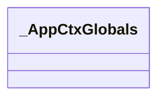

#### RequestContext

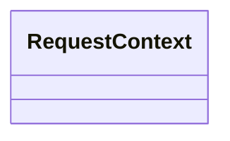

#### SessionInterface

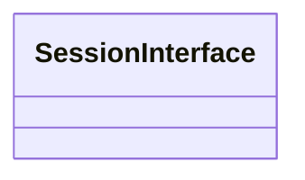

#### SecureCookieSessionInterface

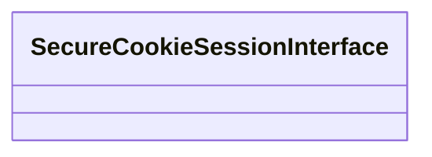

#### JSONProvider


#### TaggedJSONSerializer

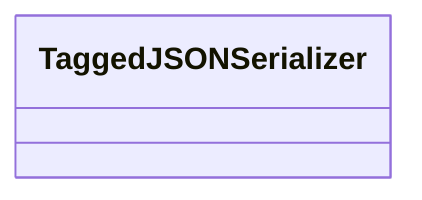

#### View


#### Config

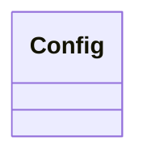

#### EnvironBuilder

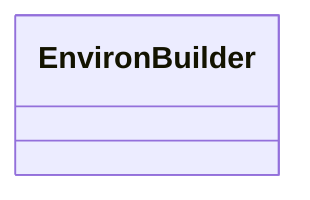

#### FlaskClient

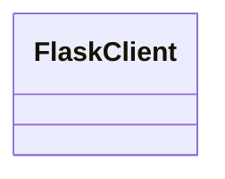

#### Flask

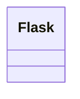

#### DispatchingJinjaLoader

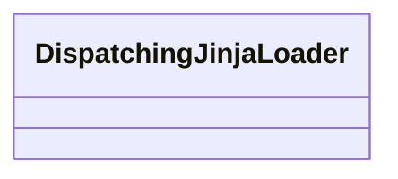

#### BlueprintSetupState

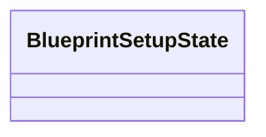

#### Blueprint

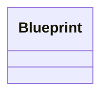

#### App


#### Scaffold


#### Request


#### ScriptInfo


#### FlaskGroup

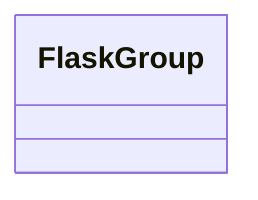

