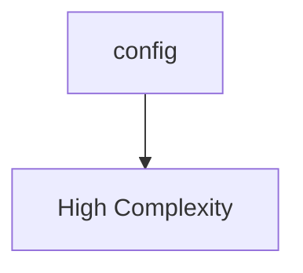

# Architectural Analysis Report

**Project ID:** 1  
**Analysis ID:** `1`  
**Generated:** 2025-08-22 09:51:06 UTC  
**Git Branch:** `unknown`  
**Status:** completed  

---

## Executive Summary

### 📊 Analysis Overview

- **Total Issues Found:** 143
- **Architecture Health Score:** 0.0/100 (Critical)
- **Technical Debt Score:** 100/100 (higher is worse)
- **Files Analyzed:** 1
- **Analysis Status:** completed

### 🚨 Issue Severity Distribution

| Severity | Count | Percentage |
|----------|-------|------------|
| 🔴 Critical | 3 | 2.1% |
| 🟡 High | 52 | 36.4% |
| 🟠 Medium | 13 | 9.1% |
| 🟢 Low | 75 | 52.4% |

## Architecture Overview

### System Architecture

**Architecture Summary:**
- config: Module (Complexity: 143.0)

### Component Metrics

| Component | Type | Complexity | Dependencies |
|-----------|------|------------|-------------|
| config | Module | 143 | 0 |

## Issues Breakdown

### General Issues

#### 🟢 Issue #0

**Message:** Code duplication detected: 15 similar lines

**File:** `./src/analysis/config.rs`:185

---

#### 🟢 Issue #0

**Message:** Code duplication detected: 17 similar lines

**File:** `./src/analysis/config.rs`:346

---

#### 🟢 Issue #0

**Message:** Code duplication detected: 11 similar lines

**File:** `./src/analysis/config.rs`:737

---

#### 🟢 Issue #0

**Message:** Code duplication detected: 11 similar lines

**File:** `./src/analysis/config.rs`:737

---

#### 🟢 Issue #0

**Message:** Code duplication detected: 17 similar lines

**File:** `./src/analysis/config.rs`:750

---

#### 🟢 Issue #0

**Message:** Code duplication detected: 9 similar lines

**File:** `./src/analysis/config.rs`:769

---

#### 🟢 Issue #0

**Message:** Code duplication detected: 9 similar lines

**File:** `./src/analysis/config.rs`:769

---

#### 🟢 Issue #0

**Message:** Code duplication detected: 8 similar lines

**File:** `./src/analysis/config.rs`:780

---

#### 🟢 Issue #0

**Message:** Code duplication detected: 8 similar lines

**File:** `./src/analysis/config.rs`:780

---

#### 🟢 Issue #0

**Message:** Code duplication detected: 8 similar lines

**File:** `./src/analysis/config.rs`:780

---

#### 🟢 Issue #0

**Message:** Code duplication detected: 8 similar lines

**File:** `./src/analysis/config.rs`:790

---

#### 🟢 Issue #0

**Message:** Code duplication detected: 8 similar lines

**File:** `./src/analysis/config.rs`:790

---

#### 🟢 Issue #0

**Message:** Code duplication detected: 8 similar lines

**File:** `./src/analysis/config.rs`:790

---

#### 🟢 Issue #0

**Message:** Code duplication detected: 8 similar lines

**File:** `./src/analysis/config.rs`:790

---

#### 🟢 Issue #0

**Message:** Code duplication detected: 14 similar lines

**File:** `./src/analysis/config.rs`:800

---

#### 🟢 Issue #0

**Message:** Code duplication detected: 14 similar lines

**File:** `./src/analysis/config.rs`:800

---

#### 🟢 Issue #0

**Message:** Code duplication detected: 19 similar lines

**File:** `./src/analysis/config.rs`:816

---

#### 🟢 Issue #0

**Message:** Code duplication detected: 28 similar lines

**File:** `./src/analysis/config.rs`:837

---

#### 🟢 Issue #0

**Message:** Code duplication detected: 19 similar lines

**File:** `./src/analysis/config.rs`:867

---

#### 🟢 Issue #0

**Message:** Potentially dead code: function 'validate' is not used in this file (confidence: 60.0%)

**File:** `./src/analysis/config.rs`:376

---

#### 🟢 Issue #0

**Message:** Potentially dead code: function 'get_detector_names' is not used in this file (confidence: 60.0%)

**File:** `./src/analysis/config.rs`:383

---

#### 🟢 Issue #0

**Message:** Potentially dead code: function 'has_detector' is not used in this file (confidence: 60.0%)

**File:** `./src/analysis/config.rs`:392

---

#### 🟢 Issue #0

**Message:** Potentially dead code: function 'migrate_to_standardized' is not used in this file (confidence: 60.0%)

**File:** `./src/analysis/config.rs`:429

---

#### 🟢 Issue #0

**Message:** Potentially dead code: function 'get_effective_detector_config' is not used in this file (confidence: 60.0%)

**File:** `./src/analysis/config.rs`:477

---

#### 🟢 Issue #0

**Message:** Potentially dead code: function 'set_standard_detector_config' is not used in this file (confidence: 60.0%)

**File:** `./src/analysis/config.rs`:506

---

#### 🟢 Issue #0

**Message:** Potentially dead code: function 'get_enabled_detectors' is not used in this file (confidence: 60.0%)

**File:** `./src/analysis/config.rs`:520

---

#### 🟢 Issue #0

**Message:** Potentially dead code: function 'default_true' is not used in this file (confidence: 90.0%)

**File:** `./src/analysis/config.rs`:693

---

#### 🟢 Issue #0

**Message:** Potentially dead code: function 'test_default_config' is not used in this file (confidence: 90.0%)

**File:** `./src/analysis/config.rs`:737

---

#### 🟢 Issue #0

**Message:** Potentially dead code: function 'test_detector_management' is not used in this file (confidence: 90.0%)

**File:** `./src/analysis/config.rs`:750

---

#### 🟢 Issue #0

**Message:** Potentially dead code: function 'test_validate_config' is not used in this file (confidence: 90.0%)

**File:** `./src/analysis/config.rs`:769

---

#### 🟢 Issue #0

**Message:** Potentially dead code: function 'test_create_engine' is not used in this file (confidence: 90.0%)

**File:** `./src/analysis/config.rs`:780

---

#### 🟢 Issue #0

**Message:** Potentially dead code: function 'test_create_engine_sync' is not used in this file (confidence: 90.0%)

**File:** `./src/analysis/config.rs`:790

---

#### 🟢 Issue #0

**Message:** Potentially dead code: function 'test_toml_serialization' is not used in this file (confidence: 90.0%)

**File:** `./src/analysis/config.rs`:800

---

#### 🟢 Issue #0

**Message:** Potentially dead code: function 'test_file_operations' is not used in this file (confidence: 90.0%)

**File:** `./src/analysis/config.rs`:816

---

#### 🟢 Issue #0

**Message:** Potentially dead code: function 'test_from_toml_string' is not used in this file (confidence: 90.0%)

**File:** `./src/analysis/config.rs`:837

---

#### 🟢 Issue #0

**Message:** Potentially dead code: function 'test_empty_detectors_uses_defaults' is not used in this file (confidence: 90.0%)

**File:** `./src/analysis/config.rs`:867

---

#### 🟢 Issue #0

**Message:** Potentially dead code: struct 'AnalysisConfig' is not used in this file (confidence: 60.0%)

**File:** `./src/analysis/config.rs`:77

---

#### 🟢 Issue #0

**Message:** Potentially dead code: struct 'CacheConfig' is not used in this file (confidence: 60.0%)

**File:** `./src/analysis/config.rs`:103

---

#### 🟢 Issue #0

**Message:** Potentially dead code: struct 'PerformanceConfig' is not used in this file (confidence: 60.0%)

**File:** `./src/analysis/config.rs`:124

---

#### 🟢 Issue #0

**Message:** Potentially dead code: struct 'Helper' is not used in this file (confidence: 90.0%)

**File:** `./src/analysis/config.rs`:684

---

#### 🟢 Issue #0

**Message:** Large class 'AnalysisConfig' detected: 0 LOC, 15 methods, 8 fields

**File:** `./src/analysis/config.rs`:77

---

#### 🔴 Issue #0

**Message:** Component 'caller' has 129 dependencies (critical threshold: 7)

**File:** `./src/analysis/config.rs`

---

#### 🟢 Issue #0

**Message:** Long method 'create_engine' detected: 41 lines, 5 statements, complexity 5

**File:** `./src/analysis/config.rs`:260

---

#### 🟢 Issue #0

**Message:** Long method 'create_engine' detected: 41 lines, 5 statements, complexity 5

**File:** `./src/analysis/config.rs`:260

---

#### 🟢 Issue #0

**Message:** Long method 'migrate_to_standardized' detected: 28 lines, 5 statements, complexity 5

**File:** `./src/analysis/config.rs`:429

---

#### 🟢 Issue #0

**Message:** Long method 'migrate_to_standardized' detected: 28 lines, 5 statements, complexity 5

**File:** `./src/analysis/config.rs`:429

---

#### 🟢 Issue #0

**Message:** Long method 'default' detected: 68 lines, 12 statements, complexity 1

**File:** `./src/analysis/config.rs`:555

---

#### 🟢 Issue #0

**Message:** Long method 'default' detected: 68 lines, 12 statements, complexity 1

**File:** `./src/analysis/config.rs`:555

---

#### 🟢 Issue #0

**Message:** 

**File:** `./src/analysis/config.rs`:115

---

#### 🟢 Issue #0

**Message:** 

**File:** `./src/analysis/config.rs`:116

---

#### 🟢 Issue #0

**Message:** 

**File:** `./src/analysis/config.rs`:117

---

#### 🟢 Issue #0

**Message:** 

**File:** `./src/analysis/config.rs`:144

---

#### 🟢 Issue #0

**Message:** 

**File:** `./src/analysis/config.rs`:145

---

#### 🟢 Issue #0

**Message:** 

**File:** `./src/analysis/config.rs`:147

---

#### 🟢 Issue #0

**Message:** 

**File:** `./src/analysis/config.rs`:149

---

#### 🟢 Issue #0

**Message:** 

**File:** `./src/analysis/config.rs`:150

---

#### 🟢 Issue #0

**Message:** 

**File:** `./src/analysis/config.rs`:188

---

#### 🟢 Issue #0

**Message:** 

**File:** `./src/analysis/config.rs`:195

---

#### 🟢 Issue #0

**Message:** 

**File:** `./src/analysis/config.rs`:215

---

#### 🟢 Issue #0

**Message:** 

**File:** `./src/analysis/config.rs`:222

---

#### 🟢 Issue #0

**Message:** 

**File:** `./src/analysis/config.rs`:282

---

#### 🟢 Issue #0

**Message:** 

**File:** `./src/analysis/config.rs`:283

---

#### 🟢 Issue #0

**Message:** 

**File:** `./src/analysis/config.rs`:285

---

#### 🟢 Issue #0

**Message:** 

**File:** `./src/analysis/config.rs`:286

---

#### 🟢 Issue #0

**Message:** 

**File:** `./src/analysis/config.rs`:299

---

#### 🟢 Issue #0

**Message:** 

**File:** `./src/analysis/config.rs`:300

---

#### 🟢 Issue #0

**Message:** 

**File:** `./src/analysis/config.rs`:302

---

#### 🟢 Issue #0

**Message:** 

**File:** `./src/analysis/config.rs`:303

---

#### 🟢 Issue #0

**Message:** 

**File:** `./src/analysis/config.rs`:360

---

#### 🟢 Issue #0

**Message:** 

**File:** `./src/analysis/config.rs`:448

---

#### 🟢 Issue #0

**Message:** 

**File:** `./src/analysis/config.rs`:449

---

#### 🟢 Issue #0

**Message:** 

**File:** `./src/analysis/config.rs`:450

---

#### 🟢 Issue #0

**Message:** 

**File:** `./src/analysis/config.rs`:451

---

#### 🟢 Issue #0

**Message:** 

**File:** `./src/analysis/config.rs`:452

---

#### 🟢 Issue #0

**Message:** 

**File:** `./src/analysis/config.rs`:560

---

#### 🟢 Issue #0

**Message:** 

**File:** `./src/analysis/config.rs`:564

---

#### 🟢 Issue #0

**Message:** 

**File:** `./src/analysis/config.rs`:565

---

#### 🟢 Issue #0

**Message:** 

**File:** `./src/analysis/config.rs`:568

---

#### 🟢 Issue #0

**Message:** 

**File:** `./src/analysis/config.rs`:572

---

#### 🟢 Issue #0

**Message:** 

**File:** `./src/analysis/config.rs`:575

---

#### 🟢 Issue #0

**Message:** 

**File:** `./src/analysis/config.rs`:581

---

#### 🟢 Issue #0

**Message:** 

**File:** `./src/analysis/config.rs`:585

---

#### 🟢 Issue #0

**Message:** 

**File:** `./src/analysis/config.rs`:588

---

#### 🟢 Issue #0

**Message:** 

**File:** `./src/analysis/config.rs`:597

---

#### 🟢 Issue #0

**Message:** 

**File:** `./src/analysis/config.rs`:598

---

#### 🟢 Issue #0

**Message:** 

**File:** `./src/analysis/config.rs`:601

---

#### 🟢 Issue #0

**Message:** 

**File:** `./src/analysis/config.rs`:602

---

#### 🟢 Issue #0

**Message:** 

**File:** `./src/analysis/config.rs`:605

---

#### 🟢 Issue #0

**Message:** 

**File:** `./src/analysis/config.rs`:606

---

#### 🟢 Issue #0

**Message:** 

**File:** `./src/analysis/config.rs`:609

---

#### 🟢 Issue #0

**Message:** 

**File:** `./src/analysis/config.rs`:610

---

#### 🟢 Issue #0

**Message:** 

**File:** `./src/analysis/config.rs`:613

---

#### 🟢 Issue #0

**Message:** 

**File:** `./src/analysis/config.rs`:614

---

#### 🟢 Issue #0

**Message:** 

**File:** `./src/analysis/config.rs`:621

---

#### 🟢 Issue #0

**Message:** 

**File:** `./src/analysis/config.rs`:623

---

#### 🟢 Issue #0

**Message:** 

**File:** `./src/analysis/config.rs`:637

---

#### 🟢 Issue #0

**Message:** 

**File:** `./src/analysis/config.rs`:638

---

#### 🟢 Issue #0

**Message:** 

**File:** `./src/analysis/config.rs`:639

---

#### 🟢 Issue #0

**Message:** 

**File:** `./src/analysis/config.rs`:640

---

#### 🟢 Issue #0

**Message:** 

**File:** `./src/analysis/config.rs`:652

---

#### 🟢 Issue #0

**Message:** 

**File:** `./src/analysis/config.rs`:653

---

#### 🟢 Issue #0

**Message:** 

**File:** `./src/analysis/config.rs`:654

---

#### 🟢 Issue #0

**Message:** 

**File:** `./src/analysis/config.rs`:655

---

#### 🟢 Issue #0

**Message:** 

**File:** `./src/analysis/config.rs`:657

---

#### 🟢 Issue #0

**Message:** 

**File:** `./src/analysis/config.rs`:670

---

#### 🟢 Issue #0

**Message:** 

**File:** `./src/analysis/config.rs`:670

---

#### 🟢 Issue #0

**Message:** 

**File:** `./src/analysis/config.rs`:671

---

#### 🟢 Issue #0

**Message:** 

**File:** `./src/analysis/config.rs`:672

---

#### 🟢 Issue #0

**Message:** 

**File:** `./src/analysis/config.rs`:673

---

#### 🟢 Issue #0

**Message:** 

**File:** `./src/analysis/config.rs`:685

---

#### 🟢 Issue #0

**Message:** 

**File:** `./src/analysis/config.rs`:741

---

#### 🟢 Issue #0

**Message:** 

**File:** `./src/analysis/config.rs`:742

---

#### 🟢 Issue #0

**Message:** 

**File:** `./src/analysis/config.rs`:743

---

#### 🟢 Issue #0

**Message:** 

**File:** `./src/analysis/config.rs`:744

---

#### 🟢 Issue #0

**Message:** 

**File:** `./src/analysis/config.rs`:746

---

#### 🟢 Issue #0

**Message:** 

**File:** `./src/analysis/config.rs`:755

---

#### 🟢 Issue #0

**Message:** 

**File:** `./src/analysis/config.rs`:756

---

#### 🟢 Issue #0

**Message:** 

**File:** `./src/analysis/config.rs`:756

---

#### 🟢 Issue #0

**Message:** 

**File:** `./src/analysis/config.rs`:759

---

#### 🟢 Issue #0

**Message:** 

**File:** `./src/analysis/config.rs`:760

---

#### 🟢 Issue #0

**Message:** 

**File:** `./src/analysis/config.rs`:763

---

#### 🟢 Issue #0

**Message:** 

**File:** `./src/analysis/config.rs`:765

---

#### 🟢 Issue #0

**Message:** 

**File:** `./src/analysis/config.rs`:775

---

#### 🟢 Issue #0

**Message:** 

**File:** `./src/analysis/config.rs`:785

---

#### 🟢 Issue #0

**Message:** 

**File:** `./src/analysis/config.rs`:786

---

#### 🟢 Issue #0

**Message:** 

**File:** `./src/analysis/config.rs`:795

---

#### 🟢 Issue #0

**Message:** 

**File:** `./src/analysis/config.rs`:796

---

#### 🟢 Issue #0

**Message:** 

**File:** `./src/analysis/config.rs`:805

---

#### 🟢 Issue #0

**Message:** 

**File:** `./src/analysis/config.rs`:807

---

#### 🟢 Issue #0

**Message:** 

**File:** `./src/analysis/config.rs`:820

---

#### 🟢 Issue #0

**Message:** 

**File:** `./src/analysis/config.rs`:828

---

#### 🟢 Issue #0

**Message:** 

**File:** `./src/analysis/config.rs`:851

---

#### 🟢 Issue #0

**Message:** 

**File:** `./src/analysis/config.rs`:853

---

#### 🟢 Issue #0

**Message:** 

**File:** `./src/analysis/config.rs`:855

---

#### 🟢 Issue #0

**Message:** 

**File:** `./src/analysis/config.rs`:860

---

#### 🟢 Issue #0

**Message:** 

**File:** `./src/analysis/config.rs`:861

---

#### 🟢 Issue #0

**Message:** 

**File:** `./src/analysis/config.rs`:862

---

#### 🟢 Issue #0

**Message:** 

**File:** `./src/analysis/config.rs`:862

---

#### 🟢 Issue #0

**Message:** 

**File:** `./src/analysis/config.rs`:863

---

#### 🟢 Issue #0

**Message:** 

**File:** `./src/analysis/config.rs`:863

---

#### 🟢 Issue #0

**Message:** 

**File:** `./src/analysis/config.rs`:872

---

#### 🟢 Issue #0

**Message:** 

**File:** `./src/analysis/config.rs`:883

---

#### 🟢 Issue #0

**Message:** 

**File:** `./src/analysis/config.rs`:884

---

## Architectural Diagrams

### Dependency Graph

**Component Dependencies:**

### Component Interactions

**Component Summary:**
- config: Located at `./src/analysis/config.rs`

## Recommendations

### 🚨 Immediate Actions Required

You have **1** critical architectural issues that require immediate attention:

- **Issue #0**: Component 'caller' has 129 dependencies (critical threshold: 7)

### 📋 General Guidelines

1. **Address Critical Issues First**: Focus on critical and high-severity issues
2. **Implement Gradual Refactoring**: Make incremental improvements
3. **Add Automated Testing**: Ensure changes don't introduce regressions
4. **Code Review Process**: Implement peer reviews for architectural changes
5. **Documentation**: Update architectural documentation after changes

## Appendix

### Analysis Configuration

- **Analysis Engine Version**: 0.0.2
- **Project ID**: 1
- **Status**: completed
- **Files Analyzed**: 1
- **Issues Found**: 143

### About This Report

This report was generated by Uveddi, an architectural analysis tool that helps identify design patterns, anti-patterns, and potential improvements in software architecture.

For more information, visit: [Uveddi Documentation](https://github.com/your-org/uveddi)
