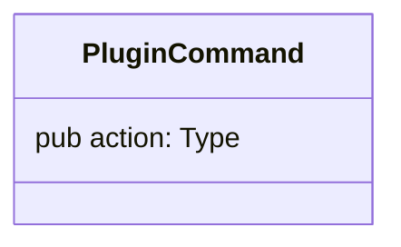
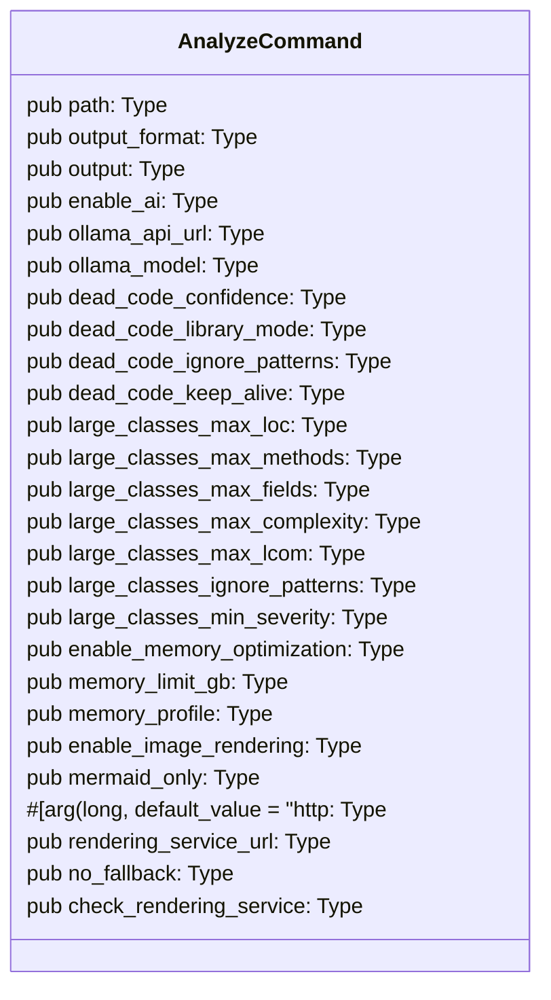
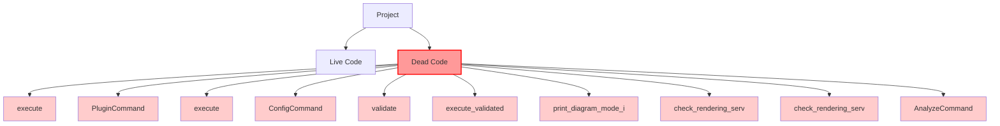

# Uveddi Architectural Analysis Report

_Generated on 2025-07-30 17:12:35_

## Executive Summary

This report analyzes the codebase at `src/cli` and identified **52 architectural issues** across **3 files**.

- **High Severity**: 3 issues
- **Medium Severity**: 11 issues
- **Low Severity**: 38 issues

The analysis took 0.00 seconds to complete.

## Issues by Severity

### 🔴 High Severity Issues

| File | Issue |
|------|-------|
| `plugin_command.rs`| Component 'caller' has 38 dependencies, exceeding critical threshold of 12 |
| `config_command.rs`| Component 'caller' has 16 dependencies, exceeding critical threshold of 12 |
| `analyze_command.rs:50-50`| God Object detected: 'AnalyzeCommand' has 9 methods and 25 fields. (Thresholds: methods>5, fields>8) LCOM4 score: 1 (>1 indicates low cohesion) Methods: 0 trivial, 0 complex |

### 🟠 Medium Severity Issues

| File | Issue |
|------|-------|
| `plugin_command.rs:11-11`| God Object detected: 'PluginCommand' has 8 methods and 1 fields. (Thresholds: methods>5, fields>8) LCOM4 score: 1 (>1 indicates low cohesion) Methods: 0 trivial, 0 complex |
| `plugin_command.rs:52-52`| Potentially dead code: function 'execute' is not used in this file (confidence: 60.0%) |
| `plugin_command.rs:11-11`| Potentially dead code: struct 'PluginCommand' is not used in this file (confidence: 60.0%) |
| `config_command.rs:43-43`| Potentially dead code: function 'execute' is not used in this file (confidence: 60.0%) |
| `config_command.rs:37-37`| Potentially dead code: struct 'ConfigCommand' is not used in this file (confidence: 60.0%) |
| `analyze_command.rs:256-256`| Potentially dead code: function 'validate' is not used in this file (confidence: 60.0%) |
| `analyze_command.rs:368-368`| Potentially dead code: function 'execute_validated' is not used in this file (confidence: 60.0%) |
| `analyze_command.rs:377-377`| Potentially dead code: function 'print_diagram_mode_info' is not used in this file (confidence: 60.0%) |
| `analyze_command.rs:401-401`| Potentially dead code: function 'check_rendering_service_availability' is not used in this file (confidence: 60.0%) |
| `analyze_command.rs:438-438`| Potentially dead code: function 'check_rendering_service_availability' is not used in this file (confidence: 60.0%) |
| `analyze_command.rs:50-50`| Potentially dead code: struct 'AnalyzeCommand' is not used in this file (confidence: 60.0%) |

### 🟡 Low Severity Issues

| File | Issue |
|------|-------|
| `plugin_command.rs:107-181`| Code duplication detected (Type3): 85.7% similarity between src/cli/plugin_command.rs:107-181 and src/cli/config_command.rs:43-151 |
| `plugin_command.rs:107-181`| Code duplication detected (Type3): 95.2% similarity between src/cli/plugin_command.rs:107-181 and src/cli/plugin_command.rs:280-316 |
| `plugin_command.rs:107-181`| Code duplication detected (Type3): 100.0% similarity between src/cli/plugin_command.rs:107-181 and src/cli/plugin_command.rs:318-447 |
| `plugin_command.rs:107-181`| Code duplication detected (Type3): 95.2% similarity between src/cli/plugin_command.rs:107-181 and src/cli/plugin_command.rs:235-278 |
| `plugin_command.rs:183-208`| Code duplication detected (Type3): 95.2% similarity between src/cli/plugin_command.rs:183-208 and src/cli/plugin_command.rs:318-447 |
| `plugin_command.rs:183-208`| Code duplication detected (Type3): 95.2% similarity between src/cli/plugin_command.rs:183-208 and src/cli/plugin_command.rs:107-181 |
| `plugin_command.rs:210-233`| Code duplication detected (Type3): 100.0% similarity between src/cli/plugin_command.rs:210-233 and src/cli/plugin_command.rs:235-278 |
| `plugin_command.rs:210-233`| Code duplication detected (Type3): 95.2% similarity between src/cli/plugin_command.rs:210-233 and src/cli/plugin_command.rs:107-181 |
| `plugin_command.rs:210-233`| Code duplication detected (Type3): 100.0% similarity between src/cli/plugin_command.rs:210-233 and src/cli/plugin_command.rs:183-208 |
| `plugin_command.rs:210-233`| Code duplication detected (Type3): 95.2% similarity between src/cli/plugin_command.rs:210-233 and src/cli/plugin_command.rs:318-447 |
| `plugin_command.rs:210-233`| Code duplication detected (Type3): 100.0% similarity between src/cli/plugin_command.rs:210-233 and src/cli/plugin_command.rs:280-316 |
| `plugin_command.rs:235-278`| Code duplication detected (Type3): 95.2% similarity between src/cli/plugin_command.rs:235-278 and src/cli/plugin_command.rs:318-447 |
| `plugin_command.rs:235-278`| Code duplication detected (Type3): 100.0% similarity between src/cli/plugin_command.rs:235-278 and src/cli/plugin_command.rs:280-316 |
| `plugin_command.rs:235-278`| Code duplication detected (Type3): 95.2% similarity between src/cli/plugin_command.rs:235-278 and src/cli/plugin_command.rs:107-181 |
| `plugin_command.rs:235-278`| Code duplication detected (Type3): 85.0% similarity between src/cli/plugin_command.rs:235-278 and src/cli/analyze_command.rs:401-434 |
| `plugin_command.rs:235-278`| Code duplication detected (Type3): 100.0% similarity between src/cli/plugin_command.rs:235-278 and src/cli/plugin_command.rs:70-105 |
| `plugin_command.rs:280-316`| Code duplication detected (Type3): 85.0% similarity between src/cli/plugin_command.rs:280-316 and src/cli/analyze_command.rs:401-434 |
| `plugin_command.rs:280-316`| Code duplication detected (Type3): 100.0% similarity between src/cli/plugin_command.rs:280-316 and src/cli/plugin_command.rs:235-278 |
| `plugin_command.rs:280-316`| Code duplication detected (Type3): 100.0% similarity between src/cli/plugin_command.rs:280-316 and src/cli/plugin_command.rs:70-105 |
| `plugin_command.rs:280-316`| Code duplication detected (Type3): 95.2% similarity between src/cli/plugin_command.rs:280-316 and src/cli/plugin_command.rs:318-447 |
| `plugin_command.rs:280-316`| Code duplication detected (Type3): 95.2% similarity between src/cli/plugin_command.rs:280-316 and src/cli/plugin_command.rs:107-181 |
| `plugin_command.rs:318-447`| Code duplication detected (Type3): 100.0% similarity between src/cli/plugin_command.rs:318-447 and src/cli/plugin_command.rs:107-181 |
| `plugin_command.rs:318-447`| Code duplication detected (Type3): 85.7% similarity between src/cli/plugin_command.rs:318-447 and src/cli/config_command.rs:43-151 |
| `plugin_command.rs:318-447`| Code duplication detected (Type3): 95.2% similarity between src/cli/plugin_command.rs:318-447 and src/cli/plugin_command.rs:280-316 |
| `plugin_command.rs:70-105`| Code duplication detected (Type3): 100.0% similarity between src/cli/plugin_command.rs:70-105 and src/cli/plugin_command.rs:280-316 |
| `plugin_command.rs:70-105`| Code duplication detected (Type3): 100.0% similarity between src/cli/plugin_command.rs:70-105 and src/cli/plugin_command.rs:235-278 |
| `plugin_command.rs:70-105`| Code duplication detected (Type3): 95.2% similarity between src/cli/plugin_command.rs:70-105 and src/cli/plugin_command.rs:318-447 |
| `plugin_command.rs:70-105`| Code duplication detected (Type3): 95.2% similarity between src/cli/plugin_command.rs:70-105 and src/cli/plugin_command.rs:107-181 |
| `config_command.rs:43-151`| Code duplication detected (Type3): 85.7% similarity between src/cli/config_command.rs:43-151 and src/cli/plugin_command.rs:107-181 |
| `config_command.rs:43-151`| Code duplication detected (Type3): 85.7% similarity between src/cli/config_command.rs:43-151 and src/cli/plugin_command.rs:318-447 |
| `analyze_command.rs:401-434`| Code duplication detected (Type3): 81.0% similarity between src/cli/analyze_command.rs:401-434 and src/cli/plugin_command.rs:107-181 |
| `analyze_command.rs:401-434`| Code duplication detected (Type3): 85.0% similarity between src/cli/analyze_command.rs:401-434 and src/cli/plugin_command.rs:235-278 |
| `analyze_command.rs:401-434`| Code duplication detected (Type3): 94.4% similarity between src/cli/analyze_command.rs:401-434 and src/cli/config_command.rs:43-151 |
| `analyze_command.rs:401-434`| Code duplication detected (Type3): 81.0% similarity between src/cli/analyze_command.rs:401-434 and src/cli/plugin_command.rs:318-447 |
| `analyze_command.rs:401-434`| Code duplication detected (Type3): 85.0% similarity between src/cli/analyze_command.rs:401-434 and src/cli/plugin_command.rs:70-105 |
| `analyze_command.rs:401-434`| Code duplication detected (Type3): 85.0% similarity between src/cli/analyze_command.rs:401-434 and src/cli/plugin_command.rs:280-316 |
| `analyze_command.rs:438-445`| Code duplication detected (Type3): 82.4% similarity between src/cli/analyze_command.rs:438-445 and src/cli/analyze_command.rs:401-434 |
| `analyze_command.rs:500-555`| Code duplication detected (Type3): 95.2% similarity between src/cli/analyze_command.rs:500-555 and src/cli/plugin_command.rs:318-447 |


## Detailed Analysis

### Unknown (ID: 2)

No description available

#### Issue #1: Potentially dead code: function 'execute' is not used in this file (confidence: 60.0%)

- **File**: `src/cli/plugin_command.rs`
- **Severity**: Medium
- **Location**: Lines 52-52

**Code Snippet**:

```
execute
```


#### Issue #2: Potentially dead code: struct 'PluginCommand' is not used in this file (confidence: 60.0%)

- **File**: `src/cli/plugin_command.rs`
- **Severity**: Medium
- **Location**: Lines 11-11

**Code Snippet**:

```
PluginCommand
```


#### Issue #3: Potentially dead code: function 'execute' is not used in this file (confidence: 60.0%)

- **File**: `src/cli/config_command.rs`
- **Severity**: Medium
- **Location**: Lines 43-43

**Code Snippet**:

```
execute
```


#### Issue #4: Potentially dead code: struct 'ConfigCommand' is not used in this file (confidence: 60.0%)

- **File**: `src/cli/config_command.rs`
- **Severity**: Medium
- **Location**: Lines 37-37

**Code Snippet**:

```
ConfigCommand
```


#### Issue #5: Potentially dead code: function 'validate' is not used in this file (confidence: 60.0%)

- **File**: `src/cli/analyze_command.rs`
- **Severity**: Medium
- **Location**: Lines 256-256

**Code Snippet**:

```
validate
```


#### Issue #6: Potentially dead code: function 'execute_validated' is not used in this file (confidence: 60.0%)

- **File**: `src/cli/analyze_command.rs`
- **Severity**: Medium
- **Location**: Lines 368-368

**Code Snippet**:

```
execute_validated
```


#### Issue #7: Potentially dead code: function 'print_diagram_mode_info' is not used in this file (confidence: 60.0%)

- **File**: `src/cli/analyze_command.rs`
- **Severity**: Medium
- **Location**: Lines 377-377

**Code Snippet**:

```
print_diagram_mode_info
```


#### Issue #8: Potentially dead code: function 'check_rendering_service_availability' is not used in this file (confidence: 60.0%)

- **File**: `src/cli/analyze_command.rs`
- **Severity**: Medium
- **Location**: Lines 401-401

**Code Snippet**:

```
check_rendering_service_availability
```


#### Issue #9: Potentially dead code: function 'check_rendering_service_availability' is not used in this file (confidence: 60.0%)

- **File**: `src/cli/analyze_command.rs`
- **Severity**: Medium
- **Location**: Lines 438-438

**Code Snippet**:

```
check_rendering_service_availability
```


#### Issue #10: Potentially dead code: struct 'AnalyzeCommand' is not used in this file (confidence: 60.0%)

- **File**: `src/cli/analyze_command.rs`
- **Severity**: Medium
- **Location**: Lines 50-50

**Code Snippet**:

```
AnalyzeCommand
```


### Unknown (ID: 1)

No description available

#### Issue #1: God Object detected: 'PluginCommand' has 8 methods and 1 fields. (Thresholds: methods>5, fields>8) LCOM4 score: 1 (>1 indicates low cohesion) Methods: 0 trivial, 0 complex

- **File**: `src/cli/plugin_command.rs`
- **Severity**: Medium
- **Location**: Lines 11-11

**Code Snippet**:

```
pub struct PluginCommand {
    #[command(subcommand)]
    pub action: PluginAction,
}
```


#### Issue #2: Code duplication detected (Type3): 85.7% similarity between src/cli/plugin_command.rs:107-181 and src/cli/config_command.rs:43-151

- **File**: `src/cli/plugin_command.rs`
- **Severity**: low
- **Location**: Lines 107-181

**Code Snippet**:

```
async fn install_plugin(
        &self,
        binary_path: PathBuf,
        manifest_path: PathBuf,
    ) -> Result<(), crate::error::UveddiError> {
        #[cfg(feature = "wasm-plugins")]
        ...
```

**AI Analysis**:

This code block appears to be duplicated in another location. Consider extracting the common logic into a shared function or module to improve maintainability. The duplicate is located at src/cli/config_command.rs:43-151 with 85.7% similarity.


#### Issue #3: Code duplication detected (Type3): 95.2% similarity between src/cli/plugin_command.rs:107-181 and src/cli/plugin_command.rs:280-316

- **File**: `src/cli/plugin_command.rs`
- **Severity**: low
- **Location**: Lines 107-181

**Code Snippet**:

```
async fn install_plugin(
        &self,
        binary_path: PathBuf,
        manifest_path: PathBuf,
    ) -> Result<(), crate::error::UveddiError> {
        #[cfg(feature = "wasm-plugins")]
        ...
```

**AI Analysis**:

This code block appears to be duplicated in another location. Consider extracting the common logic into a shared function or module to improve maintainability. The duplicate is located at src/cli/plugin_command.rs:280-316 with 95.2% similarity.


#### Issue #4: Code duplication detected (Type3): 100.0% similarity between src/cli/plugin_command.rs:107-181 and src/cli/plugin_command.rs:318-447

- **File**: `src/cli/plugin_command.rs`
- **Severity**: low
- **Location**: Lines 107-181

**Code Snippet**:

```
async fn install_plugin(
        &self,
        binary_path: PathBuf,
        manifest_path: PathBuf,
    ) -> Result<(), crate::error::UveddiError> {
        #[cfg(feature = "wasm-plugins")]
        ...
```

**AI Analysis**:

This code block appears to be duplicated in another location. Consider extracting the common logic into a shared function or module to improve maintainability. The duplicate is located at src/cli/plugin_command.rs:318-447 with 100.0% similarity.


#### Issue #5: Code duplication detected (Type3): 95.2% similarity between src/cli/plugin_command.rs:107-181 and src/cli/plugin_command.rs:235-278

- **File**: `src/cli/plugin_command.rs`
- **Severity**: low
- **Location**: Lines 107-181

**Code Snippet**:

```
async fn install_plugin(
        &self,
        binary_path: PathBuf,
        manifest_path: PathBuf,
    ) -> Result<(), crate::error::UveddiError> {
        #[cfg(feature = "wasm-plugins")]
        ...
```

**AI Analysis**:

This code block appears to be duplicated in another location. Consider extracting the common logic into a shared function or module to improve maintainability. The duplicate is located at src/cli/plugin_command.rs:235-278 with 95.2% similarity.


#### Issue #6: Code duplication detected (Type3): 95.2% similarity between src/cli/plugin_command.rs:183-208 and src/cli/plugin_command.rs:318-447

- **File**: `src/cli/plugin_command.rs`
- **Severity**: low
- **Location**: Lines 183-208

**Code Snippet**:

```
async fn uninstall_plugin(&self, plugin_name: String) -> Result<(), crate::error::UveddiError> {
        #[cfg(feature = "wasm-plugins")]
        {
            println!("Uninstalling plugin '{}'...", ...
```

**AI Analysis**:

This code block appears to be duplicated in another location. Consider extracting the common logic into a shared function or module to improve maintainability. The duplicate is located at src/cli/plugin_command.rs:318-447 with 95.2% similarity.


#### Issue #7: Code duplication detected (Type3): 95.2% similarity between src/cli/plugin_command.rs:183-208 and src/cli/plugin_command.rs:107-181

- **File**: `src/cli/plugin_command.rs`
- **Severity**: low
- **Location**: Lines 183-208

**Code Snippet**:

```
async fn uninstall_plugin(&self, plugin_name: String) -> Result<(), crate::error::UveddiError> {
        #[cfg(feature = "wasm-plugins")]
        {
            println!("Uninstalling plugin '{}'...", ...
```

**AI Analysis**:

This code block appears to be duplicated in another location. Consider extracting the common logic into a shared function or module to improve maintainability. The duplicate is located at src/cli/plugin_command.rs:107-181 with 95.2% similarity.


#### Issue #8: Code duplication detected (Type3): 100.0% similarity between src/cli/plugin_command.rs:210-233 and src/cli/plugin_command.rs:235-278

- **File**: `src/cli/plugin_command.rs`
- **Severity**: low
- **Location**: Lines 210-233

**Code Snippet**:

```
async fn show_plugin_info(&self, plugin_name: String) -> Result<(), crate::error::UveddiError> {
        #[cfg(feature = "wasm-plugins")]
        {
            let engine = WasmPluginEngine::new().awa...
```

**AI Analysis**:

This code block appears to be duplicated in another location. Consider extracting the common logic into a shared function or module to improve maintainability. The duplicate is located at src/cli/plugin_command.rs:235-278 with 100.0% similarity.


#### Issue #9: Code duplication detected (Type3): 95.2% similarity between src/cli/plugin_command.rs:210-233 and src/cli/plugin_command.rs:107-181

- **File**: `src/cli/plugin_command.rs`
- **Severity**: low
- **Location**: Lines 210-233

**Code Snippet**:

```
async fn show_plugin_info(&self, plugin_name: String) -> Result<(), crate::error::UveddiError> {
        #[cfg(feature = "wasm-plugins")]
        {
            let engine = WasmPluginEngine::new().awa...
```

**AI Analysis**:

This code block appears to be duplicated in another location. Consider extracting the common logic into a shared function or module to improve maintainability. The duplicate is located at src/cli/plugin_command.rs:107-181 with 95.2% similarity.


#### Issue #10: Code duplication detected (Type3): 100.0% similarity between src/cli/plugin_command.rs:210-233 and src/cli/plugin_command.rs:183-208

- **File**: `src/cli/plugin_command.rs`
- **Severity**: low
- **Location**: Lines 210-233

**Code Snippet**:

```
async fn show_plugin_info(&self, plugin_name: String) -> Result<(), crate::error::UveddiError> {
        #[cfg(feature = "wasm-plugins")]
        {
            let engine = WasmPluginEngine::new().awa...
```

**AI Analysis**:

This code block appears to be duplicated in another location. Consider extracting the common logic into a shared function or module to improve maintainability. The duplicate is located at src/cli/plugin_command.rs:183-208 with 100.0% similarity.


#### Issue #11: Code duplication detected (Type3): 95.2% similarity between src/cli/plugin_command.rs:210-233 and src/cli/plugin_command.rs:318-447

- **File**: `src/cli/plugin_command.rs`
- **Severity**: low
- **Location**: Lines 210-233

**Code Snippet**:

```
async fn show_plugin_info(&self, plugin_name: String) -> Result<(), crate::error::UveddiError> {
        #[cfg(feature = "wasm-plugins")]
        {
            let engine = WasmPluginEngine::new().awa...
```

**AI Analysis**:

This code block appears to be duplicated in another location. Consider extracting the common logic into a shared function or module to improve maintainability. The duplicate is located at src/cli/plugin_command.rs:318-447 with 95.2% similarity.


#### Issue #12: Code duplication detected (Type3): 100.0% similarity between src/cli/plugin_command.rs:210-233 and src/cli/plugin_command.rs:280-316

- **File**: `src/cli/plugin_command.rs`
- **Severity**: low
- **Location**: Lines 210-233

**Code Snippet**:

```
async fn show_plugin_info(&self, plugin_name: String) -> Result<(), crate::error::UveddiError> {
        #[cfg(feature = "wasm-plugins")]
        {
            let engine = WasmPluginEngine::new().awa...
```

**AI Analysis**:

This code block appears to be duplicated in another location. Consider extracting the common logic into a shared function or module to improve maintainability. The duplicate is located at src/cli/plugin_command.rs:280-316 with 100.0% similarity.


#### Issue #13: Code duplication detected (Type3): 95.2% similarity between src/cli/plugin_command.rs:235-278 and src/cli/plugin_command.rs:318-447

- **File**: `src/cli/plugin_command.rs`
- **Severity**: low
- **Location**: Lines 235-278

**Code Snippet**:

```
async fn show_plugin_stats(&self) -> Result<(), crate::error::UveddiError> {
        #[cfg(feature = "wasm-plugins")]
        {
            let engine = WasmPluginEngine::new().await?;

            //...
```

**AI Analysis**:

This code block appears to be duplicated in another location. Consider extracting the common logic into a shared function or module to improve maintainability. The duplicate is located at src/cli/plugin_command.rs:318-447 with 95.2% similarity.


#### Issue #14: Code duplication detected (Type3): 100.0% similarity between src/cli/plugin_command.rs:235-278 and src/cli/plugin_command.rs:280-316

- **File**: `src/cli/plugin_command.rs`
- **Severity**: low
- **Location**: Lines 235-278

**Code Snippet**:

```
async fn show_plugin_stats(&self) -> Result<(), crate::error::UveddiError> {
        #[cfg(feature = "wasm-plugins")]
        {
            let engine = WasmPluginEngine::new().await?;

            //...
```

**AI Analysis**:

This code block appears to be duplicated in another location. Consider extracting the common logic into a shared function or module to improve maintainability. The duplicate is located at src/cli/plugin_command.rs:280-316 with 100.0% similarity.


#### Issue #15: Code duplication detected (Type3): 95.2% similarity between src/cli/plugin_command.rs:235-278 and src/cli/plugin_command.rs:107-181

- **File**: `src/cli/plugin_command.rs`
- **Severity**: low
- **Location**: Lines 235-278

**Code Snippet**:

```
async fn show_plugin_stats(&self) -> Result<(), crate::error::UveddiError> {
        #[cfg(feature = "wasm-plugins")]
        {
            let engine = WasmPluginEngine::new().await?;

            //...
```

**AI Analysis**:

This code block appears to be duplicated in another location. Consider extracting the common logic into a shared function or module to improve maintainability. The duplicate is located at src/cli/plugin_command.rs:107-181 with 95.2% similarity.


#### Issue #16: Code duplication detected (Type3): 85.0% similarity between src/cli/plugin_command.rs:235-278 and src/cli/analyze_command.rs:401-434

- **File**: `src/cli/plugin_command.rs`
- **Severity**: low
- **Location**: Lines 235-278

**Code Snippet**:

```
async fn show_plugin_stats(&self) -> Result<(), crate::error::UveddiError> {
        #[cfg(feature = "wasm-plugins")]
        {
            let engine = WasmPluginEngine::new().await?;

            //...
```

**AI Analysis**:

This code block appears to be duplicated in another location. Consider extracting the common logic into a shared function or module to improve maintainability. The duplicate is located at src/cli/analyze_command.rs:401-434 with 85.0% similarity.


#### Issue #17: Code duplication detected (Type3): 100.0% similarity between src/cli/plugin_command.rs:235-278 and src/cli/plugin_command.rs:70-105

- **File**: `src/cli/plugin_command.rs`
- **Severity**: low
- **Location**: Lines 235-278

**Code Snippet**:

```
async fn show_plugin_stats(&self) -> Result<(), crate::error::UveddiError> {
        #[cfg(feature = "wasm-plugins")]
        {
            let engine = WasmPluginEngine::new().await?;

            //...
```

**AI Analysis**:

This code block appears to be duplicated in another location. Consider extracting the common logic into a shared function or module to improve maintainability. The duplicate is located at src/cli/plugin_command.rs:70-105 with 100.0% similarity.


#### Issue #18: Code duplication detected (Type3): 85.0% similarity between src/cli/plugin_command.rs:280-316 and src/cli/analyze_command.rs:401-434

- **File**: `src/cli/plugin_command.rs`
- **Severity**: low
- **Location**: Lines 280-316

**Code Snippet**:

```
async fn monitor_plugins(&self) -> Result<(), crate::error::UveddiError> {
        #[cfg(feature = "wasm-plugins")]
        {
            let mut engine = WasmPluginEngine::new().await?;

            ...
```

**AI Analysis**:

This code block appears to be duplicated in another location. Consider extracting the common logic into a shared function or module to improve maintainability. The duplicate is located at src/cli/analyze_command.rs:401-434 with 85.0% similarity.


#### Issue #19: Code duplication detected (Type3): 100.0% similarity between src/cli/plugin_command.rs:280-316 and src/cli/plugin_command.rs:235-278

- **File**: `src/cli/plugin_command.rs`
- **Severity**: low
- **Location**: Lines 280-316

**Code Snippet**:

```
async fn monitor_plugins(&self) -> Result<(), crate::error::UveddiError> {
        #[cfg(feature = "wasm-plugins")]
        {
            let mut engine = WasmPluginEngine::new().await?;

            ...
```

**AI Analysis**:

This code block appears to be duplicated in another location. Consider extracting the common logic into a shared function or module to improve maintainability. The duplicate is located at src/cli/plugin_command.rs:235-278 with 100.0% similarity.


#### Issue #20: Code duplication detected (Type3): 100.0% similarity between src/cli/plugin_command.rs:280-316 and src/cli/plugin_command.rs:70-105

- **File**: `src/cli/plugin_command.rs`
- **Severity**: low
- **Location**: Lines 280-316

**Code Snippet**:

```
async fn monitor_plugins(&self) -> Result<(), crate::error::UveddiError> {
        #[cfg(feature = "wasm-plugins")]
        {
            let mut engine = WasmPluginEngine::new().await?;

            ...
```

**AI Analysis**:

This code block appears to be duplicated in another location. Consider extracting the common logic into a shared function or module to improve maintainability. The duplicate is located at src/cli/plugin_command.rs:70-105 with 100.0% similarity.


#### Issue #21: Code duplication detected (Type3): 95.2% similarity between src/cli/plugin_command.rs:280-316 and src/cli/plugin_command.rs:318-447

- **File**: `src/cli/plugin_command.rs`
- **Severity**: low
- **Location**: Lines 280-316

**Code Snippet**:

```
async fn monitor_plugins(&self) -> Result<(), crate::error::UveddiError> {
        #[cfg(feature = "wasm-plugins")]
        {
            let mut engine = WasmPluginEngine::new().await?;

            ...
```

**AI Analysis**:

This code block appears to be duplicated in another location. Consider extracting the common logic into a shared function or module to improve maintainability. The duplicate is located at src/cli/plugin_command.rs:318-447 with 95.2% similarity.


#### Issue #22: Code duplication detected (Type3): 95.2% similarity between src/cli/plugin_command.rs:280-316 and src/cli/plugin_command.rs:107-181

- **File**: `src/cli/plugin_command.rs`
- **Severity**: low
- **Location**: Lines 280-316

**Code Snippet**:

```
async fn monitor_plugins(&self) -> Result<(), crate::error::UveddiError> {
        #[cfg(feature = "wasm-plugins")]
        {
            let mut engine = WasmPluginEngine::new().await?;

            ...
```

**AI Analysis**:

This code block appears to be duplicated in another location. Consider extracting the common logic into a shared function or module to improve maintainability. The duplicate is located at src/cli/plugin_command.rs:107-181 with 95.2% similarity.


#### Issue #23: Code duplication detected (Type3): 100.0% similarity between src/cli/plugin_command.rs:318-447 and src/cli/plugin_command.rs:107-181

- **File**: `src/cli/plugin_command.rs`
- **Severity**: low
- **Location**: Lines 318-447

**Code Snippet**:

```
async fn verify_plugin(
        &self,
        binary_path: PathBuf,
        manifest_path: PathBuf,
    ) -> Result<(), crate::error::UveddiError> {
        #[cfg(feature = "wasm-plugins")]
        {...
```

**AI Analysis**:

This code block appears to be duplicated in another location. Consider extracting the common logic into a shared function or module to improve maintainability. The duplicate is located at src/cli/plugin_command.rs:107-181 with 100.0% similarity.


#### Issue #24: Code duplication detected (Type3): 85.7% similarity between src/cli/plugin_command.rs:318-447 and src/cli/config_command.rs:43-151

- **File**: `src/cli/plugin_command.rs`
- **Severity**: low
- **Location**: Lines 318-447

**Code Snippet**:

```
async fn verify_plugin(
        &self,
        binary_path: PathBuf,
        manifest_path: PathBuf,
    ) -> Result<(), crate::error::UveddiError> {
        #[cfg(feature = "wasm-plugins")]
        {...
```

**AI Analysis**:

This code block appears to be duplicated in another location. Consider extracting the common logic into a shared function or module to improve maintainability. The duplicate is located at src/cli/config_command.rs:43-151 with 85.7% similarity.


#### Issue #25: Code duplication detected (Type3): 95.2% similarity between src/cli/plugin_command.rs:318-447 and src/cli/plugin_command.rs:280-316

- **File**: `src/cli/plugin_command.rs`
- **Severity**: low
- **Location**: Lines 318-447

**Code Snippet**:

```
async fn verify_plugin(
        &self,
        binary_path: PathBuf,
        manifest_path: PathBuf,
    ) -> Result<(), crate::error::UveddiError> {
        #[cfg(feature = "wasm-plugins")]
        {...
```

**AI Analysis**:

This code block appears to be duplicated in another location. Consider extracting the common logic into a shared function or module to improve maintainability. The duplicate is located at src/cli/plugin_command.rs:280-316 with 95.2% similarity.


#### Issue #26: Code duplication detected (Type3): 100.0% similarity between src/cli/plugin_command.rs:70-105 and src/cli/plugin_command.rs:280-316

- **File**: `src/cli/plugin_command.rs`
- **Severity**: low
- **Location**: Lines 70-105

**Code Snippet**:

```
async fn list_plugins(&self) -> Result<(), crate::error::UveddiError> {
        #[cfg(feature = "wasm-plugins")]
        {
            let engine = WasmPluginEngine::new().await?;
            let stat...
```

**AI Analysis**:

This code block appears to be duplicated in another location. Consider extracting the common logic into a shared function or module to improve maintainability. The duplicate is located at src/cli/plugin_command.rs:280-316 with 100.0% similarity.


#### Issue #27: Code duplication detected (Type3): 100.0% similarity between src/cli/plugin_command.rs:70-105 and src/cli/plugin_command.rs:235-278

- **File**: `src/cli/plugin_command.rs`
- **Severity**: low
- **Location**: Lines 70-105

**Code Snippet**:

```
async fn list_plugins(&self) -> Result<(), crate::error::UveddiError> {
        #[cfg(feature = "wasm-plugins")]
        {
            let engine = WasmPluginEngine::new().await?;
            let stat...
```

**AI Analysis**:

This code block appears to be duplicated in another location. Consider extracting the common logic into a shared function or module to improve maintainability. The duplicate is located at src/cli/plugin_command.rs:235-278 with 100.0% similarity.


#### Issue #28: Code duplication detected (Type3): 95.2% similarity between src/cli/plugin_command.rs:70-105 and src/cli/plugin_command.rs:318-447

- **File**: `src/cli/plugin_command.rs`
- **Severity**: low
- **Location**: Lines 70-105

**Code Snippet**:

```
async fn list_plugins(&self) -> Result<(), crate::error::UveddiError> {
        #[cfg(feature = "wasm-plugins")]
        {
            let engine = WasmPluginEngine::new().await?;
            let stat...
```

**AI Analysis**:

This code block appears to be duplicated in another location. Consider extracting the common logic into a shared function or module to improve maintainability. The duplicate is located at src/cli/plugin_command.rs:318-447 with 95.2% similarity.


#### Issue #29: Code duplication detected (Type3): 95.2% similarity between src/cli/plugin_command.rs:70-105 and src/cli/plugin_command.rs:107-181

- **File**: `src/cli/plugin_command.rs`
- **Severity**: low
- **Location**: Lines 70-105

**Code Snippet**:

```
async fn list_plugins(&self) -> Result<(), crate::error::UveddiError> {
        #[cfg(feature = "wasm-plugins")]
        {
            let engine = WasmPluginEngine::new().await?;
            let stat...
```

**AI Analysis**:

This code block appears to be duplicated in another location. Consider extracting the common logic into a shared function or module to improve maintainability. The duplicate is located at src/cli/plugin_command.rs:107-181 with 95.2% similarity.


#### Issue #30: Component 'caller' has 38 dependencies, exceeding critical threshold of 12

- **File**: `src/cli/plugin_command.rs`
- **Severity**: Critical

**Code Snippet**:

```
caller
```

**AI Analysis**:

Consider reducing dependencies through dependency injection or interface abstraction


#### Issue #31: Code duplication detected (Type3): 85.7% similarity between src/cli/config_command.rs:43-151 and src/cli/plugin_command.rs:107-181

- **File**: `src/cli/config_command.rs`
- **Severity**: low
- **Location**: Lines 43-151

**Code Snippet**:

```
pub fn execute(&self) -> crate::error::Result<()> {
        match &self.command {
            ConfigSubcommand::Show { file } => {
                if let Some(path) = file {
                    let pa...
```

**AI Analysis**:

This code block appears to be duplicated in another location. Consider extracting the common logic into a shared function or module to improve maintainability. The duplicate is located at src/cli/plugin_command.rs:107-181 with 85.7% similarity.


#### Issue #32: Code duplication detected (Type3): 85.7% similarity between src/cli/config_command.rs:43-151 and src/cli/plugin_command.rs:318-447

- **File**: `src/cli/config_command.rs`
- **Severity**: low
- **Location**: Lines 43-151

**Code Snippet**:

```
pub fn execute(&self) -> crate::error::Result<()> {
        match &self.command {
            ConfigSubcommand::Show { file } => {
                if let Some(path) = file {
                    let pa...
```

**AI Analysis**:

This code block appears to be duplicated in another location. Consider extracting the common logic into a shared function or module to improve maintainability. The duplicate is located at src/cli/plugin_command.rs:318-447 with 85.7% similarity.


#### Issue #33: Component 'caller' has 16 dependencies, exceeding critical threshold of 12

- **File**: `src/cli/config_command.rs`
- **Severity**: Critical

**Code Snippet**:

```
caller
```

**AI Analysis**:

Consider reducing dependencies through dependency injection or interface abstraction


#### Issue #34: God Object detected: 'AnalyzeCommand' has 9 methods and 25 fields. (Thresholds: methods>5, fields>8) LCOM4 score: 1 (>1 indicates low cohesion) Methods: 0 trivial, 0 complex

- **File**: `src/cli/analyze_command.rs`
- **Severity**: Critical
- **Location**: Lines 50-50

**Code Snippet**:

```
pub struct AnalyzeCommand {
    /// Path to the project or directory to analyze
    ///
    /// Can be a file or directory. When analyzing a directory,
    /// all supported source files will be recursively processed.
    pub path: PathBuf,

    /// Output format for the analysis report
    ///
    /// Supported formats:
    /// - `text`: Plain text format for terminal output
    /// - `json`: Structured JSON format for programmatic consumption
    /// - `markdown`: Markdown format for documentation
    /// - `html`: Interactive HTML format with embedded diagrams and dark/light themes
    #[arg(long, default_value = "markdown")]
    pub output_format: String,

    /// Optional output file path
    ///
    /// If not specified, the report will be written to stdout.
    /// The file extension should match the chosen output format.
    #[arg(long)]
    pub output: Option<PathBuf>,

    /// Enable AI-powered analysis and explanations
    ///
    /// When enabled, the analysis will include AI-generated explanations
    /// for detected issues and architectural recommendations.
    /// Requires either an API key or a local Ollama instance.
    #[arg(long)]
    pub enable_ai: bool,

    /// Ollama API URL for local AI analysis
    ///
    /// Used when `--enable-ai` is specified and you want to use
    /// a local Ollama instance instead of external AI services.
    ///
    /// Can also be set via the `OLLAMA_API_URL` environment variable.
    #[arg(long, env = "OLLAMA_API_URL")]
    pub ollama_api_url: Option<String>,

    /// Ollama model name for local AI analysis
    ///
    /// Specifies which Ollama model to use for analysis.
    /// Common options include "deepseek-coder:6.7b-instruct-q4_0",
    /// "codellama:7b-instruct", etc.
    ///
    /// Can also be set via the `OLLAMA_MODEL` environment variable.
    #[arg(long, env = "OLLAMA_MODEL")]
    pub ollama_model: Option<String>,

    /// Confidence threshold for dead code detection (0.0 to 1.0)
    ///
    /// Only report dead code issues with confidence above this threshold.
    /// Higher values reduce false positives but may miss some issues.
    #[arg(long, value_name = "THRESHOLD")]
    pub dead_code_confidence: Option<f64>,

    /// Enable library mode for dead code detection
    ///
    /// In library mode, exported symbols are treated more conservatively
    /// to avoid false positives for public APIs.
    #[arg(long)]
    pub dead_code_library_mode: bool,

    /// Patterns to ignore during dead code detection
    ///
    /// Comma-separated list of patterns to exclude from analysis.
    /// Example: "test,spec,mock,generated"
    #[arg(long, value_delimiter = ',')]
    pub dead_code_ignore_patterns: Option<Vec<String>>,

    /// Symbols to always keep alive during dead code detection
    ///
    /// Comma-separated list of symbol patterns that should never be
    /// reported as dead code. Example: "main,init,setup,teardown"
    #[arg(long, value_delimiter = ',')]
    pub dead_code_keep_alive: Option<Vec<String>>,

    /// Maximum logical lines of code threshold for large classes
    ///
    /// Classes exceeding this threshold will be flagged as potentially too large.
    /// Default varies by language (Rust: 400, Python: 1000, JavaScript: 800)
    #[arg(long, value_name = "LINES")]
    pub large_classes_max_loc: Option<u32>,

    /// Maximum number of methods threshold for large classes
    ///
    /// Classes with more methods than this threshold will be flagged.
    /// Default varies by language (Rust: 20, Python: 20, JavaScript: 25)
    #[arg(long, value_name = "COUNT")]
    pub large_classes_max_methods: Option<u32>,

    /// Maximum number of fields threshold for large classes
    ///
    /// Classes with more fields than this threshold will be flagged.
    /// Default varies by language (Rust: 15, Python: 7, JavaScript: 12)
    #[arg(long, value_name = "COUNT")]
    pub large_classes_max_fields: Option<u32>,

    /// Maximum cyclomatic complexity threshold for large classes
    ///
    /// Classes with higher complexity will be flagged as potentially too complex.
    /// Default varies by language (Rust: 50, Python: 60, JavaScript: 55)
    #[arg(long, value_name = "COMPLEXITY")]
    pub large_classes_max_complexity: Option<u32>,

    /// Maximum LCOM (Lack of Cohesion in Methods) score threshold
    ///
    /// Higher values indicate lower cohesion. Range: 0.0 to 1.0
    /// Default: 0.8 for all languages
    #[arg(long, value_name = "SCORE")]
    pub large_classes_max_lcom: Option<f64>,

    /// Patterns to ignore during large classes detection
    ///
    /// Comma-separated list of patterns to exclude from analysis.
    /// Example: "test,spec,mock,generated,fixture"
    #[arg(long, value_delimiter = ',')]
    pub large_classes_ignore_patterns: Option<Vec<String>>,

    /// Minimum severity score for large classes reporting (0-100)
    ///
    /// Only report issues with severity above this threshold.
    /// 0-25: Info, 26-50: Low, 51-75: Medium, 76-90: High, 91-100: Critical
    #[arg(long, value_name = "SCORE", default_value = "25")]
    pub large_classes_min_severity: Option<u32>,

    /// Enable memory optimization features
    ///
    /// Enables object pooling, arena allocation, and zero-copy AST caching
    /// for improved performance on large codebases.
    #[arg(long)]
    pub enable_memory_optimization: bool,

    /// Memory limit in gigabytes for analysis
    ///
    /// Sets a soft limit on memory usage. The analysis will attempt to
    /// stay within this limit by using more aggressive memory management.
    #[arg(long, value_name = "GB")]
    pub memory_limit_gb: Option<f64>,

    /// Memory profile for optimization settings
    ///
    /// Selects pre-configured memory optimization settings:
    /// - `small`: Optimized for small projects (< 1000 files)
    /// - `default`: Balanced settings for most projects
    /// - `large`: Optimized for large codebases (> 10000 files)
    #[arg(long, value_name = "PROFILE")]
    pub memory_profile: Option<String>,

    // === HYBRID RENDERING OPTIONS ===
    /// Enable image rendering (requires rendering service)
    ///
    /// When enabled, diagrams will be rendered as images using the rendering service.
    /// Falls back to Mermaid-only mode if service is unavailable (unless --no-fallback is used).
    #[arg(long)]
    pub enable_image_rendering: bool,

    /// Force Mermaid-only mode (no image rendering, zero hosting costs)
    ///
    /// Generate only Mermaid code with helpful rendering instructions.
    /// This is the default mode to eliminate hosting costs.
    #[arg(long)]
    pub mermaid_only: bool,

    /// Rendering service URL
    ///
    /// URL of the rendering service for image generation.
    /// Only used when --enable-image-rendering is specified.
    #[arg(long, default_value = "http://localhost:3001")]
    pub rendering_service_url: String,

    /// Disable fallback to Mermaid-only (fail if image rendering unavailable)
    ///
    /// When enabled, analysis will fail if image rendering is requested but unavailable.
    /// By default, the system gracefully falls back to Mermaid-only mode.
    #[arg(long)]
    pub no_fallback: bool,

    /// Check rendering service availability without running analysis
    ///
    /// Performs a health check on the rendering service and exits.
    /// Useful for verifying service configuration before running analysis.
    #[arg(long)]
    pub check_rendering_service: bool,
}
```


#### Issue #35: Code duplication detected (Type3): 81.0% similarity between src/cli/analyze_command.rs:401-434 and src/cli/plugin_command.rs:107-181

- **File**: `src/cli/analyze_command.rs`
- **Severity**: low
- **Location**: Lines 401-434

**Code Snippet**:

```
pub async fn check_rendering_service_availability(
        &self,
    ) -> Result<bool, Box<dyn std::error::Error>> {
        use crate::report::ImageRenderer;

        println!(
            "🔍 Che...
```

**AI Analysis**:

This code block appears to be duplicated in another location. Consider extracting the common logic into a shared function or module to improve maintainability. The duplicate is located at src/cli/plugin_command.rs:107-181 with 81.0% similarity.


#### Issue #36: Code duplication detected (Type3): 85.0% similarity between src/cli/analyze_command.rs:401-434 and src/cli/plugin_command.rs:235-278

- **File**: `src/cli/analyze_command.rs`
- **Severity**: low
- **Location**: Lines 401-434

**Code Snippet**:

```
pub async fn check_rendering_service_availability(
        &self,
    ) -> Result<bool, Box<dyn std::error::Error>> {
        use crate::report::ImageRenderer;

        println!(
            "🔍 Che...
```

**AI Analysis**:

This code block appears to be duplicated in another location. Consider extracting the common logic into a shared function or module to improve maintainability. The duplicate is located at src/cli/plugin_command.rs:235-278 with 85.0% similarity.


#### Issue #37: Code duplication detected (Type3): 94.4% similarity between src/cli/analyze_command.rs:401-434 and src/cli/config_command.rs:43-151

- **File**: `src/cli/analyze_command.rs`
- **Severity**: low
- **Location**: Lines 401-434

**Code Snippet**:

```
pub async fn check_rendering_service_availability(
        &self,
    ) -> Result<bool, Box<dyn std::error::Error>> {
        use crate::report::ImageRenderer;

        println!(
            "🔍 Che...
```

**AI Analysis**:

This code block appears to be duplicated in another location. Consider extracting the common logic into a shared function or module to improve maintainability. The duplicate is located at src/cli/config_command.rs:43-151 with 94.4% similarity.


#### Issue #38: Code duplication detected (Type3): 81.0% similarity between src/cli/analyze_command.rs:401-434 and src/cli/plugin_command.rs:318-447

- **File**: `src/cli/analyze_command.rs`
- **Severity**: low
- **Location**: Lines 401-434

**Code Snippet**:

```
pub async fn check_rendering_service_availability(
        &self,
    ) -> Result<bool, Box<dyn std::error::Error>> {
        use crate::report::ImageRenderer;

        println!(
            "🔍 Che...
```

**AI Analysis**:

This code block appears to be duplicated in another location. Consider extracting the common logic into a shared function or module to improve maintainability. The duplicate is located at src/cli/plugin_command.rs:318-447 with 81.0% similarity.


#### Issue #39: Code duplication detected (Type3): 85.0% similarity between src/cli/analyze_command.rs:401-434 and src/cli/plugin_command.rs:70-105

- **File**: `src/cli/analyze_command.rs`
- **Severity**: low
- **Location**: Lines 401-434

**Code Snippet**:

```
pub async fn check_rendering_service_availability(
        &self,
    ) -> Result<bool, Box<dyn std::error::Error>> {
        use crate::report::ImageRenderer;

        println!(
            "🔍 Che...
```

**AI Analysis**:

This code block appears to be duplicated in another location. Consider extracting the common logic into a shared function or module to improve maintainability. The duplicate is located at src/cli/plugin_command.rs:70-105 with 85.0% similarity.


#### Issue #40: Code duplication detected (Type3): 85.0% similarity between src/cli/analyze_command.rs:401-434 and src/cli/plugin_command.rs:280-316

- **File**: `src/cli/analyze_command.rs`
- **Severity**: low
- **Location**: Lines 401-434

**Code Snippet**:

```
pub async fn check_rendering_service_availability(
        &self,
    ) -> Result<bool, Box<dyn std::error::Error>> {
        use crate::report::ImageRenderer;

        println!(
            "🔍 Che...
```

**AI Analysis**:

This code block appears to be duplicated in another location. Consider extracting the common logic into a shared function or module to improve maintainability. The duplicate is located at src/cli/plugin_command.rs:280-316 with 85.0% similarity.


#### Issue #41: Code duplication detected (Type3): 82.4% similarity between src/cli/analyze_command.rs:438-445 and src/cli/analyze_command.rs:401-434

- **File**: `src/cli/analyze_command.rs`
- **Severity**: low
- **Location**: Lines 438-445

**Code Snippet**:

```
pub async fn check_rendering_service_availability(
        &self,
    ) -> Result<bool, Box<dyn std::error::Error>> {
        println!("❌ Image rendering feature not enabled");
        println!("   ...
```

**AI Analysis**:

This code block appears to be duplicated in another location. Consider extracting the common logic into a shared function or module to improve maintainability. The duplicate is located at src/cli/analyze_command.rs:401-434 with 82.4% similarity.


#### Issue #42: Code duplication detected (Type3): 95.2% similarity between src/cli/analyze_command.rs:500-555 and src/cli/plugin_command.rs:318-447

- **File**: `src/cli/analyze_command.rs`
- **Severity**: low
- **Location**: Lines 500-555

**Code Snippet**:

```
pub async fn execute(&self) -> Result<(), UveddiError> {
        info!("Starting analysis of: {}", self.path.display());

        // Create application layer orchestrator
        let mut orchestrator ...
```

**AI Analysis**:

This code block appears to be duplicated in another location. Consider extracting the common logic into a shared function or module to improve maintainability. The duplicate is located at src/cli/plugin_command.rs:318-447 with 95.2% similarity.


## Architecture Diagrams

### God Objects

#### PluginCommand



#### AnalyzeCommand



### Dead Code Analysis



*Found 10 dead code items. *

