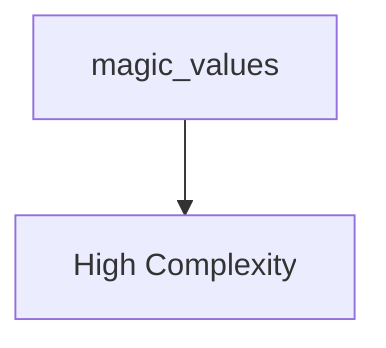

# Architectural Analysis Report

**Project ID:** 1  
**Analysis ID:** `1`  
**Generated:** 2025-08-20 10:35:33 UTC  
**Git Branch:** `unknown`  
**Status:** completed  

---

## Executive Summary

### 📊 Analysis Overview

- **Total Issues Found:** 19
- **Architecture Health Score:** 62.0/100 (Poor)
- **Technical Debt Score:** 100/100 (higher is worse)
- **Files Analyzed:** 0
- **Analysis Status:** completed

### 🚨 Issue Severity Distribution

| Severity | Count | Percentage |
|----------|-------|------------|
| 🔴 Critical | 0 | 0.0% |
| 🟡 High | 4 | 21.1% |
| 🟠 Medium | 15 | 78.9% |
| 🟢 Low | 0 | 0.0% |

## Architecture Overview

### System Architecture

**Architecture Summary:**
- magic_values: Module (Complexity: 19.0)

### Component Metrics

| Component | Type | Complexity | Dependencies |
|-----------|------|------------|-------------|
| magic_values | Module | 19 | 0 |

## Issues Breakdown

### General Issues

#### 🟢 Issue #0

**Message:** Potentially dead code: function 'calculate_area' is not used in this file (confidence: 90.0%)

**File:** `test_projects/anti_patterns/magic_values.rs`:3

---

#### 🟢 Issue #0

**Message:** Potentially dead code: function 'calculate_tax' is not used in this file (confidence: 90.0%)

**File:** `test_projects/anti_patterns/magic_values.rs`:8

---

#### 🟢 Issue #0

**Message:** Potentially dead code: function 'process_status' is not used in this file (confidence: 90.0%)

**File:** `test_projects/anti_patterns/magic_values.rs`:17

---

#### 🟢 Issue #0

**Message:** Potentially dead code: function 'array_operations' is not used in this file (confidence: 90.0%)

**File:** `test_projects/anti_patterns/magic_values.rs`:26

---

#### 🟢 Issue #0

**Message:** Magic number '200' found at line 19. Consider replacing with a named constant.

**File:** `test_projects/anti_patterns/magic_values.rs`:19

---

#### 🟢 Issue #0

**Message:** Magic number '404' found at line 20. Consider replacing with a named constant.

**File:** `test_projects/anti_patterns/magic_values.rs`:20

---

#### 🟢 Issue #0

**Message:** Magic number '500' found at line 21. Consider replacing with a named constant.

**File:** `test_projects/anti_patterns/magic_values.rs`:21

---

#### 🟢 Issue #0

**Message:** Magic number '42' found at line 28. Consider replacing with a named constant.

**File:** `test_projects/anti_patterns/magic_values.rs`:28

---

#### 🟢 Issue #0

**Message:** Magic number '7' found at line 29. Consider replacing with a named constant.

**File:** `test_projects/anti_patterns/magic_values.rs`:29

---

#### 🟢 Issue #0

**Message:** Magic number '13' found at line 30. Consider replacing with a named constant.

**File:** `test_projects/anti_patterns/magic_values.rs`:30

---

#### 🟢 Issue #0

**Message:** Magic number '1000.0' found at line 10. Consider replacing with a named constant.

**File:** `test_projects/anti_patterns/magic_values.rs`:10

---

#### 🟢 Issue #0

**Message:** Magic number '0.15' found at line 11. Consider replacing with a named constant.

**File:** `test_projects/anti_patterns/magic_values.rs`:11

---

#### 🟢 Issue #0

**Message:** Magic number '50.0' found at line 11. Consider replacing with a named constant.

**File:** `test_projects/anti_patterns/magic_values.rs`:11

---

#### 🟢 Issue #0

**Message:** Magic number '25.5' found at line 11. Consider replacing with a named constant.

**File:** `test_projects/anti_patterns/magic_values.rs`:11

---

#### 🟢 Issue #0

**Message:** Magic number '0.08' found at line 13. Consider replacing with a named constant.

**File:** `test_projects/anti_patterns/magic_values.rs`:13

---

#### 🟢 Issue #0

**Message:** Magic number '10.0' found at line 13. Consider replacing with a named constant.

**File:** `test_projects/anti_patterns/magic_values.rs`:13

---

#### 🟢 Issue #0

**Message:** Magic string '"OK"' found at line 19. Consider replacing with a named constant.

**File:** `test_projects/anti_patterns/magic_values.rs`:19

---

#### 🟢 Issue #0

**Message:** Magic string '"Not Found"' found at line 20. Consider replacing with a named constant.

**File:** `test_projects/anti_patterns/magic_values.rs`:20

---

#### 🟢 Issue #0

**Message:** Magic string '"Unknown"' found at line 22. Consider replacing with a named constant.

**File:** `test_projects/anti_patterns/magic_values.rs`:22

---

## Architectural Diagrams

### Dependency Graph

**Component Dependencies:**

### Component Interactions

**Component Summary:**
- magic_values: Located at `test_projects/anti_patterns/magic_values.rs`

## Recommendations

### 📋 General Guidelines

1. **Address Critical Issues First**: Focus on critical and high-severity issues
2. **Implement Gradual Refactoring**: Make incremental improvements
3. **Add Automated Testing**: Ensure changes don't introduce regressions
4. **Code Review Process**: Implement peer reviews for architectural changes
5. **Documentation**: Update architectural documentation after changes

## Appendix

### Analysis Configuration

- **Analysis Engine Version**: 1.0.0
- **Project ID**: 1
- **Status**: completed
- **Files Analyzed**: 0
- **Issues Found**: 19

### About This Report

This report was generated by Uveddi, an architectural analysis tool that helps identify design patterns, anti-patterns, and potential improvements in software architecture.

For more information, visit: [Uveddi Documentation](https://github.com/your-org/uveddi)
