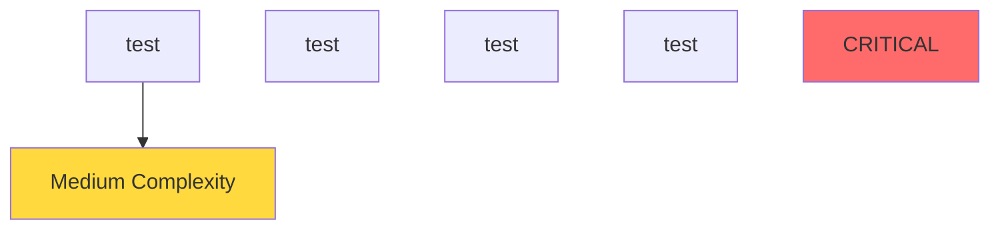
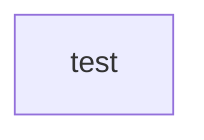

# Architectural Analysis Report

**Project ID:** 1  
**Analysis ID:** `1`  
**Generated:** 2025-08-19 11:54:54 UTC  
**Git Branch:** `unknown`  
**Status:** completed  

---

## Executive Summary

### 📊 Analysis Overview

- **Total Issues Found:** 16
- **Architecture Health Score:** 68.0/100 (Poor)
- **Technical Debt Score:** 100/100 (higher is worse)
- **Files Analyzed:** 0
- **Analysis Status:** completed

### 🚨 Issue Severity Distribution

| Severity | Count | Percentage |
|----------|-------|------------|
| 🔴 Critical | 3 | 18.8% |
| 🟡 High | 13 | 81.2% |
| 🟠 Medium | 0 | 0.0% |
| 🟢 Low | 0 | 0.0% |

## Architecture Overview

### System Architecture

**Architecture Summary:**
- test: Module (Complexity: 13.0)
- test: Module (Complexity: 1.0)
- test: Module (Complexity: 1.0)
- test: Module (Complexity: 1.0)

### Component Metrics

| Component | Type | Complexity | Dependencies |
|-----------|------|------------|-------------|
| test | Module | 13 | 0 |
| test | Module | 1 | 0 |
| test | Module | 1 | 0 |
| test | Module | 1 | 0 |

## Issues Breakdown

### Large Class Issues

#### 🟢 Issue #0

**Message:** God Object detected: 'LargeClass' has 16 methods and 0 fields. (Thresholds: methods>5, fields>8) LCOM4 score: 2 (>1 indicates low cohesion) Methods: 11 trivial, 5 complex

**File:** `test_projects/multi_lang/test.js`:12

---

#### 🟢 Issue #0

**Message:** God Object detected: 'LargeClass' has 13 methods and 10 fields. (Thresholds: methods>5, fields>8) LCOM4 score: 2 (>1 indicates low cohesion) Methods: 9 trivial, 4 complex

**File:** `test_projects/multi_lang/test.py`:10

---

### General Issues

#### 🟢 Issue #0

**Message:** God Object detected: 'LargeStruct' has 10 methods and 10 fields. (Thresholds: methods>5, fields>8) LCOM4 score: 1 (>1 indicates low cohesion) Methods: 0 trivial, 0 complex

**File:** `test_projects/multi_lang/test.rs`:9

---

#### 🟢 Issue #0

**Message:** Potentially dead code: function 'unused_function' is not used in this file (confidence: 90.0%)

**File:** `test_projects/multi_lang/test.rs`:5

---

#### 🟢 Issue #0

**Message:** Potentially dead code: function 'method1' is not used in this file (confidence: 90.0%)

**File:** `test_projects/multi_lang/test.rs`:23

---

#### 🟢 Issue #0

**Message:** Potentially dead code: function 'method2' is not used in this file (confidence: 90.0%)

**File:** `test_projects/multi_lang/test.rs`:24

---

#### 🟢 Issue #0

**Message:** Potentially dead code: function 'method3' is not used in this file (confidence: 90.0%)

**File:** `test_projects/multi_lang/test.rs`:25

---

#### 🟢 Issue #0

**Message:** Potentially dead code: function 'method4' is not used in this file (confidence: 90.0%)

**File:** `test_projects/multi_lang/test.rs`:26

---

#### 🟢 Issue #0

**Message:** Potentially dead code: function 'method5' is not used in this file (confidence: 90.0%)

**File:** `test_projects/multi_lang/test.rs`:27

---

#### 🟢 Issue #0

**Message:** Potentially dead code: function 'method6' is not used in this file (confidence: 90.0%)

**File:** `test_projects/multi_lang/test.rs`:28

---

#### 🟢 Issue #0

**Message:** Potentially dead code: function 'method7' is not used in this file (confidence: 90.0%)

**File:** `test_projects/multi_lang/test.rs`:29

---

#### 🟢 Issue #0

**Message:** Potentially dead code: function 'method8' is not used in this file (confidence: 90.0%)

**File:** `test_projects/multi_lang/test.rs`:30

---

#### 🟢 Issue #0

**Message:** Potentially dead code: function 'method9' is not used in this file (confidence: 90.0%)

**File:** `test_projects/multi_lang/test.rs`:31

---

#### 🟢 Issue #0

**Message:** Potentially dead code: function 'method10' is not used in this file (confidence: 90.0%)

**File:** `test_projects/multi_lang/test.rs`:32

---

#### 🟢 Issue #0

**Message:** Potentially dead code: struct 'LargeStruct' is not used in this file (confidence: 90.0%)

**File:** `test_projects/multi_lang/test.rs`:9

---

#### 🟢 Issue #0

**Message:** God Object detected: 'TestInterface' has 17 methods and 12 fields. (Thresholds: methods>5, fields>8) LCOM4 score: 2 (>1 indicates low cohesion) Methods: 11 trivial, 6 complex

**File:** `test_projects/multi_lang/test.ts`:17

---

## Architectural Diagrams

### Dependency Graph

**Component Dependencies:**

### Component Interactions

**Component Summary:**
- test: Located at `test_projects/multi_lang/test.rs`
- test: Located at `test_projects/multi_lang/test.ts`
- test: Located at `test_projects/multi_lang/test.js`
- test: Located at `test_projects/multi_lang/test.py`

## Recommendations

### 📋 General Guidelines

1. **Address Critical Issues First**: Focus on critical and high-severity issues
2. **Implement Gradual Refactoring**: Make incremental improvements
3. **Add Automated Testing**: Ensure changes don't introduce regressions
4. **Code Review Process**: Implement peer reviews for architectural changes
5. **Documentation**: Update architectural documentation after changes

## Appendix

### Analysis Configuration

- **Analysis Engine Version**: 1.0.0
- **Project ID**: 1
- **Status**: completed
- **Files Analyzed**: 0
- **Issues Found**: 16

### About This Report

This report was generated by Uveddi, an architectural analysis tool that helps identify design patterns, anti-patterns, and potential improvements in software architecture.

For more information, visit: [Uveddi Documentation](https://github.com/your-org/uveddi)
